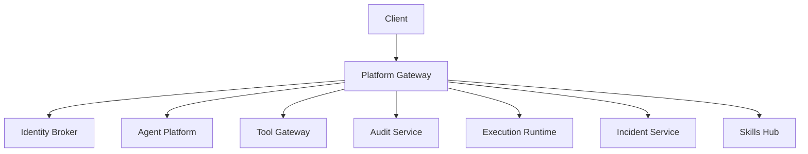
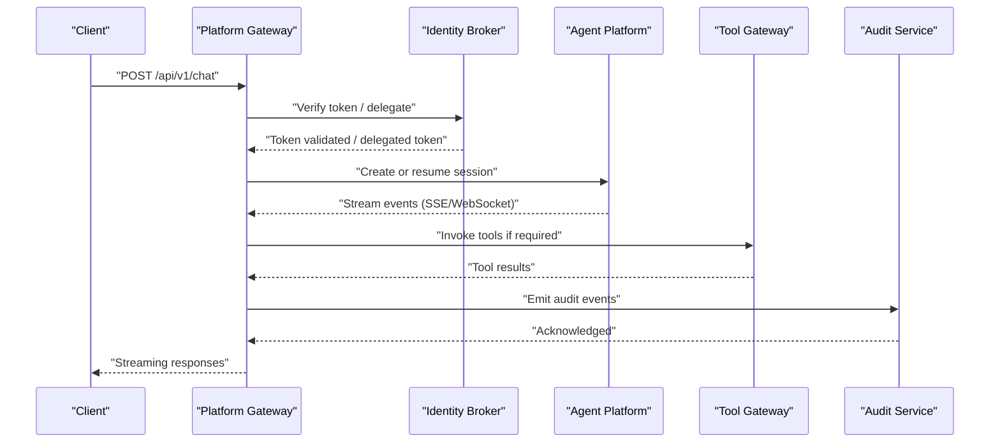
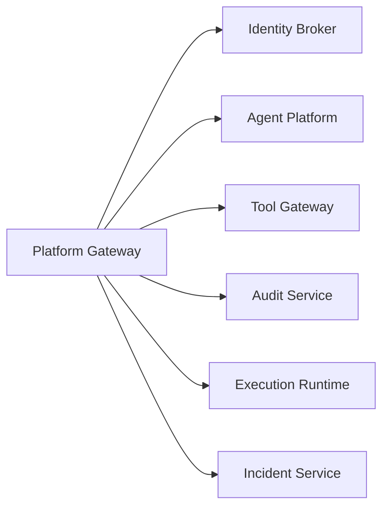

# API Reference

<cite>
**Referenced Files in This Document**
- [README.md](file://README.md)
- [auth.py](file://products/identity-broker/src/identity_service/api/routes/auth.py)
- [webhooks.py](file://products/incident-service/src/incident_service/api/routes/webhooks.py)
- [__init__.py](file://products/platform-gateway/src/platform_gateway/api/routes/__init__.py)
- [chat.py](file://products/platform-gateway/src/platform_gateway/api/routes/chat.py)
- [approvals.py](file://products/platform-gateway/src/platform-gateway/api/routes/approvals.py)
- [audit.py](file://products/platform-gateway/src/platform_gateway/api/routes/audit.py)
- [health.py](file://products/audit-service/src/audit_service/api/routes/health.py)
- [ingest.py](file://products/audit-service/src/audit_service/api/routes/ingest.py)
- [query.py](file://products/audit-service/src/audit_service/api/routes/query.py)
- [summary.py](file://products/audit-service/src/audit_service/api/routes/summary.py)
- [handoff.py](file://products/execution-runtime/src/execution_runtime/api/routes/handoff.py)
- [health.py](file://products/execution-runtime/src/execution_runtime/api/routes/health.py)
- [agent-chat-request.schema.json](file://shared/shared-contracts/schemas/agent-chat-request.schema.json)
- [agent-chat-response.schema.json](file://shared/shared-contracts/schemas/agent-chat-response.schema.json)
- [agent-stream-event.schema.json](file://shared/shared-contracts/schemas/agent-stream-event.schema.json)
- [chat-confirm.schema.json](file://shared/shared-contracts/schemas/chat-confirm.schema.json)
- [chat-request.schema.json](file://shared/shared-contracts/schemas/chat-request.schema.json)
- [chat-response.schema.json](file://shared/shared-contracts/schemas/chat-response.schema.json)
- [identity-token.schema.json](file://shared/shared-contracts/schemas/identity-token.schema.json)
- [identity-context.schema.json](file://shared/shared-contracts/schemas/identity-context.schema.json)
- [incident.schema.json](file://shared/shared-contracts/schemas/incident.schema.json)
- [tool-invocation.schema.json](file://shared/shared-contracts/schemas/tool-invocation.schema.json)
- [tool-result.schema.json](file://shared/shared-contracts/schemas/tool-result.schema.json)
- [stream-event.schema.json](file://shared/shared-contracts/schemas/stream-event.schema.json)
</cite>

## Table of Contents
1. Introduction
2. Project Structure
3. Core Components
4. Architecture Overview
5. Detailed Component Analysis
6. Dependency Analysis
7. Performance Considerations
8. Troubleshooting Guide
9. Conclusion
10. Appendices

## Introduction
This document is the authoritative API reference for the Luban AIOPS platform services. It covers REST endpoints, authentication and authorization flows, shared JSON Schema contracts, real-time streaming interfaces (WebSocket and Server-Sent Events), webhooks, pagination patterns, error handling conventions, and best practices for client implementations. The platform exposes a portal-facing edge through the platform gateway, identity federation via the identity broker, agent orchestration and streaming via the agent platform, tool execution via the tool gateway, durable audit ingestion and querying via the audit service, isolated bounded execution via the execution runtime, incident intake via the incident service, and skill discovery via the skills hub.

The repository organizes capabilities as product-oriented services with explicit integration points and shared contracts under shared/shared-contracts.

**Section sources**
- [README.md:15-54](file://README.md#L15-L54)

## Project Structure
At a high level, clients interact with the platform through:
- Platform Gateway: portal-facing edge for chat, approvals, audit queries, and policy enforcement.
- Identity Broker: SSO login flow, token issuance, JWKS endpoint, and delegated token exchange.
- Agent Platform: session management, model switching, and streaming chat events.
- Tool Gateway: normalized tool invocation and connector access.
- Audit Service: durable event ingest and query APIs.
- Execution Runtime: handoff to isolated workers for bounded actions.
- Incident Service: Alertmanager webhook intake and incident lifecycle.
- Skills Hub: skill ingestion, validation, indexing, and retrieval.

[No sources needed since this diagram shows conceptual workflow, not actual code structure]

## Core Components
- Authentication and Token Management: Provided by the Identity Broker with endpoints for login URL, login start, callback, logout URL, platform token issuance, JWKS, delegated token exchange, and refresh.
- Chat and Streaming: Exposed via the platform gateway and agent platform, using shared schemas for chat requests/responses and stream events.
- Approvals and HITL: Managed through the platform gateway with shared confirmation schemas.
- Audit Ingest and Query: Durable ingestion and permission-scoped query APIs via the audit service.
- Webhooks: Alertmanager webhook intake via the incident service.
- Execution Handoff: Bounded action execution via the execution runtime.

**Section sources**
- [auth.py:34-111](file://products/identity-broker/src/identity_service/api/routes/auth.py#L34-L111)
- [webhooks.py:69-102](file://products/incident-service/src/incident_service/api/routes/webhooks.py#L69-L102)
- [chat.py](file://products/platform-gateway/src/platform_gateway/api/routes/chat.py)
- [approvals.py](file://products/platform-gateway/src/platform_gateway/api/routes/approvals.py)
- [audit.py](file://products/platform-gateway/src/platform_gateway/api/routes/audit.py)
- [ingest.py](file://products/audit-service/src/audit_service/api/routes/ingest.py)
- [query.py](file://products/audit-service/src/audit_service/api/routes/query.py)
- [summary.py](file://products/audit-service/src/audit_service/api/routes/summary.py)
- [handoff.py](file://products/execution-runtime/src/execution_runtime/api/routes/handoff.py)

## Architecture Overview
The platform follows a layered architecture:
- Edge Layer: Platform Gateway enforces policy, verifies tokens, proxies chat/session traffic, and delegates tool calls.
- Identity Layer: Identity Broker handles SSO flows, issues platform tokens, serves JWKS, and supports delegated token exchange for service-to-service trust.
- Domain Services: Agent Platform, Tool Gateway, Audit Service, Execution Runtime, Incident Service, and Skills Hub implement domain-specific capabilities.
- Shared Contracts: JSON Schemas define request/response/event structures across services.

**Diagram sources**
- [auth.py:84-111](file://products/identity-broker/src/identity_service/api/routes/auth.py#L84-L111)
- [chat.py](file://products/platform-gateway/src/platform_gateway/api/routes/chat.py)
- [ingest.py](file://products/audit-service/src/audit_service/api/routes/ingest.py)

## Detailed Component Analysis

### Identity Broker Authentication API
Endpoints:
- GET /api/v1/auth/login-url
  - Purpose: Returns an OIDC authorization URL to initiate login.
  - Headers: x-request-id (optional).
  - Response: Object containing login_url.
  - Errors: None expected; logs auth_login_url_requested.
- GET /api/v1/auth/login
  - Purpose: Starts login flow and returns login context.
  - Headers: x-request-id (optional).
  - Response: LoginStartResponse per schema.
  - Errors: None expected; logs auth_login_started.
- POST /api/v1/auth/callback
  - Purpose: Exchange OIDC authorization code for an authenticated session.
  - Request: AuthorizationCodeExchangeRequest.
  - Response: AuthenticatedSession.
  - Errors: 502 on OIDC token exchange failure.
- POST /api/v1/auth/logout-url
  - Purpose: Returns a logout URL based on provided logout request.
  - Request: LogoutRequest.
  - Response: LogoutResponse.
  - Errors: None expected; logs auth_logout_requested.
- POST /api/v1/auth/token
  - Purpose: Issues a platform access token for a user identity.
  - Request: TokenRequest with username, email, roles, groups.
  - Response: TokenResponse with access_token and expires_in.
  - Errors: None expected; logs platform_token_issued.
- GET /.well-known/jwks.json
  - Purpose: Public JWKS endpoint for token verification.
  - Response: JWKS document.
- POST /api/v1/auth/exchange
  - Purpose: Exchange a verified subject token for a short-lived delegated token.
  - Authentication: Supports HTTP Basic (client_id:secret) or Bearer workload token.
  - Request: TokenExchangeRequest with subject_token and audience.
  - Response: TokenExchangeResponse with access_token and expires_in.
  - Errors: 4xx/5xx from ExchangeError; emits deny audit event on failure.
- POST /api/v1/auth/refresh
  - Purpose: Refreshes an existing session.
  - Request: TokenRefreshRequest.
  - Response: AuthenticatedSession.
  - Errors: 401 on token refresh failure.

Authentication and Authorization:
- Tokens are issued by the Identity Broker and can be verified via JWKS.
- Delegated token exchange supports service-to-service trust using either Basic credentials or projected workload tokens.

Rate Limiting:
- Not specified in route files; apply at gateway or deployment layer as appropriate.

Pagination:
- Not applicable for these endpoints.

Examples:
- See schema references for request/response shapes:
  - [identity-token.schema.json](file://shared/shared-contracts/schemas/identity-token.schema.json)
  - [identity-context.schema.json](file://shared/shared-contracts/schemas/identity-context.schema.json)

Error Handling Patterns:
- Standardized error objects returned by services where applicable.
- Audit events emitted for security-sensitive operations like token exchange.

**Section sources**
- [auth.py:34-111](file://products/identity-broker/src/identity_service/api/routes/auth.py#L34-L111)
- [auth.py:114-183](file://products/identity-broker/src/identity_service/api/routes/auth.py#L114-L183)
- [auth.py:214-231](file://products/identity-broker/src/identity_service/api/routes/auth.py#L214-L231)
- [identity-token.schema.json](file://shared/shared-contracts/schemas/identity-token.schema.json)
- [identity-context.schema.json](file://shared/shared-contracts/schemas/identity-context.schema.json)

### Platform Gateway Chat and Streaming API
Endpoints:
- Chat endpoints are defined under platform gateway routes and proxy to the agent platform.
- Streaming uses shared stream event schemas for SSE or WebSocket payloads.

Authentication and Authorization:
- Requests are typically authenticated via tokens verified by the platform gateway.
- Policy enforcement occurs at the gateway before proxying to downstream services.

Streaming Interfaces:
- Real-time chat streaming uses shared schemas:
  - [agent-stream-event.schema.json](file://shared/shared-contracts/schemas/agent-stream-event.schema.json)
  - [stream-event.schema.json](file://shared/shared-contracts/schemas/stream-event.schema.json)

Pagination:
- Not applicable for streaming; list endpoints may support pagination parameters as implemented by specific routes.

Examples:
- Chat request/response shapes:
  - [chat-request.schema.json](file://shared/shared-contracts/schemas/chat-request.schema.json)
  - [chat-response.schema.json](file://shared/shared-contracts/schemas/chat-response.schema.json)
- Agent-specific chat schemas:
  - [agent-chat-request.schema.json](file://shared/shared-contracts/schemas/agent-chat-request.schema.json)
  - [agent-chat-response.schema.json](file://shared/shared-contracts/schemas/agent-chat-response.schema.json)

**Section sources**
- [chat.py](file://products/platform-gateway/src/platform_gateway/api/routes/chat.py)
- [chat-request.schema.json](file://shared/shared-contracts/schemas/chat-request.schema.json)
- [chat-response.schema.json](file://shared/shared-contracts/schemas/chat-response.schema.json)
- [agent-chat-request.schema.json](file://shared/shared-contracts/schemas/agent-chat-request.schema.json)
- [agent-chat-response.schema.json](file://shared/shared-contracts/schemas/agent-chat-response.schema.json)
- [agent-stream-event.schema.json](file://shared/shared-contracts/schemas/agent-stream-event.schema.json)
- [stream-event.schema.json](file://shared/shared-contracts/schemas/stream-event.schema.json)

### Platform Gateway Approvals and HITL API
Endpoints:
- Approval-related endpoints are exposed under platform gateway routes for human-in-the-loop confirmations.

Authentication and Authorization:
- Requires authenticated sessions with appropriate scopes to approve or reject actions.

Shared Schemas:
- Confirmation payloads and decisions use:
  - [chat-confirm.schema.json](file://shared/shared-contracts/schemas/chat-confirm.schema.json)

Examples:
- Submit approval or rejection decisions using the confirmation schema.

**Section sources**
- [approvals.py](file://products/platform-gateway/src/platform_gateway/api/routes/approvals.py)
- [chat-confirm.schema.json](file://shared/shared-contracts/schemas/chat-confirm.schema.json)

### Audit Service API
Endpoints:
- Health: GET /api/v1/health
  - Purpose: Service health check.
  - Response: Health status object.
- Ingest: POST /api/v1/events
  - Purpose: Ingest audit events into durable storage.
  - Authentication: Typically requires service-level credentials or token.
  - Request: Event payload conforming to audit event schema.
  - Response: Acknowledgement.
- Query: GET /api/v1/audit
  - Purpose: Permission-scoped query API for audit events.
  - Authentication: Requires audit:read scope or equivalent.
  - Pagination: Supported via query parameters as implemented by route.
  - Response: Paginated list of audit events.
- Summary: GET /api/v1/audit/summary
  - Purpose: Aggregated audit summary data.
  - Authentication: Requires audit:read scope or equivalent.
  - Response: Summary object.

Authentication and Authorization:
- Ingest endpoints require service credentials.
- Query endpoints enforce read-only scopes.

Rate Limiting:
- Apply at gateway or deployment layer as appropriate.

Examples:
- Event schema:
  - [audit-event.schema.json](file://shared/shared-contracts/schemas/audit-event.schema.json)

**Section sources**
- [health.py](file://products/audit-service/src/audit_service/api/routes/health.py)
- [ingest.py](file://products/audit-service/src/audit_service/api/routes/ingest.py)
- [query.py](file://products/audit-service/src/audit_service/api/routes/query.py)
- [summary.py](file://products/audit-service/src/audit_service/api/routes/summary.py)
- [audit-event.schema.json](file://shared/shared-contracts/schemas/audit-event.schema.json)

### Execution Runtime API
Endpoints:
- Handoff: POST /api/v1/handoff
  - Purpose: Submit bounded operational actions to isolated workers.
  - Authentication: Requires service-level credentials or delegated token.
  - Request: Execution request conforming to execution schema.
  - Response: Receipt acknowledging submission.
- Health: GET /api/v1/health
  - Purpose: Service health check.

Authentication and Authorization:
- Enforced via delegated tokens or service credentials.

Shared Schemas:
- Execution request/receipt:
  - [execution-request.schema.json](file://shared/shared-contracts/schemas/execution-request.schema.json)
  - [execution-receipt.schema.json](file://shared/shared-contracts/schemas/execution-receipt.schema.json)

**Section sources**
- [handoff.py](file://products/execution-runtime/src/execution_runtime/api/routes/handoff.py)
- [health.py](file://products/execution-runtime/src/execution_runtime/api/routes/health.py)
- [execution-request.schema.json](file://shared/shared-contracts/schemas/execution-request.schema.json)
- [execution-receipt.schema.json](file://shared/shared-contracts/schemas/execution-receipt.schema.json)

### Incident Service Webhook API
Endpoints:
- POST /api/v1/webhooks/alertmanager
  - Purpose: Intake Alertmanager alerts and normalize them into incidents.
  - Authentication: Requires bearer token configured via INCIDENT_WEBHOOK_TOKEN.
  - Request: Alertmanager alert payload.
  - Response: Action outcome (created, updated, resolved, ignored) with incident_id and fingerprint.
  - Errors:
    - 503 WEBHOOK_NOT_CONFIGURED when token is not set.
    - 401 UNAUTHORIZED for invalid token.
    - 400 INVALID_PAYLOAD for malformed JSON or normalization errors.

Deduplication:
- Fingerprint-based dedupe updates open incidents; resolution closes known incidents; unknown resolution is idempotent no-op.

Shared Schemas:
- Incident model:
  - [incident.schema.json](file://shared/shared-contracts/schemas/incident.schema.json)

**Section sources**
- [webhooks.py:69-102](file://products/incident-service/src/incident_service/api/routes/webhooks.py#L69-L102)
- [webhooks.py:105-144](file://products/incident-service/src/incident_service/api/routes/webhooks.py#L105-L144)
- [webhooks.py:147-205](file://products/incident-service/src/incident_service/api/routes/webhooks.py#L147-L205)
- [incident.schema.json](file://shared/shared-contracts/schemas/incident.schema.json)

### Tool Invocation and Results
While tool invocation endpoints are primarily internal to the tool gateway, the shared schemas define the contract for tool invocations and results used across the platform.

Shared Schemas:
- Tool invocation:
  - [tool-invocation.schema.json](file://shared/shared-contracts/schemas/tool-invocation.schema.json)
- Tool result:
  - [tool-result.schema.json](file://shared/shared-contracts/schemas/tool-result.schema.json)

**Section sources**
- [tool-invocation.schema.json](file://shared/shared-contracts/schemas/tool-invocation.schema.json)
- [tool-result.schema.json](file://shared/shared-contracts/schemas/tool-result.schema.json)

## Dependency Analysis
Service dependencies and interactions:
- Platform Gateway depends on Identity Broker for authentication and policy enforcement.
- Platform Gateway proxies to Agent Platform for chat and session management.
- Platform Gateway invokes Tool Gateway for tool execution.
- All services emit audit events consumed by Audit Service.
- Execution Runtime receives handoffs for bounded actions.
- Incident Service ingests external webhooks and integrates with platform workflows.

[No sources needed since this diagram shows conceptual relationships, not mapped to specific source files]

**Section sources**
- [__init__.py](file://products/platform-gateway/src/platform_gateway/api/routes/__init__.py)

## Performance Considerations
- Streaming: Use SSE or WebSocket for long-running chat sessions to minimize latency and reduce overhead.
- Rate Limiting: Apply at gateway or deployment layer to protect backend services.
- Pagination: Implement cursor or offset-based pagination for list endpoints to handle large datasets efficiently.
- Caching: Cache static configuration and metadata where appropriate to reduce load.
- Backpressure: Ensure streaming consumers handle backpressure to prevent memory pressure.

[No sources needed since this section provides general guidance]

## Troubleshooting Guide
Common issues and resolutions:
- Authentication failures:
  - Verify token validity and expiration.
  - Ensure JWKS endpoint is reachable for token verification.
- Webhook ingestion failures:
  - Confirm INCIDENT_WEBHOOK_TOKEN is configured.
  - Validate incoming JSON payload and normalization rules.
- Audit query failures:
  - Check required scopes (e.g., audit:read).
  - Validate query parameters and filters.
- Streaming interruptions:
  - Implement reconnection logic with exponential backoff.
  - Monitor server-side resource usage and adjust limits.

Error response pattern example:
- { "error": { "code": "...", "message": "..." } }

**Section sources**
- [webhooks.py:46-50](file://products/incident-service/src/incident_service/api/routes/webhooks.py#L46-L50)

## Conclusion
The Luban AIOPS platform provides a comprehensive set of APIs for authentication, chat streaming, approvals, auditing, execution, and incident management. Clients should rely on shared JSON Schemas for contract compliance, implement robust authentication and error handling, and follow best practices for streaming and pagination. The platform gateway centralizes policy enforcement and token verification, while domain services deliver specialized capabilities with clear integration points.

[No sources needed since this section summarizes without analyzing specific files]

## Appendices

### Shared JSON Schema Definitions
- Chat and Session:
  - [chat-request.schema.json](file://shared/shared-contracts/schemas/chat-request.schema.json)
  - [chat-response.schema.json](file://shared/shared-contracts/schemas/chat-response.schema.json)
  - [agent-chat-request.schema.json](file://shared/shared-contracts/schemas/agent-chat-request.schema.json)
  - [agent-chat-response.schema.json](file://shared/shared-contracts/schemas/agent-chat-response.schema.json)
- Streaming:
  - [agent-stream-event.schema.json](file://shared/shared-contracts/schemas/agent-stream-event.schema.json)
  - [stream-event.schema.json](file://shared/shared-contracts/schemas/stream-event.schema.json)
- Identity:
  - [identity-token.schema.json](file://shared/shared-contracts/schemas/identity-token.schema.json)
  - [identity-context.schema.json](file://shared/shared-contracts/schemas/identity-context.schema.json)
- Incidents:
  - [incident.schema.json](file://shared/shared-contracts/schemas/incident.schema.json)
- Tools:
  - [tool-invocation.schema.json](file://shared/shared-contracts/schemas/tool-invocation.schema.json)
  - [tool-result.schema.json](file://shared/shared-contracts/schemas/tool-result.schema.json)
- Approvals:
  - [chat-confirm.schema.json](file://shared/shared-contracts/schemas/chat-confirm.schema.json)

### Versioning and Backward Compatibility
- Versioned paths: Endpoints use /api/v1 prefixes to support versioning.
- Contract stability: Shared schemas define stable contracts; changes should maintain backward compatibility where possible.
- Deprecation strategy: Announce deprecations in release notes and provide migration windows.

[No sources needed since this section provides general guidance]

### Best Practices for Client Implementations
- Authentication:
  - Use Identity Broker login flow and refresh tokens appropriately.
  - Validate tokens against JWKS for service-to-service calls.
- Streaming:
  - Implement reconnect logic and handle partial messages.
  - Respect backpressure and buffer sizes.
- Error Handling:
  - Parse standardized error objects and log contextual information.
  - Retry transient errors with exponential backoff.
- Pagination:
  - Use cursor-based pagination for efficient large dataset handling.
- Security:
  - Never log sensitive tokens or payloads.
  - Validate all inputs and sanitize outputs.

[No sources needed since this section provides general guidance]