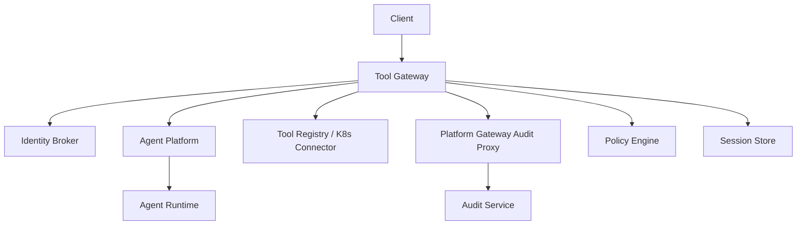
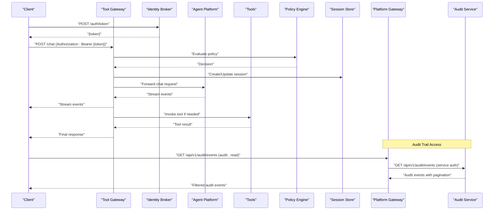
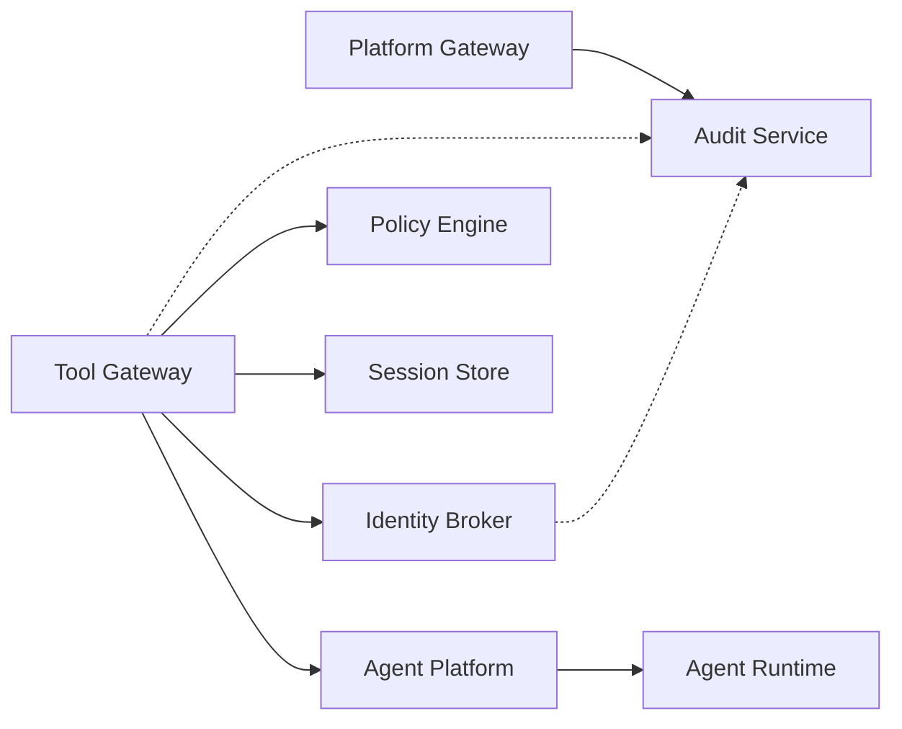

# API Reference

<cite>
**Referenced Files in This Document**
- [README.md](file://README.md)
- [agent-platform/README.md](file://products/agent-platform/README.md)
- [identity-broker/README.md](file://products/identity-broker/README.md)
- [tool-gateway/README.md](file://products/tool-gateway/README.md)
- [audit-service/README.md](file://products/audit-service/README.md)
- [agent-platform/src/agent_service/api/v2/routes.py](file://products/agent-platform/src/agent_service/api/v2/routes.py)
- [agent-platform/src/agent_service/schemas/v2.py](file://products/agent-platform/src/agent_service/schemas/v2.py)
- [identity-broker/src/identity_service/api/routes/auth.py](file://products/identity-broker/src/identity_service/api/routes/auth.py)
- [identity-broker/src/identity_service/api/routes/identity.py](file://products/identity-broker/src/identity_service/api/routes/identity.py)
- [identity-broker/src/identity_service/schemas/auth.py](file://products/identity-broker/src/identity_service/schemas/auth.py)
- [identity-broker/src/identity_service/schemas/identity.py](file://products/identity-broker/src/identity_service/schemas/identity.py)
- [tool-gateway/src/api_gateway/api/routes/chat.py](file://products/tool-gateway/src/api_gateway/api/routes/chat.py)
- [tool-gateway/src/api_gateway/api/routes/runtime.py](file://products/tool-gateway/src/api_gateway/api/routes/runtime.py)
- [tool-gateway/src/api_gateway/api/routes/sessions.py](file://products/tool-gateway/src/api_gateway/api/routes/sessions.py)
- [tool-gateway/src/api_gateway/api/routes/tools.py](file://products/tool-gateway/src/api_gateway/api/routes/tools.py)
- [tool-gateway/src/api_gateway/api/routes/auth.py](file://products/tool-gateway/src/api_gateway/api/routes/auth.py)
- [tool-gateway/src/api_gateway/schemas/api.py](file://products/tool-gateway/src/api_gateway/schemas/api.py)
- [platform-gateway/src/platform_gateway/api/routes/audit.py](file://products/platform-gateway/src/platform_gateway/api/routes/audit.py)
- [audit-service/src/audit_service/api/router.py](file://products/audit-service/src/audit_service/api/router.py)
- [audit-service/src/audit_service/api/routes/ingest.py](file://products/audit-service/src/audit_service/api/routes/ingest.py)
- [audit-service/src/audit_service/api/routes/query.py](file://products/audit-service/src/audit_service/api/routes/query.py)
- [audit-service/src/audit_service/api/routes/health.py](file://products/audit-service/src/audit_service/api/routes/health.py)
- [audit-service/src/audit_service/core/metrics.py](file://products/audit-service/src/audit_service/core/metrics.py)
- [audit-service/src/audit_service/schemas/audit.py](file://products/audit-service/src/audit_service/schemas/audit.py)
- [shared-contracts/schemas/chat-request.schema.json](file://shared-contracts/schemas/chat-request.schema.json)
- [shared-contracts/schemas/chat-response.schema.json](file://shared-contracts/schemas/chat-response.schema.json)
- [shared-contracts/schemas/agent-chat-request.schema.json](file://shared-contracts/schemas/agent-chat-request.schema.json)
- [shared-contracts/schemas/agent-chat-response.schema.json](file://shared-contracts/schemas/agent-chat-response.schema.json)
- [shared-contracts/schemas/stream-event.schema.json](file://shared-contracts/schemas/stream-event.schema.json)
- [shared-contracts/schemas/agent-stream-event.schema.json](file://shared-contracts/schemas/agent-stream-event.schema.json)
- [shared-contracts/schemas/session.schema.json](file://shared-contracts/schemas/session.schema.json)
- [shared-contracts/schemas/agent-session.schema.json](file://shared-contracts/schemas/agent-session.schema.json)
- [shared-contracts/schemas/identity-token.schema.json](file://shared-contracts/schemas/identity-token.schema.json)
- [shared-contracts/schemas/identity-context.schema.json](file://shared-contracts/schemas/identity-context.schema.json)
- [shared-contracts/schemas/tool-invocation.schema.json](file://shared-contracts/schemas/tool-invocation.schema.json)
- [shared-contracts/schemas/tool-result.schema.json](file://shared-contracts/schemas/tool-result.schema.json)
- [shared-contracts/schemas/policy-decision.schema.json](file://shared-contracts/schemas/policy-decision.schema.json)
- [shared-contracts/schemas/policy-rule.schema.json](file://shared-contracts/schemas/policy-rule.schema.json)
- [shared-contracts/schemas/health-response.schema.json](file://shared-contracts/schemas/health-response.schema.json)
- [shared-contracts/schemas/agent-health.schema.json](file://shared-contracts/schemas/agent-health.schema.json)
- [shared-contracts/schemas/agent-runtime-metadata.schema.json](file://shared-contracts/schemas/agent-runtime-metadata.schema.json)
- [shared-contracts/schemas/audit-event.schema.json](file://shared-contracts/schemas/audit-event.schema.json)
</cite>

## Update Summary
**Changes Made**
- Added new Audit Service REST API section with ingestion and query endpoints
- Updated architecture diagrams to include audit service integration
- Added audit event schema documentation and usage patterns
- Enhanced platform gateway audit proxy functionality documentation
- Added metrics and health endpoint documentation for audit service

## Table of Contents
1. [Introduction](#introduction)
2. [Project Structure](#project-structure)
3. [Core Components](#core-components)
4. [Architecture Overview](#architecture-overview)
5. [Detailed Component Analysis](#detailed-component-analysis)
6. [Dependency Analysis](#dependency-analysis)
7. [Performance Considerations](#performance-considerations)
8. [Troubleshooting Guide](#troubleshooting-guide)
9. [Conclusion](#conclusion)
10. [Appendices](#appendices)

## Introduction
This document provides a comprehensive API reference for the Luban AIOps Platform, covering REST endpoints for agent interactions, identity management, audit trail management, and platform administration, as well as WebSocket APIs for real-time streaming and long-running operations. It includes HTTP methods, URL patterns, request/response schemas, authentication requirements, error codes, retry strategies, client examples, versioning and deprecation policies, migration guidance, testing strategies, and debugging techniques.

The platform exposes:
- Agent Platform REST APIs (v2) for chat, sessions, runtime metadata, and health.
- Identity Broker REST APIs for authentication, token issuance, and identity context.
- Tool Gateway REST APIs for chat orchestration, session lifecycle, tool invocation, runtime configuration, and policy enforcement.
- **Audit Service REST APIs for durable audit trail ingestion, querying, and monitoring.**
- Shared JSON Schemas defining contracts across components.

[No sources needed since this section doesn't analyze specific files]

## Project Structure
At a high level, the API surface is implemented across four services:
- Agent Platform: v2 REST endpoints for agent chat, sessions, runtime metadata, and health.
- Identity Broker: Authentication, token issuance, and identity context endpoints.
- Tool Gateway: Orchestration layer that enforces policies, manages sessions, invokes tools, and proxies to agents.
- **Audit Service: Durable audit trail storage with ingestion, querying, and monitoring capabilities.**

**Diagram sources**
- [tool-gateway/src/api_gateway/api/routes/chat.py](file://products/tool-gateway/src/api_gateway/api/routes/chat.py)
- [tool-gateway/src/api_gateway/api/routes/sessions.py](file://products/tool-gateway/src/api_gateway/api/routes/sessions.py)
- [tool-gateway/src/api_gateway/api/routes/tools.py](file://products/tool-gateway/src/api_gateway/api/routes/tools.py)
- [tool-gateway/src/api_gateway/api/routes/runtime.py](file://products/tool-gateway/src/api_gateway/api/routes/runtime.py)
- [tool-gateway/src/api_gateway/api/routes/auth.py](file://products/tool-gateway/src/api_gateway/api/routes/auth.py)
- [agent-platform/src/agent_service/api/v2/routes.py](file://products/agent-platform/src/agent_service/api/v2/routes.py)
- [identity-broker/src/identity_service/api/routes/auth.py](file://products/identity-broker/src/identity_service/api/routes/auth.py)
- [identity-broker/src/identity_service/api/routes/identity.py](file://products/identity-broker/src/identity_service/api/routes/identity.py)
- [platform-gateway/src/platform_gateway/api/routes/audit.py](file://products/platform-gateway/src/platform_gateway/api/routes/audit.py)
- [audit-service/src/audit_service/api/router.py](file://products/audit-service/src/audit_service/api/router.py)

**Section sources**
- [README.md](file://README.md)
- [agent-platform/README.md](file://products/agent-platform/README.md)
- [identity-broker/README.md](file://products/identity-broker/README.md)
- [tool-gateway/README.md](file://products/tool-gateway/README.md)
- [audit-service/README.md](file://products/audit-service/README.md)

## Core Components
- Agent Platform (v2): Provides chat, session, runtime metadata, and health endpoints with typed schemas.
- Identity Broker: Issues tokens and resolves identity contexts; used by clients and gateway for authorization.
- Tool Gateway: Central entrypoint for clients; enforces policies, manages sessions, invokes tools, and streams results.
- **Audit Service: Durable audit trail service providing ingestion, querying, and monitoring capabilities with PostgreSQL backend support.**

Key responsibilities:
- Authentication and token handling via Identity Broker.
- Chat orchestration and streaming via Tool Gateway and Agent Platform.
- Session persistence and lifecycle management.
- Tool invocation through a registry and connectors.
- **Durable audit trail storage with filtering, pagination, and retention policies.**

**Section sources**
- [agent-platform/src/agent_service/api/v2/routes.py](file://products/agent-platform/src/agent_service/api/v2/routes.py)
- [agent-platform/src/agent_service/schemas/v2.py](file://products/agent-platform/src/agent_service/schemas/v2.py)
- [identity-broker/src/identity_service/api/routes/auth.py](file://products/identity-broker/src/identity_service/api/routes/auth.py)
- [identity-broker/src/identity_service/api/routes/identity.py](file://products/identity-broker/src/identity_service/api/routes/identity.py)
- [tool-gateway/src/api_gateway/api/routes/chat.py](file://products/tool-gateway/src/api_gateway/api/routes/chat.py)
- [tool-gateway/src/api_gateway/api/routes/sessions.py](file://products/tool-gateway/src/api_gateway/api/routes/sessions.py)
- [tool-gateway/src/api_gateway/api/routes/tools.py](file://products/tool-gateway/src/api_gateway/api/routes/tools.py)
- [tool-gateway/src/api_gateway/api/routes/runtime.py](file://products/tool-gateway/src/api_gateway/api/routes/runtime.py)
- [tool-gateway/src/api_gateway/api/routes/auth.py](file://products/tool-gateway/src/api_gateway/api/routes/auth.py)
- [audit-service/src/audit_service/api/routes/ingest.py](file://products/audit-service/src/audit_service/api/routes/ingest.py)
- [audit-service/src/audit_service/api/routes/query.py](file://products/audit-service/src/audit_service/api/routes/query.py)

## Architecture Overview
The Tool Gateway acts as the primary API boundary. Clients authenticate against the Identity Broker, then interact with the Gateway for chat, sessions, and tool invocations. The Gateway enforces policies, persists sessions, and delegates execution to the Agent Platform and tool connectors. **The Platform Gateway provides an audit trail proxy that enforces user-level authorization before accessing the Audit Service.**

**Diagram sources**
- [tool-gateway/src/api_gateway/api/routes/chat.py](file://products/tool-gateway/src/api_gateway/api/routes/chat.py)
- [tool-gateway/src/api_gateway/api/routes/sessions.py](file://products/tool-gateway/src/api_gateway/api/routes/sessions.py)
- [tool-gateway/src/api_gateway/api/routes/tools.py](file://products/tool-gateway/src/api_gateway/api/routes/tools.py)
- [tool-gateway/src/api_gateway/api/routes/auth.py](file://products/tool-gateway/src/api_gateway/api/routes/auth.py)
- [agent-platform/src/agent_service/api/v2/routes.py](file://products/agent-platform/src/agent_service/api/v2/routes.py)
- [identity-broker/src/identity_service/api/routes/auth.py](file://products/identity-broker/src/identity_service/api/routes/auth.py)
- [platform-gateway/src/platform_gateway/api/routes/audit.py](file://products/platform-gateway/src/platform_gateway/api/routes/audit.py)
- [audit-service/src/audit_service/api/routes/query.py](file://products/audit-service/src/audit_service/api/routes/query.py)

## Detailed Component Analysis

### Tool Gateway REST API
Primary endpoints for chat, sessions, tools, runtime, and auth proxying.

- Chat
  - POST /api/v1/chat
  - Description: Start or continue a chat conversation; supports streaming responses.
  - Authentication: Bearer token from Identity Broker.
  - Request schema: See shared chat-request schema.
  - Response schema: See shared chat-response schema; streaming uses stream-event schema.
  - Error codes: Standard HTTP status codes plus domain-specific errors (e.g., policy denied).

- Sessions
  - GET /api/v1/sessions/{session_id}
  - PUT /api/v1/sessions/{session_id}
  - DELETE /api/v1/sessions/{session_id}
  - Description: Manage session state and lifecycle.
  - Authentication: Bearer token.
  - Request/response schemas: See session schema.

- Tools
  - POST /api/v1/tools/{tool_name}/invoke
  - Description: Invoke a registered tool with parameters.
  - Authentication: Bearer token.
  - Request/response schemas: See tool-invocation and tool-result schemas.

- Runtime
  - GET /api/v1/runtime/config
  - Description: Retrieve runtime configuration settings.
  - Authentication: Bearer token.
  - Response schema: Configuration object defined by service.

- Auth Proxy
  - POST /api/v1/auth/token
  - Description: Forward authentication requests to Identity Broker.
  - Request/response schemas: See identity-token schema.

Streaming and WebSockets
- WS /api/v1/ws/chat?session_id={id}
- Description: Real-time streaming of chat events and tool results.
- Events: Stream event payloads conform to stream-event schema.

Error Handling
- Common HTTP statuses: 200 OK, 400 Bad Request, 401 Unauthorized, 403 Forbidden, 404 Not Found, 409 Conflict, 422 Unprocessable Entity, 429 Too Many Requests, 500 Internal Server Error, 503 Service Unavailable.
- Domain errors: Policy decision failures, tool invocation errors, session conflicts.

Retry Strategy
- Exponential backoff with jitter for transient errors (429, 503).
- Idempotent retries for GET and safe operations; avoid re-sending non-idempotent writes without correlation IDs.
- Use correlation IDs from responses to correlate retries.

**Section sources**
- [tool-gateway/src/api_gateway/api/routes/chat.py](file://products/tool-gateway/src/api_gateway/api/routes/chat.py)
- [tool-gateway/src/api_gateway/api/routes/sessions.py](file://products/tool-gateway/src/api_gateway/api/routes/sessions.py)
- [tool-gateway/src/api_gateway/api/routes/tools.py](file://products/tool-gateway/src/api_gateway/api/routes/tools.py)
- [tool-gateway/src/api_gateway/api/routes/runtime.py](file://products/tool-gateway/src/api_gateway/api/routes/runtime.py)
- [tool-gateway/src/api_gateway/api/routes/auth.py](file://products/tool-gateway/src/api_gateway/api/routes/auth.py)
- [tool-gateway/src/api_gateway/schemas/api.py](file://products/tool-gateway/src/api_gateway/schemas/api.py)
- [shared-contracts/schemas/chat-request.schema.json](file://shared-contracts/schemas/chat-request.schema.json)
- [shared-contracts/schemas/chat-response.schema.json](file://shared-contracts/schemas/chat-response.schema.json)
- [shared-contracts/schemas/stream-event.schema.json](file://shared-contracts/schemas/stream-event.schema.json)
- [shared-contracts/schemas/session.schema.json](file://shared-contracts/schemas/session.schema.json)
- [shared-contracts/schemas/tool-invocation.schema.json](file://shared-contracts/schemas/tool-invocation.schema.json)
- [shared-contracts/schemas/tool-result.schema.json](file://shared-contracts/schemas/tool-result.schema.json)
- [shared-contracts/schemas/identity-token.schema.json](file://shared-contracts/schemas/identity-token.schema.json)

### Agent Platform REST API (v2)
Endpoints for agent chat, sessions, runtime metadata, and health.

- Chat
  - POST /api/v2/chat
  - Description: Submit chat messages to an agent; supports streaming.
  - Authentication: Bearer token validated by gateway; direct calls may require token.
  - Request schema: See agent-chat-request schema.
  - Response schema: See agent-chat-response schema; streaming uses agent-stream-event schema.

- Sessions
  - GET /api/v2/sessions/{session_id}
  - PUT /api/v2/sessions/{session_id}
  - DELETE /api/v2/sessions/{session_id}
  - Description: Manage agent-side session state.
  - Request/response schemas: See agent-session schema.

- Runtime Metadata
  - GET /api/v2/runtime/metadata
  - Description: Retrieve runtime capabilities and configuration.
  - Response schema: See agent-runtime-metadata schema.

- Health
  - GET /api/v2/health
  - Description: Readiness and liveness checks.
  - Response schema: See agent-health schema.

Streaming and WebSockets
- WS /api/v2/ws/chat?session_id={id}
- Description: Real-time streaming of agent events.
- Events: Agent stream event payloads conform to agent-stream-event schema.

Error Handling
- Standard HTTP statuses; domain-specific errors include invalid payload, session not found, provider errors.

Retry Strategy
- Same as Tool Gateway; prefer idempotency keys for reliable retries.

**Section sources**
- [agent-platform/src/agent_service/api/v2/routes.py](file://products/agent-platform/src/agent_service/api/v2/routes.py)
- [agent-platform/src/agent_service/schemas/v2.py](file://products/agent-platform/src/agent_service/schemas/v2.py)
- [shared-contracts/schemas/agent-chat-request.schema.json](file://shared-contracts/schemas/agent-chat-request.schema.json)
- [shared-contracts/schemas/agent-chat-response.schema.json](file://shared-contracts/schemas/agent-chat-response.schema.json)
- [shared-contracts/schemas/agent-stream-event.schema.json](file://shared-contracts/schemas/agent-stream-event.schema.json)
- [shared-contracts/schemas/agent-session.schema.json](file://shared-contracts/schemas/agent-session.schema.json)
- [shared-contracts/schemas/agent-runtime-metadata.schema.json](file://shared-contracts/schemas/agent-runtime-metadata.schema.json)
- [shared-contracts/schemas/agent-health.schema.json](file://shared-contracts/schemas/agent-health.schema.json)

### Identity Broker REST API
Authentication and identity context endpoints.

- Auth
  - POST /auth/token
  - Description: Issue access tokens using credentials or client assertions.
  - Request schema: See identity-token schema.
  - Response schema: Access token payload and metadata.

- Identity Context
  - GET /identity/context
  - Description: Resolve current identity context from token.
  - Authentication: Bearer token.
  - Response schema: See identity-context schema.

- Health
  - GET /health
  - Description: Service health check.
  - Response schema: See health-response schema.

Error Handling
- 400 Bad Request for invalid inputs.
- 401 Unauthorized for missing/invalid tokens.
- 403 Forbidden for insufficient permissions.
- 429 Too Many Requests for rate limiting.
- 5xx for server errors.

Retry Strategy
- Retry on 429 with exponential backoff; do not retry on 400/401/403 unless input changes.

**Section sources**
- [identity-broker/src/identity_service/api/routes/auth.py](file://products/identity-broker/src/identity_service/api/routes/auth.py)
- [identity-broker/src/identity_service/api/routes/identity.py](file://products/identity-broker/src/identity_service/api/routes/identity.py)
- [identity-broker/src/identity_service/schemas/auth.py](file://products/identity-broker/src/identity_service/schemas/auth.py)
- [identity-broker/src/identity_service/schemas/identity.py](file://products/identity-broker/src/identity_service/schemas/identity.py)
- [shared-contracts/schemas/identity-token.schema.json](file://shared-contracts/schemas/identity-token.schema.json)
- [shared-contracts/schemas/identity-context.schema.json](file://shared-contracts/schemas/identity-context.schema.json)
- [shared-contracts/schemas/health-response.schema.json](file://shared-contracts/schemas/health-response.schema.json)

### Audit Service REST API
**New** Durable audit trail service providing ingestion, querying, and monitoring capabilities.

- Event Ingestion
  - POST /api/v1/audit/events
  - Description: Ingest batches of audit events from registered platform services.
  - Authentication: Service identity credential (client_id/client_secret).
  - Request schema: IngestRequest with array of AuditEvent objects.
  - Response schema: Acceptance confirmation with counts.
  - Error codes: 202 Accepted, 400 Bad Request (malformed batch), 401 Unauthorized (auth failure).

- Event Querying
  - GET /api/v1/audit/events
  - Description: Query stored audit events with filtering and keyset cursor pagination.
  - Authentication: Service identity credential (client_id/client_secret).
  - Query Parameters: username, session_id, request_id, event_type, service, since, until, cursor, limit.
  - Response schema: Paginated results with next_cursor for continuation.
  - Error codes: 200 OK, 400 Bad Request (invalid cursor/filter), 401 Unauthorized.

- Health Endpoints
  - GET /health/live
  - Description: Liveness probe returning service status and version.
  - Response schema: Basic health information.

  - GET /health/ready
  - Description: Readiness probe checking store backend availability.
  - Response schema: Detailed readiness status including store backend info.

- Metrics Endpoint
  - GET /metrics
  - Description: Prometheus metrics for monitoring audit service performance.
  - Authentication: None (internal monitoring).
  - Response: Prometheus format metrics data.

Authentication and Security
- All audit endpoints require service identity authentication using client credentials.
- User-level authorization for audit queries is enforced at the Platform Gateway layer.
- Batch size limits enforced to prevent abuse (configurable via AUDIT_MAX_BATCH).

Pagination and Filtering
- Keyset-based pagination using cursor parameter for efficient large dataset traversal.
- Comprehensive filtering by username, session_id, request_id, event_type, service, and time ranges.
- Maximum limit of 200 events per query for performance protection.

Error Handling
- 202 Accepted for successful ingestion (async processing).
- 200 OK for successful queries with paginated results.
- 400 Bad Request for malformed requests or invalid filters.
- 401 Unauthorized for authentication failures.
- 503 Service Unavailable when audit service is not configured (via Platform Gateway).

Retry Strategy
- Implement exponential backoff for transient errors (429, 503).
- Use correlation IDs (x-request-id) for request tracing and debugging.
- Handle pagination gracefully with cursor validation and retry logic.

**Section sources**
- [audit-service/src/audit_service/api/routes/ingest.py](file://products/audit-service/src/audit_service/api/routes/ingest.py)
- [audit-service/src/audit_service/api/routes/query.py](file://products/audit-service/src/audit_service/api/routes/query.py)
- [audit-service/src/audit_service/api/routes/health.py](file://products/audit-service/src/audit_service/api/routes/health.py)
- [audit-service/src/audit_service/core/metrics.py](file://products/audit-service/src/audit_service/core/metrics.py)
- [audit-service/src/audit_service/schemas/audit.py](file://products/audit-service/src/audit_service/schemas/audit.py)
- [platform-gateway/src/platform_gateway/api/routes/audit.py](file://products/platform-gateway/src/platform_gateway/api/routes/audit.py)

### Platform Gateway Audit Proxy
**New** The Platform Gateway provides a secure proxy for audit trail access with user-level authorization.

- Audit Query Proxy
  - GET /api/v1/audit/events
  - Description: Proxies audit queries to the Audit Service after enforcing audit:read policy.
  - Authentication: User bearer token with audit:read permission.
  - Query Parameters: Same as Audit Service but with additional request_id alias.
  - Authorization: Enforces audit:read policy action before proxying.
  - Error Mapping: Maps upstream errors appropriately (4xx pass through, 5xx mapped to 502).

Security Model
- User-level authorization enforced at gateway layer.
- Service-to-service communication uses dedicated audit service credentials.
- Request isolation maintained through x-request-id propagation.

Error Handling
- 503 Service Unavailable when audit service is not configured.
- 502 Bad Gateway when audit service is unreachable.
- Pass-through of client errors (4xx) from audit service.

**Section sources**
- [platform-gateway/src/platform_gateway/api/routes/audit.py](file://products/platform-gateway/src/platform_gateway/api/routes/audit.py)

### Policy Enforcement and Administration
- Policy decisions are enforced at the Tool Gateway before delegating to agents or tools.
- Policies define allowed actions, resource constraints, and routing rules.
- **Audit trail access requires explicit audit:read policy permission.**

Administration Endpoints
- Policy Management: Typically exposed via internal admin routes; consult deployment docs for operator portal usage.
- RBAC: Role-based access control applied to endpoints based on identity context.

Error Codes
- 403 Forbidden when policy denies request.
- 422 Unprocessable Entity for invalid policy inputs.

Retry Strategy
- Do not retry policy denials; adjust request or permissions.

**Section sources**
- [shared-contracts/schemas/policy-decision.schema.json](file://shared-contracts/schemas/policy-decision.schema.json)
- [shared-contracts/schemas/policy-rule.schema.json](file://shared-contracts/schemas/policy-rule.schema.json)

### Data Models and Schemas
All schemas are defined under shared-contracts and referenced by services.

- Chat and Streaming
  - chat-request.schema.json
  - chat-response.schema.json
  - stream-event.schema.json
  - agent-chat-request.schema.json
  - agent-chat-response.schema.json
  - agent-stream-event.schema.json

- Sessions
  - session.schema.json
  - agent-session.schema.json

- Identity
  - identity-token.schema.json
  - identity-context.schema.json

- Tools
  - tool-invocation.schema.json
  - tool-result.schema.json

- Policy
  - policy-decision.schema.json
  - policy-rule.schema.json

- Health and Runtime
  - health-response.schema.json
  - agent-health.schema.json
  - agent-runtime-metadata.schema.json

- **Audit Trail**
  - **audit-event.schema.json: Canonical audit event envelope with event_id, occurred_at, event_type, service, request_id, outcome, and details fields.**

**Section sources**
- [shared-contracts/schemas/chat-request.schema.json](file://shared-contracts/schemas/chat-request.schema.json)
- [shared-contracts/schemas/chat-response.schema.json](file://shared-contracts/schemas/chat-response.schema.json)
- [shared-contracts/schemas/stream-event.schema.json](file://shared-contracts/schemas/stream-event.schema.json)
- [shared-contracts/schemas/agent-chat-request.schema.json](file://shared-contracts/schemas/agent-chat-request.schema.json)
- [shared-contracts/schemas/agent-chat-response.schema.json](file://shared-contracts/schemas/agent-chat-response.schema.json)
- [shared-contracts/schemas/agent-stream-event.schema.json](file://shared-contracts/schemas/agent-stream-event.schema.json)
- [shared-contracts/schemas/session.schema.json](file://shared-contracts/schemas/session.schema.json)
- [shared-contracts/schemas/agent-session.schema.json](file://shared-contracts/schemas/agent-session.schema.json)
- [shared-contracts/schemas/identity-token.schema.json](file://shared-contracts/schemas/identity-token.schema.json)
- [shared-contracts/schemas/identity-context.schema.json](file://shared-contracts/schemas/identity-context.schema.json)
- [shared-contracts/schemas/tool-invocation.schema.json](file://shared-contracts/schemas/tool-invocation.schema.json)
- [shared-contracts/schemas/tool-result.schema.json](file://shared-contracts/schemas/tool-result.schema.json)
- [shared-contracts/schemas/policy-decision.schema.json](file://shared-contracts/schemas/policy-decision.schema.json)
- [shared-contracts/schemas/policy-rule.schema.json](file://shared-contracts/schemas/policy-rule.schema.json)
- [shared-contracts/schemas/health-response.schema.json](file://shared-contracts/schemas/health-response.schema.json)
- [shared-contracts/schemas/agent-health.schema.json](file://shared-contracts/schemas/agent-health.schema.json)
- [shared-contracts/schemas/agent-runtime-metadata.schema.json](file://shared-contracts/schemas/agent-runtime-metadata.schema.json)
- [shared-contracts/schemas/audit-event.schema.json](file://shared-contracts/schemas/audit-event.schema.json)

## Dependency Analysis
The Tool Gateway depends on Identity Broker for authentication and on Agent Platform for execution. Policy engine and session store are integral to the gateway's orchestration flow. **The Platform Gateway depends on the Audit Service for audit trail access, while all services emit audit events to the Audit Service.**

**Diagram sources**
- [tool-gateway/src/api_gateway/api/routes/chat.py](file://products/tool-gateway/src/api_gateway/api/routes/chat.py)
- [tool-gateway/src/api_gateway/api/routes/sessions.py](file://products/tool-gateway/src/api_gateway/api/routes/sessions.py)
- [tool-gateway/src/api_gateway/api/routes/tools.py](file://products/tool-gateway/src/api_gateway/api/routes/tools.py)
- [tool-gateway/src/api_gateway/api/routes/auth.py](file://products/tool-gateway/src/api_gateway/api/routes/auth.py)
- [agent-platform/src/agent_service/api/v2/routes.py](file://products/agent-platform/src/agent_service/api/v2/routes.py)
- [identity-broker/src/identity_service/api/routes/auth.py](file://products/identity-broker/src/identity_service/api/routes/auth.py)
- [platform-gateway/src/platform_gateway/api/routes/audit.py](file://products/platform-gateway/src/platform_gateway/api/routes/audit.py)
- [audit-service/src/audit_service/api/router.py](file://products/audit-service/src/audit_service/api/router.py)

**Section sources**
- [tool-gateway/src/api_gateway/api/routes/chat.py](file://products/tool-gateway/src/api_gateway/api/routes/chat.py)
- [tool-gateway/src/api_gateway/api/routes/sessions.py](file://products/tool-gateway/src/api_gateway/api/routes/sessions.py)
- [tool-gateway/src/api_gateway/api/routes/tools.py](file://products/tool-gateway/src/api_gateway/api/routes/tools.py)
- [tool-gateway/src/api_gateway/api/routes/auth.py](file://products/tool-gateway/src/api_gateway/api/routes/auth.py)
- [agent-platform/src/agent_service/api/v2/routes.py](file://products/agent-platform/src/agent_service/api/v2/routes.py)
- [identity-broker/src/identity_service/api/routes/auth.py](file://products/identity-broker/src/identity_service/api/routes/auth.py)
- [platform-gateway/src/platform_gateway/api/routes/audit.py](file://products/platform-gateway/src/platform_gateway/api/routes/audit.py)

## Performance Considerations
- Prefer streaming over polling for long-running operations to reduce latency and bandwidth.
- Use connection pooling and keep-alive for HTTP clients.
- Implement client-side caching for read-only endpoints where appropriate.
- Batch tool invocations when supported by policies.
- Monitor metrics and traces exposed by services to identify bottlenecks.
- **Use keyset pagination for audit queries to efficiently handle large datasets.**
- **Implement proper batching for audit event ingestion (max 50 events per batch).**
- **Leverage Prometheus metrics for performance monitoring and alerting.**

[No sources needed since this section provides general guidance]

## Troubleshooting Guide
Common issues and resolutions:
- 401 Unauthorized: Ensure valid bearer token; refresh tokens as needed.
- 403 Forbidden: Check policy rules and roles; verify identity context.
- 429 Too Many Requests: Implement backoff and reduce request rate.
- 500/503: Inspect service logs; check downstream dependencies (agents, tools, stores).
- Streaming interruptions: Reconnect with last event ID; use idempotency keys.
- **Audit Service Issues: Verify service credentials, check store backend connectivity, monitor retention policies.**

Debugging techniques:
- Enable request tracing and correlation IDs.
- Validate payloads against shared schemas before sending.
- Use health endpoints to verify service readiness.
- Capture network traces for WebSocket connections.
- **Monitor audit service metrics for ingestion and query performance.**
- **Use audit event filtering to isolate specific issues or users.**

**Section sources**
- [shared-contracts/schemas/health-response.schema.json](file://shared-contracts/schemas/health-response.schema.json)
- [shared-contracts/schemas/agent-health.schema.json](file://shared-contracts/schemas/agent-health.schema.json)
- [audit-service/src/audit_service/core/metrics.py](file://products/audit-service/src/audit_service/core/metrics.py)

## Conclusion
The Luban AIOps Platform exposes a cohesive set of REST and WebSocket APIs across Tool Gateway, Agent Platform, Identity Broker, and the new Audit Service. By adhering to shared schemas, implementing robust retry strategies, leveraging streaming, and utilizing the durable audit trail system, clients can build resilient integrations with comprehensive observability and compliance capabilities. Follow the versioning and migration guidelines to maintain compatibility during upgrades.

[No sources needed since this section summarizes without analyzing specific files]

## Appendices

### API Versioning and Deprecation Policy
- Versioning: Path-based versioning (e.g., /api/v1/, /api/v2/).
- Deprecation: Announce deprecations in release notes; provide parallel versions during transition.
- Migration: Supply migration guides for breaking changes; maintain backward compatibility where feasible.

[No sources needed since this section provides general guidance]

### Client Implementation Examples
- Python: Use httpx for REST and websockets for streaming; implement exponential backoff and correlation IDs.
- JavaScript/Node.js: Use axios/fetch for REST and ws or native WebSocket for streaming; handle reconnect logic.
- Go: Use net/http and gorilla/websocket; implement retry with context cancellation.
- Java: Use OkHttp and Spring WebSocket; manage connection pools and retries.
- **Audit Service Clients: Use service identity credentials for ingestion and querying; implement proper error handling for 401/400 responses.**

[No sources needed since this section provides general guidance]

### Testing Strategies
- Contract tests against shared schemas.
- Integration tests mocking downstream services.
- Load tests for streaming endpoints.
- Chaos tests for resilience and retry behavior.
- **Audit Service Tests: Test ingestion batching, query filtering, pagination, and authentication flows.**

[No sources needed since this section provides general guidance]

### Audit Service Configuration
- Environment Variables:
  - AUDIT_STORE_BACKEND: Storage backend type (postgres, memory)
  - AUDIT_DB_URL: Database connection string for persistent storage
  - AUDIT_RETENTION_DAYS: Number of days to retain audit events
  - AUDIT_MAX_EVENTS: Maximum number of events to store
  - AUDIT_EVICTION_INTERVAL_SECONDS: How often to run retention cleanup
  - AUDIT_INGEST_CLIENTS: Comma-separated list of client_id=secret pairs
  - AUDIT_WORKLOAD_CLIENTS: Workload subject to client mapping
  - AUDIT_MAX_BATCH: Maximum batch size for event ingestion

- Deployment Configuration:
  - Kubernetes deployment with health probes
  - Prometheus metrics scraping enabled
  - Secret management for credentials
  - Resource limits and security context

**Section sources**
- [audit-service/src/audit_service/core/config.py](file://products/audit-service/src/audit_service/core/config.py)
- [shared/platform-ops/gitops/dev-k8s/base/audit-service/audit-service-deployment.yaml](file://shared/platform-ops/gitops/dev-k8s/base/audit-service/audit-service-deployment.yaml)
- [shared/platform-ops/gitops/dev-k8s/base/audit-service/runtime-config.env](file://shared/platform-ops/gitops/dev-k8s/base/audit-service/runtime-config.env)