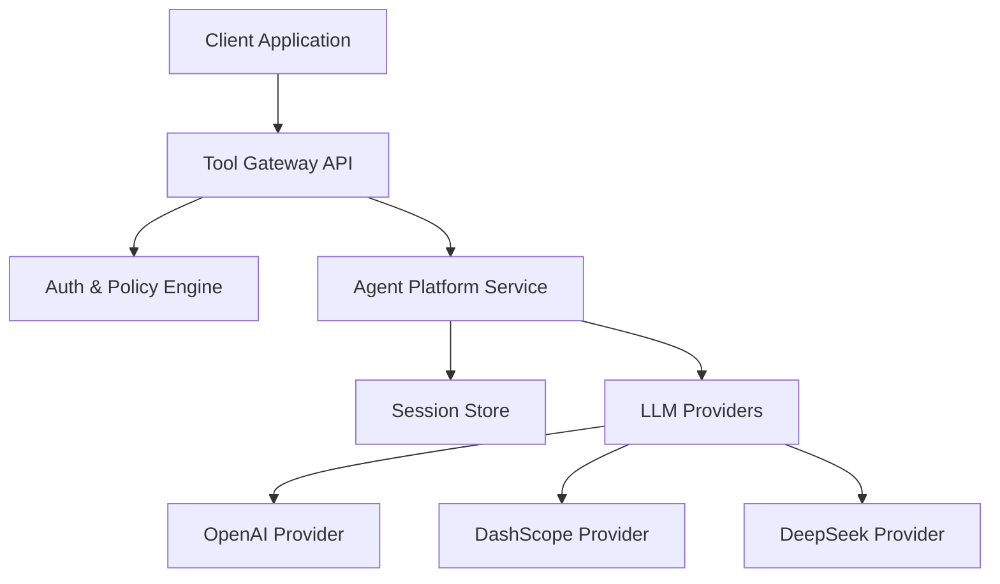
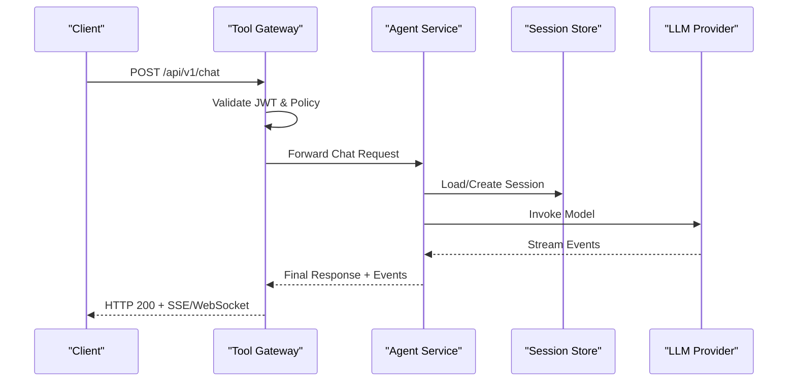
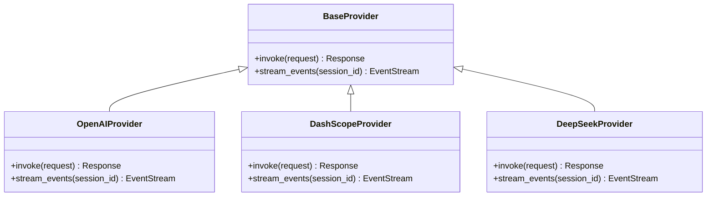
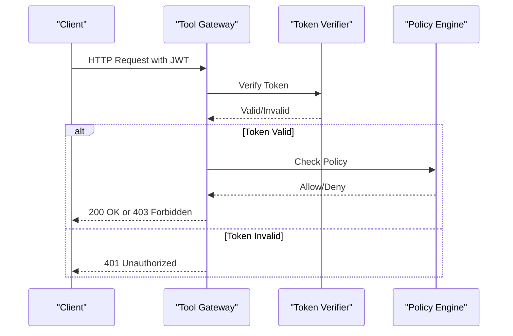
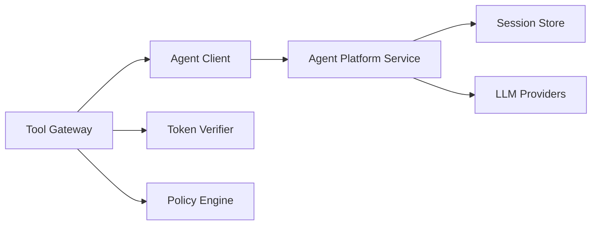

# Agent Platform API

<cite>
**Referenced Files in This Document**
- [agent_app.py](file://products/agent-platform/src/agent_platform/agent_app.py)
- [app.py](file://products/agent-platform/src/agent_platform/app.py)
- [main.py](file://products/agent-platform/src/agent_platform/main.py)
- [routes.py](file://products/agent-platform/src/agent_service/api/v2/routes.py)
- [api.py](file://products/agent-platform/src/agent_platform/schemas/api.py)
- [v2.py](file://products/agent-platform/src/agent_platform/schemas/v2.py)
- [session_service.py](file://products/agent-platform/src/agent_platform/services/session_service.py)
- [session_store.py](file://products/agent-platform/src/agent_platform/services/session_store.py)
- [runtime_service.py](file://products/agent-platform/src/agent_platform/services/runtime_service.py)
- [base.py](file://products/agent-platform/src/agent_platform/providers/base.py)
- [openai.py](file://products/agent-platform/src/agent_platform/providers/openai.py)
- [dashscope.py](file://products/agent-platform/src/agent_platform/providers/dashscope.py)
- [deepseek.py](file://products/agent-platform/src/agent_platform/providers/deepseek.py)
- [gateway_tools.py](file://products/agent-platform/src/agent_platform/tools/gateway_tools.py)
- [config.py](file://products/agent-platform/src/agent_platform/core/config.py)
- [env.py](file://products/agent-platform/src/agent_platform/core/env.py)
- [metrics.py](file://products/agent-platform/src/agent_platform/core/metrics.py)
- [observability.py](file://products/agent-platform/src/agent_platform/core/observability.py)
- [telemetry.py](file://products/agent-platform/src/agent_platform/core/telemetry.py)
- [request_context.py](file://products/agent-platform/src/agent_platform/core/request_context.py)
- [chat.py](file://products/tool-gateway/src/api_gateway/api/routes/chat.py)
- [sessions.py](file://products/tool-gateway/src/api_gateway/api/routes/sessions.py)
- [auth.py](file://products/tool-gateway/src/api_gateway/api/routes/auth.py)
- [identity.py](file://products/tool-gateway/src/api_gateway/api/routes/identity.py)
- [health.py](file://products/tool-gateway/src/api_gateway/api/routes/health.py)
- [router.py](file://products/tool-gateway/src/api_gateway/api/router.py)
- [gateway_service.py](file://products/tool-gateway/src/api_gateway/services/gateway_service.py)
- [agent_client.py](file://products/tool-gateway/src/api_gateway/services/agent_client.py)
- [token_verifier.py](file://products/tool-gateway/src/api_gateway/services/token_verifier.py)
- [policy_engine.py](file://products/tool-gateway/src/api_gateway/services/policy_engine.py)
- [chat-request.schema.json](file://shared/shared-contracts/schemas/chat-request.schema.json)
- [chat-response.schema.json](file://shared/shared-contracts/schemas/chat-response.schema.json)
- [stream-event.schema.json](file://shared/shared-contracts/schemas/stream-event.schema.json)
- [agent-chat-request.schema.json](file://shared/shared-contracts/schemas/agent-chat-request.schema.json)
- [agent-chat-response.schema.json](file://shared/shared-contracts/schemas/agent-chat-response.schema.json)
- [agent-session.schema.json](file://shared/shared-contracts/schemas/agent-session.schema.json)
- [session.schema.json](file://shared/shared-contracts/schemas/session.schema.json)
- [identity-token.schema.json](file://shared/shared-contracts/schemas/identity-token.schema.json)
- [identity-context.schema.json](file://shared/shared-contracts/schemas/identity-context.schema.json)
</cite>

## Table of Contents
1. [Introduction](#introduction)
2. [Project Structure](#project-structure)
3. [Core Components](#core-components)
4. [Architecture Overview](#architecture-overview)
5. [Detailed Component Analysis](#detailed-component-analysis)
6. [Dependency Analysis](#dependency-analysis)
7. [Performance Considerations](#performance-considerations)
8. [Troubleshooting Guide](#troubleshooting-guide)
9. [Conclusion](#conclusion)
10. [Appendices](#appendices)

## Introduction
This document provides comprehensive API documentation for the Agent Platform service endpoints, focusing on agent orchestration, session management, and provider interactions. It covers REST APIs exposed via the tool gateway and internal services within the agent platform, including authentication using JWT tokens, rate limiting policies, WebSocket streaming for real-time responses, and long-running operations. Practical examples are included to demonstrate agent creation, chat interactions, session handling, and provider configuration. Error codes, retry strategies, and client implementation guidelines across multiple programming languages are also provided.

## Project Structure
The Agent Platform is composed of several key modules:
- Agent Service: Core logic for agent orchestration, session management, and provider integration.
- Tool Gateway: External-facing API gateway that handles authentication, policy enforcement, and routing to internal services.
- Shared Contracts: JSON schemas defining request/response formats for interoperability.
- Identity Broker: Handles authentication and token issuance (referenced for context).

**Diagram sources**
- [router.py](file://products/tool-gateway/src/api_gateway/api/router.py)
- [agent_app.py](file://products/agent-platform/src/agent_platform/agent_app.py)
- [base.py](file://products/agent-platform/src/agent_platform/providers/base.py)

**Section sources**
- [main.py](file://products/agent-platform/src/agent_platform/main.py)
- [app.py](file://products/agent-platform/src/agent_platform/app.py)
- [router.py](file://products/tool-gateway/src/api_gateway/api/router.py)

## Core Components
- Agent Orchestration: Manages agent lifecycle, tool execution, and provider selection.
- Session Management: Persists and retrieves conversation state using a session store.
- Provider Integration: Abstracts LLM providers with a common interface.
- Authentication & Authorization: Validates JWT tokens and enforces policies.
- Streaming & WebSockets: Supports real-time event streaming for long-running operations.

**Section sources**
- [session_service.py](file://products/agent-platform/src/agent_platform/services/session_service.py)
- [runtime_service.py](file://products/agent-platform/src/agent_platform/services/runtime_service.py)
- [base.py](file://products/agent-platform/src/agent_platform/providers/base.py)
- [token_verifier.py](file://products/tool-gateway/src/api_gateway/services/token_verifier.py)

## Architecture Overview
The system follows a layered architecture:
- Client Layer: Applications interacting via REST or WebSocket APIs.
- Gateway Layer: Tool gateway handling auth, policy, and routing.
- Service Layer: Agent platform service orchestrating agents and sessions.
- Storage Layer: Session persistence and metadata storage.
- Provider Layer: Pluggable LLM providers.

**Diagram sources**
- [chat.py](file://products/tool-gateway/src/api_gateway/api/routes/chat.py)
- [gateway_service.py](file://products/tool-gateway/src/api_gateway/services/gateway_service.py)
- [session_service.py](file://products/agent-platform/src/agent_platform/services/session_service.py)
- [openai.py](file://products/agent-platform/src/agent_platform/providers/openai.py)

## Detailed Component Analysis

### REST API Endpoints
All public endpoints are exposed through the tool gateway under `/api/v1`.

#### Authentication
- Endpoint: `POST /api/v1/auth/token`
- Method: POST
- Description: Issues JWT tokens for clients.
- Request Schema: See [identity-token.schema.json](file://shared/shared-contracts/schemas/identity-token.schema.json)
- Response Schema: See [identity-token.schema.json](file://shared/shared-contracts/schemas/identity-token.schema.json)
- Authentication: None (public endpoint)
- Rate Limiting: Configurable via policy engine.

**Section sources**
- [auth.py](file://products/tool-gateway/src/api_gateway/api/routes/auth.py)
- [identity-token.schema.json](file://shared/shared-contracts/schemas/identity-token.schema.json)

#### Chat Interaction
- Endpoint: `POST /api/v1/chat`
- Method: POST
- Description: Initiates a chat interaction with an agent.
- Request Schema: See [chat-request.schema.json](file://shared/shared-contracts/schemas/chat-request.schema.json)
- Response Schema: See [chat-response.schema.json](file://shared/shared-contracts/schemas/chat-response.schema.json)
- Authentication: Requires valid JWT in `Authorization: Bearer <token>` header.
- Rate Limiting: Enforced by policy engine based on user identity.

**Section sources**
- [chat.py](file://products/tool-gateway/src/api_gateway/api/routes/chat.py)
- [chat-request.schema.json](file://shared/shared-contracts/schemas/chat-request.schema.json)
- [chat-response.schema.json](file://shared/shared-contracts/schemas/chat-response.schema.json)

#### Session Management
- Endpoint: `GET /api/v1/sessions/{session_id}`
- Method: GET
- Description: Retrieves session details.
- Response Schema: See [session.schema.json](file://shared/shared-contracts/schemas/session.schema.json)
- Authentication: Requires JWT.

- Endpoint: `POST /api/v1/sessions`
- Method: POST
- Description: Creates a new session.
- Request Schema: See [agent-session.schema.json](file://shared/shared-contracts/schemas/agent-session.schema.json)
- Response Schema: See [agent-session.schema.json](file://shared/shared-contracts/schemas/agent-session.schema.json)
- Authentication: Requires JWT.

**Section sources**
- [sessions.py](file://products/tool-gateway/src/api_gateway/api/routes/sessions.py)
- [session.schema.json](file://shared/shared-contracts/schemas/session.schema.json)
- [agent-session.schema.json](file://shared/shared-contracts/schemas/agent-session.schema.json)

#### Health Check
- Endpoint: `GET /api/v1/health`
- Method: GET
- Description: Returns service health status.
- Response Schema: See [health-response.schema.json](file://shared/shared-contracts/schemas/health-response.schema.json)
- Authentication: None.

**Section sources**
- [health.py](file://products/tool-gateway/src/api_gateway/api/routes/health.py)
- [health-response.schema.json](file://shared/shared-contracts/schemas/health-response.schema.json)

### WebSocket API
- Endpoint: `ws://<host>/api/v1/stream/{session_id}`
- Protocol: WebSocket
- Description: Establishes a real-time streaming connection for long-running operations.
- Message Schema: See [stream-event.schema.json](file://shared/shared-contracts/schemas/stream-event.schema.json)
- Authentication: Requires JWT in query parameter or initial handshake message.

**Section sources**
- [stream-event.schema.json](file://shared/shared-contracts/schemas/stream-event.schema.json)

### Provider Interactions
Providers implement a common interface for LLM interactions.

**Diagram sources**
- [base.py](file://products/agent-platform/src/agent_platform/providers/base.py)
- [openai.py](file://products/agent-platform/src/agent_platform/providers/openai.py)
- [dashscope.py](file://products/agent-platform/src/agent_platform/providers/dashscope.py)
- [deepseek.py](file://products/agent-platform/src/agent_platform/providers/deepseek.py)

**Section sources**
- [base.py](file://products/agent-platform/src/agent_platform/providers/base.py)

### Authentication Flow
JWT tokens are validated at the gateway layer before requests are forwarded to internal services.

**Diagram sources**
- [token_verifier.py](file://products/tool-gateway/src/api_gateway/services/token_verifier.py)
- [policy_engine.py](file://products/tool-gateway/src/api_gateway/services/policy_engine.py)

**Section sources**
- [token_verifier.py](file://products/tool-gateway/src/api_gateway/services/token_verifier.py)
- [policy_engine.py](file://products/tool-gateway/src/api_gateway/services/policy_engine.py)

## Dependency Analysis
The tool gateway depends on internal services and external providers.

**Diagram sources**
- [gateway_service.py](file://products/tool-gateway/src/api_gateway/services/gateway_service.py)
- [agent_client.py](file://products/tool-gateway/src/api_gateway/services/agent_client.py)
- [session_store.py](file://products/agent-platform/src/agent_platform/services/session_store.py)

**Section sources**
- [gateway_service.py](file://products/tool-gateway/src/api_gateway/services/gateway_service.py)
- [agent_client.py](file://products/tool-gateway/src/api_gateway/services/agent_client.py)

## Performance Considerations
- Use connection pooling for LLM provider calls.
- Implement caching for frequently accessed session data.
- Monitor metrics and telemetry for bottleneck identification.
- Configure rate limiting to prevent abuse.

[No sources needed since this section provides general guidance]

## Troubleshooting Guide
Common issues and resolutions:
- Authentication Failures: Ensure JWT is valid and not expired.
- Rate Limiting Errors: Check policy configurations and adjust limits if necessary.
- Provider Timeouts: Verify provider credentials and network connectivity.
- Session Loss: Confirm session store availability and persistence settings.

**Section sources**
- [observability.py](file://products/agent-platform/src/agent_platform/core/observability.py)
- [metrics.py](file://products/agent-platform/src/agent_platform/core/metrics.py)

## Conclusion
The Agent Platform API provides a robust framework for agent orchestration, session management, and provider interactions. With strong authentication, policy enforcement, and real-time streaming capabilities, it supports scalable and secure AI-driven applications.

[No sources needed since this section summarizes without analyzing specific files]

## Appendices

### Example Requests and Responses

#### Create a Session
- Method: POST
- URL: `/api/v1/sessions`
- Headers: `Authorization: Bearer <jwt>`
- Body: See [agent-session.schema.json](file://shared/shared-contracts/schemas/agent-session.schema.json)
- Response: See [agent-session.schema.json](file://shared/shared-contracts/schemas/agent-session.schema.json)

**Section sources**
- [sessions.py](file://products/tool-gateway/src/api_gateway/api/routes/sessions.py)
- [agent-session.schema.json](file://shared/shared-contracts/schemas/agent-session.schema.json)

#### Send a Chat Message
- Method: POST
- URL: `/api/v1/chat`
- Headers: `Authorization: Bearer <jwt>`
- Body: See [chat-request.schema.json](file://shared/shared-contracts/schemas/chat-request.schema.json)
- Response: See [chat-response.schema.json](file://shared/shared-contracts/schemas/chat-response.schema.json)

**Section sources**
- [chat.py](file://products/tool-gateway/src/api_gateway/api/routes/chat.py)
- [chat-request.schema.json](file://shared/shared-contracts/schemas/chat-request.schema.json)
- [chat-response.schema.json](file://shared/shared-contracts/schemas/chat-response.schema.json)

### Error Codes and Retry Strategies
- 401 Unauthorized: Invalid or missing JWT. Retry after refreshing token.
- 403 Forbidden: Policy denied. Review access controls.
- 429 Too Many Requests: Rate limit exceeded. Implement exponential backoff.
- 500 Internal Server Error: Unexpected failure. Log and retry with backoff.

[No sources needed since this section provides general guidance]

### Client Implementation Guidelines
- Python: Use `requests` for REST and `websockets` for streaming.
- JavaScript: Use `axios` for REST and `WebSocket` API for streaming.
- Go: Use `net/http` for REST and `gorilla/websocket` for streaming.
- Java: Use `OkHttp` for REST and `Java WebSocket API` for streaming.

[No sources needed since this section provides general guidance]