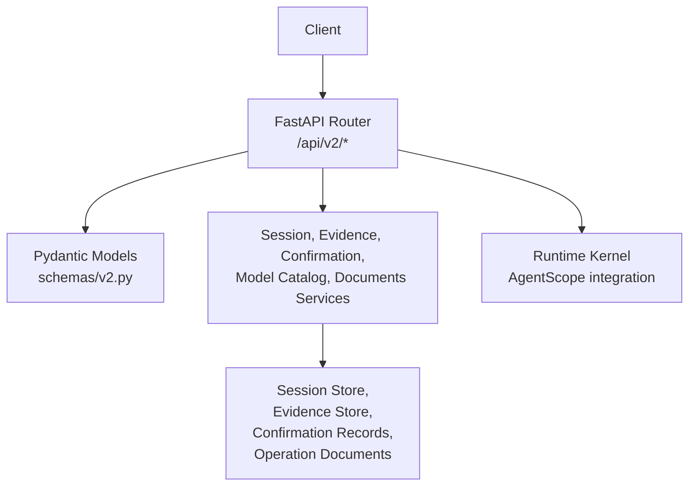
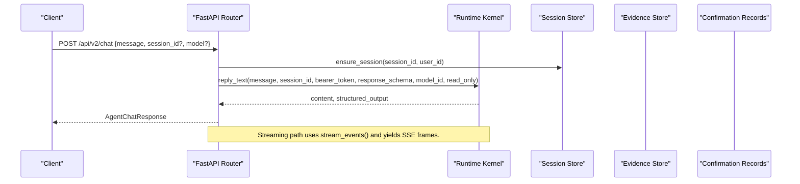
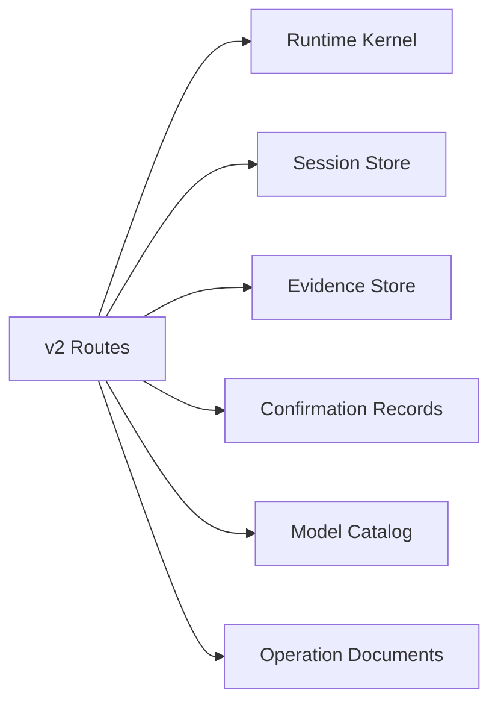

# Agent Platform API

<cite>
**Referenced Files in This Document**
- [routes.py](file://products/agent-platform/src/agent_service/api/v2/routes.py)
- [v2.py](file://products/agent-platform/src/agent_service/schemas/v2.py)
- [agent-chat-request.schema.json](file://shared/shared-contracts/schemas/agent-chat-request.schema.json)
- [agent-chat-response.schema.json](file://shared/shared-contracts/schemas/agent-chat-response.schema.json)
- [agent-session.schema.json](file://shared/shared-contracts/schemas/agent-session.schema.json)
- [agent-stream-event.schema.json](file://shared/shared-contracts/schemas/agent-stream-event.schema.json)
</cite>

## Table of Contents
1. [Introduction](#introduction)
2. [Project Structure](#project-structure)
3. [Core Components](#core-components)
4. [Architecture Overview](#architecture-overview)
5. [Detailed Component Analysis](#detailed-component-analysis)
6. [Dependency Analysis](#dependency-analysis)
7. [Performance Considerations](#performance-considerations)
8. [Troubleshooting Guide](#troubleshooting-guide)
9. [Conclusion](#conclusion)
10. [Appendices](#appendices)

## Introduction
This document specifies the v2 public API surface of the Agent Platform service for agent orchestration and session management. It covers:
- Session creation, listing, retrieval, renaming, and deletion
- Agent chat via synchronous and streaming endpoints
- Human-in-the-loop confirmation bridging (parked tool calls)
- Model discovery and runtime metadata
- Evidence collection and durable confirmation records
- Operations documents (shift summaries and incident reports)
- Authentication via internal headers and authorization enforcement at the gateway boundary

The API is implemented as a FastAPI router under /api/v2 with Pydantic models validated against shared JSON schemas. Identity is conveyed via headers; bodies never contain identity or secrets.

## Project Structure
The v2 API lives in a single routes module that adapts HTTP requests to the AgentScope kernel and platform services. Request/response shapes are defined in a dedicated schemas module and cross-checked against shared JSON schemas.

**Diagram sources**
- [routes.py:1-139](file://products/agent-platform/src/agent_service/api/v2/routes.py#L1-L139)
- [v2.py:1-31](file://products/agent-platform/src/agent_service/schemas/v2.py#L1-L31)

**Section sources**
- [routes.py:1-139](file://products/agent-platform/src/agent_service/api/v2/routes.py#L1-L139)
- [v2.py:1-31](file://products/agent-platform/src/agent_service/schemas/v2.py#L1-L31)

## Core Components
- Chat endpoints: POST /api/v2/chat (text reply), GET /api/v2/chat/stream (SSE), POST /api/v2/chat/confirm (resume parked turn).
- Sessions: POST /api/v2/sessions, GET /api/v2/sessions, GET /api/v2/sessions/{id}, PATCH /api/v2/sessions/{id}/title, DELETE /api/v2/sessions/{id}.
- Confirmations: GET /api/v2/chat/pending-confirmation, GET /api/v2/confirmations.
- Model discovery: GET /api/v2/models.
- Runtime health/metadata: GET /api/v2/runtime, GET /api/v2/health.
- Skill authoring: POST /api/v2/sessions/{id}/skill-target, POST /api/v2/sessions/{id}/skill-draft, POST /api/v2/sessions/{id}/skill-graduate.
- Operations documents: POST /api/v2/documents, GET /api/v2/documents, GET /api/v2/documents/{id}, POST /api/v2/documents/{id}/publish, DELETE /api/v2/documents/{id}.

Authentication and authorization:
- Identity is provided by X-User-ID header on every endpoint. Missing identity returns 401.
- Authorization checks (roles, capabilities) are enforced at the platform-gateway boundary before requests reach this service. The service re-checks ownership where required.

**Section sources**
- [routes.py:144-157](file://products/agent-platform/src/agent_service/api/v2/routes.py#L144-L157)
- [routes.py:276-317](file://products/agent-platform/src/agent_service/api/v2/routes.py#L276-L317)
- [routes.py:320-365](file://products/agent-platform/src/agent_service/api/v2/routes.py#L320-L365)
- [routes.py:368-464](file://products/agent-platform/src/agent_service/api/v2/routes.py#L368-L464)
- [routes.py:467-513](file://products/agent-platform/src/agent_service/api/v2/routes.py#L467-L513)
- [routes.py:790-855](file://products/agent-platform/src/agent_service/api/v2/routes.py#L790-L855)
- [routes.py:858-914](file://products/agent-platform/src/agent_service/api/v2/routes.py#L858-L914)
- [routes.py:917-945](file://products/agent-platform/src/agent_service/api/v2/routes.py#L917-L945)
- [routes.py:948-979](file://products/agent-platform/src/agent_service/api/v2/routes.py#L948-L979)
- [routes.py:1219-1294](file://products/agent-platform/src/agent_service/api/v2/routes.py#L1219-L1294)
- [routes.py:1297-1441](file://products/agent-platform/src/agent_service/api/v2/routes.py#L1297-L1441)
- [routes.py:1469-1591](file://products/agent-platform/src/agent_service/api/v2/routes.py#L1469-L1591)
- [routes.py:1625-1682](file://products/agent-platform/src/agent_service/api/v2/routes.py#L1625-L1682)
- [routes.py:1685-1731](file://products/agent-platform/src/agent_service/api/v2/routes.py#L1685-L1731)
- [routes.py:1737-1773](file://products/agent-platform/src/agent_service/api/v2/routes.py#L1737-L1773)
- [routes.py:1779-1789](file://products/agent-platform/src/agent_service/api/v2/routes.py#L1779-L1789)
- [routes.py:1795-1806](file://products/agent-platform/src/agent_service/api/v2/routes.py#L1795-L1806)
- [routes.py:1835-1855](file://products/agent-platform/src/agent_service/api/v2/routes.py#L1835-L1855)

## Architecture Overview
The v2 API is an adapter layer between HTTP and the AgentScope kernel. It validates inputs using Pydantic models aligned to shared JSON schemas, enforces identity via headers, delegates orchestration to the kernel, and persists state through session, evidence, and confirmation stores.

**Diagram sources**
- [routes.py:276-317](file://products/agent-platform/src/agent_service/api/v2/routes.py#L276-L317)
- [routes.py:320-365](file://products/agent-platform/src/agent_service/api/v2/routes.py#L320-L365)

**Section sources**
- [routes.py:276-365](file://products/agent-platform/src/agent_service/api/v2/routes.py#L276-L365)

## Detailed Component Analysis

### Authentication and Authorization
- Identity: Every endpoint requires X-User-ID. Missing header returns 401.
- Authorization: Enforced at the platform-gateway boundary. Some endpoints re-check ownership server-side and return structural 404 for unknown/foreign IDs to avoid enumeration.
- Bearer token forwarding: Optional Authorization header is forwarded opaquely to the kernel for tool calls; the service does not inspect or sign it.

**Section sources**
- [routes.py:144-157](file://products/agent-platform/src/agent_service/api/v2/routes.py#L144-L157)
- [routes.py:276-317](file://products/agent-platform/src/agent_service/api/v2/routes.py#L276-L317)
- [routes.py:320-365](file://products/agent-platform/src/agent_service/api/v2/routes.py#L320-L365)

### Session Management
- Create session: POST /api/v2/sessions
  - Optional body supports named sessions, skill_target declaration for development sessions, and session_type discriminator.
  - Returns full AgentSession including birth type and basic lifecycle fields.
- List sessions: GET /api/v2/sessions
  - Returns most-recently-active first, capped list with optional session_type filter.
- Read session: GET /api/v2/sessions/{session_id}
  - Returns full session with transcript availability, evidence turns, and confirmation cards when available.
- Rename session: PATCH /api/v2/sessions/{session_id}/title
  - Owner-only rename with length constraints.
- Delete session: DELETE /api/v2/sessions/{session_id}
  - Owner-only; rejects if a parked confirmation exists.

Request/response schemas:
- Creation request: see AgentSessionCreateRequest and schema definitions.
- Session object: see AgentSession and agent-session.schema.json.

Example usage patterns:
- Start a new operation session: POST /api/v2/sessions with no body.
- Open a named triage session: POST /api/v2/sessions with session_id and session_type="operation".
- Open a development session scoped to a web target: POST /api/v2/sessions with session_type="development" and skill_target set to an absolute http(s) URL.

**Section sources**
- [routes.py:790-855](file://products/agent-platform/src/agent_service/api/v2/routes.py#L790-L855)
- [routes.py:858-914](file://products/agent-platform/src/agent_service/api/v2/routes.py#L858-L914)
- [routes.py:917-945](file://products/agent-platform/src/agent_service/api/v2/routes.py#L917-L945)
- [routes.py:948-979](file://products/agent-platform/src/agent_service/api/v2/routes.py#L948-L979)
- [v2.py:334-363](file://products/agent-platform/src/agent_service/schemas/v2.py#L334-L363)
- [agent-session.schema.json:1-224](file://shared/shared-contracts/schemas/agent-session.schema.json#L1-L224)

### Agent Chat (Synchronous)
Endpoint: POST /api/v2/chat
- Request body: message (required), optional session_id, input_modality, response_schema, model.
- Behavior:
  - Ensures session existence and updates last activity.
  - Rejects new turns while a confirmation is parked unless expired.
  - Resolves model per request > pinned > default; unknown model ids fail closed with 422.
  - Forwards optional bearer token to kernel for tool execution.
  - Supports optional structured output validation via response_schema.
- Response: AgentChatResponse with session_id, request_id, content, status, structured_output, model.

Streaming alternative: GET /api/v2/chat/stream
- Query parameters: message (required), session_id, model, input_modality.
- Returns Server-Sent Events with normalized frames conforming to agent-stream-event.schema.json.

Multi-turn conversation example flow:
1. POST /api/v2/chat with message and optional session_id to start or continue a session.
2. Use returned session_id for subsequent turns.
3. If a confirmation_request appears in the stream, answer via POST /api/v2/chat/confirm.

Error handling:
- 401 missing X-User-ID
- 409 parked confirmation pending
- 422 unknown model id
- 5xx from upstream kernel or dependencies

**Section sources**
- [routes.py:276-317](file://products/agent-platform/src/agent_service/api/v2/routes.py#L276-L317)
- [routes.py:320-365](file://products/agent-platform/src/agent_service/api/v2/routes.py#L320-L365)
- [routes.py:202-243](file://products/agent-platform/src/agent_service/api/v2/routes.py#L202-L243)
- [routes.py:246-270](file://products/agent-platform/src/agent_service/api/v2/routes.py#L246-L270)
- [agent-chat-request.schema.json:1-35](file://shared/shared-contracts/schemas/agent-chat-request.schema.json#L1-L35)
- [agent-chat-response.schema.json:1-35](file://shared/shared-contracts/schemas/agent-chat-response.schema.json#L1-L35)

### Streaming Responses and Real-Time Output
- Endpoint: GET /api/v2/chat/stream
- Frames include message_start, message_delta, message_end, error, tool_call, tool_result, confirmation_request, confirmation_result.
- Normalization ensures schema compliance and safe coercion of optional fields.

Evidence panel and HITL:
- tool_call/tool_result frames carry evidence metadata and optional data_summary/data within size caps.
- confirmation_request frames carry pending_calls with risk_level, action, display_hint, and change_request projections for approval UIs.

Model attribution:
- message_end frames may include model to attribute which LLM provider/model resolved for the turn.

**Section sources**
- [routes.py:320-365](file://products/agent-platform/src/agent_service/api/v2/routes.py#L320-L365)
- [routes.py:559-728](file://products/agent-platform/src/agent_service/api/v2/routes.py#L559-L728)
- [agent-stream-event.schema.json:1-160](file://shared/shared-contracts/schemas/agent-stream-event.schema.json#L1-L160)

### Human-in-the-Loop Confirmations
- Parked confirmations block new turns until resolved or expired.
- Pending confirmation query: GET /api/v2/chat/pending-confirmation
  - Returns confirm_id, owner_user_id, action, and redacted pending_calls for gateway tier checks.
- Resume parked turn: POST /api/v2/chat/confirm
  - Claims the confirmation, persists outcome at claim time, streams resumed events.
  - Handles expired or already-resolved confirmations with appropriate status codes.
- Approvals inbox: GET /api/v2/confirmations
  - Lists pending and paginated history of decisions for designated approvers.

State transitions:
- Parked -> Approved/Denied/Expired/Interrupted via confirm or timeout.

**Section sources**
- [routes.py:202-243](file://products/agent-platform/src/agent_service/api/v2/routes.py#L202-L243)
- [routes.py:368-464](file://products/agent-platform/src/agent_service/api/v2/routes.py#L368-L464)
- [routes.py:467-513](file://products/agent-platform/src/agent_service/api/v2/routes.py#L467-L513)
- [routes.py:516-557](file://products/agent-platform/src/agent_service/api/v2/routes.py#L516-L557)
- [routes.py:1737-1773](file://products/agent-platform/src/agent_service/api/v2/routes.py#L1737-L1773)

### Model Switching and Discovery
- Discovery: GET /api/v2/models
  - Returns credential-gated catalog with id, label, provider, default flag.
- Per-turn selection:
  - Chat and stream accept optional model; resolution order is request > session-pinned > default.
  - Unknown model ids return 422; resolved model is persisted as session pin and surfaced in responses/stream frames.

Provider support:
- Providers include dashscope, deepseek, openai, luban.

**Section sources**
- [routes.py:246-270](file://products/agent-platform/src/agent-service/api/v2/routes.py#L246-L270)
- [routes.py:1779-1789](file://products/agent-platform/src/agent_service/api/v2/routes.py#L1779-L1789)
- [v2.py:443-456](file://products/agent-platform/src/agent_service/schemas/v2.py#L443-L456)

### Evidence Collection and Tool Execution Coordination
- Evidence frames:
  - tool_call and tool_result frames carry call_id, tool_name, parameters, status, evidence metadata, and optional data_summary/data.
  - Data payloads are size-capped; truncated frames may be marked.
- Evidence persistence:
  - Evidence turns grouped by assistant turn are loaded for session detail responses.
  - Unreadable evidence store degrades gracefully without 500 errors.

Tool execution coordination:
- Bearer token forwarded to kernel enables tool invocation with delegated credentials.
- Risk tiers and actions inform approval flows and portal rendering.

**Section sources**
- [routes.py:559-728](file://products/agent-platform/src/agent_service/api/v2/routes.py#L559-L728)
- [routes.py:733-748](file://products/agent-platform/src/agent_service/api/v2/routes.py#L733-L748)
- [agent-stream-event.schema.json:1-160](file://shared/shared-contracts/schemas/agent-stream-event.schema.json#L1-L160)

### Operations Documents
- Create document: POST /api/v2/documents
  - Supports shift_summary and incident_report types with validation and optional prose generation.
- List/read/publish/delete documents: standard CRUD with scope-based visibility and audit emission.
- Foreign coverage: controlled via trusted internal header; absent/unrecognized denies foreign access.

**Section sources**
- [routes.py:1469-1591](file://products/agent-platform/src/agent_service/api/v2/routes.py#L1469-L1591)
- [routes.py:1625-1682](file://products/agent-platform/src/agent_service/api/v2/routes.py#L1625-L1682)
- [routes.py:1685-1731](file://products/agent-platform/src/agent_service/api/v2/routes.py#L1685-L1731)

### Runtime Metadata and Health
- Runtime metadata: GET /api/v2/runtime
  - Returns runtime_mode, runtime_state, provider, model_name, hint, last_error.
- Health: GET /api/v2/health
  - Returns readiness, configured flags, backend names and readiness for session and agent state stores, plus tech-stack versions.

**Section sources**
- [routes.py:1795-1806](file://products/agent-platform/src/agent_service/api/v2/routes.py#L1795-L1806)
- [routes.py:1835-1855](file://products/agent-platform/src/agent_service/api/v2/routes.py#L1835-L1855)

## Dependency Analysis
The v2 routes depend on:
- FastAPI router and streaming response utilities
- Pydantic models for request/response validation
- Runtime kernel for agent orchestration and streaming
- Session store for persistence and listing
- Evidence store for tool evidence grouping
- Confirmation record store for durable HITL lifecycle
- Model catalog for discovery and resolution
- Operation document store for shift summaries and incident reports

**Diagram sources**
- [routes.py:1-139](file://products/agent-platform/src/agent_service/api/v2/routes.py#L1-L139)

**Section sources**
- [routes.py:1-139](file://products/agent-platform/src/agent_service/api/v2/routes.py#L1-L139)

## Performance Considerations
- Streaming reduces latency for long-running agent turns by emitting incremental deltas and tool results.
- Evidence data payloads are size-capped to prevent large frames in streams.
- Best-effort degradation for unreadable stores avoids 500 errors; features like evidence_turns and confirmations degrade gracefully.
- Model resolution is cached in session pins to minimize repeated lookups.

[No sources needed since this section provides general guidance]

## Troubleshooting Guide
Common issues and resolutions:
- 401 missing X-User-ID: Ensure identity header is present on all requests.
- 409 parked confirmation pending: Answer or wait for expiry before sending new messages.
- 422 unknown model id: Use GET /api/v2/models to discover valid model ids.
- 404 confirmation not found: Confirmation may have expired or been resolved; check inbox.
- 503/502 upstream failures: Indicates unconfigured or unreachable dependencies (skills hub, incident service); retry later.

Diagnostic endpoints:
- GET /api/v2/runtime for runtime state and provider info.
- GET /api/v2/health for overall readiness and backend status.

**Section sources**
- [routes.py:144-157](file://products/agent-platform/src/agent_service/api/v2/routes.py#L144-L157)
- [routes.py:202-243](file://products/agent-platform/src/agent_service/api/v2/routes.py#L202-L243)
- [routes.py:368-464](file://products/agent-platform/src/agent_service/api/v2/routes.py#L368-L464)
- [routes.py:1779-1789](file://products/agent-platform/src/agent_service/api/v2/routes.py#L1779-L1789)
- [routes.py:1795-1806](file://products/agent-platform/src/agent_service/api/v2/routes.py#L1795-L1806)
- [routes.py:1835-1855](file://products/agent-platform/src/agent_service/api/v2/routes.py#L1835-L1855)

## Conclusion
The Agent Platform v2 API provides a robust, schema-validated surface for session-based agent orchestration, real-time streaming chat, human-in-the-loop approvals, model switching, evidence collection, and operations documents. Authentication is header-based with gateway-enforced authorization, and the service emphasizes graceful degradation and clear error signaling for reliable integrations.

[No sources needed since this section summarizes without analyzing specific files]

## Appendices

### API Endpoints Summary
- POST /api/v2/chat: Send a message and receive a text reply.
- GET /api/v2/chat/stream: Stream real-time events for a message.
- POST /api/v2/chat/confirm: Answer a parked confirmation and resume streaming.
- GET /api/v2/chat/pending-confirmation: Retrieve parked confirmation metadata.
- POST /api/v2/sessions: Create a session (named or auto-generated).
- GET /api/v2/sessions: List current user’s sessions.
- GET /api/v2/sessions/{id}: Read session details with transcript and evidence.
- PATCH /api/v2/sessions/{id}/title: Rename session title.
- DELETE /api/v2/sessions/{id}: Delete session (owner-only).
- GET /api/v2/models: Discover available models.
- GET /api/v2/runtime: Get runtime metadata.
- GET /api/v2/health: Service health check.
- POST /api/v2/documents: Create shift summary or incident report document.
- GET /api/v2/documents: List documents (mine or published).
- GET /api/v2/documents/{id}: Read document.
- POST /api/v2/documents/{id}/publish: Publish draft.
- DELETE /api/v2/documents/{id}: Delete document.
- POST /api/v2/sessions/{id}/skill-target: Declare web target for development sessions.
- POST /api/v2/sessions/{id}/skill-draft: Generate validated skill draft.
- POST /api/v2/sessions/{id}/skill-graduate: Graduate executable flow draft.

**Section sources**
- [routes.py:276-317](file://products/agent-platform/src/agent_service/api/v2/routes.py#L276-L317)
- [routes.py:320-365](file://products/agent-platform/src/agent_service/api/v2/routes.py#L320-L365)
- [routes.py:368-464](file://products/agent-platform/src/agent_service/api/v2/routes.py#L368-L464)
- [routes.py:467-513](file://products/agent-platform/src/agent_service/api/v2/routes.py#L467-L513)
- [routes.py:790-855](file://products/agent-platform/src/agent_service/api/v2/routes.py#L790-L855)
- [routes.py:858-914](file://products/agent-platform/src/agent_service/api/v2/routes.py#L858-L914)
- [routes.py:917-945](file://products/agent-platform/src/agent_service/api/v2/routes.py#L917-L945)
- [routes.py:948-979](file://products/agent-platform/src/agent_service/api/v2/routes.py#L948-L979)
- [routes.py:1219-1294](file://products/agent-platform/src/agent_service/api/v2/routes.py#L1219-L1294)
- [routes.py:1297-1441](file://products/agent-platform/src/agent_service/api/v2/routes.py#L1297-L1441)
- [routes.py:1469-1591](file://products/agent-platform/src/agent_service/api/v2/routes.py#L1469-L1591)
- [routes.py:1625-1682](file://products/agent-platform/src/agent_service/api/v2/routes.py#L1625-L1682)
- [routes.py:1685-1731](file://products/agent-platform/src/agent_service/api/v2/routes.py#L1685-L1731)
- [routes.py:1737-1773](file://products/agent-platform/src/agent_service/api/v2/routes.py#L1737-L1773)
- [routes.py:1779-1789](file://products/agent-platform/src/agent_service/api/v2/routes.py#L1779-L1789)
- [routes.py:1795-1806](file://products/agent-platform/src/agent_service/api/v2/routes.py#L1795-L1806)
- [routes.py:1835-1855](file://products/agent-platform/src/agent_service/api/v2/routes.py#L1835-L1855)