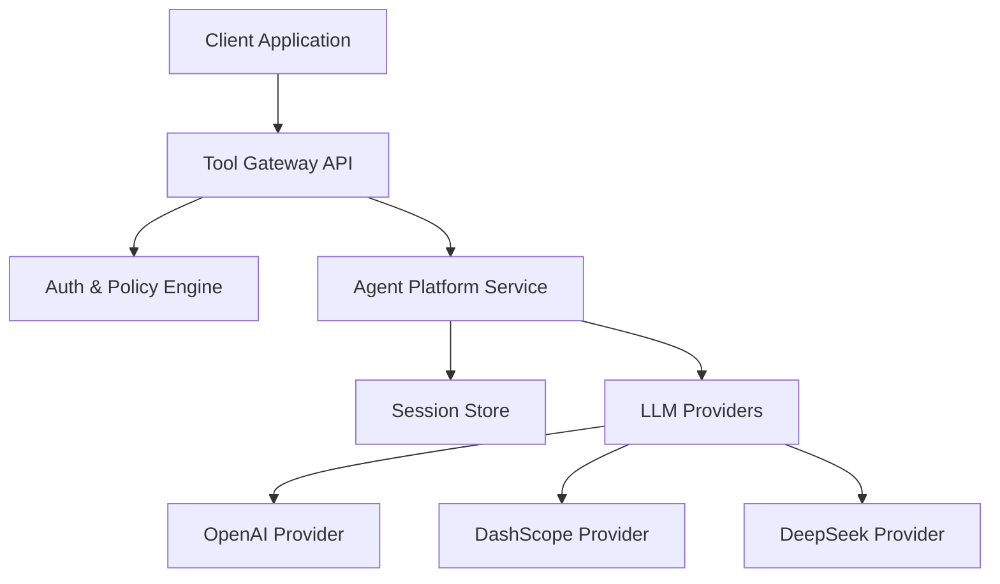
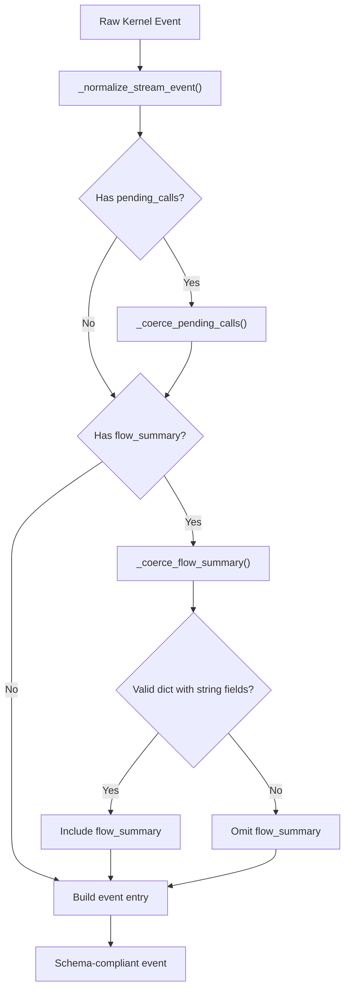
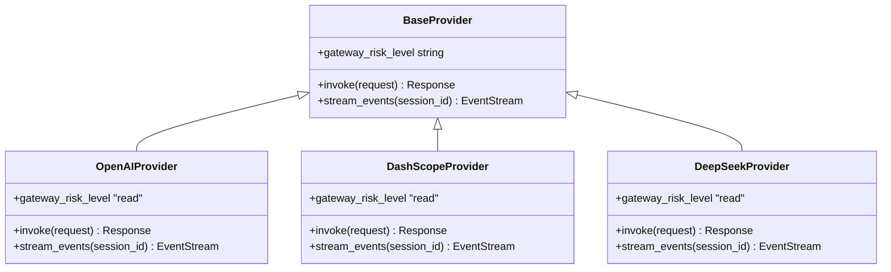
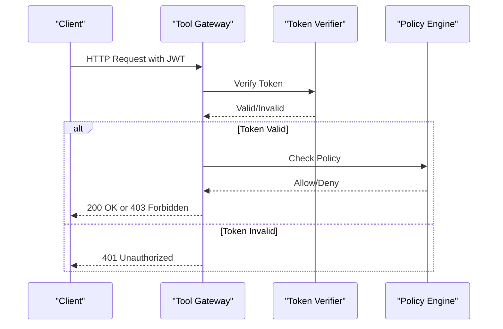
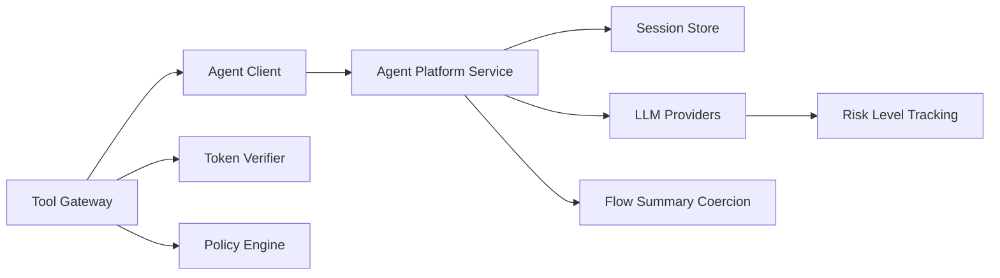

# Agent Platform API

<cite>
**Referenced Files in This Document**
- [routes.py](file://products/agent-platform/src/agent_service/api/v2/routes.py)
- [gateway_tools.py](file://products/agent-platform/src/agent_service/tools/gateway_tools.py)
- [agent-stream-event.schema.json](file://shared/shared-contracts/schemas/agent-stream-event.schema.json)
- [tool-result.schema.json](file://shared/shared-contracts/schemas/tool-result.schema.json)
- [test_contract_adapter.py](file://products/agent-platform/tests/test_contract_adapter.py)
- [test_gateway_tools.py](file://products/agent-platform/tests/test_gateway_tools.py)
- [ChatView.tsx](file://products/operator-portal/web-ui/app/src/chat/ChatView.tsx)
- [gateway_service.py](file://products/tool-gateway/src/tool_gateway/services/gateway_service.py)
- [test_tool_invoke.py](file://products/tool-gateway/tests/test_tool_invoke.py)
- [agent-session.schema.json](file://shared/shared-contracts/schemas/agent-session.schema.json)
- [sessions.ts](file://products/operator-portal/web-ui/app/src/api/sessions.ts)
- [sessions.test.ts](file://products/operator-portal/web-ui/app/src/api/__tests__/sessions.test.ts)
</cite>

## Update Summary
**Changes Made**
- Updated v6 schema compliance section to document risk level handling in pending calls
- Enhanced confirmation request documentation with per-call risk_level support
- Added details about mutate badge functionality for different tool call types
- Updated streaming event schema documentation to reflect v6 changes
- **Updated v9 schema compliance section to document optional flow_summary field in confirmation_request frames**
- **Added comprehensive documentation for defensive coercion logic via _coerce_flow_summary function**
- **Enhanced examples to include flow_summary handling and validation behavior**
- **Corrected API documentation for declare_skill_target endpoint to remove misleading language about 'sessions that become development sessions' and clarify that session_type is fixed at creation time**

## Table of Contents
1. [Introduction](#introduction)
2. [Project Structure](#project-structure)
3. [Core Components](#core-components)
4. [Architecture Overview](#architecture-overview)
5. [Detailed Component Analysis](#detailed-component-analysis)
6. [Dependency Analysis](#dependency-analysis)
7. [Performance Considerations](#performance-considerations)
8. [Troubleshooting Guide](#troubleshooting-guide)
9. [Conclusion](#conclusion)
10. [Appendices](#appendices)

## Introduction
This document provides comprehensive API documentation for the Agent Platform service endpoints, focusing on agent orchestration, session management, and provider interactions. It covers REST APIs exposed via the tool gateway and internal services within the agent platform, including authentication using JWT tokens, rate limiting policies, WebSocket streaming for real-time responses, and long-running operations. Practical examples are included to demonstrate agent creation, chat interactions, session handling, and provider configuration. Error codes, retry strategies, and client implementation guidelines across multiple programming languages are also provided.

**Updated** Enhanced with v6 schema compliance features for risk level handling in pending calls, enabling proper risk tagging and mutate badges for different tool call types through improved `_coerce_pending_calls` function, plus v9 schema compliance for browser-flow headline support in confirmation requests. Also corrected documentation for the `declare_skill_target` endpoint to clarify that session_type is fixed at creation time and cannot be changed by declaring a skill target.

## Project Structure
The Agent Platform is composed of several key modules:
- Agent Service: Core logic for agent orchestration, session management, and provider integration.
- Tool Gateway: External-facing API gateway that handles authentication, policy enforcement, and routing to internal services.
- Shared Contracts: JSON schemas defining request/response formats for interoperability.
- Identity Broker: Handles authentication and token issuance (referenced for context).



**Diagram sources**
- [routes.py:53-165](file://products/agent-platform/src/agent_service/api/v2/routes.py#L53-L165)
- [gateway_tools.py:165-213](file://products/agent-platform/src/agent_service/tools/gateway_tools.py#L165-L213)

**Section sources**
- [routes.py:1-53](file://products/agent-platform/src/agent_service/api/v2/routes.py#L1-L53)
- [gateway_tools.py:1-45](file://products/agent-platform/src/agent_service/tools/gateway_tools.py#L1-L45)

## Core Components
- Agent Orchestration: Manages agent lifecycle, tool execution, and provider selection.
- Session Management: Persists and retrieves conversation state using a session store.
- Provider Integration: Abstracts LLM providers with a common interface.
- Authentication & Authorization: Validates JWT tokens and enforces policies.
- Streaming & WebSockets: Supports real-time event streaming for long-running operations.
- Risk Level Handling: v6 schema compliance for per-call risk levels in pending confirmations.
- Browser Flow Headlines: v9 schema compliance for optional flow_summary field in confirmation_request frames.
- Session Type Immutability: session_type is fixed at creation time and cannot be changed by declaring skill targets.

**Updated** Enhanced with v6 schema compliance for risk level handling in pending calls, supporting read/write/admin risk tiers for better mutation detection in the portal UI, plus v9 schema compliance for browser-flow headline support. Also clarified that session_type is immutable and set only at session creation.

**Section sources**
- [routes.py:259-340](file://products/agent-platform/src/agent_service/api/v2/routes.py#L259-L340)
- [routes.py:497-614](file://products/agent-platform/src/agent_service/api/v2/routes.py#L497-L614)
- [routes.py:822-827](file://products/agent-platform/src/agent_service/api/v2/routes.py#L822-L827)
- [routes.py:1226-1244](file://products/agent-platform/src/agent_service/api/v2/routes.py#L1226-L1244)
- [gateway_tools.py:200-208](file://products/agent-platform/src/agent_service/tools/gateway_tools.py#L200-L208)

## Architecture Overview
The system follows a layered architecture:
- Client Layer: Applications interacting via REST or WebSocket APIs.
- Gateway Layer: Tool gateway handling auth, policy, and routing.
- Service Layer: Agent platform service orchestrating agents and sessions.
- Storage Layer: Session persistence and metadata storage.
- Provider Layer: Pluggable LLM providers.


**Diagram sources**
- [routes.py:107-165](file://products/agent-platform/src/agent_service/api/v2/routes.py#L107-L165)
- [gateway_tools.py:76-109](file://products/agent-platform/src/agent_service/tools/gateway_tools.py#L76-L109)

## Detailed Component Analysis

### REST API Endpoints
All public endpoints are exposed through the tool gateway under `/api/v2`.

#### Authentication
- Endpoint: `POST /api/v2/auth/token`
- Method: POST
- Description: Issues JWT tokens for clients.
- Authentication: None (public endpoint)
- Rate Limiting: Configurable via policy engine.

#### Chat Interaction
- Endpoint: `POST /api/v2/chat`
- Method: POST
- Description: Initiates a chat interaction with an agent.
- Authentication: Requires valid JWT in `Authorization: Bearer <token>` header.
- Rate Limiting: Enforced by policy engine based on user identity.

#### Session Management
- Endpoint: `GET /api/v2/sessions/{session_id}`
- Method: GET
- Description: Retrieves session details.
- Authentication: Requires JWT.

- Endpoint: `POST /api/v2/sessions`
- Method: POST
- Description: Creates a new session with fixed session_type.
- Authentication: Requires JWT.
- **Important**: session_type is set once at creation and cannot be changed afterwards.

- Endpoint: `DELETE /api/v2/sessions/{session_id}`
- Method: DELETE
- Description: Deletes a session (owner-only, prevents deletion if pending confirmation exists).
- Authentication: Requires JWT.

#### Skill Target Declaration
- Endpoint: `POST /api/v2/sessions/{session_id}/skill-target`
- Method: POST
- Description: Declares the web target a skill-development session works against.
- Authentication: Requires JWT with `session:skill_graduate` permission.
- **Important**: This endpoint does NOT change session_type - it only declares the target scope for the existing session.
- **Important**: session_type is fixed at session creation and cannot be modified by this endpoint.

#### Health Check
- Endpoint: `GET /api/v2/health`
- Method: GET
- Description: Returns service health status.
- Authentication: None.

**Section sources**
- [routes.py:107-165](file://products/agent-platform/src/agent_service/api/v2/routes.py#L107-L165)
- [routes.py:346-438](file://products/agent-platform/src/agent_service/api/v2/routes.py#L346-L438)
- [routes.py:461-475](file://products/agent-platform/src/agent_service/api/v2/routes.py#L461-L475)
- [routes.py:822-827](file://products/agent-platform/src/agent_service/api/v2/routes.py#L822-L827)
- [routes.py:1219-1294](file://products/agent-platform/src/agent_service/api/v2/routes.py#L1219-L1294)

### WebSocket API
- Endpoint: `GET /api/v2/chat/stream`
- Protocol: Server-Sent Events (SSE)
- Description: Establishes a real-time streaming connection for long-running operations.
- Message Schema: See [agent-stream-event.schema.json](file://shared/shared-contracts/schemas/agent-stream-event.schema.json)
- Authentication: Requires JWT in headers.

**Updated** Enhanced with v6 schema compliance supporting per-call risk levels in confirmation_request events for better mutation detection, plus v9 schema compliance for optional flow_summary field carrying browser-flow headline information.

**Section sources**
- [routes.py:135-165](file://products/agent-platform/src/agent_service/api/v2/routes.py#L135-L165)
- [agent-stream-event.schema.json:1-121](file://shared/shared-contracts/schemas/agent-stream-event.schema.json#L1-L121)

### Confirmation Requests and Risk Level Handling
The system supports both v6 schema compliance for risk level handling in pending calls and v9 schema compliance for browser-flow headline support in confirmation requests.

#### Pending Calls with Risk Levels
- **Risk Level Values**: `read`, `write`, `admin`
- **Schema Compliance**: Per-call risk_level field in pending_calls array
- **Portal Integration**: Mutate badges displayed for write/admin risk levels
- **Validation**: Only schema-conformant risk levels are passed through; invalid values are omitted

#### Browser Flow Headlines (v9)
- **Flow Summary Fields**: `skill_id`, `origin`, `title`, `description`, `risk_class`
- **Schema Compliance**: Optional flow_summary field on confirmation_request frames
- **Defensive Coercion**: Malformed summaries degrade gracefully to prevent validation failures
- **Portal Integration**: Live operator cards render workflow headlines matching durable records



**Diagram sources**
- [routes.py:503-614](file://products/agent-platform/src/agent_service/api/v2/routes.py#L503-L614)
- [agent-stream-event.schema.json:59-70](file://shared/shared-contracts/schemas/agent-stream-event.schema.json#L59-L70)

**Section sources**
- [routes.py:259-340](file://products/agent-platform/src/agent_service/api/v2/routes.py#L259-L340)
- [routes.py:497-614](file://products/agent-platform/src/agent_service/api/v2/routes.py#L497-L614)
- [test_contract_adapter.py:253-330](file://products/agent-platform/tests/test_contract_adapter.py#L253-L330)

### Provider Interactions
Providers implement a common interface for LLM interactions with enhanced risk level support.



**Updated** Enhanced with gateway risk level support for proper mutation detection and confirmation workflows.

**Diagram sources**
- [gateway_tools.py:165-213](file://products/agent-platform/src/agent_service/tools/gateway_tools.py#L165-L213)
- [test_gateway_tools.py:324-343](file://products/agent-platform/tests/test_gateway_tools.py#L324-343)

**Section sources**
- [gateway_tools.py:165-213](file://products/agent-platform/src/agent_service/tools/gateway_tools.py#L165-L213)

### Authentication Flow
JWT tokens are validated at the gateway layer before requests are forwarded to internal services.



**Section sources**
- [gateway_service.py:250-263](file://products/tool-gateway/src/tool_gateway/services/gateway_service.py#L250-L263)
- [test_tool_invoke.py:307-340](file://products/tool-gateway/tests/test_tool_invoke.py#L307-L340)

### Session Type Immutability
The session_type field is immutable and set exactly once at session creation. This is a critical design principle that ensures consistency and prevents confusion about session capabilities.

#### Key Principles
- **Fixed at Birth**: session_type is written exactly once when the session is created
- **No Runtime Changes**: No code path can modify session_type after creation
- **Decoupled from Skill Targets**: Declaring a skill target does not change session_type
- **Two Types**: `operation` (default) and `development` (Studio sessions)

#### Implementation Details
- Session creation accepts explicit session_type parameter
- Default value is `operation` for backward compatibility
- Development sessions must be explicitly created with `session_type=development`
- The declare_skill_target endpoint explicitly states it never re-types sessions

**Section sources**
- [routes.py:822-827](file://products/agent-platform/src/agent_service/api/v2/routes.py#L822-L827)
- [routes.py:1226-1244](file://products/agent-platform/src/agent_service/api/v2/routes.py#L1226-L1244)
- [sessions.ts:307-314](file://products/operator-portal/web-ui/app/src/api/sessions.ts#L307-L314)

## Dependency Analysis
The tool gateway depends on internal services and external providers with enhanced risk level tracking and flow summary support.



**Updated** Enhanced dependency chain includes risk level tracking for proper mutation detection in confirmation workflows and flow summary coercion for browser-flow headline support.

**Diagram sources**
- [gateway_tools.py:200-208](file://products/agent-platform/src/agent_service/tools/gateway_tools.py#L200-L208)
- [routes.py:497-614](file://products/agent-platform/src/agent_service/api/v2/routes.py#L497-L614)

**Section sources**
- [gateway_tools.py:165-213](file://products/agent-platform/src/agent_service/tools/gateway_tools.py#L165-L213)
- [routes.py:259-340](file://products/agent-platform/src/agent_service/api/v2/routes.py#L259-L340)
- [routes.py:497-614](file://products/agent-platform/src/agent_service/api/v2/routes.py#L497-L614)

## Performance Considerations
- Use connection pooling for LLM provider calls.
- Implement caching for frequently accessed session data.
- Monitor metrics and telemetry for bottleneck identification.
- Configure rate limiting to prevent abuse.
- Optimize risk level validation for high-throughput scenarios.
- **Optimize flow summary coercion to handle malformed data efficiently without performance impact.**

**Updated** Added performance considerations for risk level validation in pending calls processing and flow summary coercion for browser-flow headlines.

## Troubleshooting Guide
Common issues and resolutions:
- Authentication Failures: Ensure JWT is valid and not expired.
- Rate Limiting Errors: Check policy configurations and adjust limits if necessary.
- Provider Timeouts: Verify provider credentials and network connectivity.
- Session Loss: Confirm session store availability and persistence settings.
- Risk Level Validation Errors: Ensure risk_level values conform to schema (read/write/admin).
- **Flow Summary Validation Errors: Ensure flow_summary contains only contract-defined string fields (skill_id, origin, title, description, risk_class).**
- **Session Type Confusion: Remember that session_type is fixed at creation and cannot be changed by declaring skill targets.**

**Updated** Added troubleshooting guidance for risk level validation issues in pending calls, flow summary validation errors in confirmation requests, and clarification about session type immutability.

**Section sources**
- [test_contract_adapter.py:202-330](file://products/agent-platform/tests/test_contract_adapter.py#L202-L330)

## Conclusion
The Agent Platform API provides a robust framework for agent orchestration, session management, and provider interactions. With strong authentication, policy enforcement, real-time streaming capabilities, and enhanced v6 schema compliance for risk level handling plus v9 schema compliance for browser-flow headline support, it supports scalable and secure AI-driven applications with proper mutation detection, confirmation workflows, and consistent operator experience across live and durable views.

**Updated** Enhanced conclusion reflecting v6 schema compliance improvements for risk level handling in pending calls, v9 schema compliance for browser-flow headline support in confirmation requests, and clear documentation that session_type is immutable and fixed at creation time.

## Appendices

### Example Requests and Responses

#### Create a Session
- Method: POST
- URL: `/api/v2/sessions`
- Headers: `Authorization: Bearer <jwt>`
- Response: Session object with metadata
- **Note**: session_type is set once at creation and cannot be changed afterwards

#### Send a Chat Message
- Method: POST
- URL: `/api/v2/chat`
- Headers: `Authorization: Bearer <jwt>`
- Response: Chat response with structured output

#### Handle Confirmation Request with Risk Levels and Flow Summary
- Event Type: `confirmation_request`
- Payload includes pending_calls with per-call risk_level fields
- **Optional flow_summary with browser-flow headline fields**
- Portal displays mutate badges for write/admin risk levels and workflow headlines

#### Declare Skill Target (Does Not Change Session Type)
- Method: POST
- URL: `/api/v2/sessions/{session_id}/skill-target`
- Body: `{ "target": "https://example.com" }`
- Response: `{ "session_id": "...", "target": "...", "already_declared": false }`
- **Important**: This endpoint declares the target scope but does NOT change session_type

**Updated** Added example for handling confirmation requests with v6 risk level support and v9 flow_summary support, plus clarification that skill target declaration does not change session type.

**Section sources**
- [routes.py:346-438](file://products/agent-platform/src/agent_service/api/v2/routes.py#L346-L438)
- [routes.py:1219-1294](file://products/agent-platform/src/agent_service/api/v2/routes.py#L1219-L1294)
- [agent-stream-event.schema.json:32-70](file://shared/shared-contracts/schemas/agent-stream-event.schema.json#L32-L70)

### Error Codes and Retry Strategies
- 401 Unauthorized: Invalid or missing JWT. Retry after refreshing token.
- 403 Forbidden: Policy denied. Review access controls.
- 409 Conflict: Session has pending confirmation. Resolve before retry.
- 429 Too Many Requests: Rate limit exceeded. Implement exponential backoff.
- 500 Internal Server Error: Unexpected failure. Log and retry with backoff.

**Updated** Added 409 conflict error code for pending confirmation scenarios.

### Client Implementation Guidelines
- Python: Use `requests` for REST and `websockets` for streaming.
- JavaScript: Use `axios` for REST and `WebSocket` API for streaming.
- Go: Use `net/http` for REST and `gorilla/websocket` for streaming.
- Java: Use `OkHttp` for REST and `Java WebSocket API` for streaming.

**Updated** Enhanced guidelines for handling v6 schema compliance in client implementations, v9 flow_summary handling, and understanding that session_type is immutable.

### Risk Level and Flow Summary Handling Examples

#### Schema-Compliant Risk Levels with Flow Summary
```json
{
  "type": "confirmation_request",
  "confirm_id": "cf-flow",
  "pending_calls": [
    {
      "call_id": "call-1",
      "tool_name": "k8s.restart_service",
      "risk_level": "write"
    },
    {
      "call_id": "call-2", 
      "tool_name": "k8s.get_pod_logs",
      "risk_level": "read"
    }
  ],
  "flow_summary": {
    "skill_id": "browser.check.reset",
    "origin": "browser-flow",
    "title": "Reset the check target",
    "description": "Clears the SPEC-051 Design 1 form and re-runs the check.",
    "risk_class": "write"
  }
}
```

#### Portal Mutation Detection and Workflow Headlines
The portal uses risk_level to display mutate badges and flow_summary for workflow headlines:
- `read`: No badge (safe operations)
- `write`: Orange "mutating" badge (requires confirmation)
- `admin`: Orange "mutating" badge (requires confirmation)
- **flow_summary**: Displays workflow headline with skill intent, origin, title, description, and risk class

#### Defensive Coercion Behavior
- Non-dict flow_summary degrades to absent (card falls back to plain tool-action rendering)
- Unknown fields in flow_summary are stripped while valid fields survive
- Non-string values in flow_summary are ignored
- Malformed summaries never fail frame validation due to additionalProperties:false constraint

#### Session Type Immutability Examples
```javascript
// Creating a development session (must specify session_type)
const devSession = await createSession(undefined, undefined, "development");

// Declaring a skill target does NOT change session_type
await declareSkillTarget(devSession.session_id, "https://admin.internal/login");
// Session remains development type, target is just declared

// Cannot convert operation session to development via skill target
await declareSkillTarget(operationSession.session_id, "https://admin.internal/login");
// Session remains operation type, target is declared but type unchanged
```

**Updated** Added detailed examples of risk level handling, flow_summary support, defensive coercion behavior, and session type immutability.

**Section sources**
- [test_contract_adapter.py:253-330](file://products/agent-platform/tests/test_contract_adapter.py#L253-L330)
- [routes.py:600-614](file://products/agent-platform/src/agent_service/api/v2/routes.py#L600-L614)
- [routes.py:822-827](file://products/agent-platform/src/agent_service/api/v2/routes.py#L822-L827)
- [routes.py:1226-1244](file://products/agent-platform/src/agent_service/api/v2/routes.py#L1226-L1244)
- [agent-stream-event.schema.json:59-70](file://shared/shared-contracts/schemas/agent-stream-event.schema.json#L59-L70)
- [ChatView.tsx:253-265](file://products/operator-portal/web-ui/app/src/chat/ChatView.tsx#L253-L265)
- [sessions.ts:307-314](file://products/operator-portal/web-ui/app/src/api/sessions.ts#L307-L314)