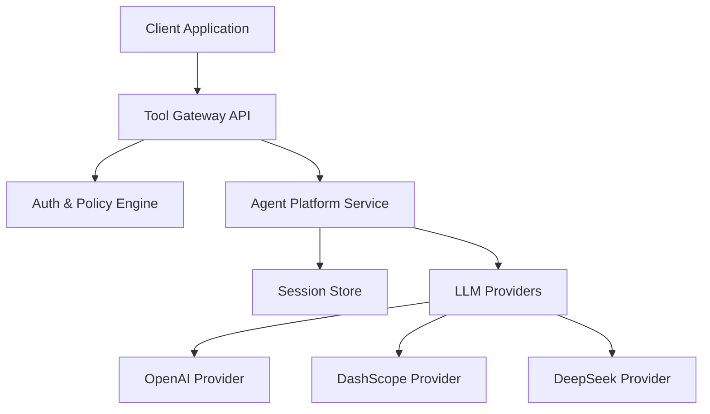
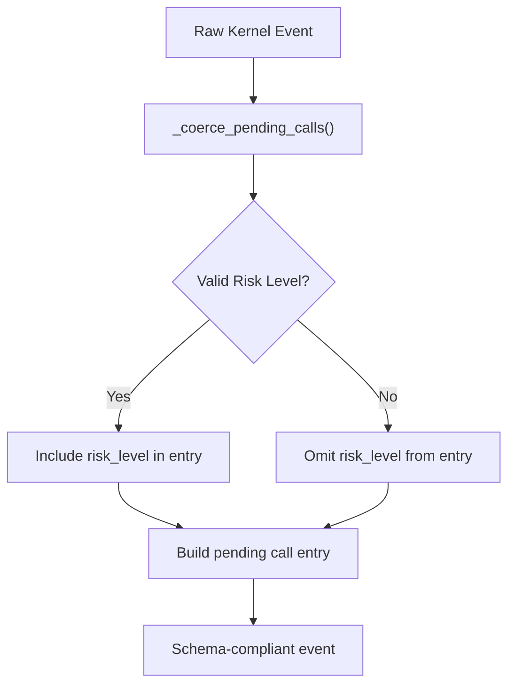
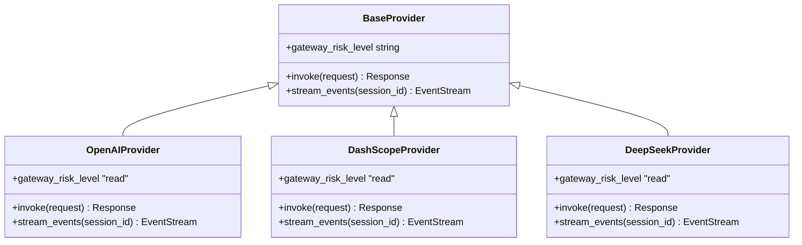
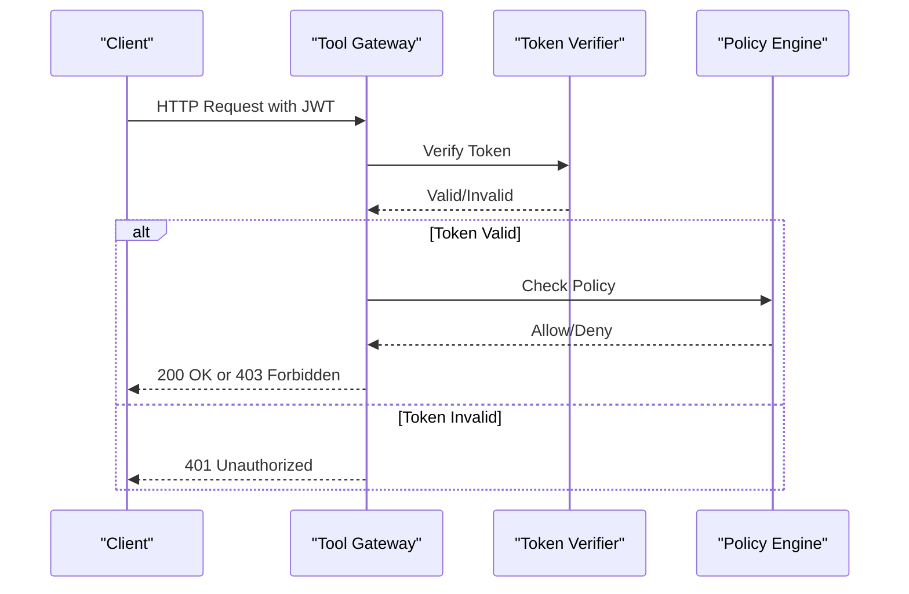
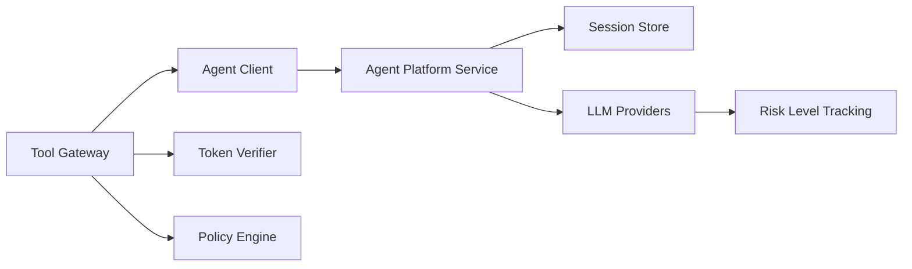

# Agent Platform API

<cite>
**Referenced Files in This Document**
- [routes.py](file://products/agent-platform/src/agent_service/api/v2/routes.py)
- [gateway_tools.py](file://products/agent-platform/src/agent_service/tools/gateway_tools.py)
- [agent-stream-event.schema.json](file://shared/shared-contracts/schemas/agent-stream-event.schema.json)
- [tool-result.schema.json](file://shared/shared-contracts/schemas/tool-result.schema.json)
- [test_contract_adapter.py](file://products/agent-platform/tests/test_contract_adapter.py)
- [test_gateway_tools.py](file://products/agent-platform/tests/test_gateway_tools.py)
- [ChatView.tsx](file://products/operator-portal/web-ui/app/src/chat/ChatView.tsx)
- [gateway_service.py](file://products/tool-gateway/src/tool_gateway/services/gateway_service.py)
- [test_tool_invoke.py](file://products/tool-gateway/tests/test_tool_invoke.py)
</cite>

## Update Summary
**Changes Made**
- Updated v6 schema compliance section to document risk level handling in pending calls
- Enhanced confirmation request documentation with per-call risk_level support
- Added details about mutate badge functionality for different tool call types
- Updated streaming event schema documentation to reflect v6 changes
- Added examples of risk level validation and coercion behavior

## Table of Contents
1. [Introduction](#introduction)
2. [Project Structure](#project-structure)
3. [Core Components](#core-components)
4. [Architecture Overview](#architecture-overview)
5. [Detailed Component Analysis](#detailed-component-analysis)
6. [Dependency Analysis](#dependency-analysis)
7. [Performance Considerations](#performance-considerations)
8. [Troubleshooting Guide](#troubleshooting-guide)
9. [Conclusion](#conclusion)
10. [Appendices](#appendices)

## Introduction
This document provides comprehensive API documentation for the Agent Platform service endpoints, focusing on agent orchestration, session management, and provider interactions. It covers REST APIs exposed via the tool gateway and internal services within the agent platform, including authentication using JWT tokens, rate limiting policies, WebSocket streaming for real-time responses, and long-running operations. Practical examples are included to demonstrate agent creation, chat interactions, session handling, and provider configuration. Error codes, retry strategies, and client implementation guidelines across multiple programming languages are also provided.

**Updated** Enhanced with v6 schema compliance features for risk level handling in pending calls, enabling proper risk tagging and mutate badges for different tool call types through improved `_coerce_pending_calls` function.

## Project Structure
The Agent Platform is composed of several key modules:
- Agent Service: Core logic for agent orchestration, session management, and provider integration.
- Tool Gateway: External-facing API gateway that handles authentication, policy enforcement, and routing to internal services.
- Shared Contracts: JSON schemas defining request/response formats for interoperability.
- Identity Broker: Handles authentication and token issuance (referenced for context).



**Diagram sources**
- [routes.py:53-165](file://products/agent-platform/src/agent_service/api/v2/routes.py#L53-L165)
- [gateway_tools.py:165-213](file://products/agent-platform/src/agent_service/tools/gateway_tools.py#L165-L213)

**Section sources**
- [routes.py:1-53](file://products/agent-platform/src/agent_service/api/v2/routes.py#L1-L53)
- [gateway_tools.py:1-45](file://products/agent-platform/src/agent_service/tools/gateway_tools.py#L1-L45)

## Core Components
- Agent Orchestration: Manages agent lifecycle, tool execution, and provider selection.
- Session Management: Persists and retrieves conversation state using a session store.
- Provider Integration: Abstracts LLM providers with a common interface.
- Authentication & Authorization: Validates JWT tokens and enforces policies.
- Streaming & WebSockets: Supports real-time event streaming for long-running operations.
- Risk Level Handling: v6 schema compliance for per-call risk levels in pending confirmations.

**Updated** Enhanced with v6 schema compliance for risk level handling in pending calls, supporting read/write/admin risk tiers for better mutation detection in the portal UI.

**Section sources**
- [routes.py:259-340](file://products/agent-platform/src/agent_service/api/v2/routes.py#L259-L340)
- [gateway_tools.py:200-208](file://products/agent-platform/src/agent_service/tools/gateway_tools.py#L200-L208)

## Architecture Overview
The system follows a layered architecture:
- Client Layer: Applications interacting via REST or WebSocket APIs.
- Gateway Layer: Tool gateway handling auth, policy, and routing.
- Service Layer: Agent platform service orchestrating agents and sessions.
- Storage Layer: Session persistence and metadata storage.
- Provider Layer: Pluggable LLM providers.


**Diagram sources**
- [routes.py:107-165](file://products/agent-platform/src/agent_service/api/v2/routes.py#L107-L165)
- [gateway_tools.py:76-109](file://products/agent-platform/src/agent_service/tools/gateway_tools.py#L76-L109)

## Detailed Component Analysis

### REST API Endpoints
All public endpoints are exposed through the tool gateway under `/api/v2`.

#### Authentication
- Endpoint: `POST /api/v2/auth/token`
- Method: POST
- Description: Issues JWT tokens for clients.
- Authentication: None (public endpoint)
- Rate Limiting: Configurable via policy engine.

#### Chat Interaction
- Endpoint: `POST /api/v2/chat`
- Method: POST
- Description: Initiates a chat interaction with an agent.
- Authentication: Requires valid JWT in `Authorization: Bearer <token>` header.
- Rate Limiting: Enforced by policy engine based on user identity.

#### Session Management
- Endpoint: `GET /api/v2/sessions/{session_id}`
- Method: GET
- Description: Retrieves session details.
- Authentication: Requires JWT.

- Endpoint: `POST /api/v2/sessions`
- Method: POST
- Description: Creates a new session.
- Authentication: Requires JWT.

- Endpoint: `DELETE /api/v2/sessions/{session_id}`
- Method: DELETE
- Description: Deletes a session (owner-only, prevents deletion if pending confirmation exists).
- Authentication: Requires JWT.

#### Health Check
- Endpoint: `GET /api/v2/health`
- Method: GET
- Description: Returns service health status.
- Authentication: None.

**Section sources**
- [routes.py:107-165](file://products/agent-platform/src/agent_service/api/v2/routes.py#L107-L165)
- [routes.py:346-438](file://products/agent-platform/src/agent_service/api/v2/routes.py#L346-L438)
- [routes.py:461-475](file://products/agent-platform/src/agent_service/api/v2/routes.py#L461-L475)

### WebSocket API
- Endpoint: `GET /api/v2/chat/stream`
- Protocol: Server-Sent Events (SSE)
- Description: Establishes a real-time streaming connection for long-running operations.
- Message Schema: See [agent-stream-event.schema.json](file://shared/shared-contracts/schemas/agent-stream-event.schema.json)
- Authentication: Requires JWT in headers.

**Updated** Enhanced with v6 schema compliance supporting per-call risk levels in confirmation_request events for better mutation detection.

**Section sources**
- [routes.py:135-165](file://products/agent-platform/src/agent_service/api/v2/routes.py#L135-L165)
- [agent-stream-event.schema.json:1-101](file://shared/shared-contracts/schemas/agent-stream-event.schema.json#L1-L101)

### Confirmation Requests and Risk Level Handling
The system now supports v6 schema compliance for risk level handling in pending calls, enabling proper risk tagging and mutate badges for different tool call types.

#### Pending Calls with Risk Levels
- **Risk Level Values**: `read`, `write`, `admin`
- **Schema Compliance**: Per-call risk_level field in pending_calls array
- **Portal Integration**: Mutate badges displayed for write/admin risk levels
- **Validation**: Only schema-conformant risk levels are passed through; invalid values are omitted



**Diagram sources**
- [routes.py:315-340](file://products/agent-platform/src/agent_service/api/v2/routes.py#L315-L340)
- [agent-stream-event.schema.json:32-49](file://shared/shared-contracts/schemas/agent-stream-event.schema.json#L32-L49)

**Section sources**
- [routes.py:259-340](file://products/agent-platform/src/agent_service/api/v2/routes.py#L259-L340)
- [test_contract_adapter.py:221-250](file://products/agent-platform/tests/test_contract_adapter.py#L221-L250)

### Provider Interactions
Providers implement a common interface for LLM interactions with enhanced risk level support.



**Updated** Enhanced with gateway risk level support for proper mutation detection and confirmation workflows.

**Diagram sources**
- [gateway_tools.py:165-213](file://products/agent-platform/src/agent_service/tools/gateway_tools.py#L165-L213)
- [test_gateway_tools.py:324-343](file://products/agent-platform/tests/test_gateway_tools.py#L324-L343)

**Section sources**
- [gateway_tools.py:165-213](file://products/agent-platform/src/agent_service/tools/gateway_tools.py#L165-L213)

### Authentication Flow
JWT tokens are validated at the gateway layer before requests are forwarded to internal services.



**Section sources**
- [gateway_service.py:250-263](file://products/tool-gateway/src/tool_gateway/services/gateway_service.py#L250-L263)
- [test_tool_invoke.py:307-340](file://products/tool-gateway/tests/test_tool_invoke.py#L307-L340)

## Dependency Analysis
The tool gateway depends on internal services and external providers with enhanced risk level tracking.



**Updated** Enhanced dependency chain includes risk level tracking for proper mutation detection in confirmation workflows.

**Diagram sources**
- [gateway_tools.py:200-208](file://products/agent-platform/src/agent_service/tools/gateway_tools.py#L200-L208)
- [routes.py:315-340](file://products/agent-platform/src/agent_service/api/v2/routes.py#L315-L340)

**Section sources**
- [gateway_tools.py:165-213](file://products/agent-platform/src/agent_service/tools/gateway_tools.py#L165-L213)
- [routes.py:259-340](file://products/agent-platform/src/agent_service/api/v2/routes.py#L259-L340)

## Performance Considerations
- Use connection pooling for LLM provider calls.
- Implement caching for frequently accessed session data.
- Monitor metrics and telemetry for bottleneck identification.
- Configure rate limiting to prevent abuse.
- Optimize risk level validation for high-throughput scenarios.

**Updated** Added performance considerations for risk level validation in pending calls processing.

## Troubleshooting Guide
Common issues and resolutions:
- Authentication Failures: Ensure JWT is valid and not expired.
- Rate Limiting Errors: Check policy configurations and adjust limits if necessary.
- Provider Timeouts: Verify provider credentials and network connectivity.
- Session Loss: Confirm session store availability and persistence settings.
- Risk Level Validation Errors: Ensure risk_level values conform to schema (read/write/admin).

**Updated** Added troubleshooting guidance for risk level validation issues in pending calls.

**Section sources**
- [test_contract_adapter.py:202-250](file://products/agent-platform/tests/test_contract_adapter.py#L202-L250)

## Conclusion
The Agent Platform API provides a robust framework for agent orchestration, session management, and provider interactions. With strong authentication, policy enforcement, real-time streaming capabilities, and enhanced v6 schema compliance for risk level handling, it supports scalable and secure AI-driven applications with proper mutation detection and confirmation workflows.

**Updated** Enhanced conclusion reflecting v6 schema compliance improvements for risk level handling in pending calls.

## Appendices

### Example Requests and Responses

#### Create a Session
- Method: POST
- URL: `/api/v2/sessions`
- Headers: `Authorization: Bearer <jwt>`
- Response: Session object with metadata

#### Send a Chat Message
- Method: POST
- URL: `/api/v2/chat`
- Headers: `Authorization: Bearer <jwt>`
- Response: Chat response with structured output

#### Handle Confirmation Request with Risk Levels
- Event Type: `confirmation_request`
- Payload includes pending_calls with per-call risk_level fields
- Portal displays mutate badges for write/admin risk levels

**Updated** Added example for handling confirmation requests with v6 risk level support.

**Section sources**
- [routes.py:346-438](file://products/agent-platform/src/agent_service/api/v2/routes.py#L346-L438)
- [agent-stream-event.schema.json:32-49](file://shared/shared-contracts/schemas/agent-stream-event.schema.json#L32-L49)

### Error Codes and Retry Strategies
- 401 Unauthorized: Invalid or missing JWT. Retry after refreshing token.
- 403 Forbidden: Policy denied. Review access controls.
- 409 Conflict: Session has pending confirmation. Resolve before retry.
- 429 Too Many Requests: Rate limit exceeded. Implement exponential backoff.
- 500 Internal Server Error: Unexpected failure. Log and retry with backoff.

**Updated** Added 409 conflict error code for pending confirmation scenarios.

### Client Implementation Guidelines
- Python: Use `requests` for REST and `websockets` for streaming.
- JavaScript: Use `axios` for REST and `WebSocket` API for streaming.
- Go: Use `net/http` for REST and `gorilla/websocket` for streaming.
- Java: Use `OkHttp` for REST and `Java WebSocket API` for streaming.

**Updated** Enhanced guidelines for handling v6 schema compliance in client implementations.

### Risk Level Handling Examples

#### Schema-Compliant Risk Levels
```json
{
  "pending_calls": [
    {
      "call_id": "call-1",
      "tool_name": "k8s.restart_service",
      "risk_level": "write"
    },
    {
      "call_id": "call-2", 
      "tool_name": "k8s.get_pod_logs",
      "risk_level": "read"
    }
  ]
}
```

#### Portal Mutation Detection
The portal uses risk_level to display mutate badges:
- `read`: No badge (safe operations)
- `write`: Orange "mutating" badge (requires confirmation)
- `admin`: Orange "mutating" badge (requires confirmation)

**Updated** Added detailed examples of risk level handling and portal integration.

**Section sources**
- [test_contract_adapter.py:221-250](file://products/agent-platform/tests/test_contract_adapter.py#L221-L250)
- [ChatView.tsx:253-265](file://products/operator-portal/web-ui/app/src/chat/ChatView.tsx#L253-L265)