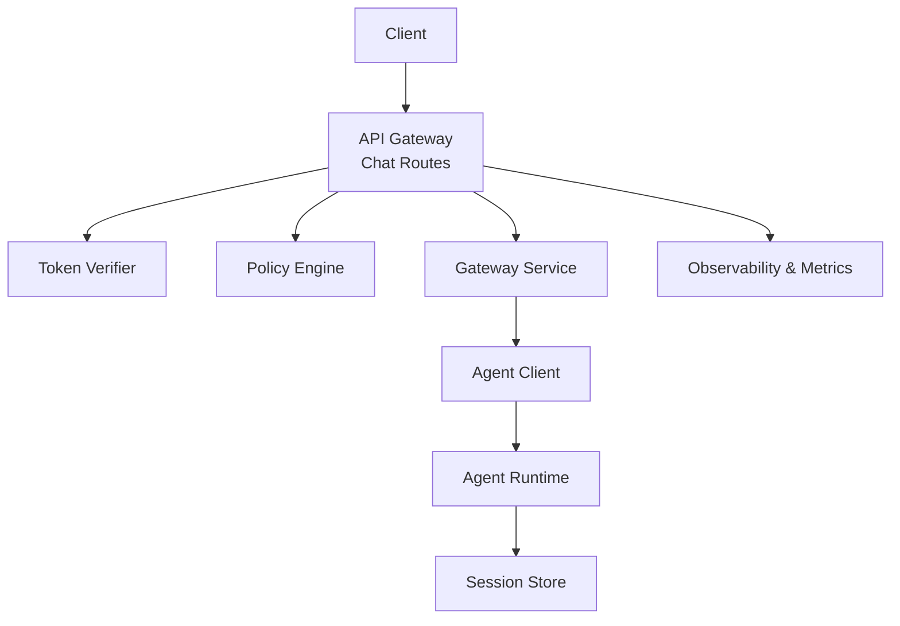
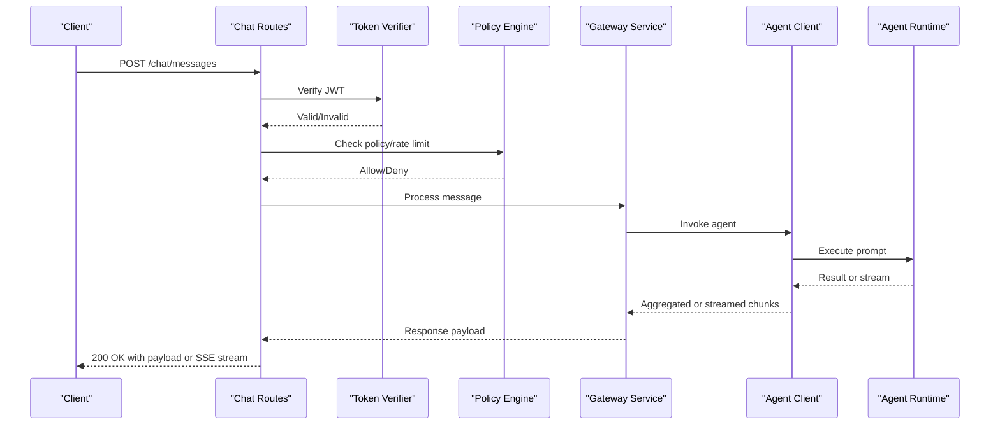
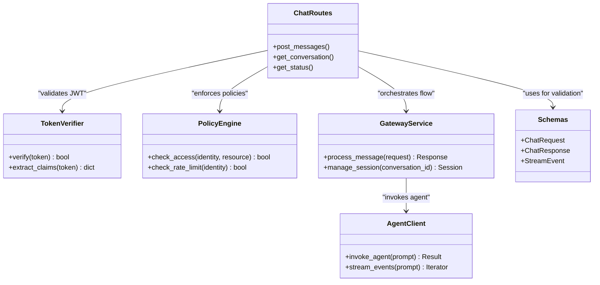

# Chat Endpoints

<cite>
**Referenced Files in This Document**
- [routes.py](file://products/tool-gateway/src/api_gateway/api/routes/chat.py)
- [router.py](file://products/tool-gateway/src/api_gateway/api/router.py)
- [gateway_service.py](file://products/tool-gateway/src/api_gateway/services/gateway_service.py)
- [agent_client.py](file://products/tool-gateway/src/api_gateway/services/agent_client.py)
- [token_verifier.py](file://products/tool-gateway/src/api_gateway/services/token_verifier.py)
- [policy_engine.py](file://products/tool-gateway/src/api_gateway/services/policy_engine.py)
- [api.py](file://products/tool-gateway/src/api_gateway/schemas/api.py)
- [chat-request.schema.json](file://shared/shared-contracts/schemas/chat-request.schema.json)
- [chat-response.schema.json](file://shared/shared-contracts/schemas/chat-response.schema.json)
- [stream-event.schema.json](file://shared/shared-contracts/schemas/stream-event.schema.json)
- [identity-token.schema.json](file://shared/shared-contracts/schemas/identity-token.schema.json)
- [auth.py](file://products/identity-broker/src/identity_service/api/routes/auth.py)
- [config.py](file://products/tool-gateway/src/api_gateway/core/config.py)
- [metrics.py](file://products/tool-gateway/src/api_gateway/core/metrics.py)
- [observability.py](file://products/tool-gateway/src/api_gateway/core/observability.py)
</cite>

## Table of Contents
1. [Introduction](#introduction)
2. [Project Structure](#project-structure)
3. [Core Components](#core-components)
4. [Architecture Overview](#architecture-overview)
5. [Detailed Component Analysis](#detailed-component-analysis)
6. [Dependency Analysis](#dependency-analysis)
7. [Performance Considerations](#performance-considerations)
8. [Troubleshooting Guide](#troubleshooting-guide)
9. [Conclusion](#conclusion)
10. [Appendices](#appendices)

## Introduction
This document provides detailed API documentation for chat-related endpoints exposed by the Agent Platform’s API Gateway. It covers HTTP methods, request/response schemas, authentication using JWT tokens, rate limiting and policy enforcement, streaming responses, error handling patterns, and practical usage examples across multiple programming languages. The goal is to enable clients to send messages, manage conversations, and handle both synchronous and streaming responses reliably.

## Project Structure
The chat endpoints are implemented in the Tool Gateway service under the API routes layer, with business logic delegated to gateway services and external agent runtime clients. Shared JSON schemas define the contract between clients and the platform. Authentication and authorization are enforced via an Identity Broker and a Policy Engine.

**Diagram sources**
- [routes.py](file://products/tool-gateway/src/api_gateway/api/routes/chat.py)
- [gateway_service.py](file://products/tool-gateway/src/api_gateway/services/gateway_service.py)
- [agent_client.py](file://products/tool-gateway/src/api_gateway/services/agent_client.py)
- [token_verifier.py](file://products/tool-gateway/src/api_gateway/services/token_verifier.py)
- [policy_engine.py](file://products/tool-gateway/src/api_gateway/services/policy_engine.py)
- [metrics.py](file://products/tool-gateway/src/api_gateway/core/metrics.py)
- [observability.py](file://products/tool-gateway/src/api_gateway/core/observability.py)

**Section sources**
- [router.py](file://products/tool-gateway/src/api_gateway/api/router.py)
- [routes.py](file://products/tool-gateway/src/api_gateway/api/routes/chat.py)

## Core Components
- Chat Routes: Define HTTP endpoints for chat interactions (POST for sending messages, GET for retrieving conversation context or status).
- Gateway Service: Orchestrates request processing, session management, and response formatting.
- Agent Client: Communicates with the underlying Agent Runtime to execute prompts and retrieve results.
- Token Verifier: Validates JWT tokens from the Identity Broker.
- Policy Engine: Enforces access control and rate limiting policies.
- Schemas: JSON Schema definitions for requests, responses, and stream events.

Key responsibilities:
- Validate incoming requests against shared schemas.
- Authenticate and authorize requests using JWT and policy rules.
- Manage conversation state through sessions.
- Stream partial responses when supported.
- Emit metrics and observability data.

**Section sources**
- [routes.py](file://products/tool-gateway/src/api_gateway/api/routes/chat.py)
- [gateway_service.py](file://products/tool-gateway/src/api_gateway/services/gateway_service.py)
- [agent_client.py](file://products/tool-gateway/src/api_gateway/services/agent_client.py)
- [token_verifier.py](file://products/tool-gateway/src/api_gateway/services/token_verifier.py)
- [policy_engine.py](file://products/tool-gateway/src/api_gateway/services/policy_engine.py)
- [api.py](file://products/tool-gateway/src/api_gateway/schemas/api.py)

## Architecture Overview
The chat flow involves client requests routed through the API Gateway, authenticated and authorized, then forwarded to the Agent Runtime. Responses may be returned synchronously or streamed incrementally. Sessions persist conversation context.

**Diagram sources**
- [routes.py](file://products/tool-gateway/src/api_gateway/api/routes/chat.py)
- [gateway_service.py](file://products/tool-gateway/src/api_gateway/services/gateway_service.py)
- [agent_client.py](file://products/tool-gateway/src/api_gateway/services/agent_client.py)
- [token_verifier.py](file://products/tool-gateway/src/api_gateway/services/token_verifier.py)
- [policy_engine.py](file://products/tool-gateway/src/api_gateway/services/policy_engine.py)

## Detailed Component Analysis

### Chat Endpoints
- POST /chat/messages
  - Purpose: Send a message to the agent within a conversation context.
  - Authentication: Requires a valid JWT token in the Authorization header.
  - Rate Limiting: Enforced by the Policy Engine based on configured limits per identity or tenant.
  - Request Body: Follows the chat request schema.
  - Response: Returns a chat response object or streams incremental events if enabled.
  - Errors: Standardized error codes for validation failures, authentication errors, policy denials, and runtime errors.

- GET /chat/conversations/{conversation_id}
  - Purpose: Retrieve conversation metadata and history for a given conversation ID.
  - Authentication: Requires a valid JWT token.
  - Response: Returns conversation details including messages and timestamps.
  - Errors: Not found, unauthorized, internal server error.

- GET /chat/status
  - Purpose: Retrieve current system health and capability status relevant to chat operations.
  - Authentication: Optional depending on configuration; typically public for health checks.
  - Response: Health and capability indicators.

Request and response schemas are defined in shared contracts:
- Chat Request: Fields include user message, optional conversation_id, model parameters, and metadata.
- Chat Response: Includes generated content, usage statistics, and optional streaming markers.
- Stream Event: Represents incremental updates during long-running operations.

Validation rules:
- Required fields must be present and non-empty.
- Data types must match schema constraints.
- Conversation IDs must follow UUID format where applicable.
- Model parameters must fall within allowed ranges.

Examples:
- Sending a message returns either a complete response or a stream of events.
- Retrieving a conversation returns a structured list of messages with timestamps.

**Section sources**
- [routes.py](file://products/tool-gateway/src/api_gateway/api/routes/chat.py)
- [chat-request.schema.json](file://shared/shared-contracts/schemas/chat-request.schema.json)
- [chat-response.schema.json](file://shared/shared-contracts/schemas/chat-response.schema.json)
- [stream-event.schema.json](file://shared/shared-contracts/schemas/stream-event.schema.json)

### Authentication and Authorization
- JWT Tokens: Issued by the Identity Broker and validated by the Token Verifier.
- Header: Authorization: Bearer <token>.
- Validation: Signature verification, expiration checks, and claim extraction.
- Authorization: Policy Engine evaluates permissions based on claims and resource access rules.

Error patterns:
- 401 Unauthorized: Invalid or missing token.
- 403 Forbidden: Insufficient permissions.
- 429 Too Many Requests: Rate limit exceeded.

**Section sources**
- [token_verifier.py](file://products/tool-gateway/src/api_gateway/services/token_verifier.py)
- [policy_engine.py](file://products/tool-gateway/src/api_gateway/services/policy_engine.py)
- [auth.py](file://products/identity-broker/src/identity_service/api/routes/auth.py)
- [identity-token.schema.json](file://shared/shared-contracts/schemas/identity-token.schema.json)

### Streaming Responses
- Support for Server-Sent Events (SSE) or chunked transfer encoding.
- Stream events conform to the stream event schema.
- Clients should handle partial updates and final completion signals.

Best practices:
- Implement retry logic for transient network issues.
- Buffer and render incremental content appropriately.
- Close connections gracefully upon completion or error.

**Section sources**
- [stream-event.schema.json](file://shared/shared-contracts/schemas/stream-event.schema.json)
- [gateway_service.py](file://products/tool-gateway/src/api_gateway/services/gateway_service.py)

### Error Handling Patterns
Standardized error responses include:
- Error code: Machine-readable identifier.
- Message: Human-readable description.
- Details: Additional context for debugging.

Common scenarios:
- Validation errors: Malformed request body or invalid parameters.
- Authentication errors: Expired or invalid JWT.
- Policy violations: Access denied or rate limited.
- Runtime errors: Agent unavailability or internal failures.

**Section sources**
- [api.py](file://products/tool-gateway/src/api_gateway/schemas/api.py)
- [gateway_service.py](file://products/tool-gateway/src/api_gateway/services/gateway_service.py)

## Dependency Analysis
The chat endpoints depend on several internal services and shared schemas:

**Diagram sources**
- [routes.py](file://products/tool-gateway/src/api_gateway/api/routes/chat.py)
- [token_verifier.py](file://products/tool-gateway/src/api_gateway/services/token_verifier.py)
- [policy_engine.py](file://products/tool-gateway/src/api_gateway/services/policy_engine.py)
- [gateway_service.py](file://products/tool-gateway/src/api_gateway/services/gateway_service.py)
- [agent_client.py](file://products/tool-gateway/src/api_gateway/services/agent_client.py)
- [api.py](file://products/tool-gateway/src/api_gateway/schemas/api.py)

**Section sources**
- [router.py](file://products/tool-gateway/src/api_gateway/api/router.py)
- [api.py](file://products/tool-gateway/src/api_gateway/schemas/api.py)

## Performance Considerations
- Connection pooling: Reuse HTTP connections to reduce latency.
- Streaming: Prefer streaming for large responses to improve perceived performance.
- Caching: Cache frequent queries and reusable resources where appropriate.
- Rate limiting: Configure limits to prevent abuse and ensure fairness.
- Observability: Monitor latency, throughput, and error rates using metrics and logs.

[No sources needed since this section provides general guidance]

## Troubleshooting Guide
Common issues and resolutions:
- Authentication failures: Ensure JWT is valid and not expired.
- Policy denials: Review access controls and quotas assigned to the identity.
- Rate limiting: Reduce request frequency or upgrade plan if necessary.
- Streaming interruptions: Implement retries and handle partial data correctly.
- Internal errors: Check logs and metrics for root cause analysis.

Debugging tips:
- Enable verbose logging for failed requests.
- Use health check endpoints to verify service availability.
- Validate request payloads against shared schemas before sending.

**Section sources**
- [metrics.py](file://products/tool-gateway/src/api_gateway/core/metrics.py)
- [observability.py](file://products/tool-gateway/src/api_gateway/core/observability.py)

## Conclusion
The chat endpoints provide a robust interface for interacting with AI agents through secure, scalable, and observable APIs. By adhering to the documented schemas, authentication requirements, and best practices, clients can build reliable integrations that leverage both synchronous and streaming capabilities. Proper error handling and monitoring ensure resilience and maintainability in production environments.

[No sources needed since this section summarizes without analyzing specific files]

## Appendices

### Practical Code Examples

#### Python Example
- Send a message using requests library.
- Handle streaming responses with iter_lines or similar.
- Manage conversation context by passing conversation_id.

#### JavaScript Example
- Use fetch API to send POST requests.
- Read streaming data with ReadableStream.
- Parse JSON responses and update UI incrementally.

#### Go Example
- Create HTTP client with proper headers.
- Implement goroutines for concurrent streaming.
- Handle errors and retries effectively.

[No sources needed since this section provides general guidance]