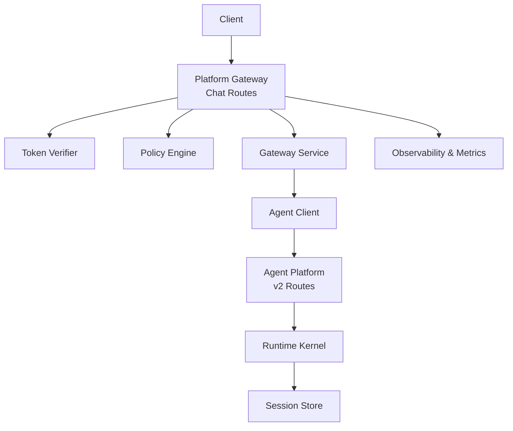
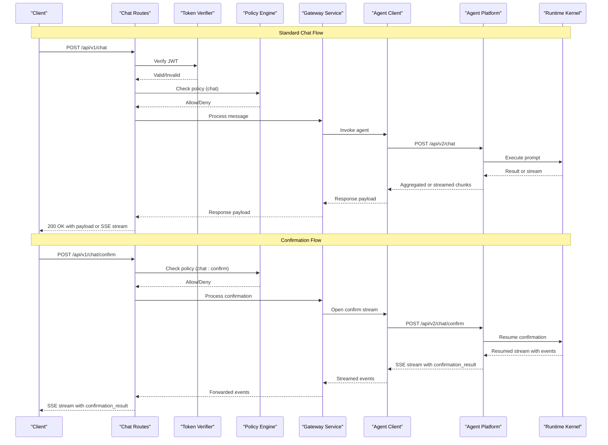
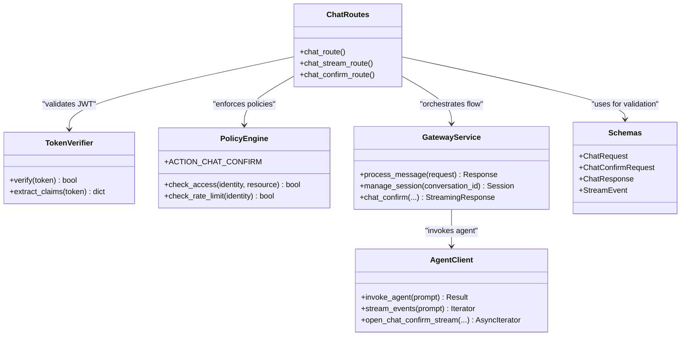
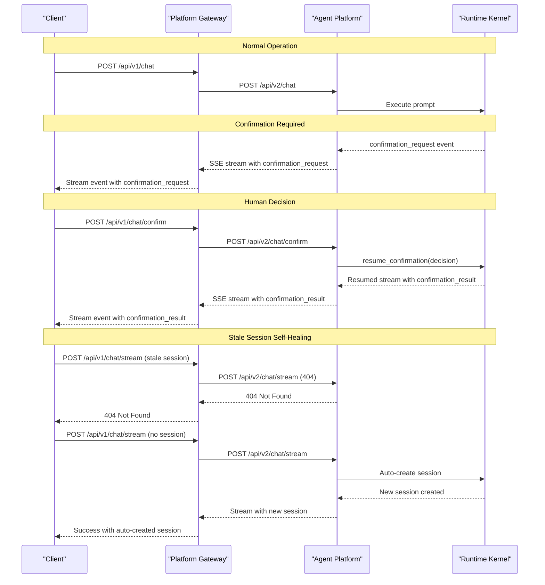

# Chat Endpoints

<cite>
**Referenced Files in This Document**
- [routes.py](file://products/platform-gateway/src/platform_gateway/api/routes/chat.py)
- [agent_client.py](file://products/platform-gateway/src/platform_gateway/services/agent_client.py)
- [gateway_service.py](file://products/platform-gateway/src/platform_gateway/services/gateway_service.py)
- [policy_engine.py](file://products/platform-gateway/src/platform_gateway/services/policy_engine.py)
- [v2 routes.py](file://products/agent-platform/src/agent_service/api/v2/routes.py)
- [v2 schemas.py](file://products/agent-platform/src/agent_service/schemas/v2.py)
- [api.py](file://products/platform-gateway/src/platform_gateway/schemas/api.py)
- [chat-confirm.schema.json](file://shared/shared-contracts/schemas/chat-confirm.schema.json)
- [stream-event.schema.json](file://shared/shared-contracts/schemas/stream-event.schema.json)
- [chat-request.schema.json](file://shared/shared-contracts/schemas/chat-request.schema.json)
- [policy-default.yaml](file://products/platform-gateway/src/platform_gateway/policies/policy-default.yaml)
- [ChatView.tsx](file://products/operator-portal/web-ui/app/src/chat/ChatView.tsx)
- [useChatStream.ts](file://products/operator-portal/web-ui/app/src/stream/useChatStream.ts)
- [kernel_middleware.py](file://products/agent-platform/src/agent_service/services/kernel_middleware.py)
</cite>

## Update Summary
**Changes Made**
- Enhanced chat streaming with self-healing logic that retries once without session ID on 404 errors to handle stale session references
- Added missing session reference tracking via `missingRef` set to prevent stream pointer priming for deleted or expired sessions
- Improved markdown table rendering with single-pass block parser fixing header/body disconnect issues
- Updated streaming response documentation to reflect eager-open error propagation and improved error handling patterns
- Enhanced troubleshooting guide with guidance on handling stale session scenarios and self-healing behavior

## Table of Contents
1. [Introduction](#introduction)
2. [Project Structure](#project-structure)
3. [Core Components](#core-components)
4. [Architecture Overview](#architecture-overview)
5. [Detailed Component Analysis](#detailed-component-analysis)
6. [Dependency Analysis](#dependency-analysis)
7. [Performance Considerations](#performance-considerations)
8. [Troubleshooting Guide](#troubleshooting-guide)
9. [Conclusion](#conclusion)
10. [Appendices](#appendices)

## Introduction
This document provides detailed API documentation for chat-related endpoints exposed by the Agent Platform's API Gateway. It covers HTTP methods, request/response schemas, authentication using JWT tokens, rate limiting and policy enforcement, streaming responses with Human-in-the-Loop (HITL) confirmation support, error handling patterns, and practical usage examples across multiple programming languages. The goal is to enable clients to send messages, manage conversations, handle both synchronous and streaming responses, and participate in human approval workflows for sensitive operations.

## Project Structure
The chat endpoints are implemented across two main services: the Platform Gateway (external-facing API) and the Agent Platform (internal agent runtime). The Platform Gateway handles authentication, authorization, and request routing, while the Agent Platform manages session state, agent execution, and confirmation workflows. Shared JSON schemas define the contract between clients and the platform.



**Diagram sources**
- [routes.py:36-175](file://products/platform-gateway/src/platform_gateway/api/routes/chat.py#L36-L175)
- [gateway_service.py:306-409](file://products/platform-gateway/src/platform_gateway/services/gateway_service.py#L306-L409)
- [agent_client.py:61-159](file://products/platform-gateway/src/platform_gateway/services/agent_client.py#L61-L159)
- [v2 routes.py:100-228](file://products/agent-platform/src/agent_service/api/v2/routes.py#L100-L228)

**Section sources**
- [routes.py:36-175](file://products/platform-gateway/src/platform_gateway/api/routes/chat.py#L36-L175)
- [v2 routes.py:100-228](file://products/agent-platform/src/agent_service/api/v2/routes.py#L100-L228)

## Core Components
- **Chat Routes**: Define HTTP endpoints for chat interactions including message sending, conversation management, and confirmation decisions
- **Gateway Service**: Orchestrates request processing, session management, and response formatting with confirmation event handling
- **Agent Client**: Communicates with the underlying Agent Platform to execute prompts and retrieve results, including confirmation streams
- **Policy Engine**: Enforces access control with specific actions for chat operations and confirmation decisions
- **Confirmation Registry**: Manages parked confirmations and their lifecycle within sessions
- **Schemas**: JSON Schema definitions for requests, responses, and stream events including confirmation frames

Key responsibilities:
- Validate incoming requests against shared schemas
- Authenticate and authorize requests using JWT and policy rules with specific actions
- Manage conversation state through sessions with confirmation support
- Stream partial responses including confirmation events when supported
- Emit metrics and observability data for all operations
- Handle human-in-the-loop confirmation workflows

**Section sources**
- [routes.py:36-175](file://products/platform-gateway/src/platform_gateway/api/routes/chat.py#L36-L175)
- [gateway_service.py:306-409](file://products/platform-gateway/src/platform_gateway/services/gateway_service.py#L306-L409)
- [agent_client.py:61-159](file://products/platform-gateway/src/platform_gateway/services/agent_client.py#L61-L159)
- [policy_engine.py:28-56](file://products/platform-gateway/src/platform_gateway/services/policy_engine.py#L28-L56)

## Architecture Overview
The chat flow involves client requests routed through the Platform Gateway, authenticated and authorized, then forwarded to the Agent Platform. Responses may be returned synchronously or streamed incrementally, including confirmation events for human approval workflows. Sessions persist conversation context and manage confirmation states.



**Diagram sources**
- [routes.py:36-175](file://products/platform-gateway/src/platform_gateway/api/routes/chat.py#L36-L175)
- [gateway_service.py:336-396](file://products/platform-gateway/src/platform_gateway/services/gateway_service.py#L336-L396)
- [agent_client.py:108-159](file://products/platform-gateway/src/platform_gateway/services/agent_client.py#L108-L159)
- [v2 routes.py:156-228](file://products/agent-platform/src/agent_service/api/v2/routes.py#L156-L228)

## Detailed Component Analysis

### Chat Endpoints

#### Standard Chat Operations

**POST /api/v1/chat**
- Purpose: Send a message to the agent within a conversation context
- Authentication: Requires a valid JWT token in the Authorization header
- Policy Action: `chat` (granted to operator, developer, approver, platform-admin, and read-only-observer roles)
- Request Body: Follows the chat request schema with message and optional session_id
- Response: Returns a chat response object or streams incremental events if enabled
- Errors: Standardized error codes for validation failures, authentication errors, policy denials, and runtime errors

**GET /api/v1/chat/stream** *(Updated)*
- Purpose: Stream real-time responses from the agent
- Authentication: Requires a valid JWT token
- Policy Action: `chat`
- Query Parameters: 
  - `message` (required): The user message to process
  - `session_id` (optional): Session identifier for continuing existing conversations
  - `input_modality` (optional, default "text"): Voice-readiness metadata indicating input type ("text" or "voice")
- Response: Server-Sent Events (SSE) stream with incremental updates
- Events: message_start, message_delta, message_end, tool_call, tool_result, confirmation_request, confirmation_result, error

**GET /api/v1/sessions/{session_id}**
- Purpose: Retrieve session metadata and status
- Authentication: Requires a valid JWT token
- Policy Action: `session:read`
- Response: Session details including user_id, created_at, and status

#### Human-in-the-Loop Confirmation Operations

**POST /api/v1/chat/confirm** *(New)*
- Purpose: Answer a parked kernel confirmation to approve or deny pending tool calls
- Authentication: Requires a valid JWT token
- Policy Action: `chat:confirm` (granted to operator, developer, approver, platform-admin roles; denied by default for read-only-observer)
- Request Body: 
  - `session_id`: String identifying the session holding the parked confirmation
  - `confirm_id`: String identifier from the confirmation_request frame being answered
  - `decision`: Enum value "approve" or "deny" applied to every parked tool call (all-or-nothing)
- Response: Server-Sent Events (SSE) stream that resumes the paused conversation with confirmation_result events
- Error Handling:
  - 403 Forbidden: Insufficient permissions for chat:confirm action
  - 404 Not Found: Confirmation not found or expired
  - 409 Conflict: Confirmation pending resolution
  - 410 Gone: Confirmation has expired
  - 502 Bad Gateway: Upstream service unavailable

**POST /api/v2/chat/confirm** *(Agent Platform Internal)*
- Purpose: Internal endpoint for answering parked kernel confirmations
- Authentication: Requires X-User-ID header and delegated bearer token
- Request Body: Same schema as /api/v1/chat/confirm but without policy enforcement
- Response: SSE stream with resumed conversation events including confirmation_result
- Error Handling:
  - 404 Not Found: Confirmation not found
  - 409 Conflict: Confirmation pending resolution
  - 410 Gone: Confirmation expired
  - 401 Unauthorized: Missing or invalid user identity

Request and response schemas are defined in shared contracts:
- **Chat Request**: Fields include user message, optional conversation_id, model parameters, and metadata
- **Chat Confirm Request**: Required fields: session_id, confirm_id, decision (approve/deny)
- **Chat Response**: Includes generated content, usage statistics, and optional streaming markers
- **Stream Event**: Represents incremental updates during long-running operations, including confirmation events

Validation rules:
- Required fields must be present and non-empty
- Data types must match schema constraints
- Conversation IDs must follow UUID format where applicable
- Model parameters must fall within allowed ranges
- Decision values must be exactly "approve" or "deny"
- Input modality must be either "text" or "voice" (default "text")

Examples:
- Sending a message returns either a complete response or a stream of events
- Retrieving a conversation returns a structured list of messages with timestamps
- Confirming a parked decision resumes the stream with confirmation_result events

**Section sources**
- [routes.py:36-175](file://products/platform-gateway/src/platform_gateway/api/routes/chat.py#L36-L175)
- [v2 routes.py:100-228](file://products/agent-platform/src/agent_service/api/v2/routes.py#L100-L228)
- [chat-confirm.schema.json:1-27](file://shared/shared-contracts/schemas/chat-confirm.schema.json#L1-L27)
- [api.py:20-28](file://products/platform-gateway/src/platform_gateway/schemas/api.py#L20-L28)

### Authentication and Authorization

#### JWT Token Validation
- **JWT Tokens**: Issued by the Identity Broker and validated by the Token Verifier
- **Header**: Authorization: Bearer <token>
- **Validation**: Signature verification, expiration checks, and claim extraction
- **Authorization**: Policy Engine evaluates permissions based on claims and resource access rules

#### Policy Actions
- **chat**: Standard chat operations (message sending, streaming)
- **chat:confirm**: Human-in-the-loop confirmation decisions (mutating operation)
- **session:create**: Create new sessions
- **session:read**: Read session information
- **audit:read**: Access audit trail
- **incident:read/create/triage**: Incident management operations
- **policy:read**: View policy matrix
- **tools:list/invoke**: Tool discovery and invocation
- **skills:read**: Skills inventory access

#### Role-Based Access Control
- **platform-admin**: Full access to all actions
- **approver**: Can perform confirmations and operational tasks
- **operator**: Operational access including confirmations
- **developer**: Development access including confirmations
- **read-only-observer**: Read-only access to chat, sessions, tools, and skills (denied chat:confirm by default)
- **auditor**: Audit trail access only

Error patterns:
- 401 Unauthorized: Invalid or missing token
- 403 Forbidden: Insufficient permissions for the required action
- 429 Too Many Requests: Rate limit exceeded

**Section sources**
- [policy_engine.py:28-56](file://products/platform-gateway/src/platform_gateway/services/policy_engine.py#L28-L56)
- [policy-default.yaml:20-54](file://products/platform-gateway/src/platform_gateway/policies/policy-default.yaml#L20-L54)
- [routes.py:44-49](file://products/platform-gateway/src/platform_gateway/api/routes/chat.py#L44-L49)

### Streaming Responses and Confirmation Events

#### Standard Streaming
- Support for Server-Sent Events (SSE) with chunked transfer encoding
- Stream events conform to the stream event schema
- Clients should handle partial updates and final completion signals

#### Voice-Readiness Parity *(Updated)*
- **input_modality Parameter**: Both POST `/api/v1/chat` and GET `/api/v1/chat/stream` now support the `input_modality` parameter
- **Parameter Values**: "text" (default) or "voice"
- **Purpose**: Metadata-only field that enables voice-readiness parity between endpoints without affecting policy or HITL outcomes
- **Behavior**: The modality is recorded in audit logs and passed through to upstream services as metadata only
- **Validation**: FastAPI validates the literal type at the route level, rejecting invalid values with 422 status

#### Confirmation Event Streaming
- **confirmation_request**: Indicates a parked tool call requiring human approval
- **confirmation_result**: Indicates the result of a confirmation decision
- **Event Flow**: When an agent encounters a tool call requiring confirmation, it parks the call and sends a confirmation_request event. The client can then call POST /api/v1/chat/confirm to approve or deny, which resumes the stream with confirmation_result events.

#### Self-Healing Stream Logic *(Updated)*
- **Eager Stream Opening**: The gateway now opens upstream streams eagerly before committing HTTP responses, preventing empty SSE streams on 404 errors
- **Stale Session Handling**: When receiving 404 errors for deleted or expired sessions, the system automatically retries once without the session ID to trigger server-side auto-creation
- **Missing Reference Tracking**: The portal tracks sessions reported as unknown (404) in a `missingRef` set to prevent stream pointer priming for deleted sessions
- **Improved Error Propagation**: Transport failures and upstream 5xx errors are mapped to 502 status codes, while 4xx errors pass through unchanged

Best practices:
- Implement retry logic for transient network issues
- Buffer and render incremental content appropriately
- Close connections gracefully upon completion or error
- Handle confirmation events specially to provide UI feedback
- Manage confirmation timeouts and expired confirmations
- Treat input_modality as metadata only - it never changes policy or HITL outcomes
- Handle stale session scenarios with automatic retry logic

**Section sources**
- [v2 routes.py:198-227](file://products/agent-platform/src/agent_service/api/v2/routes.py#L198-L227)
- [agent_client.py:108-159](file://products/platform-gateway/src/platform_gateway/services/agent_client.py#L108-L159)
- [gateway_service.py:381-409](file://products/platform-gateway/src/platform_gateway/services/gateway_service.py#L381-L409)
- [routes.py:90-143](file://products/platform-gateway/src/platform_gateway/api/routes/chat.py#L90-L143)
- [useChatStream.ts:230-266](file://products/operator-portal/web-ui/app/src/stream/useChatStream.ts#L230-L266)
- [ChatView.tsx:510-596](file://products/operator-portal/web-ui/app/src/chat/ChatView.tsx#L510-L596)

### Error Handling Patterns

Standardized error responses include:
- **Error code**: Machine-readable identifier
- **Message**: Human-readable description
- **Details**: Additional context for debugging

Common scenarios:
- **Validation errors**: Malformed request body or invalid parameters
- **Authentication errors**: Expired or invalid JWT
- **Policy violations**: Access denied or rate limited
- **Runtime errors**: Agent unavailability or internal failures
- **Confirmation errors**: 
  - 409 Conflict: Confirmation pending resolution
  - 410 Gone: Confirmation expired
  - 404 Not Found: Confirmation not found

Confirmation-specific error handling:
- **Expired confirmations**: Return 410 Gone with appropriate error message
- **Concurrent confirmations**: Handle race conditions with proper locking
- **Owner mismatches**: Ensure only session owners can confirm their parked calls
- **Upstream failures**: Map transport errors to 502 Bad Gateway

Voice-readiness validation errors:
- **422 Unprocessable Entity**: Invalid input_modality value (must be "text" or "voice")
- **Validation occurs at route level**: FastAPI rejects invalid literal types before route logic executes

#### Stale Session Error Handling *(Updated)*
- **404 Not Found**: For deleted or expired sessions, the system now triggers automatic retry without session ID
- **Self-Healing Behavior**: On 404 errors, the portal drops the session pointer and retries once with server-side auto-creation
- **Missing Reference Tracking**: Sessions reported as unknown are tracked to prevent future stream pointer priming
- **Improved User Experience**: Eliminates "(no response received)" errors for stale session scenarios

**Section sources**
- [v2 routes.py:176-227](file://products/agent-platform/src/agent_service/api/v2/routes.py#L176-L227)
- [gateway_service.py:381-409](file://products/platform-gateway/src/platform_gateway/services/gateway_service.py#L381-L409)
- [useChatStream.ts:245-266](file://products/operator-portal/web-ui/app/src/stream/useChatStream.ts#L245-L266)

## Dependency Analysis
The chat endpoints depend on several internal services and shared schemas:



**Diagram sources**
- [routes.py:36-175](file://products/platform-gateway/src/platform_gateway/api/routes/chat.py#L36-L175)
- [policy_engine.py:28-56](file://products/platform-gateway/src/platform_gateway/services/policy_engine.py#L28-L56)
- [gateway_service.py:306-409](file://products/platform-gateway/src/platform_gateway/services/gateway_service.py#L306-L409)
- [agent_client.py:61-159](file://products/platform-gateway/src/platform_gateway/services/agent_client.py#L61-L159)
- [api.py:9-28](file://products/platform-gateway/src/platform_gateway/schemas/api.py#L9-L28)

**Section sources**
- [routes.py:36-175](file://products/platform-gateway/src/platform_gateway/api/routes/chat.py#L36-L175)
- [api.py:9-28](file://products/platform-gateway/src/platform_gateway/schemas/api.py#L9-L28)

## Performance Considerations
- **Connection pooling**: Reuse HTTP connections to reduce latency
- **Streaming**: Prefer streaming for large responses to improve perceived performance
- **Caching**: Cache frequent queries and reusable resources where appropriate
- **Rate limiting**: Configure limits to prevent abuse and ensure fairness
- **Observability**: Monitor latency, throughput, and error rates using metrics and logs
- **Confirmation handling**: Optimize confirmation registry lookups and avoid blocking operations
- **Memory management**: Properly close streaming connections and release resources
- **Input modality processing**: Treat modality as lightweight metadata to minimize overhead
- **Self-healing optimization**: Minimize retry attempts and optimize stale session detection

## Troubleshooting Guide

Common issues and resolutions:
- **Authentication failures**: Ensure JWT is valid and not expired
- **Policy denials**: Review access controls and quotas assigned to the identity
- **Rate limiting**: Reduce request frequency or upgrade plan if necessary
- **Streaming interruptions**: Implement retries and handle partial data correctly
- **Internal errors**: Check logs and metrics for root cause analysis
- **Confirmation issues**:
  - 409 Conflict: Wait for pending confirmation to resolve before retrying
  - 410 Gone: Refresh confirmation state and obtain new confirm_id
  - 404 Not Found: Verify session_id and confirm_id are correct
  - Permission denied: Ensure user has chat:confirm action permission

#### Stale Session Issues *(Updated)*
- **404 Not Found on Stream**: Indicates stale session reference; system automatically retries without session ID
- **"(No Response Received)" Errors**: Now resolved through self-healing logic that drops stale pointers and retries
- **Missing Session References**: Track sessions reported as unknown to prevent future stream pointer priming
- **Auto-Creation Behavior**: First message to deleted/expired sessions triggers server-side session creation

#### Markdown Rendering Issues *(Updated)*
- **Table Header/Body Disconnect**: Fixed with single-pass block parser that properly renders tables with `<thead>` and `<tbody>`
- **Rendering Problems**: Ensure markdown tables have proper separator lines between headers and body content

Voice-readiness troubleshooting:
- **422 Validation errors**: Ensure input_modality is either "text" or "voice"
- **Modality not affecting behavior**: Remember that input_modality is metadata only and doesn't change policy or HITL outcomes
- **Audit logging**: Check logs for "chat_stream_started" events to verify modality is being recorded

Debugging tips:
- Enable verbose logging for failed requests
- Use health check endpoints to verify service availability
- Validate request payloads against shared schemas before sending
- Monitor confirmation registry state for stuck confirmations
- Check upstream agent platform connectivity
- Verify input_modality values in audit logs for voice-readiness tracking
- Monitor `missingRef` set for stale session tracking
- Check for proper self-healing retry behavior on 404 errors

**Section sources**
- [v2 routes.py:176-227](file://products/agent-platform/src/agent_service/api/v2/routes.py#L176-L227)
- [policy_engine.py:158-189](file://products/platform-gateway/src/platform_gateway/services/policy_engine.py#L158-L189)
- [ChatView.tsx:510-596](file://products/operator-portal/web-ui/app/src/chat/ChatView.tsx#L510-L596)
- [useChatStream.ts:245-266](file://products/operator-portal/web-ui/app/src/stream/useChatStream.ts#L245-L266)

## Conclusion
The chat endpoints provide a robust interface for interacting with AI agents through secure, scalable, and observable APIs with comprehensive Human-in-the-Loop support. By adhering to the documented schemas, authentication requirements, and best practices, clients can build reliable integrations that leverage both synchronous and streaming capabilities, including sophisticated confirmation workflows for sensitive operations. The addition of voice-readiness parity through the input_modality parameter ensures consistent behavior across different input types while maintaining clear separation between metadata and decision-making logic. Recent enhancements include self-healing stream logic that automatically handles stale session references, improved error propagation, and better markdown table rendering. These improvements ensure resilience and maintainability in production environments while providing a seamless user experience even in edge cases like deleted or expired sessions.

## Appendices

### Practical Code Examples

#### Python Example - Basic Chat
```python
import httpx

# Send a message
response = httpx.post(
    "/api/v1/chat",
    json={"message": "Hello, agent!"},
    headers={"Authorization": "Bearer <token>"}
)
print(response.json())
```

#### Python Example - Streaming Chat with Voice Modality
```python
import httpx

# Stream responses with voice modality
with httpx.stream("GET", "/api/v1/chat/stream", 
                 params={
                     "message": "Tell me a story",
                     "input_modality": "voice"  # Voice-readiness metadata
                 },
                 headers={"Authorization": "Bearer <token>"}) as response:
    for line in response.iter_lines():
        if line.startswith("data: "):
            event = json.loads(line[6:])
            print(f"Event: {event['type']}")
```

#### Python Example - Confirmation Workflow
```python
import httpx

# Handle confirmation request
def handle_confirmation(event):
    if event['type'] == 'confirmation_request':
        # Show approval card to user
        confirm_id = event['confirm_id']
        session_id = event['session_id']
        
        # User approves
        response = httpx.post(
            "/api/v1/chat/confirm",
            json={
                "session_id": session_id,
                "confirm_id": confirm_id,
                "decision": "approve"
            },
            headers={"Authorization": "Bearer <token>"}
        )
        
        # Continue streaming from confirmation response
        return response
```

#### JavaScript Example - Web Integration
```javascript
// Send confirmation via fetch
async function sendConfirmation(sessionId, confirmId, decision) {
    const response = await fetch('/api/v1/chat/confirm', {
        method: 'POST',
        headers: {
            'Content-Type': 'application/json',
            'Authorization': `Bearer ${token}`
        },
        body: JSON.stringify({
            session_id: sessionId,
            confirm_id: confirmId,
            decision: decision
        })
    });
    
    if (response.status === 410) {
        throw new Error('Confirmation expired');
    }
    
    return response;
}

// Stream with voice modality
async function streamWithVoice(message) {
    const response = await fetch(`/api/v1/chat/stream?message=${encodeURIComponent(message)}&input_modality=voice`, {
        headers: { 'Authorization': `Bearer ${token}` }
    });
    
    // Handle SSE stream...
}

// Handle stale session self-healing
async function streamWithSelfHealing(message, sessionId) {
    try {
        return await streamWithVoice(message);
    } catch (error) {
        if (error.status === 404 && sessionId) {
            // Retry without session ID for auto-creation
            return await streamWithVoice(message);
        }
        throw error;
    }
}
```

#### Go Example - Concurrent Streaming
```go
// Create HTTP client with proper headers
client := &http.Client{
    Timeout: 30 * time.Second,
}

// Implement goroutines for concurrent streaming
func streamConfirmation(sessionID, confirmID, decision string) {
    req, _ := http.NewRequest("POST", "/api/v1/chat/confirm", 
        bytes.NewBufferString(fmt.Sprintf(`{"session_id":"%s","confirm_id":"%s","decision":"%s"}`, 
        sessionID, confirmID, decision)))
    req.Header.Set("Authorization", "Bearer "+token)
    
    resp, err := client.Do(req)
    if err != nil {
        log.Fatal(err)
    }
    defer resp.Body.Close()
    
    // Handle SSE stream
    scanner := bufio.NewScanner(resp.Body)
    for scanner.Scan() {
        line := scanner.Text()
        if strings.HasPrefix(line, "data: ") {
            // Parse and handle event
        }
    }
}

// Stream with voice modality
func streamWithVoice(message string) {
    url := fmt.Sprintf("/api/v1/chat/stream?message=%s&input_modality=voice", 
        url.QueryEscape(message))
    req, _ := http.NewRequest("GET", url, nil)
    req.Header.Set("Authorization", "Bearer "+token)
    
    resp, err := client.Do(req)
    // Handle response...
}

// Handle stale session self-healing
func streamWithSelfHealing(message, sessionId string) (*http.Response, error) {
    resp, err := streamWithVoice(message)
    if err != nil {
        return nil, err
    }
    
    if resp.StatusCode == 404 && sessionId != "" {
        // Retry without session ID
        return streamWithVoice(message)
    }
    
    return resp, nil
}
```

### Confirmation Workflow Diagram



**Diagram sources**
- [routes.py:134-175](file://products/platform-gateway/src/platform_gateway/api/routes/chat.py#L134-L175)
- [v2 routes.py:156-228](file://products/agent-platform/src/agent_service/api/v2/routes.py#L156-L228)
- [agent_client.py:108-159](file://products/platform-gateway/src/platform_gateway/services/agent_client.py#L108-L159)
- [useChatStream.ts:245-266](file://products/operator-portal/web-ui/app/src/stream/useChatStream.ts#L245-L266)