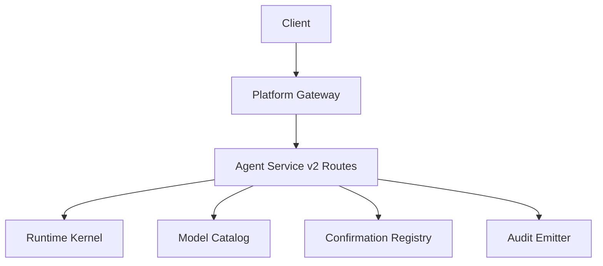
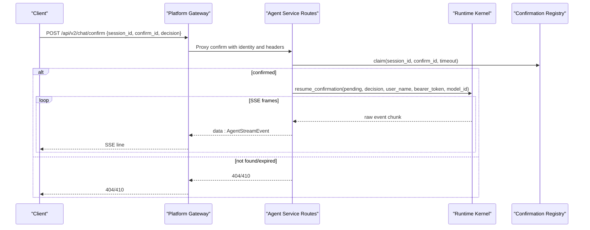
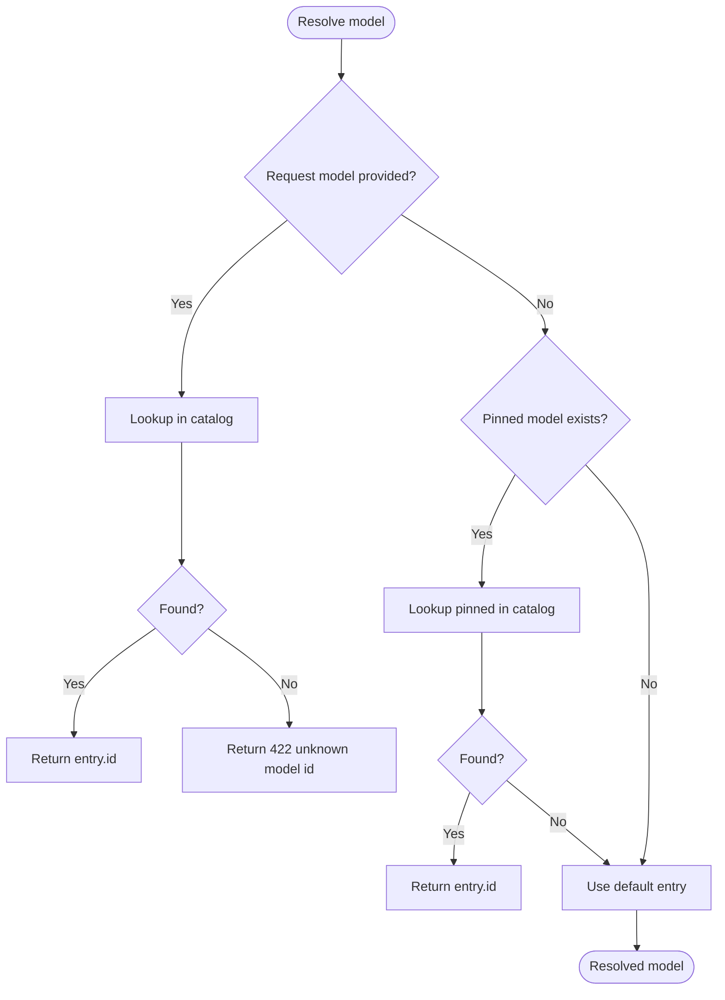
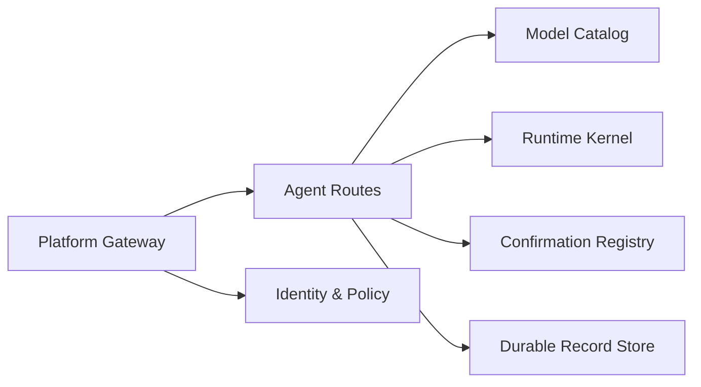

# Chat Operations

<cite>
**Referenced Files in This Document**
- [routes.py](file://products/agent-platform/src/agent_service/api/v2/routes.py)
- [v2.py](file://products/agent-platform/src/agent_service/schemas/v2.py)
- [model_catalog.py](file://products/agent-platform/src/agent_service/services/model_catalog.py)
- [hitl_confirmations.py](file://products/agent-platform/src/agent_service/services/hitl_confirmations.py)
- [gateway_service.py](file://products/platform-gateway/src/platform_gateway/services/gateway_service.py)
- [agent_client.py](file://products/platform-gateway/src/platform_gateway/services/agent_client.py)
- [agent-chat-request.schema.json](file://shared/shared-contracts/schemas/agent-chat-request.schema.json)
- [agent-chat-response.schema.json](file://shared/shared-contracts/schemas/agent-chat-response.schema.json)
- [agent-stream-event.schema.json](file://shared/shared-contracts/schemas/agent-stream-event.schema.json)
- [chat-confirm.schema.json](file://shared/shared-contracts/schemas/chat-confirm.schema.json)
- [test_chat_stream_modality.py](file://products/agent-platform/tests/test_chat_stream_modality.py)
- [test_model_switching.py](file://products/agent-platform/tests/test_model_switching.py)
- [test_hitl_confirmations.py](file://products/agent-platform/tests/test_hitl_confirmations.py)
- [test_chat_confirm.py](file://products/platform-gateway/tests/test_chat_confirm.py)
</cite>

## Table of Contents
1. Introduction
2. Project Structure
3. Core Components
4. Architecture Overview
5. Detailed Component Analysis
6. Dependency Analysis
7. Performance Considerations
8. Troubleshooting Guide
9. Conclusion

## Introduction
This document describes the chat operation endpoints exposed by the Agent Platform for synchronous and streaming agent interactions, human-in-the-loop confirmation workflows, and model switching across LLM providers. It covers:
- POST /api/v2/chat: synchronous message processing with optional structured output and read-only mode.
- GET /api/v2/chat/stream: real-time Server-Sent Events (SSE) stream with typed events.
- POST /api/v2/chat/confirm: submit a decision to resume a parked confirmation and continue the stream.
- GET /api/v2/chat/pending-confirmation: query metadata about a parked confirmation for approval routing.

It also documents request/response schemas, event types, model resolution logic, bearer token forwarding, policy enforcement integration points, audit logging considerations, and error scenarios such as expired confirmations and concurrent access.

## Project Structure
The chat endpoints are implemented in the Agent Platform’s FastAPI router and validated against shared JSON Schemas. The platform gateway proxies and enforces policies before calling into the agent service. Streaming is handled via SSE frames normalized to a contract schema.

**Diagram sources**
- [routes.py:276-365](file://products/agent-platform/src/agent_service/api/v2/routes.py#L276-L365)
- [gateway_service.py:1004-1044](file://products/platform-gateway/src/platform_gateway/services/gateway_service.py#L1004-L1044)
- [model_catalog.py:236-293](file://products/agent-platform/src/agent_service/services/model_catalog.py#L236-L293)
- [hitl_confirmations.py:452-595](file://products/agent-platform/src/agent_service/services/hitl_confirmations.py#L452-L595)

**Section sources**
- [routes.py:1-139](file://products/agent-platform/src/agent_service/api/v2/routes.py#L1-L139)
- [gateway_service.py:1004-1044](file://products/platform-gateway/src/platform_gateway/services/gateway_service.py#L1004-L1044)

## Core Components
- POST /api/v2/chat
  - Accepts an AgentChatRequest, resolves a session, rejects new turns if a confirmation is parked, resolves the model (request > pinned > default), pins the session model, records metrics, marks the turn, calls the kernel with optional response_schema and read_only, and returns AgentChatResponse including structured_output when provided.
- GET /api/v2/chat/stream
  - Accepts a message and optional session_id, resolves and pins the model, rejects parked sessions, then streams AgentStreamEvent frames from the kernel through FastAPI StreamingResponse.
- POST /api/v2/chat/confirm
  - Claims a pending confirmation atomically, persists claim-time outcome best-effort, resumes the parked turn via the kernel, and streams resumed events back to the client.
- GET /api/v2/chat/pending-confirmation
  - Returns parked confirmation metadata (session_id, confirm_id, owner_user_id, action, pending_calls) for the approval bridge; falls back to durable records when the in-memory registry does not hold the park.

Key behaviors enforced at the route layer:
- Model resolution order: request > pinned > default; unknown ids fail closed with 422.
- Bearer token forwarding: Authorization header is extracted and passed opaquely to the kernel for tool calls.
- Read-only mode: read_only flag restricts toolkit selection to read-level tools for diagnostic turns.
- Confirmation parking: new turns on a parked session are rejected until resolved or expired.

**Section sources**
- [routes.py:276-317](file://products/agent-platform/src/agent_service/api/v2/routes.py#L276-L317)
- [routes.py:320-365](file://products/agent-platform/src/agent_service/api/v2/routes.py#L320-L365)
- [routes.py:368-464](file://products/agent-platform/src/agent_service/api/v2/routes.py#L368-L464)
- [routes.py:467-513](file://products/agent-platform/src/agent_service/api/v2/routes.py#L467-L513)
- [routes.py:246-270](file://products/agent-platform/src/agent_service/api/v2/routes.py#L246-L270)
- [routes.py:150-157](file://products/agent-platform/src/agent_service/api/v2/routes.py#L150-L157)
- [v2.py:37-73](file://products/agent-platform/src/agent_service/schemas/v2.py#L37-L73)

## Architecture Overview
The platform gateway authenticates requests, enforces approval tiers for confirm actions, and proxies SSE streams between clients and the agent service. The agent service normalizes kernel events to the contract schema and manages HITL state via an in-memory registry plus durable record store fallback.

**Diagram sources**
- [gateway_service.py:1004-1044](file://products/platform-gateway/src/platform_gateway/services/gateway_service.py#L1004-L1044)
- [routes.py:368-464](file://products/agent-platform/src/agent_service/api/v2/routes.py#L368-L464)
- [agent_client.py:225-234](file://products/platform-gateway/src/platform_gateway/services/agent_client.py#L225-L234)

**Section sources**
- [gateway_service.py:961-1044](file://products/platform-gateway/src/platform_gateway/services/gateway_service.py#L961-L1044)
- [agent_client.py:201-234](file://products/platform-gateway/src/platform_gateway/services/agent_client.py#L201-L234)

## Detailed Component Analysis

### POST /api/v2/chat (Synchronous)
- Request: AgentChatRequest (message required; optional session_id, input_modality, response_schema, model).
- Processing:
  - Validates identity via X-User-ID header.
  - Ensures session exists and rejects if parked.
  - Resolves model id using request > pinned > default ladder; unknown ids return 422.
  - Pins session model for subsequent turns.
  - Calls kernel.reply_text with bearer_token, response_schema, model_id, and read_only.
- Response: AgentChatResponse includes content, status, structured_output (when present), and resolved model.

Error behavior:
- Missing identity: 401.
- Unknown model id: 422.
- Parked session: 409 until answered or expired.

Streaming parity note:
- input_modality is metadata only and does not affect policy or HITL outcomes.

**Section sources**
- [routes.py:276-317](file://products/agent-platform/src/agent_service/api/v2/routes.py#L276-L317)
- [routes.py:246-270](file://products/agent-platform/src/agent_service/api/v2/routes.py#L246-L270)
- [v2.py:37-94](file://products/agent-platform/src/agent_service/schemas/v2.py#L37-L94)
- [agent-chat-request.schema.json:1-35](file://shared/shared-contracts/schemas/agent-chat-request.schema.json#L1-L35)
- [agent-chat-response.schema.json:1-35](file://shared/shared-contracts/schemas/agent-chat-response.schema.json#L1-L35)
- [test_chat_stream_modality.py](file://products/agent-platform/tests/test_chat_stream_modality.py)

### GET /api/v2/chat/stream (SSE)
- Query parameters: message (required), session_id (optional), model (optional), input_modality (text|voice).
- Processing:
  - Validates identity, ensures session, rejects parked sessions.
  - Resolves and pins model per request.
  - Streams AgentStreamEvent frames from kernel.stream_events.
- Event normalization:
  - Only known event types pass through; unknown types degrade to message_delta.
  - Evidence payloads (tool_call/tool_result) are preserved; other fields coerced to schema.

Event types supported:
- message_start, message_delta, message_end, error, tool_call, tool_result, confirmation_request, confirmation_result.

Model attribution:
- message_end frames may include the resolved model id for downstream attribution.

**Section sources**
- [routes.py:320-365](file://products/agent-platform/src/agent_service/api/v2/routes.py#L320-L365)
- [routes.py:559-653](file://products/agent-platform/src/agent_service/api/v2/routes.py#L559-L653)
- [agent-stream-event.schema.json:1-160](file://shared/shared-contracts/schemas/agent-stream-event.schema.json#L1-L160)
- [v2.py:112-187](file://products/agent-platform/src/agent_service/schemas/v2.py#L112-L187)

### POST /api/v2/chat/confirm (Human-in-the-Loop)
- Request: AgentChatConfirmRequest (session_id, confirm_id, decision approve|deny).
- Processing:
  - Claims the pending confirmation atomically; duplicate claims fail closed.
  - Persists claim-time outcome best-effort to durable store.
  - Resumes the parked turn via kernel.resume_confirmation with bearer_token and model_id derived from session pin.
  - Streams resumed events back to the client.
- Error handling:
  - Expired confirmation: 410 after attempting to expire the parked reply.
  - Already resolved: 409 with structured reason including status, decider, decision, decided_at.
  - Not found: 404.

Approval tier enforcement:
- The platform gateway evaluates the parked batch’s policy action against the bundle before proxying the decision; blocked attempts receive a structured 403 and are audited.

**Section sources**
- [routes.py:368-464](file://products/agent-platform/src/agent_service/api/v2/routes.py#L368-L464)
- [hitl_confirmations.py:452-595](file://products/agent-platform/src/agent_service/services/hitl_confirmations.py#L452-L595)
- [chat-confirm.schema.json:1-27](file://shared/shared-contracts/schemas/chat-confirm.schema.json#L1-L27)
- [gateway_service.py:1004-1044](file://products/platform-gateway/src/platform_gateway/services/gateway_service.py#L1004-L1044)
- [test_chat_confirm.py:121-143](file://products/platform-gateway/tests/test_chat_confirm.py#L121-L143)

### GET /api/v2/chat/pending-confirmation
- Purpose: Provide parked confirmation metadata to the approval bridge so it can enforce approval tiers based on the parked batch’s action and owner.
- Behavior:
  - Requires identity header.
  - Looks up in-memory registry first; if absent, falls back to durable record store.
  - Returns session_id, confirm_id, owner_user_id, action, and pending_calls (redacted for action cards).
  - Returns 404 when no pending confirmation exists.

**Section sources**
- [routes.py:467-513](file://products/agent-platform/src/agent_service/api/v2/routes.py#L467-L513)
- [hitl_confirmations.py:452-595](file://products/agent-platform/src/agent_service/services/hitl_confirmations.py#L452-L595)
- [test_hitl_confirmations.py:1246-1279](file://products/agent-platform/tests/test_hitl_confirmations.py#L1246-L1279)

### Model Resolution Logic
- Order: request > pinned > default.
- Unknown ids fail closed with 422.
- Pinned entries degrade to default when evicted or invalid.
- Resolved ids are normalized to concrete catalog entries; bare provider names alias to provider defaults.

**Diagram sources**
- [routes.py:246-270](file://products/agent-platform/src/agent_service/api/v2/routes.py#L246-L270)
- [model_catalog.py:236-293](file://products/agent-platform/src/agent_service/services/model_catalog.py#L236-L293)

**Section sources**
- [routes.py:246-270](file://products/agent-platform/src/agent_service/api/v2/routes.py#L246-L270)
- [model_catalog.py:236-293](file://products/agent-platform/src/agent_service/services/model_catalog.py#L236-L293)
- [test_model_switching.py:43-74](file://products/agent-platform/tests/test_model_switching.py#L43-L74)

### Bearer Token Forwarding for Tool Calls
- The Authorization header is parsed as a raw Bearer token and forwarded opaquely to the kernel for tool calls.
- The platform never inspects or signs this token; identity-broker mediates delegation upstream.

**Section sources**
- [routes.py:150-157](file://products/agent-platform/src/agent_service/api/v2/routes.py#L150-L157)
- [routes.py:302-310](file://products/agent-platform/src/agent_service/api/v2/routes.py#L302-L310)
- [routes.py:353-363](file://products/agent-platform/src/agent_service/api/v2/routes.py#L353-L363)
- [routes.py:440-462](file://products/agent-platform/src/agent_service/api/v2/routes.py#L440-L462)

### Read-Only Mode Enforcement
- read_only restricts toolkit selection to read-level tools for automated diagnostic turns.
- It affects tool-surface selection only and does not change policy or HITL outcomes.

**Section sources**
- [v2.py:65-73](file://products/agent-platform/src/agent_service/schemas/v2.py#L65-L73)
- [routes.py:302-310](file://products/agent-platform/src/agent-service/api/v2/routes.py#L302-L310)

### Response Schema Validation
- Requests and responses conform to shared JSON Schemas under shared/shared-contracts/schemas.
- Pydantic models in v2.py define the runtime contract and are validated against these schemas.

**Section sources**
- [v2.py:1-5](file://products/agent-platform/src/agent_service/schemas/v2.py#L1-L5)
- [agent-chat-request.schema.json:1-35](file://shared/shared-contracts/schemas/agent-chat-request.schema.json#L1-L35)
- [agent-chat-response.schema.json:1-35](file://shared/shared-contracts/schemas/agent-chat-response.schema.json#L1-L35)
- [agent-stream-event.schema.json:1-160](file://shared/shared-contracts/schemas/agent-stream-event.schema.json#L1-L160)
- [chat-confirm.schema.json:1-27](file://shared/shared-contracts/schemas/chat-confirm.schema.json#L1-L27)

### Streaming Event Handling
- Normalization ensures only known event types are emitted; unknown types degrade to message_delta.
- Evidence payloads on tool_call/tool_result are preserved unchanged.
- message_end frames carry the resolved model id for attribution.

**Section sources**
- [routes.py:559-653](file://products/agent-platform/src/agent_service/api/v2/routes.py#L559-L653)
- [agent-stream-event.schema.json:1-160](file://shared/shared-contracts/schemas/agent-stream-event.schema.json#L1-L160)

### Confirmation Parking and Resumption
- New turns on a parked session are rejected (409) until resolved or expired.
- Expiry closes the parked reply via kernel.expire_confirmation to avoid wedging the agent.
- Confirm claims the entry atomically, persists outcome best-effort, and resumes the turn.

**Section sources**
- [routes.py:202-243](file://products/agent-platform/src/agent_service/api/v2/routes.py#L202-L243)
- [routes.py:368-464](file://products/agent-platform/src/agent_service/api/v2/routes.py#L368-L464)
- [hitl_confirmations.py:452-595](file://products/agent-platform/src/agent_service/services/hitl_confirmations.py#L452-L595)

### Integration with Policy Enforcement and Audit Logging
- Platform gateway enforces approval tiers for confirm actions before proxying decisions; blocked attempts produce structured 403 and are audited.
- Stream completion emits audit events when message_end is observed; empty or parked streams remain unattributed.

**Section sources**
- [gateway_service.py:1004-1044](file://products/platform-gateway/src/platform_gateway/services/gateway_service.py#L1004-L1044)
- [gateway_service.py:961-1044](file://products/platform-gateway/src/platform_gateway/services/gateway_service.py#L961-L1044)
- [test_chat_confirm.py:121-143](file://products/platform-gateway/tests/test_chat_confirm.py#L121-L143)

## Dependency Analysis
- Route dependencies:
  - Session management and model pinning via session services.
  - Model resolution via MODEL_CATALOG.
  - HITL state via CONFIRMATION_REGISTRY and durable record store fallback.
  - Kernel interaction for reply_text, stream_events, resume_confirmation, expire_confirmation.
- Gateway dependencies:
  - Identity resolution and policy enforcement prior to proxying confirm.
  - SSE proxying utilities for streaming lines.

**Diagram sources**
- [routes.py:276-365](file://products/agent-platform/src/agent_service/api/v2/routes.py#L276-L365)
- [model_catalog.py:236-293](file://products/agent-platform/src/agent_service/services/model_catalog.py#L236-L293)
- [hitl_confirmations.py:452-595](file://products/agent-platform/src/agent_service/services/hitl_confirmations.py#L452-L595)
- [gateway_service.py:1004-1044](file://products/platform-gateway/src/platform_gateway/services/gateway_service.py#L1004-L1044)

**Section sources**
- [routes.py:276-365](file://products/agent-platform/src/agent_service/api/v2/routes.py#L276-L365)
- [gateway_service.py:1004-1044](file://products/platform-gateway/src/platform_gateway/services/gateway_service.py#L1004-L1044)

## Performance Considerations
- SSE streaming avoids full-body buffering; events are yielded incrementally.
- Model catalog lookups are O(1) dictionary operations under a lock for thread safety.
- Confirmation registry operations are in-memory and single-flight to prevent double-resume races.
- Evidence payloads are size-capped upstream; full data is included only within stream caps.

[No sources needed since this section provides general guidance]

## Troubleshooting Guide
Common errors and their meanings:
- 401 missing identity: Ensure X-User-ID header is present.
- 409 confirmation pending: Answer or expire the parked confirmation before sending a new message; retry shortly if a concurrent confirm/expiry is in progress.
- 410 confirmation expired: The parked confirmation exceeded its TTL; the agent was interrupted and cannot be resumed.
- 404 confirmation not found: Unknown or already resolved confirmation id.
- 422 unknown model id: The requested model id is not available in the credential-gated catalog.
- 403 policy denied: Approval tier enforcement blocked the confirm action; check roles and policy bundle.

Operational checks:
- Verify model catalog configuration and that the selected model id exists.
- Confirm that the session is not parked when sending new messages.
- For streaming issues, inspect event types and ensure the client handles all expected frame types.

**Section sources**
- [routes.py:202-243](file://products/agent-platform/src/agent_service/api/v2/routes.py#L202-L243)
- [routes.py:368-464](file://products/agent-platform/src/agent_service/api/v2/routes.py#L368-L464)
- [routes.py:246-270](file://products/agent-platform/src/agent_service/api/v2/routes.py#L246-L270)
- [gateway_service.py:1004-1044](file://products/platform-gateway/src/platform_gateway/services/gateway_service.py#L1004-L1044)

## Conclusion
The Agent Platform’s chat operations provide robust synchronous and streaming interfaces for agent interactions, with explicit support for model switching, structured outputs, and human-in-the-loop approvals. The design emphasizes fail-closed validation, clear error semantics, and strong separation of concerns between the gateway (policy and proxy) and the agent service (kernel orchestration and HITL state). Clients should handle SSE frames according to the contract schema, manage parked confirmations via the confirm endpoint, and respect read-only mode and model resolution rules.