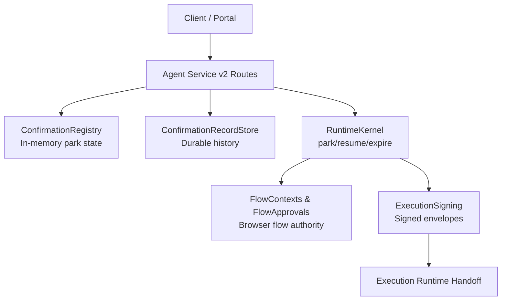
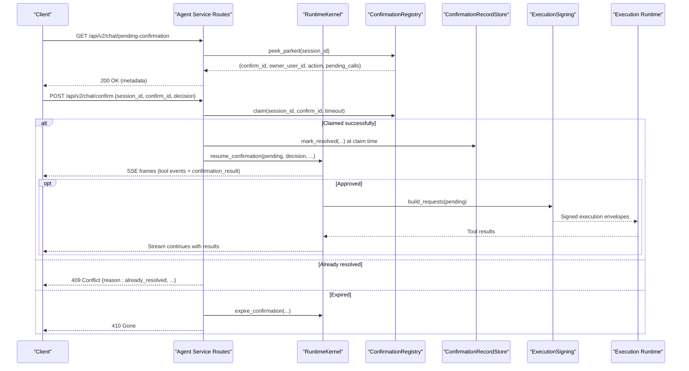
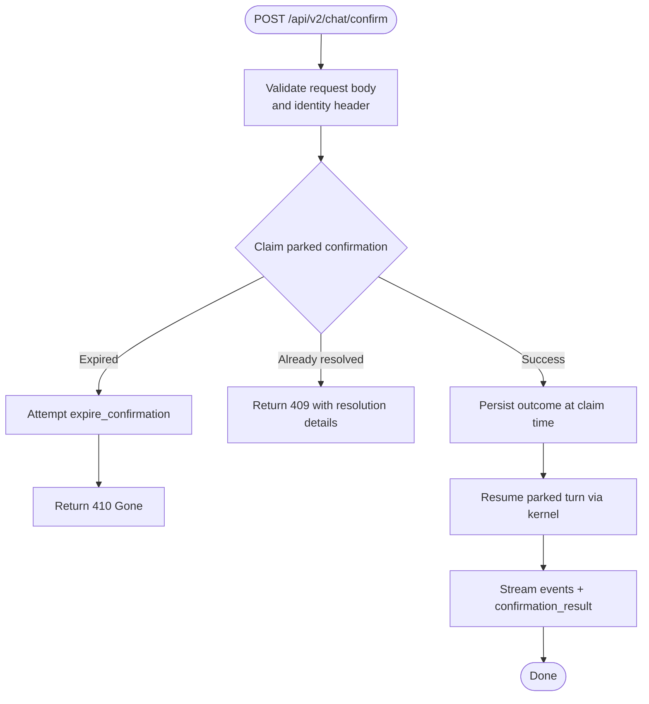
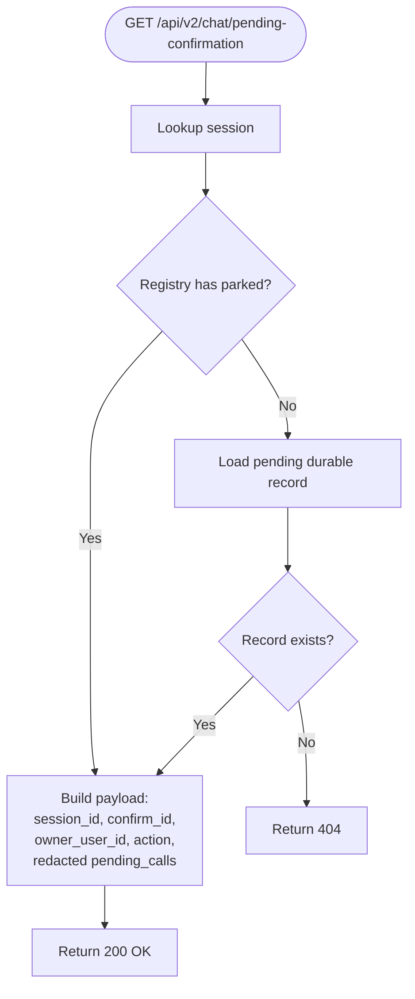
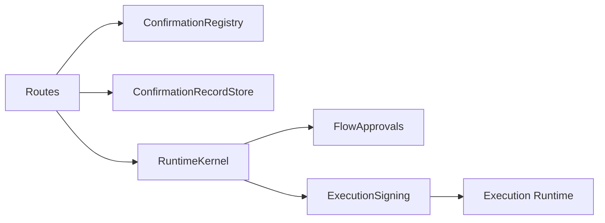

# Confirmation Workflow

<cite>
**Referenced Files in This Document**
- [routes.py](file://products/agent-platform/src/agent_service/api/v2/routes.py)
- [v2.py](file://products/agent-platform/src/agent_service/schemas/v2.py)
- [hitl_confirmations.py](file://products/agent-platform/src/agent_service/services/hitl_confirmations.py)
- [flow_approvals.py](file://products/agent-platform/src/agent_service/services/flow_approvals.py)
- [confirmation_records.py](file://products/agent-platform/src/agent_service/services/confirmation_records.py)
- [chat-confirm.schema.json](file://shared/shared-contracts/schemas/chat-confirm.schema.json)
- [test_contract_adapter.py](file://products/agent-platform/tests/test_contract_adapter.py)
- [test_confirmation_records.py](file://products/agent-platform/tests/test_confirmation_records.py)
- [execution_signing.py](file://products/agent-platform/src/agent_service/services/execution_signing.py)
- [handoff.py](file://products/execution-runtime/src/execution_runtime/api/routes/handoff.py)
- [runtime_kernel.py](file://products/agent-platform/src/agent_service/runtime_kernel.py)
</cite>

## Table of Contents
1. Introduction
2. Project Structure
3. Core Components
4. Architecture Overview
5. Detailed Component Analysis
6. Dependency Analysis
7. Performance Considerations
8. Troubleshooting Guide
9. Conclusion
10. Appendices

## Introduction
This document provides detailed API documentation for the human-in-the-loop (HITL) confirmation workflow endpoints exposed by the agent platform service. It covers:
- POST /api/v2/chat/confirm: submitting an operator decision on a parked confirmation.
- GET /api/v2/chat/pending-confirmation: querying metadata about a parked confirmation to support approval workflows.
It also explains the confirmation lifecycle from parking during tool execution, through policy enforcement and approval, to decision submission, stream resumption, and expiration handling. Confirmation states, concurrent access protection, ownership semantics, and integration with policy enforcement tiers are included, along with example flows, error scenarios, and best practices.

## Project Structure
The HITL confirmation feature spans several modules:
- API routes define the HTTP surface and orchestrate the flow.
- Schemas define request/response contracts and stream event shapes.
- Services implement the in-memory registry, durable records, flow approvals, and signing.
- Runtime kernel coordinates parking, expiry, and resumption with the agent process.

**Diagram sources**
- [routes.py:368-513](file://products/agent-platform/src/agent_service/api/v2/routes.py#L368-L513)
- [hitl_confirmations.py:452-595](file://products/agent-platform/src/agent_service/services/hitl_confirmations.py#L452-L595)
- [confirmation_records.py:41-46](file://products/agent-platform/src/agent_service/services/confirmation_records.py#L41-L46)
- [flow_approvals.py:41-75](file://products/agent-platform/src/agent_service/services/flow_approvals.py#L41-L75)
- [execution_signing.py:77-149](file://products/agent-platform/src/agent_service/services/execution_signing.py#L77-L149)
- [handoff.py:203-234](file://products/execution-runtime/src/execution_runtime/api/routes/handoff.py#L203-L234)

**Section sources**
- [routes.py:1-139](file://products/agent-platform/src/agent_service/api/v2/routes.py#L1-L139)
- [v2.py:97-186](file://products/agent-platform/src/agent_service/schemas/v2.py#L97-L186)

## Core Components
- AgentChatConfirmRequest: Request body for POST /api/v2/chat/confirm with fields session_id, confirm_id, and decision (approve or deny). Validated against shared schema.
- Pending confirmation metadata: Returned by GET /api/v2/chat/pending-confirmation including session_id, confirm_id, owner_user_id, action, and redacted pending_calls.
- ConfirmationRegistry: In-memory per-process registry that parks one confirmation per session, enforces TTL, single-flight claim, and resolution.
- ConfirmationRecordStore: Durable store (memory or Postgres) that persists parked and resolved confirmations, supports inbox queries, and sweeps expired history.
- FlowApprovals: Session-scoped browser flow context and approval authority used to auto-sign subsequent writes within an approved flow while it remains bound.
- ExecutionSigning: Builds signed execution envelopes for approved calls, binding parameters via args_digest and stamping approval_kind.

**Section sources**
- [chat-confirm.schema.json:1-27](file://shared/shared-contracts/schemas/chat-confirm.schema.json#L1-L27)
- [v2.py:97-107](file://products/agent-platform/src/agent_service/schemas/v2.py#L97-L107)
- [hitl_confirmations.py:47-97](file://products/agent-platform/src/agent_service/services/hitl_confirmations.py#L47-L97)
- [confirmation_records.py:41-46](file://products/agent-platform/src/agent_service/services/confirmation_records.py#L41-L46)
- [flow_approvals.py:41-75](file://products/agent-platform/src/agent_service/services/flow_approvals.py#L41-L75)
- [execution_signing.py:77-149](file://products/agent-platform/src/agent_service/services/execution_signing.py#L77-L149)

## Architecture Overview
The confirmation workflow proceeds as follows:
- Parking: During tool execution, if a tool requires user confirmation, the runtime kernel parks the reply and emits a confirmation_request frame with pending_calls and optional flow_summary. The ConfirmationRegistry stores the parked entry keyed by session_id.
- Approval query: The platform gateway uses GET /api/v2/chat/pending-confirmation to read owner_user_id, action (derived from risk tier), and redacted pending_calls to enforce policy tiers before proxying decisions.
- Decision submission: The approver calls POST /api/v2/chat/confirm with session_id, confirm_id, and decision. The route claims the confirmation atomically, persists the outcome early, then resumes the parked turn via the kernel. A confirmation_result frame is streamed back.
- Resumption and execution: On approve, the kernel builds signed execution envelopes for each parked call and hands them off to the execution runtime. On deny, the parked calls are aborted and the stream continues with denied results.
- Expiration: If a confirmation exceeds its TTL, new turns are rejected until expire_confirmation is invoked; confirm attempts return 410 after attempting to close the parked reply.

**Diagram sources**
- [routes.py:368-513](file://products/agent-platform/src/agent_service/api/v2/routes.py#L368-L513)
- [hitl_confirmations.py:496-577](file://products/agent-platform/src/agent_service/services/hitl_confirmations.py#L496-L577)
- [confirmation_records.py:516-556](file://products/agent-platform/src/agent_service/services/confirmation_records.py#L516-L556)
- [execution_signing.py:77-149](file://products/agent-platform/src/agent_service/services/execution_signing.py#L77-L149)
- [runtime_kernel.py:2243-2272](file://products/agent-platform/src/agent_service/runtime_kernel.py#L2243-L2272)

## Detailed Component Analysis

### Endpoint: POST /api/v2/chat/confirm
- Purpose: Submit an operator decision on a parked confirmation and resume the owner’s stream.
- Request body: AgentChatConfirmRequest with session_id, confirm_id, decision ("approve" | "deny").
- Identity: Conveyed via headers (X-User-ID); not in body.
- Behavior:
  - Claims the parked confirmation atomically to prevent double-resume.
  - Persists the outcome immediately at claim time for race resilience.
  - Streams resumed events back to the caller, including a confirmation_result frame indicating status.
  - On approve, builds signed execution envelopes for each parked call and executes them.
  - On deny, aborts parked calls and continues the stream with denied outcomes.
- Responses:
  - 200 OK with SSE stream containing tool events and confirmation_result.
  - 404 Not Found when no pending confirmation exists and no durable record indicates resolution.
  - 409 Conflict when the confirmation has already been resolved; response includes reason, status, decider_user_id, decision, and decided_at.
  - 410 Gone when the confirmation expired; the endpoint attempts to expire the parked reply before returning.

**Diagram sources**
- [routes.py:368-464](file://products/agent-platform/src/agent_service/api/v2/routes.py#L368-L464)
- [hitl_confirmations.py:520-534](file://products/agent-platform/src/agent_service/services/hitl_confirmations.py#L520-L534)
- [confirmation_records.py:516-536](file://products/agent-platform/src/agent_service/services/confirmation_records.py#L516-L536)

**Section sources**
- [routes.py:368-464](file://products/agent-platform/src/agent_service/api/v2/routes.py#L368-L464)
- [v2.py:97-107](file://products/agent-platform/src/agent_service/schemas/v2.py#L97-L107)
- [chat-confirm.schema.json:1-27](file://shared/shared-contracts/schemas/chat-confirm.schema.json#L1-L27)
- [test_contract_adapter.py:649-664](file://products/agent-platform/tests/test_contract_adapter.py#L649-L664)

### Endpoint: GET /api/v2/chat/pending-confirmation
- Purpose: Provide parked confirmation metadata to the platform-gateway approval bridge for policy-tier checks.
- Query parameter: session_id.
- Response fields:
  - session_id: The session holding the parked confirmation.
  - confirm_id: Unique identifier for the parked confirmation.
  - owner_user_id: Original requester who owns the session and any cards created by resumed turns.
  - action: Highest policy action derived from parked calls’ risk tiers (tools:invoke or tools:mutate; None for task tools without gateway risk tier).
  - pending_calls: Redacted list of parked calls with tool_name, parameters, optional display_hint, risk_level, action, and change_request projection for action cards.
- Behavior:
  - Returns live registry data when available; otherwise falls back to durable record for metadata-only use.
  - Unknown or unparked sessions return 404.

**Diagram sources**
- [routes.py:467-513](file://products/agent-platform/src/agent_service/api/v2/routes.py#L467-L513)
- [hitl_confirmations.py:98-145](file://products/agent-platform/src/agent_service/services/hitl_confirmations.py#L98-L145)
- [confirmation_records.py:627-635](file://products/agent-platform/src/agent_service/services/confirmation_records.py#L627-L635)

**Section sources**
- [routes.py:467-513](file://products/agent-platform/src/agent_service/api/v2/routes.py#L467-L513)
- [hitl_confirmations.py:98-145](file://products/agent-platform/src/agent_service/services/hitl_confirmations.py#L98-L145)
- [confirmation_records.py:627-635](file://products/agent-platform/src/agent_service/services/confirmation_records.py#L627-L635)

### Confirmation Lifecycle and States
- Parking: When a tool invocation requires user confirmation, the kernel parks the reply and emits a confirmation_request frame. The ConfirmationRegistry registers the entry with a unique confirm_id and timestamps.
- Approval workflow: The platform gateway reads pending-confirmation metadata, applies policy-tier checks (decider role, self-approval), and proxies the decision to POST /api/v2/chat/confirm.
- Decision submission: The route claims the confirmation atomically, persists the outcome, and resumes the parked turn. A confirmation_result frame streams back with status "approved" or "denied".
- Stream resumption: On approve, signed execution envelopes are built for each parked call and executed. On deny, the parked calls are aborted and the stream continues with denied results.
- Expiration handling: If a confirmation exceeds its TTL, new chat turns are rejected until expire_confirmation is called. Confirm attempts attempt to expire the parked reply and return 410 Gone.

States:
- pending: Parked and awaiting decision.
- approved: Decision was approve; execution envelopes were built and executed.
- denied: Decision was deny; parked calls aborted.
- expired: TTL exceeded; parked reply closed via expire_confirmation.

Concurrent access protection:
- Single-flight claim prevents duplicate decisions and double-resume.
- Ownership semantics: Cards created during resumed turns are owned by the session owner, not the approver, preventing self-approval blocks for tier_2 approvers.

Integration with policy enforcement tiers:
- Action field on pending_calls entries maps risk levels to policy actions (tools:invoke, tools:mutate). The gateway evaluates these actions against policy bundles before proxying decisions.

**Section sources**
- [hitl_confirmations.py:47-97](file://products/agent-platform/src/agent_service/services/hitl_confirmations.py#L47-L97)
- [hitl_confirmations.py:452-595](file://products/agent-platform/src/agent_service/services/hitl_confirmations.py#L452-L595)
- [routes.py:202-243](file://products/agent-platform/src/agent_service/api/v2/routes.py#L202-L243)
- [routes.py:368-464](file://products/agent-platform/src/agent_service/api/v2/routes.py#L368-L464)
- [confirmation_records.py:41-46](file://products/agent-platform/src/agent_service/services/confirmation_records.py#L41-L46)
- [flow_approvals.py:41-75](file://products/agent-platform/src/agent_service/services/flow_approvals.py#L41-L75)

### Browser Flow Authority and Auto-Signing
- Flow contexts reflect the current browser flow binding (skill_id, origin, title, description, risk_class, steps_used/max_steps).
- Flow approvals record operator approval of the first mutating write in a flow, enabling subsequent writes in the same flow to be auto-signed under that authority while the flow remains bound.
- Flow-killing errors clear both context and approval to prevent stale authority usage.

Best practice:
- Use flow approvals to reduce repeated approvals for multi-step browser workflows, but ensure flow bindings remain valid and respect TTL.

**Section sources**
- [flow_approvals.py:78-122](file://products/agent-platform/src/agent_service/services/flow_approvals.py#L78-L122)
- [flow_approvals.py:167-203](file://products/agent-platform/src/agent-service/services/flow_approvals.py#L167-L203)
- [flow_approvals.py:205-259](file://products/agent-platform/src/agent_service/services/flow_approvals.py#L205-L259)

### Signed Execution Envelopes
- For approved confirmations, the kernel builds signed execution envelopes for each parked call, binding parameters via args_digest and stamping approval_kind ("action" for per-action approvals).
- The execution runtime receives these envelopes, verifies signatures, and executes tools with the correct provenance.

**Section sources**
- [execution_signing.py:77-149](file://products/agent-platform/src/agent_service/services/execution_signing.py#L77-L149)
- [handoff.py:203-234](file://products/execution-runtime/src/execution_runtime/api/routes/handoff.py#L203-L234)

## Dependency Analysis
Key dependencies and relationships:
- Routes depend on ConfirmationRegistry for parking state, ConfirmationRecordStore for durability, and RuntimeKernel for streaming and resumption.
- ConfirmationRegistry depends on PendingConfirmation for metadata and helper functions for redaction and change-request projections.
- FlowApprovals maintains session-scoped context and approvals used by the kernel to auto-sign subsequent writes.
- ExecutionSigning produces signed envelopes consumed by the execution runtime handoff.

**Diagram sources**
- [routes.py:368-513](file://products/agent-platform/src/agent_service/api/v2/routes.py#L368-L513)
- [hitl_confirmations.py:452-595](file://products/agent-platform/src/agent_service/services/hitl_confirmations.py#L452-L595)
- [confirmation_records.py:41-46](file://products/agent-platform/src/agent_service/services/confirmation_records.py#L41-L46)
- [flow_approvals.py:41-75](file://products/agent-platform/src/agent_service/services/flow_approvals.py#L41-L75)
- [execution_signing.py:77-149](file://products/agent-platform/src/agent_service/services/execution_signing.py#L77-L149)
- [handoff.py:203-234](file://products/execution-runtime/src/execution_runtime/api/routes/handoff.py#L203-L234)

**Section sources**
- [routes.py:368-513](file://products/agent-platform/src/agent_service/api/v2/routes.py#L368-L513)
- [hitl_confirmations.py:452-595](file://products/agent-platform/src/agent_service/services/hitl_confirmations.py#L452-L595)
- [confirmation_records.py:41-46](file://products/agent-platform/src/agent_service/services/confirmation_records.py#L41-L46)
- [flow_approvals.py:41-75](file://products/agent-platform/src/agent_service/services/flow_approvals.py#L41-L75)
- [execution_signing.py:77-149](file://products/agent-platform/src/agent_service/services/execution_signing.py#L77-L149)
- [handoff.py:203-234](file://products/execution-runtime/src/execution_runtime/api/routes/handoff.py#L203-L234)

## Performance Considerations
- In-memory registry ensures low-latency claim and lookup for active confirmations.
- Durable records provide persistence across restarts and replicas; Postgres backend supports bounded inbox history and opportunistic sweep of old resolved rows.
- Redaction of pending_calls minimizes sensitive data exposure without impacting signed arguments_digest.
- Single-flight claim avoids redundant processing and protects against race conditions.

[No sources needed since this section provides general guidance]

## Troubleshooting Guide
Common error scenarios:
- Expired confirmation: POST /api/v2/chat/confirm returns 410 Gone after attempting to expire the parked reply. New turns are rejected until expire_confirmation resolves the parked state.
- Already resolved decision: POST /api/v2/chat/confirm returns 409 Conflict with structured detail including reason, status, decider_user_id, decision, and decided_at when another approver resolved the confirmation concurrently.
- Unknown or unparked session: GET /api/v2/chat/pending-confirmation returns 404 when no pending confirmation exists for the session.

Best practices:
- Always handle 409 and 410 responses gracefully in approval interfaces; retry briefly for 409 and inform users for 410.
- Use pending-confirmation to fetch owner_user_id and action for policy checks before submitting decisions.
- Ensure X-User-ID header is present for all confirm requests; missing identity results in 401.

**Section sources**
- [routes.py:396-429](file://products/agent-platform/src/agent_service/api/v2/routes.py#L396-L429)
- [routes.py:467-513](file://products/agent-platform/src/agent_service/api/v2/routes.py#L467-L513)
- [test_confirmation_records.py:690-712](file://products/agent-platform/tests/test_confirmation_records.py#L690-L712)

## Conclusion
The HITL confirmation workflow provides a secure, auditable mechanism for approving or denying potentially mutating tool calls. It combines in-memory state for fast operations with durable records for persistence and recovery, integrates with policy enforcement tiers via action mapping, and supports browser flow approvals to streamline multi-step workflows. Implementers should follow the documented endpoints, handle error cases robustly, and leverage flow approvals where appropriate to improve operator experience.

[No sources needed since this section summarizes without analyzing specific files]

## Appendices

### API Reference Summary
- POST /api/v2/chat/confirm
  - Body: AgentChatConfirmRequest (session_id, confirm_id, decision)
  - Headers: X-User-ID required
  - Responses: 200 OK (SSE stream), 404 Not Found, 409 Conflict (already_resolved), 410 Gone (expired)
- GET /api/v2/chat/pending-confirmation
  - Query: session_id
  - Response: {session_id, confirm_id, owner_user_id, action, pending_calls}

**Section sources**
- [v2.py:97-107](file://products/agent-platform/src/agent_service/schemas/v2.py#L97-L107)
- [chat-confirm.schema.json:1-27](file://shared/shared-contracts/schemas/chat-confirm.schema.json#L1-L27)
- [routes.py:368-513](file://products/agent-platform/src/agent_service/api/v2/routes.py#L368-L513)