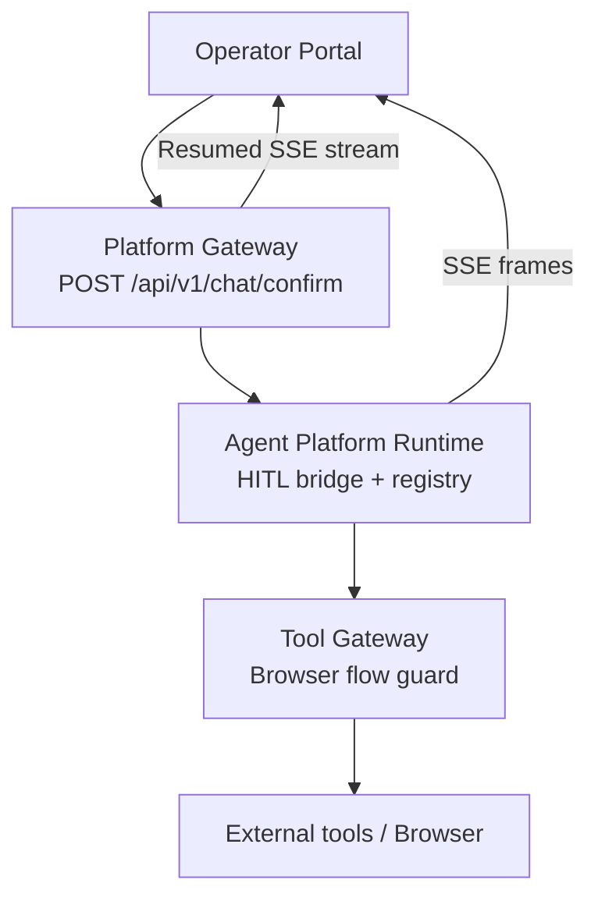
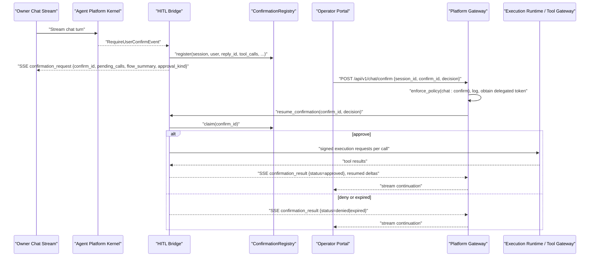
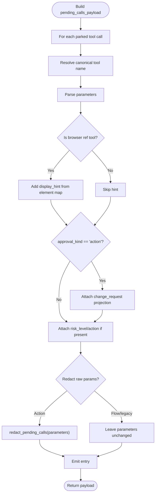
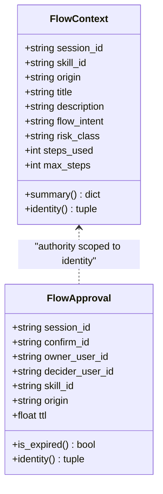
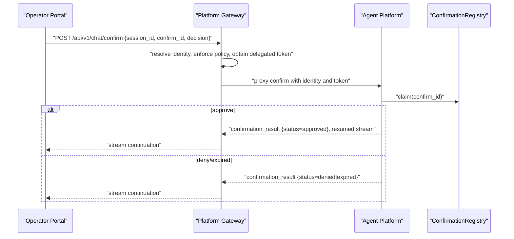
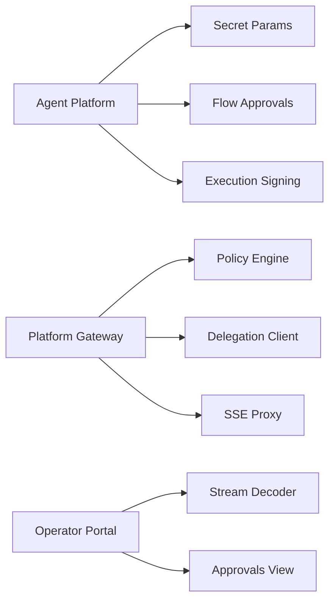

# Confirmation Events

<cite>
**Referenced Files in This Document**
- [hitl_confirmations.py](file://products/agent-platform/src/agent_service/services/hitl_confirmations.py)
- [flow_approvals.py](file://products/agent-platform/src/agent_service/services/flow_approvals.py)
- [chat.py](file://products/platform-gateway/src/platform_gateway/api/routes/chat.py)
- [gateway_service.py](file://products/platform-gateway/src/platform_gateway/services/gateway_service.py)
- [agent_client.py](file://products/platform-gateway/src/platform_gateway/services/agent_client.py)
- [chat-confirm.schema.json](file://shared/shared-contracts/schemas/chat-confirm.schema.json)
- [ApprovalsView.tsx](file://products/operator-portal/web-ui/app/src/views/control/ApprovalsView.tsx)
- [decoder.ts](file://products/operator-portal/web-ui/app/src/stream/decoder.ts)
- [ChatView.tsx](file://products/operator-portal/web-ui/app/src/chat/ChatView.tsx)
- [test_contract_adapter.py](file://products/agent-platform/tests/test_contract_adapter.py)
- [test_flow_approvals.py](file://products/agent-platform/tests/test_flow_approvals.py)
- [test_browser_connector.py](file://products/tool-gateway/tests/test_browser_connector.py)
- [approval-and-hitl.md](file://docs/guides/approval-and-hitl.md)
- [SPEC-020-hitl-confirmation-bridging/spec.md](file://docs/specs/SPEC-020-hitl-confirmation-bridging/spec.md)
- [SPEC-051-browser-flow-hitl-gate-enforcement/spec.md](file://docs/specs/SPEC-051-browser-flow-hitl-gate-enforcement/spec.md)
- [SPEC-053-skill-declared-step-intent/spec.md](file://docs/specs/SPEC-053-skill-declared-step-intent/spec.md)
- [SPEC-054-action-approval-and-change-request-card/spec.md](file://docs/specs/SPEC-054-action-approval-and-change-request-card/spec.md)
</cite>

## Table of Contents
1. Introduction
2. Project Structure
3. Core Components
4. Architecture Overview
5. Detailed Component Analysis
6. Dependency Analysis
7. Performance Considerations
8. Troubleshooting Guide
9. Conclusion
10. Appendices

## Introduction
This document explains the human-in-the-loop confirmation workflow that pauses agent execution until an operator decides whether to run pending tool calls. It covers:
- confirmation_request events that park a batch of tool invocations and present them for approval
- flow_summary objects that provide browser flow context (skill identification, origin, title, description, risk classification, and declared intent)
- confirmation_result events that resume execution after an operator decision
- The POST /api/v1/chat/confirm endpoint used by the portal to submit decisions with confirm_id and owner user context
- How action vs flow approvals differ and how they integrate with policy enforcement tiers
- Examples ranging from simple tool approvals to complex multi-step browser automation sequences

The goal is to make the confirmation lifecycle clear for both operators and platform engineers while preserving security through parameter redaction and signed execution envelopes.

## Project Structure
Confirmation events span multiple components:
- Agent Platform runtime bridges kernel ASK parking into SSE frames and maintains per-session pending confirmations
- Platform Gateway enforces policy on the confirm path and proxies resumed streams
- Operator Portal renders cards, collects decisions, and posts to the confirm endpoint
- Tool Gateway enforces browser flow binding and deviation guards; it also participates in unbound per-action flows
- Shared contracts define schemas for confirm requests and stream frames

**Diagram sources**
- [chat.py:158-199](file://products/platform-gateway/src/platform_gateway/api/routes/chat.py#L158-L199)
- [gateway_service.py:961-1262](file://products/platform-gateway/src/platform_gateway/services/gateway_service.py#L961-L1262)
- [hitl_confirmations.py:47-180](file://products/agent-platform/src/agent_service/services/hitl_confirmations.py#L47-L180)
- [flow_approvals.py:78-121](file://products/agent-platform/src/agent_service/services/flow_approvals.py#L78-L121)

**Section sources**
- [chat.py:158-199](file://products/platform-gateway/src/platform_gateway/api/routes/chat.py#L158-L199)
- [gateway_service.py:961-1262](file://products/platform-gateway/src/platform_gateway/services/gateway_service.py#L961-L1262)
- [hitl_confirmations.py:47-180](file://products/agent-platform/src/agent_service/services/hitl_confirmations.py#L47-L180)
- [flow_approvals.py:78-121](file://products/agent-platform/src/agent_service/services/flow_approvals.py#L78-L121)

## Core Components
- PendingConfirmation and ConfirmationRegistry: hold parked tool calls, risk levels, gateway names, browser element maps, flow summaries, and approval kind; serialize safe payloads for the operator card; enforce single-flight claim and TTL expiry
- FlowContext and FlowApproval stores: track the current bound browser flow identity and time-bounded authority that unlocks subsequent writes within the same flow
- Confirm route and proxy: validate identity, enforce policy, obtain delegated token, log audit, and return the resumed SSE stream
- Portal UI: decode confirmation frames, render flow headline and change request details, post decisions, and consume resumed stream deltas to update state

Key behaviors:
- Park: kernel emits confirmation_request with confirm_id, pending_calls, message, optional flow_summary, and approval_kind
- Approve/Deny: portal posts session_id, confirm_id, decision to POST /api/v1/chat/confirm
- Resume: agent platform resumes the parked reply and emits confirmation_result; downstream tools execute under signed envelopes when applicable

**Section sources**
- [hitl_confirmations.py:47-180](file://products/agent-platform/src/agent_service/services/hitl_confirmations.py#L47-L180)
- [flow_approvals.py:78-121](file://products/agent-platform/src/agent_service/services/flow_approvals.py#L78-L121)
- [chat.py:158-199](file://products/platform-gateway/src/platform_gateway/api/routes/chat.py#L158-L199)
- [decoder.ts:134-163](file://products/operator-portal/web-ui/app/src/stream/decoder.ts#L134-L163)
- [ApprovalsView.tsx:156-192](file://products/operator-portal/web-ui/app/src/views/control/ApprovalsView.tsx#L156-L192)

## Architecture Overview
The confirmation workflow spans four phases: park, present, decide, resume.

**Diagram sources**
- [hitl_confirmations.py:47-180](file://products/agent-platform/src/agent_service/services/hitl_confirmations.py#L47-L180)
- [chat.py:158-199](file://products/platform-gateway/src/platform_gateway/api/routes/chat.py#L158-L199)
- [gateway_service.py:961-1262](file://products/platform-gateway/src/platform_gateway/services/gateway_service.py#L961-L1262)
- [agent_client.py:225-234](file://products/platform-gateway/src/platform_gateway/services/agent_client.py#L225-L234)
- [ApprovalsView.tsx:156-192](file://products/operator-portal/web-ui/app/src/views/control/ApprovalsView.tsx#L156-L192)

## Detailed Component Analysis

### Confirmation Request Frame and Payload Redaction
- confirmation_request includes:
  - confirm_id: unique identifier for the parked batch
  - pending_calls: array of tool invocations requiring authorization
  - flow_summary: optional object describing the bound browser flow (skill_id, origin, title, description, risk_class, flow_intent)
  - approval_kind: “flow” when a bound browser write triggered the card; otherwise “action”
  - message: human-readable reason for the park
- pending_calls payload construction:
  - Uses canonical dotted tool names so signing and invocation agree
  - Adds display_hint for browser tools referencing snapshot elements
  - For action cards, attaches a change_request projection with summary and masked fields
  - Applies secret masking to raw parameters only for action cards to preserve security while keeping essential information visible
- Flow summary propagation:
  - Captured at park time from FlowContext.summary()
  - Present only for flow-kind cards; absent for action-kind cards

**Diagram sources**
- [hitl_confirmations.py:98-145](file://products/agent-platform/src/agent_service/services/hitl_confirmations.py#L98-L145)
- [hitl_confirmations.py:379-409](file://products/agent-platform/src/agent_service/services/hitl_confirmations.py#L379-L409)

**Section sources**
- [hitl_confirmations.py:98-145](file://products/agent-platform/src/agent_service/services/hitl_confirmations.py#L98-L145)
- [hitl_confirmations.py:379-409](file://products/agent-platform/src/agent_service/services/hitl_confirmations.py#L379-L409)
- [flow_approvals.py:106-121](file://products/agent-platform/src/agent_service/services/flow_approvals.py#L106-L121)
- [test_contract_adapter.py:399-429](file://products/agent-platform/tests/test_contract_adapter.py#L399-L429)

### Flow Summary and Browser Flow Integration
- FlowContext carries skill_id, origin, title, description, flow_intent, risk_class, steps_used, max_steps
- FlowContext.summary() produces the flow_summary object rendered on the confirmation card
- Flow approvals store records a time-bounded authority keyed by session and approved flow identity; subsequent writes in the same flow auto-sign under this authority until TTL expires or identity changes
- Browser write tools set include web.click, web.type, web.select, web.press_key, web.upload_file, web.evaluate; read-tier tools like web.fill_credential are not in this set and do not park cards by themselves

**Diagram sources**
- [flow_approvals.py:78-121](file://products/agent-platform/src/agent_service/services/flow_approvals.py#L78-L121)
- [flow_approvals.py:167-203](file://products/agent-platform/src/agent_service/services/flow_approvals.py#L167-L203)

**Section sources**
- [flow_approvals.py:78-121](file://products/agent-platform/src/agent_service/services/flow_approvals.py#L78-L121)
- [flow_approvals.py:167-203](file://products/agent-platform/src/agent_service/services/flow_approvals.py#L167-L203)
- [test_flow_approvals.py:70-107](file://products/agent-platform/tests/test_flow_approvals.py#L70-L107)

### Action vs Flow Approval Types
- approval_kind discriminator:
  - “flow”: bound browser write triggered the card; flow_summary is present; one gate per flow
  - “action”: ad-hoc mutating tool call; no flow_summary; per-action signed gates
- Change request projection:
  - For action cards, a structured change_request provides summary and masked fields
  - Curated formatters exist for demo-critical tools; generic fallback ensures every action card shows decision-relevant info safely
- Unbound browser interactions:
  - Allowlisted origins can now park per-action cards instead of hard-deny; live-origin re-check prevents drift
  - Read-tier ref-addressed interactions (e.g., web.fill_credential) are admitted unbound to enable login flows without leaking secrets

**Section sources**
- [hitl_confirmations.py:195-359](file://products/agent-platform/src/agent_service/services/hitl_confirmations.py#L195-L359)
- [SPEC-054-action-approval-and-change-request-card/spec.md:86-105](file://docs/specs/SPEC-054-action-approval-and-change-request-card/spec.md#L86-L105)
- [SPEC-054-action-approval-and-change-request-card/spec.md:180-262](file://docs/specs/SPEC-054-action-approval-and-change-request-card/spec.md#L180-L262)
- [test_browser_connector.py:1163-1228](file://products/tool-gateway/tests/test_browser_connector.py#L1163-L1228)

### POST /api/v1/chat/confirm Endpoint and Decision States
- Request schema requires session_id, confirm_id, decision ∈ {approve, deny}
- Identity resolution and policy enforcement ensure only authorized users can decide
- Delegated token obtained from confirmer’s credentials; resumed stream returned to client
- Audit event emitted for confirmation_decided once the kernel applies the decision
- Single-flight claim prevents double-resume; racing confirm attempts receive structured outcomes

**Diagram sources**
- [chat-confirm.schema.json:1-27](file://shared/shared-contracts/schemas/chat-confirm.schema.json#L1-L27)
- [chat.py:158-199](file://products/platform-gateway/src/platform_gateway/api/routes/chat.py#L158-L199)
- [hitl_confirmations.py:520-534](file://products/agent-platform/src/agent_service/services/hitl_confirmations.py#L520-L534)

**Section sources**
- [chat-confirm.schema.json:1-27](file://shared/shared-contracts/schemas/chat-confirm.schema.json#L1-L27)
- [chat.py:158-199](file://products/platform-gateway/src/platform_gateway/api/routes/chat.py#L158-L199)
- [hitl_confirmations.py:520-534](file://products/agent-platform/src/agent_service/services/hitl_confirmations.py#L520-L534)

### Policy Enforcement Tiers and Two-Person Control
- Layered enforcement:
  - Policy bundle actions (deny-by-default)
  - Tool risk tiers and tools:mutate admission
  - Agent auto-allow list (read-only only)
  - HITL confirmation (park and require explicit approval)
- require_approval tiers:
  - tier_1: operator confirms their own parked card
  - tier_2: designated approver required; self-approval blocked by default
- On the confirm path, the gateway evaluates the parked batch’s policy action and enforces tier requirements before resuming

**Section sources**
- [approval-and-hitl.md:27-90](file://docs/guides/approval-and-hitl.md#L27-L90)
- [approval-and-hitl.md:189-227](file://docs/guides/approval-and-hitl.md#L189-L227)
- [SPEC-020-hitl-confirmation-bridging/spec.md:53-62](file://docs/specs/SPEC-020-hitl-confirmation-bridging/spec.md#L53-L62)

### Browser Automation Sequences and Multi-Step Flows
- One gate per mutating browser flow:
  - First write-tier interaction parks a single card headlined by flow_summary
  - Subsequent writes in the same flow auto-sign under the approved authority until TTL expires or identity changes
- Skill-declared step intent:
  - flow_intent appears on the card as a prominent decision line explaining what the gated mutation achieves
- Unbound interactive troubleshooting:
  - Per-action browser writes on allowlisted origins park individually and execute under signed envelopes
  - Live-origin re-check prevents drift between navigate and interaction

**Section sources**
- [SPEC-051-browser-flow-hitl-gate-enforcement/spec.md:73-108](file://docs/specs/SPEC-051-browser-flow-hitl-gate-enforcement/spec.md#L73-L108)
- [SPEC-053-skill-declared-step-intent/spec.md:117-149](file://docs/specs/SPEC-053-skill-declared-step-intent/spec.md#L117-L149)
- [SPEC-054-action-approval-and-change-request-card/spec.md:180-262](file://docs/specs/SPEC-054-action-approval-and-change-request-card/spec.md#L180-L262)

### Examples of Confirmation Scenarios
- Simple tool approval:
  - A k8s.delete_pod call parks as an action card with a change_request summarizing pod and namespace; approver sees masked fields and approves via confirm endpoint
- Complex multi-step flow:
  - A browser flow binds to a skill; first write-tier interaction parks one card with flow_summary headline and flow_intent; subsequent writes auto-sign under the approved authority
- Browser automation sequence:
  - Unbound interactive session: fill credential (read-tier, reference-only), then click/mutate on allowlisted origin; each write parks its own card unless within an approved bound flow

[No sources needed since this section summarizes scenarios without analyzing specific files]

## Dependency Analysis
- Agent Platform depends on:
  - Secret masking utilities for parameter redaction
  - Flow approvals stores for browser flow authority
  - Execution signing for approved calls
- Platform Gateway depends on:
  - Policy engine for chat:confirm action
  - Delegation client for confirmer identity
  - Streaming proxy to pass SSE frames and extract confirmation_result
- Operator Portal depends on:
  - Stream decoder to parse confirmation frames and flow_summary
  - Approvals view to post decisions and consume resumed stream

**Diagram sources**
- [hitl_confirmations.py:21-25](file://products/agent-platform/src/agent_service/services/hitl_confirmations.py#L21-L25)
- [flow_approvals.py:270-274](file://products/agent-platform/src/agent_service/services/flow_approvals.py#L270-L274)
- [chat.py:158-199](file://products/platform-gateway/src/platform_gateway/api/routes/chat.py#L158-L199)
- [gateway_service.py:961-1262](file://products/platform-gateway/src/platform_gateway/services/gateway_service.py#L961-L1262)
- [decoder.ts:134-163](file://products/operator-portal/web-ui/app/src/stream/decoder.ts#L134-L163)
- [ApprovalsView.tsx:156-192](file://products/operator-portal/web-ui/app/src/views/control/ApprovalsView.tsx#L156-L192)

**Section sources**
- [hitl_confirmations.py:21-25](file://products/agent-platform/src/agent_service/services/hitl_confirmations.py#L21-L25)
- [flow_approvals.py:270-274](file://products/agent-platform/src/agent_service/services/flow_approvals.py#L270-L274)
- [chat.py:158-199](file://products/platform-gateway/src/platform_gateway/api/routes/chat.py#L158-L199)
- [gateway_service.py:961-1262](file://products/platform-gateway/src/platform_gateway/services/gateway_service.py#L961-L1262)
- [decoder.ts:134-163](file://products/operator-portal/web-ui/app/src/stream/decoder.ts#L134-L163)
- [ApprovalsView.tsx:156-192](file://products/operator-portal/web-ui/app/src/views/control/ApprovalsView.tsx#L156-L192)

## Performance Considerations
- In-memory registries:
  - ConfirmationRegistry and flow stores are per-process and do not survive restarts; this avoids persistence overhead but requires proper TTL handling and error paths
- Single-flight claims:
  - claim() prevents double-resume and reduces contention during concurrent approvals
- Redaction cost:
  - Parameter masking runs only for action cards and is applied to display/persistence copies; signed args_digest remains unchanged
- Streaming efficiency:
  - Gateway proxies SSE frames and extracts confirmation_result without buffering entire responses

[No sources needed since this section provides general guidance]

## Troubleshooting Guide
Common issues and resolutions:
- Unknown or already-resolved confirm_id:
  - Returns 404; verify confirm_id matches the parked card and that the session has not resolved it
- Expired confirmation:
  - Returns 410; parked calls are closed via interrupt; re-run the turn to generate a new card
- Concurrent turn on parked session:
  - Returns 409; wait for the confirmation to resolve before sending new turns
- Missing signing key:
  - Approved executions fail closed; ensure AGENT_EXECUTION_SIGNING_KEY is configured
- Flow authority stale:
  - If flow binding diverges, kernel clears contexts and approvals; next write parks again

**Section sources**
- [hitl_confirmations.py:28-34](file://products/agent-platform/src/agent_service/services/hitl_confirmations.py#L28-L34)
- [hitl_confirmations.py:496-518](file://products/agent-platform/src/agent_service/services/hitl_confirmations.py#L496-L518)
- [approval-and-hitl.md:290-333](file://docs/guides/approval-and-hitl.md#L290-L333)
- [SPEC-054-action-approval-and-change-request-card/spec.md:233-262](file://docs/specs/SPEC-054-action-approval-and-change-request-card/spec.md#L233-L262)

## Conclusion
Human-in-the-loop confirmation events provide a secure, auditable bridge between agent execution and operator control. By combining confirmation_request frames, flow_summary context, and confirmation_result resumption, the platform ensures that only authorized, reviewed actions execute. The separation of action vs flow approvals, combined with policy tiers and signed execution envelopes, delivers strong guarantees while maintaining a smooth operator experience. Redaction and change request projections keep sensitive data out of approval surfaces without sacrificing decision quality.

[No sources needed since this section summarizes without analyzing specific files]

## Appendices

### API Contract Reference
- POST /api/v1/chat/confirm request body:
  - session_id: string
  - confirm_id: string
  - decision: enum ["approve", "deny"]

**Section sources**
- [chat-confirm.schema.json:1-27](file://shared/shared-contracts/schemas/chat-confirm.schema.json#L1-L27)

### Portal Rendering Notes
- decoder.ts maps pending_calls into UI model including display_hint and change_request
- ChatView.tsx renders flow_summary headline and flow_intent as the lead decision line
- ApprovalsView.tsx posts decisions and consumes resumed stream to update card status

**Section sources**
- [decoder.ts:134-163](file://products/operator-portal/web-ui/app/src/stream/decoder.ts#L134-L163)
- [ChatView.tsx:416-457](file://products/operator-portal/web-ui/app/src/chat/ChatView.tsx#L416-L457)
- [ApprovalsView.tsx:156-192](file://products/operator-portal/web-ui/app/src/views/control/ApprovalsView.tsx#L156-L192)