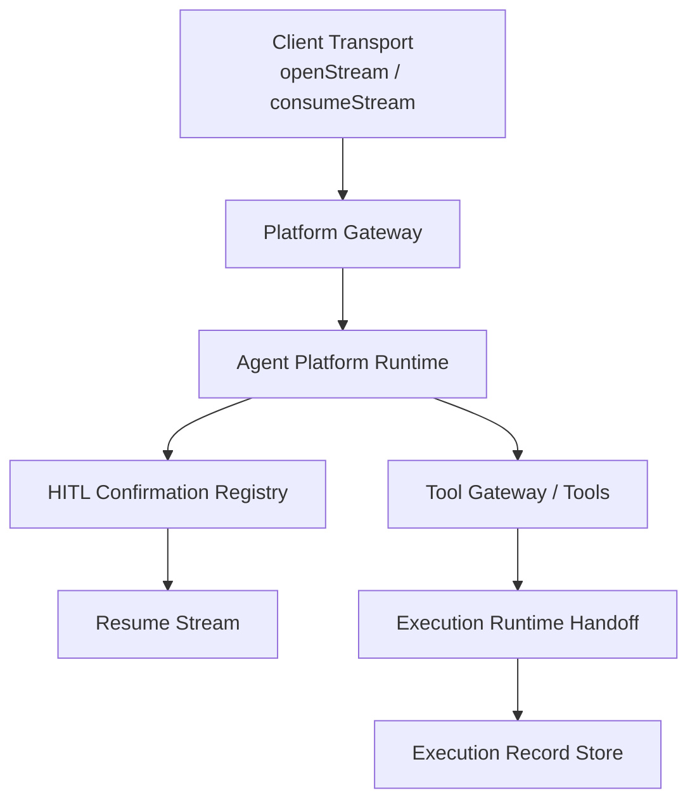
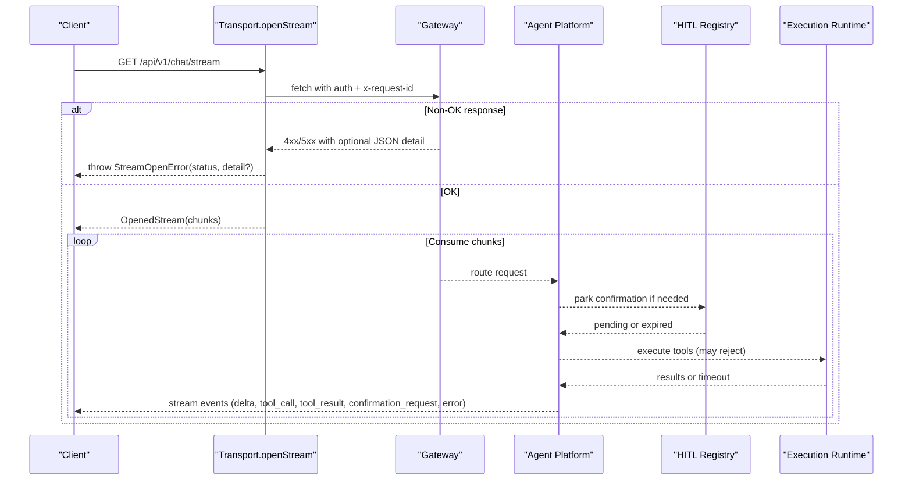
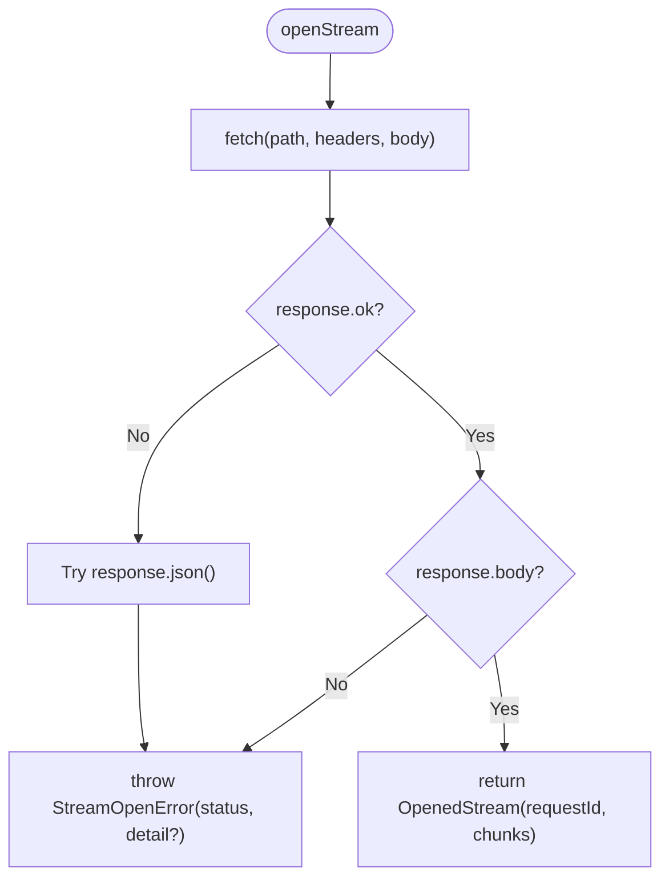
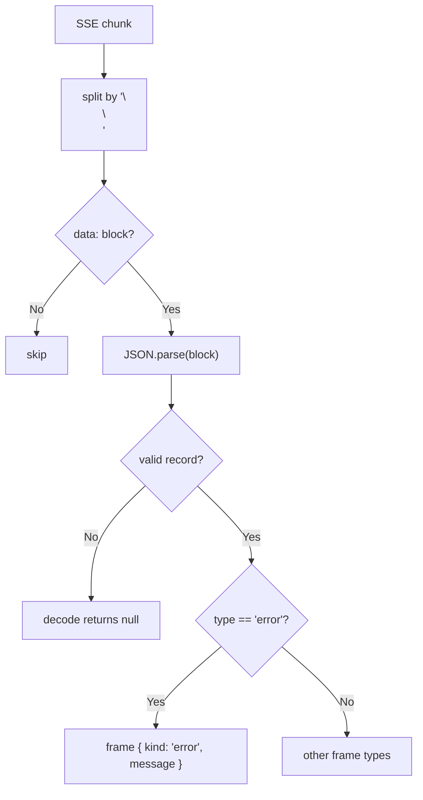
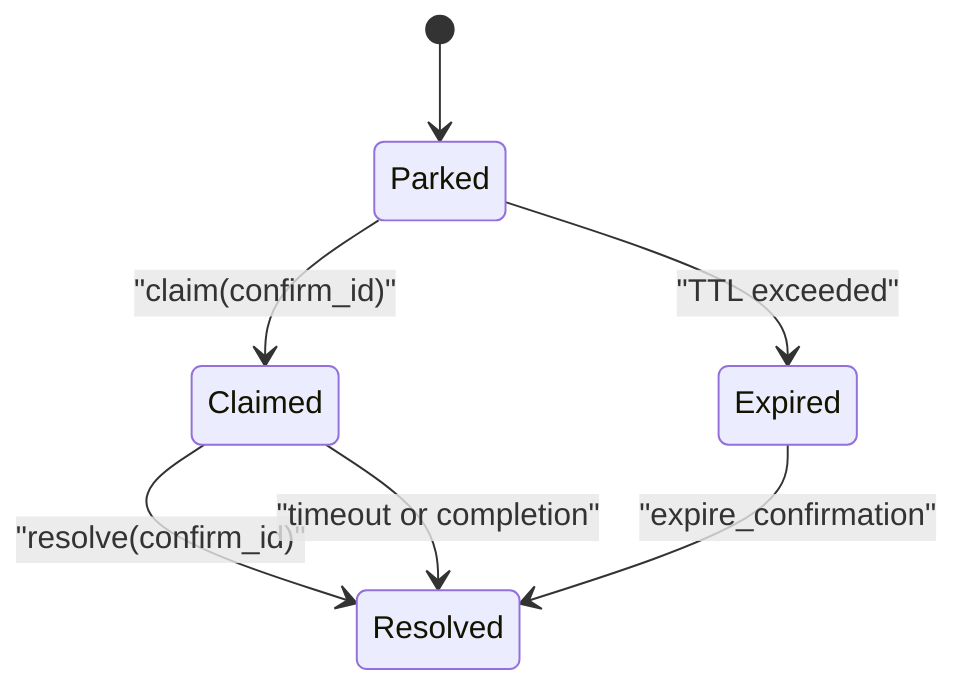
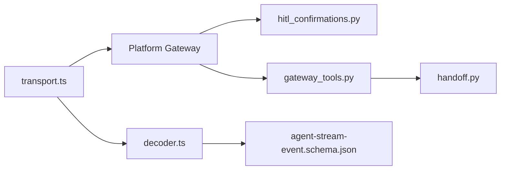

# Error Handling

<cite>
**Referenced Files in This Document**
- [stream-event.schema.json](file://shared/shared-contracts/schemas/stream-event.schema.json)
- [agent-stream-event.schema.json](file://shared/shared-contracts/schemas/agent-stream-event.schema.json)
- [transport.ts](file://products/operator-portal/web-ui/app/src/stream/transport.ts)
- [decoder.ts](file://products/operator-portal/web-ui/app/src/stream/decoder.ts)
- [hitl_confirmations.py](file://products/agent-platform/src/agent_service/services/hitl_confirmations.py)
- [gateway_tools.py](file://products/agent-platform/src/agent_service/tools/gateway_tools.py)
- [handoff.py](file://products/execution-runtime/src/execution_runtime/api/routes/handoff.py)
- [test_transport.ts](file://products/operator-portal/web-ui/app/src/stream/__tests__/transport.test.ts)
- [test_decoder.ts](file://products/operator-portal/web-ui/app/src/stream/__tests__/decoder.test.ts)
</cite>

## Table of Contents
1. Introduction
2. Project Structure
3. Core Components
4. Architecture Overview
5. Detailed Component Analysis
6. Dependency Analysis
7. Performance Considerations
8. Troubleshooting Guide
9. Conclusion

## Introduction
This document explains error handling patterns for the streaming chat system, focusing on how errors are represented, propagated, and recovered from across HTTP-level failures and stream-level events. It covers authentication failures, session validation errors, model resolution failures, tool execution errors, confirmation timeouts, connection errors, retry strategies, and the impact of errors on subsequent events and stream termination.

## Project Structure
Error handling spans three layers:
- Client transport and decoder (operator portal web UI): openStream throws structured errors for non-OK responses; consumeStream decodes SSE frames including error frames.
- Agent platform runtime: emits stream events with standardized error payloads and manages HITL confirmations with explicit expiration and single-flight semantics.
- Execution runtime handoff: records late completions and ensures durable close even when a resumed stream times out before a worker completes.

**Diagram sources**
- [transport.ts:108-148](file://products/operator-portal/web-ui/app/src/stream/transport.ts#L108-L148)
- [decoder.ts:179-188](file://products/operator-portal/web-ui/app/src/stream/decoder.ts#L179-L188)
- [hitl_confirmations.py:452-595](file://products/agent-platform/src/agent_service/services/hitl_confirmations.py#L452-L595)
- [handoff.py:236-263](file://products/execution-runtime/src/execution_runtime/api/routes/handoff.py#L236-L263)

**Section sources**
- [transport.ts:108-148](file://products/operator-portal/web-ui/app/src/stream/transport.ts#L108-L148)
- [decoder.ts:179-188](file://products/operator-portal/web-ui/app/src/stream/decoder.ts#L179-L188)
- [hitl_confirmations.py:452-595](file://products/agent-platform/src/agent_service/services/hitl_confirmations.py#L452-L595)
- [handoff.py:236-263](file://products/execution-runtime/src/execution_runtime/api/routes/handoff.py#L236-L263)

## Core Components
- StreamOpenError: thrown by openStream for any non-OK response or missing body; carries HTTP status and parsed detail envelope when available.
- SSE error frame: decoded into a terminal error event with a message; used to signal stream-level errors during processing.
- HITL confirmation registry: enforces per-session parking, single-flight claim, TTL expiry, and resolves parked calls via resume; raises explicit not-found/expired exceptions.
- Tool execution rejection: mutating tools can be rejected mid-stream with a structured error result that keeps the stream alive and closes execution records.
- Execution runtime handoff: best-effort durable close with late completion logging; preserves first-writer semantics for receipts.

**Section sources**
- [transport.ts:8-20](file://products/operator-portal/web-ui/app/src/stream/transport.ts#L8-L20)
- [transport.ts:108-148](file://products/operator-portal/web-ui/app/src/stream/transport.ts#L108-L148)
- [decoder.ts:179-188](file://products/operator-portal/web-ui/app/src/stream/decoder.ts#L179-L188)
- [hitl_confirmations.py:28-34](file://products/agent-platform/src/agent_service/services/hitl_confirmations.py#L28-L34)
- [hitl_confirmations.py:496-518](file://products/agent-platform/src/agent_service/services/hitl_confirmations.py#L496-L518)
- [gateway_tools.py:206-228](file://products/agent-platform/src/agent_service/tools/gateway_tools.py#L206-L228)
- [handoff.py:236-263](file://products/execution-runtime/src/execution_runtime/api/routes/handoff.py#L236-L263)

## Architecture Overview
The streaming chat flow uses Server-Sent Events (SSE). Errors can occur at two levels:
- HTTP-level: openStream rejects immediately with StreamOpenError carrying status and optional detail.
- Stream-level: error frames arrive as part of the SSE payload and terminate normal processing for that turn.

**Diagram sources**
- [transport.ts:108-148](file://products/operator-portal/web-ui/app/src/stream/transport.ts#L108-L148)
- [decoder.ts:179-188](file://products/operator-portal/web-ui/app/src/stream/decoder.ts#L179-L188)
- [hitl_confirmations.py:496-518](file://products/agent-platform/src/agent_service/services/hitl_confirmations.py#L496-L518)
- [handoff.py:236-263](file://products/execution-runtime/src/execution_runtime/api/routes/handoff.py#L236-L263)

## Detailed Component Analysis

### HTTP-Level Errors and StreamOpenError
- Behavior: openStream throws StreamOpenError for any non-OK response or missing body. It attempts to parse the response body as JSON and attaches it as detail when present; otherwise detail is undefined.
- Status mapping guidance: callers map 401 to sign-in prompts and 410 to confirmation expiry on the confirm route.
- Tests verify:
  - 401 without body yields StreamOpenError with status 401.
  - 409 with structured detail yields StreamOpenError with status 409 and parsed detail.
  - Non-JSON error bodies degrade to detail=undefined.

**Diagram sources**
- [transport.ts:108-148](file://products/operator-portal/web-ui/app/src/stream/transport.ts#L108-L148)

**Section sources**
- [transport.ts:8-20](file://products/operator-portal/web-ui/app/src/stream/transport.ts#L8-L20)
- [transport.ts:108-148](file://products/operator-portal/web-ui/app/src/stream/transport.ts#L108-L148)
- [test_transport.ts:95-145](file://products/operator-portal/web-ui/app/src/stream/__tests__/transport.test.ts#L95-L145)

### Stream-Level Error Frames
- Schema: agent-stream-event.schema.json defines an error event type with an optional error object containing code and message. The legacy schema also supports an error event with a message field.
- Decoder behavior: decodeEventBlock maps error frames to a terminal error frame with a message derived from payload.error.message or payload.message, falling back to a default message when absent. Malformed blocks are skipped without breaking the stream.
- Impact: error frames are treated as terminal for the current turn; consumers should stop rendering deltas and surface the error to the user.

**Diagram sources**
- [decoder.ts:204-225](file://products/operator-portal/web-ui/app/src/stream/decoder.ts#L204-L225)
- [decoder.ts:179-188](file://products/operator-portal/web-ui/app/src/stream/decoder.ts#L179-L188)

**Section sources**
- [agent-stream-event.schema.json:1-160](file://shared/shared-contracts/schemas/agent-stream-event.schema.json#L1-L160)
- [stream-event.schema.json:1-27](file://shared/shared-contracts/schemas/stream-event.schema.json#L1-L27)
- [decoder.ts:179-188](file://products/operator-portal/web-ui/app/src/stream/decoder.ts#L179-L188)
- [decoder.ts:204-225](file://products/operator-portal/web-ui/app/src/stream/decoder.ts#L204-L225)
- [test_decoder.ts:385-402](file://products/operator-portal/web-ui/app/src/stream/__tests__/decoder.test.ts#L385-L402)

### Authentication Failures (HTTP 401)
- Occurrence: openStream receives a non-OK response with status 401.
- Client action: callers map 401 to prompt sign-in; no stream is opened.
- Recovery: after re-authentication, retry the stream request.

**Section sources**
- [transport.ts:108-148](file://products/operator-portal/web-ui/app/src/stream/transport.ts#L108-L148)
- [test_transport.ts:95-103](file://products/operator-portal/web-ui/app/src/stream/__tests__/transport.test.ts#L95-L103)

### Session Validation Errors (HTTP 409)
- Occurrence: confirm endpoint may return 409 when a confirmation has already been resolved or is being processed.
- Client action: openStream attaches the parsed detail envelope to StreamOpenError.detail; callers can inspect reason to decide whether to show the winner’s outcome instead of retrying.
- Recovery: do not blindly retry; use detail.reason to branch behavior (e.g., display winner decision).

**Section sources**
- [transport.ts:24-48](file://products/operator-portal/web-ui/app/src/stream/transport.ts#L24-L48)
- [transport.ts:108-148](file://products/operator-portal/web-ui/app/src/stream/transport.ts#L108-L148)
- [test_transport.ts:114-130](file://products/operator-portal/web-ui/app/src/stream/__tests__/transport.test.ts#L114-L130)

### Confirmation Timeouts (HTTP 410)
- Occurrence: confirm route may return 410 when a pending confirmation exceeds its time-to-live.
- Client action: callers map 410 to confirmation expiry; do not retry the same confirm_id.
- Server-side: ConfirmationRegistry.get raises ConfirmationExpired when TTL is breached; callers should close parked calls and inform the user.

**Section sources**
- [transport.ts:108-148](file://products/operator-portal/web-ui/app/src/stream/transport.ts#L108-L148)
- [hitl_confirmations.py:28-34](file://products/agent-platform/src/agent_service/services/hitl_confirmations.py#L28-L34)
- [hitl_confirmations.py:496-518](file://products/agent-platform/src/agent_service/services/hitl_confirmations.py#L496-L518)

### Model Resolution Failures
- Context: per-turn model selection is validated against a credential-gated catalog; invalid or unavailable models fail closed.
- Error propagation: such failures surface as stream-level error frames with an error object containing code and message, or as HTTP errors if they occur before stream start.
- Client recovery: treat as terminal for the turn; allow the user to select a different model and retry.

**Section sources**
- [transport.ts:61-86](file://products/operator-portal/web-ui/app/src/stream/transport.ts#L61-L86)
- [agent-stream-event.schema.json:1-160](file://shared/shared-contracts/schemas/agent-stream-event.schema.json#L1-L160)

### Tool Execution Errors
- In-stream tool_result frames: status can be "error" or "denied"; error objects carry code and message.
- Mutating tool rejection: gateway tools can reject execution mid-stream with a structured error result (status "error", code "EXECUTION_REJECTED") while keeping the stream alive; this allows evidence middleware to emit tool_result and kernel to close execution records.
- Client handling: render tool_result error cards; do not assume success based on stream continuity.

**Section sources**
- [agent-stream-event.schema.json:1-160](file://shared/shared-contracts/schemas/agent-stream-event.schema.json#L1-L160)
- [gateway_tools.py:206-228](file://products/agent-platform/src/agent_service/tools/gateway_tools.py#L206-L228)

### Confirmation Flow Errors and Single-Flight Semantics
- Parking: when the kernel parks a reply, a confirmation_request frame is emitted with pending_calls and metadata.
- Claiming: claim marks an entry as claimed to prevent double-resume; duplicate confirms raise ConfirmationNotFound.
- Expiry: get checks TTL and raises ConfirmationExpired; take_for_expiry atomically claims entries for cleanup without interrupting in-flight resumes.
- Resolve: resolve clears the parked entry so subsequent turns proceed normally.

**Diagram sources**
- [hitl_confirmations.py:496-518](file://products/agent-platform/src/agent_service/services/hitl_confirmations.py#L496-L518)
- [hitl_confirmations.py:520-558](file://products/agent-platform/src/agent_service/services/hitl_confirmations.py#L520-L558)
- [hitl_confirmations.py:572-577](file://products/agent-platform/src/agent_service/services/hitl_confirmations.py#L572-L577)

**Section sources**
- [hitl_confirmations.py:452-595](file://products/agent-platform/src/agent_service/services/hitl_confirmations.py#L452-L595)

### Connection Errors and Retry Mechanisms
- Transport layer: openStream relies on fetch; network errors propagate as exceptions to the caller.
- Retry strategy:
  - For transient network errors, implement exponential backoff with jitter and a bounded number of retries.
  - For 401, refresh credentials and retry once.
  - For 409 with reason "already_resolved", do not retry; surface the winner’s outcome from detail.
  - For 410, do not retry; inform the user the confirmation expired.
- Stream consumption: consumeStream iterates chunks until exhaustion; if the underlying connection drops, the async iteration ends and the consumer should handle termination gracefully.

**Section sources**
- [transport.ts:108-148](file://products/operator-portal/web-ui/app/src/stream/transport.ts#L108-L148)
- [transport.ts:150-164](file://products/operator-portal/web-ui/app/src/stream/transport.ts#L150-L164)
- [transport.ts:24-48](file://products/operator-portal/web-ui/app/src/stream/transport.ts#L24-L48)

### Error Propagation Through the Stream Lifecycle
- Pre-stream: HTTP errors abort opening; no events are emitted.
- During stream:
  - Delta and informational frames continue until an error frame arrives.
  - An error frame is terminal for the turn; consumers should stop accumulating deltas and present the error.
  - Tool errors appear as tool_result frames with status "error"/"denied" and an error object.
  - Confirmation flows emit confirmation_request and later confirmation_result; errors in these flows surface as HTTP errors or stream-level error frames depending on where they occur.
- Post-stream: execution runtime handoff records late completions and preserves first-writer semantics for receipts.

**Section sources**
- [decoder.ts:179-188](file://products/operator-portal/web-ui/app/src/stream/decoder.ts#L179-L188)
- [agent-stream-event.schema.json:1-160](file://shared/shared-contracts/schemas/agent-stream-event.schema.json#L1-L160)
- [handoff.py:236-263](file://products/execution-runtime/src/execution_runtime/api/routes/handoff.py#L236-L263)

## Dependency Analysis
- Client transport depends on:
  - API client helpers for auth headers and request IDs.
  - SSE decoder to transform raw bytes into typed frames.
- Agent platform depends on:
  - HITL confirmation registry for parking and resuming replies.
  - Tool gateway integration for executing tools and emitting tool_call/tool_result frames.
  - Execution runtime handoff for durable receipts and late completion handling.
- Schemas define the contract for stream events, ensuring consistent error representation across components.

**Diagram sources**
- [transport.ts:108-148](file://products/operator-portal/web-ui/app/src/stream/transport.ts#L108-L148)
- [decoder.ts:179-188](file://products/operator-portal/web-ui/app/src/stream/decoder.ts#L179-L188)
- [hitl_confirmations.py:452-595](file://products/agent-platform/src/agent_service/services/hitl_confirmations.py#L452-L595)
- [gateway_tools.py:206-228](file://products/agent-platform/src/agent_service/tools/gateway_tools.py#L206-L228)
- [handoff.py:236-263](file://products/execution-runtime/src/execution_runtime/api/routes/handoff.py#L236-L263)
- [agent-stream-event.schema.json:1-160](file://shared/shared-contracts/schemas/agent-stream-event.schema.json#L1-L160)

**Section sources**
- [transport.ts:108-148](file://products/operator-portal/web-ui/app/src/stream/transport.ts#L108-L148)
- [decoder.ts:179-188](file://products/operator-portal/web-ui/app/src/stream/decoder.ts#L179-L188)
- [hitl_confirmations.py:452-595](file://products/agent-platform/src/agent_service/services/hitl_confirmations.py#L452-L595)
- [gateway_tools.py:206-228](file://products/agent-platform/src/agent_service/tools/gateway_tools.py#L206-L228)
- [handoff.py:236-263](file://products/execution-runtime/src/execution_runtime/api/routes/handoff.py#L236-L263)
- [agent-stream-event.schema.json:1-160](file://shared/shared-contracts/schemas/agent-stream-event.schema.json#L1-L160)

## Performance Considerations
- Avoid unnecessary retries on idempotent but stateful operations like confirm; use detail.reason to short-circuit retries.
- Prefer streaming error frames over reconnecting streams when possible to reduce overhead.
- Use bounded retries with jitter for transient network errors to prevent thundering herds.
- Leverage x-request-id for tracing errors across components.

[No sources needed since this section provides general guidance]

## Troubleshooting Guide
- Identify error level:
  - If openStream throws StreamOpenError, inspect status and detail to determine HTTP-level cause.
  - If consumeStream emits an error frame, inspect the decoded frame message and context.
- Common scenarios:
  - 401: refresh credentials and retry the stream.
  - 409 with reason "already_resolved": display the winner’s outcome from detail; do not retry.
  - 410: inform the user the confirmation expired; do not retry the same confirm_id.
  - Tool errors: render tool_result error cards; check error.code and error.message for actionable details.
  - Confirmation timeouts: handle ConfirmationExpired by closing parked calls and notifying the user.
- Debugging steps:
  - Capture x-request-id from the failed request.
  - Inspect SSE frames around the error to correlate upstream events.
  - Check execution runtime handoff logs for late completions and receipt writes.

**Section sources**
- [transport.ts:108-148](file://products/operator-portal/web-ui/app/src/stream/transport.ts#L108-L148)
- [decoder.ts:179-188](file://products/operator-portal/web-ui/app/src/stream/decoder.ts#L179-L188)
- [hitl_confirmations.py:496-518](file://products/agent-platform/src/agent_service/services/hitl_confirmations.py#L496-L518)
- [handoff.py:236-263](file://products/execution-runtime/src/execution_runtime/api/routes/handoff.py#L236-L263)

## Conclusion
The streaming chat system distinguishes between HTTP-level failures and stream-level errors, providing structured error information at each stage. Clients should handle StreamOpenError for connection and authorization issues, interpret error frames for runtime failures, and apply targeted recovery strategies based on status codes and detail payloads. HITL confirmations enforce strict lifecycle rules to prevent race conditions and ensure safe resumption or expiration. Execution runtime handoff guarantees durable records even under timing pressure. Following these patterns yields resilient, observable, and user-friendly error handling across the entire stream lifecycle.