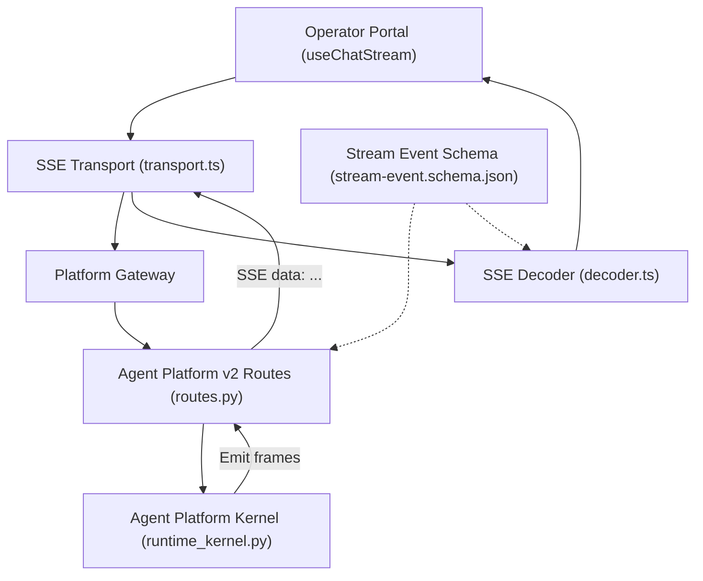
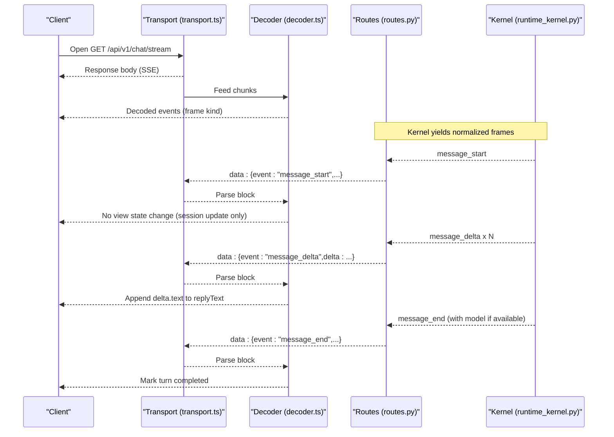
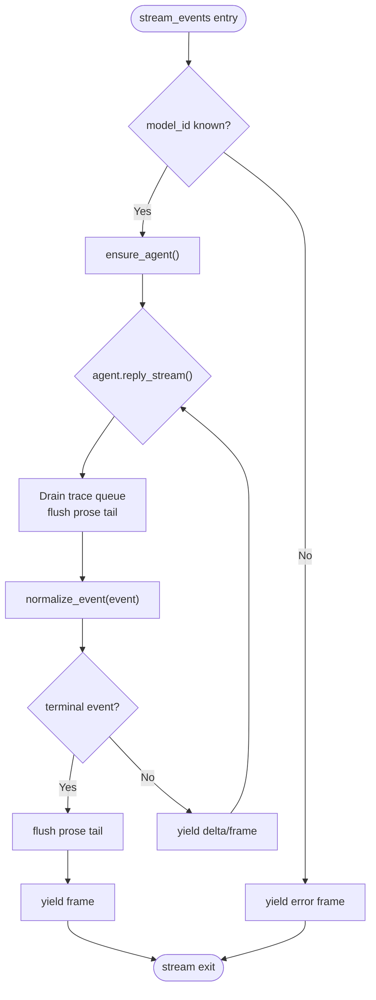
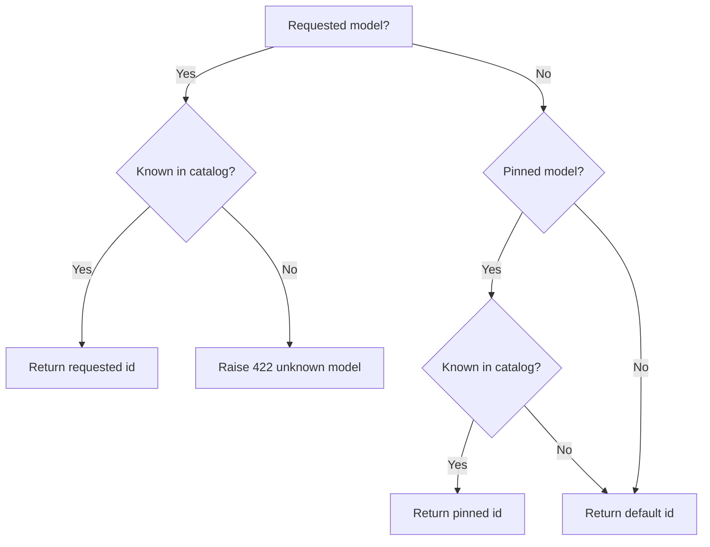
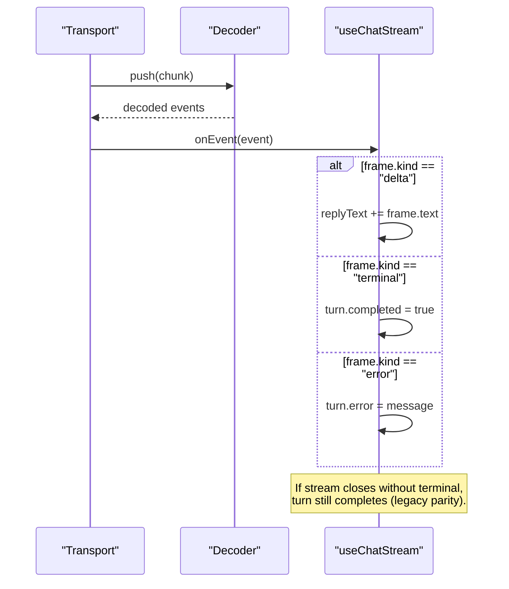
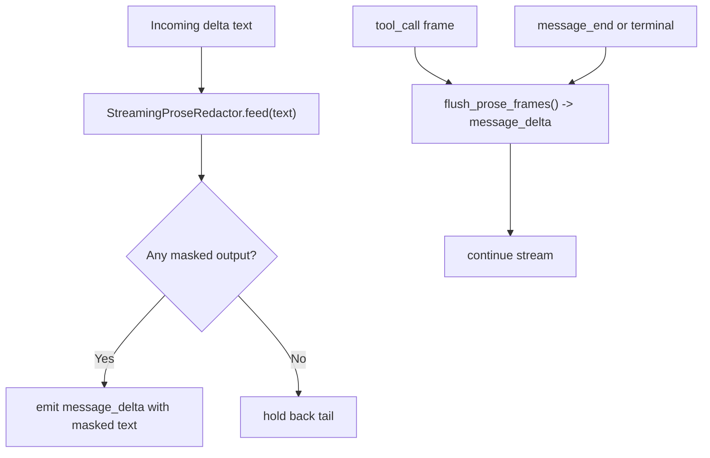
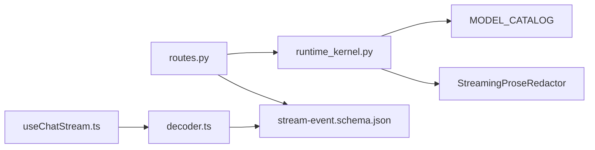

# Message Events

<cite>
**Referenced Files in This Document**
- [stream-event.schema.json](file://shared/shared-contracts/schemas/stream-event.schema.json)
- [chat-response.schema.json](file://shared/shared-contracts/schemas/chat-response.schema.json)
- [runtime_kernel.py](file://products/agent-platform/src/agent_service/runtime_kernel.py)
- [routes.py](file://products/agent-platform/src/agent_service/api/v2/routes.py)
- [decoder.ts](file://products/operator-portal/web-ui/app/src/stream/decoder.ts)
- [transport.ts](file://products/operator-portal/web-ui/app/src/stream/transport.ts)
- [useChatStream.ts](file://products/operator-portal/web-ui/app/src/stream/useChatStream.ts)
- [models.ts](file://products/operator-portal/web-ui/app/src/stream/models.ts)
- [test_chat_stream_modality.py](file://products/platform-gateway/tests/test_chat_stream_modality.py)
- [test_model_switching.py](file://products/agent-platform/tests/test_model_switching.py)
</cite>

## Table of Contents
1. Introduction
2. Project Structure
3. Core Components
4. Architecture Overview
5. Detailed Component Analysis
6. Dependency Analysis
7. Performance Considerations
8. Troubleshooting Guide
9. Conclusion

## Introduction
This document explains message-related streaming events emitted during a chat turn. It focuses on:
- message_start: signals the beginning of a turn with session and request tracking.
- message_delta: incremental content updates carrying partial text chunks as the LLM generates them.
- message_end: marks completion, including final model information and serving model resolution details.

It also covers the end-to-end event sequence from start through deltas to end, how clients accumulate delta fragments into complete messages, timing considerations, chunking strategies, and error scenarios where message_end may carry error information instead of a success marker.

## Project Structure
The streaming contract is defined centrally and consumed by both server-side components and the operator portal client:
- Shared schema defines the wire format for stream events.
- Agent platform kernel emits normalized stream frames and applies prose redaction.
- Agent platform v2 routes normalize and forward frames over SSE.
- Operator portal decodes SSE lines, maps frames, accumulates deltas, and handles terminal conditions.

**Diagram sources**
- [stream-event.schema.json:1-27](file://shared/shared-contracts/schemas/stream-event.schema.json#L1-L27)
- [runtime_kernel.py:800-994](file://products/agent-platform/src/agent_service/runtime_kernel.py#L800-L994)
- [routes.py:115-273](file://products/agent-platform/src/agent_service/api/v2/routes.py#L115-L273)
- [decoder.ts:161-202](file://products/operator-portal/web-ui/app/src/stream/decoder.ts#L161-L202)
- [transport.ts:126-164](file://products/operator-portal/web-ui/app/src/stream/transport.ts#L126-L164)
- [useChatStream.ts:167-200](file://products/operator-portal/web-ui/app/src/stream/useChatStream.ts#L167-L200)

**Section sources**
- [stream-event.schema.json:1-27](file://shared/shared-contracts/schemas/stream-event.schema.json#L1-L27)
- [runtime_kernel.py:800-994](file://products/agent-platform/src/agent_service/runtime_kernel.py#L800-L994)
- [routes.py:115-273](file://products/agent-platform/src/agent_service/api/v2/routes.py#L115-L273)
- [decoder.ts:161-202](file://products/operator-portal/web-ui/app/src/stream/decoder.ts#L161-L202)
- [transport.ts:126-164](file://products/operator-portal/web-ui/app/src/stream/transport.ts#L126-L164)
- [useChatStream.ts:167-200](file://products/operator-portal/web-ui/app/src/stream/useChatStream.ts#L167-L200)

## Core Components
- Stream event schema: Defines the allowed event types and fields for each frame.
- Kernel stream emitter: Produces message_start, message_delta, message_end, and error frames; normalizes provider events; applies prose redaction; attaches serving model on message_end.
- V2 route normalization: Normalizes incoming frames and forwards them as SSE data blocks.
- Client decoder and transport: Parses SSE lines, maps frames to internal kinds, and accumulates delta text into replyText.
- Turn lifecycle: Tracks completion, pending confirmations, and errors; handles missing terminal frames gracefully.

Key responsibilities:
- Server side: Emit consistent frames, enforce model resolution rules, redact sensitive content, and attach metadata such as request_id and session_id.
- Client side: Decode SSE, accumulate deltas, handle terminal conditions, and surface errors or confirmation flows.

**Section sources**
- [stream-event.schema.json:1-27](file://shared/shared-contracts/schemas/stream-event.schema.json#L1-L27)
- [runtime_kernel.py:908-957](file://products/agent-platform/src/agent_service/runtime_kernel.py#L908-L957)
- [routes.py:443-464](file://products/agent-platform/src/agent_service/api/v2/routes.py#L443-L464)
- [decoder.ts:161-202](file://products/operator-portal/web-ui/app/src/stream/decoder.ts#L161-L202)
- [useChatStream.ts:167-200](file://products/operator-portal/web-ui/app/src/stream/useChatStream.ts#L167-L200)

## Architecture Overview
The chat stream follows a predictable sequence per turn:
1. message_start: Signals turn initiation with request_id and session_id.
2. Zero or more message_delta: Carry incremental text chunks; clients append to replyText.
3. message_end: Marks completion; includes resolved model information when present.
4. Optional error frames: May appear at any point; message_end can also carry error context depending on flow.

**Diagram sources**
- [runtime_kernel.py:815-832](file://products/agent-platform/src/agent_service/runtime_kernel.py#L815-L832)
- [runtime_kernel.py:1126-1141](file://products/agent-platform/src/agent_service/runtime_kernel.py#L1126-L1141)
- [routes.py:443-464](file://products/agent-platform/src/agent_service/api/v2/routes.py#L443-L464)
- [decoder.ts:161-202](file://products/operator-portal/web-ui/app/src/stream/decoder.ts#L161-L202)
- [transport.ts:126-164](file://products/operator-portal/web-ui/app/src/stream/transport.ts#L126-L164)

## Detailed Component Analysis

### Stream Event Schema
- Allowed events: message_start, message_delta, message_end, error.
- Required fields: event, request_id, session_id.
- Optional fields: delta (for message_delta), message (for message_end).

This schema governs what the server emits and what the client expects.

**Section sources**
- [stream-event.schema.json:1-27](file://shared/shared-contracts/schemas/stream-event.schema.json#L1-L27)

### Kernel Emission and Normalization
- fallback_stream: Emits a minimal message_start/message_delta/message_end sequence for unconfigured or error paths.
- stream_events: Orchestrates the main streaming loop, yielding normalized frames; flushes held-back prose tails before terminal frames; attaches bound_model_id to message_end for attribution.
- normalize_event: Converts provider events into normalized frames; extracts text for delta events; applies prose redaction; omits empty deltas.

**Diagram sources**
- [runtime_kernel.py:959-994](file://products/agent-platform/src/agent_service/runtime_kernel.py#L959-L994)
- [runtime_kernel.py:1000-1160](file://products/agent-platform/src/agent_service/runtime_kernel.py#L1000-L1160)
- [runtime_kernel.py:908-957](file://products/agent-platform/src/agent_service/runtime_kernel.py#L908-L957)

**Section sources**
- [runtime_kernel.py:815-832](file://products/agent-platform/src/agent_service/runtime_kernel.py#L815-L832)
- [runtime_kernel.py:908-957](file://products/agent-platform/src/agent_service/runtime_kernel.py#L908-L957)
- [runtime_kernel.py:959-994](file://products/agent-platform/src/agent_service/runtime_kernel.py#L959-L994)
- [runtime_kernel.py:1000-1160](file://products/agent-platform/src/agent_service/runtime_kernel.py#L1000-L1160)

### Model Resolution Ladder (request > pinned > default)
- _resolve_model enforces request > pinned > default with fail-closed behavior for unknown ids.
- The resolved model id is attached to message_end so clients know which model served the turn.

**Diagram sources**
- [routes.py:246-270](file://products/agent-platform/src/agent_service/api/v2/routes.py#L246-L270)
- [test_model_switching.py:43-74](file://products/agent-platform/tests/test_model_switching.py#L43-L74)

**Section sources**
- [routes.py:246-270](file://products/agent-platform/src/agent_service/api/v2/routes.py#L246-L270)
- [test_model_switching.py:43-74](file://products/agent-platform/tests/test_model_switching.py#L43-L74)
- [runtime_kernel.py:1126-1141](file://products/agent-platform/src/agent_service/runtime_kernel.py#L1126-L1141)

### Client Accumulation Pattern
- SseLineDecoder splits raw text on "\n\n" boundaries and parses JSON payloads.
- decodeEventBlock maps wire frames to internal kinds:
  - Delta frames: kind "delta" with text from payload.delta.
  - Terminal frames: kind "terminal" for message_end/reply_end.
  - Error frames: kind "error" with message extraction.
- useChatStream accumulates delta.text into turn.replyText and marks turns completed on terminal frames. It also completes turns on stream close even without message_end for robustness.

**Diagram sources**
- [decoder.ts:204-250](file://products/operator-portal/web-ui/app/src/stream/decoder.ts#L204-L250)
- [decoder.ts:161-202](file://products/operator-portal/web-ui/app/src/stream/decoder.ts#L161-L202)
- [useChatStream.ts:167-200](file://products/operator-portal/web-ui/app/src/stream/useChatStream.ts#L167-L200)
- [useChatStream.ts:276-312](file://products/operator-portal/web-ui/app/src/stream/useChatStream.ts#L276-L312)

**Section sources**
- [decoder.ts:161-202](file://products/operator-portal/web-ui/app/src/stream/decoder.ts#L161-L202)
- [decoder.ts:204-250](file://products/operator-portal/web-ui/app/src/stream/decoder.ts#L204-L250)
- [useChatStream.ts:167-200](file://products/operator-portal/web-ui/app/src/stream/useChatStream.ts#L167-L200)
- [useChatStream.ts:276-312](file://products/operator-portal/web-ui/app/src/stream/useChatStream.ts#L276-L312)

### Prose Redaction and Chunking Strategy
- The kernel uses StreamingProseRedactor to mask credentials in streamed text.
- When a tool call occurs or a terminal frame is about to be emitted, the redactor’s held-back tail is flushed as an additional message_delta to avoid losing characters.
- Empty deltas are omitted; the decoder ignores frames without truthy delta.

**Diagram sources**
- [runtime_kernel.py:908-957](file://products/agent-platform/src/agent_service/runtime_kernel.py#L908-L957)
- [runtime_kernel.py:1087-1101](file://products/agent-platform/src/agent_service/runtime_kernel.py#L1087-L1101)
- [runtime_kernel.py:1126-1141](file://products/agent-platform/src/agent_service/runtime_kernel.py#L1126-L1141)

**Section sources**
- [runtime_kernel.py:908-957](file://products/agent-platform/src/agent_service/runtime_kernel.py#L908-L957)
- [runtime_kernel.py:1087-1101](file://products/agent-platform/src/agent_service/runtime_kernel.py#L1087-L1101)
- [runtime_kernel.py:1126-1141](file://products/agent-platform/src/agent_service/runtime_kernel.py#L1126-L1141)

### Typical Message Event Sequence
A typical successful turn looks like:
- message_start with request_id and session_id.
- One or more message_delta with delta containing partial text.
- message_end with optional message field and model attribution.

Example sequence (conceptual):
- message_start
- message_delta: "H"
- message_delta: "ello"
- message_delta: " world"
- message_end: {"message": "complete", "model": "resolved-model-id"}

Error scenario example:
- message_start
- message_delta: "I'm sorry"
- message_end: {"message": "error", "error": {"code": "...", "message": "..."}}

Note: The client treats terminal frames and stream closure as completion points, and surfaces error frames accordingly.

[No sources needed since this section provides conceptual examples]

## Dependency Analysis
- The agent platform kernel depends on model catalog resolution and prose redaction services.
- V2 routes depend on the kernel and normalize frames for SSE delivery.
- The operator portal depends on the shared schema and decoder to interpret frames safely.

**Diagram sources**
- [runtime_kernel.py:959-994](file://products/agent-platform/src/agent_service/runtime_kernel.py#L959-L994)
- [routes.py:246-270](file://products/agent-platform/src/agent_service/api/v2/routes.py#L246-L270)
- [stream-event.schema.json:1-27](file://shared/shared-contracts/schemas/stream-event.schema.json#L1-L27)
- [decoder.ts:161-202](file://products/operator-portal/web-ui/app/src/stream/decoder.ts#L161-L202)
- [useChatStream.ts:167-200](file://products/operator-portal/web-ui/app/src/stream/useChatStream.ts#L167-L200)

**Section sources**
- [runtime_kernel.py:959-994](file://products/agent-platform/src/agent_service/runtime_kernel.py#L959-L994)
- [routes.py:246-270](file://products/agent-platform/src/agent_service/api/v2/routes.py#L246-L270)
- [stream-event.schema.json:1-27](file://shared/shared-contracts/schemas/stream-event.schema.json#L1-L27)
- [decoder.ts:161-202](file://products/operator-portal/web-ui/app/src/stream/decoder.ts#L161-L202)
- [useChatStream.ts:167-200](file://products/operator-portal/web-ui/app/src/stream/useChatStream.ts#L167-L200)

## Performance Considerations
- Delta accumulation is O(n) in total characters across all deltas; keep UI rendering efficient by appending rather than reconstructing full strings frequently.
- SSE decoding buffers until "\n\n" arrives; ensure network chunks align with line boundaries to minimize latency.
- Prose redaction holds back small tails; flushing occurs at tool calls and terminal frames to avoid lost characters.
- Unknown or malformed frames are ignored by the decoder to keep streams resilient.

[No sources needed since this section provides general guidance]

## Troubleshooting Guide
Common issues and handling:
- Missing message_end: The client completes the turn on stream close; verify that the server emits terminal frames or that the client’s fallback completion logic is active.
- Error frames: The decoder maps error frames to kind "error"; the client sets turn.error and does not mark the turn completed unless a terminal frame or stream close occurs.
- Stale session 404: The transport retries without session id once; subsequent failures surface as turn errors.
- Unknown model id: The kernel rejects early with an error frame; ensure model selection adheres to the catalog.

**Section sources**
- [useChatStream.ts:276-312](file://products/operator-portal/web-ui/app/src/stream/useChatStream.ts#L276-L312)
- [decoder.ts:161-202](file://products/operator-portal/web-ui/app/src/stream/decoder.ts#L161-L202)
- [transport.ts:126-164](file://products/operator-portal/web-ui/app/src/stream/transport.ts#L126-L164)
- [runtime_kernel.py:959-994](file://products/agent-platform/src/agent_service/runtime_kernel.py#L959-L994)
- [test_chat_stream_modality.py:50-84](file://products/platform-gateway/tests/test_chat_stream_modality.py#L50-L84)

## Conclusion
Message events provide a reliable, incremental chat experience:
- message_start initializes the turn with context.
- message_delta delivers partial text efficiently; clients accumulate into replyText.
- message_end concludes the turn and reveals the resolved model used.
Robust client behavior handles missing terminals and errors gracefully, while server-side normalization and redaction ensure consistency and safety.

[No sources needed since this section summarizes without analyzing specific files]