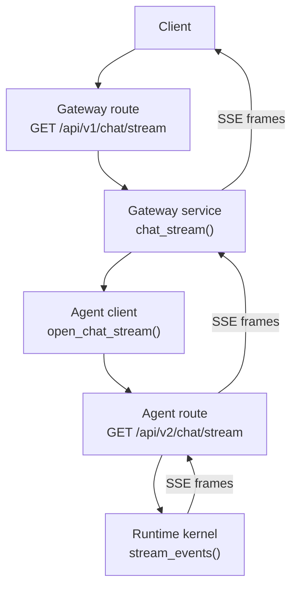
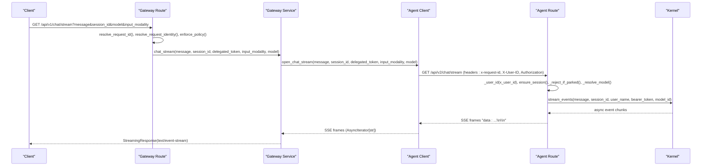
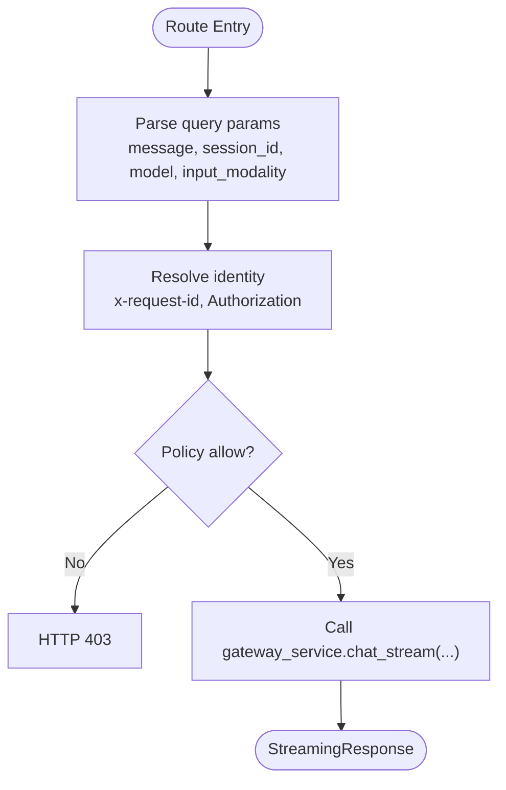
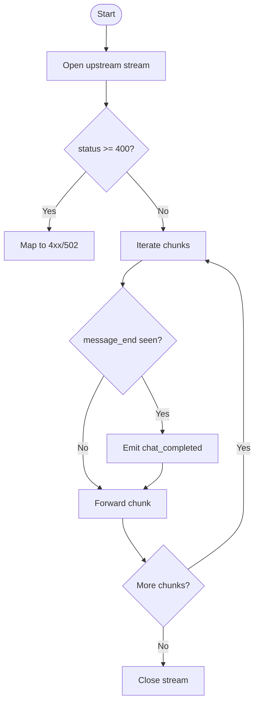
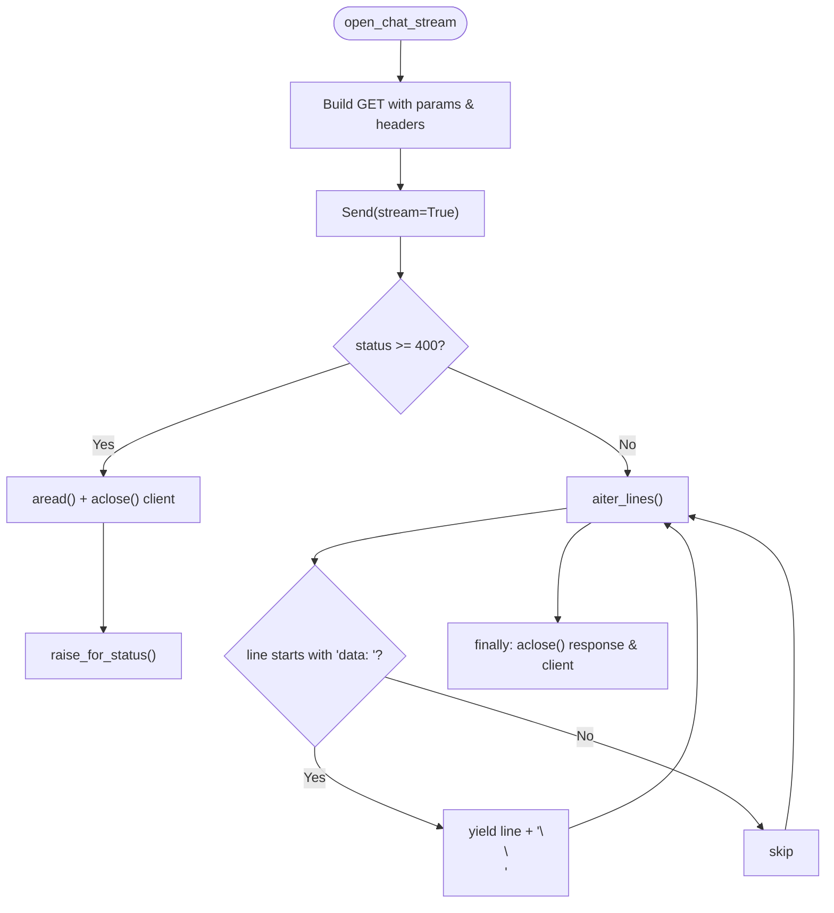
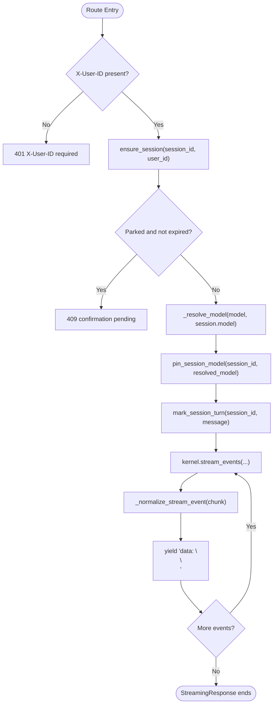
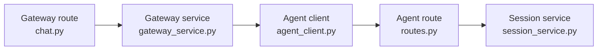

# SSE Connection Lifecycle

<cite>
**Referenced Files in This Document**
- [chat.py](file://products/platform-gateway/src/platform_gateway/api/routes/chat.py)
- [gateway_service.py](file://products/platform-gateway/src/platform_gateway/services/gateway_service.py)
- [agent_client.py](file://products/platform-gateway/src/platform_gateway/services/agent_client.py)
- [routes.py](file://products/agent-platform/src/agent_service/api/v2/routes.py)
- [session_service.py](file://products/agent-platform/src/agent_service/services/session_service.py)
</cite>

## Table of Contents
1. Introduction
2. Project Structure
3. Core Components
4. Architecture Overview
5. Detailed Component Analysis
6. Dependency Analysis
7. Performance Considerations
8. Troubleshooting Guide
9. Conclusion

## Introduction
This document explains the full Server-Sent Events (SSE) connection lifecycle for the streaming chat endpoint GET /api/v2/chat/stream. It covers request entry, authentication and header handling, session establishment and validation, model resolution, SSE frame formatting, streaming setup, error handling, client disconnection behavior, and resource cleanup across the platform gateway and agent service layers.

## Project Structure
The streaming chat path spans two services:
- Platform gateway: receives the client request, authenticates, enforces policy, proxies to the agent service, and streams SSE frames back to the client.
- Agent service: owns the v2 contract, resolves sessions and models, and emits normalized SSE events from the runtime kernel.

**Diagram sources**
- [chat.py:96-155](file://products/platform-gateway/src/platform_gateway/api/routes/chat.py#L96-L155)
- [gateway_service.py:916-1001](file://products/platform-gateway/src/platform_gateway/services/gateway_service.py#L916-L1001)
- [agent_client.py:161-222](file://products/platform-gateway/src/platform_gateway/services/agent_client.py#L161-L222)
- [routes.py:320-365](file://products/agent-platform/src/agent_service/api/v2/routes.py#L320-L365)

**Section sources**
- [chat.py:96-155](file://products/platform-gateway/src/platform_gateway/api/routes/chat.py#L96-L155)
- [gateway_service.py:916-1001](file://products/platform-gateway/src/platform_gateway/services/gateway_service.py#L916-L1001)
- [agent_client.py:161-222](file://products/platform-gateway/src/platform_gateway/services/agent_client.py#L161-L222)
- [routes.py:320-365](file://products/agent-platform/src/agent_service/api/v2/routes.py#L320-L365)

## Core Components
- Gateway route handler: parses query parameters, resolves identity, enforces policy, extracts forwarded bearer token, logs and audits stream start, and delegates to the gateway service.
- Gateway service proxy: opens a streaming HTTP connection to the agent service, checks upstream status eagerly, tee-streams SSE frames, and emits completion audit when available.
- Agent client: builds the GET request with headers and query parameters, validates upstream status before yielding any frames, and returns an AsyncIterator[str] that yields properly terminated SSE lines.
- Agent service v2 route: validates identity, ensures or creates the session, rejects parked sessions, resolves the model, pins the resolved model on the session, marks the turn, and returns a StreamingResponse over text/event-stream.

Key responsibilities by layer:
- Authentication and authorization:
  - Gateway verifies or synthesizes identity and enforces policy before proxying.
  - Agent service requires X-User-ID; missing header results in 401.
- Headers:
  - Gateway forwards x-request-id, X-User-ID, and Authorization Bearer (delegated token) to the agent service.
- Session:
  - Agent service ensures or creates a session for the user and guards against parked confirmations.
- Model resolution:
  - Agent service resolves model using request > pinned > default, validating against the catalog and normalizing to concrete entries.
- SSE framing:
  - Both agent and gateway emit frames as data: JSON\n\n and set media_type text/event-stream.

**Section sources**
- [chat.py:26-34](file://products/platform-gateway/src/platform_gateway/api/routes/chat.py#L26-L34)
- [chat.py:96-155](file://products/platform-gateway/src/platform_gateway/api/routes/chat.py#L96-L155)
- [gateway_service.py:204-264](file://products/platform-gateway/src/platform_gateway/services/gateway_service.py#L204-L264)
- [gateway_service.py:267-300](file://products/platform-gateway/src/platform_gateway/services/gateway_service.py#L267-L300)
- [agent_client.py:16-29](file://products/platform-gateway/src/platform_gateway/services/agent_client.py#L16-L29)
- [agent_client.py:161-222](file://products/platform-gateway/src/platform_gateway/services/agent_client.py#L161-L222)
- [routes.py:144-157](file://products/agent-platform/src/agent_service/api/v2/routes.py#L144-L157)
- [routes.py:246-270](file://products/agent-platform/src/agent_service/api/v2/routes.py#L246-L270)
- [routes.py:320-365](file://products/agent-platform/src/agent_service/api/v2/routes.py#L320-L365)
- [session_service.py:97-113](file://products/agent-platform/src/agent_service/services/session_service.py#L97-L113)
- [session_service.py:186-200](file://products/agent-platform/src/agent_service/services/session_service.py#L186-L200)

## Architecture Overview
End-to-end flow for GET /api/v2/chat/stream:

**Diagram sources**
- [chat.py:96-155](file://products/platform-gateway/src/platform_gateway/api/routes/chat.py#L96-L155)
- [gateway_service.py:916-1001](file://products/platform-gateway/src/platform_gateway/services/gateway_service.py#L916-L1001)
- [agent_client.py:161-222](file://products/platform-gateway/src/platform_gateway/services/agent_client.py#L161-L222)
- [routes.py:320-365](file://products/agent-platform/src/agent_service/api/v2/routes.py#L320-L365)

## Detailed Component Analysis

### Gateway Route: GET /api/v1/chat/stream
- Extracts query parameters message, session_id, model, input_modality.
- Resolves request id, identity, and enforces policy.
- Extracts forwarded Authorization bearer token via a helper that parses scheme and token.
- Emits start-time audit and structured log including input_modality and requested model.
- Delegates to gateway_service.chat_stream with all parameters.

**Diagram sources**
- [chat.py:96-155](file://products/platform-gateway/src/platform_gateway/api/routes/chat.py#L96-L155)

**Section sources**
- [chat.py:26-34](file://products/platform-gateway/src/platform_gateway/api/routes/chat.py#L26-L34)
- [chat.py:96-155](file://products/platform-gateway/src/platform_gateway/api/routes/chat.py#L96-L155)

### Gateway Service Proxy: chat_stream()
- Opens upstream stream via agent_client.open_chat_stream.
- Eagerly checks upstream status before committing response; 4xx pass through, transport/5xx map to 502.
- Tees the upstream iterator:
  - Emits chat_completed audit once a message_end frame is seen, otherwise at stream end if deltas were observed and not parked.
  - Forwards each SSE line unchanged.
- Returns StreamingResponse with media_type text/event-stream.

**Diagram sources**
- [gateway_service.py:916-1001](file://products/platform-gateway/src/platform_gateway/services/gateway_service.py#L916-L1001)

**Section sources**
- [gateway_service.py:916-1001](file://products/platform-gateway/src/platform_gateway/services/gateway_service.py#L916-L1001)

### Agent Client: open_chat_stream()
- Builds GET /api/v2/chat/stream with query params message, session_id, input_modality, and optional model.
- Adds headers x-request-id, X-User-ID, and optional Authorization Bearer (delegated token).
- Sends request with stream=True; if status >= 400, reads body to release connection, closes response and client, then raises.
- Returns an AsyncIterator[str] that yields only lines starting with "data: ", appending "\n\n" to satisfy SSE framing.
- Guarantees cleanup in finally blocks even on iteration errors or client disconnect.

**Diagram sources**
- [agent_client.py:161-222](file://products/platform-gateway/src/platform_gateway/services/agent_client.py#L161-L222)

**Section sources**
- [agent_client.py:16-29](file://products/platform-gateway/src/platform_gateway/services/agent_client.py#L16-L29)
- [agent_client.py:161-222](file://products/platform-gateway/src/platform_gateway/services/agent_client.py#L161-L222)

### Agent Service v2 Route: GET /api/v2/chat/stream
- Identity: requires X-User-ID; missing header returns 401.
- Session: ensures or creates a session for the user; unknown or foreign sessions return 404.
- Parked guard: rejects new turns while a confirmation is pending unless expired; expired parks are interrupted using the same model ladder.
- Model resolution: request > pinned > default; unknown ids fail closed with 422; pinned entries are validated against the catalog and normalized.
- Turn bookkeeping: marks session turn and pins the resolved model.
- Streaming: iterates kernel.stream_events, normalizes each chunk into a contract-conformant event, and yields "data: <json>\n\n".
- Response: StreamingResponse with media_type text/event-stream.

**Diagram sources**
- [routes.py:144-157](file://products/agent-platform/src/agent_service/api/v2/routes.py#L144-L157)
- [routes.py:202-243](file://products/agent-platform/src/agent_service/api/v2/routes.py#L202-L243)
- [routes.py:246-270](file://products/agent-platform/src/agent_service/api/v2/routes.py#L246-L270)
- [routes.py:320-365](file://products/agent-platform/src/agent_service/api/v2/routes.py#L320-L365)

**Section sources**
- [routes.py:144-157](file://products/agent-platform/src/agent_service/api/v2/routes.py#L144-L157)
- [routes.py:202-243](file://products/agent-platform/src/agent_service/api/v2/routes.py#L202-L243)
- [routes.py:246-270](file://products/agent-platform/src/agent_service/api/v2/routes.py#L246-L270)
- [routes.py:320-365](file://products/agent-platform/src/agent_service/api/v2/routes.py#L320-L365)
- [session_service.py:97-113](file://products/agent-platform/src/agent_service/services/session_service.py#L97-L113)
- [session_service.py:186-200](file://products/agent-platform/src/agent_service/services/session_service.py#L186-L200)

### Request Parameters and Contract
- Query parameters:
  - message: required string.
  - session_id: optional; used to resume or create within ownership rules.
  - model: optional; per-turn override, validated against the credential-gated catalog.
  - input_modality: optional; metadata-only value "text" or "voice", passed verbatim.
- Headers:
  - X-User-ID: required on agent-service route; enforced there.
  - Authorization: optional; forwarded as Bearer token for tool calls.
  - x-request-id: propagated end-to-end for tracing.

**Section sources**
- [agent_client.py:16-29](file://products/platform-gateway/src/platform_gateway/services/agent_client.py#L16-L29)
- [agent_client.py:179-197](file://products/platform-gateway/src/platform_gateway/services/agent_client.py#L179-L197)
- [routes.py:320-333](file://products/agent-platform/src/agent_service/api/v2/routes.py#L320-L333)

### SSE Frame Format and Media Type
- Media type: text/event-stream on both gateway and agent responses.
- Frame format: each event is emitted as a single line prefixed with "data: " followed by a JSON payload, terminated by a double newline ("\n\n").
- The agent normalizes raw kernel chunks into contract-conformant events before emitting.
- The gateway passes through frames unchanged after opening the upstream stream.

**Section sources**
- [routes.py:353-365](file://products/agent-platform/src/agent_service/api/v2/routes.py#L353-L365)
- [agent_client.py:213-222](file://products/platform-gateway/src/platform_gateway/services/agent_client.py#L213-L222)
- [gateway_service.py:967-1001](file://products/platform-gateway/src/platform_gateway/services/gateway_service.py#L967-L1001)

### Error Handling and Disconnection Scenarios
- Missing X-User-ID on agent route: 401 with explicit detail.
- Unknown or foreign session: 404.
- Parked confirmation blocking a new turn: 409 until resolved or expired.
- Unknown model id: 422 fail-closed before headers go out.
- Upstream 4xx/5xx during stream open:
  - Gateway checks status eagerly; 4xx pass through, transport/5xx mapped to 502.
  - Agent client reads error body to release connection, then closes response and client before raising.
- Client disconnect or generator cancellation:
  - Agent client uses try/finally around iteration to close response and client.
  - Gateway service wraps its own iterator to ensure resources are released when the stream ends or is aborted.

**Section sources**
- [routes.py:144-157](file://products/agent-platform/src/agent_service/api/v2/routes.py#L144-L157)
- [routes.py:202-243](file://products/agent-platform/src/agent_service/api/v2/routes.py#L202-L243)
- [routes.py:246-270](file://products/agent-platform/src/agent_service/api/v2/routes.py#L246-L270)
- [agent_client.py:191-222](file://products/platform-gateway/src/platform_gateway/services/agent_client.py#L191-L222)
- [gateway_service.py:936-960](file://products/platform-gateway/src/platform_gateway/services/gateway_service.py#L936-L960)

### Resource Cleanup Patterns
- Agent client:
  - Ensures httpx.AsyncClient and Response are closed in finally blocks whether iteration completes normally or fails early.
- Gateway service:
  - Wraps upstream iterator in a local generator that yields chunks and performs teardown on completion or exception.
- Agent route:
  - StreamingResponse consumes the generator; FastAPI tears down the underlying ASGI pipeline when the client disconnects.

**Section sources**
- [agent_client.py:213-222](file://products/platform-gateway/src/platform_gateway/services/agent_client.py#L213-L222)
- [gateway_service.py:967-1001](file://products/platform-gateway/src/platform_gateway/services/gateway_service.py#L967-L1001)
- [routes.py:353-365](file://products/agent-platform/src/agent_service/api/v2/routes.py#L353-L365)

## Dependency Analysis

**Diagram sources**
- [chat.py:96-155](file://products/platform-gateway/src/platform_gateway/api/routes/chat.py#L96-L155)
- [gateway_service.py:916-1001](file://products/platform-gateway/src/platform_gateway/services/gateway_service.py#L916-L1001)
- [agent_client.py:161-222](file://products/platform-gateway/src/platform_gateway/services/agent_client.py#L161-L222)
- [routes.py:320-365](file://products/agent-platform/src/agent_service/api/v2/routes.py#L320-L365)
- [session_service.py:97-113](file://products/agent-platform/src/agent_service/services/session_service.py#L97-L113)

**Section sources**
- [chat.py:96-155](file://products/platform-gateway/src/platform_gateway/api/routes/chat.py#L96-L155)
- [gateway_service.py:916-1001](file://products/platform-gateway/src/platform_gateway/services/gateway_service.py#L916-L1001)
- [agent_client.py:161-222](file://products/platform-gateway/src/platform_gateway/services/agent_client.py#L161-L222)
- [routes.py:320-365](file://products/agent-platform/src/agent_service/api/v2/routes.py#L320-L365)
- [session_service.py:97-113](file://products/agent-platform/src/agent_service/services/session_service.py#L97-L113)

## Performance Considerations
- Eager upstream status check prevents committing a 200 response for error bodies, avoiding wasted bandwidth and client confusion.
- Streaming avoids buffering entire responses; frames are forwarded as they arrive.
- Model resolution happens before streaming begins to fail fast on invalid models.
- Session operations are lightweight lookups or creations; model pinning is best-effort and does not block the turn.

[No sources needed since this section provides general guidance]

## Troubleshooting Guide
Common issues and where to inspect:
- 401 missing X-User-ID: occurs in the agent service route identity guard.
- 404 unknown or foreign session: returned by session ensure/get paths.
- 409 parked confirmation: returned when a non-expired confirmation blocks a new turn.
- 422 unknown model: raised during model resolution before headers are sent.
- 502 upstream unavailable: raised by gateway when agent client transport or upstream 5xx occurs.
- Empty stream without completion: handled by auditing fallback to requested model when no message_end arrives but deltas were observed.

Remediation tips:
- Ensure Authorization Bearer is present when delegated tokens are required.
- Verify session_id belongs to the authenticated user.
- Confirm model id exists in the credential-gated catalog.
- If encountering repeated 409, wait for the parked confirmation to expire or resolve it via the confirm endpoint.

**Section sources**
- [routes.py:144-157](file://products/agent-platform/src/agent_service/api/v2/routes.py#L144-L157)
- [routes.py:202-243](file://products/agent-platform/src/agent_service/api/v2/routes.py#L202-L243)
- [routes.py:246-270](file://products/agent-platform/src/agent_service/api/v2/routes.py#L246-L270)
- [gateway_service.py:936-960](file://products/platform-gateway/src/platform_gateway/services/gateway_service.py#L936-L960)

## Conclusion
The SSE streaming chat endpoint follows a clear, layered design: the gateway authenticates and enforces policy, proxies to the agent service with proper headers and query parameters, and streams normalized SSE frames back to the client. The agent service owns the v2 contract, ensuring sessions, rejecting parked turns, resolving models, and emitting well-formed SSE frames. Robust error handling and resource cleanup ensure failures surface as appropriate HTTP statuses and connections are always released, even on client disconnects.