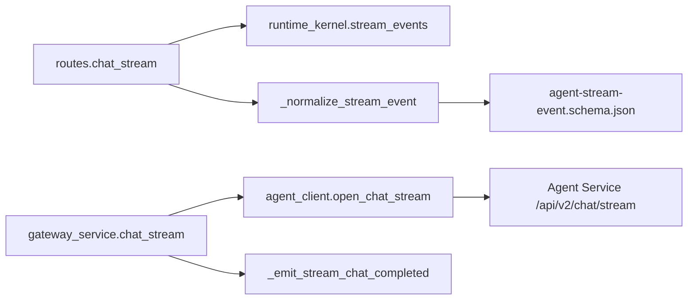
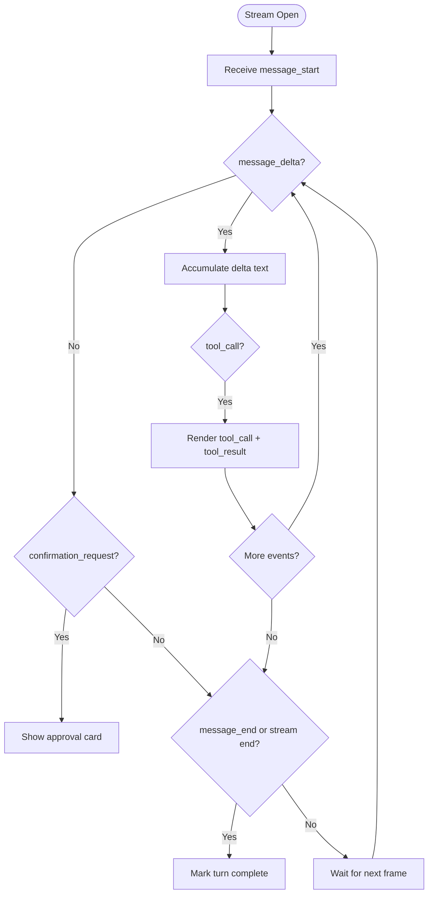

# Streaming Chat

<cite>
**Referenced Files in This Document**
- [routes.py](file://products/agent-platform/src/agent_service/api/v2/routes.py)
- [runtime_kernel.py](file://products/agent-platform/src/agent_service/runtime_kernel.py)
- [gateway_service.py](file://products/platform-gateway/src/platform_gateway/services/gateway_service.py)
- [agent_client.py](file://products/platform-gateway/src/platform_gateway/services/agent_client.py)
- [stream-event.schema.json](file://shared/shared-contracts/schemas/stream-event.schema.json)
- [agent-stream-event.schema.json](file://shared/shared-contracts/schemas/agent-stream-event.schema.json)
- [transport.ts](file://products/operator-portal/web-ui/app/src/stream/transport.ts)
- [decoder.ts](file://products/operator-portal/web-ui/app/src/stream/decoder.ts)
- [useChatStream.ts](file://products/operator-portal/web-ui/app/src/stream/useChatStream.ts)
</cite>

## Table of Contents
1. [Introduction](#introduction)
2. [Project Structure](#project-structure)
3. [Core Components](#core-components)
4. [Architecture Overview](#architecture-overview)
5. [Detailed Component Analysis](#detailed-component-analysis)
6. [Dependency Analysis](#dependency-analysis)
7. [Performance Considerations](#performance-considerations)
8. [Troubleshooting Guide](#troubleshooting-guide)
9. [Conclusion](#conclusion)
10. [Appendices](#appendices)

## Introduction
This document provides comprehensive API documentation for the streaming chat endpoint GET /api/v2/chat/stream using Server-Sent Events (SSE). It covers event types, connection handling, serialization format, streaming lifecycle, real-time client patterns, model resolution, session management, bearer token forwarding, policy enforcement, and audit logging across the stream lifecycle.

## Project Structure
The streaming chat surface spans three layers:
- Platform Gateway: authenticates, enforces policy, proxies SSE to the agent service, and emits completion audit events.
- Agent Service: owns sessions, resolves models, runs the runtime kernel, normalizes events, and streams them back as SSE frames.
- Operator Portal Client: opens an HTTP GET with SSE, decodes data blocks, and renders incremental UI updates.

```mermaid
graph TB
Client["Operator Portal Client"]
Gateway["Platform Gateway"]
Agent["Agent Service"]
Kernel["Runtime Kernel"]
Audit["Audit Emitter"]
Client --> |GET /api/v2/chat/stream<br/>SSE text/event-stream| Gateway
Gateway --> |HTTP GET /api/v2/chat/stream| Agent
Agent --> |stream_events()| Kernel
Kernel --> |tool_call/tool_result/message_*| Agent
Agent --> |data: JSON\\n\\n| Gateway
Gateway --> |data: JSON\\n\\n| Client
Gateway -.->|chat_completed| Audit
```

**Diagram sources**
- [gateway_service.py:916-1001](file://products/platform-gateway/src/platform_gateway/services/gateway_service.py#L916-L1001)
- [agent_client.py:170-222](file://products/platform-gateway/src/platform_gateway/services/agent_client.py#L170-L222)
- [routes.py:321-365](file://products/agent-platform/src/agent_service/api/v2/routes.py#L321-L365)
- [runtime_kernel.py:212-774](file://products/agent-platform/src/agent_service/runtime_kernel.py#L212-L774)

**Section sources**
- [gateway_service.py:916-1001](file://products/platform-gateway/src/platform_gateway/services/gateway_service.py#L916-L1001)
- [agent_client.py:170-222](file://products/platform-gateway/src/platform_gateway/services/agent_client.py#L170-L222)
- [routes.py:321-365](file://products/agent-platform/src/agent_service/api/v2/routes.py#L321-L365)
- [runtime_kernel.py:212-774](file://products/agent-platform/src/agent_service/runtime_kernel.py#L212-L774)

## Core Components
- GET /api/v2/chat/stream (Agent Service): Accepts message, optional session_id, optional per-turn model, input_modality metadata, and required user identity headers. Returns an SSE stream of normalized events.
- Platform Gateway proxy: Authenticates, forwards request, checks upstream status eagerly, relays SSE frames, and emits a single chat_completed audit event per turn.
- Runtime Kernel: Builds or reuses agents, manages toolkits, evidence, HITL parks, prose redaction, and produces the raw event stream consumed by the route.
- Client transport and decoder: Opens fetch with auth headers, reads byte chunks, splits on "\n\n", parses "data: ..." blocks, and maps frame types into UI-friendly structures.

Key responsibilities:
- Model resolution: request > pinned > default; unknown ids fail closed with 422 before headers are sent.
- Session management: ensure/pin session, reject new turns while parked until resolved or expired.
- Bearer token forwarding: Authorization header is parsed and forwarded to downstream tool discovery and execution contexts.
- Policy enforcement and audit: gateway tee emits chat_completed with serving model after message_end or at stream end when deltas were observed.

**Section sources**
- [routes.py:321-365](file://products/agent-platform/src/agent_service/api/v2/routes.py#L321-L365)
- [routes.py:202-270](file://products/agent-platform/src/agent_service/api/v2/routes.py#L202-L270)
- [gateway_service.py:916-1001](file://products/platform-gateway/src/platform_gateway/services/gateway_service.py#L916-L1001)
- [agent_client.py:170-222](file://products/platform-gateway/src/platform_gateway/services/agent_client.py#L170-L222)
- [runtime_kernel.py:293-338](file://products/agent-platform/src/agent_service/runtime_kernel.py#L293-L338)
- [runtime_kernel.py:340-450](file://products/agent-platform/src/agent_service/runtime_kernel.py#L340-L450)

## Architecture Overview
The streaming chat flow proceeds through authentication, model/session setup, kernel execution, and SSE relay with audit emission.

```mermaid
sequenceDiagram
participant C as "Client"
participant G as "Platform Gateway"
participant A as "Agent Service"
participant K as "Runtime Kernel"
participant AU as "Audit Emitter"
C->>G : GET /api/v2/chat/stream?message=...&session_id=&model=&input_modality=
G->>A : GET /api/v2/chat/stream (headers include X-User-ID, X-Request-ID, Authorization)
A->>A : ensure_session(), _reject_if_parked(), _resolve_model()
A->>K : stream_events(message, session_id, user_name, bearer_token, model_id)
loop Stream frames
K-->>A : raw event chunk
A-->>G : data : {type, ...}\\n\\n
G-->>C : data : {type, ...}\\n\\n
end
G->>AU : emit chat_completed with serving model
Note over G,A : 4xx from upstream returned immediately; 5xx mapped to 502
```

**Diagram sources**
- [gateway_service.py:916-1001](file://products/platform-gateway/src/platform_gateway/services/gateway_service.py#L916-L1001)
- [agent_client.py:170-222](file://products/platform-gateway/src/platform_gateway/services/agent_client.py#L170-L222)
- [routes.py:321-365](file://products/agent-platform/src/agent_service/api/v2/routes.py#L321-L365)
- [runtime_kernel.py:293-338](file://products/agent-platform/src/agent_service/runtime_kernel.py#L293-L338)

## Detailed Component Analysis

### Endpoint: GET /api/v2/chat/stream
- Query parameters:
  - message (required): user prompt text.
  - session_id (optional): existing session or null to auto-create on first message.
  - model (optional): per-turn model id; validated against catalog; unknown ids return 422.
  - input_modality (optional): "text" or "voice"; metadata only, does not affect policy or HITL outcomes.
- Required headers:
  - X-User-ID: identifies the caller; missing returns 401.
  - X-Request-ID: correlation id used throughout the stream and audit.
  - Authorization: optional Bearer token forwarded to tool discovery and execution contexts.
- Response:
  - Content-Type: text/event-stream
  - Body: lines of the form "data: <JSON>\n\n" where JSON conforms to the agent stream event schema.

Model resolution and session gating:
- Unknown session ids are rejected early by upstream mapping.
- If a confirmation is parked for the session, new turns are rejected with 409 until resolved or expired.
- Per-turn model selection uses request > pinned > default; unknown ids fail closed with 422 before headers go out.

Event normalization:
- Raw kernel events are normalized to the contract schema, preserving tool_call/tool_result payloads and ensuring safe defaults for unrecognized fields.

**Section sources**
- [routes.py:321-365](file://products/agent-platform/src/agent_service/api/v2/routes.py#L321-L365)
- [routes.py:202-270](file://products/agent-platform/src/agent_service/api/v2/routes.py#L202-L270)
- [routes.py:598-653](file://products/agent-platform/src/agent_service/api/v2/routes.py#L598-L653)

### Event Types and Serialization
All events are serialized as SSE data blocks:
- Line format: data: <JSON>\n\n
- Schema: agent-stream-event.schema.json defines the full vocabulary including message_start, message_delta, message_end, error, tool_call, tool_result, confirmation_request, confirmation_result.

Event semantics:
- message_start: indicates turn initiation.
- message_delta: incremental content updates; clients accumulate delta text.
- message_end: terminal frame carrying model id that resolved for the turn; used for attribution and completion.
- tool_call: invocation with tool_name, call_id, and parameters.
- tool_result: outcome with status (success/error/denied/approved/expired/interrupted), evidence, optional data_summary, and optional full data within size caps.
- confirmation_request: human-in-the-loop approval with pending_calls, optional flow_summary, and approval_kind; may also carry a permission message.
- confirmation_result: echoes pending_calls and carries decision status.
- error: failure details with code and message.

Legacy compatibility:
- The older stream-event.schema.json enumerates a subset of event types; the agent platform emits the richer agent-stream-event schema.

**Section sources**
- [agent-stream-event.schema.json:1-160](file://shared/shared-contracts/schemas/agent-stream-event.schema.json#L1-L160)
- [stream-event.schema.json:1-27](file://shared/shared-contracts/schemas/stream-event.schema.json#L1-L27)
- [routes.py:598-653](file://products/agent-platform/src/agent_service/api/v2/routes.py#L598-L653)

### SSE Connection Handling and Streaming Lifecycle
Gateway proxy behavior:
- Establishes an HTTP GET to the agent service with streaming enabled.
- Checks upstream status eagerly; 4xx errors are passed through unchanged; 5xx or transport failures map to 502.
- Relays each "data: ..." line verbatim to the client.
- Emits a single chat_completed audit event per turn:
  - On message_end frame if present.
  - At stream end if deltas were seen and no confirmation_request was encountered (parked turns remain unattributed until resolved).

Agent service behavior:
- Ensures session, rejects parked sessions, resolves model, pins session model, marks turn, extracts bearer token, and streams events from the kernel.
- Normalizes each event to the contract schema before emitting.

Kernel behavior:
- Builds or reuses agents per session, caches toolkits per delegated token, applies middlewares (permission, evidence), persists evidence best-effort, and flushes held-back prose tails at stream exits.

**Section sources**
- [agent_client.py:170-222](file://products/platform-gateway/src/platform_gateway/services/agent_client.py#L170-L222)
- [gateway_service.py:916-1001](file://products/platform-gateway/src/platform_gateway/services/gateway_service.py#L916-L1001)
- [gateway_service.py:1238-1316](file://products/platform-gateway/src/platform_gateway/services/gateway_service.py#L1238-L1316)
- [routes.py:321-365](file://products/agent-platform/src/agent_service/api/v2/routes.py#L321-L365)
- [runtime_kernel.py:340-450](file://products/agent-platform/src/agent_service/runtime_kernel.py#L340-L450)
- [runtime_kernel.py:627-660](file://products/agent-platform/src/agent_service/runtime_kernel.py#L627-L660)

### Real-Time Client Implementation Patterns
Transport:
- Uses fetch with method GET, includes x-request-id and auth headers, and throws StreamOpenError on non-OK responses, capturing structured detail when available.
- Reads response body as ReadableStream, iterates chunks, and feeds them to the decoder.

Decoder:
- Splits incoming text on "\n\n" boundaries and parses "data: ..." blocks.
- Skips non-data lines and malformed JSON without aborting the stream.
- Maps frame types to UI-friendly structures for delta accumulation, tool calls/results, and confirmation requests.

Lifecycle hooks:
- Marks turns completed when message_end arrives or when the stream closes after deltas (legacy parity).
- Handles stale session pointers by retrying with server-side auto-creation on 404.
- Supports abort signals to tear down streams cleanly on session switches.

**Section sources**
- [transport.ts:88-164](file://products/operator-portal/web-ui/app/src/stream/transport.ts#L88-L164)
- [decoder.ts:204-250](file://products/operator-portal/web-ui/app/src/stream/decoder.ts#L204-L250)
- [useChatStream.ts:276-312](file://products/operator-portal/web-ui/app/src/stream/useChatStream.ts#L276-L312)

### Error Handling and Recovery
- Authentication and identity:
  - Missing X-User-ID returns 401.
  - Malformed Authorization header is ignored for bearer extraction; downstream services enforce token validity.
- Upstream errors:
  - 4xx from agent service are surfaced unchanged (e.g., unknown session, parked conflict, unknown model).
  - Transport or 5xx errors map to 502.
- Confirmation conflicts:
  - Parked sessions reject new turns with 409 until resolved or expired.
  - Already-resolved confirmations return structured 409 detail for client reconciliation.
- Stream anomalies:
  - Decoder ignores malformed JSON and non-data blocks.
  - Trailing partial blocks are dropped to preserve stream integrity.

**Section sources**
- [routes.py:144-157](file://products/agent-platform/src/agent_service/api/v2/routes.py#L144-L157)
- [routes.py:202-270](file://products/agent-platform/src/agent_service/api/v2/routes.py#L202-L270)
- [gateway_service.py:916-1001](file://products/platform-gateway/src/platform_gateway/services/gateway_service.py#L916-L1001)
- [transport.ts:108-164](file://products/operator-portal/web-ui/app/src/stream/transport.ts#L108-L164)
- [decoder.ts:204-250](file://products/operator-portal/web-ui/app/src/stream/decoder.ts#L204-L250)

### Model Resolution, Session Management, and Bearer Token Forwarding
- Model resolution:
  - Request > pinned > default; unknown ids fail closed with 422.
  - Pinned model is honored while present in the catalog; otherwise degrades to default.
- Session management:
  - ensure_session creates or validates session; pin_session_model stores resolved model for subsequent turns.
  - mark_session_turn records user message ordinal for evidence indexing.
- Bearer token forwarding:
  - Authorization header is parsed; if scheme is Bearer and token exists, it is forwarded to toolkit discovery and execution contexts.
  - Toolkit caching is per delegated token so discovery runs once per token; tool closures read current token at call time.

**Section sources**
- [routes.py:246-270](file://products/agent-platform/src/agent_service/api/v2/routes.py#L246-L270)
- [routes.py:150-157](file://products/agent-platform/src/agent_service/api/v2/routes.py#L150-L157)
- [runtime_kernel.py:293-338](file://products/agent-platform/src/agent_service/runtime_kernel.py#L293-L338)
- [runtime_kernel.py:340-450](file://products/agent-platform/src/agent_service/runtime_kernel.py#L340-L450)

### Integration with Policy Enforcement and Audit Logging
- Policy enforcement:
  - Kernel middleware enforces gateway permissions and tool evidence capture during execution.
  - HITL bridging can exclude mutating tools when disabled; this posture is reflected in streamed notices.
- Audit logging:
  - Gateway emits chat_completed once per turn with input_modality and serving model.
  - Serving model is taken from message_end frame when present; otherwise falls back to requested model.
  - Evidence persistence is best-effort and bounded by configuration.

**Section sources**
- [runtime_kernel.py:462-496](file://products/agent-platform/src/agent_service/runtime_kernel.py#L462-L496)
- [runtime_kernel.py:627-660](file://products/agent-platform/src/agent_service/runtime_kernel.py#L627-L660)
- [gateway_service.py:1238-1316](file://products/platform-gateway/src/platform_gateway/services/gateway_service.py#L1238-L1316)

## Dependency Analysis


**Diagram sources**
- [routes.py:321-365](file://products/agent-platform/src/agent_service/api/v2/routes.py#L321-L365)
- [routes.py:598-653](file://products/agent-platform/src/agent_service/api/v2/routes.py#L598-L653)
- [gateway_service.py:916-1001](file://products/platform-gateway/src/platform_gateway/services/gateway_service.py#L916-L1001)
- [agent_client.py:170-222](file://products/platform-gateway/src/platform_gateway/services/agent_client.py#L170-L222)
- [agent-stream-event.schema.json:1-160](file://shared/shared-contracts/schemas/agent-stream-event.schema.json#L1-L160)

**Section sources**
- [routes.py:321-365](file://products/agent-platform/src/agent_service/api/v2/routes.py#L321-L365)
- [gateway_service.py:916-1001](file://products/platform-gateway/src/platform_gateway/services/gateway_service.py#L916-L1001)
- [agent_client.py:170-222](file://products/platform-gateway/src/platform_gateway/services/agent_client.py#L170-L222)

## Performance Considerations
- Streaming latency:
  - SSE frames are relayed line-by-line; avoid buffering large payloads.
  - Tool result data is capped to stay within stream limits; data_summary is provided for UI rendering.
- Memory usage:
  - Agent state snapshots are persisted best-effort; corrupt states are discarded safely.
  - Toolkit caching per delegated token reduces repeated discovery overhead.
- Throughput:
  - Parallelism is constrained by per-session agent locks to prevent memory duplication and race conditions.
  - Prose redaction flushes held-back tails at stream exits to avoid UI lag.

[No sources needed since this section provides general guidance]

## Troubleshooting Guide
Common issues and resolutions:
- 401 Unauthorized:
  - Ensure X-User-ID is present and Authorization header is valid when required.
- 409 Conflict:
  - New turns are blocked while a confirmation is parked; resolve or wait for expiry.
- 422 Unknown Model:
  - Per-turn model must exist in the credential-gated catalog; remove or correct the model parameter.
- 502 Bad Gateway:
  - Upstream agent service unavailable or returned 5xx; check agent-service health and connectivity.
- Stream stalls or incomplete messages:
  - Decoder drops malformed JSON and non-data blocks; verify server emits well-formed "data: ...\\n\\n" frames.
  - If stream closes without message_end, clients should treat as completion after seeing deltas.

Recovery strategies:
- Retry on transient network errors with exponential backoff.
- On 404 for session, retry with null session_id to allow server-side auto-creation.
- For already-resolved confirmations, use structured 409 detail to reconcile UI state.

**Section sources**
- [routes.py:144-157](file://products/agent-platform/src/agent_service/api/v2/routes.py#L144-L157)
- [routes.py:202-270](file://products/agent-platform/src/agent_service/api/v2/routes.py#L202-L270)
- [gateway_service.py:916-1001](file://products/platform-gateway/src/platform_gateway/services/gateway_service.py#L916-L1001)
- [transport.ts:108-164](file://products/operator-portal/web-ui/app/src/stream/transport.ts#L108-L164)
- [decoder.ts:204-250](file://products/operator-portal/web-ui/app/src/stream/decoder.ts#L204-L250)
- [useChatStream.ts:276-312](file://products/operator-portal/web-ui/app/src/stream/useChatStream.ts#L276-L312)

## Conclusion
The GET /api/v2/chat/stream endpoint delivers a robust, auditable, and policy-enforced SSE stream for real-time chat interactions. It supports incremental content updates, tool invocations with evidence, human-in-the-loop approvals, and resilient error handling. Clients should implement robust SSE decoding, handle terminal frames and stream ends gracefully, and reconcile confirmation states using structured error details.

[No sources needed since this section summarizes without analyzing specific files]

## Appendices

### Complete Streaming Session Example
- Client opens GET /api/v2/chat/stream with message, optional session_id, optional model, and input_modality.
- Expected event sequence:
  - message_start: turn begins.
  - message_delta: one or more incremental text chunks.
  - tool_call: model invokes a tool with parameters.
  - tool_result: execution outcome with evidence and optional data_summary/data.
  - confirmation_request: if a mutating action requires approval; includes pending_calls and optional flow_summary.
  - message_end: turn completes with model id.
  - error: if any step fails; contains code and message.
- Client actions:
  - Accumulate delta text until message_end or stream close.
  - Render tool_call/tool_result pairs for evidence panels.
  - Present confirmation_request cards and await confirmation via POST /api/v2/chat/confirm.
  - Handle errors and reconnect/retry as appropriate.

[No sources needed since this section describes conceptual workflow]

### Event Sequence Handling Flowchart


[No sources needed since this diagram shows conceptual workflow]