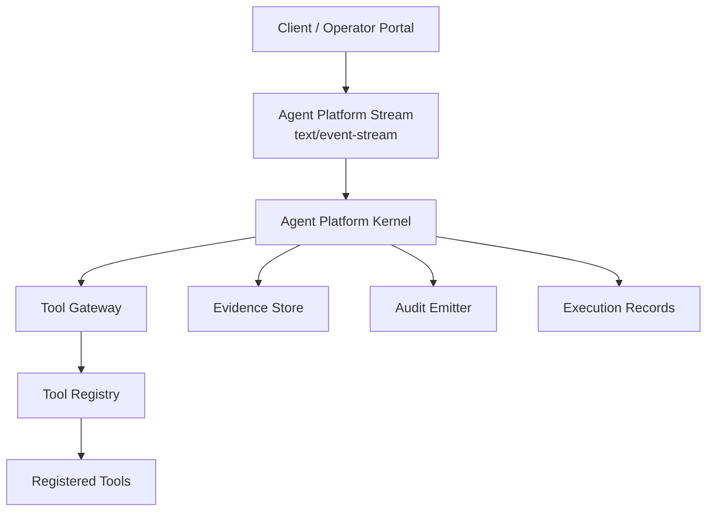
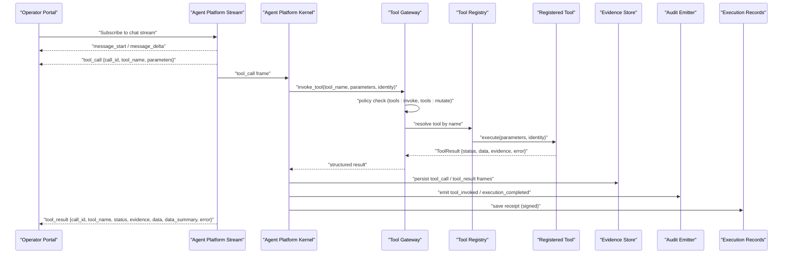
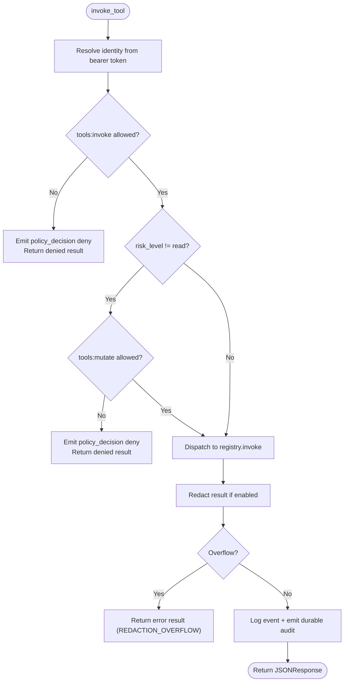
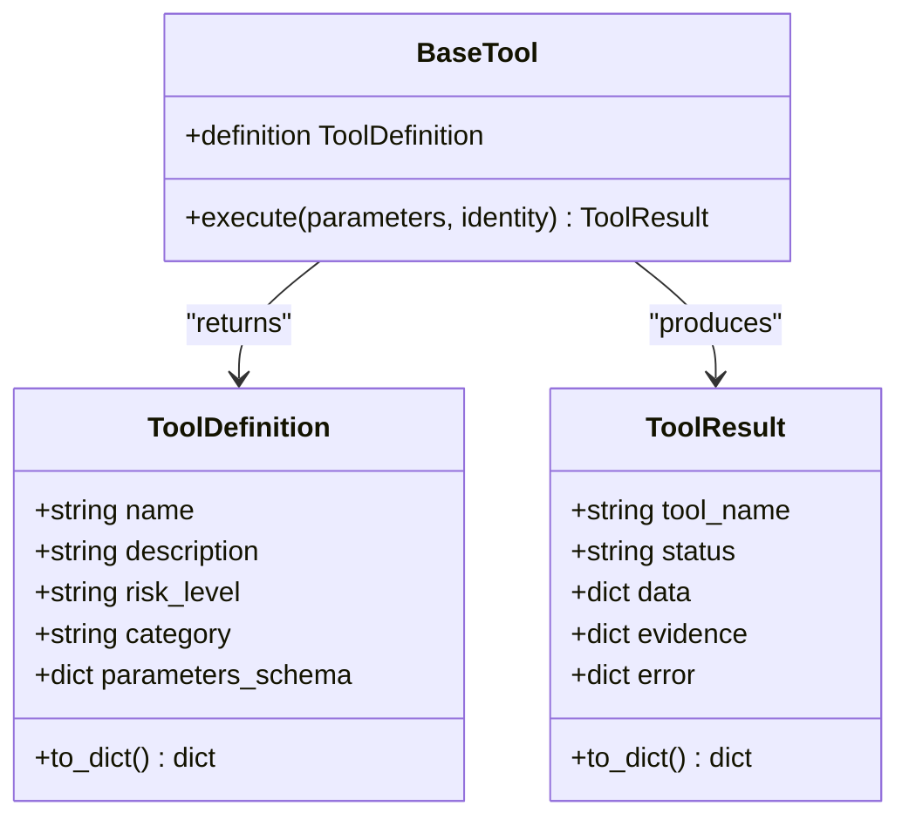
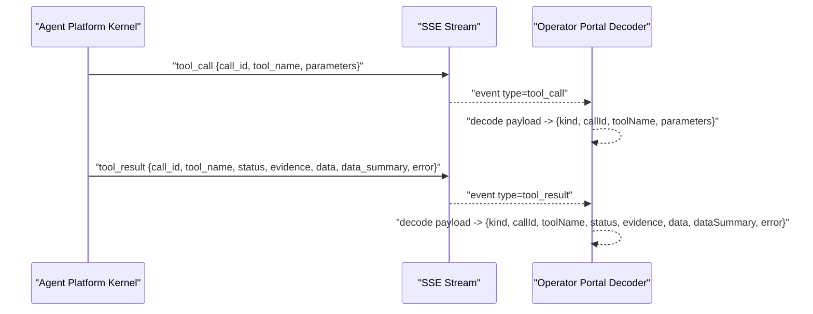
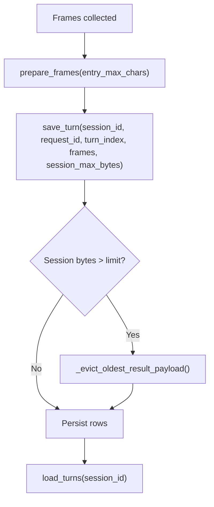
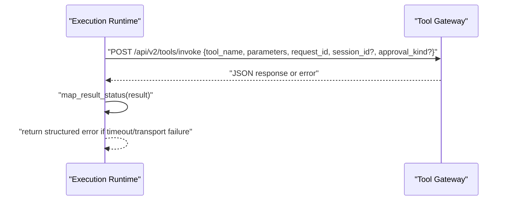
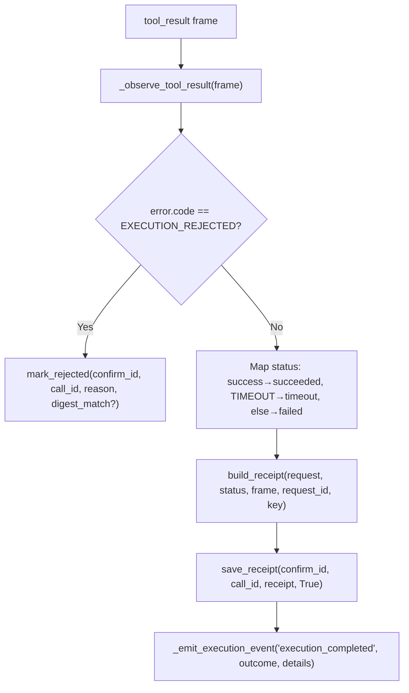
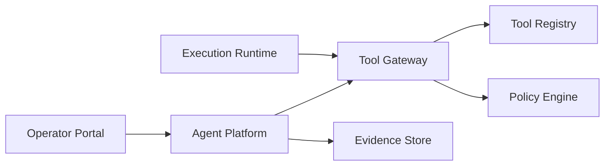

# Tool Execution Events

<cite>
**Referenced Files in This Document**
- [gateway_service.py](file://products/tool-gateway/src/tool_gateway/services/gateway_service.py)
- [base.py](file://products/tool-gateway/src/tool_gateway/tools/base.py)
- [executor.py](file://products/execution-runtime/src/execution_runtime/services/executor.py)
- [runtime_kernel.py](file://products/agent-platform/src/agent_service/runtime_kernel.py)
- [routes.py](file://products/agent-platform/src/agent_service/api/v2/routes.py)
- [evidence_store.py](file://products/agent-platform/src/agent_service/services/evidence_store.py)
- [decoder.ts](file://products/operator-portal/web-ui/app/src/stream/decoder.ts)
- [tool-invocation.schema.json](file://shared/shared-contracts/schemas/tool-invocation.schema.json)
- [tool-result.schema.json](file://shared/shared-contracts/schemas/tool-result.schema.json)
- [execution-receipt.schema.json](file://shared/shared-contracts/schemas/execution-receipt.schema.json)
</cite>

## Table of Contents
1. [Introduction](#introduction)
2. [Project Structure](#project-structure)
3. [Core Components](#core-components)
4. [Architecture Overview](#architecture-overview)
5. [Detailed Component Analysis](#detailed-component-analysis)
6. [Dependency Analysis](#dependency-analysis)
7. [Performance Considerations](#performance-considerations)
8. [Troubleshooting Guide](#troubleshooting-guide)
9. [Conclusion](#conclusion)

## Introduction
This document explains tool execution streaming events across the platform, focusing on:
- tool_call events that initiate external tool invocations with call identifiers, tool names, parameter payloads, and evidence collection metadata.
- tool_result events that report execution outcomes with status values (success, error, denied), result data summaries, and evidence attachments.
- The end-to-end lifecycle from invocation through result delivery, including policy enforcement, audit logging, parameter validation, evidence storage integration, and result serialization.
- Error handling for timeouts and transport failures, and how results feed back into the conversation flow via resumed streams and receipts.

## Project Structure
Tool execution spans several services:
- Agent Platform: orchestrates sessions, resumes streams, persists evidence frames, and emits execution audit events.
- Tool Gateway: enforces identity and policy, dispatches to registered tools, redacts sensitive output, and returns structured results.
- Execution Runtime: executes handed-off requests against the gateway with delegated tokens and maps errors to standardized shapes.
- Operator Portal: decodes server-sent events for tool_call and tool_result frames for UI rendering.
- Shared Schemas: define contracts for tool invocation, tool results, and signed execution receipts.

**Diagram sources**
- [routes.py:443-464](file://products/agent-platform/src/agent_service/api/v2/routes.py#L443-L464)
- [runtime_kernel.py:1800-1905](file://products/agent-platform/src/agent_service/runtime_kernel.py#L1800-L1905)
- [gateway_service.py:158-376](file://products/tool-gateway/src/tool_gateway/services/gateway_service.py#L158-L376)
- [evidence_store.py:118-148](file://products/agent-platform/src/agent_service/services/evidence_store.py#L118-L148)

**Section sources**
- [routes.py:1-200](file://products/agent-platform/src/agent_service/api/v2/routes.py#L1-L200)
- [gateway_service.py:1-123](file://products/tool-gateway/src/tool_gateway/services/gateway_service.py#L1-L123)

## Core Components
- Tool Invocation Contract: defines required fields like tool_name, parameters, identity_context, and request_id for correlation and audit.
- Tool Result Contract: defines outcome status (success, error, denied), structured data payload, evidence envelope (executed_at, duration_ms, risk_level, source_system), and optional error details.
- Execution Receipt Contract: signed closure of a tool execution with mapped status (succeeded, failed, timeout), outcome digest, and timestamps.

Key responsibilities:
- Policy enforcement at the tool gateway before dispatch.
- Redaction choke point to protect secrets in results and audit logs.
- Evidence persistence per session for replayable evidence cards.
- Receipt construction and audit emission upon result arrival.

**Section sources**
- [tool-invocation.schema.json:1-35](file://shared/shared-contracts/schemas/tool-invocation.schema.json#L1-L35)
- [tool-result.schema.json:1-69](file://shared/shared-contracts/schemas/tool-result.schema.json#L1-L69)
- [execution-receipt.schema.json:1-47](file://shared/shared-contracts/schemas/execution-receipt.schema.json#L1-L47)

## Architecture Overview
The tool execution lifecycle integrates multiple layers:

**Diagram sources**
- [routes.py:443-464](file://products/agent-platform/src/agent_service/api/v2/routes.py#L443-L464)
- [runtime_kernel.py:1800-1905](file://products/agent-platform/src/agent_service/runtime_kernel.py#L1800-L1905)
- [gateway_service.py:158-376](file://products/tool-gateway/src/tool_gateway/services/gateway_service.py#L158-L376)
- [evidence_store.py:118-148](file://products/agent-platform/src/agent_service/services/evidence_store.py#L118-L148)

## Detailed Component Analysis

### Tool Gateway Policy Enforcement and Dispatch
- Identity resolution supports local JWT verification or synthetic dev identity when auth is optional.
- Policy evaluation checks tools:invoke; mutating tools additionally require tools:mutate based on risk level.
- On deny, structured denied results are returned with policy reason and audit events emitted.
- Redaction is applied centrally; overflow triggers an error result withholding output.
- Audit logging captures tool invocation outcome, duration, risk level, user context, and redaction stats.

**Diagram sources**
- [gateway_service.py:61-123](file://products/tool-gateway/src/tool_gateway/services/gateway_service.py#L61-L123)
- [gateway_service.py:158-376](file://products/tool-gateway/src/tool_gateway/services/gateway_service.py#L158-L376)

**Section sources**
- [gateway_service.py:61-123](file://products/tool-gateway/src/tool_gateway/services/gateway_service.py#L61-L123)
- [gateway_service.py:158-376](file://products/tool-gateway/src/tool_gateway/services/gateway_service.py#L158-L376)

### Tool Result Serialization and Evidence Envelope
- Tool implementations return ToolResult objects matching the tool-result schema.
- Evidence includes executed_at timestamp, duration_ms, risk_level, and source_system.
- Denied and error results carry structured error codes and messages.
- build_evidence centralizes evidence creation to ensure consistency.

**Diagram sources**
- [base.py:15-56](file://products/tool-gateway/src/tool_gateway/tools/base.py#L15-L56)
- [base.py:108-123](file://products/tool-gateway/src/tool_gateway/tools/base.py#L108-L123)

**Section sources**
- [base.py:15-105](file://products/tool-gateway/src/tool_gateway/tools/base.py#L15-L105)
- [tool-result.schema.json:1-69](file://shared/shared-contracts/schemas/tool-result.schema.json#L1-L69)

### Streaming Events: tool_call and tool_result
- The agent platform stream normalizes chunks into stream events and yields them as Server-Sent Events.
- The operator portal decoder maps eventType tool_call and tool_result into UI-friendly structures, including call_id, tool_name, parameters, status, evidence, data, data_summary, and error.
- tool_call frames include call identifiers and parameter payloads; tool_result frames include execution outcomes and evidence attachments.

**Diagram sources**
- [routes.py:443-464](file://products/agent-platform/src/agent_service/api/v2/routes.py#L443-L464)
- [decoder.ts:98-135](file://products/operator-portal/web-ui/app/src/stream/decoder.ts#L98-L135)

**Section sources**
- [routes.py:443-464](file://products/agent-platform/src/agent_service/api/v2/routes.py#L443-L464)
- [decoder.ts:98-135](file://products/operator-portal/web-ui/app/src/stream/decoder.ts#L98-L135)

### Evidence Storage Integration
- Per-session evidence store persists tool_call and tool_result frames for replayability.
- Size caps enforce entry-level truncation and session-level budget eviction, preserving metadata while nulling large data payloads.
- Backends include in-memory (dev/CI) and Postgres (production), with TTL sweep and readiness checks.

**Diagram sources**
- [evidence_store.py:46-70](file://products/agent-platform/src/agent_service/services/evidence_store.py#L46-L70)
- [evidence_store.py:118-148](file://products/agent-platform/src/agent_service/services/evidence_store.py#L118-L148)
- [evidence_store.py:150-180](file://products/agent-platform/src/agent_service/services/evidence_store.py#L150-L180)

**Section sources**
- [evidence_store.py:1-551](file://products/agent-platform/src/agent_service/services/evidence_store.py#L1-L551)

### Execution Runtime Handoff and Timeout Handling
- The execution runtime invokes the tool gateway using a delegated token, forwarding request_id, session_id, and approval_kind for correlation and provenance.
- Timeouts and transport errors map to structured error results with specific codes (TIMEOUT, TRANSPORT_ERROR, BAD_GATEWAY_RESPONSE).
- Result status mapping converts gateway outcomes to receipt statuses (succeeded, failed, timeout).

**Diagram sources**
- [executor.py:23-121](file://products/execution-runtime/src/execution_runtime/services/executor.py#L23-L121)
- [executor.py:124-151](file://products/execution-runtime/src/execution_runtime/services/executor.py#L124-L151)

**Section sources**
- [executor.py:1-152](file://products/execution-runtime/src/execution_runtime/services/executor.py#L1-L152)

### Signed Execution Receipts and Audit Trail
- Upon tool_result arrival, the kernel observes the frame, constructs a signed receipt, and saves it to execution records.
- Rejected executions (EXECUTION_REJECTED) mark rows without a receipt; successful or timed-out executions produce receipts with mapped status.
- Execution audit events are emitted correlating confirmation_decided → execution_requested → execution_completed.

**Diagram sources**
- [runtime_kernel.py:1819-1905](file://products/agent-platform/src/agent_service/runtime_kernel.py#L1819-L1905)
- [execution-receipt.schema.json:1-47](file://shared/shared-contracts/schemas/execution-receipt.schema.json#L1-L47)

**Section sources**
- [runtime_kernel.py:1819-1905](file://products/agent-platform/src/agent_service/runtime_kernel.py#L1819-L1905)
- [execution-receipt.schema.json:1-47](file://shared/shared-contracts/schemas/execution-receipt.schema.json#L1-L47)

## Dependency Analysis
- Agent Platform depends on Tool Gateway for tool execution and on Evidence Store for persistence.
- Tool Gateway depends on Tool Registry and Policy Engine for dispatch and authorization.
- Execution Runtime depends on Tool Gateway HTTP API and maps errors to standardized shapes.
- Operator Portal depends on stream decoding logic to render tool_call and tool_result events.

**Diagram sources**
- [routes.py:443-464](file://products/agent-platform/src/agent_service/api/v2/routes.py#L443-L464)
- [gateway_service.py:158-376](file://products/tool-gateway/src/tool_gateway/services/gateway_service.py#L158-L376)
- [executor.py:23-121](file://products/execution-runtime/src/execution_runtime/services/executor.py#L23-L121)
- [decoder.ts:98-135](file://products/operator-portal/web-ui/app/src/stream/decoder.ts#L98-L135)

**Section sources**
- [gateway_service.py:158-376](file://products/tool-gateway/src/tool_gateway/services/gateway_service.py#L158-L376)
- [executor.py:23-121](file://products/execution-runtime/src/execution_runtime/services/executor.py#L23-L121)

## Performance Considerations
- Redaction overflow can withhold tool output to protect secrets; configure thresholds appropriately.
- Evidence store budgets prevent unbounded growth; session eviction preserves metadata while dropping large payloads.
- Policy evaluation and token verification are lightweight but should be monitored for latency spikes under load.
- Streaming responses minimize memory usage by yielding events incrementally.

[No sources needed since this section provides general guidance]

## Troubleshooting Guide
Common scenarios and their event sequences:

- Successful tool execution:
  - tool_call emitted with call_id, tool_name, parameters.
  - tool_result emitted with status success, evidence populated, data present.
  - Receipt saved with status succeeded; execution_completed event emitted.

- Permission-denied scenario:
  - Policy denies tools:invoke or tools:mutate.
  - tool_result emitted with status denied, error code POLICY_DENIED, and reason.
  - Audit event policy_decision deny recorded.

- Error conditions:
  - Transport or timeout errors map to status error with codes like TIMEOUT or TRANSPORT_ERROR.
  - tool_result emitted with error details; receipt status mapped to failed or timeout.
  - Audit event tool_invoked recorded with error status.

- Evidence truncation:
  - Large payloads are truncated with markers; session budget evictions null data while keeping metadata intact.

**Section sources**
- [gateway_service.py:215-291](file://products/tool-gateway/src/tool_gateway/services/gateway_service.py#L215-L291)
- [executor.py:88-121](file://products/execution-runtime/src/execution_runtime/services/executor.py#L88-L121)
- [evidence_store.py:46-70](file://products/agent-platform/src/agent_service/services/evidence_store.py#L46-L70)
- [runtime_kernel.py:1819-1905](file://products/agent-platform/src/agent_service/runtime_kernel.py#L1819-L1905)

## Conclusion
Tool execution events provide a robust, auditable, and secure mechanism for invoking external tools within the platform. The lifecycle integrates policy enforcement, evidence persistence, and signed receipts to ensure transparency and integrity. Streaming events enable real-time visibility into tool calls and results, while error handling and redaction protect sensitive data and maintain system stability. Proper configuration and monitoring of policy rules, evidence budgets, and timeouts are essential for reliable operation.