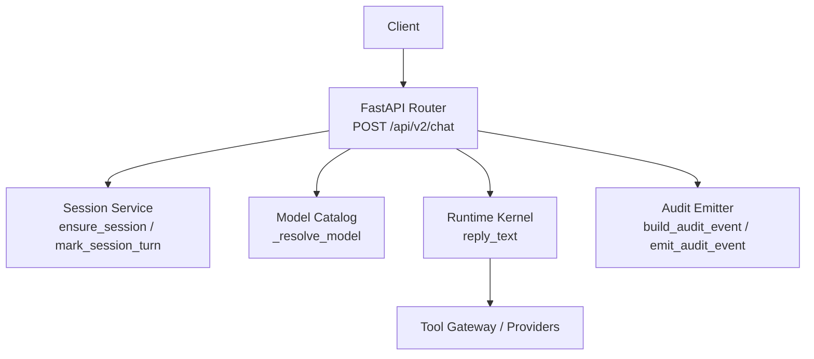
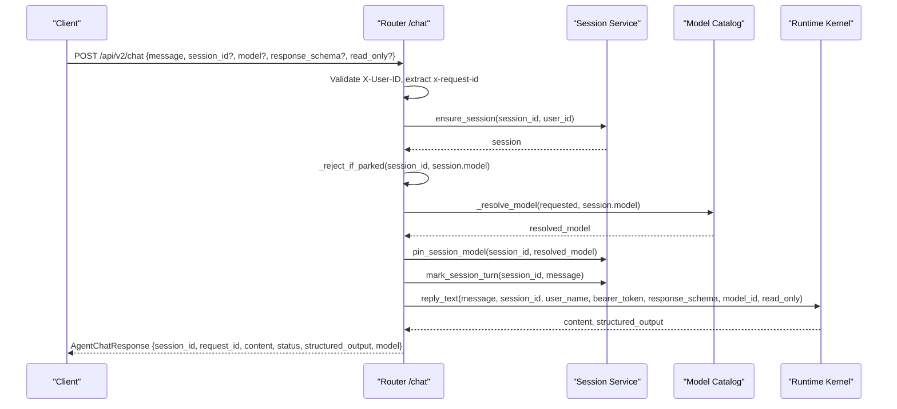
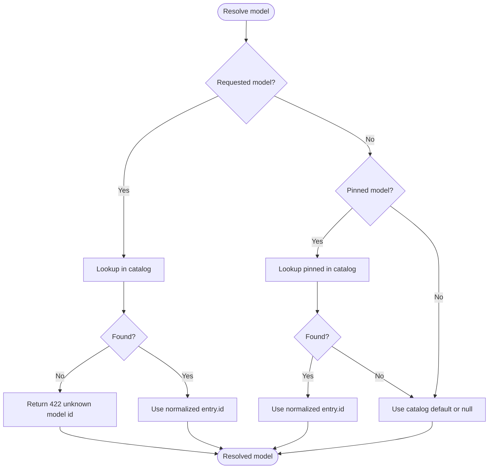
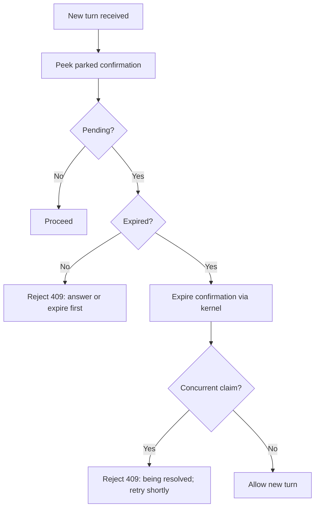
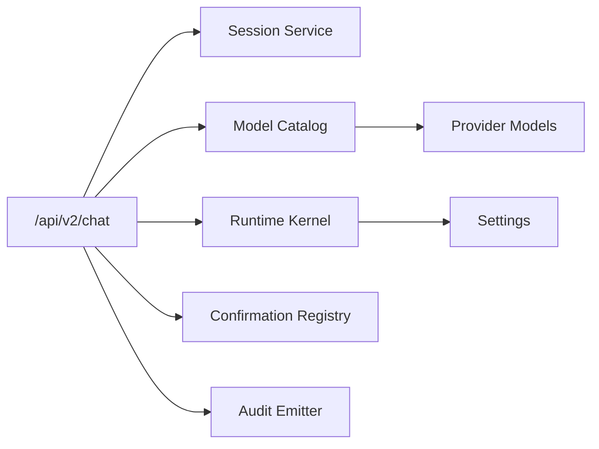

# Synchronous Chat

<cite>
**Referenced Files in This Document**
- [routes.py](file://products/agent-platform/src/agent_service/api/v2/routes.py)
- [v2.py](file://products/agent-platform/src/agent_service/schemas/v2.py)
- [agent-chat-request.schema.json](file://shared/shared-contracts/schemas/agent-chat-request.schema.json)
- [agent-chat-response.schema.json](file://shared/shared-contracts/schemas/agent-chat-response.schema.json)
- [runtime_dependencies.py](file://products/agent-platform/src/agent_service/services/runtime_dependencies.py)
- [model_catalog.py](file://products/agent-platform/src/agent_service/services/model_catalog.py)
</cite>

## Table of Contents
1. [Introduction](#introduction)
2. [Project Structure](#project-structure)
3. [Core Components](#core-components)
4. [Architecture Overview](#architecture-overview)
5. [Detailed Component Analysis](#detailed-component-analysis)
6. [Dependency Analysis](#dependency-analysis)
7. [Performance Considerations](#performance-considerations)
8. [Troubleshooting Guide](#troubleshooting-guide)
9. [Conclusion](#conclusion)

## Introduction
This document specifies the synchronous chat endpoint POST /api/v2/chat for the agent platform. It defines the request and response schemas, authentication requirements, model resolution logic, session parking prevention, structured output validation via response_schema, read-only mode enforcement, bearer token forwarding for tool calls, audit logging, and integration with the runtime kernel for agent execution. Concrete examples illustrate text messages, structured output requests, model switching, and error responses for unknown models, parked confirmations, and missing user identity.

## Project Structure
The synchronous chat endpoint is implemented in the agent-service FastAPI router under the v2 API surface. Request and response contracts are defined both as JSON Schema files (shared contracts) and as Pydantic models used by the service. The route delegates execution to the runtime kernel through a dependency-resolved kernel instance and interacts with session and model catalog services.

**Diagram sources**
- [routes.py:276-317](file://products/agent-platform/src/agent_service/api/v2/routes.py#L276-L317)
- [runtime_dependencies.py:13-20](file://products/agent-platform/src/agent_service/services/runtime_dependencies.py#L13-L20)
- [model_catalog.py:1-200](file://products/agent-platform/src/agent_service/services/model_catalog.py#L1-L200)

**Section sources**
- [routes.py:1-10](file://products/agent-platform/src/agent_service/api/v2/routes.py#L1-L10)
- [routes.py:276-317](file://products/agent-platform/src/agent_service/api/v2/routes.py#L276-L317)
- [runtime_dependencies.py:13-20](file://products/agent-platform/src/agent_service/services/runtime_dependencies.py#L13-L20)

## Core Components
- AgentChatRequest: Defines message, optional session_id, input_modality, response_schema, model, and read_only fields.
- AgentChatResponse: Returns session_id, request_id, content, status, structured_output, and model.
- Route handler: Validates headers, enforces session parking rules, resolves model, pins model on session, records turn activity, invokes kernel reply_text, and returns the response envelope.

Key behaviors:
- Authentication: X-User-ID header is required; missing identity yields 401.
- Bearer token forwarding: Authorization: Bearer token from gateway is forwarded opaquely to the kernel for tool calls without inspection or signing.
- Session parking prevention: New turns are rejected while a confirmation is pending unless expired and successfully interrupted.
- Model resolution: request > pinned > default, validated against the credential-gated model catalog; unknown ids fail closed with 422.
- Structured output: response_schema is passed unchanged to the kernel for validation; structured_output appears in the response when present.
- Read-only mode: restricts toolkit to read-level tools for automated diagnostic turns; does not change policy or HITL outcomes.

**Section sources**
- [v2.py:37-94](file://products/agent-platform/src/agent_service/schemas/v2.py#L37-L94)
- [agent-chat-request.schema.json:1-35](file://shared/shared-contracts/schemas/agent-chat-request.schema.json#L1-L35)
- [agent-chat-response.schema.json:1-35](file://shared/shared-contracts/schemas/agent-chat-response.schema.json#L1-L35)
- [routes.py:144-157](file://products/agent-platform/src/agent_service/api/v2/routes.py#L144-L157)
- [routes.py:202-243](file://products/agent-platform/src/agent_service/api/v2/routes.py#L202-L243)
- [routes.py:246-270](file://products/agent-platform/src/agent_service/api/v2/routes.py#L246-L270)
- [routes.py:276-317](file://products/agent-platform/src/agent_service/api/v2/routes.py#L276-L317)

## Architecture Overview
The synchronous chat flow validates identity, ensures an active session, prevents new turns during parked confirmations, resolves the serving model, updates session metadata, and executes the agent turn via the runtime kernel. The kernel may call tools that require delegated tokens, which are forwarded from the gateway’s Authorization header.

**Diagram sources**
- [routes.py:276-317](file://products/agent-platform/src/agent_service/api/v2/routes.py#L276-L317)
- [routes.py:202-243](file://products/agent-platform/src/agent_service/api/v2/routes.py#L202-L243)
- [routes.py:246-270](file://products/agent-platform/src/agent_service/api/v2/routes.py#L246-L270)
- [runtime_dependencies.py:13-20](file://products/agent-platform/src/agent_service/services/runtime_dependencies.py#L13-L20)

## Detailed Component Analysis

### Endpoint: POST /api/v2/chat
- Path: /api/v2/chat
- Method: POST
- Content-Type: application/json
- Headers:
  - X-User-ID: Required. Identity of the requester. Missing header returns 401.
  - x-request-id: Optional. Correlation id; defaults to "untracked".
  - Authorization: Optional. Bearer token forwarded opaquely to the kernel for tool calls.
- Request body: AgentChatRequest
- Response body: AgentChatResponse

Behavior highlights:
- Identity enforcement via X-User-ID.
- Session lifecycle management and turn marking.
- Parked confirmation gating with TTL expiry handling.
- Model resolution and pinning.
- Kernel invocation with bearer token, response schema, and read-only flag.
- Structured output returned when response_schema was provided and validated by the kernel.

**Section sources**
- [routes.py:276-317](file://products/agent-platform/src/agent_service/api/v2/routes.py#L276-L317)
- [routes.py:144-157](file://products/agent-platform/src/agent_service/api/v2/routes.py#L144-L157)
- [routes.py:202-243](file://products/agent-platform/src/agent_service/api/v2/routes.py#L202-L243)
- [routes.py:246-270](file://products/agent-platform/src/agent_service/api/v2/routes.py#L246-L270)

### Request Schema: AgentChatRequest
Fields:
- message: string, required, min length 1. Operator prompt sent to the agent runtime.
- session_id: string, optional. Continues an existing conversation; omit to start a new session.
- input_modality: enum ["text", "voice"], default "text". Metadata only; never changes policy, auto-allow, or HITL outcomes.
- response_schema: object, optional. JSON-schema dict passed unchanged to the kernel for structured output validation.
- model: string or null, optional. Per-turn model selection; resolved against the catalog with request > pinned > default order. Unknown ids fail closed with 4xx.
- read_only: boolean, default false. Restricts toolkit to read-level tools for automated diagnostic turns; does not change policy or HITL outcomes.

Notes:
- Identity is conveyed via headers, not the body.
- Voice-readiness modality is informational only.

**Section sources**
- [agent-chat-request.schema.json:1-35](file://shared/shared-contracts/schemas/agent-chat-request.schema.json#L1-L35)
- [v2.py:37-73](file://products/agent-platform/src/agent_service/schemas/v2.py#L37-L73)

### Response Schema: AgentChatResponse
Fields:
- session_id: string.
- request_id: string.
- content: string. Agent reply text.
- status: enum ["ok", "partial", "error"], default "ok".
- structured_output: object or null. Validated structured output when response_schema was supplied; null otherwise.
- model: string or null. Resolved model id for this turn; null when no model is configured.

Notes:
- Simplified envelope compared to v1; content replaces previous response field.

**Section sources**
- [agent-chat-response.schema.json:1-35](file://shared/shared-contracts/schemas/agent-chat-response.schema.json#L1-L35)
- [v2.py:76-94](file://products/agent-platform/src/agent_service/schemas/v2.py#L76-L94)

### Authentication and Identity
- X-User-ID header is mandatory. Missing identity results in 401 Unauthorized.
- x-request-id is propagated into the response for tracing.
- Authorization: Bearer token is extracted and forwarded to the kernel for tool calls without inspection or signing.

**Section sources**
- [routes.py:144-157](file://products/agent-platform/src/agent_service/api/v2/routes.py#L144-L157)
- [routes.py:276-317](file://products/agent-platform/src/agent_service/api/v2/routes.py#L276-L317)

### Model Resolution Logic
Order: request model > session-pinned model > deploy-time default.
- If a model is requested, it must exist in the credential-gated catalog; unknown ids return 422.
- Pinned model is honored only if still present in the catalog; otherwise degrades to default.
- Resolved model ids are normalized to concrete catalog entries; provider aliases resolve to provider defaults.
- The resolved model is logged and persisted as the session’s pinned model for subsequent turns.

**Diagram sources**
- [routes.py:246-270](file://products/agent-platform/src/agent_service/api/v2/routes.py#L246-L270)
- [model_catalog.py:1-200](file://products/agent-platform/src/agent_service/services/model_catalog.py#L1-L200)

**Section sources**
- [routes.py:246-270](file://products/agent-platform/src/agent_service/api/v2/routes.py#L246-L270)

### Session Parking Prevention
- Before accepting a new turn, the handler checks for a parked confirmation in the registry.
- If a parked confirmation exists and is not expired, the request is rejected with 409 Conflict.
- If expired, the handler attempts to expire the confirmation via the kernel using the same model resolution ladder; concurrent resolution races are handled safely.

**Diagram sources**
- [routes.py:202-243](file://products/agent-platform/src/agent_service/api/v2/routes.py#L202-L243)

**Section sources**
- [routes.py:202-243](file://products/agent-platform/src/agent_service/api/v2/routes.py#L202-L243)

### Structured Output Validation
- When response_schema is provided, it is passed unchanged to the kernel for validation.
- On success, structured_output contains the validated payload; otherwise it is null.
- This enables deterministic, schema-enforced outputs for automation.

**Section sources**
- [v2.py:48-54](file://products/agent-platform/src/agent_service/schemas/v2.py#L48-L54)
- [routes.py:302-317](file://products/agent-platform/src/agent_service/api/v2/routes.py#L302-L317)

### Read-Only Mode Enforcement
- read_only restricts the toolkit to read-level tools for automated diagnostic turns.
- It affects tool-surface selection only; it does not change policy or HITL outcomes.
- Intended to prevent invoking or parking on mutating tools.

**Section sources**
- [v2.py:65-73](file://products/agent-platform/src/agent_service/schemas/v2.py#L65-L73)

### Bearer Token Forwarding for Tool Calls
- The Authorization header is parsed for a Bearer token forwarded by the gateway.
- The raw token is passed to the kernel for tool calls without inspection or signing.
- This supports delegated credentials for downstream tool invocations.

**Section sources**
- [routes.py:150-157](file://products/agent-platform/src/agent_service/api/v2/routes.py#L150-L157)
- [routes.py:302-317](file://products/agent-platform/src/agent_service/api/v2/routes.py#L302-L317)

### Audit Logging and Integration Points
- The route logs model resolution per turn with request_id, session_id, and model details.
- Audit event builders and emitters are imported for broader audit trail integration.
- The runtime kernel is obtained via a process-wide cached dependency resolver.

**Section sources**
- [routes.py:21-47](file://products/agent-platform/src/agent_service/api/v2/routes.py#L21-L47)
- [routes.py:292-300](file://products/agent-platform/src/agent_service/api/v2/routes.py#L292-L300)
- [runtime_dependencies.py:13-20](file://products/agent-platform/src/agent_service/services/runtime_dependencies.py#L13-L20)

### Runtime Kernel Integration
- The route calls get_runtime_kernel().reply_text(...) with message, session_id, user_name, bearer_token, response_schema, model_id, and read_only.
- The kernel executes the agent turn, potentially invoking tools and returning content plus structured_output.

**Section sources**
- [routes.py:302-317](file://products/agent-platform/src/agent_service/api/v2/routes.py#L302-L317)
- [runtime_dependencies.py:13-20](file://products/agent-platform/src/agent_service/services/runtime_dependencies.py#L13-L20)

## Dependency Analysis
- Router depends on:
  - Session service for session lifecycle and turn tracking.
  - Model catalog for resolving and validating model ids.
  - Runtime kernel for agent execution.
  - Confirmation registry for parked confirmation checks.
  - Audit emitter for audit events.
- Kernel depends on settings and providers for LLM/tool execution.
- Model catalog provides a credential-gated view of available models and default selection.

**Diagram sources**
- [routes.py:21-47](file://products/agent-platform/src/agent_service/api/v2/routes.py#L21-L47)
- [routes.py:276-317](file://products/agent-platform/src/agent_service/api/v2/routes.py#L276-L317)
- [runtime_dependencies.py:13-20](file://products/agent-platform/src/agent_service/services/runtime_dependencies.py#L13-L20)
- [model_catalog.py:1-200](file://products/agent-platform/src/agent_service/services/model_catalog.py#L1-L200)

**Section sources**
- [routes.py:21-47](file://products/agent-platform/src/agent_service/api/v2/routes.py#L21-L47)
- [routes.py:276-317](file://products/agent-platform/src/agent_service/api/v2/routes.py#L276-L317)
- [runtime_dependencies.py:13-20](file://products/agent-platform/src/agent_service/services/runtime_dependencies.py#L13-L20)
- [model_catalog.py:1-200](file://products/agent-platform/src/agent_service/services/model_catalog.py#L1-L200)

## Performance Considerations
- Model resolution is O(1) lookup in the catalog; unknown model ids fail fast with 422.
- Session parking check uses an in-memory registry peek; expired parks are interrupted once per turn.
- Kernel reply_text is the primary latency contributor; structured output validation occurs within the kernel.
- Bearer token extraction is lightweight and avoids parsing beyond scheme/token split.

[No sources needed since this section provides general guidance]

## Troubleshooting Guide
Common errors and causes:
- 401 Unauthorized: Missing or empty X-User-ID header.
  - Fix: Include X-User-ID with a valid user identifier.
- 409 Conflict: Confirmation pending.
  - Cause: A parked tool confirmation exists and has not expired.
  - Fix: Answer or wait for expiration before sending a new message.
- 422 Unprocessable Entity: Unknown model id.
  - Cause: Requested model not found in the credential-gated catalog.
  - Fix: Use a model id from GET /api/v2/models or omit to use pinned/default.
- 404 Not Found: Confirmation not found or unparked session.
  - Cause: Invalid confirm_id or no pending confirmation.
  - Fix: Verify confirm_id and session state.

Operational notes:
- Ensure the runtime kernel is reachable; failures propagate as errors.
- Monitor logs for model resolution and kernel interactions.
- For structured output issues, validate response_schema against the target model’s capabilities.

**Section sources**
- [routes.py:144-157](file://products/agent-platform/src/agent_service/api/v2/routes.py#L144-L157)
- [routes.py:202-243](file://products/agent-platform/src/agent_service/api/v2/routes.py#L202-L243)
- [routes.py:246-270](file://products/agent-platform/src/agent_service/api/v2/routes.py#L246-L270)

## Conclusion
POST /api/v2/chat provides a secure, auditable, and extensible synchronous chat interface for agent operations. It enforces identity, prevents concurrent conflicts via session parking checks, supports flexible model selection with fail-closed validation, enables structured outputs through response_schema, and integrates cleanly with the runtime kernel for tool execution. Clients should include X-User-ID, optionally supply Authorization for tool delegation, and handle 409/422 errors appropriately.