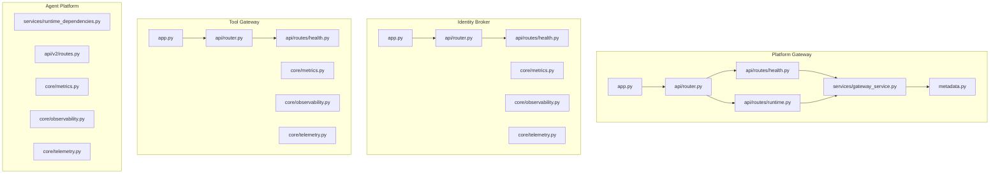
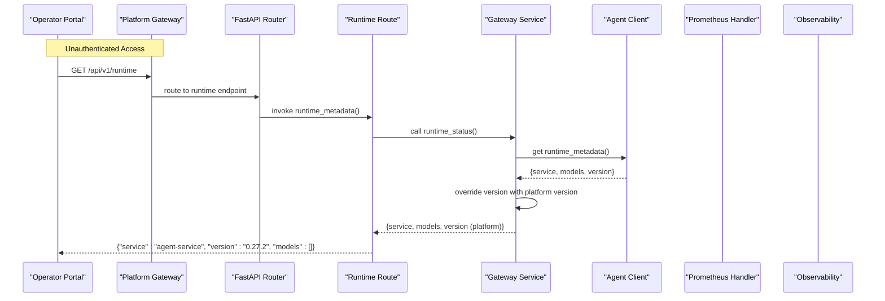
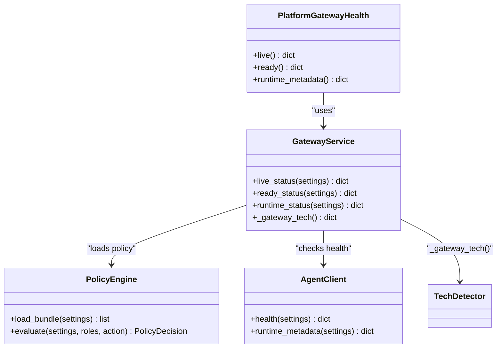
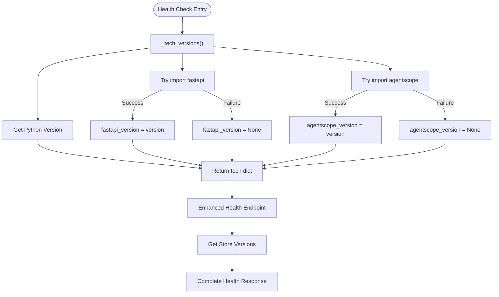
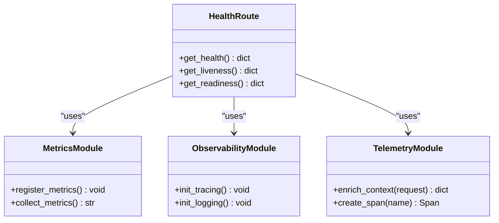
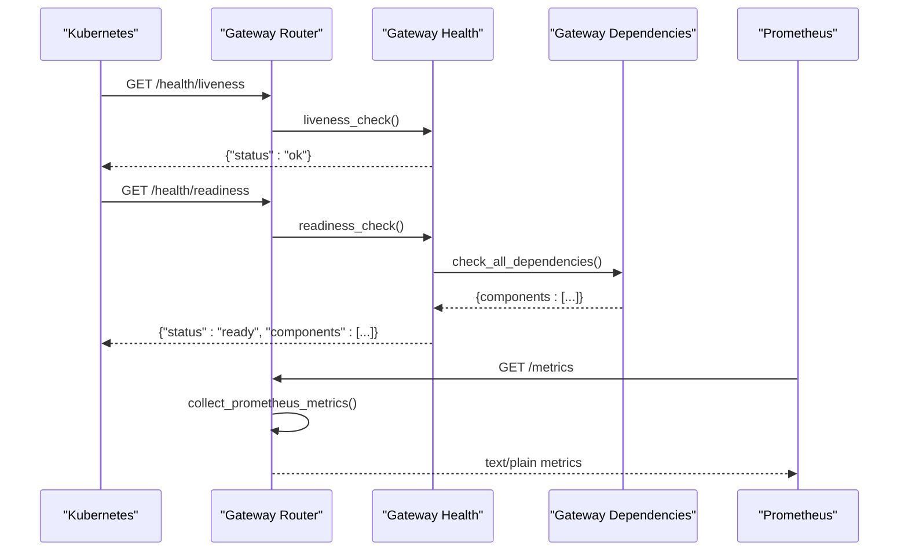
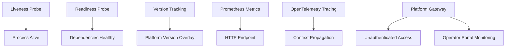
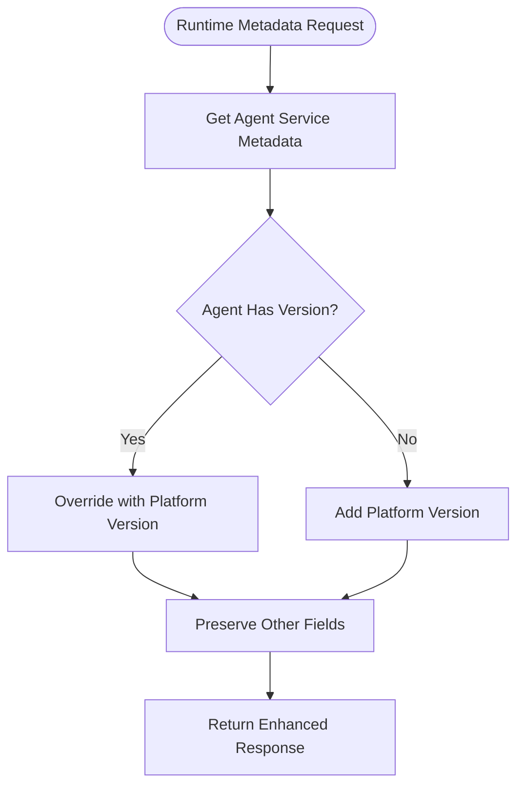
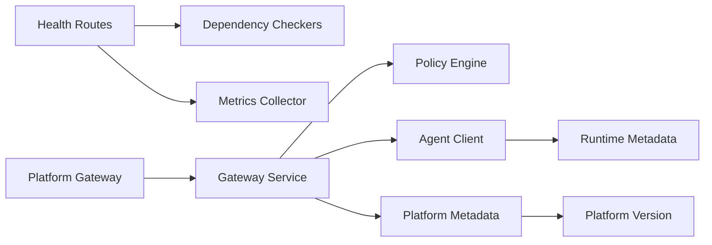

# Health & Monitoring API

<cite>
**Referenced Files in This Document**
- [health.py](file://products/platform-gateway/src/platform_gateway/api/routes/health.py)
- [runtime.py](file://products/platform-gateway/src/platform_gateway/api/routes/runtime.py)
- [router.py](file://products/platform-gateway/src/platform_gateway/api/router.py)
- [gateway_service.py](file://products/platform-gateway/src/platform_gateway/services/gateway_service.py)
- [config.py](file://products/platform-gateway/src/platform_gateway/core/config.py)
- [app.py](file://products/platform-gateway/src/platform_gateway/app.py)
- [metadata.py](file://products/platform-gateway/src/platform_gateway/metadata.py)
- [agent-health.schema.json](file://shared/shared-contracts/schemas/agent-health.schema.json)
- [health-response.schema.json](file://shared/shared-contracts/schemas/health-response.schema.json)
- [routes.py](file://products/agent-platform/src/agent_service/api/v2/routes.py)
- [health.py](file://products/identity-broker/src/identity_service/api/routes/health.py)
- [router.py](file://products/identity-broker/src/identity_service/api/router.py)
- [app.py](file://products/identity-broker/src/identity_service/app.py)
- [metrics.py](file://products/identity-broker/src/identity_service/core/metrics.py)
- [observability.py](file://products/identity-broker/src/identity_service/core/observability.py)
- [telemetry.py](file://products/identity-broker/src/identity_service/core/telemetry.py)
- [health.py](file://products/tool-gateway/src/api_gateway/api/routes/health.py)
- [router.py](file://products/tool-gateway/src/api_gateway/api/router.py)
- [app.py](file://products/tool-gateway/src/api_gateway/app.py)
- [metrics.py](file://products/tool-gateway/src/api_gateway/core/metrics.py)
- [observability.py](file://products/tool-gateway/src/api_gateway/core/observability.py)
- [telemetry.py](file://products/tool-gateway/src/api_gateway/core/telemetry.py)
- [runtime_dependencies.py](file://products/agent-platform/src/agent_service/services/runtime_dependencies.py)
- [metrics.py](file://products/agent-platform/src/agent_service/core/metrics.py)
- [observability.py](file://products/agent-platform/src/agent_service/core/observability.py)
- [telemetry.py](file://products/agent-platform/src/agent_service/core/telemetry.py)
- [observability-conventions.md](file://shared/shared-contracts/observability-conventions.md)
</cite>

## Update Summary
**Changes Made**
- Enhanced runtime metadata endpoint to include platform version information alongside agent service metadata
- Updated `/api/v1/runtime` endpoint to override agent service version with platform gateway version for consistent deployment verification
- Added comprehensive testing coverage for version merging behavior ensuring platform version takes precedence
- Maintained backward compatibility while providing enhanced version tracking capabilities

## Table of Contents
1. [Introduction](#introduction)
2. [Project Structure](#project-structure)
3. [Core Components](#core-components)
4. [Architecture Overview](#architecture-overview)
5. [Detailed Component Analysis](#detailed-component-analysis)
6. [Platform Gateway Health Endpoints](#platform-gateway-health-endpoints)
7. [Enhanced Runtime Metadata Endpoint](#enhanced-runtime-metadata-endpoint)
8. [Dependency Analysis](#dependency-analysis)
9. [Performance Considerations](#performance-considerations)
10. [Troubleshooting Guide](#troubleshooting-guide)
11. [Conclusion](#conclusion)
12. [Appendices](#appendices)

## Introduction
This document provides detailed API documentation for health check and monitoring endpoints across the platform services, with enhanced coverage of the new unauthenticated health endpoints exposed by the platform gateway for operator portal component monitoring. It covers REST endpoints for service health status, readiness probes, and liveness checks; Prometheus-compatible metrics exposure; custom health indicators; dependency status reporting; telemetry collection; distributed tracing integration; and observability conventions. The platform gateway now provides real-time visibility into platform component health without authentication overhead, enabling efficient operator portal monitoring with comprehensive version tracking and deployment verification capabilities.

## Project Structure
The platform exposes health and monitoring capabilities consistently across multiple services, with the platform gateway serving as the primary entry point for unauthenticated monitoring:
- Platform Gateway: Central routing for health endpoints, runtime metadata, and authenticated operations
- Identity Broker: Core identity and authorization health endpoints
- Tool Gateway: Tool execution and policy enforcement health endpoints  
- Agent Platform: Runtime dependencies and agent service health endpoints

**Diagram sources**
- [app.py](file://products/platform-gateway/src/platform_gateway/app.py)
- [router.py](file://products/platform-gateway/src/platform_gateway/api/router.py)
- [health.py](file://products/platform-gateway/src/platform_gateway/api/routes/health.py)
- [runtime.py](file://products/platform-gateway/src/platform_gateway/api/routes/runtime.py)
- [gateway_service.py](file://products/platform-gateway/src/platform_gateway/services/gateway_service.py)
- [metadata.py](file://products/platform-gateway/src/platform_gateway/metadata.py)
- [app.py](file://products/identity-broker/src/identity_service/app.py)
- [router.py](file://products/identity-broker/src/identity_service/api/router.py)
- [health.py](file://products/identity-broker/src/identity_service/api/routes/health.py)
- [app.py](file://products/tool-gateway/src/api_gateway/app.py)
- [router.py](file://products/tool-gateway/src/api_gateway/api/router.py)
- [health.py](file://products/tool-gateway/src/api_gateway/api/routes/health.py)
- [runtime_dependencies.py](file://products/agent-platform/src/agent_service/services/runtime_dependencies.py)
- [routes.py](file://products/agent-platform/src/agent_service/api/v2/routes.py)

**Section sources**
- [health.py](file://products/platform-gateway/src/platform_gateway/api/routes/health.py)
- [runtime.py](file://products/platform-gateway/src/platform_gateway/api/routes/runtime.py)
- [router.py](file://products/platform-gateway/src/platform_gateway/api/router.py)
- [gateway_service.py](file://products/platform-gateway/src/platform_gateway/services/gateway_service.py)
- [metadata.py](file://products/platform-gateway/src/platform_gateway/metadata.py)
- [app.py](file://products/platform-gateway/src/platform_gateway/app.py)

## Core Components
Each service implements a consistent set of components to expose health, metrics, and observability, with the platform gateway providing centralized access:
- Health endpoints: REST routes that return service health status and dependency states
- Metrics exposure: Prometheus-compatible endpoint exposing process and application metrics
- Observability: OpenTelemetry-based tracing and logging setup
- Telemetry: Context propagation and instrumentation helpers
- Platform Gateway: Unauthenticated monitoring endpoints for operator portal integration
- Version Tracking: Enhanced runtime metadata with platform version information for deployment verification

Key responsibilities:
- Health endpoints provide liveness/readiness semantics and aggregate dependency statuses
- Platform gateway exposes unauthenticated endpoints for monitoring without authentication overhead
- Runtime metadata endpoint provides comprehensive version information including platform and agent service details
- Metrics module registers counters, gauges, histograms, and summary metrics
- Observability initializes tracing providers, propagators, and exporters
- Telemetry provides request context enrichment and span creation utilities

**Section sources**
- [health.py](file://products/platform-gateway/src/platform_gateway/api/routes/health.py)
- [runtime.py](file://products/platform-gateway/src/platform_gateway/api/routes/runtime.py)
- [gateway_service.py](file://products/platform-gateway/src/platform_gateway/services/gateway_service.py)
- [routes.py](file://products/agent-platform/src/agent_service/api/v2/routes.py)
- [health.py](file://products/identity-broker/src/identity_service/api/routes/health.py)
- [metrics.py](file://products/identity-broker/src/identity_service/core/metrics.py)
- [observability.py](file://products/identity-broker/src/identity_service/core/observability.py)
- [telemetry.py](file://products/identity-broker/src/identity_service/core/telemetry.py)
- [health.py](file://products/tool-gateway/src/api_gateway/api/routes/health.py)
- [metrics.py](file://products/tool-gateway/src/api_gateway/core/metrics.py)
- [observability.py](file://products/tool-gateway/src/api_gateway/core/observability.py)
- [telemetry.py](file://products/tool-gateway/src/api_gateway/core/telemetry.py)
- [runtime_dependencies.py](file://products/agent-platform/src/agent_service/services/runtime_dependencies.py)
- [metrics.py](file://products/agent-platform/src/agent_service/core/metrics.py)
- [observability.py](file://products/agent-platform/src/agent_service/core/observability.py)
- [telemetry.py](file://products/agent-platform/src/agent_service/core/telemetry.py)

## Architecture Overview
The health and monitoring architecture follows a layered approach with the platform gateway as the central entry point for unauthenticated monitoring:
- HTTP layer: FastAPI routers register health and metrics endpoints
- Gateway layer: Platform gateway provides unauthenticated access to health and runtime information
- Service layer: Health aggregators query dependencies and compute overall status
- Version Tracking layer: Enhanced runtime metadata with platform version information
- Metrics layer: Prometheus client exposes metrics via an HTTP handler
- Observability layer: OpenTelemetry SDK configured per service

**Diagram sources**
- [router.py](file://products/platform-gateway/src/platform_gateway/api/router.py)
- [runtime.py](file://products/platform-gateway/src/platform_gateway/api/routes/runtime.py)
- [gateway_service.py](file://products/platform-gateway/src/platform_gateway/services/gateway_service.py)
- [app.py](file://products/platform-gateway/src/platform_gateway/app.py)

## Detailed Component Analysis

### Platform Gateway Health Endpoints
**Updated** Enhanced with platform version information in runtime metadata

The platform gateway exposes three key unauthenticated endpoints with enhanced version tracking:
- Liveness probe (`/health/live`): Returns whether the gateway process is alive and able to serve requests
- Readiness probe (`/health/ready`): Returns whether the gateway is ready to accept traffic (policy bundle loaded, agent service responsive)
- Runtime metadata (`/api/v1/runtime`): Exposes runtime information with platform version overriding agent service version

Implementation highlights:
- All endpoints are unauthenticated, enabling operator portal monitoring without authentication overhead
- Readiness endpoint performs comprehensive dependency checks including policy bundle loading and agent service connectivity
- Runtime metadata endpoint merges agent service information with platform version for consistent deployment verification
- Endpoints follow standard Kubernetes probing patterns for container orchestration compatibility

**Diagram sources**
- [health.py](file://products/platform-gateway/src/platform_gateway/api/routes/health.py)
- [runtime.py](file://products/platform-gateway/src/platform_gateway/api/routes/runtime.py)
- [gateway_service.py](file://products/platform-gateway/src/platform_gateway/services/gateway_service.py)

**Section sources**
- [health.py](file://products/platform-gateway/src/platform_gateway/api/routes/health.py)
- [runtime.py](file://products/platform-gateway/src/platform_gateway/api/routes/runtime.py)
- [gateway_service.py](file://products/platform-gateway/src/platform_gateway/services/gateway_service.py)

### Enhanced Runtime Metadata Endpoint
**New Section** Documentation for the enhanced runtime metadata endpoint with platform version information

The platform gateway's runtime metadata endpoint has been enhanced to provide comprehensive version tracking and deployment verification capabilities through platform version overlay.

#### Platform Version Overlay Mechanism
The runtime metadata endpoint now implements a sophisticated version overlay system:

**Features:**
- **Version Override**: Platform gateway version always takes precedence over agent service version
- **Metadata Preservation**: All other agent service metadata fields remain unchanged
- **Deployment Verification**: Consistent version reporting across all platform components
- **Backward Compatibility**: Existing agent service responses are preserved and enhanced

**Implementation Details:**
- The `runtime_status()` function retrieves agent service metadata first
- Platform version from `SERVICE_VERSION` overrides any existing version field
- All other agent service fields (service name, models, etc.) pass through unchanged
- Tests ensure platform version wins even when agent service reports its own version

**Diagram sources**
- [gateway_service.py:87-92](file://products/platform-gateway/src/platform_gateway/services/gateway_service.py#L87-L92)

#### Version Merging Behavior
The endpoint ensures consistent version reporting through controlled merging:

**Behavior:**
- Agent service returns: `{"service": "agent-service", "version": "9.9.9-agent", "models": []}`
- Platform gateway response: `{"service": "agent-service", "version": "0.27.2", "models": []}`
- Platform version (`0.27.2`) replaces agent version (`9.9.9-agent`)
- All other fields remain unchanged

**Testing Coverage:**
- Comprehensive test suite validates version override behavior
- Ensures platform version wins regardless of agent service version
- Verifies other metadata fields pass through unchanged

**Section sources**
- [gateway_service.py:87-92](file://products/platform-gateway/src/platform_gateway/services/gateway_service.py#L87-L92)
- [test_auth_legs.py:107-127](file://products/platform-gateway/tests/test_auth_legs.py#L107-L127)

### Agent Platform Health Endpoints
- Tech-stack version detection: Best-effort version detection for Python, FastAPI, and AgentScope
- Enhanced health endpoint: Returns comprehensive health status with optional version information
- Backward compatible: All new version fields are nullable and informational only

Implementation highlights:
- Uses `importlib.metadata` for safe package version detection with exception handling
- Provides Python version via `platform.python_version()`
- Detects FastAPI and AgentScope versions with graceful fallback to None
- Integrates with session store and agent state store version detection
- Maintains backward compatibility by making all new fields optional

**Diagram sources**
- [routes.py](file://products/agent-platform/src/agent_service/api/v2/routes.py)

**Section sources**
- [routes.py](file://products/agent-platform/src/agent_service/api/v2/routes.py)

### Identity Broker Health Endpoints
- Liveness probe: Returns whether the process is alive and able to serve requests
- Readiness probe: Returns whether the service is ready to accept traffic (dependencies healthy)
- Dependency status: Aggregates health of downstream dependencies (e.g., identity store, token service)

Implementation highlights:
- Health route aggregates component statuses and returns a structured response
- Metrics endpoint exposes process and application metrics
- Observability initializes tracing and logging
- Telemetry enriches request context with trace IDs and correlation data

**Diagram sources**
- [health.py](file://products/identity-broker/src/identity_service/api/routes/health.py)
- [metrics.py](file://products/identity-broker/src/identity_service/core/metrics.py)
- [observability.py](file://products/identity-broker/src/identity_service/core/observability.py)
- [telemetry.py](file://products/identity-broker/src/identity_service/core/telemetry.py)

**Section sources**
- [health.py](file://products/identity-broker/src/identity_service/api/routes/health.py)
- [metrics.py](file://products/identity-broker/src/identity_service/core/metrics.py)
- [observability.py](file://products/identity-broker/src/identity_service/core/observability.py)
- [telemetry.py](file://products/identity-broker/src/identity_service/core/telemetry.py)

### Tool Gateway Health Endpoints
- Liveness probe: Confirms the gateway process is responsive
- Readiness probe: Validates internal state and external connectivity
- Dependency status: Reports on policy engine, agent clients, and tool connectors

Implementation highlights:
- Health route composes dependency checks and returns aggregated status
- Metrics endpoint exposes gateway-specific metrics (request counts, latency)
- Observability configures tracing across gateway boundaries
- Telemetry propagates context between upstream and downstream calls

**Diagram sources**
- [router.py](file://products/tool-gateway/src/api_gateway/api/router.py)
- [health.py](file://products/tool-gateway/src/api_gateway/api/routes/health.py)
- [metrics.py](file://products/tool-gateway/src/api_gateway/core/metrics.py)
- [observability.py](file://products/tool-gateway/src/api_gateway/core/observability.py)
- [telemetry.py](file://products/tool-gateway/src/api_gateway/core/telemetry.py)

**Section sources**
- [health.py](file://products/tool-gateway/src/api_gateway/api/routes/health.py)
- [metrics.py](file://products/tool-gateway/src/api_gateway/core/metrics.py)
- [observability.py](file://products/tool-gateway/src/api_gateway/core/observability.py)
- [telemetry.py](file://products/tool-gateway/src/api_gateway/core/telemetry.py)

### Agent Platform Runtime Dependencies
- Dependency checker: Validates runtime environment and external services
- Health aggregation: Combines runtime checks into a unified status
- Metrics and observability: Expose runtime metrics and traces

**Diagram sources**
- [runtime_dependencies.py](file://products/agent-platform/src/agent_service/services/runtime_dependencies.py)
- [metrics.py](file://products/agent-platform/src/agent_service/core/metrics.py)
- [observability.py](file://products/agent-platform/src/agent_service/core/observability.py)
- [telemetry.py](file://products/agent-platform/src/agent_service/core/telemetry.py)

**Section sources**
- [runtime_dependencies.py](file://products/agent-platform/src/agent_service/services/runtime_dependencies.py)
- [metrics.py](file://products/agent-platform/src/agent_service/core/metrics.py)
- [observability.py](file://products/agent-platform/src/agent_service/core/observability.py)
- [telemetry.py](file://products/agent-platform/src/agent_service/core/telemetry.py)

### Conceptual Overview
The health and monitoring system adheres to standard Kubernetes probing patterns and Prometheus metrics conventions:
- Liveness: Process-level health without dependency checks
- Readiness: Service-level health including dependency validation
- Version Tracking: Enhanced runtime metadata with platform version overlay
- Metrics: Prometheus exposition format with labels for dimensionality
- Tracing: OpenTelemetry spans propagated across service boundaries
- Platform Gateway: Centralized unauthenticated access for operator monitoring

[No sources needed since this diagram shows conceptual workflow, not actual code structure]

## Platform Gateway Health Endpoints
**Updated** Enhanced with platform version information in runtime metadata

The platform gateway serves as the primary entry point for unauthenticated health monitoring, providing three key endpoints with enhanced version tracking:

### Liveness Endpoint (`/health/live`)
Returns basic process health information without dependency checks:
- **Method**: GET
- **Authentication**: None required
- **Response**: JSON object with service identification and status
- **Use Case**: Container orchestration liveness probes

### Readiness Endpoint (`/health/ready`)  
Performs comprehensive dependency validation:
- **Method**: GET
- **Authentication**: None required
- **Response**: JSON object with service status and component details
- **Checks**: Policy bundle loading, agent service connectivity
- **Use Case**: Container orchestration readiness probes

### Runtime Metadata Endpoint (`/api/v1/runtime`)
**Updated** Enhanced with platform version overlay for deployment verification:
- **Method**: GET
- **Authentication**: None required
- **Response**: JSON object with runtime metadata and platform version
- **Version Behavior**: Platform version overrides agent service version
- **Use Case**: Operator portal runtime visibility and deployment verification

**Section sources**
- [health.py](file://products/platform-gateway/src/platform_gateway/api/routes/health.py)
- [runtime.py](file://products/platform-gateway/src/platform_gateway/api/routes/runtime.py)
- [gateway_service.py](file://products/platform-gateway/src/platform_gateway/services/gateway_service.py)

## Enhanced Runtime Metadata Endpoint
**New Section** Documentation for the enhanced runtime metadata endpoint with platform version information

The platform gateway's runtime metadata endpoint has been enhanced to provide comprehensive version tracking and deployment verification capabilities through platform version overlay.

### Platform Version Overlay Mechanism
The runtime metadata endpoint now implements a sophisticated version overlay system:

**Features:**
- **Version Override**: Platform gateway version always takes precedence over agent service version
- **Metadata Preservation**: All other agent service metadata fields remain unchanged
- **Deployment Verification**: Consistent version reporting across all platform components
- **Backward Compatibility**: Existing agent service responses are preserved and enhanced

**Implementation Details:**
- The `runtime_status()` function retrieves agent service metadata first
- Platform version from `SERVICE_VERSION` overrides any existing version field
- All other agent service fields (service name, models, etc.) pass through unchanged
- Tests ensure platform version wins regardless of agent service version

**Diagram sources**
- [gateway_service.py:87-92](file://products/platform-gateway/src/platform_gateway/services/gateway_service.py#L87-L92)

### Version Merging Behavior
The endpoint ensures consistent version reporting through controlled merging:

**Behavior:**
- Agent service returns: `{"service": "agent-service", "version": "9.9.9-agent", "models": []}`
- Platform gateway response: `{"service": "agent-service", "version": "0.27.2", "models": []}`
- Platform version (`0.27.2`) replaces agent version (`9.9.9-agent`)
- All other fields remain unchanged

**Testing Coverage:**
- Comprehensive test suite validates version override behavior
- Ensures platform version wins regardless of agent service version
- Verifies other metadata fields pass through unchanged

**Section sources**
- [gateway_service.py:87-92](file://products/platform-gateway/src/platform_gateway/services/gateway_service.py#L87-L92)
- [test_auth_legs.py:107-127](file://products/platform-gateway/tests/test_auth_legs.py#L107-L127)

## Dependency Analysis
The services depend on shared observability conventions and implement consistent patterns, with the platform gateway providing centralized access:
- Health routes depend on dependency checkers and metrics collectors
- Platform gateway routes depend on gateway service functions for health aggregation
- Runtime metadata depends on agent client for service information and platform metadata for version
- Metrics modules depend on Prometheus client libraries
- Observability modules depend on OpenTelemetry SDK
- Telemetry modules provide context enrichment and span utilities

**Diagram sources**
- [health.py](file://products/platform-gateway/src/platform_gateway/api/routes/health.py)
- [runtime.py](file://products/platform-gateway/src/platform_gateway/api/routes/runtime.py)
- [gateway_service.py](file://products/platform-gateway/src/platform_gateway/services/gateway_service.py)
- [routes.py](file://products/agent-platform/src/agent_service/api/v2/routes.py)
- [health.py](file://products/identity-broker/src/identity_service/api/routes/health.py)
- [metrics.py](file://products/identity-broker/src/identity_service/core/metrics.py)
- [observability.py](file://products/identity-broker/src/identity_service/core/observability.py)
- [telemetry.py](file://products/identity-broker/src/identity_service/core/telemetry.py)
- [health.py](file://products/tool-gateway/src/api_gateway/api/routes/health.py)
- [metrics.py](file://products/tool-gateway/src/api_gateway/core/metrics.py)
- [observability.py](file://products/tool-gateway/src/api_gateway/core/observability.py)
- [telemetry.py](file://products/tool-gateway/src/api_gateway/core/telemetry.py)
- [runtime_dependencies.py](file://products/agent-platform/src/agent_service/services/runtime_dependencies.py)

**Section sources**
- [health.py](file://products/platform-gateway/src/platform_gateway/api/routes/health.py)
- [runtime.py](file://products/platform-gateway/src/platform_gateway/api/routes/runtime.py)
- [gateway_service.py](file://products/platform-gateway/src/platform_gateway/services/gateway_service.py)
- [routes.py](file://products/agent-platform/src/agent_service/api/v2/routes.py)
- [health.py](file://products/identity-broker/src/identity_service/api/routes/health.py)
- [metrics.py](file://products/identity-broker/src/identity_service/core/metrics.py)
- [observability.py](file://products/identity-broker/src/identity_service/core/observability.py)
- [telemetry.py](file://products/identity-broker/src/identity_service/core/telemetry.py)
- [health.py](file://products/tool-gateway/src/api_gateway/api/routes/health.py)
- [metrics.py](file://products/tool-gateway/src/api_gateway/core/metrics.py)
- [observability.py](file://products/tool-gateway/src/api_gateway/core/observability.py)
- [telemetry.py](file://products/tool-gateway/src/api_gateway/core/telemetry.py)
- [runtime_dependencies.py](file://products/agent-platform/src/agent_service/services/runtime_dependencies.py)

## Performance Considerations
- Health checks should be lightweight and avoid blocking operations
- Platform gateway endpoints are designed for low-latency monitoring queries
- Runtime metadata endpoint performs minimal overhead version overlay operation
- Version overlay uses simple dictionary assignment with no additional network calls
- Metrics collection should use efficient data structures and avoid excessive allocations
- Tracing overhead can be controlled via sampling strategies
- Dependency checks should implement timeouts and circuit breakers
- Resource utilization metrics should be exposed for CPU, memory, and I/O
- Unauthenticated endpoints reduce authentication overhead for frequent monitoring queries

## Troubleshooting Guide
Common issues and resolution steps:
- Health check failures: Inspect dependency status responses for specific component failures
- Platform gateway readiness issues: Check policy bundle loading and agent service connectivity
- Missing runtime metadata: Verify agent service availability and network connectivity
- Version inconsistencies: Check platform version configuration and agent service version reporting
- Metrics not available: Verify Prometheus scraping configuration and endpoint accessibility
- Missing traces: Check OpenTelemetry exporter configuration and network connectivity
- High latency: Analyze histogram metrics and trace spans to identify bottlenecks

Diagnostic workflows:
- Use platform gateway health endpoints for quick service status checks without authentication
- Query `/health/ready` to validate complete platform health including dependencies
- Use `/api/v1/runtime` for runtime metadata with platform version overlay
- Monitor platform gateway logs for policy loading and agent service communication errors
- Configure operator portal to poll health endpoints at appropriate intervals
- Check version fields in runtime metadata for deployment consistency

**Section sources**
- [health.py](file://products/platform-gateway/src/platform_gateway/api/routes/health.py)
- [runtime.py](file://products/platform-gateway/src/platform_gateway/api/routes/runtime.py)
- [gateway_service.py](file://products/platform-gateway/src/platform_gateway/services/gateway_service.py)
- [routes.py](file://products/agent-platform/src/agent_service/api/v2/routes.py)
- [health.py](file://products/identity-broker/src/identity_service/api/routes/health.py)
- [metrics.py](file://products/identity-broker/src/identity_service/core/metrics.py)
- [observability.py](file://products/identity-broker/src/identity_service/core/observability.py)
- [telemetry.py](file://products/identity-broker/src/identity_service/core/telemetry.py)
- [health.py](file://products/tool-gateway/src/api_gateway/api/routes/health.py)
- [metrics.py](file://products/tool-gateway/src/api_gateway/core/metrics.py)
- [observability.py](file://products/tool-gateway/src/api_gateway/core/observability.py)
- [telemetry.py](file://products/tool-gateway/src/api_gateway/core/telemetry.py)
- [runtime_dependencies.py](file://products/agent-platform/src/agent_service/services/runtime_dependencies.py)

## Conclusion
The platform provides comprehensive health and monitoring capabilities through standardized endpoints, with the platform gateway serving as the central entry point for unauthenticated monitoring. The enhanced runtime metadata endpoint now includes platform version information alongside agent service metadata, supporting better version tracking and deployment verification. The new version overlay mechanism ensures consistent platform version reporting while preserving all other agent service metadata. The enhanced unauthenticated health endpoints enable efficient operator portal monitoring without authentication overhead, while maintaining security for sensitive operations. Each service implements consistent patterns for health checks, dependency reporting, and telemetry collection, enabling effective monitoring, alerting, and troubleshooting across the distributed system.

## Appendices

### API Reference
**Updated** Added enhanced runtime metadata endpoint with platform version information

- Platform Gateway Health Endpoints:
  - GET /health/live: Returns process liveness status (unauthenticated)
  - GET /health/ready: Returns service readiness with dependency details (unauthenticated)
  - GET /api/v1/runtime: Returns runtime metadata with platform version overlay (unauthenticated)
- Agent Platform Health Endpoints:
  - GET /health: Returns comprehensive health status with tech-stack versions (v2-conformant)
- Other Service Health Endpoints:
  - GET /health: Returns overall service health and component statuses
  - GET /health/liveness: Returns process liveness status
  - GET /health/readiness: Returns service readiness with dependency details
- Metrics endpoint:
  - GET /metrics: Prometheus-compatible metrics exposition

### Implementation Examples
- Implementing health checks:
  - Create dependency check functions that return status objects
  - Aggregate dependency results in health endpoint handlers
  - Include timeout handling and error recovery
- Configuring monitoring dashboards:
  - Import Prometheus metrics into Grafana dashboards
  - Create panels for key performance indicators
  - Set up alerts based on metric thresholds
  - Display runtime version information for deployment tracking
- Setting up alerting rules:
  - Define rules for health check failures
  - Configure alerts for high error rates and latency
  - Implement escalation policies for critical conditions
  - Alert on version inconsistencies across deployments
- Operator portal integration:
  - Poll platform gateway health endpoints at regular intervals
  - Display real-time platform component status
  - Implement fallback mechanisms for endpoint unavailability
  - Show runtime versions for platform inventory and deployment verification

### Observability Conventions
- Trace naming conventions for consistent span identification
- Log correlation using trace IDs and span IDs
- Metric labeling standards for dimensional analysis
- Error handling patterns for observability data
- Platform gateway monitoring patterns for unauthenticated access
- Version tracking conventions for deployment verification and inventory management

**Section sources**
- [observability-conventions.md](file://shared/shared-contracts/observability-conventions.md)
- [health.py](file://products/platform-gateway/src/platform_gateway/api/routes/health.py)
- [runtime.py](file://products/platform-gateway/src/platform_gateway/api/routes/runtime.py)
- [gateway_service.py](file://products/platform-gateway/src/platform_gateway/services/gateway_service.py)
- [routes.py](file://products/agent-platform/src/agent_service/api/v2/routes.py)
- [agent-health.schema.json](file://shared/shared-contracts/schemas/agent-health.schema.json)