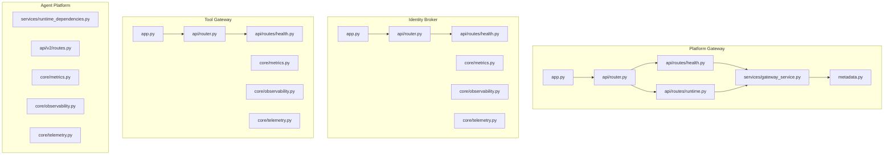
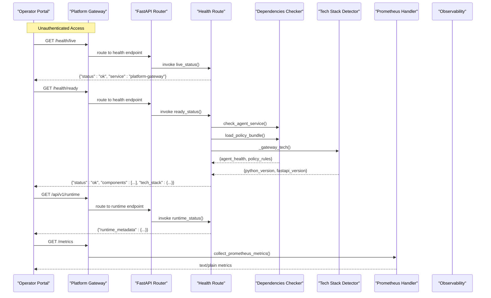
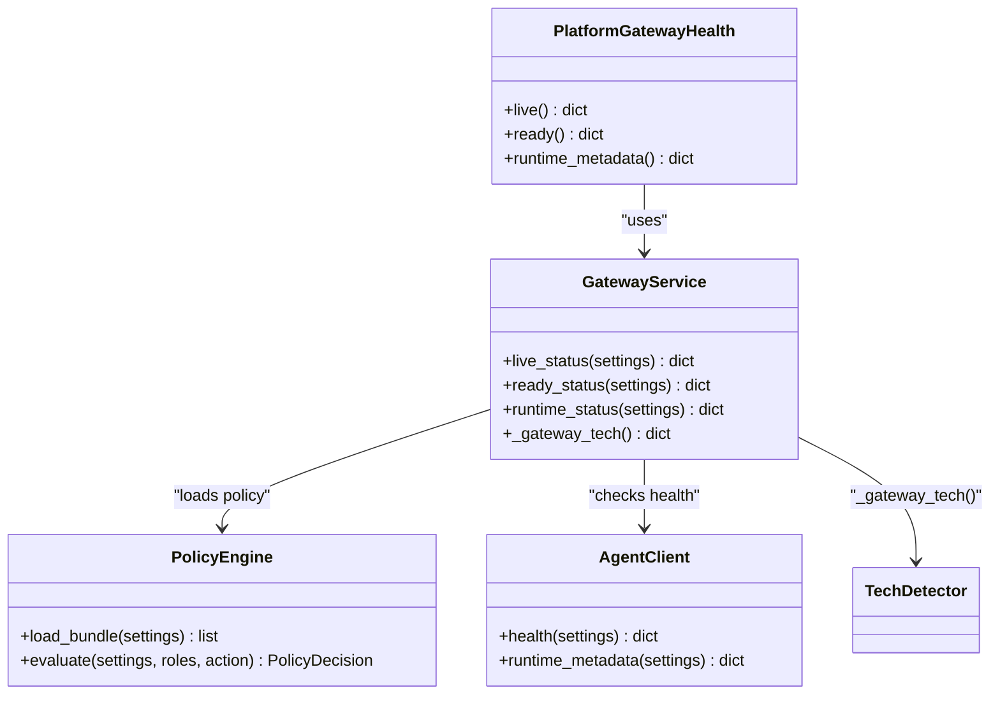
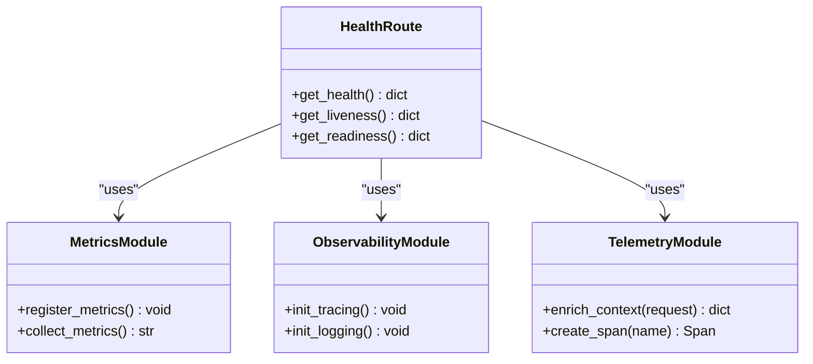
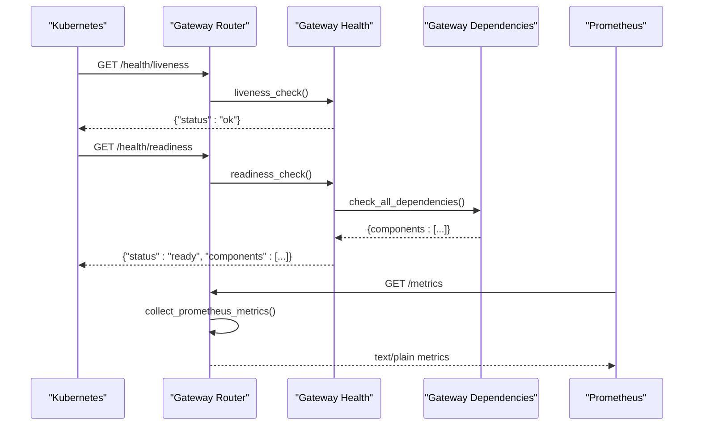
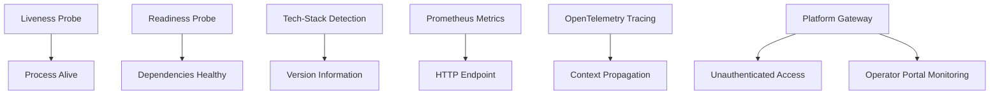
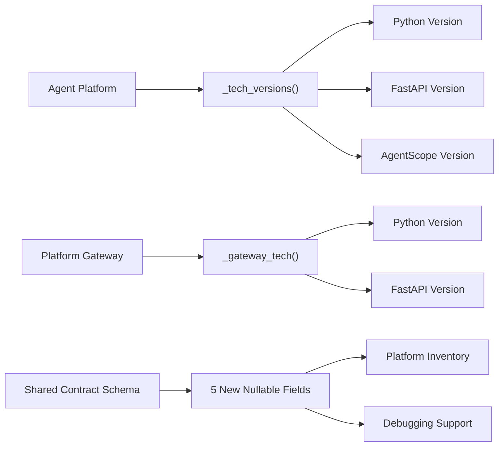
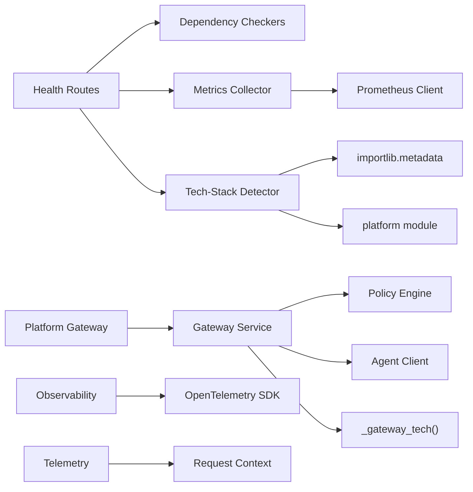

# Health & Monitoring API

<cite>
**Referenced Files in This Document**
- [health.py](file://products/platform-gateway/src/platform_gateway/api/routes/health.py)
- [runtime.py](file://products/platform-gateway/src/platform_gateway/api/routes/runtime.py)
- [router.py](file://products/platform-gateway/src/platform_gateway/api/router.py)
- [gateway_service.py](file://products/platform-gateway/src/platform_gateway/services/gateway_service.py)
- [config.py](file://products/platform-gateway/src/platform_gateway/core/config.py)
- [app.py](file://products/platform-gateway/src/platform_gateway/app.py)
- [metadata.py](file://products/platform-gateway/src/platform_gateway/metadata.py)
- [agent-health.schema.json](file://shared/shared-contracts/schemas/agent-health.schema.json)
- [health-response.schema.json](file://shared/shared-contracts/schemas/health-response.schema.json)
- [routes.py](file://products/agent-platform/src/agent_service/api/v2/routes.py)
- [health.py](file://products/identity-broker/src/identity_service/api/routes/health.py)
- [router.py](file://products/identity-broker/src/identity_service/api/router.py)
- [app.py](file://products/identity-broker/src/identity_service/app.py)
- [metrics.py](file://products/identity-broker/src/identity_service/core/metrics.py)
- [observability.py](file://products/identity-broker/src/identity_service/core/observability.py)
- [telemetry.py](file://products/identity-broker/src/identity_service/core/telemetry.py)
- [health.py](file://products/tool-gateway/src/api_gateway/api/routes/health.py)
- [router.py](file://products/tool-gateway/src/api_gateway/api/router.py)
- [app.py](file://products/tool-gateway/src/api_gateway/app.py)
- [metrics.py](file://products/tool-gateway/src/api_gateway/core/metrics.py)
- [observability.py](file://products/tool-gateway/src/api_gateway/core/observability.py)
- [telemetry.py](file://products/tool-gateway/src/api_gateway/core/telemetry.py)
- [runtime_dependencies.py](file://products/agent-platform/src/agent_service/services/runtime_dependencies.py)
- [metrics.py](file://products/agent-platform/src/agent_service/core/metrics.py)
- [observability.py](file://products/agent-platform/src/agent_service/core/observability.py)
- [telemetry.py](file://products/agent-platform/src/agent_service/core/telemetry.py)
- [observability-conventions.md](file://shared/shared-contracts/observability-conventions.md)
</cite>

## Update Summary
**Changes Made**
- Enhanced health endpoints with optional tech-stack version reporting (Python, FastAPI, AgentScope) through new helper functions
- Added `_tech_versions()` helper function in agent service routes for comprehensive tech-stack version detection
- Added `_gateway_tech()` function in platform gateway service for gateway-specific tech-stack information
- Extended shared contract schema with five new nullable fields for informational-only version reporting
- Updated platform gateway readiness endpoint to include Python and FastAPI version information
- Maintained backward compatibility by making all new version fields nullable and informational only

## Table of Contents
1. [Introduction](#introduction)
2. [Project Structure](#project-structure)
3. [Core Components](#core-components)
4. [Architecture Overview](#architecture-overview)
5. [Detailed Component Analysis](#detailed-component-analysis)
6. [Platform Gateway Health Endpoints](#platform-gateway-health-endpoints)
7. [Enhanced Tech-Stack Version Reporting](#enhanced-tech-stack-version-reporting)
8. [Dependency Analysis](#dependency-analysis)
9. [Performance Considerations](#performance-considerations)
10. [Troubleshooting Guide](#troubleshooting-guide)
11. [Conclusion](#conclusion)
12. [Appendices](#appendices)

## Introduction
This document provides detailed API documentation for health check and monitoring endpoints across the platform services, with enhanced coverage of the new unauthenticated health endpoints exposed by the platform gateway for operator portal component monitoring. It covers REST endpoints for service health status, readiness probes, and liveness checks; Prometheus-compatible metrics exposure; custom health indicators; dependency status reporting; telemetry collection; distributed tracing integration; and observability conventions. The platform gateway now provides real-time visibility into platform component health without authentication overhead, enabling efficient operator portal monitoring with comprehensive tech-stack version reporting.

## Project Structure
The platform exposes health and monitoring capabilities consistently across multiple services, with the platform gateway serving as the primary entry point for unauthenticated monitoring:
- Platform Gateway: Central routing for health endpoints, runtime metadata, and authenticated operations
- Identity Broker: Core identity and authorization health endpoints
- Tool Gateway: Tool execution and policy enforcement health endpoints  
- Agent Platform: Runtime dependencies and agent service health endpoints

**Diagram sources**
- [app.py](file://products/platform-gateway/src/platform_gateway/app.py)
- [router.py](file://products/platform-gateway/src/platform_gateway/api/router.py)
- [health.py](file://products/platform-gateway/src/platform_gateway/api/routes/health.py)
- [runtime.py](file://products/platform-gateway/src/platform_gateway/api/routes/runtime.py)
- [gateway_service.py](file://products/platform-gateway/src/platform_gateway/services/gateway_service.py)
- [metadata.py](file://products/platform-gateway/src/platform_gateway/metadata.py)
- [app.py](file://products/identity-broker/src/identity_service/app.py)
- [router.py](file://products/identity-broker/src/identity_service/api/router.py)
- [health.py](file://products/identity-broker/src/identity_service/api/routes/health.py)
- [app.py](file://products/tool-gateway/src/api_gateway/app.py)
- [router.py](file://products/tool-gateway/src/api_gateway/api/router.py)
- [health.py](file://products/tool-gateway/src/api_gateway/api/routes/health.py)
- [runtime_dependencies.py](file://products/agent-platform/src/agent_service/services/runtime_dependencies.py)
- [routes.py](file://products/agent-platform/src/agent_service/api/v2/routes.py)

**Section sources**
- [health.py](file://products/platform-gateway/src/platform_gateway/api/routes/health.py)
- [runtime.py](file://products/platform-gateway/src/platform_gateway/api/routes/runtime.py)
- [router.py](file://products/platform-gateway/src/platform_gateway/api/router.py)
- [gateway_service.py](file://products/platform-gateway/src/platform_gateway/services/gateway_service.py)
- [metadata.py](file://products/platform-gateway/src/platform_gateway/metadata.py)
- [app.py](file://products/platform-gateway/src/platform_gateway/app.py)

## Core Components
Each service implements a consistent set of components to expose health, metrics, and observability, with the platform gateway providing centralized access:
- Health endpoints: REST routes that return service health status and dependency states
- Metrics exposure: Prometheus-compatible endpoint exposing process and application metrics
- Observability: OpenTelemetry-based tracing and logging setup
- Telemetry: Context propagation and instrumentation helpers
- Platform Gateway: Unauthenticated monitoring endpoints for operator portal integration
- Tech-Stack Version Detection: Optional version reporting for Python, FastAPI, and framework dependencies

Key responsibilities:
- Health endpoints provide liveness/readiness semantics and aggregate dependency statuses
- Platform gateway exposes unauthenticated endpoints for monitoring without authentication overhead
- Tech-stack version detection provides informational-only version information for inventory purposes
- Metrics module registers counters, gauges, histograms, and summary metrics
- Observability initializes tracing providers, propagators, and exporters
- Telemetry provides request context enrichment and span creation utilities

**Section sources**
- [health.py](file://products/platform-gateway/src/platform_gateway/api/routes/health.py)
- [runtime.py](file://products/platform-gateway/src/platform_gateway/api/routes/runtime.py)
- [gateway_service.py](file://products/platform-gateway/src/platform_gateway/services/gateway_service.py)
- [routes.py](file://products/agent-platform/src/agent_service/api/v2/routes.py)
- [health.py](file://products/identity-broker/src/identity_service/api/routes/health.py)
- [metrics.py](file://products/identity-broker/src/identity_service/core/metrics.py)
- [observability.py](file://products/identity-broker/src/identity_service/core/observability.py)
- [telemetry.py](file://products/identity-broker/src/identity_service/core/telemetry.py)
- [health.py](file://products/tool-gateway/src/api_gateway/api/routes/health.py)
- [metrics.py](file://products/tool-gateway/src/api_gateway/core/metrics.py)
- [observability.py](file://products/tool-gateway/src/api_gateway/core/observability.py)
- [telemetry.py](file://products/tool-gateway/src/api_gateway/core/telemetry.py)
- [runtime_dependencies.py](file://products/agent-platform/src/agent_service/services/runtime_dependencies.py)
- [metrics.py](file://products/agent-platform/src/agent_service/core/metrics.py)
- [observability.py](file://products/agent-platform/src/agent_service/core/observability.py)
- [telemetry.py](file://products/agent-platform/src/agent_service/core/telemetry.py)

## Architecture Overview
The health and monitoring architecture follows a layered approach with the platform gateway as the central entry point for unauthenticated monitoring:
- HTTP layer: FastAPI routers register health and metrics endpoints
- Gateway layer: Platform gateway provides unauthenticated access to health and runtime information
- Service layer: Health aggregators query dependencies and compute overall status
- Tech-Stack layer: Optional version detection for Python, FastAPI, and framework dependencies
- Metrics layer: Prometheus client exposes metrics via an HTTP handler
- Observability layer: OpenTelemetry SDK configured per service

**Diagram sources**
- [router.py](file://products/platform-gateway/src/platform_gateway/api/router.py)
- [health.py](file://products/platform-gateway/src/platform_gateway/api/routes/health.py)
- [runtime.py](file://products/platform-gateway/src/platform_gateway/api/routes/runtime.py)
- [gateway_service.py](file://products/platform-gateway/src/platform_gateway/services/gateway_service.py)
- [app.py](file://products/platform-gateway/src/platform_gateway/app.py)

## Detailed Component Analysis

### Platform Gateway Health Endpoints
**Updated** Enhanced with optional tech-stack version reporting

The platform gateway exposes three key unauthenticated endpoints with enhanced tech-stack information:
- Liveness probe (`/health/live`): Returns whether the gateway process is alive and able to serve requests
- Readiness probe (`/health/ready`): Returns whether the gateway is ready to accept traffic (policy bundle loaded, agent service responsive) with tech-stack details
- Runtime metadata (`/api/v1/runtime`): Exposes runtime information including service version and agent service status

Implementation highlights:
- All endpoints are unauthenticated, enabling operator portal monitoring without authentication overhead
- Readiness endpoint performs comprehensive dependency checks including policy bundle loading and agent service connectivity
- Tech-stack version detection provides Python and FastAPI version information for inventory purposes
- Runtime endpoint proxies to agent service for runtime metadata without requiring authentication
- Endpoints follow standard Kubernetes probing patterns for container orchestration compatibility

**Diagram sources**
- [health.py](file://products/platform-gateway/src/platform_gateway/api/routes/health.py)
- [runtime.py](file://products/platform-gateway/src/platform_gateway/api/routes/runtime.py)
- [gateway_service.py](file://products/platform-gateway/src/platform_gateway/services/gateway_service.py)

**Section sources**
- [health.py](file://products/platform-gateway/src/platform_gateway/api/routes/health.py)
- [runtime.py](file://products/platform-gateway/src/platform_gateway/api/routes/runtime.py)
- [gateway_service.py](file://products/platform-gateway/src/platform_gateway/services/gateway_service.py)

### Agent Platform Health Endpoints
**Updated** Enhanced with comprehensive tech-stack version detection

The agent platform now includes a sophisticated tech-stack version detection system:
- Tech-stack version helper (`_tech_versions()`): Best-effort version detection for Python, FastAPI, and AgentScope
- Enhanced health endpoint: Returns comprehensive health status with optional version information
- Backward compatible: All new version fields are nullable and informational only

Implementation highlights:
- Uses `importlib.metadata` for safe package version detection with exception handling
- Provides Python version via `platform.python_version()`
- Detects FastAPI and AgentScope versions with graceful fallback to None
- Integrates with session store and agent state store version detection
- Maintains backward compatibility by making all new fields optional

```mermaid
flowchart TD
Start(["Health Check Entry"]) --> TechVersions["_tech_versions()"]
TechVersions --> PythonVersion["Get Python Version"]
TechVersions --> FastAPICheck["Try import fastapi"]
TechVersions --> AgentScopeCheck["Try import agentscope"]
PythonVersion --> ReturnTech["Return tech dict"]
FastAPICheck --> |Success| FastAPITag["fastapi_version = version"]
FastAPICheck --> |Failure| FastAPINone["fastapi_version = None"]
AgentScopeCheck --> |Success| AgentScopeTag["agentscope_version = version"]
AgentScopeCheck --> |Failure| AgentScopeNone["agentscope_version = None"]
FastAPITag --> ReturnTech
FastAPINone --> ReturnTech
AgentScopeTag --> ReturnTech
AgentScopeNone --> ReturnTech
ReturnTech --> HealthEndpoint["Enhanced Health Endpoint"]
HealthEndpoint --> StoreVersions["Get Store Versions"]
StoreVersions --> FinalResponse["Complete Health Response"]
```

**Diagram sources**
- [routes.py](file://products/agent-platform/src/agent_service/api/v2/routes.py)

**Section sources**
- [routes.py](file://products/agent-platform/src/agent_service/api/v2/routes.py)

### Identity Broker Health Endpoints
- Liveness probe: Returns whether the process is alive and able to serve requests
- Readiness probe: Returns whether the service is ready to accept traffic (dependencies healthy)
- Dependency status: Aggregates health of downstream dependencies (e.g., identity store, token service)

Implementation highlights:
- Health route aggregates component statuses and returns a structured response
- Metrics endpoint exposes process and application metrics
- Observability initializes tracing and logging
- Telemetry enriches request context with trace IDs and correlation data

**Diagram sources**
- [health.py](file://products/identity-broker/src/identity_service/api/routes/health.py)
- [metrics.py](file://products/identity-broker/src/identity_service/core/metrics.py)
- [observability.py](file://products/identity-broker/src/identity_service/core/observability.py)
- [telemetry.py](file://products/identity-broker/src/identity_service/core/telemetry.py)

**Section sources**
- [health.py](file://products/identity-broker/src/identity_service/api/routes/health.py)
- [metrics.py](file://products/identity-broker/src/identity_service/core/metrics.py)
- [observability.py](file://products/identity-broker/src/identity_service/core/observability.py)
- [telemetry.py](file://products/identity-broker/src/identity_service/core/telemetry.py)

### Tool Gateway Health Endpoints
- Liveness probe: Confirms the gateway process is responsive
- Readiness probe: Validates internal state and external connectivity
- Dependency status: Reports on policy engine, agent clients, and tool connectors

Implementation highlights:
- Health route composes dependency checks and returns aggregated status
- Metrics endpoint exposes gateway-specific metrics (request counts, latency)
- Observability configures tracing across gateway boundaries
- Telemetry propagates context between upstream and downstream calls

**Diagram sources**
- [router.py](file://products/tool-gateway/src/api_gateway/api/router.py)
- [health.py](file://products/tool-gateway/src/api_gateway/api/routes/health.py)
- [metrics.py](file://products/tool-gateway/src/api_gateway/core/metrics.py)
- [observability.py](file://products/tool-gateway/src/api_gateway/core/observability.py)
- [telemetry.py](file://products/tool-gateway/src/api_gateway/core/telemetry.py)

**Section sources**
- [health.py](file://products/tool-gateway/src/api_gateway/api/routes/health.py)
- [metrics.py](file://products/tool-gateway/src/api_gateway/core/metrics.py)
- [observability.py](file://products/tool-gateway/src/api_gateway/core/observability.py)
- [telemetry.py](file://products/tool-gateway/src/api_gateway/core/telemetry.py)

### Agent Platform Runtime Dependencies
- Dependency checker: Validates runtime environment and external services
- Health aggregation: Combines runtime checks into a unified status
- Metrics and observability: Expose runtime metrics and traces

**Diagram sources**
- [runtime_dependencies.py](file://products/agent-platform/src/agent_service/services/runtime_dependencies.py)
- [metrics.py](file://products/agent-platform/src/agent_service/core/metrics.py)
- [observability.py](file://products/agent-platform/src/agent_service/core/observability.py)
- [telemetry.py](file://products/agent-platform/src/agent_service/core/telemetry.py)

**Section sources**
- [runtime_dependencies.py](file://products/agent-platform/src/agent_service/services/runtime_dependencies.py)
- [metrics.py](file://products/agent-platform/src/agent_service/core/metrics.py)
- [observability.py](file://products/agent-platform/src/agent_service/core/observability.py)
- [telemetry.py](file://products/agent-platform/src/agent_service/core/telemetry.py)

### Conceptual Overview
The health and monitoring system adheres to standard Kubernetes probing patterns and Prometheus metrics conventions:
- Liveness: Process-level health without dependency checks
- Readiness: Service-level health including dependency validation
- Tech-Stack Detection: Optional version reporting for inventory and debugging
- Metrics: Prometheus exposition format with labels for dimensionality
- Tracing: OpenTelemetry spans propagated across service boundaries
- Platform Gateway: Centralized unauthenticated access for operator monitoring

[No sources needed since this diagram shows conceptual workflow, not actual code structure]

## Platform Gateway Health Endpoints
**New Section** Added comprehensive documentation for platform gateway monitoring endpoints

The platform gateway serves as the primary entry point for unauthenticated health monitoring, providing three key endpoints with enhanced tech-stack information:

### Liveness Endpoint (`/health/live`)
Returns basic process health information without dependency checks:
- **Method**: GET
- **Authentication**: None required
- **Response**: JSON object with service identification and status
- **Use Case**: Container orchestration liveness probes

### Readiness Endpoint (`/health/ready`)  
Performs comprehensive dependency validation with tech-stack information:
- **Method**: GET
- **Authentication**: None required
- **Response**: JSON object with service status, component details, and tech-stack versions
- **Checks**: Policy bundle loading, agent service connectivity, Python/FastAPI versions
- **Use Case**: Container orchestration readiness probes

### Runtime Metadata Endpoint (`/api/v1/runtime`)
Exposes runtime information from the agent service:
- **Method**: GET
- **Authentication**: None required
- **Response**: JSON object with runtime metadata
- **Use Case**: Operator portal runtime visibility

**Section sources**
- [health.py](file://products/platform-gateway/src/platform_gateway/api/routes/health.py)
- [runtime.py](file://products/platform-gateway/src/platform_gateway/api/routes/runtime.py)
- [gateway_service.py](file://products/platform-gateway/src/platform_gateway/services/gateway_service.py)

## Enhanced Tech-Stack Version Reporting
**New Section** Documentation for the new tech-stack version detection capabilities

The platform now includes comprehensive tech-stack version reporting across multiple services, providing valuable inventory and debugging information while maintaining backward compatibility.

### Agent Platform Tech-Stack Detection
The agent platform implements a sophisticated tech-stack version detection system through the `_tech_versions()` helper function:

**Features:**
- **Python Version Detection**: Uses `platform.python_version()` for accurate Python interpreter version
- **Framework Version Detection**: Safely detects FastAPI and AgentScope versions using `importlib.metadata`
- **Graceful Fallback**: Returns `None` for any version that cannot be detected, never raising exceptions
- **Backward Compatibility**: All new version fields are nullable and informational-only

**Implementation Details:**
- Uses try-catch blocks around package imports to handle missing dependencies
- Leverages `importlib.metadata.version()` for reliable package version detection
- Integrates with session store and agent state store version detection
- Maintains existing health check behavior while adding version information

### Platform Gateway Tech-Stack Information
The platform gateway provides simplified tech-stack information through the `_gateway_tech()` function:

**Features:**
- **Python Version**: Reports the Python interpreter version running the gateway
- **FastAPI Version**: Reports the FastAPI framework version for consistency
- **Minimal Overhead**: Lightweight version detection with no external dependencies
- **Integration**: Seamlessly integrated into readiness endpoint responses

### Shared Contract Schema Updates
The shared contract schemas have been extended with five new nullable fields:

**Agent Health Schema Extensions:**
- `python_version`: Informational tech-stack version (string or null)
- `fastapi_version`: Informational tech-stack version (string or null) 
- `agentscope_version`: Informational tech-stack version (string or null, null in non-agentscope modes)
- `session_store_version`: Session store server version when available (string or null)
- `agent_state_version`: Agent state store server version when available (string or null)

**Design Principles:**
- **Informational Only**: Version fields never affect health status or readiness decisions
- **Nullable Fields**: All new fields support null values for backward compatibility
- **Best-Effort Detection**: Version detection failures result in null values, not errors
- **Inventory Focus**: Designed for platform inventory and debugging, not operational logic

**Diagram sources**
- [routes.py](file://products/agent-platform/src/agent_service/api/v2/routes.py)
- [gateway_service.py](file://products/platform-gateway/src/platform_gateway/services/gateway_service.py)
- [agent-health.schema.json](file://shared/shared-contracts/schemas/agent-health.schema.json)

**Section sources**
- [routes.py](file://products/agent-platform/src/agent_service/api/v2/routes.py)
- [gateway_service.py](file://products/platform-gateway/src/platform_gateway/services/gateway_service.py)
- [agent-health.schema.json](file://shared/shared-contracts/schemas/agent-health.schema.json)

## Dependency Analysis
The services depend on shared observability conventions and implement consistent patterns, with the platform gateway providing centralized access:
- Health routes depend on dependency checkers and metrics collectors
- Platform gateway routes depend on gateway service functions for health aggregation
- Tech-stack detection depends on Python standard library and optional third-party packages
- Metrics modules depend on Prometheus client libraries
- Observability modules depend on OpenTelemetry SDK
- Telemetry modules provide context enrichment and span utilities

**Diagram sources**
- [health.py](file://products/platform-gateway/src/platform_gateway/api/routes/health.py)
- [runtime.py](file://products/platform-gateway/src/platform_gateway/api/routes/runtime.py)
- [gateway_service.py](file://products/platform-gateway/src/platform_gateway/services/gateway_service.py)
- [routes.py](file://products/agent-platform/src/agent_service/api/v2/routes.py)
- [health.py](file://products/identity-broker/src/identity_service/api/routes/health.py)
- [metrics.py](file://products/identity-broker/src/identity_service/core/metrics.py)
- [observability.py](file://products/identity-broker/src/identity_service/core/observability.py)
- [telemetry.py](file://products/identity-broker/src/identity_service/core/telemetry.py)
- [health.py](file://products/tool-gateway/src/api_gateway/api/routes/health.py)
- [metrics.py](file://products/tool-gateway/src/api_gateway/core/metrics.py)
- [observability.py](file://products/tool-gateway/src/api_gateway/core/observability.py)
- [telemetry.py](file://products/tool-gateway/src/api_gateway/core/telemetry.py)
- [runtime_dependencies.py](file://products/agent-platform/src/agent_service/services/runtime_dependencies.py)

**Section sources**
- [health.py](file://products/platform-gateway/src/platform_gateway/api/routes/health.py)
- [runtime.py](file://products/platform-gateway/src/platform_gateway/api/routes/runtime.py)
- [gateway_service.py](file://products/platform-gateway/src/platform_gateway/services/gateway_service.py)
- [routes.py](file://products/agent-platform/src/agent_service/api/v2/routes.py)
- [health.py](file://products/identity-broker/src/identity_service/api/routes/health.py)
- [metrics.py](file://products/identity-broker/src/identity_service/core/metrics.py)
- [observability.py](file://products/identity-broker/src/identity_service/core/observability.py)
- [telemetry.py](file://products/identity-broker/src/identity_service/core/telemetry.py)
- [health.py](file://products/tool-gateway/src/api_gateway/api/routes/health.py)
- [metrics.py](file://products/tool-gateway/src/api_gateway/core/metrics.py)
- [observability.py](file://products/tool-gateway/src/api_gateway/core/observability.py)
- [telemetry.py](file://products/tool-gateway/src/api_gateway/core/telemetry.py)
- [runtime_dependencies.py](file://products/agent-platform/src/agent_service/services/runtime_dependencies.py)

## Performance Considerations
- Health checks should be lightweight and avoid blocking operations
- Platform gateway endpoints are designed for low-latency monitoring queries
- Tech-stack version detection uses best-effort approaches with minimal overhead
- Version detection failures are handled gracefully without impacting performance
- Metrics collection should use efficient data structures and avoid excessive allocations
- Tracing overhead can be controlled via sampling strategies
- Dependency checks should implement timeouts and circuit breakers
- Resource utilization metrics should be exposed for CPU, memory, and I/O
- Unauthenticated endpoints reduce authentication overhead for frequent monitoring queries

## Troubleshooting Guide
Common issues and resolution steps:
- Health check failures: Inspect dependency status responses for specific component failures
- Platform gateway readiness issues: Check policy bundle loading and agent service connectivity
- Missing tech-stack versions: Verify Python environment and package installations
- Metrics not available: Verify Prometheus scraping configuration and endpoint accessibility
- Missing traces: Check OpenTelemetry exporter configuration and network connectivity
- High latency: Analyze histogram metrics and trace spans to identify bottlenecks

Diagnostic workflows:
- Use platform gateway health endpoints for quick service status checks without authentication
- Query `/health/ready` to validate complete platform health including dependencies and tech-stack info
- Use `/api/v1/runtime` for runtime metadata without authentication overhead
- Monitor platform gateway logs for policy loading and agent service communication errors
- Configure operator portal to poll health endpoints at appropriate intervals
- Check tech-stack version fields for environment consistency across deployments

**Section sources**
- [health.py](file://products/platform-gateway/src/platform_gateway/api/routes/health.py)
- [runtime.py](file://products/platform-gateway/src/platform_gateway/api/routes/runtime.py)
- [gateway_service.py](file://products/platform-gateway/src/platform_gateway/services/gateway_service.py)
- [routes.py](file://products/agent-platform/src/agent_service/api/v2/routes.py)
- [health.py](file://products/identity-broker/src/identity_service/api/routes/health.py)
- [metrics.py](file://products/identity-broker/src/identity_service/core/metrics.py)
- [observability.py](file://products/identity-broker/src/identity_service/core/observability.py)
- [telemetry.py](file://products/identity-broker/src/identity_service/core/telemetry.py)
- [health.py](file://products/tool-gateway/src/api_gateway/api/routes/health.py)
- [metrics.py](file://products/tool-gateway/src/api_gateway/core/metrics.py)
- [observability.py](file://products/tool-gateway/src/api_gateway/core/observability.py)
- [telemetry.py](file://products/tool-gateway/src/api_gateway/core/telemetry.py)
- [runtime_dependencies.py](file://products/agent-platform/src/agent_service/services/runtime_dependencies.py)

## Conclusion
The platform provides comprehensive health and monitoring capabilities through standardized endpoints, with the platform gateway serving as the central entry point for unauthenticated monitoring. The enhanced tech-stack version reporting adds valuable inventory and debugging capabilities while maintaining full backward compatibility. The new unauthenticated health endpoints enable efficient operator portal monitoring without authentication overhead, while maintaining security for sensitive operations. Each service implements consistent patterns for health checks, dependency reporting, tech-stack version detection, and telemetry collection, enabling effective monitoring, alerting, and troubleshooting across the distributed system.

## Appendices

### API Reference
**Updated** Added platform gateway endpoints and enhanced tech-stack version reporting

- Platform Gateway Health Endpoints:
  - GET /health/live: Returns process liveness status (unauthenticated)
  - GET /health/ready: Returns service readiness with dependency details and tech-stack info (unauthenticated)
  - GET /api/v1/runtime: Returns runtime metadata (unauthenticated)
- Agent Platform Health Endpoints:
  - GET /health: Returns comprehensive health status with tech-stack versions (v2-conformant)
  - Enhanced with python_version, fastapi_version, agentscope_version fields
- Other Service Health Endpoints:
  - GET /health: Returns overall service health and component statuses
  - GET /health/liveness: Returns process liveness status
  - GET /health/readiness: Returns service readiness with dependency details
- Metrics endpoint:
  - GET /metrics: Prometheus-compatible metrics exposition

### Implementation Examples
- Implementing health checks:
  - Create dependency check functions that return status objects
  - Aggregate dependency results in health endpoint handlers
  - Include timeout handling and error recovery
  - Add tech-stack version detection using best-effort approaches
- Configuring monitoring dashboards:
  - Import Prometheus metrics into Grafana dashboards
  - Create panels for key performance indicators
  - Set up alerts based on metric thresholds
  - Display tech-stack version information for inventory tracking
- Setting up alerting rules:
  - Define rules for health check failures
  - Configure alerts for high error rates and latency
  - Implement escalation policies for critical conditions
  - Alert on tech-stack version inconsistencies across deployments
- Operator portal integration:
  - Poll platform gateway health endpoints at regular intervals
  - Display real-time platform component status
  - Implement fallback mechanisms for endpoint unavailability
  - Show tech-stack versions for platform inventory

### Observability Conventions
- Trace naming conventions for consistent span identification
- Log correlation using trace IDs and span IDs
- Metric labeling standards for dimensional analysis
- Error handling patterns for observability data
- Platform gateway monitoring patterns for unauthenticated access
- Tech-stack version reporting conventions for inventory and debugging

**Section sources**
- [observability-conventions.md](file://shared/shared-contracts/observability-conventions.md)
- [health.py](file://products/platform-gateway/src/platform_gateway/api/routes/health.py)
- [runtime.py](file://products/platform-gateway/src/platform_gateway/api/routes/runtime.py)
- [gateway_service.py](file://products/platform-gateway/src/platform_gateway/services/gateway_service.py)
- [routes.py](file://products/agent-platform/src/agent_service/api/v2/routes.py)
- [agent-health.schema.json](file://shared/shared-contracts/schemas/agent-health.schema.json)