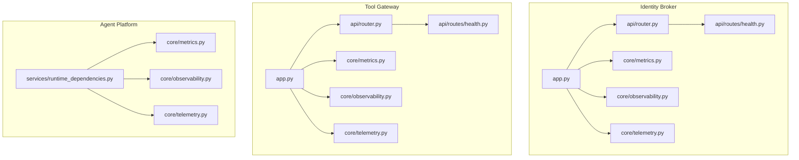
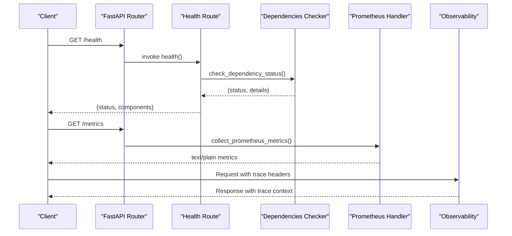
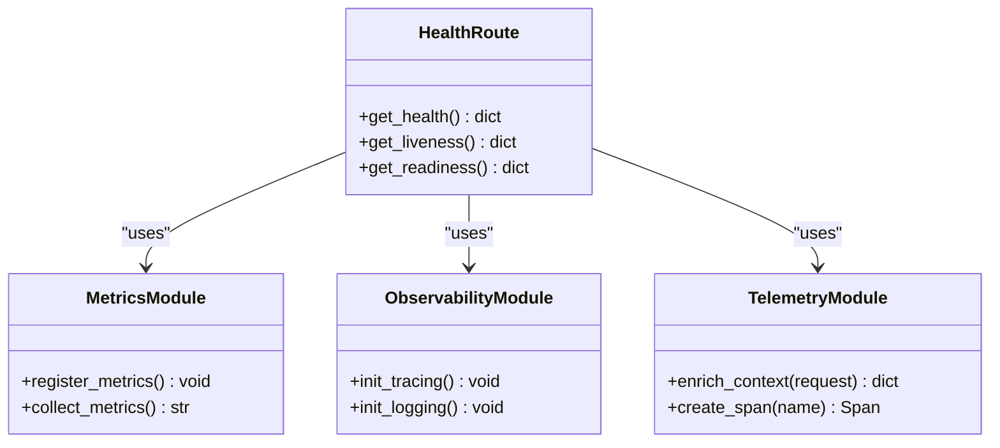
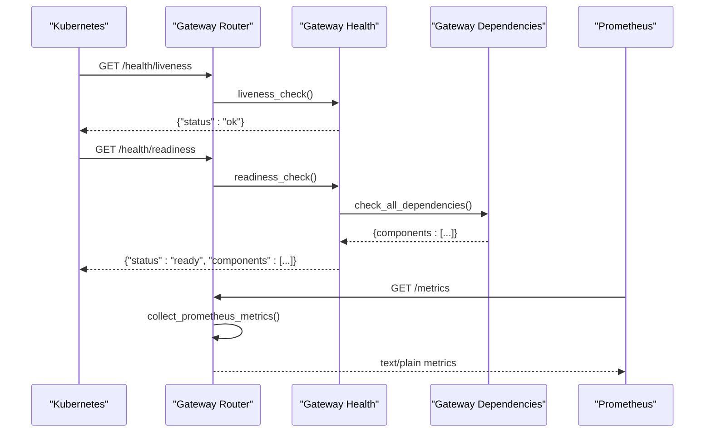
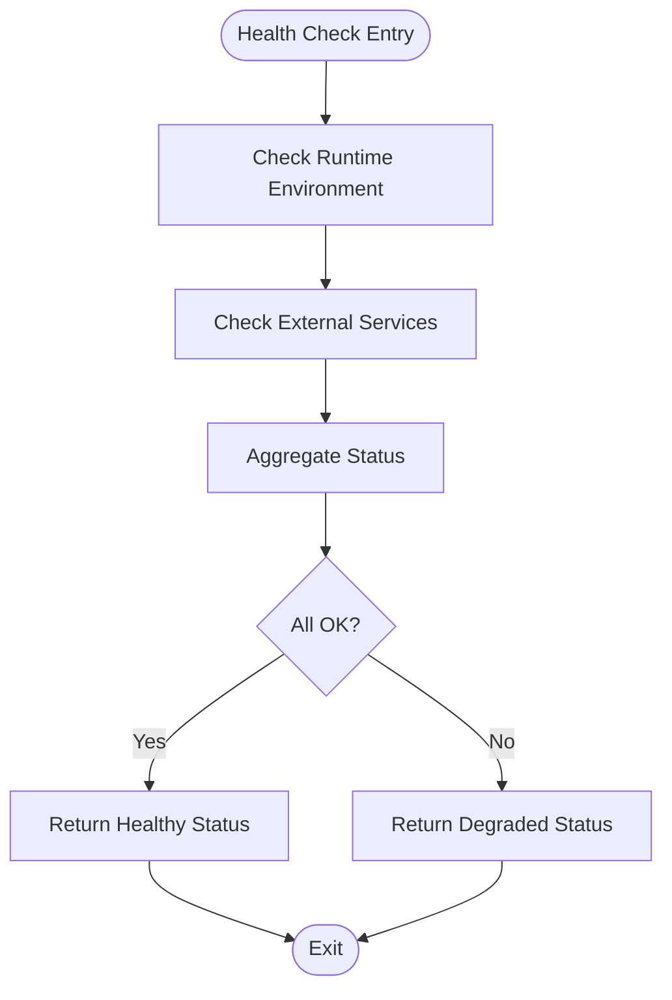
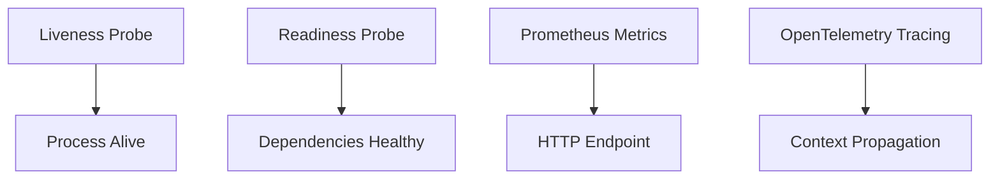
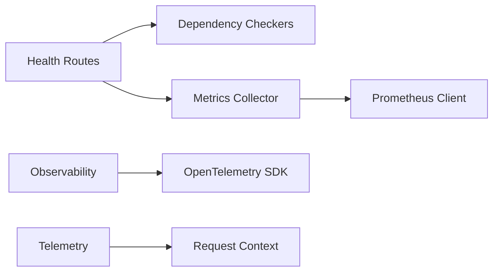

# Health & Monitoring API

<cite>
**Referenced Files in This Document**
- [health.py](file://products/identity-broker/src/identity_service/api/routes/health.py)
- [router.py](file://products/identity-broker/src/identity_service/api/router.py)
- [app.py](file://products/identity-broker/src/identity_service/app.py)
- [metrics.py](file://products/identity-broker/src/identity_service/core/metrics.py)
- [observability.py](file://products/identity-broker/src/identity_service/core/observability.py)
- [telemetry.py](file://products/identity-broker/src/identity_service/core/telemetry.py)
- [health.py](file://products/tool-gateway/src/api_gateway/api/routes/health.py)
- [router.py](file://products/tool-gateway/src/api_gateway/api/router.py)
- [app.py](file://products/tool-gateway/src/api_gateway/app.py)
- [metrics.py](file://products/tool-gateway/src/api_gateway/core/metrics.py)
- [observability.py](file://products/tool-gateway/src/api_gateway/core/observability.py)
- [telemetry.py](file://products/tool-gateway/src/api_gateway/core/telemetry.py)
- [runtime_dependencies.py](file://products/agent-platform/src/agent_service/services/runtime_dependencies.py)
- [metrics.py](file://products/agent-platform/src/agent_service/core/metrics.py)
- [observability.py](file://products/agent-platform/src/agent_service/core/observability.py)
- [telemetry.py](file://products/agent-platform/src/agent_service/core/telemetry.py)
- [observability-conventions.md](file://shared/shared-contracts/observability-conventions.md)
</cite>

## Table of Contents
1. [Introduction](#introduction)
2. [Project Structure](#project-structure)
3. [Core Components](#core-components)
4. [Architecture Overview](#architecture-overview)
5. [Detailed Component Analysis](#detailed-component-analysis)
6. [Dependency Analysis](#dependency-analysis)
7. [Performance Considerations](#performance-considerations)
8. [Troubleshooting Guide](#troubleshooting-guide)
9. [Conclusion](#conclusion)
10. [Appendices](#appendices)

## Introduction
This document provides detailed API documentation for health check and monitoring endpoints across the platform services. It covers REST endpoints for service health status, readiness probes, and liveness checks; Prometheus-compatible metrics exposure; custom health indicators; dependency status reporting; telemetry collection; distributed tracing integration; and observability conventions. It also includes examples for implementing health checks, configuring monitoring dashboards, and setting up alerting rules, along with performance metrics, resource utilization tracking, and troubleshooting workflows using monitoring APIs.

## Project Structure
The platform exposes health and monitoring capabilities consistently across multiple services:
- Identity Broker: health routes, metrics, observability, and telemetry modules
- Tool Gateway: health routes, metrics, observability, and telemetry modules
- Agent Platform: runtime dependencies, metrics, observability, and telemetry modules

**Diagram sources**
- [app.py](file://products/identity-broker/src/identity_service/app.py)
- [router.py](file://products/identity-broker/src/identity_service/api/router.py)
- [health.py](file://products/identity-broker/src/identity_service/api/routes/health.py)
- [metrics.py](file://products/identity-broker/src/identity_service/core/metrics.py)
- [observability.py](file://products/identity-broker/src/identity_service/core/observability.py)
- [telemetry.py](file://products/identity-broker/src/identity_service/core/telemetry.py)
- [app.py](file://products/tool-gateway/src/api_gateway/app.py)
- [router.py](file://products/tool-gateway/src/api_gateway/api/router.py)
- [health.py](file://products/tool-gateway/src/api_gateway/api/routes/health.py)
- [metrics.py](file://products/tool-gateway/src/api_gateway/core/metrics.py)
- [observability.py](file://products/tool-gateway/src/api_gateway/core/observability.py)
- [telemetry.py](file://products/tool-gateway/src/api_gateway/core/telemetry.py)
- [runtime_dependencies.py](file://products/agent-platform/src/agent_service/services/runtime_dependencies.py)
- [metrics.py](file://products/agent-platform/src/agent_service/core/metrics.py)
- [observability.py](file://products/agent-platform/src/agent_service/core/observability.py)
- [telemetry.py](file://products/agent-platform/src/agent_service/core/telemetry.py)

**Section sources**
- [health.py](file://products/identity-broker/src/identity_service/api/routes/health.py)
- [router.py](file://products/identity-broker/src/identity_service/api/router.py)
- [app.py](file://products/identity-broker/src/identity_service/app.py)
- [metrics.py](file://products/identity-broker/src/identity_service/core/metrics.py)
- [observability.py](file://products/identity-broker/src/identity_service/core/observability.py)
- [telemetry.py](file://products/identity-broker/src/identity_service/core/telemetry.py)
- [health.py](file://products/tool-gateway/src/api_gateway/api/routes/health.py)
- [router.py](file://products/tool-gateway/src/api_gateway/api/router.py)
- [app.py](file://products/tool-gateway/src/api_gateway/app.py)
- [metrics.py](file://products/tool-gateway/src/api_gateway/core/metrics.py)
- [observability.py](file://products/tool-gateway/src/api_gateway/core/observability.py)
- [telemetry.py](file://products/tool-gateway/src/api_gateway/core/telemetry.py)
- [runtime_dependencies.py](file://products/agent-platform/src/agent_service/services/runtime_dependencies.py)
- [metrics.py](file://products/agent-platform/src/agent_service/core/metrics.py)
- [observability.py](file://products/agent-platform/src/agent_service/core/observability.py)
- [telemetry.py](file://products/agent-platform/src/agent_service/core/telemetry.py)

## Core Components
Each service implements a consistent set of components to expose health, metrics, and observability:
- Health endpoints: REST routes that return service health status and dependency states
- Metrics exposure: Prometheus-compatible endpoint exposing process and application metrics
- Observability: OpenTelemetry-based tracing and logging setup
- Telemetry: Context propagation and instrumentation helpers

Key responsibilities:
- Health endpoints provide liveness/readiness semantics and aggregate dependency statuses
- Metrics module registers counters, gauges, histograms, and summary metrics
- Observability initializes tracing providers, propagators, and exporters
- Telemetry provides request context enrichment and span creation utilities

**Section sources**
- [health.py](file://products/identity-broker/src/identity_service/api/routes/health.py)
- [metrics.py](file://products/identity-broker/src/identity_service/core/metrics.py)
- [observability.py](file://products/identity-broker/src/identity_service/core/observability.py)
- [telemetry.py](file://products/identity-broker/src/identity_service/core/telemetry.py)
- [health.py](file://products/tool-gateway/src/api_gateway/api/routes/health.py)
- [metrics.py](file://products/tool-gateway/src/api_gateway/core/metrics.py)
- [observability.py](file://products/tool-gateway/src/api_gateway/core/observability.py)
- [telemetry.py](file://products/tool-gateway/src/api_gateway/core/telemetry.py)
- [runtime_dependencies.py](file://products/agent-platform/src/agent_service/services/runtime_dependencies.py)
- [metrics.py](file://products/agent-platform/src/agent_service/core/metrics.py)
- [observability.py](file://products/agent-platform/src/agent_service/core/observability.py)
- [telemetry.py](file://products/agent-platform/src/agent_service/core/telemetry.py)

## Architecture Overview
The health and monitoring architecture follows a layered approach:
- HTTP layer: FastAPI routers register health and metrics endpoints
- Service layer: Health aggregators query dependencies and compute overall status
- Metrics layer: Prometheus client exposes metrics via an HTTP handler
- Observability layer: OpenTelemetry SDK configured per service

**Diagram sources**
- [router.py](file://products/identity-broker/src/identity_service/api/router.py)
- [health.py](file://products/identity-broker/src/identity_service/api/routes/health.py)
- [metrics.py](file://products/identity-broker/src/identity_service/core/metrics.py)
- [observability.py](file://products/identity-broker/src/identity_service/core/observability.py)
- [router.py](file://products/tool-gateway/src/api_gateway/api/router.py)
- [health.py](file://products/tool-gateway/src/api_gateway/api/routes/health.py)
- [metrics.py](file://products/tool-gateway/src/api_gateway/core/metrics.py)
- [observability.py](file://products/tool-gateway/src/api_gateway/core/observability.py)

## Detailed Component Analysis

### Identity Broker Health Endpoints
- Liveness probe: Returns whether the process is alive and able to serve requests
- Readiness probe: Returns whether the service is ready to accept traffic (dependencies healthy)
- Dependency status: Aggregates health of downstream dependencies (e.g., identity store, token service)

Implementation highlights:
- Health route aggregates component statuses and returns a structured response
- Metrics endpoint exposes process and application metrics
- Observability initializes tracing and logging
- Telemetry enriches request context with trace IDs and correlation data

**Diagram sources**
- [health.py](file://products/identity-broker/src/identity_service/api/routes/health.py)
- [metrics.py](file://products/identity-broker/src/identity_service/core/metrics.py)
- [observability.py](file://products/identity-broker/src/identity_service/core/observability.py)
- [telemetry.py](file://products/identity-broker/src/identity_service/core/telemetry.py)

**Section sources**
- [health.py](file://products/identity-broker/src/identity_service/api/routes/health.py)
- [metrics.py](file://products/identity-broker/src/identity_service/core/metrics.py)
- [observability.py](file://products/identity-broker/src/identity_service/core/observability.py)
- [telemetry.py](file://products/identity-broker/src/identity_service/core/telemetry.py)

### Tool Gateway Health Endpoints
- Liveness probe: Confirms the gateway process is responsive
- Readiness probe: Validates internal state and external connectivity
- Dependency status: Reports on policy engine, agent clients, and tool connectors

Implementation highlights:
- Health route composes dependency checks and returns aggregated status
- Metrics endpoint exposes gateway-specific metrics (request counts, latency)
- Observability configures tracing across gateway boundaries
- Telemetry propagates context between upstream and downstream calls

**Diagram sources**
- [router.py](file://products/tool-gateway/src/api_gateway/api/router.py)
- [health.py](file://products/tool-gateway/src/api_gateway/api/routes/health.py)
- [metrics.py](file://products/tool-gateway/src/api_gateway/core/metrics.py)
- [observability.py](file://products/tool-gateway/src/api_gateway/core/observability.py)
- [telemetry.py](file://products/tool-gateway/src/api_gateway/core/telemetry.py)

**Section sources**
- [health.py](file://products/tool-gateway/src/api_gateway/api/routes/health.py)
- [metrics.py](file://products/tool-gateway/src/api_gateway/core/metrics.py)
- [observability.py](file://products/tool-gateway/src/api_gateway/core/observability.py)
- [telemetry.py](file://products/tool-gateway/src/api_gateway/core/telemetry.py)

### Agent Platform Runtime Dependencies
- Dependency checker: Validates runtime environment and external services
- Health aggregation: Combines runtime checks into a unified status
- Metrics and observability: Expose runtime metrics and traces

**Diagram sources**
- [runtime_dependencies.py](file://products/agent-platform/src/agent_service/services/runtime_dependencies.py)
- [metrics.py](file://products/agent-platform/src/agent_service/core/metrics.py)
- [observability.py](file://products/agent-platform/src/agent_service/core/observability.py)
- [telemetry.py](file://products/agent-platform/src/agent_service/core/telemetry.py)

**Section sources**
- [runtime_dependencies.py](file://products/agent-platform/src/agent_service/services/runtime_dependencies.py)
- [metrics.py](file://products/agent-platform/src/agent_service/core/metrics.py)
- [observability.py](file://products/agent-platform/src/agent_service/core/observability.py)
- [telemetry.py](file://products/agent-platform/src/agent_service/core/telemetry.py)

### Conceptual Overview
The health and monitoring system adheres to standard Kubernetes probing patterns and Prometheus metrics conventions:
- Liveness: Process-level health without dependency checks
- Readiness: Service-level health including dependency validation
- Metrics: Prometheus exposition format with labels for dimensionality
- Tracing: OpenTelemetry spans propagated across service boundaries

[No sources needed since this diagram shows conceptual workflow, not actual code structure]

## Dependency Analysis
The services depend on shared observability conventions and implement consistent patterns:
- Health routes depend on dependency checkers and metrics collectors
- Metrics modules depend on Prometheus client libraries
- Observability modules depend on OpenTelemetry SDK
- Telemetry modules provide context enrichment and span utilities

**Diagram sources**
- [health.py](file://products/identity-broker/src/identity_service/api/routes/health.py)
- [metrics.py](file://products/identity-broker/src/identity_service/core/metrics.py)
- [observability.py](file://products/identity-broker/src/identity_service/core/observability.py)
- [telemetry.py](file://products/identity-broker/src/identity_service/core/telemetry.py)
- [health.py](file://products/tool-gateway/src/api_gateway/api/routes/health.py)
- [metrics.py](file://products/tool-gateway/src/api_gateway/core/metrics.py)
- [observability.py](file://products/tool-gateway/src/api_gateway/core/observability.py)
- [telemetry.py](file://products/tool-gateway/src/api_gateway/core/telemetry.py)
- [runtime_dependencies.py](file://products/agent-platform/src/agent_service/services/runtime_dependencies.py)

**Section sources**
- [health.py](file://products/identity-broker/src/identity_service/api/routes/health.py)
- [metrics.py](file://products/identity-broker/src/identity_service/core/metrics.py)
- [observability.py](file://products/identity-broker/src/identity_service/core/observability.py)
- [telemetry.py](file://products/identity-broker/src/identity_service/core/telemetry.py)
- [health.py](file://products/tool-gateway/src/api_gateway/api/routes/health.py)
- [metrics.py](file://products/tool-gateway/src/api_gateway/core/metrics.py)
- [observability.py](file://products/tool-gateway/src/api_gateway/core/observability.py)
- [telemetry.py](file://products/tool-gateway/src/api_gateway/core/telemetry.py)
- [runtime_dependencies.py](file://products/agent-platform/src/agent_service/services/runtime_dependencies.py)

## Performance Considerations
- Health checks should be lightweight and avoid blocking operations
- Metrics collection should use efficient data structures and avoid excessive allocations
- Tracing overhead can be controlled via sampling strategies
- Dependency checks should implement timeouts and circuit breakers
- Resource utilization metrics should be exposed for CPU, memory, and I/O

[No sources needed since this section provides general guidance]

## Troubleshooting Guide
Common issues and resolution steps:
- Health check failures: Inspect dependency status responses for specific component failures
- Metrics not available: Verify Prometheus scraping configuration and endpoint accessibility
- Missing traces: Check OpenTelemetry exporter configuration and network connectivity
- High latency: Analyze histogram metrics and trace spans to identify bottlenecks

Diagnostic workflows:
- Use health endpoints to validate service state and dependency health
- Query metrics endpoints for quantitative insights into performance
- Correlate traces with logs using trace IDs from telemetry context
- Review observability configurations for correct exporter settings

**Section sources**
- [health.py](file://products/identity-broker/src/identity_service/api/routes/health.py)
- [metrics.py](file://products/identity-broker/src/identity_service/core/metrics.py)
- [observability.py](file://products/identity-broker/src/identity_service/core/observability.py)
- [telemetry.py](file://products/identity-broker/src/identity_service/core/telemetry.py)
- [health.py](file://products/tool-gateway/src/api_gateway/api/routes/health.py)
- [metrics.py](file://products/tool-gateway/src/api_gateway/core/metrics.py)
- [observability.py](file://products/tool-gateway/src/api_gateway/core/observability.py)
- [telemetry.py](file://products/tool-gateway/src/api_gateway/core/telemetry.py)
- [runtime_dependencies.py](file://products/agent-platform/src/agent_service/services/runtime_dependencies.py)

## Conclusion
The platform provides comprehensive health and monitoring capabilities through standardized endpoints, metrics exposure, and observability integrations. Each service implements consistent patterns for health checks, dependency reporting, and telemetry collection, enabling effective monitoring, alerting, and troubleshooting across the distributed system.

[No sources needed since this section summarizes without analyzing specific files]

## Appendices

### API Reference
- Health endpoints:
  - GET /health: Returns overall service health and component statuses
  - GET /health/liveness: Returns process liveness status
  - GET /health/readiness: Returns service readiness with dependency details
- Metrics endpoint:
  - GET /metrics: Prometheus-compatible metrics exposition

### Implementation Examples
- Implementing health checks:
  - Create dependency check functions that return status objects
  - Aggregate dependency results in health endpoint handlers
  - Include timeout handling and error recovery
- Configuring monitoring dashboards:
  - Import Prometheus metrics into Grafana dashboards
  - Create panels for key performance indicators
  - Set up alerts based on metric thresholds
- Setting up alerting rules:
  - Define rules for health check failures
  - Configure alerts for high error rates and latency
  - Implement escalation policies for critical conditions

### Observability Conventions
- Trace naming conventions for consistent span identification
- Log correlation using trace IDs and span IDs
- Metric labeling standards for dimensional analysis
- Error handling patterns for observability data

**Section sources**
- [observability-conventions.md](file://shared/shared-contracts/observability-conventions.md)