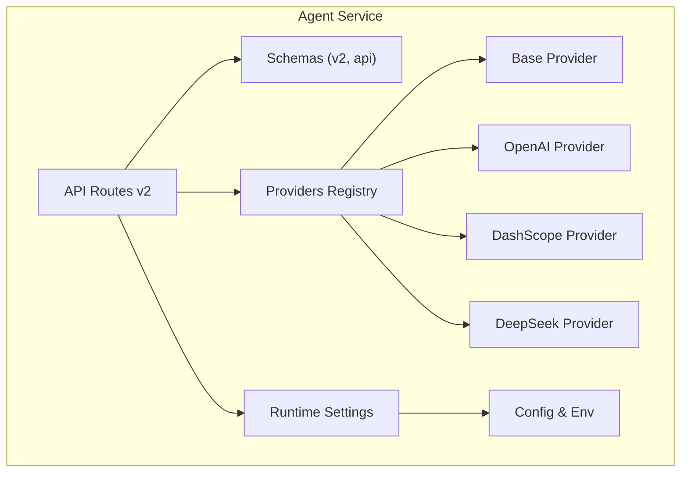
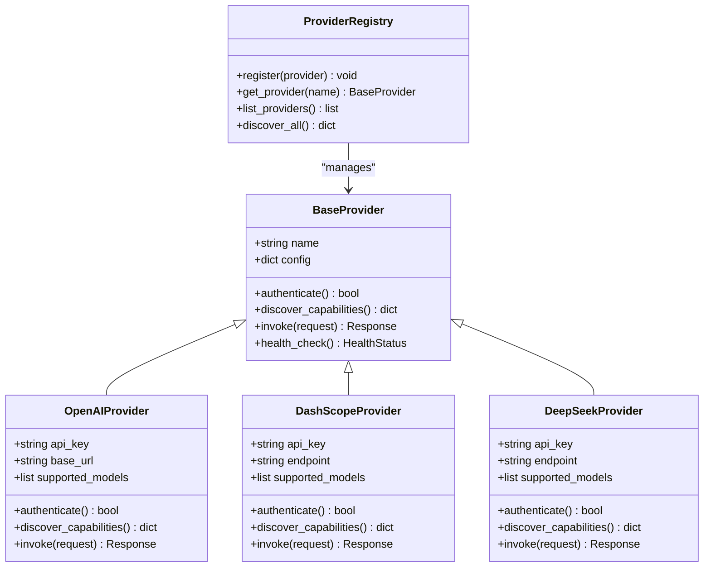
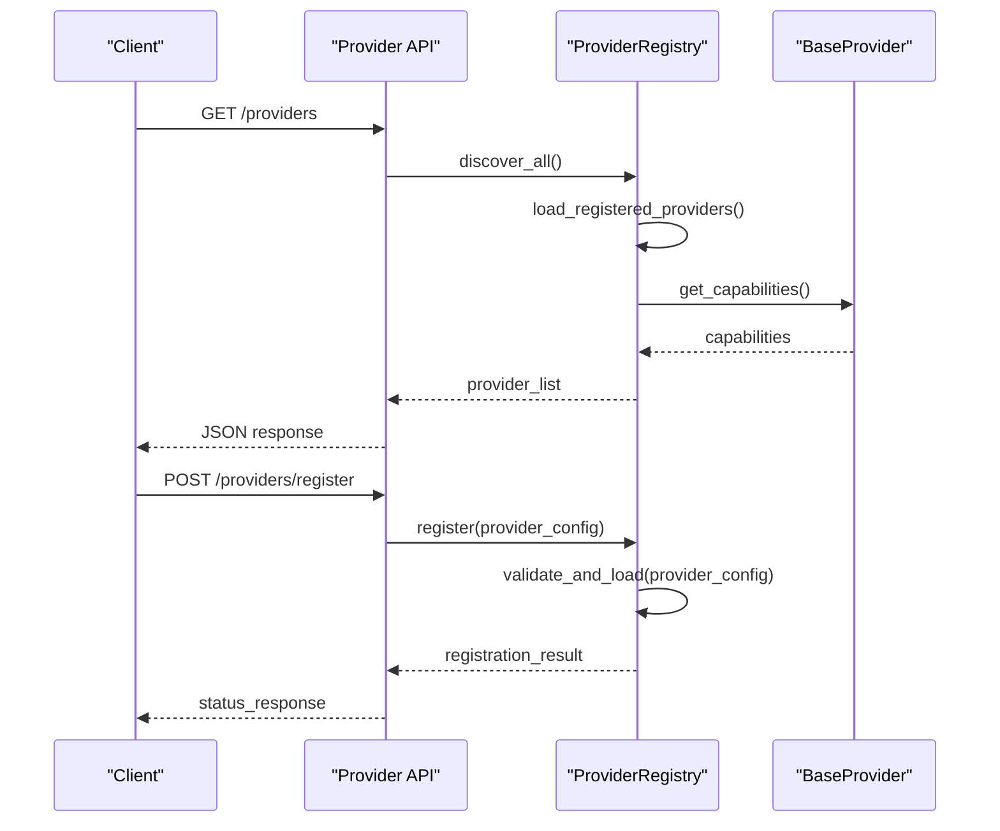
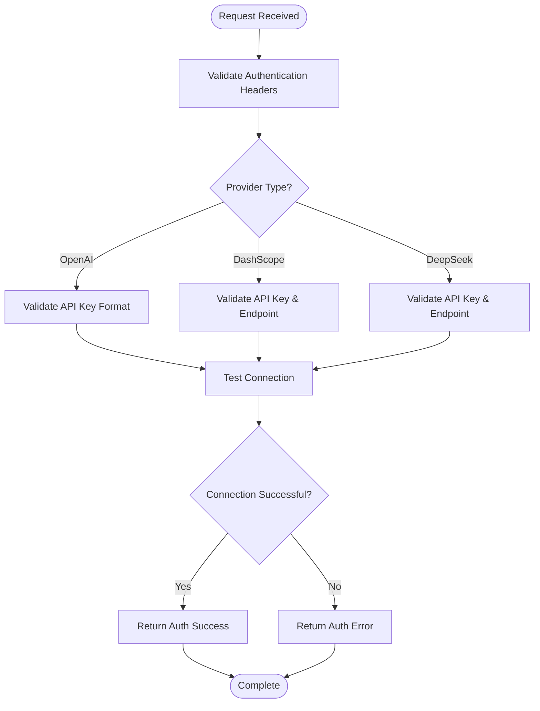
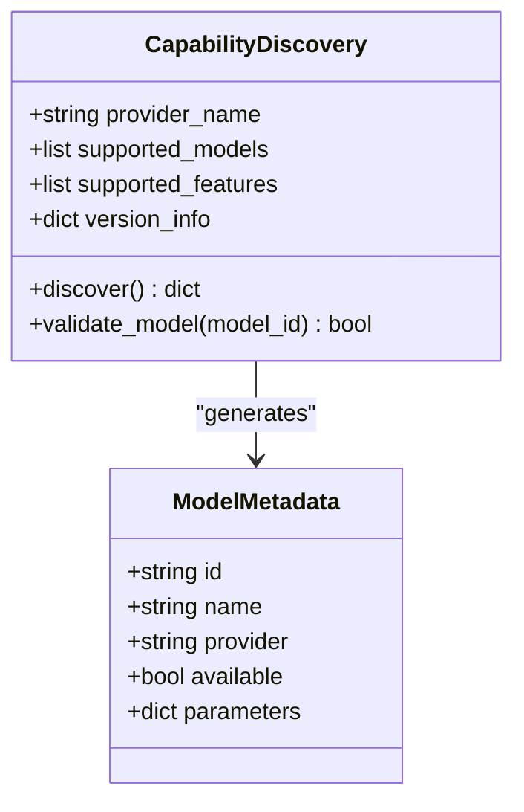
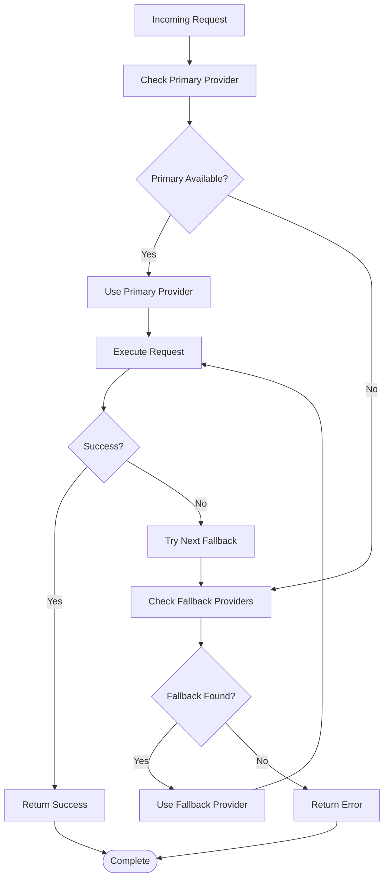
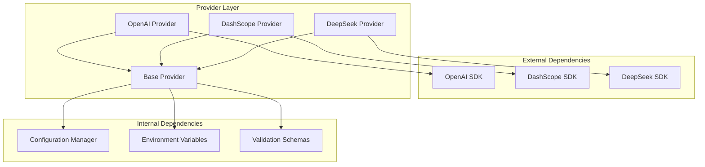

# Provider Configuration API

<cite>
**Referenced Files in This Document**
- [providers/registry.py](file://products/agent-platform/src/agent_service/providers/registry.py)
- [providers/base.py](file://products/agent-platform/src/agent_service/providers/base.py)
- [providers/openai.py](file://products/agent-platform/src/agent_service/providers/openai.py)
- [providers/dashscope.py](file://products/agent-platform/src/agent_service/providers/dashscope.py)
- [providers/deepseek.py](file://products/agent-platform/src/agent_service/providers/deepseek.py)
- [schemas/api.py](file://products/agent-platform/src/agent_service/schemas/api.py)
- [schemas/v2.py](file://products/agent-platform/src/agent_service/schemas/v2.py)
- [api/routes/v2/routes.py](file://products/agent-platform/src/agent_service/api/routes/v2/routes.py)
- [core/config.py](file://products/agent-platform/src/agent_service/core/config.py)
- [core/env.py](file://products/agent-platform/src/agent_service/core/env.py)
- [runtime_settings.py](file://products/agent-platform/src/agent_service/runtime_settings.py)
- [shared-contracts/schemas/agent-runtime-metadata.schema.json](file://shared/shared-contracts/schemas/agent-runtime-metadata.schema.json)
</cite>

## Table of Contents
1. [Introduction](#introduction)
2. [Project Structure](#project-structure)
3. [Core Components](#core-components)
4. [Architecture Overview](#architecture-overview)
5. [Detailed Component Analysis](#detailed-component-analysis)
6. [Dependency Analysis](#dependency-analysis)
7. [Performance Considerations](#performance-considerations)
8. [Troubleshooting Guide](#troubleshooting-guide)
9. [Conclusion](#conclusion)
10. [Appendices](#appendices)

## Introduction
This document provides detailed API documentation for provider configuration and management endpoints within the Agent Platform. It focuses on registering, configuring, and managing AI model providers such as OpenAI, DashScope, and DeepSeek. The documentation covers:
- REST endpoints for provider lifecycle and capability discovery
- Schema definitions for provider configurations and authentication
- Provider registry pattern and dynamic loading mechanisms
- Fallback strategies and error handling
- Examples for adding custom providers, configuring credentials, and testing connectivity
- Versioning, compatibility matrices, and migration procedures

The goal is to enable operators and developers to integrate new providers safely and reliably while maintaining consistent behavior across supported backends.

## Project Structure
Provider-related functionality is implemented under the agent-service module with clear separation between schemas, providers, and API routes:
- Schemas define request/response models and validation rules
- Providers implement backend-specific logic and capabilities
- Registry manages provider registration and resolution
- API routes expose HTTP endpoints for configuration and management



**Diagram sources**
- [api/routes/v2/routes.py](file://products/agent-platform/src/agent_service/api/routes/v2/routes.py)
- [schemas/v2.py](file://products/agent-platform/src/agent_service/schemas/v2.py)
- [schemas/api.py](file://products/agent-platform/src/agent_service/schemas/api.py)
- [runtime_settings.py](file://products/agent-platform/src/agent_service/runtime_settings.py)
- [core/config.py](file://products/agent-platform/src/agent_service/core/config.py)
- [core/env.py](file://products/agent-platform/src/agent_service/core/env.py)
- [providers/registry.py](file://products/agent-platform/src/agent_service/providers/registry.py)
- [providers/base.py](file://products/agent-platform/src/agent_service/providers/base.py)
- [providers/openai.py](file://products/agent-platform/src/agent_service/providers/openai.py)
- [providers/dashscope.py](file://products/agent-platform/src/agent_service/providers/dashscope.py)
- [providers/deepseek.py](file://products/agent-platform/src/agent_service/providers/deepseek.py)

**Section sources**
- [api/routes/v2/routes.py](file://products/agent-platform/src/agent_service/api/routes/v2/routes.py)
- [schemas/v2.py](file://products/agent-platform/src/agent_service/schemas/v2.py)
- [schemas/api.py](file://products/agent-platform/src/agent_service/schemas/api.py)
- [runtime_settings.py](file://products/agent-platform/src/agent_service/runtime_settings.py)
- [core/config.py](file://products/agent-platform/src/agent_service/core/config.py)
- [core/env.py](file://products/agent-platform/src/agent_service/core/env.py)
- [providers/registry.py](file://products/agent-platform/src/agent_service/providers/registry.py)
- [providers/base.py](file://products/agent-platform/src/agent_service/providers/base.py)
- [providers/openai.py](file://products/agent-platform/src/agent_service/providers/openai.py)
- [providers/dashscope.py](file://products/agent-platform/src/agent_service/providers/dashscope.py)
- [providers/deepseek.py](file://products/agent-platform/src/agent_service/providers/deepseek.py)

## Core Components
- Provider Base: Defines the common interface and shared behaviors for all providers
- Provider Implementations: Concrete classes for OpenAI, DashScope, and DeepSeek
- Provider Registry: Centralized registry for dynamic loading and resolution
- Schemas: Pydantic models for request/response validation and serialization
- Runtime Settings: Configuration and environment integration for provider settings

Key responsibilities:
- Validate and normalize provider configurations
- Discover and expose provider capabilities
- Manage authentication and credential resolution
- Provide fallback strategies when primary providers fail

**Section sources**
- [providers/base.py](file://products/agent-platform/src/agent_service/providers/base.py)
- [providers/openai.py](file://products/agent-platform/src/agent_service/providers/openai.py)
- [providers/dashscope.py](file://products/agent-platform/src/agent_service/providers/dashscope.py)
- [providers/deepseek.py](file://products/agent-platform/src/agent_service/providers/deepseek.py)
- [providers/registry.py](file://products/agent-platform/src/agent_service/providers/registry.py)
- [schemas/v2.py](file://products/agent-platform/src/agent_service/schemas/v2.py)
- [schemas/api.py](file://products/agent-platform/src/agent_service/schemas/api.py)
- [runtime_settings.py](file://products/agent-platform/src/agent_service/runtime_settings.py)

## Architecture Overview
The provider architecture follows a registry pattern with dynamic loading and capability discovery:



**Diagram sources**
- [providers/base.py](file://products/agent-platform/src/agent_service/providers/base.py)
- [providers/openai.py](file://products/agent-platform/src/agent_service/providers/openai.py)
- [providers/dashscope.py](file://products/agent-platform/src/agent_service/providers/dashscope.py)
- [providers/deepseek.py](file://products/agent-platform/src/agent_service/providers/deepseek.py)
- [providers/registry.py](file://products/agent-platform/src/agent_service/providers/registry.py)

## Detailed Component Analysis

### Provider Registry Pattern
The provider registry implements a centralized management system for dynamic provider loading and resolution:



**Diagram sources**
- [providers/registry.py](file://products/agent-platform/src/agent_service/providers/registry.py)
- [providers/base.py](file://products/agent-platform/src/agent_service/providers/base.py)
- [api/routes/v2/routes.py](file://products/agent-platform/src/agent_service/api/routes/v2/routes.py)

**Section sources**
- [providers/registry.py](file://products/agent-platform/src/agent_service/providers/registry.py)

### Authentication and Credential Management
Authentication flows vary by provider but follow consistent patterns:



**Diagram sources**
- [providers/openai.py](file://products/agent-platform/src/agent_service/providers/openai.py)
- [providers/dashscope.py](file://products/agent-platform/src/agent_service/providers/dashscope.py)
- [providers/deepseek.py](file://products/agent-platform/src/agent_service/providers/deepseek.py)

**Section sources**
- [providers/openai.py](file://products/agent-platform/src/agent_service/providers/openai.py)
- [providers/dashscope.py](file://products/agent-platform/src/agent_service/providers/dashscope.py)
- [providers/deepseek.py](file://products/agent-platform/src/agent_service/providers/deepseek.py)

### Capability Discovery
Capability discovery enables runtime detection of supported features and models:



**Diagram sources**
- [providers/base.py](file://products/agent-platform/src/agent_service/providers/base.py)
- [schemas/v2.py](file://products/agent-platform/src/agent_service/schemas/v2.py)

**Section sources**
- [providers/base.py](file://products/agent-platform/src/agent_service/providers/base.py)
- [schemas/v2.py](file://products/agent-platform/src/agent_service/schemas/v2.py)

### Fallback Strategies
The system implements intelligent fallback mechanisms for provider resilience:



**Diagram sources**
- [providers/registry.py](file://products/agent-platform/src/agent_service/providers/registry.py)
- [providers/base.py](file://products/agent-platform/src/agent_service/providers/base.py)

**Section sources**
- [providers/registry.py](file://products/agent-platform/src/agent_service/providers/registry.py)

## Dependency Analysis
Provider dependencies and relationships are managed through a clean separation of concerns:



**Diagram sources**
- [providers/openai.py](file://products/agent-platform/src/agent_service/providers/openai.py)
- [providers/dashscope.py](file://products/agent-platform/src/agent_service/providers/dashscope.py)
- [providers/deepseek.py](file://products/agent-platform/src/agent_service/providers/deepseek.py)
- [providers/base.py](file://products/agent-platform/src/agent_service/providers/base.py)
- [core/config.py](file://products/agent-platform/src/agent_service/core/config.py)
- [core/env.py](file://products/agent-platform/src/agent_service/core/env.py)
- [schemas/v2.py](file://products/agent-platform/src/agent_service/schemas/v2.py)

**Section sources**
- [providers/openai.py](file://products/agent-platform/src/agent_service/providers/openai.py)
- [providers/dashscope.py](file://products/agent-platform/src/agent_service/providers/dashscope.py)
- [providers/deepseek.py](file://products/agent-platform/src/agent_service/providers/deepseek.py)
- [providers/base.py](file://products/agent-platform/src/agent_service/providers/base.py)
- [core/config.py](file://products/agent-platform/src/agent_service/core/config.py)
- [core/env.py](file://products/agent-platform/src/agent_service/core/env.py)
- [schemas/v2.py](file://products/agent-platform/src/agent_service/schemas/v2.py)

## Performance Considerations
- Connection pooling: Each provider implementation should implement connection pooling for optimal performance
- Lazy loading: Providers are loaded on-demand to minimize startup time
- Caching: Capability information and model metadata should be cached where appropriate
- Timeout handling: Implement appropriate timeouts for external API calls
- Circuit breaker: Consider implementing circuit breaker patterns for failing providers

[No sources needed since this section provides general guidance]

## Troubleshooting Guide
Common issues and their resolutions:

### Authentication Failures
- Verify API key format and permissions
- Check network connectivity to provider endpoints
- Review timeout configurations

### Provider Registration Issues
- Validate configuration schema compliance
- Ensure required environment variables are set
- Check provider-specific requirements

### Capability Discovery Problems
- Verify provider SDK versions
- Check network access to discovery endpoints
- Review logging for detailed error information

**Section sources**
- [providers/openai.py](file://products/agent-platform/src/agent_service/providers/openai.py)
- [providers/dashscope.py](file://products/agent-platform/src/agent_service/providers/dashscope.py)
- [providers/deepseek.py](file://products/agent-platform/src/agent_service/providers/deepseek.py)

## Conclusion
The provider configuration system provides a robust foundation for managing multiple AI model providers through a consistent API surface. The registry pattern enables dynamic loading and management, while comprehensive validation and error handling ensure reliability. Operators can easily extend the system with custom providers while maintaining compatibility with existing workflows.

[No sources needed since this section summarizes without analyzing specific files]

## Appendices

### API Endpoints Reference

#### Provider Management Endpoints

| Endpoint | Method | Description | Request Body | Response |
|----------|--------|-------------|--------------|----------|
| /api/v2/providers | GET | List all registered providers | None | Provider list |
| /api/v2/providers/register | POST | Register a new provider | ProviderConfig | Registration result |
| /api/v2/providers/{name}/configure | PUT | Configure provider settings | ProviderSettings | Update result |
| /api/v2/providers/{name}/capabilities | GET | Discover provider capabilities | None | Capabilities |
| /api/v2/providers/{name}/test | POST | Test provider connectivity | TestConfig | Connectivity result |
| /api/v2/providers/{name}/health | GET | Check provider health | None | Health status |

#### Schema Definitions

**Provider Configuration Schema:**
- name: string (required) - Unique provider identifier
- type: string (required) - Provider type (openai, dashscope, deepseek)
- credentials: object (required) - Authentication credentials
- settings: object (optional) - Provider-specific settings
- enabled: boolean (default: true) - Provider activation status

**Authentication Credentials Schema:**
- api_key: string (required) - API authentication key
- base_url: string (optional) - Custom API endpoint
- timeout: integer (optional) - Request timeout in seconds
- retry_attempts: integer (optional) - Retry configuration

**Capabilities Response Schema:**
- provider_name: string - Provider identifier
- supported_models: array - List of supported model IDs
- features: array - Supported feature flags
- version: string - Provider SDK version
- status: string - Current provider status

**Section sources**
- [schemas/v2.py](file://products/agent-platform/src/agent_service/schemas/v2.py)
- [schemas/api.py](file://products/agent-platform/src/agent_service/schemas/api.py)
- [api/routes/v2/routes.py](file://products/agent-platform/src/agent_service/api/routes/v2/routes.py)

### Adding Custom Providers

To add a custom provider:

1. Create a new provider class extending BaseProvider
2. Implement required methods: authenticate(), discover_capabilities(), invoke()
3. Register the provider in the registry
4. Add corresponding schema definitions
5. Implement health check and test endpoints

Example structure:
```python
class CustomProvider(BaseProvider):
    def __init__(self, config):
        super().__init__(config)
        self.api_key = config.get('credentials', {}).get('api_key')
        
    def authenticate(self):
        # Implement authentication logic
        pass
        
    def discover_capabilities(self):
        # Implement capability discovery
        pass
        
    def invoke(self, request):
        # Implement request invocation
        pass
```

**Section sources**
- [providers/base.py](file://products/agent-platform/src/agent_service/providers/base.py)
- [providers/registry.py](file://products/agent-platform/src/agent_service/providers/registry.py)

### Versioning and Compatibility

**Supported Provider Versions:**
- OpenAI: SDK v1.x+
- DashScope: SDK v2.x+
- DeepSeek: SDK v1.x+

**Compatibility Matrix:**
| Platform Version | OpenAI | DashScope | DeepSeek |
|------------------|--------|-----------|----------|
| 1.0.0+ | ✓ | ✓ | ✓ |
| 1.1.0+ | ✓ | ✓ | ✓ |
| 1.2.0+ | ✓ | ✓ | ✓ |

**Migration Procedures:**
1. Backup current provider configurations
2. Update provider SDK versions
3. Validate configurations against new schemas
4. Test provider connectivity
5. Monitor for errors during transition

**Section sources**
- [shared-contracts/schemas/agent-runtime-metadata.schema.json](file://shared/shared-contracts/schemas/agent-runtime-metadata.schema.json)
- [runtime_settings.py](file://products/agent-platform/src/agent_service/runtime_settings.py)

### Testing Provider Connectivity

Recommended testing approach:
1. Use the test endpoint to verify basic connectivity
2. Validate authentication with sample requests
3. Test capability discovery for supported models
4. Perform load testing with realistic workloads
5. Monitor error rates and response times

Testing commands:
```bash
# Test provider connectivity
curl -X POST /api/v2/providers/{name}/test \
  -H "Authorization: Bearer {token}" \
  -d '{"timeout": 30}'

# Check provider health
curl -X GET /api/v2/providers/{name}/health \
  -H "Authorization: Bearer {token}"

# Discover capabilities
curl -X GET /api/v2/providers/{name}/capabilities \
  -H "Authorization: Bearer {token}"
```

**Section sources**
- [api/routes/v2/routes.py](file://products/agent-platform/src/agent_service/api/routes/v2/routes.py)
- [providers/base.py](file://products/agent-platform/src/agent_service/providers/base.py)