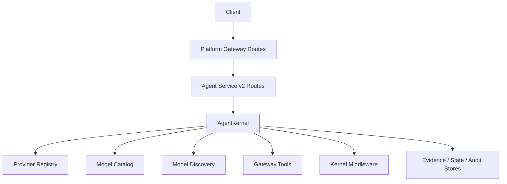
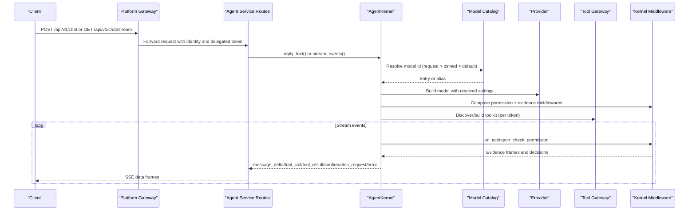
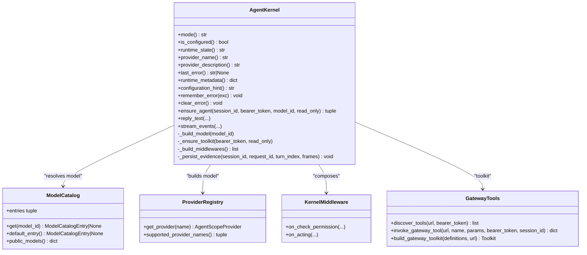
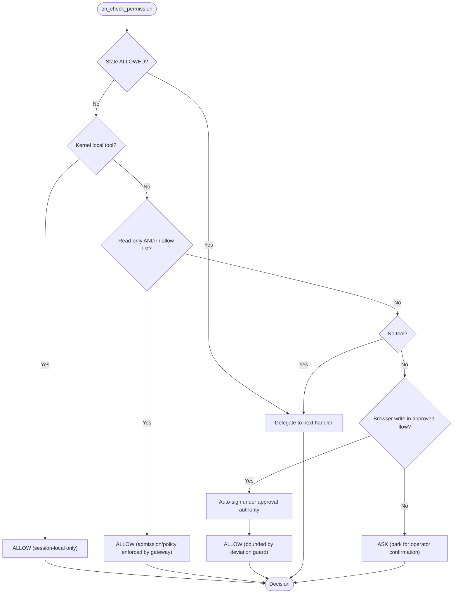
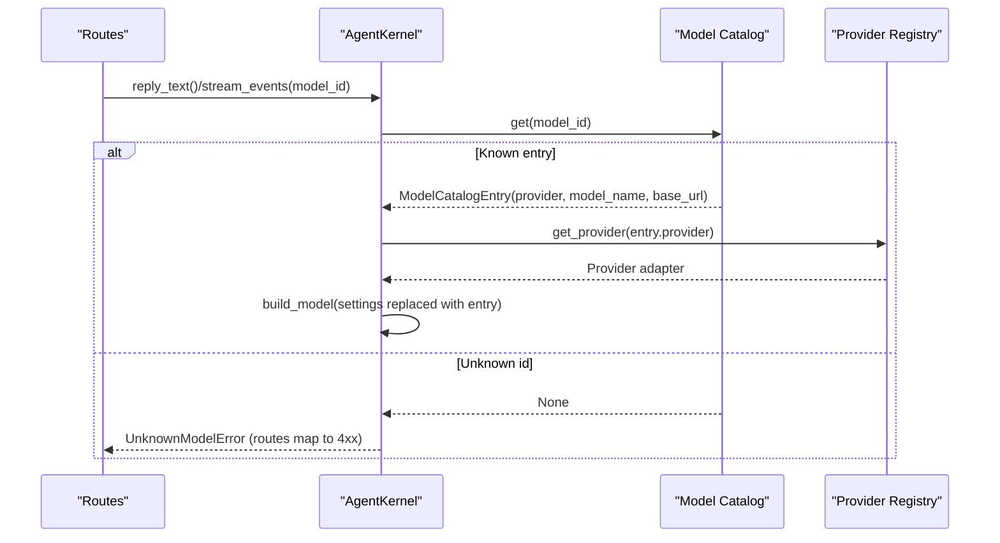
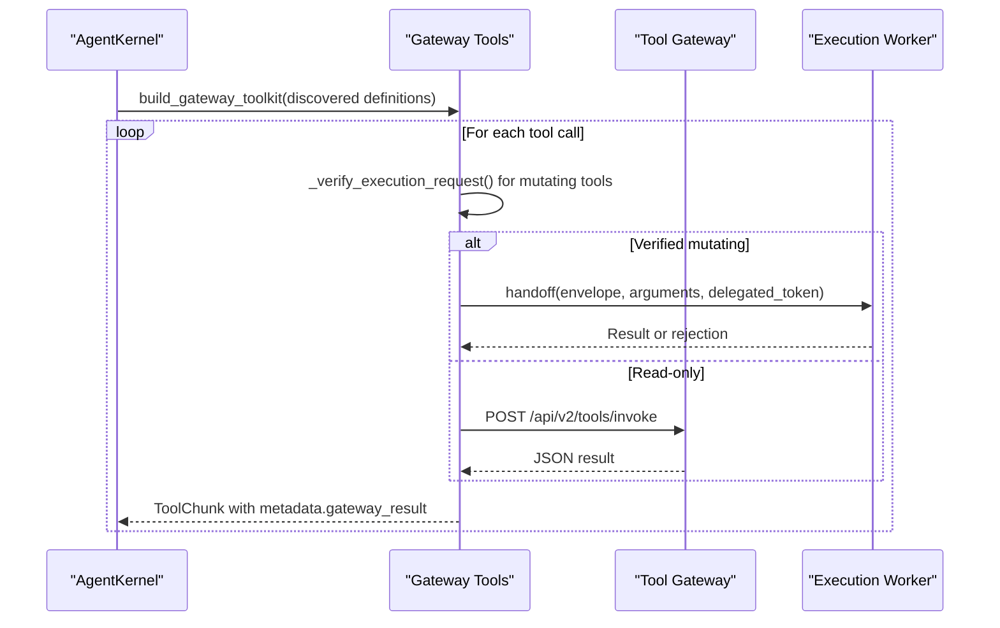

# Runtime Kernel Interface

<cite>
**Referenced Files in This Document**
- [runtime_kernel.py](file://products/agent-platform/src/agent_service/runtime_kernel.py)
- [kernel_middleware.py](file://products/agent-platform/src/agent_service/services/kernel_middleware.py)
- [model_catalog.py](file://products/agent-platform/src/agent_service/services/model_catalog.py)
- [model_discovery.py](file://products/agent-platform/src/agent_service/services/model_discovery.py)
- [registry.py](file://products/agent-platform/src/agent_service/providers/registry.py)
- [runtime_settings.py](file://products/agent-platform/src/agent_service/runtime_settings.py)
- [gateway_tools.py](file://products/agent-platform/src/agent_service/tools/gateway_tools.py)
- [routes.py](file://products/agent-platform/src/agent_service/api/v2/routes.py)
- [chat.py](file://products/platform-gateway/src/platform_gateway/api/routes/chat.py)
</cite>

## Table of Contents
1. [Introduction](#introduction)
2. [Project Structure](#project-structure)
3. [Core Components](#core-components)
4. [Architecture Overview](#architecture-overview)
5. [Detailed Component Analysis](#detailed-component-analysis)
6. [Dependency Analysis](#dependency-analysis)
7. [Performance Considerations](#performance-considerations)
8. [Troubleshooting Guide](#troubleshooting-guide)
9. [Conclusion](#conclusion)
10. [Appendices](#appendices)

## Introduction
This document describes the runtime kernel interface that orchestrates agent execution within the Agent Platform. The kernel bridges HTTP routes and the underlying AgentScope framework, providing:
- Synchronous message processing via reply_text()
- Real-time streaming via stream_events()
- Model catalog integration for multi-provider LLM support with credential gating
- Credential management per provider and runtime configuration options
- Kernel middleware alignment for consistent behavior across all agent interactions (audit logging, telemetry collection, policy enforcement hooks)
- Error handling patterns, timeout management, resource cleanup, and health monitoring
- Examples of initialization, model switching between providers, and tool gateway integration
- Performance considerations, scaling implications, and debugging techniques for kernel-level issues

## Project Structure
The runtime kernel lives in the agent-service product and integrates with platform services:
- HTTP routes expose chat endpoints that delegate to the kernel
- The kernel constructs AgentScope agents, manages sessions, and coordinates tools, evidence, and confirmations
- Model catalog and discovery manage available models and credentials
- Middleware enforces permissions and emits evidence frames
- Tool gateway integration provides live operational tools to the agent

**Diagram sources**
- [chat.py:37-93](file://products/platform-gateway/src/platform_gateway/api/routes/chat.py#L37-L93)
- [routes.py:276-365](file://products/agent-platform/src/agent_service/api/v2/routes.py#L276-L365)
- [runtime_kernel.py:212-774](file://products/agent-platform/src/agent_service/runtime_kernel.py#L212-L774)
- [registry.py:1-30](file://products/agent-platform/src/agent_service/providers/registry.py#L1-L30)
- [model_catalog.py:236-325](file://products/agent-platform/src/agent_service/services/model_catalog.py#L236-L325)
- [model_discovery.py:202-299](file://products/agent-platform/src/agent_service/services/model_discovery.py#L202-L299)
- [gateway_tools.py:92-155](file://products/agent-platform/src/agent_service/tools/gateway_tools.py#L92-L155)
- [kernel_middleware.py:151-279](file://products/agent-platform/src/agent_service/services/kernel_middleware.py#L151-L279)

**Section sources**
- [chat.py:37-93](file://products/platform-gateway/src/platform_gateway/api/routes/chat.py#L37-L93)
- [routes.py:276-365](file://products/agent-platform/src/agent_service/api/v2/routes.py#L276-L365)
- [runtime_kernel.py:212-774](file://products/agent-platform/src/agent_service/runtime_kernel.py#L212-L774)

## Core Components
- AgentKernel: Orchestrates agent lifecycle, session state, toolkit building, model selection, streaming, and confirmation bridging
- Kernel Middleware: Enforces permission gates and emits tool evidence frames aligned with platform contracts
- Model Catalog: Credential-gated registry of selectable models with live discovery and safe swapping
- Provider Registry: Maps provider names to concrete adapters used by the kernel
- Runtime Settings: Centralized configuration surface for kernel tuning, middleware, HITL timeouts, evidence caps, discovery, signing, worker handoff, audit, incidents, skills, authoring traces, and graduation bounds
- Gateway Tools: Dynamic tool functions that call the tool-gateway, enforce signed execution for mutating calls, and emit structured results

Key responsibilities:
- reply_text(): synchronous turn processing returning content and optional structured output
- stream_events(): async event stream emitting deltas, tool calls/results, confirmations, errors, and metadata
- ensure_agent(): per-session agent caching with model-switch rebuilds and toolkit recovery
- _ensure_toolkit(): per-token toolkit cache with read-only restriction and HITL-aware filtering
- _build_model(): resolve model id through catalog, swap provider or model name as needed
- _build_middlewares(): compose permission and evidence middlewares plus optional tracing and token budget controls

**Section sources**
- [runtime_kernel.py:212-774](file://products/agent-platform/src/agent_service/runtime_kernel.py#L212-L774)
- [kernel_middleware.py:151-279](file://products/agent-platform/src/agent_service/services/kernel_middleware.py#L151-L279)
- [model_catalog.py:236-325](file://products/agent-platform/src/agent_service/services/model_catalog.py#L236-L325)
- [registry.py:1-30](file://products/agent-platform/src/agent_service/providers/registry.py#L1-L30)
- [runtime_settings.py:136-527](file://products/agent-platform/src/agent_service/runtime_settings.py#L136-L527)
- [gateway_tools.py:323-480](file://products/agent-platform/src/agent_service/tools/gateway_tools.py#L323-L480)

## Architecture Overview
The runtime kernel sits between HTTP routes and AgentScope, enforcing platform policies and producing contract-compliant events.

**Diagram sources**
- [chat.py:37-93](file://products/platform-gateway/src/platform_gateway/api/routes/chat.py#L37-L93)
- [routes.py:276-365](file://products/agent-platform/src/agent_service/api/v2/routes.py#L276-L365)
- [runtime_kernel.py:293-323](file://products/agent-platform/src/agent_service/runtime_kernel.py#L293-L323)
- [model_catalog.py:272-283](file://products/agent-platform/src/agent_service/services/model_catalog.py#L272-L283)
- [kernel_middleware.py:151-279](file://products/agent-platform/src/agent_service/services/kernel_middleware.py#L151-L279)
- [gateway_tools.py:92-155](file://products/agent-platform/src/agent_service/tools/gateway_tools.py#L92-L155)

## Detailed Component Analysis

### AgentKernel
Responsibilities:
- Session-scoped agent caching with LRU eviction
- Model resolution and switching with fail-closed unknown ids
- Toolkit building per delegated token, with read-only and HITL-aware filtering
- Middleware composition for permissions, evidence, tracing, and token budgets
- Evidence persistence and prose redaction during streaming
- Confirmation bridging and expiration handling

Key methods:
- ensure_agent(session_id, bearer_token, model_id, read_only): returns cached or built agent with restored state
- _build_model(model_id): builds AgentScope model from catalog entry or deploy-time settings
- _ensure_toolkit(bearer_token, read_only): discovers and caches toolkit; filters mutating tools when HITL disabled
- _build_middlewares(): composes GatewayPermissionMiddleware and ToolEvidenceMiddleware plus optional TracingMiddleware and ReplyBudgetControlMiddleware
- _persist_evidence(session_id, request_id, turn_index, frames): best-effort evidence write with metrics
- build_provider_error_message(message, session_id, model_id): constructs user-facing error with provider attribution

Error handling and resilience:
- UnknownModelError raised for unknown model ids; routes map to 4xx
- State restore/snapshot failures degrade gracefully with metrics and warnings
- Evidence persistence failures do not break turns
- Toolkit discovery failures return uncached task-only toolkits to allow retries

Streaming specifics:
- TERMINAL_STREAM_EVENTS mark turn completion; prose redactor flushes held-back tails before terminal events
- TEXT_DELTA_EVENTS recognized for delta extraction
- NO_TOOLS_NOTICE and MUTATING_TOOLS_UNAVAILABLE_NOTICE injected deterministically when toolsets are empty or mutating tools excluded

Health and metadata:
- mode(), is_configured(), runtime_state(), provider_name(), provider_description(), runtime_metadata(), configuration_hint(), last_error(), remember_error(), clear_error()

**Section sources**
- [runtime_kernel.py:72-120](file://products/agent-platform/src/agent_service/runtime_kernel.py#L72-L120)
- [runtime_kernel.py:212-323](file://products/agent-platform/src/agent_service/runtime_kernel.py#L212-L323)
- [runtime_kernel.py:340-450](file://products/agent-platform/src/agent_service/runtime_kernel.py#L340-L450)
- [runtime_kernel.py:462-537](file://products/agent-platform/src/agent_service/runtime_kernel.py#L462-L537)
- [runtime_kernel.py:539-697](file://products/agent-platform/src/agent_service/runtime_kernel.py#L539-L697)
- [runtime_kernel.py:699-774](file://products/agent-platform/src/agent_service/runtime_kernel.py#L699-L774)
- [runtime_kernel.py:776-800](file://products/agent-platform/src/agent_service/runtime_kernel.py#L776-L800)

#### Class Diagram: AgentKernel and Dependencies

**Diagram sources**
- [runtime_kernel.py:212-774](file://products/agent-platform/src/agent_service/runtime_kernel.py#L212-L774)
- [model_catalog.py:236-325](file://products/agent-platform/src/agent_service/services/model_catalog.py#L236-L325)
- [registry.py:1-30](file://products/agent-platform/src/agent_service/providers/registry.py#L1-L30)
- [kernel_middleware.py:151-279](file://products/agent-platform/src/agent_service/services/kernel_middleware.py#L151-L279)
- [gateway_tools.py:92-155](file://products/agent-platform/src/agent_service/tools/gateway_tools.py#L92-L155)

### Kernel Middleware Alignment
Two core middlewares align AgentScope behavior with platform contracts:
- GatewayPermissionMiddleware: Implements a deny-by-default allow-list for headless streams; auto-approves vetted read-only tools and kernel-local tools; otherwise answers ASK to park for operator confirmation; supports flow-unlock for approved browser writes under SPEC-051
- ToolEvidenceMiddleware: Emits tool_call and tool_result frames into a request-scoped sink set by the kernel during streamed turns; size-bounds full payloads and summaries; masks sensitive parameters

Auto-allow list:
- Default vetted read-only tools include k8s.*, skills.*, incidents.*, and web.* read operations
- Environment override AGENT_GATEWAY_TOOL_AUTO_ALLOW can customize the list
- Mutating tools never auto-execute even if named; they always park for HITL

Evidence emission:
- Frames follow SPEC-011 R-2 contract consumed by the portal
- Only gateway-backed tools emit frames; built-in task tools pass through silently
- Full data payload included when within configured limits; truncated previews otherwise

**Section sources**
- [kernel_middleware.py:1-19](file://products/agent-platform/src/agent_service/services/kernel_middleware.py#L1-L19)
- [kernel_middleware.py:100-148](file://products/agent-platform/src/agent_service/services/kernel_middleware.py#L100-L148)
- [kernel_middleware.py:151-279](file://products/agent-platform/src/agent_service/services/kernel_middleware.py#L151-L279)
- [kernel_middleware.py:282-411](file://products/agent-platform/src/agent_service/services/kernel_middleware.py#L282-L411)

#### Flowchart: Permission Decision Logic

**Diagram sources**
- [kernel_middleware.py:195-279](file://products/agent-platform/src/agent_service/services/kernel_middleware.py#L195-L279)

### Model Catalog Integration and Multi-Provider Support
The model catalog derives selectable models from environment-configured providers:
- Each provider gated by API key; base URL required for providers without well-known endpoints
- Curated series per provider; optional overrides via <PROVIDER>_MODELS
- Active profile keeps backward compatibility with existing AGENTSCOPE_* knobs
- Live discovery periodically refreshes model lists from provider /models endpoints behind a fail-soft ladder (live -> memory -> Postgres cache -> curated)
- Catalog swaps atomically under lock; object identity remains stable for kernel and routes

Credential management:
- Credentials resolved per provider and stored in catalog entries
- Public views exclude secrets and base URLs
- Aliases map bare provider names to default-model entries for backward compatibility

Runtime configuration:
- model_discovery_enabled toggles live discovery
- model_discovery_refresh_seconds sets interval
- model_discovery_timeout_seconds sets fetch timeout
- Per-provider options (max_tokens, temperature, top_p, thinking_enable, reasoning_effort, parallel_tool_calls) parsed from environment

**Section sources**
- [model_catalog.py:1-29](file://products/agent-platform/src/agent_service/services/model_catalog.py#L1-L29)
- [model_catalog.py:100-169](file://products/agent-platform/src/agent_service/services/model_catalog.py#L100-L169)
- [model_catalog.py:172-233](file://products/agent-platform/src/agent_service/services/model_catalog.py#L172-L233)
- [model_catalog.py:236-325](file://products/agent-platform/src/agent_service/services/model_catalog.py#L236-L325)
- [model_discovery.py:1-15](file://products/agent-platform/src/agent_service/services/model_discovery.py#L1-L15)
- [model_discovery.py:161-200](file://products/agent-platform/src/agent_service/services/model_discovery.py#L161-L200)
- [model_discovery.py:202-299](file://products/agent-platform/src/agent_service/services/model_discovery.py#L202-L299)
- [runtime_settings.py:136-246](file://products/agent-platform/src/agent_service/runtime_settings.py#L136-L246)
- [runtime_settings.py:358-411](file://products/agent-platform/src/agent_service/runtime_settings.py#L358-L411)
- [runtime_settings.py:413-527](file://products/agent-platform/src/agent_service/runtime_settings.py#L413-L527)

#### Sequence Diagram: Model Switching Between Providers

**Diagram sources**
- [routes.py:246-270](file://products/agent-platform/src/agent_service/api/v2/routes.py#L246-L270)
- [runtime_kernel.py:293-323](file://products/agent-platform/src/agent_service/runtime_kernel.py#L293-L323)
- [model_catalog.py:272-283](file://products/agent-platform/src/agent_service/services/model_catalog.py#L272-L283)
- [registry.py:17-25](file://products/agent-platform/src/agent_service/providers/registry.py#L17-L25)

### Tool Gateway Integration
Dynamic tools are discovered from the tool-gateway and wrapped as AgentScope FunctionTools:
- discover_tools() fetches available tools with delegated token; graceful degradation returns empty list on failure
- build_function_tools() creates closures that invoke tool-gateway endpoints with bounded timeouts
- Mutating tools verify arguments against signed execution requests before calling the gateway or handing off to the execution worker
- Read-only tools call the gateway directly with correlation session id
- ToolEvidenceMiddleware emits evidence frames using gateway result metadata carried on ToolChunk

Signed execution and isolation:
- EXECUTION_REQUESTS context maps call_id to signed envelope; verification ensures args match digest
- Rejection reasons include missing request and argument mismatch; audited via execution_rejected events
- Isolated execution worker handoff for verified mutating calls with bounded timeout and structured rejection mapping

**Section sources**
- [gateway_tools.py:92-155](file://products/agent-platform/src/agent_service/tools/gateway_tools.py#L92-L155)
- [gateway_tools.py:173-228](file://products/agent-platform/src/agent_service/tools/gateway_tools.py#L173-L228)
- [gateway_tools.py:266-321](file://products/agent-platform/src/agent_service/tools/gateway_tools.py#L266-L321)
- [gateway_tools.py:323-480](file://products/agent-platform/src/agent_service/tools/gateway_tools.py#L323-L480)

#### Sequence Diagram: Tool Invocation Flow

**Diagram sources**
- [gateway_tools.py:323-480](file://products/agent-platform/src/agent_service/tools/gateway_tools.py#L323-L480)
- [gateway_tools.py:266-321](file://products/agent-platform/src/agent_service/tools/gateway_tools.py#L266-L321)

### HTTP Route Integration and Streaming
Routes implement the platform-owned agent-service contract v2:
- POST /api/v2/chat: synchronous turn; resolves model, pins session model, calls kernel.reply_text(), returns content and structured output
- GET /api/v2/chat/stream: streaming SSE; resolves model, calls kernel.stream_events(), normalizes chunks to contract-conformant events
- POST /api/v2/chat/confirm: resumes parked confirmations; claims pending confirmation, persists outcome at claim time, streams resumed events
- Pending confirmation queries provide metadata for approval bridge with redacted pending calls

Model resolution:
- Request model > pinned model > default model
- Unknown ids fail closed with 422; pinned ids degrade to default if evicted by discovery refresh or key revocation

Event normalization:
- Coerces types and fields to schema-conformant shapes
- Preserves tool_call/tool_result frames unchanged for evidence panel parity
- Includes flow summary and approval kind where applicable

**Section sources**
- [routes.py:246-270](file://products/agent-platform/src/agent_service/api/v2/routes.py#L246-L270)
- [routes.py:276-365](file://products/agent-platform/src/agent_service/api/v2/routes.py#L276-L365)
- [routes.py:368-464](file://products/agent-platform/src/agent_service/api/v2/routes.py#L368-L464)
- [routes.py:467-513](file://products/agent-platform/src/agent_service/api/v2/routes.py#L467-L513)
- [routes.py:598-727](file://products/agent-platform/src/agent_service/api/v2/routes.py#L598-L727)

## Dependency Analysis
The kernel depends on several subsystems with clear boundaries:
- Provider registry supplies concrete adapters for model construction
- Model catalog centralizes credential-gated model selection and live discovery
- Middleware enforces permissions and evidence emission consistently
- Tool gateway provides dynamic tool capabilities with signed execution guarantees
- Settings validate and configure kernel behavior, timeouts, and feature flags

Coupling and cohesion:
- Kernel encapsulates orchestration logic; dependencies are injected via settings and services
- Middleware isolates cross-cutting concerns from agent execution
- Catalog and discovery are decoupled from route layers; routes consume public views
- Tool gateway integration abstracts external tool calls behind typed closures

Potential circular dependencies:
- Avoided by lazy imports inside methods (e.g., AgentScope imports inside toolkit building and agent construction)
- Context variables isolate request-scoped state without tight coupling

External integrations:
- Tool gateway HTTP endpoints with timeouts
- Execution worker for isolated mutating actions
- Postgres for model discovery cache and evidence/state stores
- Audit service for durable trails

**Section sources**
- [runtime_kernel.py:340-450](file://products/agent-platform/src/agent_service/runtime_kernel.py#L340-L450)
- [model_catalog.py:236-325](file://products/agent-platform/src/agent_service/services/model_catalog.py#L236-L325)
- [model_discovery.py:202-299](file://products/agent-platform/src/agent_service/services/model_discovery.py#L202-L299)
- [gateway_tools.py:92-155](file://products/agent-platform/src/agent_service/tools/gateway_tools.py#L92-L155)
- [runtime_settings.py:136-527](file://products/agent-platform/src/agent_service/runtime_settings.py#L136-L527)

## Performance Considerations
- Agent caching: LRU-bounded per-session cache reduces rebuild overhead; concurrent creation serialized via locks
- Toolkit caching: Per-delegated-token cache avoids repeated discovery; empty discovery results intentionally not cached to enable retries
- Streaming efficiency: Prose redactor flushes tails only once; terminal events release buffers promptly
- Evidence bounds: Data summaries and full payloads size-guarded to prevent large frame transmission
- Model discovery: Periodic refresh with configurable intervals and timeouts; fails soft to preserve availability
- Token budget control: Optional ReplyBudgetControlMiddleware limits reply token usage
- Tool invocation timeouts: Bounded timeouts for discovery and invocation prevent hangs
- Isolated execution: Mutating calls handed off to worker with bounded timeout; rejections audited and structured

Scaling implications:
- Stateless kernel with session-scoped state enables horizontal scaling with shared stores
- Per-token toolkit cache scales with concurrent users; consider memory limits based on MAX_CACHED_AGENTS and toolkit sizes
- Evidence and state stores should be horizontally scalable backends
- Model discovery runs per process; coordinate refresh intervals to avoid thundering herds

[No sources needed since this section provides general guidance]

## Troubleshooting Guide
Common issues and diagnostics:
- Unknown model id: Ensure model id exists in catalog; routes return 422 for unknown ids
- Provider errors: Kernel remembers last error; runtime_metadata includes last_error and configuration_hint
- Toolkit discovery failures: Logs warning; falls back to task-only toolkit; retry on next turn
- Evidence persistence failures: Metrics recorded; logs warn; turn continues
- Confirmation parking: New turns rejected with 409 until parked confirmation resolved or expired
- Signed execution rejections: Reasons include signing_unavailable, request_missing, args_digest_mismatch; audited via execution_rejected events
- Worker handoff timeouts: Structured TIMEOUT result returned; receipts closed accordingly

Debugging techniques:
- Inspect runtime_metadata() for provider, model, base_url, and last_error
- Enable kernel_tracing to add AgentScope tracing middleware
- Review tool_data_summary_max_chars and tool_data_max_chars for evidence visibility
- Check AGENT_GATEWAY_TOOL_AUTO_ALLOW for auto-approval misconfigurations
- Validate model_discovery_enabled and refresh intervals for stale catalogs
- Use pending confirmation endpoints to inspect parked batches and owners

**Section sources**
- [runtime_kernel.py:242-289](file://products/agent-platform/src/agent_service/runtime_kernel.py#L242-L289)
- [runtime_kernel.py:373-403](file://products/agent-platform/src/agent_service/runtime_kernel.py#L373-L403)
- [runtime_kernel.py:627-660](file://products/agent-platform/src/agent_service/runtime_kernel.py#L627-L660)
- [routes.py:202-243](file://products/agent-platform/src/agent_service/api/v2/routes.py#L202-L243)
- [gateway_tools.py:173-228](file://products/agent-platform/src/agent_service/tools/gateway_tools.py#L173-L228)
- [gateway_tools.py:266-321](file://products/agent-platform/src/agent_service/tools/gateway_tools.py#L266-L321)

## Conclusion
The runtime kernel provides a robust, configurable bridge between HTTP routes and AgentScope, enabling synchronous and streaming agent interactions with strong platform guarantees. It integrates multi-provider model catalogs with credential gating, enforces consistent permissions and evidence emission through middleware, and supports dynamic tool capabilities via the tool gateway. With careful configuration, error handling, and observability, the kernel scales reliably while maintaining security, auditability, and operational clarity.

[No sources needed since this section summarizes without analyzing specific files]

## Appendices

### Configuration Reference Highlights
- Kernel tuning: max_iters, context_trigger_ratio, tool_result_limit, timezone, model_max_retries
- Middleware: kernel_tracing, reply_token_budget, reply_input/output weights, task_tools_enabled
- HITL: hitl_confirm_timeout controls confirmation bridging window
- Evidence: evidence_entry_max_chars, evidence_session_max_bytes
- Discovery: model_discovery_enabled, refresh seconds, timeout seconds
- Signing and isolation: execution_signing_key, worker_url, handoff_token, worker timeout
- Audit and services: audit_service_url, incident/skills client URLs and secrets with timeouts
- Authoring traces and graduation: step caps and idle retention

**Section sources**
- [runtime_settings.py:136-246](file://products/agent-platform/src/agent_service/runtime_settings.py#L136-L246)
- [runtime_settings.py:413-527](file://products/agent-platform/src/agent_service/runtime_settings.py#L413-L527)

### Example Usage Patterns
- Initialize kernel with RuntimeSettings.from_env(); use mode() and runtime_state() for health checks
- Switch models per turn by passing model_id; routes resolve request > pinned > default and validate against catalog
- Integrate tools by configuring TOOL_GATEWAY_URL; kernel discovers and caches toolkits per delegated token
- Stream events via stream_events() and normalize chunks to SSE frames in routes
- Handle confirmations via chat/confirm; persist outcomes at claim time and resume parked turns

**Section sources**
- [routes.py:276-365](file://products/agent-platform/src/agent_service/api/v2/routes.py#L276-L365)
- [routes.py:368-464](file://products/agent-platform/src/agent_service/api/v2/routes.py#L368-L464)
- [runtime_kernel.py:212-323](file://products/agent-platform/src/agent_service/runtime_kernel.py#L212-L323)
- [gateway_tools.py:92-155](file://products/agent-platform/src/agent_service/tools/gateway_tools.py#L92-L155)