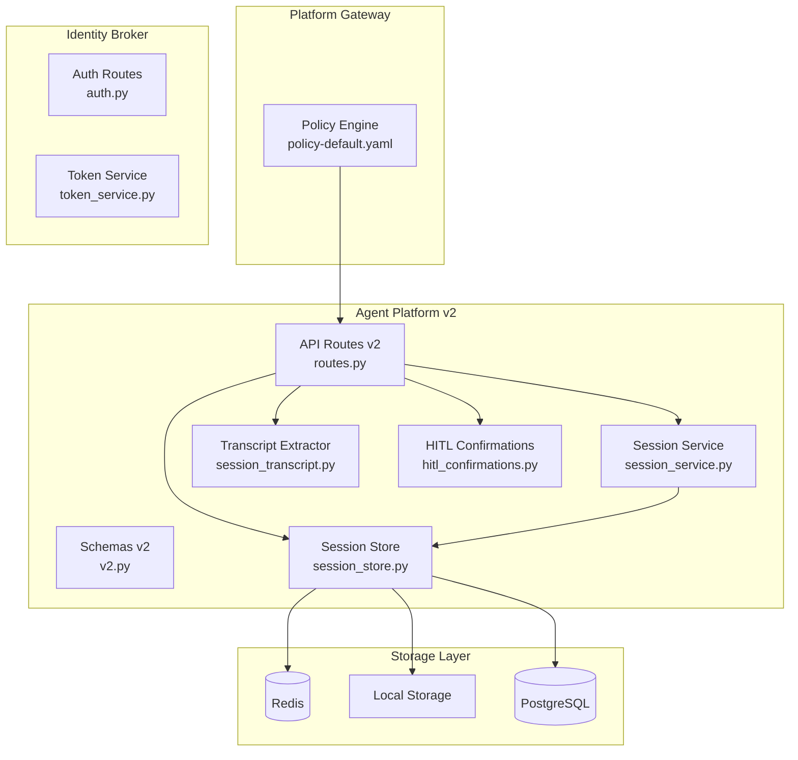
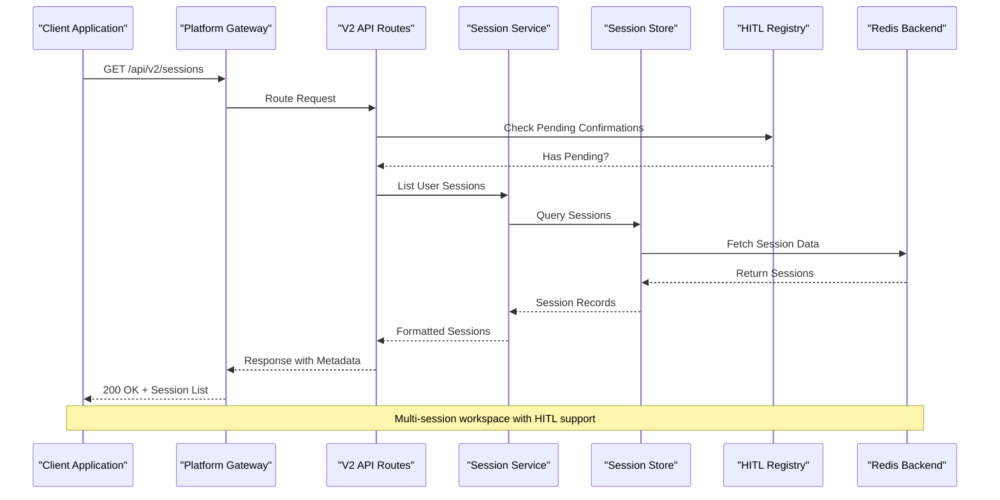
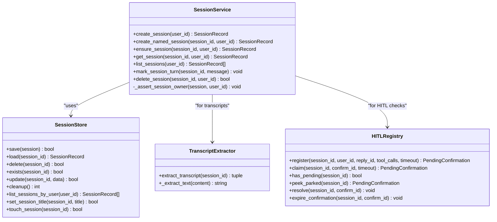
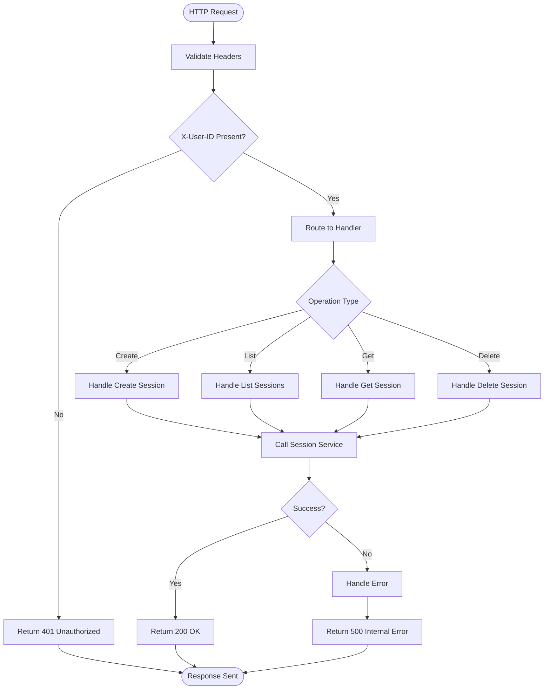
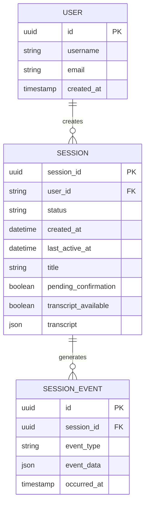
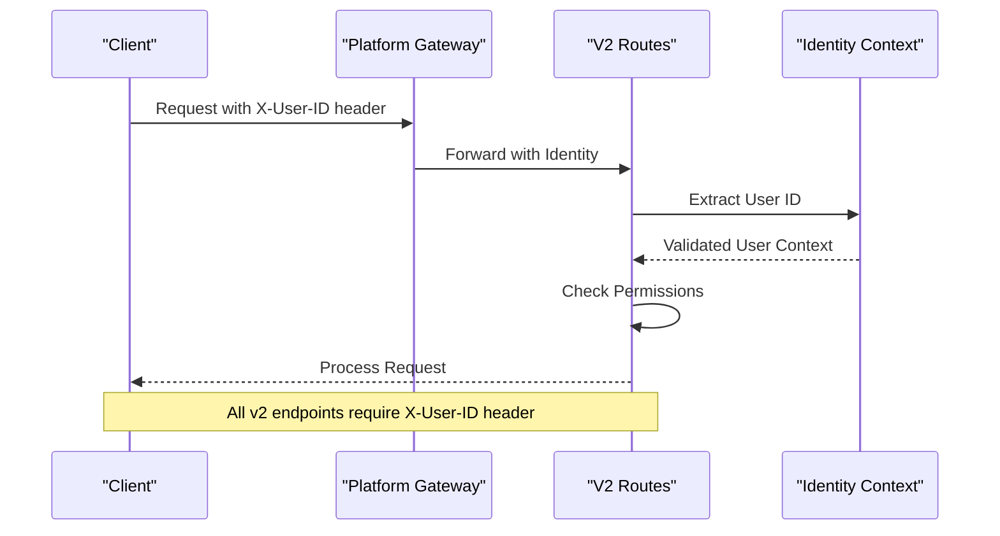
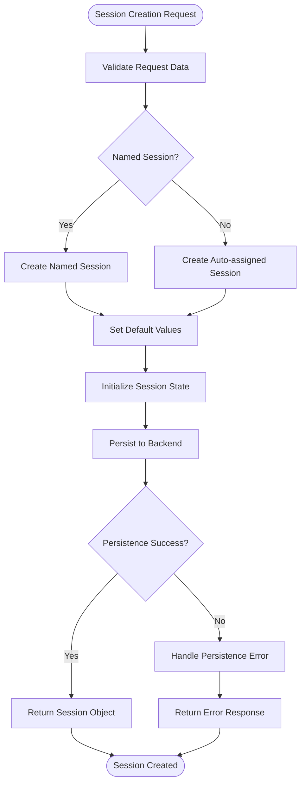
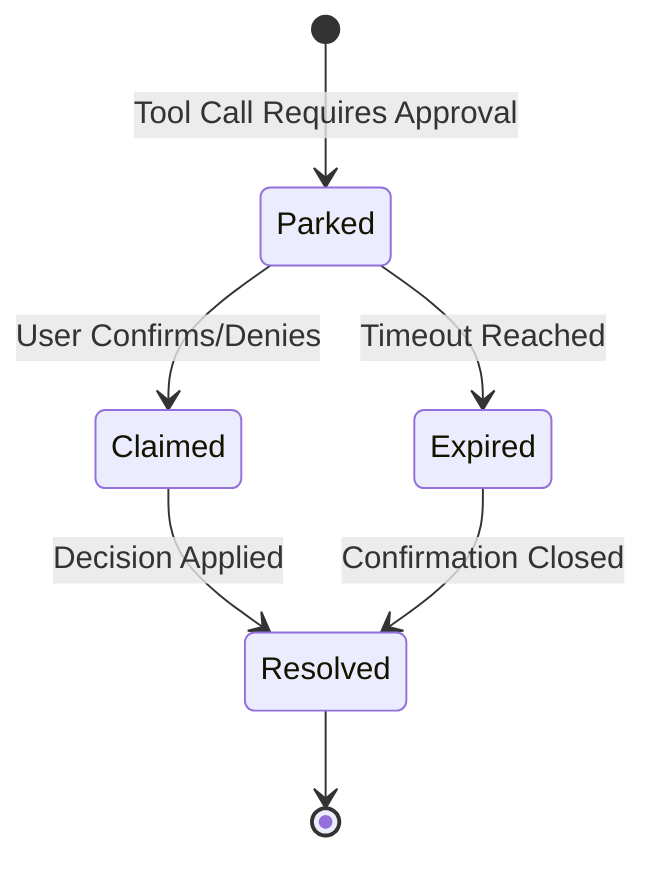
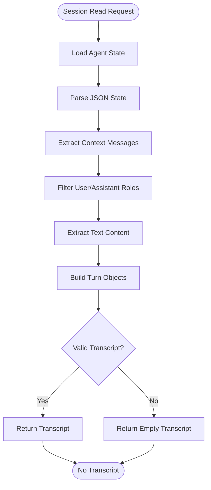
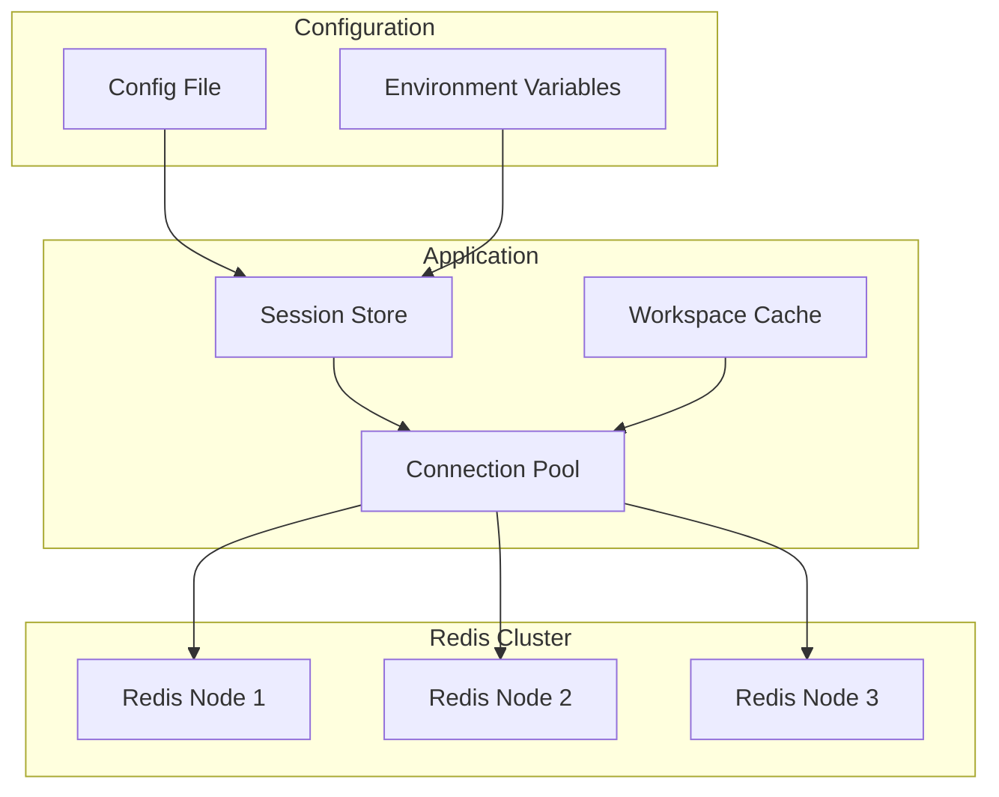

# Session Management API

<cite>
**Referenced Files in This Document**
- [routes.py](file://products/agent-platform/src/agent_service/api/v2/routes.py)
- [v2.py](file://products/agent-platform/src/agent_service/schemas/v2.py)
- [session_service.py](file://products/agent-platform/src/agent_service/services/session_service.py)
- [session_store.py](file://products/agent-platform/src/agent_service/services/session_store.py)
- [session_transcript.py](file://products/agent-platform/src/agent_service/services/session_transcript.py)
- [hitl_confirmations.py](file://products/agent-platform/src/agent_service/services/hitl_confirmations.py)
- [policy-default.yaml](file://products/platform-gateway/src/platform_gateway/policies/policy-default.yaml)
- [policy-default.yaml](file://shared/shared-contracts/policies/policy-default.yaml)
- [session.schema.json](file://shared/shared-contracts/schemas/session.schema.json)
- [agent-session.schema.json](file://shared/shared-contracts/schemas/agent-session.schema.json)
- [auth.py](file://products/identity-broker/src/identity_service/api/routes/auth.py)
- [token_service.py](file://products/identity-broker/src/identity_service/services/token_service.py)
</cite>

## Update Summary
**Changes Made**
- Added comprehensive documentation for new v2 session management endpoints (GET/DELETE /api/v2/sessions)
- Updated session data models to include multi-session capabilities with title, last_active_at, and pending_confirmation fields
- Documented transcript reconstruction functionality for session history viewing
- Added policy actions session:list and session:delete with authorization matrix updates
- Enhanced authentication flow documentation for v2 endpoints using X-User-ID headers
- Updated session lifecycle management to include workspace features and HITL confirmation integration

## Table of Contents
1. [Introduction](#introduction)
2. [Project Structure](#project-structure)
3. [Core Components](#core-components)
4. [Architecture Overview](#architecture-overview)
5. [Detailed Component Analysis](#detailed-component-analysis)
6. [API Endpoints Reference](#api-endpoints-reference)
7. [Session Data Models](#session-data-models)
8. [Authentication & Authorization](#authentication--authorization)
9. [Session Lifecycle Management](#session-lifecycle-management)
10. [Multi-Session Workspace Features](#multi-session-workspace-features)
11. [HITL Confirmation Integration](#hitl-confirmation-integration)
12. [Transcript Reconstruction](#transcript-reconstruction)
13. [Redis Backend Configuration](#redis-backend-configuration)
14. [Performance Considerations](#performance-considerations)
15. [Troubleshooting Guide](#troubleshooting-guide)
16. [Conclusion](#conclusion)

## Introduction

The Session Management API provides comprehensive REST endpoints for managing agent sessions across the AI platform. The system has been enhanced with v2 endpoints that offer multi-session capabilities, including session listing, deletion, and transcript reconstruction. Sessions represent the stateful context of agent interactions, enabling conversation continuity, tool execution tracking, and distributed state synchronization. The system supports both local and Redis-backed persistence, automatic timeout handling, secure access control through the identity broker service, and Human-in-the-Loop (HITL) confirmation workflows.

## Project Structure

The session management functionality is distributed across multiple services with clear separation between v1 and v2 APIs:



**Diagram sources**
- [routes.py:52-457](file://products/agent-platform/src/agent_service/api/v2/routes.py#L52-L457)
- [v2.py:1-192](file://products/agent-platform/src/agent_service/schemas/v2.py#L1-L192)
- [session_service.py:1-123](file://products/agent-platform/src/agent_service/services/session_service.py#L1-L123)

**Section sources**
- [routes.py](file://products/agent-platform/src/agent_service/api/v2/routes.py)
- [v2.py](file://products/agent-platform/src/agent_service/schemas/v2.py)

## Core Components

### Session Service
The Session Service orchestrates session operations including creation, updates, retrieval, deletion, and listing. It handles business logic, validation, workspace features like title minting and activity tracking, and coordination between different storage backends.

### Session Store
The Session Store provides abstraction over different persistence mechanisms, supporting both local memory storage, Redis for distributed environments, and PostgreSQL for production deployments.

### Transcript Reconstruction
A specialized component that extracts conversation history from kernel state snapshots, providing best-effort transcript reconstruction for session viewing without requiring live stream replay.

### HITL Confirmation Registry
An in-memory registry that manages Human-in-the-Loop confirmations, tracking parked tool calls and their resolution status to prevent orphaned approval workflows.

### Policy Engine
The Platform Gateway enforces authorization policies for session operations, ensuring proper access control through role-based permissions.

**Section sources**
- [session_service.py:1-123](file://products/agent-platform/src/agent_service/services/session_service.py#L1-L123)
- [session_store.py](file://products/agent-platform/src/agent_service/services/session_store.py)
- [session_transcript.py:1-83](file://products/agent-platform/src/agent_service/services/session_transcript.py#L1-L83)
- [hitl_confirmations.py:1-229](file://products/agent-platform/src/agent_service/services/hitl_confirmations.py#L1-L229)

## Architecture Overview

The session management follows a layered architecture pattern with clear separation of concerns between v1 and v2 APIs:



**Diagram sources**
- [routes.py:354-372](file://products/agent-platform/src/agent_service/api/v2/routes.py#L354-L372)
- [session_service.py:72-84](file://products/agent-platform/src/agent_service/services/session_service.py#L72-L84)
- [hitl_confirmations.py:215-224](file://products/agent-platform/src/agent_service/services/hitl_confirmations.py#L215-L224)

## Detailed Component Analysis

### V2 Session Service Implementation

The enhanced Session Service implements comprehensive workspace features:



**Diagram sources**
- [session_service.py:19-123](file://products/agent-platform/src/agent_service/services/session_service.py#L19-L123)
- [session_transcript.py:30-83](file://products/agent-platform/src/agent_service/services/session_transcript.py#L30-L83)
- [hitl_confirmations.py:93-229](file://products/agent-platform/src/agent_service/services/hitl_confirmations.py#L93-L229)

### V2 API Route Handlers

The enhanced v2 routes provide comprehensive session management:



**Diagram sources**
- [routes.py:334-420](file://products/agent-platform/src/agent_service/api/v2/routes.py#L334-L420)

**Section sources**
- [routes.py:334-420](file://products/agent-platform/src/agent_service/api/v2/routes.py#L334-L420)
- [session_service.py:19-123](file://products/agent-platform/src/agent_service/services/session_service.py#L19-L123)

## API Endpoints Reference

### V2 Session Management Endpoints

#### Create Session
- **Endpoint**: `POST /api/v2/sessions`
- **Description**: Creates a new agent session with optional named session support
- **Authentication**: Required (X-User-ID header)
- **Authorization**: Requires `session:create` permission
- **Request Body**: Optional `AgentSessionCreateRequest` with optional `session_id` for named sessions
- **Response**: `AgentSession` object with session metadata
- **Special Features**: Supports dedicated named sessions for incident triage scenarios

#### List Sessions
- **Endpoint**: `GET /api/v2/sessions`
- **Description**: Lists all sessions for authenticated user, most-recently-active first
- **Authentication**: Required (X-User-ID header)
- **Authorization**: Requires `session:list` permission
- **Response**: `AgentSessionList` containing up to 50 sessions with summary information
- **Features**: Includes `pending_confirmation` flag for each session based on HITL registry

#### Get Session
- **Endpoint**: `GET /api/v2/sessions/{session_id}`
- **Description**: Retrieves detailed session information including transcript availability
- **Authentication**: Required (X-User-ID header)
- **Authorization**: Requires `session:read` permission
- **Path Parameters**: session_id
- **Response**: `AgentSession` object with full details including transcript reconstruction
- **Features**: Includes `transcript_available` flag and reconstructed transcript when possible

#### Delete Session
- **Endpoint**: `DELETE /api/v2/sessions/{session_id}`
- **Description**: Permanently deletes a session and all associated data
- **Authentication**: Required (X-User-ID header)
- **Authorization**: Requires `session:delete` permission
- **Path Parameters**: session_id
- **Response**: JSON object confirming deletion with `session_id` and `deleted: true`
- **Security**: Prevents deletion of sessions with pending HITL confirmations (returns 409)

**Section sources**
- [routes.py:334-420](file://products/agent-platform/src/agent_service/api/v2/routes.py#L334-L420)
- [v2.py:124-165](file://products/agent-platform/src/agent_service/schemas/v2.py#L124-L165)

## Session Data Models

### Enhanced Session Schema
The v2 session objects follow an enhanced schema with workspace features:



**Diagram sources**
- [v2.py:124-165](file://products/agent-platform/src/agent_service/schemas/v2.py#L124-L165)
- [session.schema.json](file://shared/shared-contracts/schemas/session.schema.json)

### Enhanced Session Fields
- `session_id`: Unique session identifier (UUID)
- `user_id`: Owner user identifier
- `status`: Current session state (`active`, `expired`)
- `created_at`: Session creation timestamp
- `last_active_at`: Last activity timestamp for sorting
- `title`: Server-minted title from first user message (max 80 chars)
- `pending_confirmation`: Boolean indicating unresolved HITL confirmation
- `transcript_available`: Boolean indicating if transcript can be reconstructed
- `transcript`: Array of conversation turns when available

### Session States
Sessions transition through several states during their lifecycle:

| State | Description | Transitions |
|-------|-------------|-------------|
| `active` | Session is operational | → `expired`, `deleted` |
| `expired` | Session TTL exceeded | → `deleted` |
| `deleted` | Session permanently removed | → *terminal* |

**Section sources**
- [v2.py:124-165](file://products/agent-platform/src/agent_service/schemas/v2.py#L124-L165)
- [session_schema.json](file://shared/shared-contracts/schemas/session.schema.json)

## Authentication & Authorization

### V2 Authentication Flow
The v2 API uses a simplified authentication model with header-based identity:



**Diagram sources**
- [routes.py:55-68](file://products/agent-platform/src/agent_service/api/v2/routes.py#L55-L68)

### Enhanced Authorization Matrix
Access control includes new session management permissions:

| Permission | Description | Required For |
|------------|-------------|--------------|
| `session:create` | Create new sessions | POST /api/v2/sessions |
| `session:read` | Read session data | GET /api/v2/sessions/{id} |
| `session:list` | List user sessions | GET /api/v2/sessions |
| `session:delete` | Delete sessions | DELETE /api/v2/sessions/{id} |
| `chat` | Chat operations | POST /api/v2/chat |
| `chat:confirm` | Answer parked confirmations | POST /api/v2/chat/confirm |

### Policy Configuration Updates
The policy engine has been updated to support new session management actions:

```yaml
rules:
  - id: allow-operators-chat
    match:
      roles_any: ["platform-admin", "approver", "operator", "developer"]
      actions_any: ["chat", "session:create", "session:read", "session:list", "session:delete"]
    decision:
      outcome: allow

  - id: allow-observer-read-and-chat
    match:
      roles_any: ["read-only-observer"]
      actions_any: ["chat", "session:create", "session:read", "session:list", "session:delete"]
    decision:
      outcome: allow
```

**Section sources**
- [policy-default.yaml:24-44](file://products/platform-gateway/src/platform_gateway/policies/policy-default.yaml#L24-L44)
- [policy-default.yaml:24-44](file://shared/shared-contracts/policies/policy-default.yaml#L24-L44)

## Session Lifecycle Management

### Enhanced Creation Process
Session initialization now includes workspace features:



**Diagram sources**
- [session_service.py:26-62](file://products/agent-platform/src/agent_service/services/session_service.py#L26-L62)

### Workspace Features
Enhanced session management includes workspace capabilities:

- **Title Minting**: Automatic title generation from first user message (80-char cap)
- **Activity Tracking**: `last_active_at` timestamp updated on each interaction
- **Session Limiting**: Maximum 50 sessions per user in list responses
- **Ownership Validation**: Anti-enumeration prevents cross-user session access

### Cleanup Procedures
Automated cleanup processes manage session lifecycle with enhanced safety:

1. **HITL Safety Checks**: Sessions with pending confirmations cannot be deleted
2. **Resource Cleanup**: Associated temporary files and agent state removed
3. **Audit Logging**: Comprehensive logging of cleanup activities
4. **Graceful Degradation**: Failures in cleanup don't prevent session deletion

**Section sources**
- [session_service.py:86-123](file://products/agent-platform/src/agent_service/services/session_service.py#L86-L123)
- [routes.py:398-420](file://products/agent-platform/src/agent_service/api/v2/routes.py#L398-L420)

## Multi-Session Workspace Features

### Session Listing Enhancement
The v2 API provides comprehensive session listing with workspace context:

- **Recent Activity Ordering**: Sessions sorted by `last_active_at` or `created_at`
- **Summary Information**: Compact view with essential session metadata
- **HITL Status Indicators**: `pending_confirmation` flag for UI badges
- **Pagination Support**: Capped at 50 sessions to prevent performance issues

### Title Management
Automatic title generation enhances user experience:

- **First Message Extraction**: Title derived from initial user message
- **Character Limiting**: 80-character maximum to ensure consistent display
- **Server-Side Generation**: Never model-supplied to prevent injection
- **Immutable After Creation**: Title set once and never rewritten

### Activity Tracking
Comprehensive activity monitoring enables better session management:

- **Last Active Timestamp**: Updated on every chat turn
- **Creation Timestamp**: Immutable session creation time
- **Sorting Support**: Enables "most recently active" ordering
- **Cleanup Triggers**: Expired sessions identified by activity patterns

**Section sources**
- [session_service.py:72-102](file://products/agent-platform/src/agent_service/services/session_service.py#L72-L102)
- [routes.py:354-372](file://products/agent-platform/src/agent_service/api/v2/routes.py#L354-L372)

## HITL Confirmation Integration

### Confirmation Registry
The HITL confirmation system manages human-in-the-loop workflows:



**Diagram sources**
- [hitl_confirmations.py:34-57](file://products/agent-platform/src/agent_service/services/hitl_confirmations.py#L34-L57)

### Pending Confirmation Handling
Enhanced session operations integrate HITL confirmation status:

- **Prevention of New Turns**: Sessions with parked confirmations reject new messages (409)
- **Deletion Protection**: Sessions with pending confirmations cannot be deleted (409)
- **Status Exposure**: `pending_confirmation` field indicates HITL state
- **TTL Management**: Automatic expiration handling with proper cleanup

### Confirmation Resolution
Robust confirmation lifecycle management:

- **Single Flight Guarantees**: Prevents duplicate confirmations
- **Owner Validation**: Only session owners can resolve confirmations
- **Timeout Handling**: Proper expiry with user notification
- **State Consistency**: Ensures confirmation state matches actual workflow

**Section sources**
- [hitl_confirmations.py:93-229](file://products/agent-platform/src/agent_service/services/hitl_confirmations.py#L93-L229)
- [routes.py:71-100](file://products/agent-platform/src/agent_service/api/v2/routes.py#L71-L100)

## Transcript Reconstruction

### Best-Effort Transcript Extraction
The transcript reconstruction system provides conversation history:



**Diagram sources**
- [session_transcript.py:30-65](file://products/agent-platform/src/agent_service/services/session_transcript.py#L30-L65)

### Transcript Format
Reconstructed transcripts follow a standardized format:

- **Role-Based Structure**: Each turn contains `role` and `content` fields
- **Content Flattening**: Complex message structures flattened to text
- **Timestamp Inclusion**: Optional `created_at` timestamps when available
- **Quality Indicators**: `transcript_available` flag indicates reconstruction success

### Limitations and Fallbacks
Robust error handling ensures reliability:

- **Missing State**: Returns empty transcript when state unavailable
- **Corrupt Data**: Gracefully handles malformed JSON or unexpected formats
- **Unknown Shapes**: Skips unrecognized message structures
- **Tool/Event Filtering**: Excludes non-conversation content from transcripts

**Section sources**
- [session_transcript.py:1-83](file://products/agent-platform/src/agent_service/services/session_transcript.py#L1-L83)
- [routes.py:375-395](file://products/agent-platform/src/agent_service/api/v2/routes.py#L375-L395)

## Redis Backend Configuration

### Connection Setup
Redis backend configuration supports multiple deployment scenarios with enhanced workspace features:



**Diagram sources**
- [session_store.py](file://products/agent-platform/src/agent_service/services/session_store.py)

### Enhanced Key Naming Convention
Redis keys now include workspace metadata:

- `session:{user_id}:{session_id}` - Main session data with workspace info
- `session:metadata:{session_id}` - Session metadata including title and activity
- `session:events:{session_id}` - Session event log
- `session:index:user:{user_id}` - User session index with activity sorting
- `session:lock:{session_id}` - Distributed locking for workspace operations

### Performance Optimization
Redis backend includes workspace-specific optimizations:

- **Connection Pooling**: Reuses connections for better throughput
- **Pipeline Operations**: Batch operations reduce network overhead
- **Serialization**: Efficient JSON serialization with compression
- **Caching**: Local caching layer for frequently accessed workspace data
- **Monitoring**: Health checks and metrics collection for workspace operations

**Section sources**
- [session_store.py](file://products/agent-platform/src/agent_service/services/session_store.py)

## Performance Considerations

### Scalability Patterns
The enhanced session management system supports horizontal scaling:

- **Stateless API Layer**: Multiple gateway instances behind load balancer
- **Distributed Storage**: Redis cluster for consistent state across nodes
- **Connection Pooling**: Optimized database and cache connections
- **Async Processing**: Non-blocking operations for better throughput
- **Workspace Caching**: Local caching for frequently accessed session metadata

### Monitoring & Metrics
Key performance indicators include workspace-specific metrics:

- **Session Creation Time**: Average time to create new sessions
- **List Performance**: Time complexity for session listing operations
- **Transcript Reconstruction**: Performance of conversation history extraction
- **HITL Registry Size**: Memory usage for pending confirmations
- **Memory Usage**: Redis memory consumption trends
- **Error Rates**: Failure rates for session operations
- **Throughput**: Sessions created/updated per second

### Optimization Recommendations
- Use connection pooling for Redis connections
- Implement request batching for bulk operations
- Enable compression for large session payloads
- Configure appropriate TTL values based on usage patterns
- Monitor and tune Redis memory limits
- Optimize transcript extraction for large conversation histories
- Cache workspace metadata to reduce database queries

## Troubleshooting Guide

### Common Issues

#### Connection Problems
- **Symptoms**: Timeout errors, connection refused
- **Causes**: Redis connectivity issues, network problems
- **Solutions**: Check Redis health, verify network connectivity, review connection pool settings

#### Authentication Failures
- **Symptoms**: 401 Unauthorized responses
- **Causes**: Missing X-User-ID header, invalid tokens, insufficient permissions
- **Solutions**: Validate header presence, check token format, verify user permissions

#### Session Not Found
- **Symptoms**: 404 Not Found errors
- **Causes**: Incorrect session ID, deleted sessions, wrong user context
- **Solutions**: Verify session ID format, check session existence, validate user ownership

#### HITL Confirmation Issues
- **Symptoms**: 409 Conflict errors, stuck confirmations
- **Causes**: Pending confirmations blocking operations, expired confirmations
- **Solutions**: Resolve pending confirmations, check confirmation registry, verify timeout settings

#### Performance Issues
- **Symptoms**: Slow response times, high memory usage
- **Causes**: Large session payloads, inefficient queries, resource exhaustion
- **Solutions**: Optimize payload size, review query patterns, scale resources

### Debugging Tools
- **Health Check Endpoints**: `/api/v2/health` for service status
- **Metrics Export**: Prometheus-compatible metrics endpoint
- **Structured Logging**: JSON-formatted logs with correlation IDs
- **Trace Collection**: Distributed tracing for request flow analysis
- **HITL Registry Inspection**: Tools to inspect pending confirmations

**Section sources**
- [routes.py:425-457](file://products/agent-platform/src/agent_service/api/v2/routes.py#L425-L457)
- [session_service.py:1-123](file://products/agent-platform/src/agent_service/services/session_service.py#L1-L123)

## Conclusion

The enhanced Session Management API provides a robust, scalable foundation for managing agent sessions in distributed AI applications with comprehensive multi-session workspace capabilities. The v2 endpoints introduce significant improvements including session listing, deletion, transcript reconstruction, and integrated HITL confirmation workflows. With comprehensive authentication, flexible storage backends, automated lifecycle management, and workspace features, it enables reliable session state persistence across diverse deployment scenarios.

Key enhancements include:
- **Multi-Session Workspace**: Complete session lifecycle management with listing and deletion
- **HITL Integration**: Robust human-in-the-loop confirmation workflows with safety guarantees
- **Transcript Reconstruction**: Best-effort conversation history extraction for session viewing
- **Enhanced Security**: Improved authorization with new session management permissions
- **Workspace Features**: Title management, activity tracking, and session organization
- **Scalability**: Horizontal scaling with Redis backend and optimized caching

The system is designed to support both simple single-instance deployments and complex distributed architectures, making it suitable for a wide range of AI application requirements while maintaining strong security, performance, and reliability characteristics.