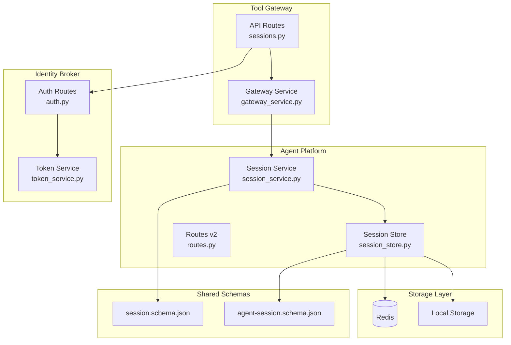
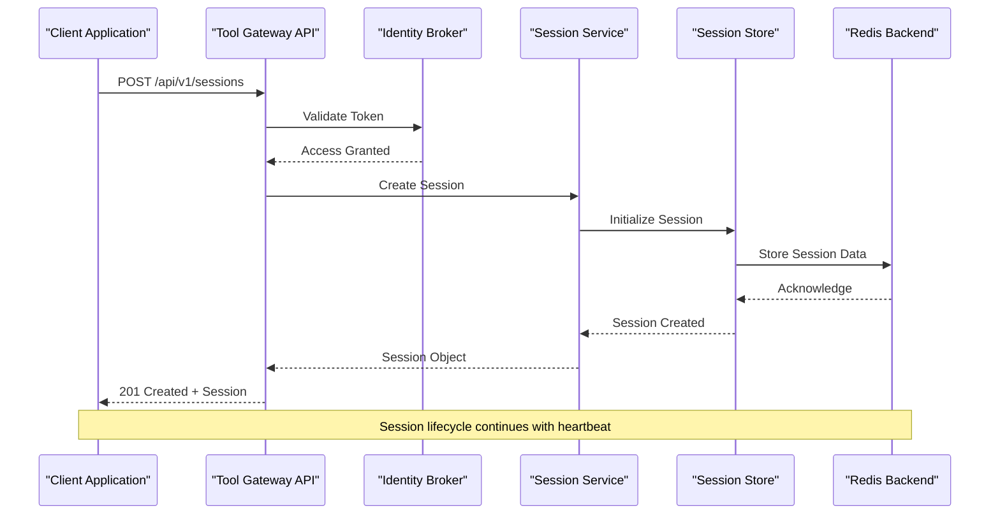
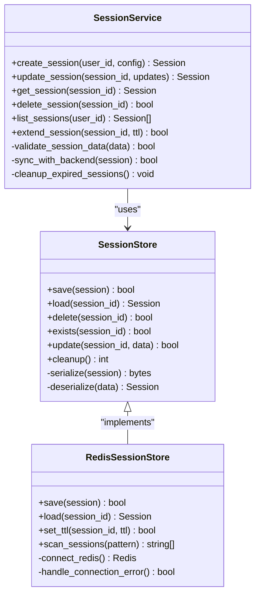
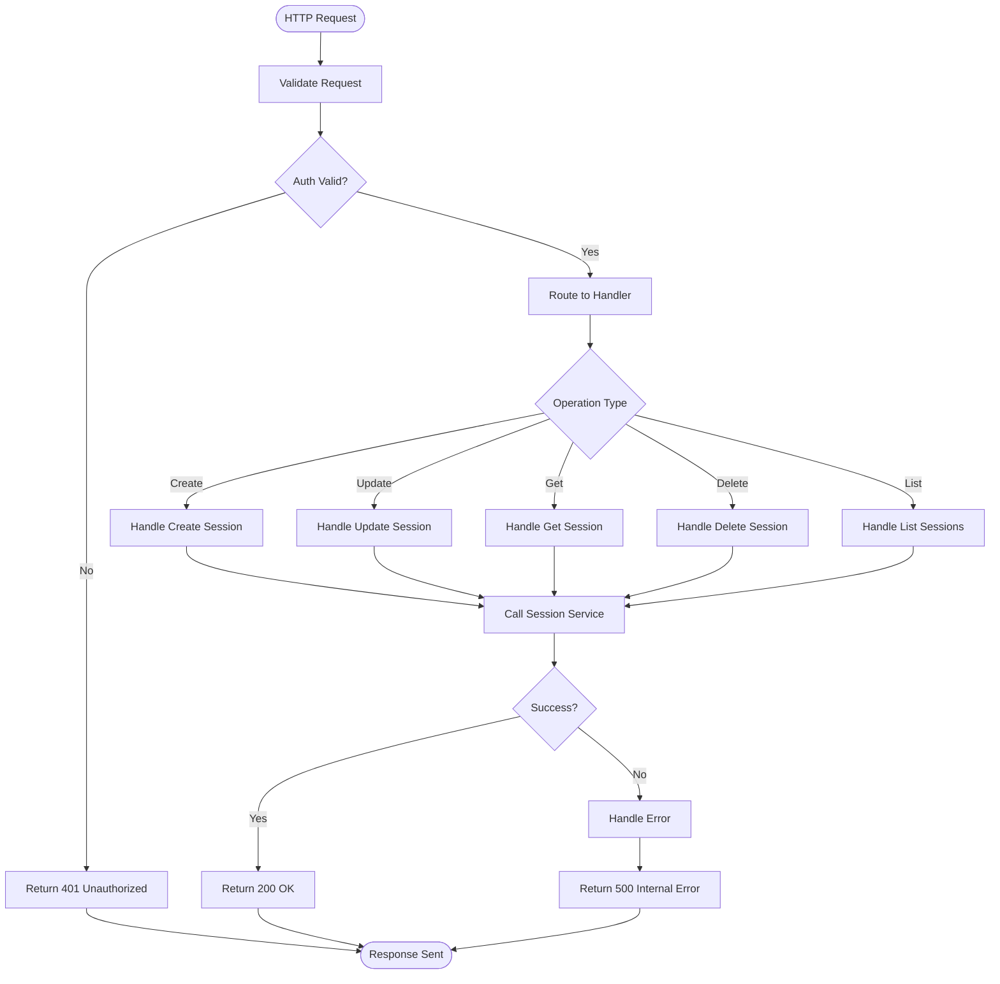
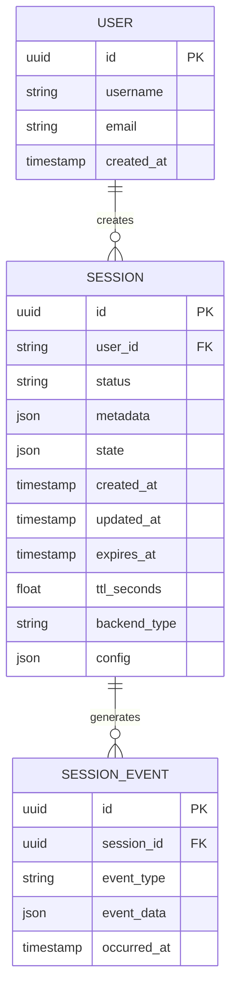
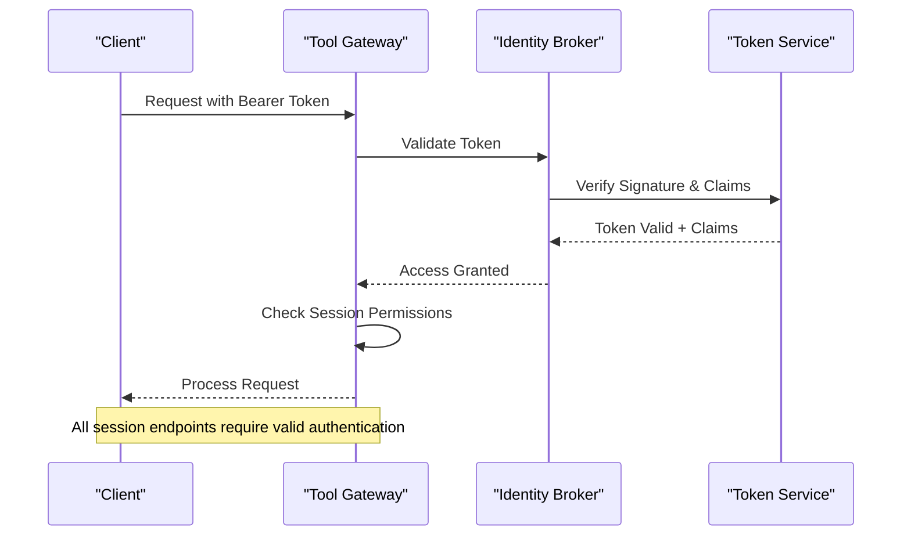
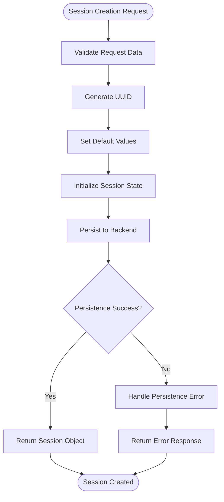
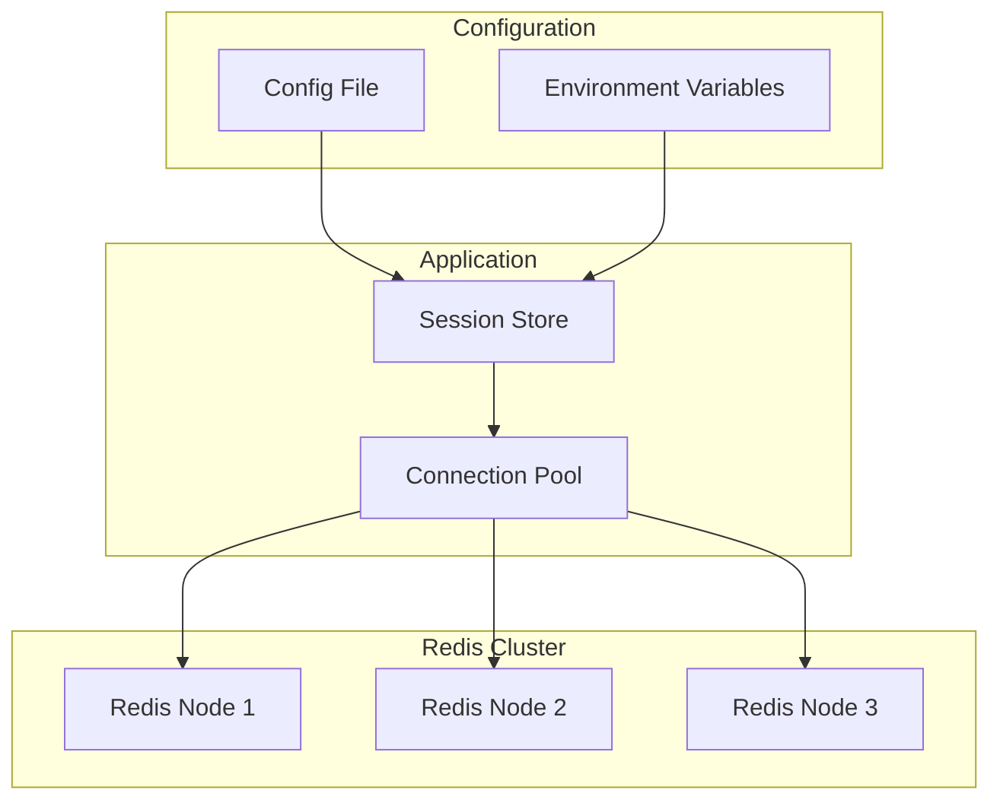

# Session Management API

<cite>
**Referenced Files in This Document**
- [sessions.py](file://products/tool-gateway/src/api_gateway/api/routes/sessions.py)
- [session_service.py](file://products/agent-platform/src/agent_service/services/session_service.py)
- [session_store.py](file://products/agent-platform/src/agent_service/services/session_store.py)
- [session.schema.json](file://shared/shared-contracts/schemas/session.schema.json)
- [agent-session.schema.json](file://shared/shared-contracts/schemas/agent-session.schema.json)
- [routes.py](file://products/agent-platform/src/agent_service/api/v2/routes.py)
- [api.py](file://products/agent-platform/src/agent_service/schemas/api.py)
- [v2.py](file://products/agent-platform/src/agent_service/schemas/v2.py)
- [auth.py](file://products/identity-broker/src/identity_service/api/routes/auth.py)
- [token_service.py](file://products/identity-broker/src/identity_service/services/token_service.py)
</cite>

## Table of Contents
1. [Introduction](#introduction)
2. [Project Structure](#project-structure)
3. [Core Components](#core-components)
4. [Architecture Overview](#architecture-overview)
5. [Detailed Component Analysis](#detailed-component-analysis)
6. [API Endpoints Reference](#api-endpoints-reference)
7. [Session Data Models](#session-data-models)
8. [Authentication & Authorization](#authentication--authorization)
9. [Session Lifecycle Management](#session-lifecycle-management)
10. [Redis Backend Configuration](#redis-backend-configuration)
11. [Performance Considerations](#performance-considerations)
12. [Troubleshooting Guide](#troubleshooting-guide)
13. [Conclusion](#conclusion)

## Introduction

The Session Management API provides comprehensive REST endpoints for managing agent sessions across the AI platform. Sessions represent the stateful context of agent interactions, enabling conversation continuity, tool execution tracking, and distributed state synchronization. The system supports both local and Redis-backed persistence, automatic timeout handling, and secure access control through the identity broker service.

## Project Structure

The session management functionality is distributed across multiple services:

**Diagram sources**
- [sessions.py](file://products/tool-gateway/src/api_gateway/api/routes/sessions.py)
- [session_service.py](file://products/agent-platform/src/agent_service/services/session_service.py)
- [session_store.py](file://products/agent-platform/src/agent_service/services/session_store.py)
- [auth.py](file://products/identity-broker/src/identity_service/api/routes/auth.py)

**Section sources**
- [sessions.py](file://products/tool-gateway/src/api_gateway/api/routes/sessions.py)
- [session_service.py](file://products/agent-platform/src/agent_service/services/session_service.py)

## Core Components

### Session Service
The Session Service orchestrates session operations including creation, updates, retrieval, and deletion. It handles business logic, validation, and coordination between different storage backends.

### Session Store
The Session Store provides abstraction over different persistence mechanisms, supporting both local memory storage and Redis for distributed environments.

### API Routes
The Tool Gateway exposes REST endpoints that handle HTTP requests, authentication, and request/response formatting.

### Authentication Service
The Identity Broker manages user authentication, token validation, and authorization policies for session access.

**Section sources**
- [session_service.py](file://products/agent-platform/src/agent_service/services/session_service.py)
- [session_store.py](file://products/agent-platform/src/agent_service/services/session_store.py)
- [sessions.py](file://products/tool-gateway/src/api_gateway/api/routes/sessions.py)

## Architecture Overview

The session management follows a layered architecture pattern with clear separation of concerns:

**Diagram sources**
- [sessions.py](file://products/tool-gateway/src/api_gateway/api/routes/sessions.py)
- [session_service.py](file://products/agent-platform/src/agent_service/services/session_service.py)
- [session_store.py](file://products/agent-platform/src/agent_service/services/session_store.py)

## Detailed Component Analysis

### Session Service Implementation

The Session Service implements core business logic for session management:

**Diagram sources**
- [session_service.py](file://products/agent-platform/src/agent_service/services/session_service.py)
- [session_store.py](file://products/agent-platform/src/agent_service/services/session_store.py)

### API Route Handlers

The Tool Gateway routes handle HTTP requests and coordinate with downstream services:

**Diagram sources**
- [sessions.py](file://products/tool-gateway/src/api_gateway/api/routes/sessions.py)

**Section sources**
- [session_service.py](file://products/agent-platform/src/agent_service/services/session_service.py)
- [session_store.py](file://products/agent-platform/src/agent_service/services/session_store.py)
- [sessions.py](file://products/tool-gateway/src/api_gateway/api/routes/sessions.py)

## API Endpoints Reference

### Session Management Endpoints

#### Create Session
- **Endpoint**: `POST /api/v1/sessions`
- **Description**: Creates a new agent session with specified configuration
- **Authentication**: Required (Bearer Token)
- **Authorization**: User must have `session:create` permission
- **Request Body**: Session creation payload
- **Response**: Created session object with metadata

#### Update Session
- **Endpoint**: `PUT /api/v1/sessions/{session_id}`
- **Description**: Updates session properties or extends TTL
- **Authentication**: Required (Bearer Token)
- **Authorization**: User must own the session or have `session:update` permission
- **Path Parameters**: session_id
- **Request Body**: Session updates payload
- **Response**: Updated session object

#### Get Session
- **Endpoint**: `GET /api/v1/sessions/{session_id}`
- **Description**: Retrieves session details and current state
- **Authentication**: Required (Bearer Token)
- **Authorization**: User must own the session or have `session:read` permission
- **Path Parameters**: session_id
- **Response**: Session object with full state

#### Delete Session
- **Endpoint**: `DELETE /api/v1/sessions/{session_id}`
- **Description**: Permanently deletes a session and all associated data
- **Authentication**: Required (Bearer Token)
- **Authorization**: User must own the session or have `session:delete` permission
- **Path Parameters**: session_id
- **Response**: 204 No Content on success

#### List Sessions
- **Endpoint**: `GET /api/v1/sessions`
- **Description**: Lists all sessions for authenticated user
- **Authentication**: Required (Bearer Token)
- **Authorization**: User must have `session:list` permission
- **Query Parameters**: 
  - `status`: Filter by session status
  - `limit`: Maximum number of results
  - `offset`: Pagination offset
- **Response**: Paginated list of session objects

**Section sources**
- [sessions.py](file://products/tool-gateway/src/api_gateway/api/routes/sessions.py)

## Session Data Models

### Session Schema
The session object follows a standardized schema defined in shared contracts:

**Diagram sources**
- [session.schema.json](file://shared/shared-contracts/schemas/session.schema.json)
- [agent-session.schema.json](file://shared/shared-contracts/schemas/agent-session.schema.json)

### Session States
Sessions transition through several states during their lifecycle:

| State | Description | Transitions |
|-------|-------------|-------------|
| `created` | Initial state after creation | → `active`, `failed` |
| `active` | Session is operational | → `paused`, `completed`, `expired` |
| `paused` | Session temporarily suspended | → `active`, `deleted` |
| `completed` | Session finished successfully | → `archived` |
| `expired` | Session TTL exceeded | → `deleted` |
| `failed` | Session encountered error | → `deleted` |
| `deleted` | Session permanently removed | → *terminal* |

### Session Metadata Fields
- `id`: Unique session identifier (UUID)
- `user_id`: Owner user identifier
- `status`: Current session state
- `metadata`: Custom key-value pairs for session configuration
- `state`: Runtime state data (serialized)
- `created_at`: Session creation timestamp
- `updated_at`: Last modification timestamp
- `expires_at`: Automatic expiration time
- `ttl_seconds`: Time-to-live in seconds
- `backend_type`: Storage backend identifier
- `config`: Session-specific configuration

**Section sources**
- [session.schema.json](file://shared/shared-contracts/schemas/session.schema.json)
- [agent-session.schema.json](file://shared/shared-contracts/schemas/agent-session.schema.json)

## Authentication & Authorization

### Authentication Flow
The session management API integrates with the Identity Broker for authentication:

**Diagram sources**
- [auth.py](file://products/identity-broker/src/identity_service/api/routes/auth.py)
- [token_service.py](file://products/identity-broker/src/identity_service/services/token_service.py)

### Authorization Matrix
Access control follows role-based permissions:

| Permission | Description | Required For |
|------------|-------------|--------------|
| `session:create` | Create new sessions | POST /api/v1/sessions |
| `session:read` | Read session data | GET /api/v1/sessions/{id} |
| `session:update` | Modify session properties | PUT /api/v1/sessions/{id} |
| `session:delete` | Delete sessions | DELETE /api/v1/sessions/{id} |
| `session:list` | List user sessions | GET /api/v1/sessions |
| `session:admin` | Administrative operations | All operations |

### Security Considerations
- All endpoints require valid JWT tokens
- Session ownership validation prevents unauthorized access
- Input sanitization protects against injection attacks
- Rate limiting prevents abuse and DoS attacks
- Audit logging tracks all session operations
- TLS encryption for all communications

**Section sources**
- [auth.py](file://products/identity-broker/src/identity_service/api/routes/auth.py)
- [token_service.py](file://products/identity-broker/src/identity_service/services/token_service.py)

## Session Lifecycle Management

### Creation Process
Session initialization involves multiple steps:

**Diagram sources**
- [session_service.py](file://products/agent-platform/src/agent_service/services/session_service.py)

### Heartbeat & Timeout Handling
Sessions implement automatic timeout management:

- **TTL Extension**: Clients can extend session lifetime via heartbeat
- **Automatic Cleanup**: Background jobs remove expired sessions
- **Graceful Degradation**: Partial failures don't affect active sessions
- **Recovery Mechanisms**: Failed operations are retried with exponential backoff

### Cleanup Procedures
Automated cleanup processes manage session lifecycle:

1. **Expired Session Detection**: Periodic scan for TTL-exceeded sessions
2. **Resource Cleanup**: Remove associated temporary files and resources
3. **Audit Logging**: Record cleanup activities for compliance
4. **Notification**: Optional alerts for important session terminations

**Section sources**
- [session_service.py](file://products/agent-platform/src/agent_service/services/session_service.py)

## Redis Backend Configuration

### Connection Setup
Redis backend configuration supports multiple deployment scenarios:

**Diagram sources**
- [session_store.py](file://products/agent-platform/src/agent_service/services/session_store.py)

### Key Naming Convention
Redis keys follow a structured naming pattern:

- `session:{user_id}:{session_id}` - Main session data
- `session:metadata:{session_id}` - Session metadata
- `session:events:{session_id}` - Session event log
- `session:index:user:{user_id}` - User session index
- `session:lock:{session_id}` - Distributed locking

### Performance Optimization
Redis backend includes performance optimizations:

- **Connection Pooling**: Reuses connections for better throughput
- **Pipeline Operations**: Batch operations reduce network overhead
- **Serialization**: Efficient JSON serialization with compression
- **Caching**: Local caching layer for frequently accessed data
- **Monitoring**: Health checks and metrics collection

**Section sources**
- [session_store.py](file://products/agent-platform/src/agent_service/services/session_store.py)

## Performance Considerations

### Scalability Patterns
The session management system supports horizontal scaling:

- **Stateless API Layer**: Multiple gateway instances behind load balancer
- **Distributed Storage**: Redis cluster for consistent state across nodes
- **Connection Pooling**: Optimized database and cache connections
- **Async Processing**: Non-blocking operations for better throughput

### Monitoring & Metrics
Key performance indicators include:

- **Session Creation Time**: Average time to create new sessions
- **Read/Write Latency**: P95 latency for session operations
- **Memory Usage**: Redis memory consumption trends
- **Error Rates**: Failure rates for session operations
- **Throughput**: Sessions created/updated per second

### Optimization Recommendations
- Use connection pooling for Redis connections
- Implement request batching for bulk operations
- Enable compression for large session payloads
- Configure appropriate TTL values based on usage patterns
- Monitor and tune Redis memory limits

## Troubleshooting Guide

### Common Issues

#### Connection Problems
- **Symptoms**: Timeout errors, connection refused
- **Causes**: Redis connectivity issues, network problems
- **Solutions**: Check Redis health, verify network connectivity, review connection pool settings

#### Authentication Failures
- **Symptoms**: 401 Unauthorized responses
- **Causes**: Invalid tokens, expired credentials, insufficient permissions
- **Solutions**: Validate token format, check expiration times, verify user permissions

#### Session Not Found
- **Symptoms**: 404 Not Found errors
- **Causes**: Incorrect session ID, deleted sessions, wrong user context
- **Solutions**: Verify session ID format, check session existence, validate user ownership

#### Performance Issues
- **Symptoms**: Slow response times, high memory usage
- **Causes**: Large session payloads, inefficient queries, resource exhaustion
- **Solutions**: Optimize payload size, review query patterns, scale resources

### Debugging Tools
- **Health Check Endpoints**: `/health` and `/ready` for service status
- **Metrics Export**: Prometheus-compatible metrics endpoint
- **Structured Logging**: JSON-formatted logs with correlation IDs
- **Trace Collection**: Distributed tracing for request flow analysis

**Section sources**
- [session_service.py](file://products/agent-platform/src/agent_service/services/session_service.py)
- [session_store.py](file://products/agent-platform/src/agent_service/services/session_store.py)

## Conclusion

The Session Management API provides a robust, scalable foundation for managing agent sessions in distributed AI applications. With comprehensive authentication, flexible storage backends, and automated lifecycle management, it enables reliable session state persistence across diverse deployment scenarios. The modular architecture allows for easy customization and extension while maintaining strong security and performance characteristics.

Key strengths include:
- **Security**: Comprehensive authentication and authorization
- **Scalability**: Horizontal scaling with Redis backend
- **Reliability**: Automated cleanup and recovery mechanisms
- **Flexibility**: Pluggable storage backends and configurable behavior
- **Observability**: Rich metrics and logging capabilities

The system is designed to support both simple single-instance deployments and complex distributed architectures, making it suitable for a wide range of AI application requirements.