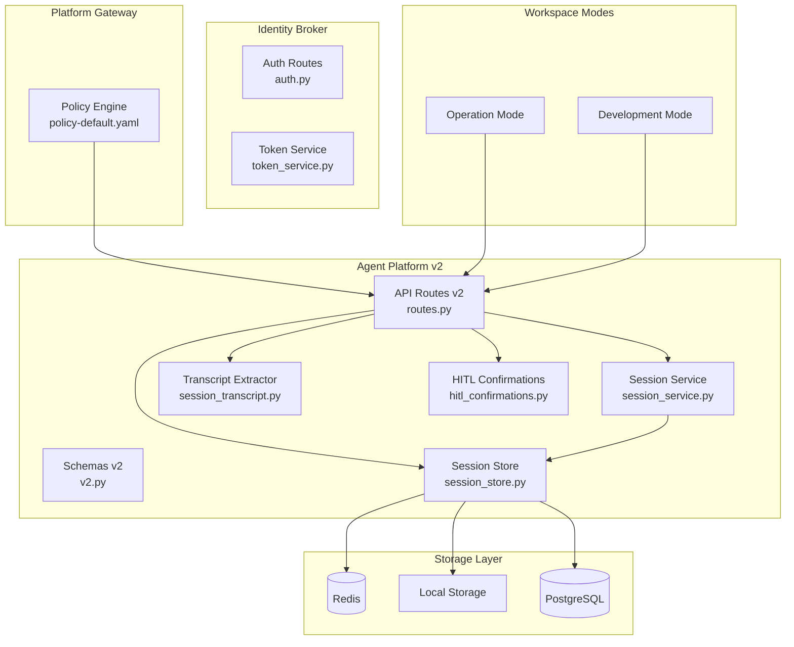
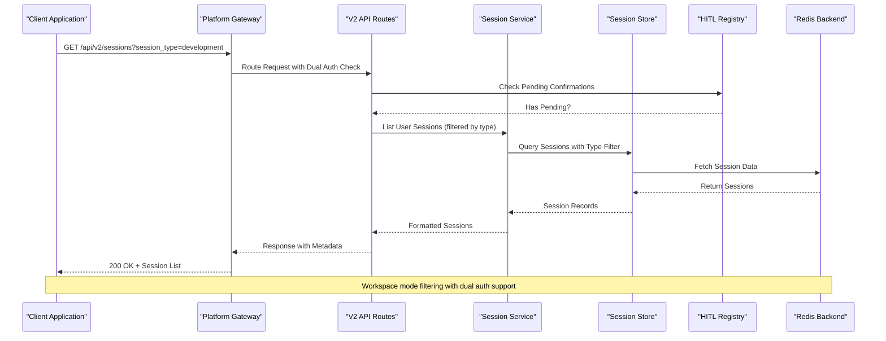
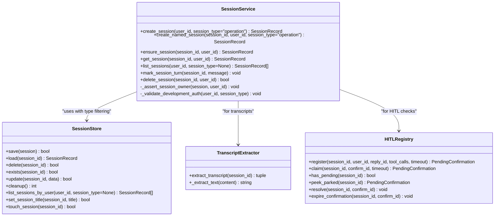
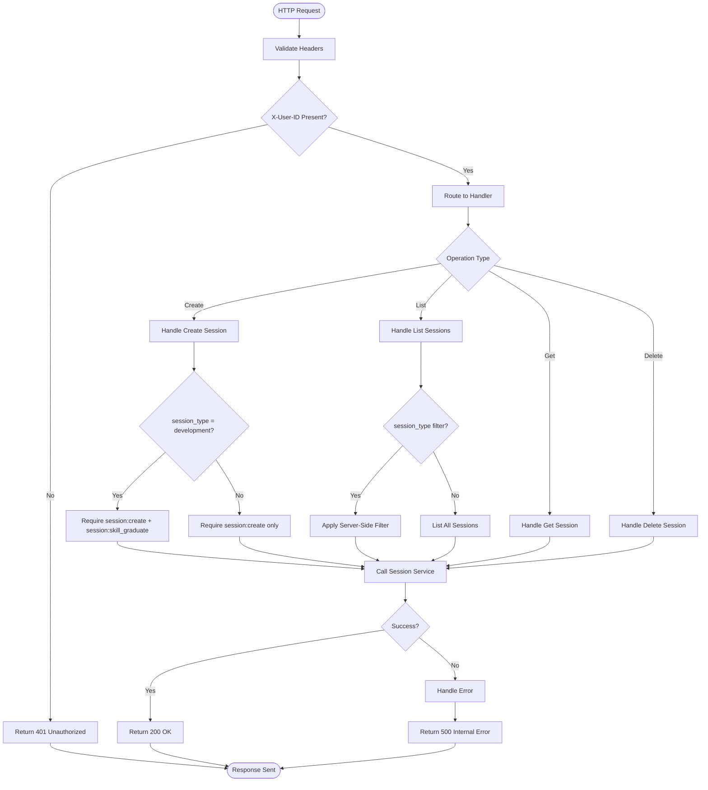
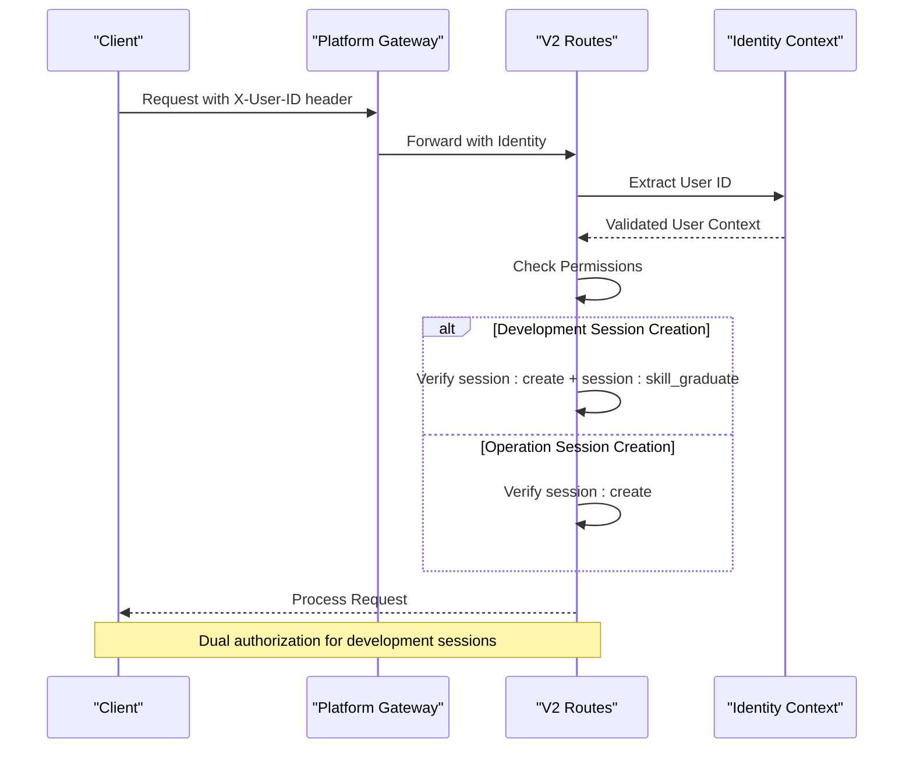
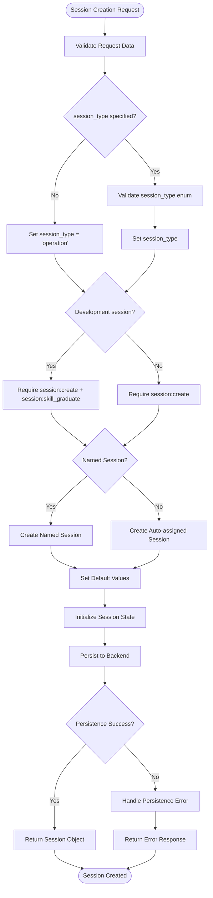
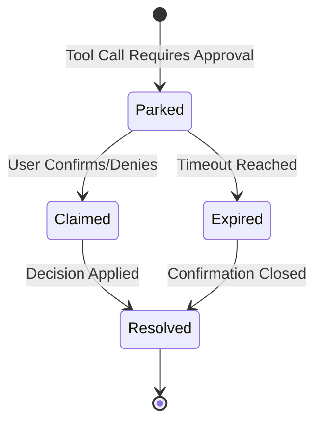
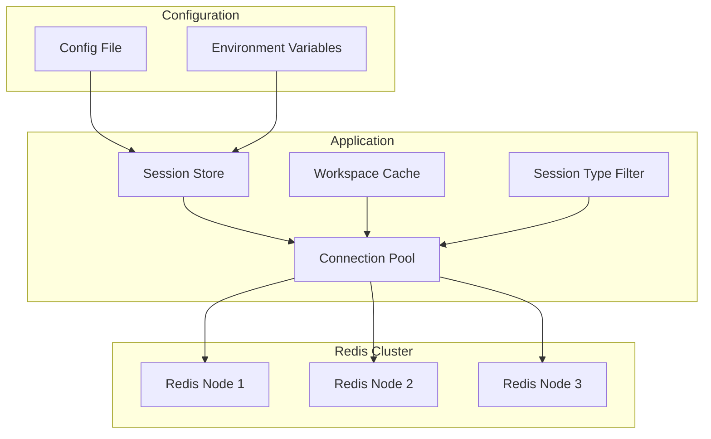

# Session Management API

<cite>
**Referenced Files in This Document**
- [routes.py](file://products/agent-platform/src/agent_service/api/v2/routes.py)
- [v2.py](file://products/agent-platform/src/agent_service/schemas/v2.py)
- [session_service.py](file://products/agent-platform/src/agent_service/services/session_service.py)
- [session_store.py](file://products/agent-platform/src/agent_service/services/session_store.py)
- [session_transcript.py](file://products/agent-platform/src/agent_service/services/session_transcript.py)
- [hitl_confirmations.py](file://products/agent-platform/src/agent_service/services/hitl_confirmations.py)
- [policy-default.yaml](file://products/platform-gateway/src/platform_gateway/policies/policy-default.yaml)
- [policy-default.yaml](file://shared/shared-contracts/policies/policy-default.yaml)
- [session.schema.json](file://shared/shared-contracts/schemas/session.schema.json)
- [agent-session.schema.json](file://shared/shared-contracts/schemas/agent-session.schema.json)
- [test_session_type.py](file://products/agent-platform/tests/test_session_type.py)
- [test_session_workspace.py](file://products/agent-platform/tests/test_session_workspace.py)
- [spec.md](file://docs/specs/SPEC-056-studio-skill-development-workspace/spec.md)
- [plan.md](file://docs/specs/SPEC-056-studio-skill-development-workspace/plan.md)
</cite>

## Update Summary
**Changes Made**
- Added comprehensive documentation for the new `session_type` discriminator field with immutable "operation" and "development" values
- Updated session creation endpoints to support dual authorization requirements for development sessions (both `session:create` and `session:skill_graduate` permissions)
- Documented server-side filtering by session type in list operations with bounded enum validation
- Enhanced session data models to include the additive `session_type` field across all storage backends
- Updated authorization matrix to reflect new skill graduation permissions for development workflows
- Added documentation for workspace mode separation between operation and development sessions

## Table of Contents
1. [Introduction](#introduction)
2. [Project Structure](#project-structure)
3. [Core Components](#core-components)
4. [Architecture Overview](#architecture-overview)
5. [Detailed Component Analysis](#detailed-component-analysis)
6. [API Endpoints Reference](#api-endpoints-reference)
7. [Session Data Models](#session-data-models)
8. [Authentication & Authorization](#authentication--authorization)
9. [Session Lifecycle Management](#session-lifecycle-management)
10. [Multi-Session Workspace Features](#multi-session-workspace-features)
11. [HITL Confirmation Integration](#hitl-confirmation-integration)
12. [Transcript Reconstruction](#transcript-reconstruction)
13. [Redis Backend Configuration](#redis-backend-configuration)
14. [Performance Considerations](#performance-considerations)
15. [Troubleshooting Guide](#troubleshooting-guide)
16. [Conclusion](#conclusion)

## Introduction

The Session Management API provides comprehensive REST endpoints for managing agent sessions across the AI platform with enhanced workspace capabilities. The system now supports a dual-mode architecture through the introduction of the `session_type` discriminator field, which distinguishes between operational sessions (`operation`) and development sessions (`development`). Sessions represent the stateful context of agent interactions, enabling conversation continuity, tool execution tracking, and distributed state synchronization. The system supports both local and Redis-backed persistence, automatic timeout handling, secure access control through the identity broker service, and Human-in-the-Loop (HITL) confirmation workflows. Development sessions require dual authorization for skill graduation workflows, while operational sessions follow standard permission patterns.

## Project Structure

The session management functionality is distributed across multiple services with clear separation between v1 and v2 APIs, now enhanced with workspace mode separation:



**Diagram sources**
- [routes.py:52-457](file://products/agent-platform/src/agent_service/api/v2/routes.py#L52-L457)
- [v2.py:1-192](file://products/agent-platform/src/agent_service/schemas/v2.py#L1-L192)
- [session_service.py:1-123](file://products/agent-platform/src/agent_service/services/session_service.py#L1-L123)

**Section sources**
- [routes.py](file://products/agent-platform/src/agent_service/api/v2/routes.py)
- [v2.py](file://products/agent-platform/src/agent_service/schemas/v2.py)

## Core Components

### Session Service
The Session Service orchestrates session operations including creation, updates, retrieval, deletion, and listing with enhanced workspace mode support. It handles business logic, validation, workspace features like title minting and activity tracking, and coordination between different storage backends. The service now enforces session type immutability and dual authorization requirements for development sessions.

### Session Store
The Session Store provides abstraction over different persistence mechanisms, supporting both local memory storage, Redis for distributed environments, and PostgreSQL for production deployments. Enhanced with `session_type` field support across all backends and server-side filtering capabilities.

### Transcript Reconstruction
A specialized component that extracts conversation history from kernel state snapshots, providing best-effort transcript reconstruction for session viewing without requiring live stream replay.

### HITL Confirmation Registry
An in-memory registry that manages Human-in-the-Loop confirmations, tracking parked tool calls and their resolution status to prevent orphaned approval workflows.

### Policy Engine
The Platform Gateway enforces authorization policies for session operations with enhanced dual authorization support for development session graduation workflows.

**Section sources**
- [session_service.py:1-123](file://products/agent-platform/src/agent_service/services/session_service.py#L1-L123)
- [session_store.py](file://products/agent-platform/src/agent_service/services/session_store.py)
- [session_transcript.py:1-83](file://products/agent-platform/src/agent_service/services/session_transcript.py#L1-L83)
- [hitl_confirmations.py:1-229](file://products/agent-platform/src/agent_service/services/hitl_confirmations.py#L1-L229)

## Architecture Overview

The session management follows a layered architecture pattern with clear separation of concerns between v1 and v2 APIs, now enhanced with workspace mode separation and dual authorization:



**Diagram sources**
- [routes.py:354-372](file://products/agent-platform/src/agent_service/api/v2/routes.py#L354-L372)
- [session_service.py:72-84](file://products/agent-platform/src/agent_service/services/session_service.py#L72-L84)
- [hitl_confirmations.py:215-224](file://products/agent-platform/src/agent_service/services/hitl_confirmations.py#L215-L224)

## Detailed Component Analysis

### Enhanced Session Service with Workspace Modes

The enhanced Session Service implements comprehensive workspace features with session type discrimination:



**Diagram sources**
- [session_service.py:19-123](file://products/agent-platform/src/agent_service/services/session_service.py#L19-L123)
- [session_transcript.py:30-83](file://products/agent-platform/src/agent_service/services/session_transcript.py#L30-L83)
- [hitl_confirmations.py:93-229](file://products/agent-platform/src/agent_service/services/hitl_confirmations.py#L93-L229)

### Enhanced V2 API Route Handlers

The enhanced v2 routes provide comprehensive session management with workspace mode support:



**Diagram sources**
- [routes.py:334-420](file://products/agent-platform/src/agent_service/api/v2/routes.py#L334-L420)

**Section sources**
- [routes.py:334-420](file://products/agent-platform/src/agent_service/api/v2/routes.py#L334-L420)
- [session_service.py:19-123](file://products/agent-platform/src/agent_service/services/session_service.py#L19-L123)

## API Endpoints Reference

### Enhanced V2 Session Management Endpoints

#### Create Session
- **Endpoint**: `POST /api/v2/sessions`
- **Description**: Creates a new agent session with optional named session support and workspace mode
- **Authentication**: Required (X-User-ID header)
- **Authorization**: 
  - For `operation` sessions: Requires `session:create` permission
  - For `development` sessions: Requires both `session:create` AND `session:skill_graduate` permissions (dual authorization)
- **Request Body**: Optional `AgentSessionCreateRequest` with optional `session_id` for named sessions and `session_type` parameter
- **Response**: `AgentSession` object with session metadata including `session_type`
- **Special Features**: Supports dedicated named sessions for incident triage scenarios and workspace mode separation

#### List Sessions
- **Endpoint**: `GET /api/v2/sessions`
- **Description**: Lists all sessions for authenticated user with optional workspace mode filtering, most-recently-active first
- **Authentication**: Required (X-User-ID header)
- **Authorization**: Requires `session:list` permission
- **Query Parameters**: Optional `session_type` filter with bounded enum validation ("operation" | "development")
- **Response**: `AgentSessionList` containing up to 50 sessions with summary information
- **Features**: Includes `pending_confirmation` flag for each session based on HITL registry and server-side filtering by session type

#### Get Session
- **Endpoint**: `GET /api/v2/sessions/{session_id}`
- **Description**: Retrieves detailed session information including transcript availability
- **Authentication**: Required (X-User-ID header)
- **Authorization**: Requires `session:read` permission
- **Path Parameters**: session_id
- **Response**: `AgentSession` object with full details including transcript reconstruction
- **Features**: Includes `transcript_available` flag and reconstructed transcript when possible

#### Delete Session
- **Endpoint**: `DELETE /api/v2/sessions/{session_id}`
- **Description**: Permanently deletes a session and all associated data
- **Authentication**: Required (X-User-ID header)
- **Authorization**: Requires `session:delete` permission
- **Path Parameters**: session_id
- **Response**: JSON object confirming deletion with `session_id` and `deleted: true`
- **Security**: Prevents deletion of sessions with pending HITL confirmations (returns 409)

**Section sources**
- [routes.py:334-420](file://products/agent-platform/src/agent_service/api/v2/routes.py#L334-L420)
- [v2.py:124-165](file://products/agent-platform/src/agent_service/schemas/v2.py#L124-L165)

## Session Data Models

### Enhanced Session Schema with Session Type Discriminator

The v2 session objects follow an enhanced schema with workspace features and immutable session type discrimination:

```mermaid
erDiagram
SESSION {
uuid session_id PK
string user_id FK
string status
datetime created_at
datetime last_active_at
string title
boolean pending_confirmation
boolean transcript_available
json transcript
string session_type ENUM
}
USER {
uuid id PK
string username
string email
timestamp created_at
}
SESSION_EVENT {
uuid id PK
uuid session_id FK
string event_type
json event_data
timestamp occurred_at
}
USER ||--o{ SESSION : creates
SESSION ||--o{ SESSION_EVENT : generates
```

**Diagram sources**
- [v2.py:124-165](file://products/agent-platform/src/agent_service/schemas/v2.py#L124-L165)
- [session.schema.json](file://shared/shared-contracts/schemas/session.schema.json)

### Enhanced Session Fields with Session Type Support
- `session_id`: Unique session identifier (UUID)
- `user_id`: Owner user identifier
- `status`: Current session state (`active`, `expired`)
- `created_at`: Session creation timestamp
- `last_active_at`: Last activity timestamp for sorting
- `title`: Server-minted title from first user message (max 80 chars)
- `pending_confirmation`: Boolean indicating unresolved HITL confirmation
- `transcript_available`: Boolean indicating if transcript can be reconstructed
- `transcript`: Array of conversation turns when available
- `session_type`: Immutable discriminator field with values "operation" or "development", default "operation"

### Session States and Types
Sessions transition through several states during their lifecycle with fixed session types:

| State | Description | Transitions |
|-------|-------------|-------------|
| `active` | Session is operational | → `expired`, `deleted` |
| `expired` | Session TTL exceeded | → `deleted` |
| `deleted` | Session permanently removed | → *terminal* |

| Session Type | Description | Creation Context |
|--------------|-------------|------------------|
| `operation` | Standard operational sessions | Created from Chat interface |
| `development` | Skill development sessions | Created from Studio interface |

**Section sources**
- [v2.py:124-165](file://products/agent-platform/src/agent_service/schemas/v2.py#L124-L165)
- [session_schema.json](file://shared/shared-contracts/schemas/session.schema.json)

## Authentication & Authorization

### Enhanced V2 Authentication Flow with Dual Authorization

The v2 API uses a simplified authentication model with header-based identity and enhanced authorization for development sessions:



**Diagram sources**
- [routes.py:55-68](file://products/agent-platform/src/agent_service/api/v2/routes.py#L55-L68)

### Enhanced Authorization Matrix with Session Type Support

Access control includes new session management permissions with dual authorization for development workflows:

| Permission | Description | Required For |
|------------|-------------|--------------|
| `session:create` | Create new sessions | POST /api/v2/sessions (operation sessions) |
| `session:skill_graduate` | Graduate development sessions | POST /api/v2/sessions (development sessions) |
| `session:read` | Read session data | GET /api/v2/sessions/{id} |
| `session:list` | List user sessions | GET /api/v2/sessions |
| `session:delete` | Delete sessions | DELETE /api/v2/sessions/{id} |
| `chat` | Chat operations | POST /api/v2/chat |
| `chat:confirm` | Answer parked confirmations | POST /api/v2/chat/confirm |

### Policy Configuration Updates with Session Type Support

The policy engine has been updated to support new session management actions with dual authorization:

```yaml
rules:
  - id: allow-operators-chat
    match:
      roles_any: ["platform-admin", "approver", "operator", "developer"]
      actions_any: ["chat", "session:create", "session:read", "session:list", "session:delete", "session:skill_graduate"]
    decision:
      outcome: allow

  - id: allow-observer-read-and-chat
    match:
      roles_any: ["read-only-observer"]
      actions_any: ["chat", "session:create", "session:read", "session:list", "session:delete"]
    decision:
      outcome: allow
```

**Section sources**
- [policy-default.yaml:24-44](file://products/platform-gateway/src/platform_gateway/policies/policy-default.yaml#L24-L44)
- [policy-default.yaml:24-44](file://shared/shared-contracts/policies/policy-default.yaml#L24-L44)

## Session Lifecycle Management

### Enhanced Creation Process with Session Type Discrimination

Session initialization now includes workspace features and immutable session type assignment:



**Diagram sources**
- [session_service.py:26-62](file://products/agent-platform/src/agent_service/services/session_service.py#L26-L62)

### Enhanced Workspace Features with Session Type Support

Enhanced session management includes workspace capabilities with session type discrimination:

- **Title Minting**: Automatic title generation from first user message (80-char cap)
- **Activity Tracking**: `last_active_at` timestamp updated on each interaction
- **Session Limiting**: Maximum 50 sessions per user in list responses
- **Ownership Validation**: Anti-enumeration prevents cross-user session access
- **Session Type Immutability**: `session_type` field set once at creation and never changed
- **Server-Side Filtering**: Bounded enum validation for session type queries

### Cleanup Procedures with Enhanced Safety

Automated cleanup processes manage session lifecycle with enhanced safety:

1. **HITL Safety Checks**: Sessions with pending confirmations cannot be deleted
2. **Resource Cleanup**: Associated temporary files and agent state removed
3. **Audit Logging**: Comprehensive logging of cleanup activities
4. **Graceful Degradation**: Failures in cleanup don't prevent session deletion
5. **Session Type Preservation**: Cleanup maintains session type integrity

**Section sources**
- [session_service.py:86-123](file://products/agent-platform/src/agent_service/services/session_service.py#L86-L123)
- [routes.py:398-420](file://products/agent-platform/src/agent_service/api/v2/routes.py#L398-L420)

## Multi-Session Workspace Features

### Enhanced Session Listing with Workspace Mode Support

The v2 API provides comprehensive session listing with workspace context and session type filtering:

- **Recent Activity Ordering**: Sessions sorted by `last_active_at` or `created_at`
- **Summary Information**: Compact view with essential session metadata
- **HITL Status Indicators**: `pending_confirmation` flag for UI badges
- **Pagination Support**: Capped at 50 sessions to prevent performance issues
- **Server-Side Filtering**: Bounded enum validation for session_type parameter
- **Workspace Mode Separation**: Operation and development sessions managed independently

### Title Management with Session Type Awareness

Automatic title generation enhances user experience across workspace modes:

- **First Message Extraction**: Title derived from initial user message
- **Character Limiting**: 80-character maximum to ensure consistent display
- **Server-Side Generation**: Never model-supplied to prevent injection
- **Immutable After Creation**: Title set once and never rewritten
- **Session Type Context**: Titles work consistently across operation and development modes

### Activity Tracking with Workspace Mode Support

Comprehensive activity monitoring enables better session management across workspace modes:

- **Last Active Timestamp**: Updated on every chat turn
- **Creation Timestamp**: Immutable session creation time
- **Sorting Support**: Enables "most recently active" ordering
- **Cleanup Triggers**: Expired sessions identified by activity patterns
- **Session Type Isolation**: Activity tracking respects session type boundaries

**Section sources**
- [session_service.py:72-102](file://products/agent-platform/src/agent_service/services/session_service.py#L72-L102)
- [routes.py:354-372](file://products/agent-platform/src/agent_service/api/v2/routes.py#L354-L372)

## HITL Confirmation Integration

### Enhanced Confirmation Registry with Session Type Support

The HITL confirmation system manages human-in-the-loop workflows with session type awareness:



**Diagram sources**
- [hitl_confirmations.py:34-57](file://products/agent-platform/src/agent_service/services/hitl_confirmations.py#L34-L57)

### Enhanced Pending Confirmation Handling

Enhanced session operations integrate HITL confirmation status with session type support:

- **Prevention of New Turns**: Sessions with parked confirmations reject new messages (409)
- **Deletion Protection**: Sessions with pending confirmations cannot be deleted (409)
- **Status Exposure**: `pending_confirmation` field indicates HITL state
- **TTL Management**: Automatic expiration handling with proper cleanup
- **Session Type Isolation**: HITL confirmations respect session type boundaries

### Enhanced Confirmation Resolution

Robust confirmation lifecycle management with workspace mode support:

- **Single Flight Guarantees**: Prevents duplicate confirmations
- **Owner Validation**: Only session owners can resolve confirmations
- **Timeout Handling**: Proper expiry with user notification
- **State Consistency**: Ensures confirmation state matches actual workflow
- **Session Type Context**: Confirmations work consistently across operation and development modes

**Section sources**
- [hitl_confirmations.py:93-229](file://products/agent-platform/src/agent_service/services/hitl_confirmations.py#L93-L229)
- [routes.py:71-100](file://products/agent-platform/src/agent_service/api/v2/routes.py#L71-L100)

## Transcript Reconstruction

### Enhanced Best-Effort Transcript Extraction

The transcript reconstruction system provides conversation history with session type awareness:


**Diagram sources**
- [session_transcript.py:30-65](file://products/agent-platform/src/agent_service/services/session_transcript.py#L30-L65)

### Enhanced Transcript Format

Reconstructed transcripts follow a standardized format with session type context:

- **Role-Based Structure**: Each turn contains `role` and `content` fields
- **Content Flattening**: Complex message structures flattened to text
- **Timestamp Inclusion**: Optional `created_at` timestamps when available
- **Quality Indicators**: `transcript_available` flag indicates reconstruction success
- **Session Type Context**: Transcripts work consistently across operation and development modes

### Enhanced Limitations and Fallbacks

Robust error handling ensures reliability across workspace modes:

- **Missing State**: Returns empty transcript when state unavailable
- **Corrupt Data**: Gracefully handles malformed JSON or unexpected formats
- **Unknown Shapes**: Skips unrecognized message structures
- **Tool/Event Filtering**: Excludes non-conversation content from transcripts
- **Session Type Isolation**: Transcript extraction respects session type boundaries

**Section sources**
- [session_transcript.py:1-83](file://products/agent-platform/src/agent_service/services/session_transcript.py#L1-L83)
- [routes.py:375-395](file://products/agent-platform/src/agent_service/api/v2/routes.py#L375-L395)

## Redis Backend Configuration

### Enhanced Connection Setup with Session Type Support

Redis backend configuration supports multiple deployment scenarios with enhanced workspace features and session type discrimination:



**Diagram sources**
- [session_store.py](file://products/agent-platform/src/agent_service/services/session_store.py)

### Enhanced Key Naming Convention with Session Type

Redis keys now include workspace metadata and session type information:

- `session:{user_id}:{session_id}` - Main session data with workspace info and session type
- `session:metadata:{session_id}` - Session metadata including title, activity, and session type
- `session:events:{session_id}` - Session event log
- `session:index:user:{user_id}` - User session index with activity sorting and session type
- `session:lock:{session_id}` - Distributed locking for workspace operations
- `session:type:{session_id}` - Session type cache for fast filtering

### Enhanced Performance Optimization

Redis backend includes workspace-specific optimizations with session type support:

- **Connection Pooling**: Reuses connections for better throughput
- **Pipeline Operations**: Batch operations reduce network overhead
- **Serialization**: Efficient JSON serialization with compression
- **Caching**: Local caching layer for frequently accessed workspace data
- **Monitoring**: Health checks and metrics collection for workspace operations
- **Session Type Indexing**: Optimized indexing for session type filtering
- **Type-Aware Queries**: Efficient server-side filtering by session type

**Section sources**
- [session_store.py](file://products/agent-platform/src/agent_service/services/session_store.py)

## Performance Considerations

### Enhanced Scalability Patterns

The enhanced session management system supports horizontal scaling with workspace mode separation:

- **Stateless API Layer**: Multiple gateway instances behind load balancer
- **Distributed Storage**: Redis cluster for consistent state across nodes
- **Connection Pooling**: Optimized database and cache connections
- **Async Processing**: Non-blocking operations for better throughput
- **Workspace Caching**: Local caching for frequently accessed session metadata
- **Session Type Indexing**: Optimized indexing for fast session type filtering
- **Dual Authorization Caching**: Cached permission checks for development sessions

### Enhanced Monitoring & Metrics

Key performance indicators include workspace-specific metrics with session type support:

- **Session Creation Time**: Average time to create new sessions (by type)
- **List Performance**: Time complexity for session listing operations (with filters)
- **Transcript Reconstruction**: Performance of conversation history extraction
- **HITL Registry Size**: Memory usage for pending confirmations
- **Memory Usage**: Redis memory consumption trends
- **Error Rates**: Failure rates for session operations
- **Throughput**: Sessions created/updated per second (by type)
- **Authorization Latency**: Time for dual authorization checks
- **Filter Performance**: Query performance for session type filtering

### Enhanced Optimization Recommendations

- Use connection pooling for Redis connections
- Implement request batching for bulk operations
- Enable compression for large session payloads
- Configure appropriate TTL values based on usage patterns
- Monitor and tune Redis memory limits
- Optimize transcript extraction for large conversation histories
- Cache workspace metadata to reduce database queries
- Implement session type-specific indexes for faster filtering
- Cache dual authorization results for development sessions
- Optimize query patterns for session type filtering

## Troubleshooting Guide

### Enhanced Common Issues with Session Type Support

#### Connection Problems
- **Symptoms**: Timeout errors, connection refused
- **Causes**: Redis connectivity issues, network problems
- **Solutions**: Check Redis health, verify network connectivity, review connection pool settings

#### Authentication Failures
- **Symptoms**: 401 Unauthorized responses
- **Causes**: Missing X-User-ID header, invalid tokens, insufficient permissions
- **Solutions**: Validate header presence, check token format, verify user permissions

#### Session Not Found
- **Symptoms**: 404 Not Found errors
- **Causes**: Incorrect session ID, deleted sessions, wrong user context
- **Solutions**: Verify session ID format, check session existence, validate user ownership

#### Session Type Filtering Issues
- **Symptoms**: 422 Unprocessable Entity errors, incorrect session filtering
- **Causes**: Invalid session_type parameter, unknown session type values
- **Solutions**: Validate session_type enum values ("operation" | "development"), check query parameters

#### Dual Authorization Problems
- **Symptoms**: 403 Forbidden errors for development session creation
- **Causes**: Missing session:skill_graduate permission for development sessions
- **Solutions**: Verify both session:create and session:skill_graduate permissions for development sessions

#### HITL Confirmation Issues
- **Symptoms**: 409 Conflict errors, stuck confirmations
- **Causes**: Pending confirmations blocking operations, expired confirmations
- **Solutions**: Resolve pending confirmations, check confirmation registry, verify timeout settings

#### Performance Issues
- **Symptoms**: Slow response times, high memory usage
- **Causes**: Large session payloads, inefficient queries, resource exhaustion
- **Solutions**: Optimize payload size, review query patterns, scale resources, optimize session type filtering

### Enhanced Debugging Tools

- **Health Check Endpoints**: `/api/v2/health` for service status
- **Metrics Export**: Prometheus-compatible metrics endpoint
- **Structured Logging**: JSON-formatted logs with correlation IDs
- **Trace Collection**: Distributed tracing for request flow analysis
- **HITL Registry Inspection**: Tools to inspect pending confirmations
- **Session Type Audit Logs**: Logs showing session type assignments and filtering
- **Authorization Audit Logs**: Logs showing dual authorization checks for development sessions

**Section sources**
- [routes.py:425-457](file://products/agent-platform/src/agent_service/api/v2/routes.py#L425-L457)
- [session_service.py:1-123](file://products/agent-platform/src/agent_service/services/session_service.py#L1-L123)

## Conclusion

The enhanced Session Management API provides a robust, scalable foundation for managing agent sessions in distributed AI applications with comprehensive multi-session workspace capabilities and session type discrimination. The v2 endpoints introduce significant improvements including session listing, deletion, transcript reconstruction, integrated HITL confirmation workflows, and dual authorization support for development sessions. With comprehensive authentication, flexible storage backends, automated lifecycle management, workspace features, and session type isolation, it enables reliable session state persistence across diverse deployment scenarios.

Key enhancements include:
- **Session Type Discrimination**: Immutable `session_type` field distinguishing operation and development sessions
- **Dual Authorization**: Enhanced security requiring both `session:create` and `session:skill_graduate` for development sessions
- **Server-Side Filtering**: Bounded enum validation for efficient session type filtering
- **Multi-Session Workspace**: Complete session lifecycle management with listing and deletion
- **HITL Integration**: Robust human-in-the-loop confirmation workflows with safety guarantees
- **Transcript Reconstruction**: Best-effort conversation history extraction for session viewing
- **Enhanced Security**: Improved authorization with new session management permissions
- **Workspace Features**: Title management, activity tracking, and session organization with type isolation
- **Scalability**: Horizontal scaling with Redis backend and optimized caching

The system is designed to support both simple single-instance deployments and complex distributed architectures, making it suitable for a wide range of AI application requirements while maintaining strong security, performance, and reliability characteristics with enhanced workspace mode separation and dual authorization support.