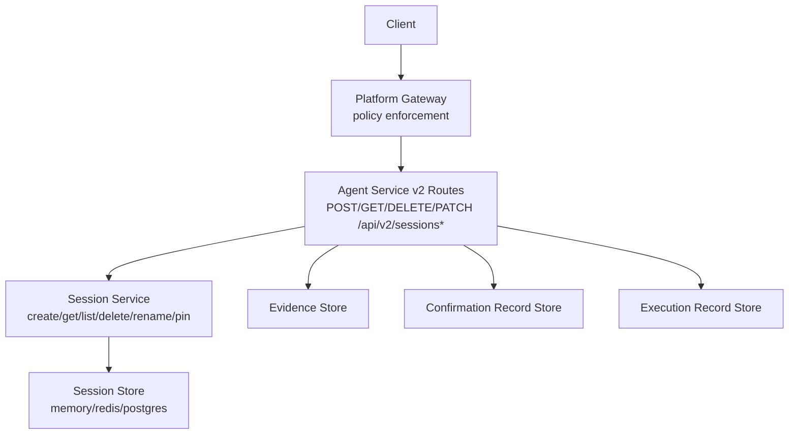
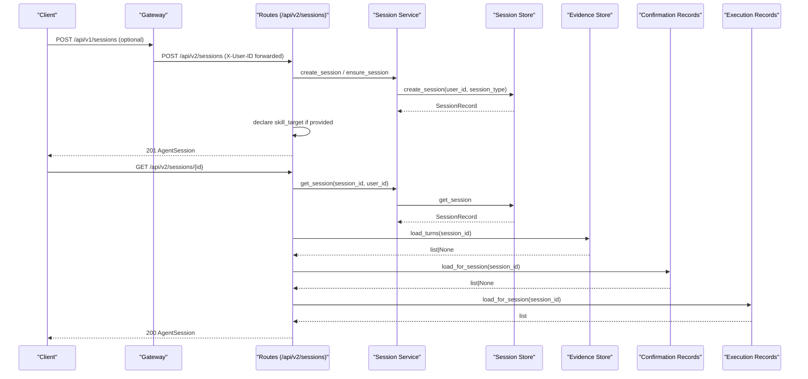
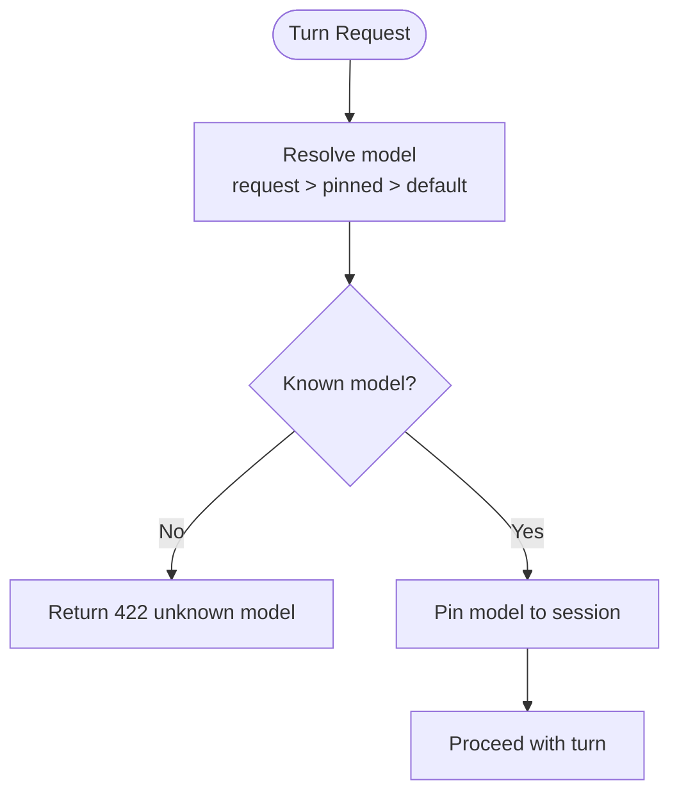
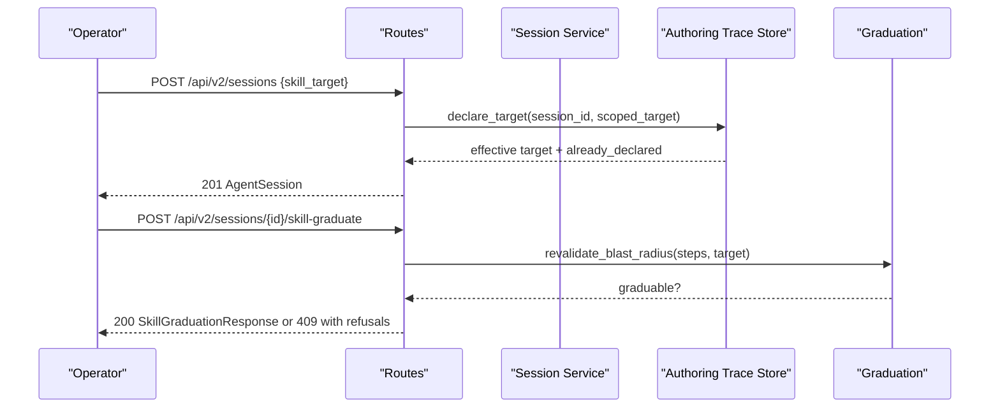
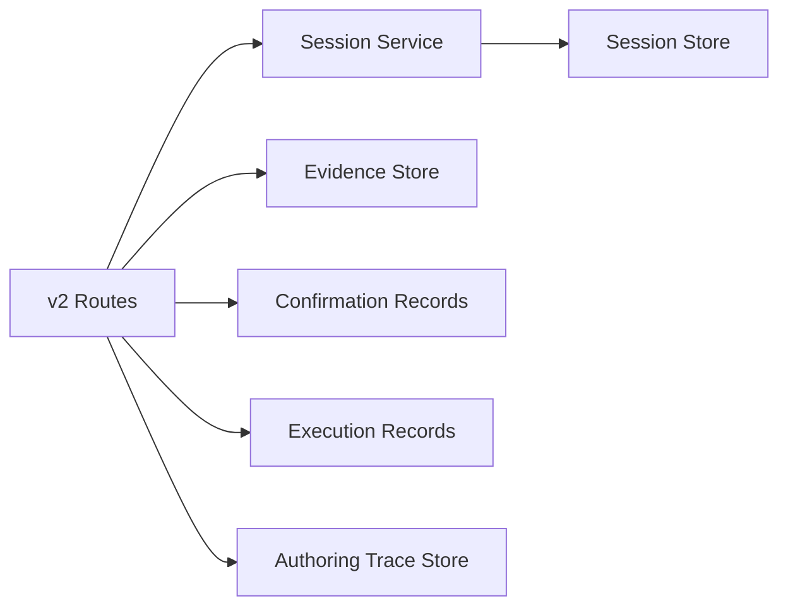

# Session Management

<cite>
**Referenced Files in This Document**
- [routes.py](file://products/agent-platform/src/agent_service/api/v2/routes.py)
- [v2.py](file://products/agent-platform/src/agent_service/schemas/v2.py)
- [session_service.py](file://products/agent-platform/src/agent_service/services/session_service.py)
- [session_store.py](file://products/agent-platform/src/agent_service/services/session_store.py)
- [sessions.py](file://products/platform-gateway/src/platform_gateway/api/routes/sessions.py)
</cite>

## Table of Contents
1. Introduction
2. Project Structure
3. Core Components
4. Architecture Overview
5. Detailed Component Analysis
6. Dependency Analysis
7. Performance Considerations
8. Troubleshooting Guide
9. Conclusion

## Introduction
This document provides detailed API documentation for session management endpoints in the Agent Platform’s v2 surface. It covers creating sessions with optional skill targets and model pinning, retrieving session details including evidence turns and confirmation cards, listing user sessions, deleting sessions, and renaming session titles. It also explains the session lifecycle, multi-tenant isolation via headers, develop-as-you-go scoping through skill targets, model pinning behavior, error handling, and example workflows such as incident anchoring, skill graduation, and evidence collection integration.

## Project Structure
The session management API is implemented in the agent-service v2 routes, which delegate to service functions that interact with pluggable session stores and auxiliary stores (evidence, confirmation records, execution records). The platform gateway exposes a v1 proxy that enforces policy before forwarding to the agent service.

**Diagram sources**
- [routes.py:790-980](file://products/agent-platform/src/agent_service/api/v2/routes.py#L790-L980)
- [session_service.py:52-265](file://products/agent-platform/src/agent_service/services/session_service.py#L52-L265)
- [session_store.py:46-120](file://products/agent-platform/src/agent_service/services/session_store.py#L46-L120)

**Section sources**
- [routes.py:790-980](file://products/agent-platform/src/agent_service/api/v2/routes.py#L790-L980)
- [sessions.py:137-169](file://products/platform-gateway/src/platform_gateway/api/routes/sessions.py#L137-L169)

## Core Components
- POST /api/v2/sessions: Create a new session; optionally declare a skill target at birth and set a named session id.
- GET /api/v2/sessions/{id}: Retrieve full session details, including transcript availability, pinned model, evidence turns, and durable confirmation cards.
- GET /api/v2/sessions: List the caller’s sessions, most-recently-active first, capped and optionally scoped by session_type.
- DELETE /api/v2/sessions/{id}: Delete a session and cascade cleanup of related state.
- PATCH /api/v2/sessions/{id}/title: Owner-only rename of the session title.

Key request/response schemas:
- AgentSessionCreateRequest: Optional body with session_id, skill_target, and session_type.
- AgentSession: Full session response including metadata, transcript, evidence_turns, confirmations, and model pin.
- SessionTitleUpdateRequest: Body for title rename with length constraints.

Multi-tenant isolation:
- Identity is conveyed via the X-User-ID header on all endpoints; foreign or unknown session ids are indistinguishable from missing ones (anti-enumeration posture).

Skill target scoping:
- A skill_target declared at session creation or mid-session scopes the web origin/path used during skill graduation corroboration. Query strings, fragments, and embedded credentials are stripped to a safe scope.

Model pinning:
- Each turn resolves a model using request > pinned > default order; the resolved model is pinned to the session for subsequent turns unless overridden.

**Section sources**
- [routes.py:790-980](file://products/agent-platform/src/agent_service/api/v2/routes.py#L790-L980)
- [v2.py:334-363](file://products/agent-platform/src/agent_service/schemas/v2.py#L334-L363)
- [v2.py:283-312](file://products/agent-platform/src/agent_service/schemas/v2.py#L283-L312)
- [v2.py:572-576](file://products/agent-platform/src/agent_service/schemas/v2.py#L572-L576)
- [routes.py:144-147](file://products/agent-platform/src/agent_service/api/v2/routes.py#L144-L147)
- [routes.py:160-199](file://products/agent-platform/src/agent_service/api/v2/routes.py#L160-L199)
- [routes.py:246-270](file://products/agent-platform/src/agent_service/api/v2/routes.py#L246-L270)

## Architecture Overview
The v2 routes implement the contract boundary and orchestrate cross-cutting concerns: identity extraction, parked-confirmation checks, model resolution, and enrichment of responses with evidence and confirmation data.

**Diagram sources**
- [routes.py:790-914](file://products/agent-platform/src/agent_service/api/v2/routes.py#L790-L914)
- [session_service.py:52-121](file://products/agent-platform/src/agent_service/services/session_service.py#L52-L121)
- [session_store.py:697-764](file://products/agent-platform/src/agent_service/services/session_store.py#L697-L764)

## Detailed Component Analysis

### POST /api/v2/sessions — Create Session
- Purpose: Open a new session; optionally declare a skill target at birth and/or supply a named session id.
- Request:
  - Header: X-User-ID required.
  - Body (optional): AgentSessionCreateRequest with fields session_id, skill_target, session_type.
- Behavior:
  - Validates and scopes skill_target if present; refuses non-http(s) origins.
  - Creates or reuses a named session idempotently for the owner.
  - Persists authoring-trace target when skill_target is supplied.
  - Returns AgentSession with minimal fields (id, user_id, created_at, status, session_type).
- Errors:
  - 401 if X-User-ID is missing.
  - 422 if skill_target cannot be normalized to an absolute http(s) URL.
  - 404 if attempting to reuse a named session owned by another user (indistinguishable from unknown).

Example scenarios:
- Incident anchoring: Create a named session tied to an incident triage flow; later drafts can reference the incident context.
- Develop-as-you-go: Provide skill_target at birth so the session’s captured steps are corroborated against a pre-declared web target.

**Section sources**
- [routes.py:790-855](file://products/agent-platform/src/agent_service/api/v2/routes.py#L790-L855)
- [routes.py:160-199](file://products/agent-platform/src/agent_service/api/v2/routes.py#L160-L199)
- [session_service.py:66-94](file://products/agent-platform/src/agent_service/services/session_service.py#L66-L94)
- [v2.py:334-363](file://products/agent-platform/src/agent_service/schemas/v2.py#L334-L363)

### GET /api/v2/sessions/{id} — Retrieve Session Details
- Purpose: Return full session details for the owner, including transcript availability, pinned model, evidence turns, and durable confirmation cards.
- Request:
  - Header: X-User-ID required.
- Response:
  - AgentSession with fields including session_id, user_id, created_at, status, session_type, title, last_active_at, pending_confirmation, transcript_available, transcript, evidence_turns, confirmations, model.
- Enrichment:
  - evidence_turns: Persisted tool-evidence groups grouped per assistant turn; None if store unreadable.
  - confirmations: Durable confirmation cards with optional executions attached; None if record store unreadable.
- Errors:
  - 404 for unknown or foreign session ids (anti-enumeration).

Example usage:
- Evidence collection integration: Inspect evidence_turns to render tool call/result frames and truncated markers in the UI.
- Confirmation card review: Render confirmations with their current status and any approved executions.

**Section sources**
- [routes.py:890-914](file://products/agent-platform/src/agent_service/api/v2/routes.py#L890-L914)
- [routes.py:733-787](file://products/agent-platform/src/agent_service/api/v2/routes.py#L733-L787)
- [v2.py:200-312](file://products/agent-platform/src/agent_service/schemas/v2.py#L200-L312)

### GET /api/v2/sessions — List User Sessions
- Purpose: List the caller’s sessions, most-recently-active first, capped.
- Request:
  - Header: X-User-ID required.
  - Query: session_type (optional) to filter by operation or development.
- Response:
  - AgentSessionList containing a list of AgentSessionSummary entries.
- Behavior:
  - Applies server-side filtering by session_type when provided; otherwise returns all sessions for the user.
  - Includes pending_confirmation flag derived from the confirmation registry.

**Section sources**
- [routes.py:858-887](file://products/agent-platform/src/agent_service/api/v2/routes.py#L858-L887)
- [session_service.py:141-161](file://products/agent-platform/src/agent_service/services/session_service.py#L141-L161)
- [v2.py:314-332](file://products/agent-platform/src/agent_service/schemas/v2.py#L314-L332)

### DELETE /api/v2/sessions/{id} — Session Cleanup
- Purpose: Delete a session and cascade cleanup of related state.
- Request:
  - Header: X-User-ID required.
- Behavior:
  - Checks for parked confirmations; rejects deletion while pending to avoid orphaning approvals.
  - Deletes session and cascades best-effort cleanup of agent state, evidence, confirmation records, execution records, and authoring traces.
- Errors:
  - 409 if session has a parked confirmation awaiting approval.
  - 404 if session not found or foreign (anti-enumeration).

**Section sources**
- [routes.py:917-945](file://products/agent-platform/src/agent_service/api/v2/routes.py#L917-L945)
- [session_service.py:203-265](file://products/agent-platform/src/agent_service/services/session_service.py#L203-L265)

### PATCH /api/v2/sessions/{id}/title — Rename Session Title
- Purpose: Owner-only rename of the session title.
- Request:
  - Header: X-User-ID required.
  - Body: SessionTitleUpdateRequest with title field (trimmed, 1–80 characters).
- Response:
  - AgentSession reflecting updated title and other metadata.
- Errors:
  - 400 if title is empty or exceeds length after trimming.
  - 404 for unknown or foreign session ids.

**Section sources**
- [routes.py:948-979](file://products/agent-platform/src/agent_service/api/v2/routes.py#L948-L979)
- [session_service.py:124-138](file://products/agent-platform/src/agent_service/services/session_service.py#L124-L138)
- [v2.py:572-576](file://products/agent-platform/src/agent_service/schemas/v2.py#L572-L576)

### Model Pinning Behavior
- Resolution order: request model > session-pinned model > deploy-time default.
- Unknown model ids fail closed with 422.
- Pinned model is persisted per session and overwritten by each successful turn resolution.

**Diagram sources**
- [routes.py:246-270](file://products/agent-platform/src/agent_service/api/v2/routes.py#L246-L270)
- [session_service.py:186-201](file://products/agent-platform/src/agent_service/services/session_service.py#L186-L201)

**Section sources**
- [routes.py:246-270](file://products/agent-platform/src/agent_service/api/v2/routes.py#L246-L270)
- [session_service.py:186-201](file://products/agent-platform/src/agent_service/services/session_service.py#L186-L201)

### Skill Target Scoping and Graduation Integration
- Declaring a skill_target at birth or mid-session scopes the web origin/path used during graduation corroboration.
- First declaration wins; re-declaring the same scope is a no-op; different values report already_declared without moving scope.
- Graduation validates blast radius and produces an executable-flow draft bound to the declared target.

**Diagram sources**
- [routes.py:1219-1294](file://products/agent-platform/src/agent_service/api/v2/routes.py#L1219-L1294)
- [routes.py:1297-1400](file://products/agent-platform/src/agent_service/api/v2/routes.py#L1297-L1400)

**Section sources**
- [routes.py:1219-1294](file://products/agent-platform/src/agent_service/api/v2/routes.py#L1219-L1294)
- [routes.py:1297-1400](file://products/agent-platform/src/agent_service/api/v2/routes.py#L1297-L1400)

### Multi-Tenant Isolation via Headers
- All endpoints require X-User-ID; missing header yields 401.
- Ownership checks ensure callers can only access their own sessions; foreign ids return 404 to prevent enumeration.

**Section sources**
- [routes.py:144-147](file://products/agent-platform/src/agent_service/api/v2/routes.py#L144-L147)
- [session_service.py:45-50](file://products/agent-platform/src/agent_service/services/session_service.py#L45-L50)

## Dependency Analysis
- Route layer depends on:
  - Session service for create/get/list/delete/rename/pin operations.
  - Evidence store for loading evidence turns.
  - Confirmation record store for loading durable cards.
  - Execution record store for attaching approved executions to cards.
  - Authoring trace store for skill-target declarations and graduation inputs.
- Session service depends on:
  - Session store backend (memory/redis/postgres) for persistence.
  - Auxiliary stores for cascading cleanup on delete.

**Diagram sources**
- [routes.py:790-980](file://products/agent-platform/src/agent_service/api/v2/routes.py#L790-L980)
- [session_service.py:52-265](file://products/agent-platform/src/agent_service/services/session_service.py#L52-L265)
- [session_store.py:46-120](file://products/agent-platform/src/agent_service/services/session_store.py#L46-L120)

**Section sources**
- [routes.py:790-980](file://products/agent-platform/src/agent_service/api/v2/routes.py#L790-L980)
- [session_service.py:52-265](file://products/agent-platform/src/agent_service/services/session_service.py#L52-L265)

## Performance Considerations
- Listing sessions is capped to a bounded number and sorted client-side for non-Postgres backends; Postgres applies server-side limit and ordering.
- Evidence and confirmation loads degrade gracefully when stores are unreadable, avoiding 500 errors.
- Model pinning and title updates are best-effort bookkeeping; failures do not block turns.

[No sources needed since this section provides general guidance]

## Troubleshooting Guide
Common errors and resolutions:
- Missing X-User-ID: Ensure the header is present; returns 401.
- Unknown session id: Returns 404; verify ownership and existence.
- Permission denial: Foreign session ids return 404 to avoid enumeration; confirm the session belongs to the caller.
- Storage failures: Evidence/confirmation reads degrade to null lists; session operations continue.
- Parked confirmation blocking deletion: Resolve or expire the parked confirmation before deleting; returns 409.
- Invalid skill target: Must be an absolute http(s) URL; returns 422 if unscorable.

**Section sources**
- [routes.py:144-147](file://products/agent-platform/src/agent_service/api/v2/routes.py#L144-L147)
- [routes.py:160-199](file://products/agent-platform/src/agent_service/api/v2/routes.py#L160-L199)
- [routes.py:917-945](file://products/agent-platform/src/agent_service/api/v2/routes.py#L917-L945)
- [routes.py:733-787](file://products/agent-platform/src/agent_service/api/v2/routes.py#L733-L787)

## Conclusion
The Agent Platform’s v2 session management API provides a robust, multi-tenant interface for creating, querying, listing, updating, and deleting sessions. It supports develop-as-you-go workflows through skill target scoping, ensures consistent model selection via pinning, and integrates evidence and confirmation data into session detail responses. Error handling follows anti-enumeration and fail-open principles where appropriate, ensuring resilience and security.

[No sources needed since this section summarizes without analyzing specific files]