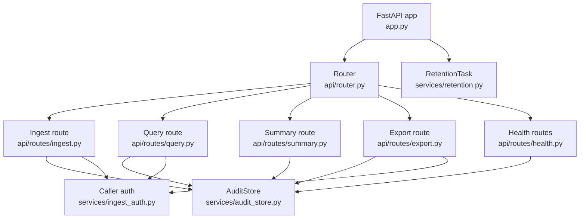
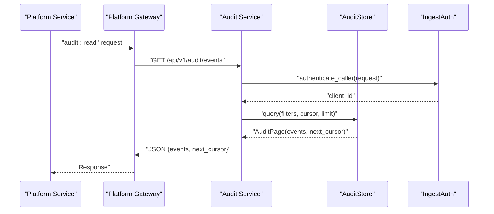
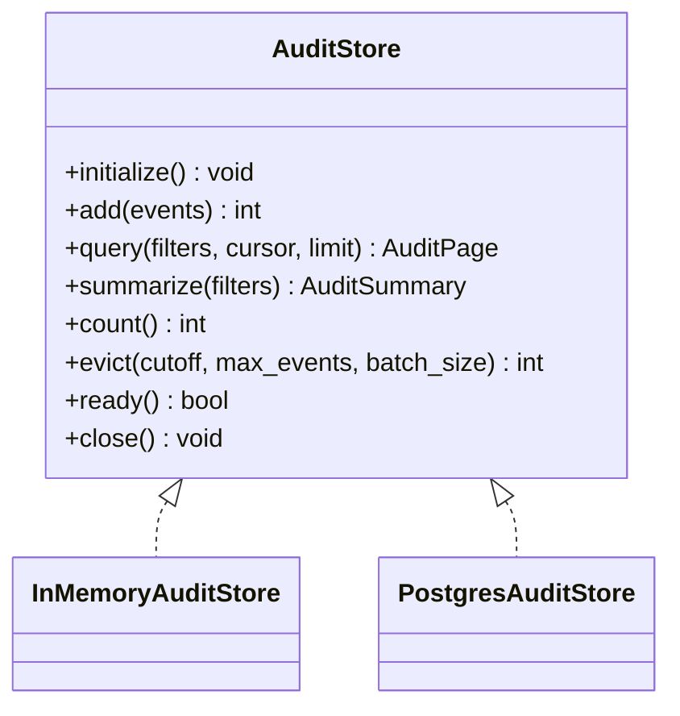
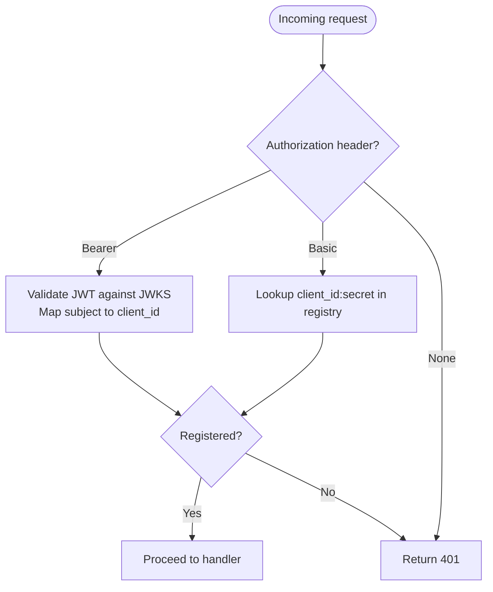
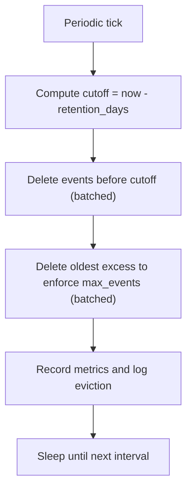
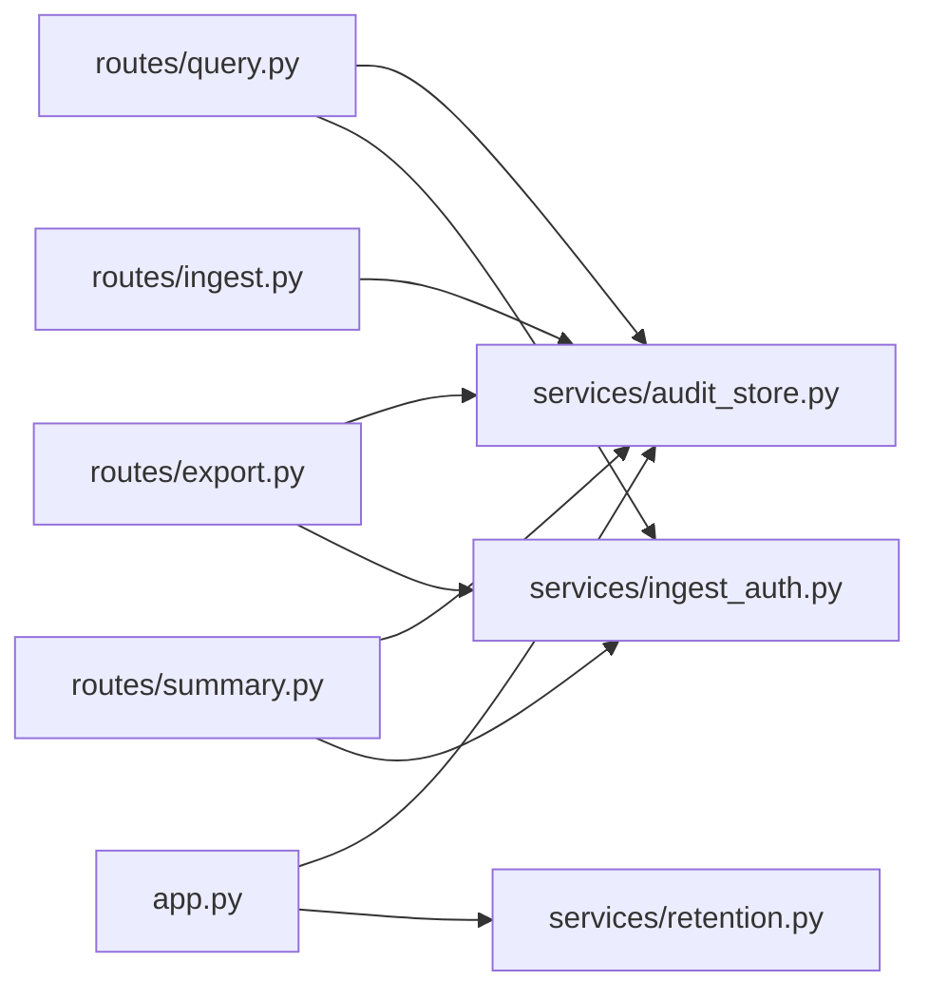

# Audit Service API

<cite>
**Referenced Files in This Document**
- [README.md](file://products/audit-service/README.md)
- [app.py](file://products/audit-service/src/audit_service/app.py)
- [main.py](file://products/audit-service/src/audit_service/main.py)
- [router.py](file://products/audit-service/src/audit_service/api/router.py)
- [ingest.py](file://products/audit-service/src/audit_service/api/routes/ingest.py)
- [query.py](file://products/audit-service/src/audit_service/api/routes/query.py)
- [export.py](file://products/audit-service/src/audit_service/api/routes/export.py)
- [summary.py](file://products/audit-service/src/audit_service/api/routes/summary.py)
- [health.py](file://products/audit-service/src/audit_service/api/routes/health.py)
- [audit_store.py](file://products/audit-service/src/audit_service/services/audit_store.py)
- [ingest_auth.py](file://products/audit-service/src/audit_service/services/ingest_auth.py)
- [retention.py](file://products/audit-service/src/audit_service/services/retention.py)
- [audit.py](file://products/audit-service/src/audit_service/schemas/audit.py)
</cite>

## Table of Contents
1. Introduction
2. Project Structure
3. Core Components
4. Architecture Overview
5. Detailed Component Analysis
6. Dependency Analysis
7. Performance Considerations
8. Troubleshooting Guide
9. Conclusion
10. Appendices

## Introduction
The Audit Service is the durable home for the platform audit trail. It ingests structured audit events from platform services, retains them within a retention-bounded store (in-memory for tests/dev, PostgreSQL for production), and exposes permission-scoped query and export APIs. User-level authorization for queries and exports is enforced by the platform gateway using the audit:read policy action; the service itself authenticates registered platform callers via a static client registry or workload identity tokens.

Key capabilities:
- Batch ingestion of audit events with strict validation and idempotency on event_id.
- Filtered, newest-first cursor-paginated querying of stored events.
- Summary aggregation over envelope columns (no payload excavation).
- Bounded CSV export with deterministic headers and truncation signaling.
- Background retention eviction based on time window and hard cap.

**Section sources**
- [README.md:1-31](file://products/audit-service/README.md#L1-L31)

## Project Structure
The service is organized into FastAPI routes under api/routes, core configuration and observability under core, data schemas under schemas, and storage/authentication/retention logic under services. The application lifecycle initializes the audit store and starts the retention task.

**Diagram sources**
- [app.py:20-70](file://products/audit-service/src/audit_service/app.py#L20-L70)
- [router.py:1-11](file://products/audit-service/src/audit_service/api/router.py#L1-L11)
- [ingest.py:30-83](file://products/audit-service/src/audit_service/api/routes/ingest.py#L30-L83)
- [query.py:29-95](file://products/audit-service/src/audit_service/api/routes/query.py#L29-L95)
- [summary.py:31-79](file://products/audit-service/src/audit_service/api/routes/summary.py#L31-L79)
- [export.py:35-164](file://products/audit-service/src/audit_service/api/routes/export.py#L35-L164)
- [health.py:7-36](file://products/audit-service/src/audit_service/api/routes/health.py#L7-L36)
- [audit_store.py:42-64](file://products/audit-service/src/audit_service/services/audit_store.py#L42-L64)
- [ingest_auth.py:105-118](file://products/audit-service/src/audit_service/services/ingest_auth.py#L105-L118)
- [retention.py:27-76](file://products/audit-service/src/audit_service/services/retention.py#L27-L76)

**Section sources**
- [app.py:20-70](file://products/audit-service/src/audit_service/app.py#L20-L70)
- [router.py:1-11](file://products/audit-service/src/audit_service/api/router.py#L1-L11)

## Core Components
- Ingestion endpoint: POST /api/v1/audit/events accepts a batch of validated audit events, enforces caller authentication, validates schema and batch size, persists via the store, and returns acceptance counts.
- Query endpoint: GET /api/v1/audit/events supports filtering by username, session_id, request_id, event_type, service, outcome, since/until, with keyset cursor pagination and newest-first ordering.
- Summary endpoint: GET /api/v1/audit/summary returns deterministic aggregates over envelope columns (totals, buckets by type/outcome/service, top actors, decision-chain projection).
- Export endpoint: GET /api/v1/audit/export streams RFC-4180 CSV with fixed columns, bounded row count, and truncation headers.
- Health endpoints: /health/live and /health/ready expose service status and store readiness/metrics.
- Retention background task: periodic eviction by retention window and hard cap without blocking ingest.

Authentication:
- Caller authentication uses either HTTP Basic against a static client registry or a Kubernetes projected workload token validated against the cluster OIDC issuer JWKS. Both paths map to a registered client_id.

Data model:
- AuditEvent envelope fields include identifiers, timestamps, typed metadata, and details. Envelope-only filters are applied; payload details are never excavated for queries or summaries.

**Section sources**
- [ingest.py:33-83](file://products/audit-service/src/audit_service/api/routes/ingest.py#L33-L83)
- [query.py:35-95](file://products/audit-service/src/audit_service/api/routes/query.py#L35-L95)
- [summary.py:34-79](file://products/audit-service/src/audit_service/api/routes/summary.py#L34-L79)
- [export.py:87-164](file://products/audit-service/src/audit_service/api/routes/export.py#L87-L164)
- [health.py:14-36](file://products/audit-service/src/audit_service/api/routes/health.py#L14-L36)
- [ingest_auth.py:34-118](file://products/audit-service/src/audit_service/services/ingest_auth.py#L34-L118)
- [audit.py:44-83](file://products/audit-service/src/audit_service/schemas/audit.py#L44-L83)

## Architecture Overview
The service exposes a small set of REST endpoints backed by an abstract store that can be implemented in memory or PostgreSQL. Authentication is performed per request for ingest/query/export. A background retention task runs independently to enforce retention policies.

**Diagram sources**
- [query.py:35-95](file://products/audit-service/src/audit_service/api/routes/query.py#L35-L95)
- [ingest_auth.py:105-118](file://products/audit-service/src/audit_service/services/ingest_auth.py#L105-L118)
- [audit_store.py:42-64](file://products/audit-service/src/audit_service/services/audit_store.py#L42-L64)

## Detailed Component Analysis

### Ingestion Endpoint
- Path: POST /api/v1/audit/events
- Authentication: Required (Basic or Bearer workload token).
- Request body: Batch of AuditEvent objects.
- Validation: JSON parse, schema validation, max batch size check.
- Behavior: Idempotent insert by event_id; returns accepted and inserted counts.
- Metrics and logs: Records rejected reasons, ingested counts, and store growth.

Request schema:
- Body: object with field events (array of AuditEvent, min length 1).

Response schema:
- 202 Accepted: { "accepted": number, "inserted": number }
- 400 Bad Request: { "detail": string } for malformed or oversized batches
- 401 Unauthorized: { "detail": string } for invalid credentials

Example usage:
- Ingest tool execution events: send a batch containing one or more events with event_type "tool_invoked", appropriate service, request_id, outcome, and details describing the tool invocation.

**Section sources**
- [ingest.py:33-83](file://products/audit-service/src/audit_service/api/routes/ingest.py#L33-L83)
- [audit.py:44-65](file://products/audit-service/src/audit_service/schemas/audit.py#L44-L65)

### Query Endpoint
- Path: GET /api/v1/audit/events
- Authentication: Required (same as ingest).
- Query parameters:
  - username: string | null
  - session_id: string | null
  - request_id: string | null
  - event_type: string | null
  - service: string | null
  - outcome: "allow" | "deny" | "success" | "error" | null
  - since: datetime | null
  - until: datetime | null
  - cursor: string | null (keyset cursor)
  - limit: integer [1..200], default 50
- Behavior: Newest-first ordering, keyset cursor pagination, envelope-only filters.

Response schema:
- 200 OK: { "events": [AuditEvent...], "next_cursor": string | null }
- 400 Bad Request: { "detail": string } for invalid cursor
- 401 Unauthorized: { "detail": string }

Example usage:
- Query session activities: filter by session_id and a time range (since/until), paginate using next_cursor to retrieve all matching events.

**Section sources**
- [query.py:35-95](file://products/audit-service/src/audit_service/api/routes/query.py#L35-L95)
- [audit.py:67-83](file://products/audit-service/src/audit_service/schemas/audit.py#L67-L83)

### Summary Endpoint
- Path: GET /api/v1/audit/summary
- Authentication: Required.
- Query parameters: same as query endpoint.
- Behavior: Deterministic envelope-column aggregates; no payload excavation.

Response schema:
- 200 OK: Audit summary object including total_events, window echo, buckets by event_type/outcome/service, top_actors, and decision_chain projection.

Example usage:
- Generate compliance overview: apply filters for a time window and event types to obtain totals and breakdowns.

**Section sources**
- [summary.py:34-79](file://products/audit-service/src/audit_service/api/routes/summary.py#L34-L79)
- [audit_store.py:188-219](file://products/audit-service/src/audit_service/services/audit_store.py#L188-L219)

### Export Endpoint
- Path: GET /api/v1/audit/export
- Authentication: Required.
- Query parameters: same as query endpoint.
- Behavior: Streams RFC-4180 CSV with fixed column order; bounded by AUDIT_EXPORT_MAX_ROWS; sets truncation and row-count headers before streaming.

CSV columns (fixed order):
- occurred_at, event_type, service, outcome, username, actor, subject, session_id, request_id, details

Headers:
- Content-Disposition: attachment; filename="audit-export-YYYYMMDDTHHMMSSZ.csv"
- X-Audit-Export-Truncated: "true" | "false"
- X-Audit-Export-Rows: number

Response:
- Streaming CSV with media_type text/csv.

Example usage:
- Export compliance report: filter by event_type and time range; consume stream and inspect X-Audit-Export-Truncated to determine completeness.

**Section sources**
- [export.py:87-164](file://products/audit-service/src/audit_service/api/routes/export.py#L87-L164)

### Health Endpoints
- GET /health/live: Returns service name and version with status ok.
- GET /health/ready: Returns store backend readiness, retention settings, max events, and current event count when ready.

**Section sources**
- [health.py:14-36](file://products/audit-service/src/audit_service/api/routes/health.py#L14-L36)

### Data Model and Schemas
- AuditEvent: envelope with identifiers, timestamps, typed metadata, and details. Extra fields are forbidden.
- IngestRequest: contains a non-empty list of AuditEvent.
- AuditQuery: filter set used by query, summary, and export endpoints.

Event types and outcomes are constrained to defined literals.

**Section sources**
- [audit.py:14-83](file://products/audit-service/src/audit_service/schemas/audit.py#L14-L83)

### Storage Backends and Partitioning
- In-memory store: suitable for tests/dev; bounded list with deduplication by event_id.
- PostgreSQL store: WAL-durable table with indexes for efficient filtering and pagination.
- Cursor-based pagination: keyset encoded from occurred_at and event_id to ensure stable ordering and efficient paging.
- No explicit partitioning strategy is implemented at the service level; retention evicts old rows and enforces a hard cap.

**Diagram sources**
- [audit_store.py:42-64](file://products/audit-service/src/audit_service/services/audit_store.py#L42-L64)
- [audit_store.py:93-157](file://products/audit-service/src/audit_service/services/audit_store.py#L93-L157)
- [audit_store.py:324-547](file://products/audit-service/src/audit_service/services/audit_store.py#L324-L547)

**Section sources**
- [audit_store.py:93-157](file://products/audit-service/src/audit_service/services/audit_store.py#L93-L157)
- [audit_store.py:224-249](file://products/audit-service/src/audit_service/services/audit_store.py#L224-L249)
- [audit_store.py:386-415](file://products/audit-service/src/audit_service/services/audit_store.py#L386-L415)

### Authentication and Authorization
- Caller authentication supports:
  - Static Basic credentials against a configured registry.
  - Workload identity via Kubernetes projected service-account tokens validated against the cluster OIDC issuer JWKS.
- User-level authorization for query/export is enforced by the platform gateway using the audit:read policy action before proxying to the service.

**Diagram sources**
- [ingest_auth.py:34-118](file://products/audit-service/src/audit_service/services/ingest_auth.py#L34-L118)

**Section sources**
- [ingest_auth.py:34-118](file://products/audit-service/src/audit_service/services/ingest_auth.py#L34-L118)
- [README.md:12-20](file://products/audit-service/README.md#L12-L20)

### Retention Policies
- Time-window eviction: removes events older than AUDIT_RETENTION_DAYS.
- Hard cap enforcement: ensures total events do not exceed AUDIT_MAX_EVENTS.
- Eviction runs periodically in the background and does not block ingest.
- Metrics and logs record evicted counts and store size reconciliation.

**Diagram sources**
- [retention.py:27-76](file://products/audit-service/src/audit_service/services/retention.py#L27-L76)
- [audit_store.py:498-533](file://products/audit-service/src/audit_service/services/audit_store.py#L498-L533)

**Section sources**
- [retention.py:27-76](file://products/audit-service/src/audit_service/services/retention.py#L27-L76)
- [audit_store.py:498-533](file://products/audit-service/src/audit_service/services/audit_store.py#L498-L533)

## Dependency Analysis
- Routes depend on:
  - Configuration and metrics via core modules.
  - Authentication via ingest_auth.
  - Storage via audit_store.
- Store backends implement the same protocol, enabling testable swaps between in-memory and PostgreSQL.
- Lifecycle wiring in app.py initializes the store and starts the retention task.

**Diagram sources**
- [router.py:1-11](file://products/audit-service/src/audit_service/api/router.py#L1-L11)
- [app.py:20-70](file://products/audit-service/src/audit_service/app.py#L20-L70)
- [ingest.py:33-83](file://products/audit-service/src/audit_service/api/routes/ingest.py#L33-L83)
- [query.py:35-95](file://products/audit-service/src/audit_service/api/routes/query.py#L35-L95)
- [summary.py:34-79](file://products/audit-service/src/audit_service/api/routes/summary.py#L34-L79)
- [export.py:87-164](file://products/audit-service/src/audit_service/api/routes/export.py#L87-L164)
- [audit_store.py:42-64](file://products/audit-service/src/audit_service/services/audit_store.py#L42-L64)
- [ingest_auth.py:105-118](file://products/audit-service/src/audit_service/services/ingest_auth.py#L105-L118)
- [retention.py:27-76](file://products/audit-service/src/audit_service/services/retention.py#L27-L76)

**Section sources**
- [app.py:20-70](file://products/audit-service/src/audit_service/app.py#L20-L70)
- [router.py:1-11](file://products/audit-service/src/audit_service/api/router.py#L1-L11)

## Performance Considerations
- Pagination: Keyset cursor avoids offset scans and ensures stable ordering by (occurred_at, event_id).
- Filtering: Envelope-only filters leverage database indexes where available; details payloads are never scanned.
- Export bounds: Fixed page size and row cap prevent unbounded memory use during streaming.
- Retention: Batched deletions avoid long-running transactions and keep ingest responsive.
- Store selection: Use PostgreSQL for durability and scale; in-memory only for tests/dev.

[No sources needed since this section provides general guidance]

## Troubleshooting Guide
Common issues and diagnostics:
- 401 Unauthorized: Invalid or missing service credentials; verify Basic or Bearer token configuration and mappings.
- 400 Bad Request: Malformed JSON, invalid schema, oversized batch, or invalid cursor; inspect error detail.
- Degraded readiness: Store backend unavailable; check health/ready and underlying connectivity.
- Missing events: Ensure event_id uniqueness; duplicates are ignored on insert.
- Large exports: Confirm X-Audit-Export-Truncated and X-Audit-Export-Rows to validate completeness.

Operational checks:
- Use /health/live and /health/ready to verify service and store state.
- Monitor metrics for ingested, rejected, queried, exported, and evicted counts.

**Section sources**
- [ingest.py:37-65](file://products/audit-service/src/audit_service/api/routes/ingest.py#L37-L65)
- [query.py:51-63](file://products/audit-service/src/audit_service/api/routes/query.py#L51-L63)
- [health.py:19-36](file://products/audit-service/src/audit_service/api/routes/health.py#L19-L36)
- [audit_store.py:103-111](file://products/audit-service/src/audit_service/services/audit_store.py#L103-L111)
- [export.py:117-163](file://products/audit-service/src/audit_service/api/routes/export.py#L117-L163)

## Conclusion
The Audit Service provides a robust, secure, and scalable foundation for audit trail storage and retrieval. Its clear separation of concerns—authentication, routing, storage abstraction, and retention—supports both development agility and production reliability. Consumers should rely on the platform gateway for user-level authorization and use the provided query, summary, and export endpoints to build dashboards, investigations, and compliance reports.

[No sources needed since this section summarizes without analyzing specific files]

## Appendices

### API Reference Summary

- Ingest
  - POST /api/v1/audit/events
  - Request: { "events": [AuditEvent...] }
  - Responses: 202 { "accepted": number, "inserted": number }, 400, 401

- Query
  - GET /api/v1/audit/events?username=&session_id=&request_id=&event_type=&service=&outcome=&since=&until=&cursor=&limit=
  - Response: 200 { "events": [AuditEvent...], "next_cursor": string|null }

- Summary
  - GET /api/v1/audit/summary?username=&session_id=&request_id=&event_type=&service=&outcome=&since=&until=
  - Response: 200 Audit summary object

- Export
  - GET /api/v1/audit/export?username=&session_id=&request_id=&event_type=&service=&outcome=&since=&until=
  - Response: Streaming CSV with headers X-Audit-Export-Truncated and X-Audit-Export-Rows

- Health
  - GET /health/live
  - GET /health/ready

**Section sources**
- [ingest.py:33-83](file://products/audit-service/src/audit_service/api/routes/ingest.py#L33-L83)
- [query.py:35-95](file://products/audit-service/src/audit_service/api/routes/query.py#L35-L95)
- [summary.py:34-79](file://products/audit-service/src/audit_service/api/routes/summary.py#L34-L79)
- [export.py:87-164](file://products/audit-service/src/audit_service/api/routes/export.py#L87-L164)
- [health.py:14-36](file://products/audit-service/src/audit_service/api/routes/health.py#L14-L36)