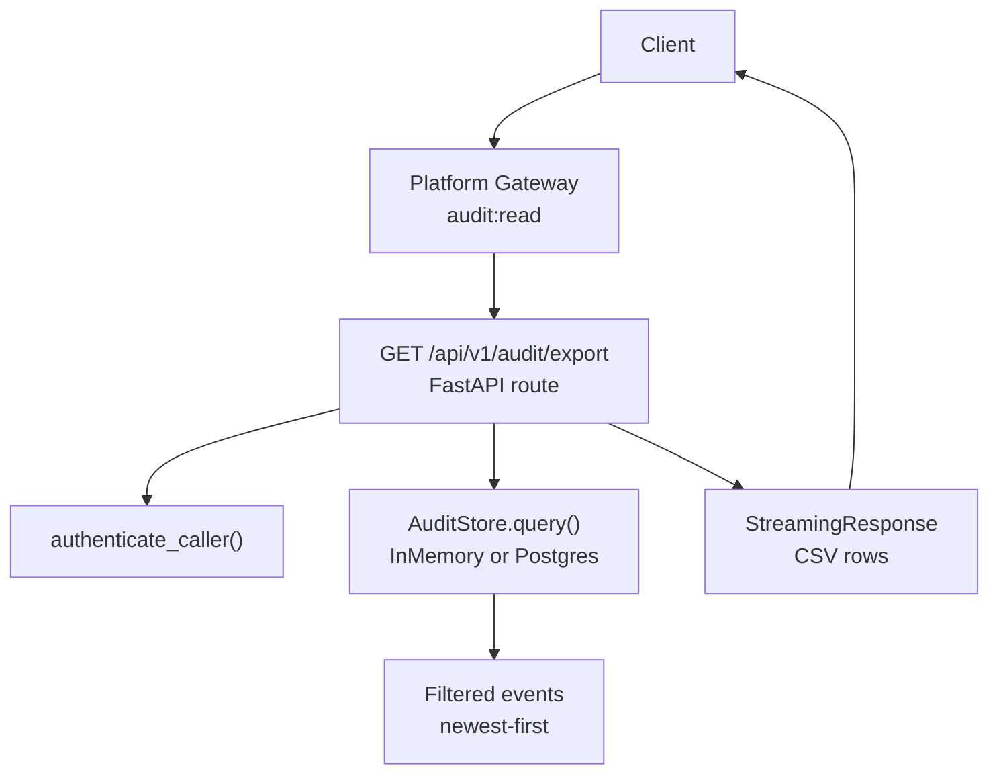
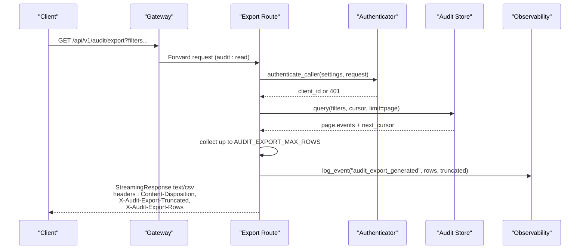
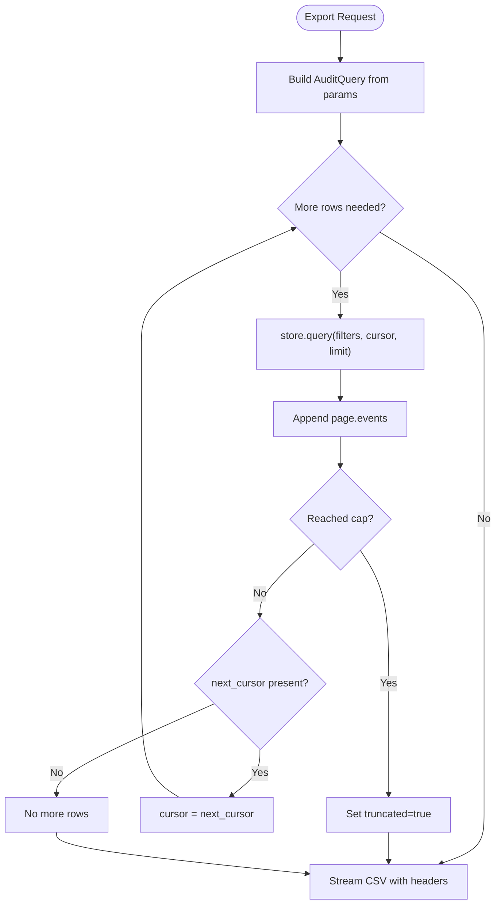
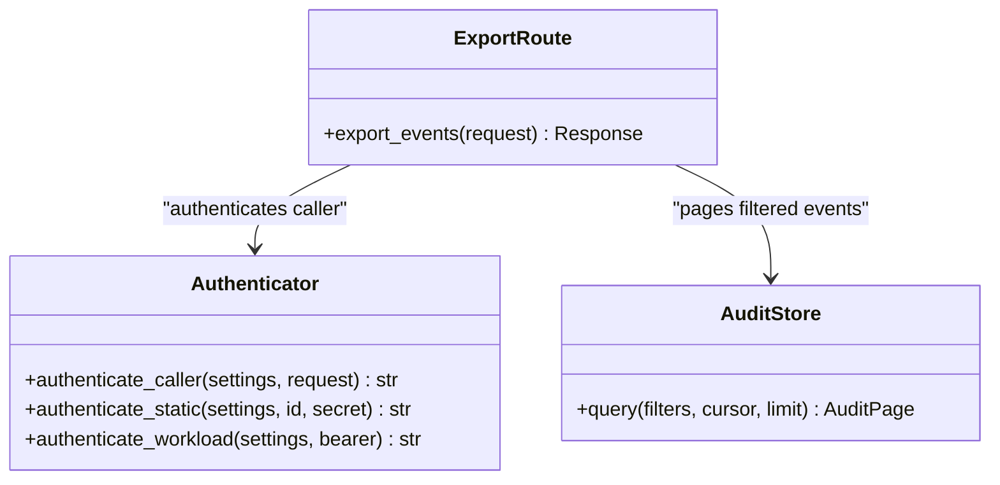
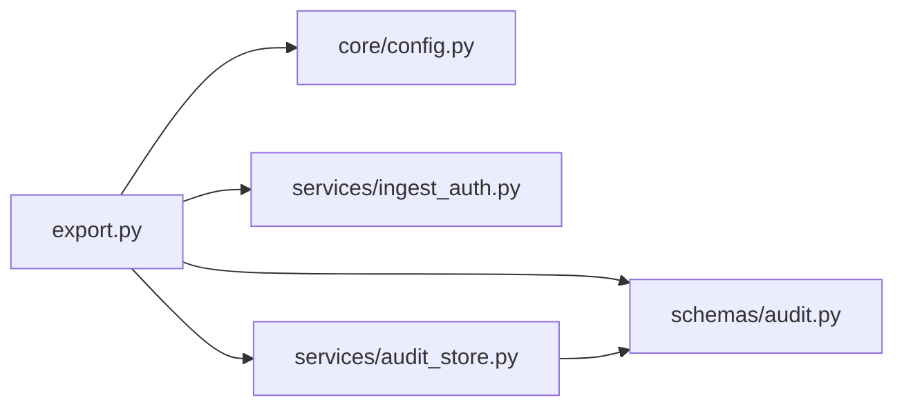

# Data Export API

<cite>
**Referenced Files in This Document**
- [export.py](file://products/audit-service/src/audit_service/api/routes/export.py)
- [audit_store.py](file://products/audit-service/src/audit_service/services/audit_store.py)
- [audit.py](file://products/audit-service/src/audit_service/schemas/audit.py)
- [config.py](file://products/audit-service/src/audit_service/core/config.py)
- [ingest_auth.py](file://products/audit-service/src/audit_service/services/ingest_auth.py)
- [test_reporting.py](file://products/audit-service/tests/test_reporting.py)
- [SPEC-046-audit-reporting-and-export/spec.md](file://docs/specs/SPEC-046-audit-reporting-and-export/spec.md)
</cite>

## Table of Contents
1. [Introduction](#introduction)
2. [Project Structure](#project-structure)
3. [Core Components](#core-components)
4. [Architecture Overview](#architecture-overview)
5. [Detailed Component Analysis](#detailed-component-analysis)
6. [Dependency Analysis](#dependency-analysis)
7. [Performance Considerations](#performance-considerations)
8. [Troubleshooting Guide](#troubleshooting-guide)
9. [Conclusion](#conclusion)
10. [Appendices](#appendices)

## Introduction
This document specifies the Audit Service data export endpoint for generating audit data exports used in compliance reporting. It focuses on the GET /api/v1/audit/export endpoint, which streams a bounded CSV export of audit events filtered by date ranges, event types, services, outcomes, and other envelope fields. The endpoint is designed for secure, authenticated access with deterministic output, truncation signaling, and structured logging of export activity.

Note: Only CSV export is implemented in this slice. JSON and PDF exports are not available; they are explicitly parked for future promotion.

## Project Structure
The export functionality lives under the audit-service product and is composed of:
- Route handler that authenticates callers, builds filters, pages the store, and streams CSV
- Store abstraction and backends (in-memory and PostgreSQL) that implement filtering, pagination, and cursor handling
- Schemas defining the audit event envelope and query filters
- Configuration for export limits and retention
- Authentication service for static credentials and workload tokens
- Tests validating behavior, headers, column order, quoting, filtering, and truncation

**Diagram sources**
- [export.py:87-163](file://products/audit-service/src/audit_service/api/routes/export.py#L87-L163)
- [ingest_auth.py:105-117](file://products/audit-service/src/audit_service/services/ingest_auth.py#L105-L117)
- [audit_store.py:113-131](file://products/audit-service/src/audit_service/services/audit_store.py#L113-L131)
- [audit_store.py:386-415](file://products/audit-service/src/audit_service/services/audit_store.py#L386-L415)

**Section sources**
- [export.py:1-164](file://products/audit-service/src/audit_service/api/routes/export.py#L1-L164)
- [audit_store.py:1-565](file://products/audit-service/src/audit_service/services/audit_store.py#L1-L565)
- [audit.py:1-83](file://products/audit-service/src/audit_service/schemas/audit.py#L1-L83)
- [config.py:60-111](file://products/audit-service/src/audit_service/core/config.py#L60-L111)
- [ingest_auth.py:1-118](file://products/audit-service/src/audit_service/services/ingest_auth.py#L1-L118)
- [test_reporting.py:181-298](file://products/audit-service/tests/test_reporting.py#L181-L298)
- [SPEC-046-audit-reporting-and-export/spec.md:88-137](file://docs/specs/SPEC-046-audit-reporting-and-export/spec.md#L88-L137)

## Core Components
- Export route: Authenticates caller, constructs an AuditQuery from request parameters, pages the store with a hard row cap, and streams RFC-4180 CSV with fixed columns and deterministic details encoding.
- Audit store: Provides filtering over envelope fields and cursor-based pagination. Both in-memory and PostgreSQL backends implement the same filter semantics and return newest-first ordering.
- Schemas: Define the AuditEvent envelope and the set of allowed event_type and outcome values used for validation and filtering.
- Configuration: Controls export_max_rows and retention-related settings.
- Authentication: Supports static Basic credentials and workload Bearer tokens via OIDC/JWKS.

Key behaviors validated by tests:
- Fixed header row and column order
- Newest-first ordering
- RFC-3339 UTC timestamps with Z suffix
- Deterministic JSON details with sorted keys
- Quoting of commas, quotes, and newlines
- Filtering by username, event_type, service, outcome, and date range
- Truncation headers when exceeding AUDIT_EXPORT_MAX_ROWS
- Authentication requirement and error responses

**Section sources**
- [export.py:41-84](file://products/audit-service/src/audit_service/api/routes/export.py#L41-L84)
- [export.py:87-163](file://products/audit-service/src/audit_service/api/routes/export.py#L87-L163)
- [audit_store.py:159-176](file://products/audit-service/src/audit_service/services/audit_store.py#L159-L176)
- [audit_store.py:386-415](file://products/audit-service/src/audit_service/services/audit_store.py#L386-L415)
- [audit.py:14-41](file://products/audit-service/src/audit_service/schemas/audit.py#L14-L41)
- [audit.py:67-83](file://products/audit-service/src/audit_service/schemas/audit.py#L67-L83)
- [config.py:70-76](file://products/audit-service/src/audit_service/core/config.py#L70-L76)
- [config.py:101-104](file://products/audit-service/src/audit_service/core/config.py#L101-L104)
- [ingest_auth.py:105-117](file://products/audit-service/src/audit_service/services/ingest_auth.py#L105-L117)
- [test_reporting.py:183-298](file://products/audit-service/tests/test_reporting.py#L183-L298)

## Architecture Overview
The export flow enforces authentication, applies filters, paginates results, and streams CSV with explicit truncation signals.

**Diagram sources**
- [export.py:87-163](file://products/audit-service/src/audit_service/api/routes/export.py#L87-L163)
- [ingest_auth.py:105-117](file://products/audit-service/src/audit_service/services/ingest_auth.py#L105-L117)
- [audit_store.py:113-131](file://products/audit-service/src/audit_service/services/audit_store.py#L113-L131)
- [audit_store.py:386-415](file://products/audit-service/src/audit_service/services/audit_store.py#L386-L415)

## Detailed Component Analysis

### GET /api/v1/audit/export Endpoint
- Purpose: Generate a bounded CSV export of audit events matching provided filters.
- Authentication: Required via registered service credentials (Basic) or workload token (Bearer).
- Filters:
  - username
  - session_id
  - request_id
  - event_type
  - service
  - outcome
  - since (datetime)
  - until (datetime)
- Output format: CSV only (RFC-4180), streaming, newest-first.
- Headers:
  - Content-Type: text/csv
  - Content-Disposition: attachment; filename="audit-export-YYYYMMDDTHHMMSSZ.csv"
  - X-Audit-Export-Truncated: true|false
  - X-Audit-Export-Rows: <count>
- Row cap: Enforced by AUDIT_EXPORT_MAX_ROWS; paging uses 200-row pages.
- Logging: Structured stdout log line records client, rows, and truncated flag.

Example usage patterns
- Monthly compliance report: Filter by since/until covering the month, optionally by service or outcome, then download CSV.
- Security audit trail: Filter by event_type such as policy_decision or execution_requested/completed/rejected, optionally by outcome deny/error.
- Operational activity logs: Filter by service or event_type like tool_invoked or skill_searched, with optional username or session_id.

Format specification
- Columns (fixed order): occurred_at, event_type, service, outcome, username, actor, subject, session_id, request_id, details
- Timestamps: RFC-3339 UTC with Z suffix
- Details: JSON-encoded object with deterministic key order
- Quoting: RFC-4180 compliant

Download mechanism
- Streaming response with server-side pagination ensures bounded memory usage.
- Consumers rely on truncation headers to detect incomplete exports.

Retention policies
- The underlying store is retention-bounded by AUDIT_RETENTION_DAYS and AUDIT_MAX_EVENTS.
- Eviction runs periodically to enforce cutoff and hard cap.

Security considerations
- Access control: Requires valid credentials; unauthorized requests receive 401.
- Data sensitivity: Export includes envelope fields and verbatim details; ensure downstream handling complies with data protection policies.
- Audit logging: Export generation is logged with caller identity and result metadata.

Access controls
- Existing audit:read action governs access through the platform gateway.
- No new policy actions are introduced by this endpoint.

Error handling
- 401: Missing or invalid credentials
- 422: Invalid parameter values (e.g., unknown outcome)
- 5xx: Upstream transport errors or store failures (mapped by gateway)

**Section sources**
- [export.py:41-84](file://products/audit-service/src/audit_service/api/routes/export.py#L41-L84)
- [export.py:87-163](file://products/audit-service/src/audit_service/api/routes/export.py#L87-L163)
- [audit_store.py:159-176](file://products/audit-service/src/audit_service/services/audit_store.py#L159-L176)
- [audit_store.py:386-415](file://products/audit-service/src/audit_service/services/audit_store.py#L386-L415)
- [audit.py:14-41](file://products/audit-service/src/audit_service/schemas/audit.py#L14-L41)
- [audit.py:67-83](file://products/audit-service/src/audit_service/schemas/audit.py#L67-L83)
- [config.py:70-76](file://products/audit-service/src/audit_service/core/config.py#L70-L76)
- [config.py:92-104](file://products/audit-service/src/audit_service/core/config.py#L92-L104)
- [ingest_auth.py:105-117](file://products/audit-service/src/audit_service/services/ingest_auth.py#L105-L117)
- [test_reporting.py:183-298](file://products/audit-service/tests/test_reporting.py#L183-L298)
- [SPEC-046-audit-reporting-and-export/spec.md:88-137](file://docs/specs/SPEC-046-audit-reporting-and-export/spec.md#L88-L137)

### Store Backends and Filtering
- In-memory store: Suitable for tests/dev; supports filtering, sorting, and cursor pagination.
- PostgreSQL store: Durable backend with indexes on key envelope fields; grouped queries for summaries and ordered retrieval for exports.
- Shared filter logic: Envelope-only filters applied consistently across backends.

**Diagram sources**
- [export.py:120-163](file://products/audit-service/src/audit_service/api/routes/export.py#L120-L163)
- [audit_store.py:113-131](file://products/audit-service/src/audit_service/services/audit_store.py#L113-L131)
- [audit_store.py:386-415](file://products/audit-service/src/audit_service/services/audit_store.py#L386-L415)

**Section sources**
- [audit_store.py:93-156](file://products/audit-service/src/audit_service/services/audit_store.py#L93-L156)
- [audit_store.py:224-249](file://products/audit-service/src/audit_service/services/audit_store.py#L224-L249)
- [audit_store.py:324-415](file://products/audit-service/src/audit_service/services/audit_store.py#L324-L415)
- [audit_store.py:498-533](file://products/audit-service/src/audit_service/services/audit_store.py#L498-L533)

### Authentication and Authorization
- Static credentials: HTTP Basic against configured registry.
- Workload credentials: Bearer token validated via OIDC issuer JWKS with audience and subject mapping.
- Authorization: Governed by existing audit:read action via platform gateway.

**Diagram sources**
- [export.py:87-117](file://products/audit-service/src/audit_service/api/routes/export.py#L87-L117)
- [ingest_auth.py:34-43](file://products/audit-service/src/audit_service/services/ingest_auth.py#L34-L43)
- [ingest_auth.py:69-93](file://products/audit-service/src/audit_service/services/ingest_auth.py#L69-L93)
- [ingest_auth.py:105-117](file://products/audit-service/src/audit_service/services/ingest_auth.py#L105-L117)
- [audit_store.py:42-63](file://products/audit-service/src/audit_service/services/audit_store.py#L42-L63)

**Section sources**
- [ingest_auth.py:1-118](file://products/audit-service/src/audit_service/services/ingest_auth.py#L1-118)
- [SPEC-046-audit-reporting-and-export/spec.md:115-137](file://docs/specs/SPEC-046-audit-reporting-and-export/spec.md#L115-L137)

### Configuration and Retention
- AUDIT_EXPORT_MAX_ROWS: Hard row cap for exports (default 10,000).
- AUDIT_RETENTION_DAYS and AUDIT_MAX_EVENTS: Control store retention and eviction.
- Eviction: Periodic batched deletion based on cutoff and max events.

**Section sources**
- [config.py:70-76](file://products/audit-service/src/audit_service/core/config.py#L70-L76)
- [config.py:92-104](file://products/audit-service/src/audit_service/core/config.py#L92-L104)
- [audit_store.py:498-533](file://products/audit-service/src/audit_service/services/audit_store.py#L498-L533)

## Dependency Analysis
The export endpoint depends on:
- FastAPI router and streaming response utilities
- Audit store protocol and implementations
- Audit schemas for validation and filtering
- Configuration loader for runtime knobs
- Authentication service for caller identity

**Diagram sources**
- [export.py:14-31](file://products/audit-service/src/audit_service/api/routes/export.py#L14-L31)
- [audit_store.py:18-27](file://products/audit-service/src/audit_service/services/audit_store.py#L18-L27)
- [config.py:60-111](file://products/audit-service/src/audit_service/core/config.py#L60-L111)
- [ingest_auth.py:1-26](file://products/audit-service/src/audit_service/services/ingest_auth.py#L1-L26)

**Section sources**
- [export.py:14-31](file://products/audit-service/src/audit_service/api/routes/export.py#L14-L31)
- [audit_store.py:18-27](file://products/audit-service/src/audit_service/services/audit_store.py#L18-L27)
- [config.py:60-111](file://products/audit-service/src/audit_service/core/config.py#L60-L111)
- [ingest_auth.py:1-26](file://products/audit-service/src/audit_service/services/ingest_auth.py#L1-L26)

## Performance Considerations
- Streaming CSV: Memory stays bounded to one page at a time.
- Page size: 200 rows per store page; total materialized rows capped by AUDIT_EXPORT_MAX_ROWS.
- Ordering: Newest-first using timestamp and event_id for determinism.
- Database indexes: Optimized for common filter fields and ordering.
- Eviction: Batched deletions prevent large single operations.

[No sources needed since this section provides general guidance]

## Troubleshooting Guide
Common issues and resolutions:
- 401 Unauthorized: Ensure correct Basic or Bearer credentials are provided.
- 422 Validation error: Verify outcome and other enum values match allowed sets.
- Unexpected truncation: Check AUDIT_EXPORT_MAX_ROWS and adjust if necessary; inspect X-Audit-Export-Truncated and X-Audit-Export-Rows headers.
- Empty export: Confirm filters match stored events; verify date range and field values.
- Slow exports: Review store backend health and indexes; consider narrowing filters.

Operational checks:
- Health endpoints confirm store readiness and backend type.
- Structured logs record export generation with caller, row count, and truncation status.

**Section sources**
- [test_reporting.py:259-298](file://products/audit-service/tests/test_reporting.py#L259-L298)
- [export.py:101-117](file://products/audit-service/src/audit_service/api/routes/export.py#L101-L117)
- [export.py:139-163](file://products/audit-service/src/audit_service/api/routes/export.py#L139-L163)

## Conclusion
The Audit Service export endpoint provides a secure, bounded, and deterministic CSV export of audit events suitable for compliance reporting. It enforces strict authentication, supports comprehensive filtering, and signals truncation clearly. While only CSV is currently supported, the design preserves extensibility for future formats and scheduled reports.

[No sources needed since this section summarizes without analyzing specific files]

## Appendices

### API Definition: GET /api/v1/audit/export
- Path: /api/v1/audit/export
- Method: GET
- Authentication: Required (Basic or Bearer)
- Query parameters:
  - username: string | null
  - session_id: string | null
  - request_id: string | null
  - event_type: string | null
  - service: string | null
  - outcome: allow | deny | success | error | null
  - since: datetime | null
  - until: datetime | null
- Success response:
  - Content-Type: text/csv
  - Content-Disposition: attachment; filename="audit-export-YYYYMMDDTHHMMSSZ.csv"
  - X-Audit-Export-Truncated: true|false
  - X-Audit-Export-Rows: integer
  - Body: CSV with fixed columns and RFC-4180 quoting
- Error responses:
  - 401: Authentication failure
  - 422: Invalid parameter values
  - 5xx: Upstream or transport errors

**Section sources**
- [export.py:87-163](file://products/audit-service/src/audit_service/api/routes/export.py#L87-L163)
- [audit.py:14-41](file://products/audit-service/src/audit_service/schemas/audit.py#L14-L41)
- [audit.py:67-83](file://products/audit-service/src/audit_service/schemas/audit.py#L67-L83)
- [test_reporting.py:183-298](file://products/audit-service/tests/test_reporting.py#L183-L298)

### Field Mapping and Transformation Rules
- Columns map directly to envelope fields; no rewriting between ingest and query.
- details is serialized as JSON with sorted keys for determinism.
- Timestamps are normalized to RFC-3339 UTC with Z suffix.
- Filtering applies only to envelope fields; details are never excavated for aggregation or export.

**Section sources**
- [export.py:41-84](file://products/audit-service/src/audit_service/api/routes/export.py#L41-L84)
- [audit_store.py:159-176](file://products/audit-service/src/audit_service/services/audit_store.py#L159-L176)
- [audit_store.py:271-285](file://products/audit-service/src/audit_service/services/audit_store.py#L271-L285)

### Security and Compliance Notes
- Access controlled by existing audit:read action.
- Export generation is logged with caller identity and metrics.
- Ensure downstream handling of exported data adheres to data protection policies.

**Section sources**
- [SPEC-046-audit-reporting-and-export/spec.md:115-137](file://docs/specs/SPEC-046-audit-reporting-and-export/spec.md#L115-L137)
- [export.py:139-146](file://products/audit-service/src/audit_service/api/routes/export.py#L139-L146)