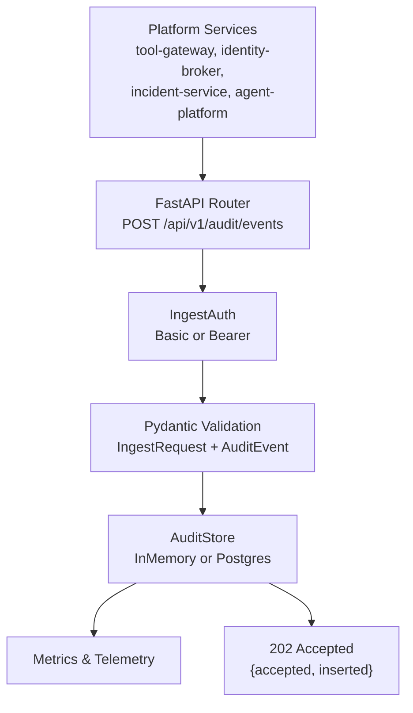
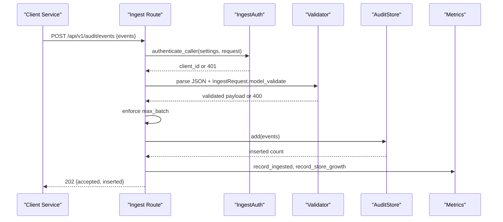
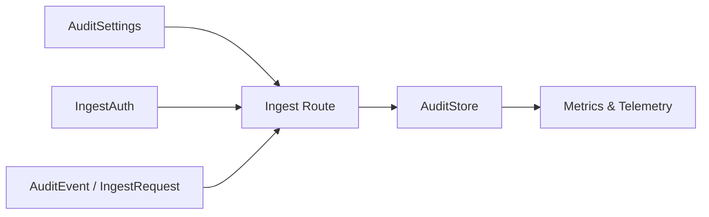

# Event Ingestion API

<cite>
**Referenced Files in This Document**
- [ingest.py](file://products/audit-service/src/audit_service/api/routes/ingest.py)
- [ingest_auth.py](file://products/audit-service/src/audit_service/services/ingest_auth.py)
- [audit.py](file://products/audit-service/src/audit_service/schemas/audit.py)
- [audit-event.schema.json](file://shared/shared-contracts/schemas/audit-event.schema.json)
- [audit_store.py](file://products/audit-service/src/audit_service/services/audit_store.py)
- [config.py](file://products/audit-service/src/audit_service/core/config.py)
- [test_routes.py](file://products/audit-service/tests/test_routes.py)
- [test_ingest_auth.py](file://products/audit-service/tests/test_ingest_auth.py)
</cite>

## Table of Contents
1. [Introduction](#introduction)
2. [Project Structure](#project-structure)
3. [Core Components](#core-components)
4. [Architecture Overview](#architecture-overview)
5. [Detailed Component Analysis](#detailed-component-analysis)
6. [Dependency Analysis](#dependency-analysis)
7. [Performance Considerations](#performance-considerations)
8. [Troubleshooting Guide](#troubleshooting-guide)
9. [Conclusion](#conclusion)

## Introduction
This document specifies the Audit Service event ingestion endpoint for receiving audit events from platform services such as agent-platform, tool-gateway, identity-broker, and incident-service. It defines the request schema, authentication requirements, error handling, validation rules, and performance characteristics for high-volume ingestion and batch processing.

## Project Structure
The ingestion flow is implemented in the Audit Service:
- Route handler for POST /api/v1/audit/events
- Authentication middleware for service credentials and workload bearer tokens
- Pydantic models bound to the shared audit-event schema
- Pluggable store backends (in-memory and PostgreSQL)
- Configuration via environment variables controlling batch size, retention, and client registries

**Diagram sources**
- [ingest.py:33-82](file://products/audit-service/src/audit_service/api/routes/ingest.py#L33-L82)
- [ingest_auth.py:105-117](file://products/audit-service/src/audit_service/services/ingest_auth.py#L105-L117)
- [audit.py:44-64](file://products/audit-service/src/audit_service/schemas/audit.py#L44-L64)
- [audit_store.py:42-63](file://products/audit-service/src/audit_service/services/audit_store.py#L42-L63)

**Section sources**
- [ingest.py:1-83](file://products/audit-service/src/audit_service/api/routes/ingest.py#L1-L83)
- [audit-store.py:1-63](file://products/audit-service/src/audit_service/services/audit_store.py#L1-L63)

## Core Components
- Endpoint: POST /api/v1/audit/events accepts a JSON body with an events array.
- Request model: IngestRequest containing one or more AuditEvent objects.
- Event schema: Enforced by both the shared JSON Schema and Pydantic models; fields include event_id, occurred_at, event_type, service, request_id, outcome, plus optional subject, username, actor, roles, session_id, and details.
- Authentication: HTTP Basic with a registered client registry, or Kubernetes projected workload bearer tokens validated against the cluster OIDC issuer JWKS.
- Storage: Events are stored verbatim; deduplication occurs on event_id.
- Responses: 202 Accepted with accepted and inserted counts; 400 for malformed or oversized batches; 401 for authentication failures.

**Section sources**
- [ingest.py:33-82](file://products/audit-service/src/audit_service/api/routes/ingest.py#L33-L82)
- [audit.py:44-64](file://products/audit-service/src/audit_service/schemas/audit.py#L44-L64)
- [audit-event.schema.json:7-90](file://shared/shared-contracts/schemas/audit-event.schema.json#L7-L90)
- [ingest_auth.py:34-43](file://products/audit-service/src/audit_service/services/ingest_auth.py#L34-L43)
- [ingest_auth.py:69-93](file://products/audit-service/src/audit_service/services/ingest_auth.py#L69-L93)

## Architecture Overview
The ingestion pipeline validates the caller, parses and validates the batch, enforces batch limits, persists events, and returns acceptance metrics.

**Diagram sources**
- [ingest.py:33-82](file://products/audit-service/src/audit_service/api/routes/ingest.py#L33-L82)
- [ingest_auth.py:105-117](file://products/audit-service/src/audit_service/services/ingest_auth.py#L105-L117)
- [audit_store.py:357-384](file://products/audit-service/src/audit_service/services/audit_store.py#L357-L384)

## Detailed Component Analysis

### POST /api/v1/audit/events
- Purpose: Receive batches of audit events from platform services.
- Request:
  - Content-Type: application/json
  - Body: {"events": [AuditEvent, ...]}
  - Minimum one event per batch.
- Authentication:
  - HTTP Basic: Authorization: Basic base64(client_id:secret) using AUDIT_INGEST_CLIENTS registry.
  - Workload Bearer: Authorization: Bearer <JWT> validated against cluster OIDC issuer JWKS with required claims and audience; subject must be mapped to a registered client.
- Validation:
  - JSON parsing; Pydantic model validation against AuditEvent schema.
  - Closed vocabulary for event_type and outcome enforced by schema and models.
  - Batch size limited by AUDIT_MAX_BATCH.
- Persistence:
  - Deduplication by event_id.
  - Stored verbatim; no field rewriting between ingest and query.
- Response:
  - 202 Accepted: {"accepted": number, "inserted": number}
  - 400 Bad Request: invalid JSON, invalid batch, or batch too large.
  - 401 Unauthorized: missing or invalid credentials.

Example payloads (described):
- Tool execution event: event_type = "tool_invoked", details includes tool_name, status, duration_ms, redacted_spans.
- Session lifecycle event: event_type = "session_created" or "session_deleted", with session-scoped metadata in details.
- Approval workflow event: event_type = "confirmation_decided", with confirm_id, tool_names, decision; may include approval_rule_id and approval_tier when require_approval matched.
- Policy decision event: event_type = "policy_decision", with action, decision, reason.

Error handling:
- Malformed JSON: 400 with detail indicating invalid JSON body.
- Invalid event schema: 400 with detail including validation error message.
- Unknown event_type or outcome: 400 due to schema/model validation failure.
- Oversized batch: 400 with detail referencing AUDIT_MAX_BATCH.
- Authentication failure: 401 with detail describing credential issue.

Retry strategy guidance:
- Clients should retry on transient errors (e.g., network issues) with exponential backoff.
- Do not retry on 400 or 401 without fixing the request or credentials.
- Idempotency is provided by event_id deduplication; safe to re-send identical events.

**Section sources**
- [ingest.py:33-82](file://products/audit-service/src/audit_service/api/routes/ingest.py#L33-L82)
- [audit.py:44-64](file://products/audit-service/src/audit_service/schemas/audit.py#L44-L64)
- [audit-event.schema.json:7-90](file://shared/shared-contracts/schemas/audit-event.schema.json#L7-L90)
- [test_routes.py:68-125](file://products/audit-service/tests/test_routes.py#L68-L125)

### Authentication for Ingestion
Two supported paths:
- Static credentials: HTTP Basic against AUDIT_INGEST_CLIENTS registry.
- Workload identity: Kubernetes projected service-account token presented as Bearer, validated against cluster OIDC issuer JWKS with audience and subject mapping.

Behavior:
- Missing or unsupported Authorization header results in 401.
- Invalid Basic credentials result in 401.
- Expired or invalid JWT results in 401.
- Unregistered workload subject results in 401.

Configuration:
- AUDIT_INGEST_CLIENTS: comma-separated client_id=secret pairs.
- AUDIT_WORKLOAD_ISSUER_URL: OIDC issuer URL enabling workload path.
- AUDIT_WORKLOAD_AUDIENCE: expected audience for workload tokens (default "audit-service").
- AUDIT_WORKLOAD_CLIENTS: comma-separated subject=client_id mappings.

**Section sources**
- [ingest_auth.py:34-43](file://products/audit-service/src/audit_service/services/ingest_auth.py#L34-L43)
- [ingest_auth.py:69-93](file://products/audit-service/src/audit_service/services/ingest_auth.py#L69-L93)
- [ingest_auth.py:105-117](file://products/audit-service/src/audit_service/services/ingest_auth.py#L105-L117)
- [config.py:24-49](file://products/audit-service/src/audit_service/core/config.py#L24-L49)
- [config.py:60-105](file://products/audit-service/src/audit_service/core/config.py#L60-L105)
- [test_ingest_auth.py:52-108](file://products/audit-service/tests/test_ingest_auth.py#L52-L108)
- [test_ingest_auth.py:170-218](file://products/audit-service/tests/test_ingest_auth.py#L170-L218)

### Event Schema and Validation Rules
- Required envelope fields: event_id, occurred_at, event_type, service, request_id, outcome.
- Optional envelope fields: subject, username, actor, roles, session_id.
- Details: per-event-type payload object; additional properties allowed but only envelope fields are used for queries and summaries.
- Closed vocabularies:
  - event_type: tool_invoked, policy_decision, token_exchange, session_created, session_deleted, chat_started, chat_completed, confirmation_decided, incident_triaged, skill_searched, skill_retrieved, skills_synced, execution_requested, execution_completed, execution_rejected, document_created, document_published, document_read, skill_draft_generated, incident_skill_draft_generated, skill_graduated.
  - outcome: allow, deny, success, error.

Validation enforcement:
- Shared JSON Schema defines the contract.
- Pydantic models forbid extra fields and enforce types, enums, and datetime format.
- Tests assert rejection of missing required fields, unknown event_type, and empty batches.

**Section sources**
- [audit-event.schema.json:7-90](file://shared/shared-contracts/schemas/audit-event.schema.json#L7-L90)
- [audit.py:14-58](file://products/audit-service/src/audit_service/schemas/audit.py#L14-L58)
- [test_routes.py:94-118](file://products/audit-service/tests/test_routes.py#L94-L118)

### Storage and Deduplication
- Backends:
  - In-memory: suitable for tests and development; bounded list with id set for deduplication.
  - PostgreSQL: WAL-durable table with indexes on occurred_at, username, session_id, request_id, event_type; ON CONFLICT DO NOTHING ensures idempotent inserts.
- Deduplication: Duplicate event_id values are ignored; insert count reflects unique events persisted.
- Query parity: In-memory and Postgres implementations return byte-identical results for the same inputs.

**Section sources**
- [audit_store.py:93-150](file://products/audit-service/src/audit_service/services/audit_store.py#L93-L150)
- [audit_store.py:224-261](file://products/audit-service/src/audit_service/services/audit_store.py#L224-L261)
- [audit_store.py:357-384](file://products/audit-service/src/audit_service/services/audit_store.py#L357-L384)
- [test_routes.py:153-165](file://products/audit-service/tests/test_routes.py#L153-L165)

### Example Ingestion Flows

#### Tool Execution Event
- Use event_type "tool_invoked".
- Include details with tool_name, status, duration_ms, and redacted_spans where applicable.
- Set service to the emitting service (e.g., tool-gateway).
- Outcome typically "success" or "error".

#### Session Lifecycle Event
- Use event_type "session_created" or "session_deleted".
- Provide session-scoped metadata in details.
- Include session_id when available.

#### Approval Workflow Event
- Use event_type "confirmation_decided".
- Include confirm_id, tool_names, decision; may include approval_rule_id and approval_tier when require_approval matched.
- For tier-blocked attempts, outcome "deny" with blocked indicators in details.

#### Policy Decision Event
- Use event_type "policy_decision".
- Include action, decision, reason in details.

These examples align with the closed vocabulary and details structure defined in the shared schema and models.

**Section sources**
- [audit-event.schema.json:25-89](file://shared/shared-contracts/schemas/audit-event.schema.json#L25-L89)
- [audit.py:14-58](file://products/audit-service/src/audit_service/schemas/audit.py#L14-L58)
- [test_routes.py:127-151](file://products/audit-service/tests/test_routes.py#L127-L151)

## Dependency Analysis
The ingestion route depends on configuration, authentication, validation, storage, and telemetry components.

**Diagram sources**
- [ingest.py:15-26](file://products/audit-service/src/audit_service/api/routes/ingest.py#L15-L26)
- [ingest_auth.py:105-117](file://products/audit-service/src/audit_service/services/ingest_auth.py#L105-L117)
- [audit.py:44-64](file://products/audit-service/src/audit_service/schemas/audit.py#L44-L64)
- [audit_store.py:42-63](file://products/audit-service/src/audit_service/services/audit_store.py#L42-L63)

**Section sources**
- [ingest.py:15-26](file://products/audit-service/src/audit_service/api/routes/ingest.py#L15-L26)
- [config.py:60-105](file://products/audit-service/src/audit_service/core/config.py#L60-L105)

## Performance Considerations
- Batch size: Controlled by AUDIT_MAX_BATCH (default 50). Exceeding this limit returns 400.
- Deduplication: event_id-based deduplication prevents duplicate storage and inflates accepted vs inserted counts appropriately.
- Backend selection:
  - In-memory backend for dev/test with bounded eviction logic.
  - PostgreSQL backend for production with WAL durability and indexed queries.
- Retention and eviction:
  - Configurable retention window (AUDIT_RETENTION_DAYS), hard cap (AUDIT_MAX_EVENTS), eviction interval (AUDIT_EVICTION_INTERVAL_SECONDS), and batch size (AUDIT_EVICTION_BATCH_SIZE).
  - Eviction runs in batches to avoid long-running DELETE operations.
- Connection management:
  - Postgres connections opened per operation; suitable for low-to-moderate throughput workloads.
- Observability:
  - Metrics recorded for ingested events, rejected requests, and store growth.
  - Structured logging of ingestion outcomes.

Operational recommendations:
- Tune AUDIT_MAX_BATCH based on client throughput and payload sizes.
- Monitor rejected counts for auth and malformed batches to identify misconfigured clients.
- Ensure AUDIT_DB_URL is configured when using Postgres backend.
- Configure workload identity settings if using Bearer tokens.

**Section sources**
- [config.py:60-105](file://products/audit-service/src/audit_service/core/config.py#L60-L105)
- [audit_store.py:498-533](file://products/audit-service/src/audit_service/services/audit_store.py#L498-L533)
- [ingest.py:58-71](file://products/audit-service/src/audit_service/api/routes/ingest.py#L58-L71)

## Troubleshooting Guide
Common issues and resolutions:
- 401 Unauthorized:
  - Missing or unsupported Authorization header.
  - Invalid Basic credentials (unknown client_id or wrong secret).
  - Expired or invalid JWT (wrong issuer, audience, or signature).
  - Unregistered workload subject.
  - Resolution: Verify AUDIT_INGEST_CLIENTS or AUDIT_WORKLOAD_* settings; ensure correct credentials or token configuration.
- 400 Bad Request:
  - Invalid JSON body.
  - Invalid event schema (missing required fields, unknown event_type, invalid outcome).
  - Empty events array.
  - Batch exceeds AUDIT_MAX_BATCH.
  - Resolution: Fix request payload; reduce batch size; ensure event_type and outcome are within allowed values.
- 422 Validation Error:
  - Occurs on query parameters outside allowed ranges or enums (e.g., invalid outcome filter).
  - Resolution: Adjust query parameters to valid values.

Diagnostic tips:
- Inspect response detail messages for specific validation errors.
- Check metrics for rejected categories (auth, malformed, batch_too_large).
- Confirm store readiness via health endpoints and verify backend configuration.

**Section sources**
- [ingest.py:37-65](file://products/audit-service/src/audit_service/api/routes/ingest.py#L37-L65)
- [test_routes.py:79-125](file://products/audit-service/tests/test_routes.py#L79-L125)
- [test_ingest_auth.py:52-108](file://products/audit-service/tests/test_ingest_auth.py#L52-L108)
- [test_ingest_auth.py:170-218](file://products/audit-service/tests/test_ingest_auth.py#L170-L218)

## Conclusion
The Audit Service provides a secure, validated, and durable ingestion endpoint for platform services to emit audit events. It supports both static credentials and workload identity, enforces strict schema validation, deduplicates events, and offers configurable retention and batching. Clients should adhere to the shared audit-event schema, use appropriate authentication, and implement retries with backoff for transient failures.