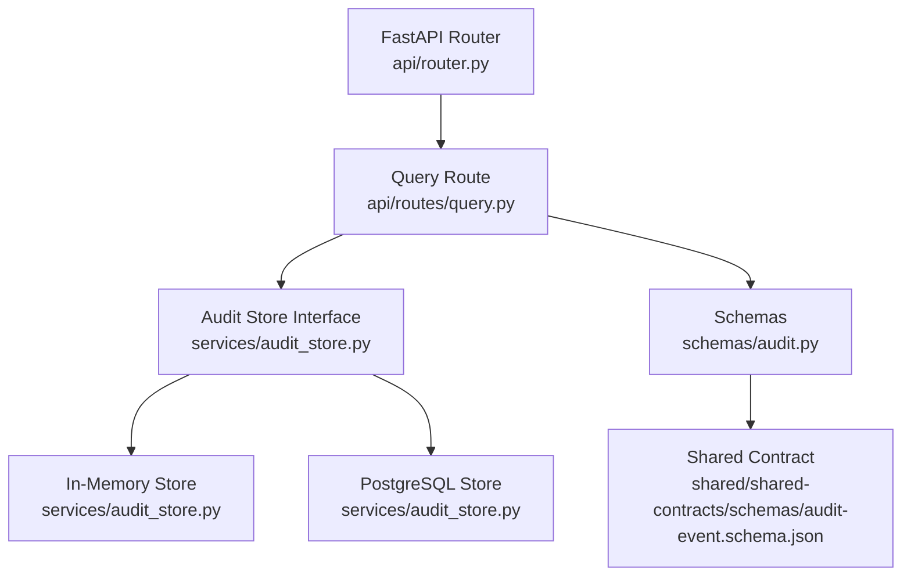
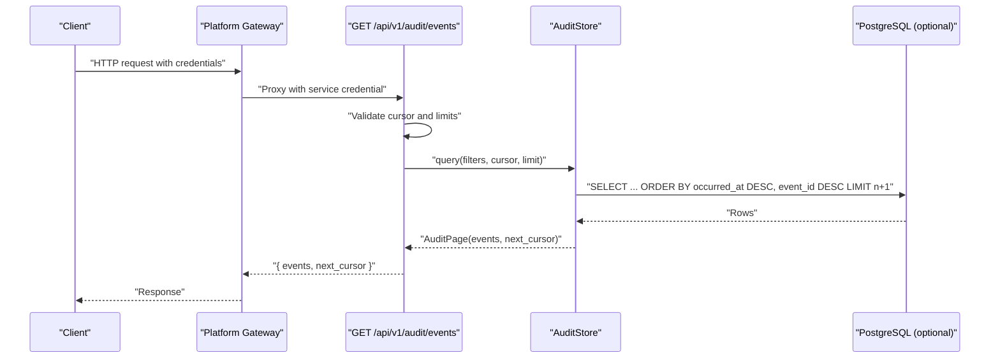
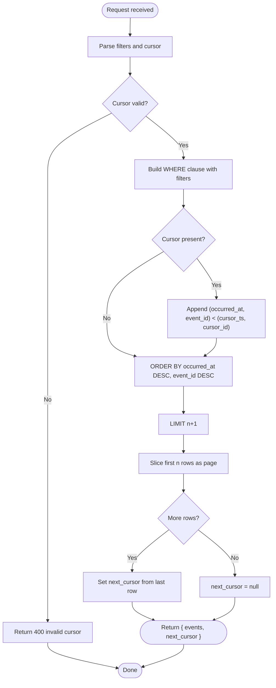
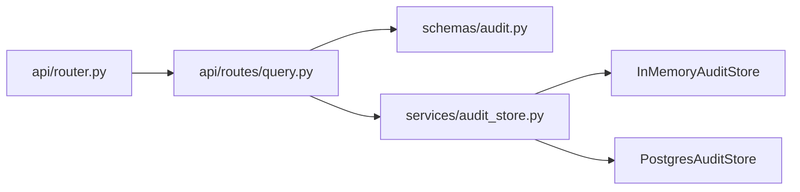

# Events Query API

<cite>
**Referenced Files in This Document**
- [query.py](file://products/audit-service/src/audit_service/api/routes/query.py)
- [audit.py](file://products/audit-service/src/audit_service/schemas/audit.py)
- [audit_store.py](file://products/audit-service/src/audit_service/services/audit_store.py)
- [router.py](file://products/audit-service/src/audit_service/api/router.py)
- [test_routes.py](file://products/audit-service/tests/test_routes.py)
- [audit-event.schema.json](file://shared/shared-contracts/schemas/audit-event.schema.json)
</cite>

## Table of Contents
1. [Introduction](#introduction)
2. [Project Structure](#project-structure)
3. [Core Components](#core-components)
4. [Architecture Overview](#architecture-overview)
5. [Detailed Component Analysis](#detailed-component-analysis)
6. [Dependency Analysis](#dependency-analysis)
7. [Performance Considerations](#performance-considerations)
8. [Troubleshooting Guide](#troubleshooting-guide)
9. [Conclusion](#conclusion)

## Introduction
This document specifies the Audit Service query endpoint for retrieving stored audit events. It focuses on GET /api/v1/audit/events, including supported filters, keyset cursor-based pagination, response shape, authorization model, and performance best practices for large datasets. The endpoint returns stored audit envelopes verbatim, newest-first, with a next_cursor field to efficiently navigate large result sets.

## Project Structure
The Audit Service exposes its routes through a FastAPI router that includes health, ingest, query, summary, and export endpoints. The query route is defined under api/routes/query.py and registered via api/router.py. Schemas are defined under schemas/audit.py, and persistence logic (in-memory and PostgreSQL) lives under services/audit_store.py. Shared contract definitions for the audit event envelope live under shared/shared-contracts/schemas/audit-event.schema.json.

**Diagram sources**
- [router.py:1-11](file://products/audit-service/src/audit_service/api/router.py#L1-L11)
- [query.py:1-95](file://products/audit-service/src/audit_service/api/routes/query.py#L1-L95)
- [audit_store.py:1-565](file://products/audit-service/src/audit_service/services/audit_store.py#L1-L565)
- [audit.py:1-83](file://products/audit-service/src/audit_service/schemas/audit.py#L1-L83)
- [audit-event.schema.json:1-94](file://shared/shared-contracts/schemas/audit-event.schema.json#L1-L94)

**Section sources**
- [router.py:1-11](file://products/audit-service/src/audit_service/api/router.py#L1-L11)
- [query.py:1-95](file://products/audit-service/src/audit_service/api/routes/query.py#L1-L95)

## Core Components
- Endpoint: GET /api/v1/audit/events
  - Filters: username, session_id, request_id, event_type, service, outcome, since, until
  - Pagination: keyset cursor using cursor and limit; returns next_cursor when more pages exist
  - Response: { "events": [...], "next_cursor": string | null }
- Schemas:
  - AuditQuery: filter set with optional fields for each dimension
  - Outcome enum: values from the shared schema
  - AuditEvent envelope: canonical fields as per the shared schema
- Storage backends:
  - In-memory store for tests/dev
  - PostgreSQL store for production with indexes for efficient filtering and ordering

Key behaviors:
- Envelopes are returned verbatim without rewriting between ingest and query.
- Filtering is additive across all provided dimensions.
- Cursor encodes occurred_at and event_id to ensure deterministic ordering.

**Section sources**
- [query.py:35-94](file://products/audit-service/src/audit_service/api/routes/query.py#L35-L94)
- [audit.py:44-83](file://products/audit-service/src/audit_service/schemas/audit.py#L44-L83)
- [audit-store.py:66-88](file://products/audit-service/src/audit_service/services/audit_store.py#L66-L88)
- [audit-store.py:386-415](file://products/audit-service/src/audit_service/services/audit_store.py#L386-L415)
- [audit-event.schema.json:1-94](file://shared/shared-contracts/schemas/audit-event.schema.json#L1-L94)

## Architecture Overview
The query flow authenticates the caller, validates optional cursor, builds an AuditQuery from request parameters, delegates to the configured store backend, and returns a page of events with a next_cursor when available. Authorization enforcement for user-scoped reads is performed by platform-gateway before it proxies requests to this endpoint.

**Diagram sources**
- [query.py:35-94](file://products/audit-service/src/audit_service/api/routes/query.py#L35-L94)
- [audit_store.py:386-415](file://products/audit-service/src/audit_service/services/audit_store.py#L386-L415)

## Detailed Component Analysis

### GET /api/v1/audit/events
- Purpose: Retrieve stored audit events with filtering and keyset pagination.
- Path: /api/v1/audit/events
- Method: GET
- Authentication: Requires a registered service caller; user-level authorization is enforced by platform-gateway before proxying here.
- Query parameters:
  - username: string | null
  - session_id: string | null
  - request_id: string | null
  - event_type: string | null
  - service: string | null
  - outcome: Outcome | null
  - since: datetime | null
  - until: datetime | null
  - cursor: string | null
  - limit: integer, default 50, range 1..200
- Response body:
  - events: array of AuditEvent objects (verbatim envelopes)
  - next_cursor: string | null (omit or pass back to fetch the next page)

Example usage patterns:
- Recent tool executions:
  - Filter by event_type=tool_invoked and order newest-first by default.
  - Use limit to control page size and follow next_cursor to continue.
- Filter by specific sessions:
  - Add session_id to narrow results to a single agent session.
- Filter by specific users:
  - Add username to scope results to a particular user.
- Time-window queries:
  - Combine since and/or until to restrict to a time window.

Notes:
- Invalid cursor values return a 400 error.
- Invalid outcome values return a 422 validation error.
- Out-of-range limit values return a 422 validation error.

**Section sources**
- [query.py:35-94](file://products/audit-service/src/audit_service/api/routes/query.py#L35-L94)
- [test_routes.py:189-255](file://products/audit-service/tests/test_routes.py#L189-L255)

### AuditQuery Schema
- Fields: username, session_id, request_id, event_type, service, outcome, since, until
- Semantics: Each field is optional; empty means no constraint. Filters are additive.
- Outcome behavior: Filters against the envelope outcome column using the shared schema enum.

**Section sources**
- [audit.py:67-83](file://products/audit-service/src/audit_service/schemas/audit.py#L67-L83)

### Outcome Enum Values
- Allowed values: allow, deny, success, error
- These values come from the shared audit-event schema and are enforced at the API boundary.

**Section sources**
- [audit-event.schema.json:81-84](file://shared/shared-contracts/schemas/audit-event.schema.json#L81-L84)
- [audit.py:41-41](file://products/audit-service/src/audit_service/schemas/audit.py#L41-L41)

### Keyset Cursor-Based Pagination
- Cursor encoding: base64 of ISO timestamp and event_id separated by a pipe character.
- Ordering: newest-first by occurred_at DESC, then event_id DESC for determinism.
- Behavior:
  - If cursor is provided, only rows strictly before the cursor position are returned.
  - next_cursor is set when there are additional rows beyond the requested limit.
  - Passing an invalid cursor returns a 400 error.

**Diagram sources**
- [audit_store.py:66-88](file://products/audit-service/src/audit_service/services/audit_store.py#L66-L88)
- [audit_store.py:386-415](file://products/audit-service/src/audit_service/services/audit_store.py#L386-L415)

**Section sources**
- [audit_store.py:66-88](file://products/audit-service/src/audit_service/services/audit_store.py#L66-L88)
- [audit_store.py:386-415](file://products/audit-service/src/audit_service/services/audit_store.py#L386-L415)
- [test_routes.py:228-255](file://products/audit-service/tests/test_routes.py#L228-L255)

### Authorization Model
- User-level authorization for queries is enforced by platform-gateway before it proxies to the Audit Service.
- The Audit Service route additionally requires a registered service caller for authentication.
- This separation ensures that client identity and permissions are handled centrally while service-to-service calls are authenticated.

**Section sources**
- [query.py:1-7](file://products/audit-service/src/audit_service/api/routes/query.py#L1-L7)

### Data Model and Envelope Integrity
- AuditEvent fields and allowed event types/outcomes are defined by the shared schema.
- The service stores and returns envelopes verbatim; no field rewriting occurs between ingest and query.

**Section sources**
- [audit-event.schema.json:1-94](file://shared/shared-contracts/schemas/audit-event.schema.json#L1-L94)
- [audit.py:1-5](file://products/audit-service/src/audit_service/schemas/audit.py#L1-L5)

## Dependency Analysis
- Router registration wires the query route into the application.
- The query handler depends on:
  - Configuration and metrics
  - AuditQuery and Outcome schemas
  - AuditStore interface implemented by in-memory or PostgreSQL backends
  - Caller authentication helper

**Diagram sources**
- [router.py:1-11](file://products/audit-service/src/audit_service/api/router.py#L1-L11)
- [query.py:1-95](file://products/audit-service/src/audit_service/api/routes/query.py#L1-L95)
- [audit_store.py:1-565](file://products/audit-service/src/audit_service/services/audit_store.py#L1-L565)

**Section sources**
- [router.py:1-11](file://products/audit-service/src/audit_service/api/router.py#L1-L11)
- [query.py:1-95](file://products/audit-service/src/audit_service/api/routes/query.py#L1-L95)
- [audit_store.py:1-565](file://products/audit-service/src/audit_service/services/audit_store.py#L1-L565)

## Performance Considerations
- Index usage:
  - Primary index on occurred_at DESC supports newest-first ordering and cursor scans.
  - Secondary indexes on username, session_id, request_id, and event_type accelerate equality filters.
- Query shape:
  - Provide selective filters (username, session_id, event_type, time windows) to reduce scan size.
  - Use reasonable limit values (default 50, max 200) and paginate with next_cursor instead of large offsets.
- Cursor efficiency:
  - Keyset pagination avoids expensive offset calculations and performs well on large tables.
- Backend selection:
  - In-memory store is suitable for tests and development; PostgreSQL is used in production for durability and scale.
- Best practices:
  - Prefer narrowing by session_id or username when possible.
  - Combine since/until to constrain time ranges.
  - Avoid overly broad queries without filters on large datasets.

[No sources needed since this section provides general guidance]

## Troubleshooting Guide
Common issues and resolutions:
- 401 Unauthorized:
  - Missing or invalid service credentials for the Audit Service.
  - Ensure platform-gateway enforces user-level authorization before proxying.
- 400 Bad Request:
  - Invalid cursor format or content. Re-fetch next_cursor from the previous response.
- 422 Validation Error:
  - Invalid outcome value outside the shared schema enum.
  - limit out of allowed range (1..200).
- Empty results:
  - Check filters; try removing constraints one by one to isolate the issue.
- Slow queries:
  - Add selective filters (session_id, username, event_type, time window).
  - Verify database indexes exist and are being used.

**Section sources**
- [test_routes.py:221-265](file://products/audit-service/tests/test_routes.py#L221-L265)
- [query.py:51-63](file://products/audit-service/src/audit_service/api/routes/query.py#L51-L63)

## Conclusion
The GET /api/v1/audit/events endpoint provides a robust, secure, and performant way to retrieve audit events with fine-grained filtering and efficient keyset pagination. By combining selective filters, appropriate limits, and cursor-based navigation, clients can reliably explore large audit datasets. Authorization is enforced at the gateway layer, while the Audit Service ensures durable storage and consistent envelope integrity.