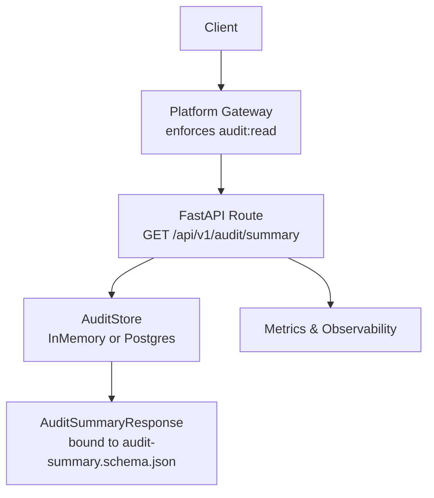
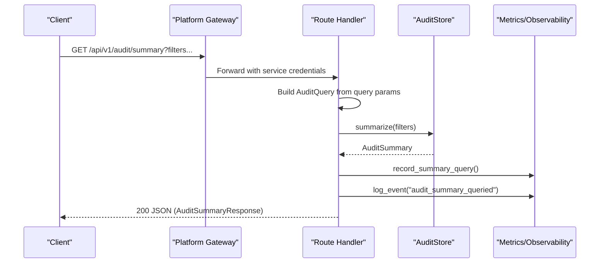
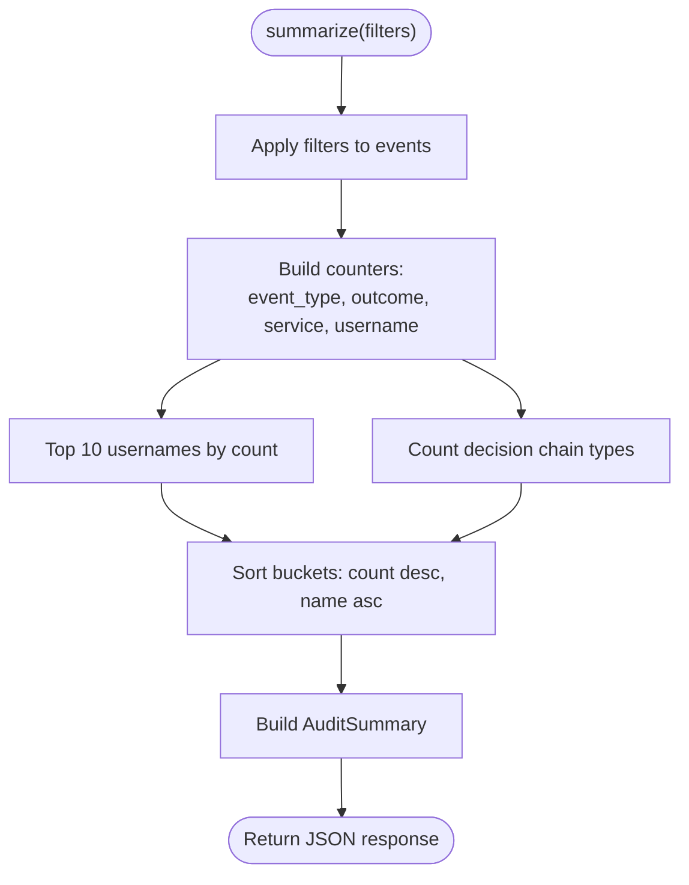
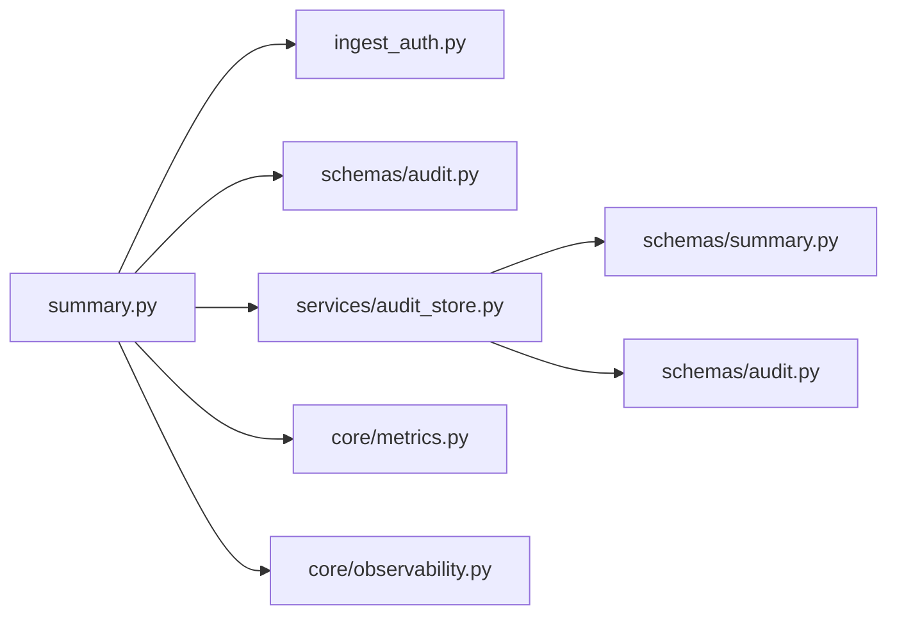

# Summary and Aggregation API

<cite>
**Referenced Files in This Document**
- [summary.py](file://products/audit-service/src/audit_service/api/routes/summary.py)
- [router.py](file://products/audit-service/src/audit_service/api/router.py)
- [audit_store.py](file://products/audit-service/src/audit_service/services/audit_store.py)
- [summary_schema.py](file://products/audit-service/src/audit_service/schemas/summary.py)
- [audit_schema.py](file://products/audit-service/src/audit_service/schemas/audit.py)
- [audit-summary.schema.json](file://shared/shared-contracts/schemas/audit-summary.schema.json)
- [test_reporting.py](file://products/audit-service/tests/test_reporting.py)
- [SPEC-046 spec.md](file://docs/specs/SPEC-046-audit-reporting-and-export/spec.md)
- [SPEC-047 spec.md](file://docs/specs/SPEC-047-audit-summary-drilldown/spec.md)
</cite>

## Table of Contents
1. [Introduction](#introduction)
2. [Project Structure](#project-structure)
3. [Core Components](#core-components)
4. [Architecture Overview](#architecture-overview)
5. [Detailed Component Analysis](#detailed-component-analysis)
6. [Dependency Analysis](#dependency-analysis)
7. [Performance Considerations](#performance-considerations)
8. [Troubleshooting Guide](#troubleshooting-guide)
9. [Conclusion](#conclusion)
10. [Appendices](#appendices)

## Introduction
This document provides detailed API documentation for the Audit Service summary and aggregation endpoint: GET /api/v1/audit/summary. It explains request parameters, response schema, usage examples (compliance reports, operational dashboards, trend analysis), performance considerations, and caching strategies. The endpoint returns deterministic aggregates over envelope columns only (event_type, outcome, service, username) and includes a SPEC-037 decision-chain projection to support governance reconciliation between approvals and executions.

## Project Structure
The summary endpoint is implemented as a FastAPI route that authenticates callers, builds an AuditQuery filter set, delegates aggregation to the configured audit store (in-memory or PostgreSQL), records metrics and observability events, and serializes the result via a Pydantic model bound to the shared JSON Schema.

**Diagram sources**
- [summary.py:34-78](file://products/audit-service/src/audit_service/api/routes/summary.py#L34-L78)
- [audit_store.py:42-63](file://products/audit-service/src/audit_service/services/audit_store.py#L42-L63)
- [summary_schema.py:98-138](file://products/audit-service/src/audit_service/schemas/summary.py#L98-L138)
- [audit-summary.schema.json:1-109](file://shared/shared-contracts/schemas/audit-summary.schema.json#L1-L109)

**Section sources**
- [router.py:1-11](file://products/audit-service/src/audit_service/api/router.py#L1-L11)
- [summary.py:1-79](file://products/audit-service/src/audit_service/api/routes/summary.py#L1-L79)

## Core Components
- Route handler: Validates authentication, constructs filters, calls store.summarize, records metrics, logs structured event, and returns JSON.
- Filter model: AuditQuery defines supported dimensions (username, session_id, request_id, event_type, service, outcome, since, until).
- Store abstraction: In-memory and PostgreSQL backends implement summarize with identical sorting and zero-filled decision chain.
- Response model: AuditSummaryResponse maps to audit-summary.schema.json; window echoes applied filters; buckets are sorted deterministically.

Key behaviors:
- No default time window; unfiltered summaries operate over retention-bounded storage.
- Outcome is an additive filter dimension aligned with the shared enum.
- Top actors limited to ten entries.
- Decision chain always includes all four counts, zero when absent.

**Section sources**
- [audit_schema.py:67-83](file://products/audit-service/src/audit_service/schemas/audit.py#L67-L83)
- [audit_store.py:182-219](file://products/audit-service/src/audit_service/services/audit_store.py#L182-L219)
- [audit_store.py:417-489](file://products/audit-service/src/audit_service/services/audit_store.py#L417-L489)
- [summary_schema.py:18-30](file://products/audit-service/src/audit_service/schemas/summary.py#L18-L30)
- [summary_schema.py:98-138](file://products/audit-service/src/audit_service/schemas/summary.py#L98-L138)
- [audit-summary.schema.json:1-109](file://shared/shared-contracts/schemas/audit-summary.schema.json#L1-L109)

## Architecture Overview
The endpoint flow enforces authorization at the gateway, validates inputs, performs envelope-only aggregation, and returns a contract-bound response. Both backends produce byte-identical bucket ordering and decision chain values.

**Diagram sources**
- [summary.py:34-78](file://products/audit-service/src/audit_service/api/routes/summary.py#L34-L78)
- [audit_store.py:417-489](file://products/audit-service/src/audit_service/services/audit_store.py#L417-L489)

## Detailed Component Analysis

### Endpoint: GET /api/v1/audit/summary
- Purpose: Return aggregated audit statistics for the current filter window.
- Authentication: Enforced by platform-gateway using audit:read; route returns 401 on auth failure.
- Query parameters:
  - username: string | null
  - session_id: string | null
  - request_id: string | null
  - event_type: string | null
  - service: string | null
  - outcome: one of allow, deny, success, error
  - since: RFC 3339 datetime | null
  - until: RFC 3339 datetime | null
- Behavior:
  - Filters are ANDed across provided dimensions.
  - No default window; if none provided, operates over retention-bounded data.
  - Buckets sorted by count descending, then name ascending.
  - top_actors capped at 10 non-null usernames.
  - decision_chain always contains all four keys; missing types yield zero.
- Response: JSON object matching audit-summary.schema.json.

Example requests:
- Compliance report (deny outcomes): GET /api/v1/audit/summary?outcome=deny
- Operational dashboard (service breakdown): GET /api/v1/audit/summary?service=tool-gateway
- Trend analysis (last 24 hours): GET /api/v1/audit/summary?since=2026-08-30T12:00:00Z&until=2026-08-31T12:00:00Z

Examples are validated by tests that assert status codes, filtered totals, window echo, and decision chain values.

**Section sources**
- [summary.py:34-78](file://products/audit-service/src/audit_service/api/routes/summary.py#L34-L78)
- [audit_schema.py:67-83](file://products/audit-service/src/audit_service/schemas/audit.py#L67-L83)
- [test_reporting.py:78-179](file://products/audit-service/tests/test_reporting.py#L78-L179)

### Request Parameters and Filtering
- Dimensions:
  - username: exact match
  - session_id: exact match
  - request_id: exact match
  - event_type: exact match against shared enum
  - service: exact match
  - outcome: exact match against shared enum
  - since/until: inclusive range on occurred_at
- Validation:
  - outcome must be one of the allowed values; invalid values return 422.
  - Time parameters are parsed as RFC 3339 datetimes.
- Window echo:
  - Response.window includes only provided filters as strings; unset fields are omitted.

**Section sources**
- [audit_schema.py:67-83](file://products/audit-service/src/audit_service/schemas/audit.py#L67-L83)
- [summary_schema.py:60-79](file://products/audit-service/src/audit_service/schemas/summary.py#L60-L79)
- [test_reporting.py:124-165](file://products/audit-service/tests/test_reporting.py#L124-L165)

### Response Schema
Fields:
- total_events: integer, minimum 0
- window: object mapping filter names to string values
- by_event_type: array of {name, count}
- by_outcome: array of {name, count}
- by_service: array of {name, count}
- top_actors: array of {name, count}, maxItems 10
- decision_chain: object with confirmation_decided, execution_requested, execution_completed, execution_rejected (all integers >= 0)

Sorting and constraints:
- All arrays sort by count descending, then name ascending.
- decision_chain keys are required and zero when no matching events exist.

**Section sources**
- [audit-summary.schema.json:1-109](file://shared/shared-contracts/schemas/audit-summary.schema.json#L1-L109)
- [summary_schema.py:33-58](file://products/audit-service/src/audit_service/schemas/summary.py#L33-L58)
- [summary_schema.py:89-107](file://products/audit-service/src/audit_service/schemas/summary.py#L89-L107)

### Aggregation Logic
- Envelope-only aggregation: Only event_type, outcome, service, username are used; details payload is never read.
- Deterministic ordering: Backend-specific grouping results are sorted in-process to ensure identical output across stores.
- Decision chain: Counts are projected for specific event types; absent types map to zero.

**Diagram sources**
- [audit_store.py:182-219](file://products/audit-service/src/audit_service/services/audit_store.py#L182-L219)
- [audit_store.py:417-489](file://products/audit-service/src/audit_service/services/audit_store.py#L417-L489)

**Section sources**
- [audit_store.py:182-219](file://products/audit-service/src/audit_service/services/audit_store.py#L182-L219)
- [audit_store.py:417-489](file://products/audit-service/src/audit_service/services/audit_store.py#L417-L489)

### Use Cases and Examples
- Compliance reports:
  - Filter by outcome=deny to enumerate denied actions and services.
  - Combine with service and event_type to isolate policy decisions.
- Operational dashboards:
  - Group by service to monitor emitter load.
  - Track top_actors to identify heavy users.
- Trend analysis summaries:
  - Apply since/until to compute period totals and bucket distributions.
  - Use decision_chain to reconcile approvals vs executions within the window.

These scenarios are covered by tests asserting filtered totals, window echo, and decision chain projections.

**Section sources**
- [test_reporting.py:78-179](file://products/audit-service/tests/test_reporting.py#L78-L179)
- [SPEC-046 spec.md:158-246](file://docs/specs/SPEC-046-audit-reporting-and-export/spec.md#L158-L246)
- [SPEC-047 spec.md:1-273](file://docs/specs/SPEC-047-audit-summary-drilldown/spec.md#L1-L273)

## Dependency Analysis
- Route depends on:
  - Authentication helper (returns client_id or raises error)
  - AuditQuery model for parameter binding
  - AuditStore interface for summarize
  - Metrics and observability helpers
- Store depends on:
  - Shared schemas (AuditEvent, Outcome)
  - Summary models and constants (DecisionChain types, TOP_ACTORS_LIMIT)
  - Database driver (PostgreSQL) when configured

**Diagram sources**
- [summary.py:19-27](file://products/audit-service/src/audit_service/api/routes/summary.py#L19-L27)
- [audit_store.py:18-27](file://products/audit-service/src/audit_service/services/audit_store.py#L18-L27)

**Section sources**
- [summary.py:19-27](file://products/audit-service/src/audit_service/api/routes/summary.py#L19-L27)
- [audit_store.py:18-27](file://products/audit-service/src/audit_service/services/audit_store.py#L18-L27)

## Performance Considerations
- Envelope-only aggregation avoids scanning large details payloads.
- PostgreSQL path uses grouped SQL queries and LIMIT for top actors; in-memory path uses Counter and Python sorting.
- Deterministic sorting ensures consistent responses regardless of backend.
- Retention bounds prevent unbounded windows; no default window is applied.
- Metrics and logging are lightweight and do not self-ingest.

Recommendations:
- Prefer filtering by service, event_type, and outcome to reduce dataset size.
- Use since/until for bounded windows to limit scan ranges.
- Cache frequent summaries at the gateway or application layer when appropriate.

[No sources needed since this section provides general guidance]

## Troubleshooting Guide
Common issues:
- 401 Unauthorized: Missing or invalid caller credentials; ensure platform-gateway forwards service credentials.
- 422 Unprocessable Entity: Invalid outcome value outside the shared enum; correct to allow, deny, success, or error.
- Empty results: Filters too restrictive; verify parameter values and time window.
- Unexpected ordering: Ensure clients rely on server-side deterministic sorting rather than client assumptions.

Validation and behavior are verified by tests covering auth, filtering, empty windows, and outcome validation.

**Section sources**
- [test_reporting.py:159-179](file://products/audit-service/tests/test_reporting.py#L159-L179)
- [summary.py:48-52](file://products/audit-service/src/audit_service/api/routes/summary.py#L48-L52)

## Conclusion
The GET /api/v1/audit/summary endpoint provides a stable, deterministic aggregate surface for compliance, operations, and trend analysis. It enforces strict filtering, returns a contract-bound response, and supports drill-down workflows through additive outcome filtering. Backends guarantee identical outputs, and the design avoids payload excavation for performance and stability.

[No sources needed since this section summarizes without analyzing specific files]

## Appendices

### A. Request Parameter Reference
- username: string | null
- session_id: string | null
- request_id: string | null
- event_type: string | null (from shared enum)
- service: string | null
- outcome: allow | deny | success | error | null
- since: RFC 3339 datetime | null
- until: RFC 3339 datetime | null

**Section sources**
- [audit_schema.py:67-83](file://products/audit-service/src/audit_service/schemas/audit.py#L67-L83)

### B. Response Field Reference
- total_events: integer >= 0
- window: dict[str, str], echoes applied filters
- by_event_type: list[{name: string, count: integer}]
- by_outcome: list[{name: string, count: integer}]
- by_service: list[{name: string, count: integer}]
- top_actors: list[{name: string, count: integer}], max 10
- decision_chain: {confirmation_decided: int, execution_requested: int, execution_completed: int, execution_rejected: int}

**Section sources**
- [audit-summary.schema.json:1-109](file://shared/shared-contracts/schemas/audit-summary.schema.json#L1-L109)
- [summary_schema.py:98-138](file://products/audit-service/src/audit_service/schemas/summary.py#L98-L138)

### C. Example Scenarios
- Compliance report:
  - GET /api/v1/audit/summary?outcome=deny
  - Inspect by_outcome and by_service to identify denial hotspots.
- Operational dashboard:
  - GET /api/v1/audit/summary?service=tool-gateway
  - Review by_event_type and top_actors for load distribution.
- Trend analysis:
  - GET /api/v1/audit/summary?since=2026-08-30T12:00:00Z&until=2026-08-31T12:00:00Z
  - Compare decision_chain across periods to assess approval-to-execution ratios.

**Section sources**
- [test_reporting.py:78-179](file://products/audit-service/tests/test_reporting.py#L78-L179)