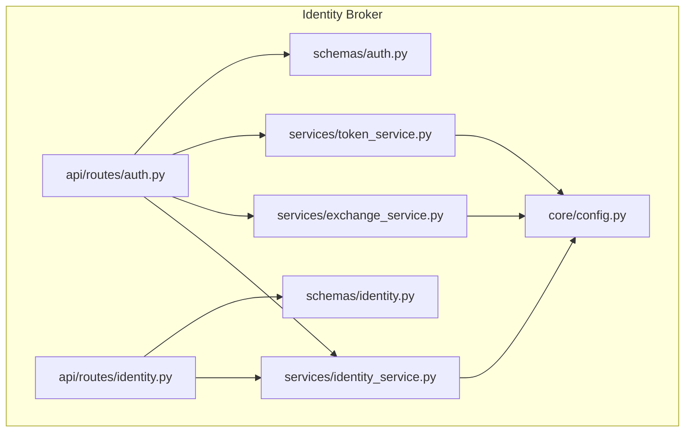
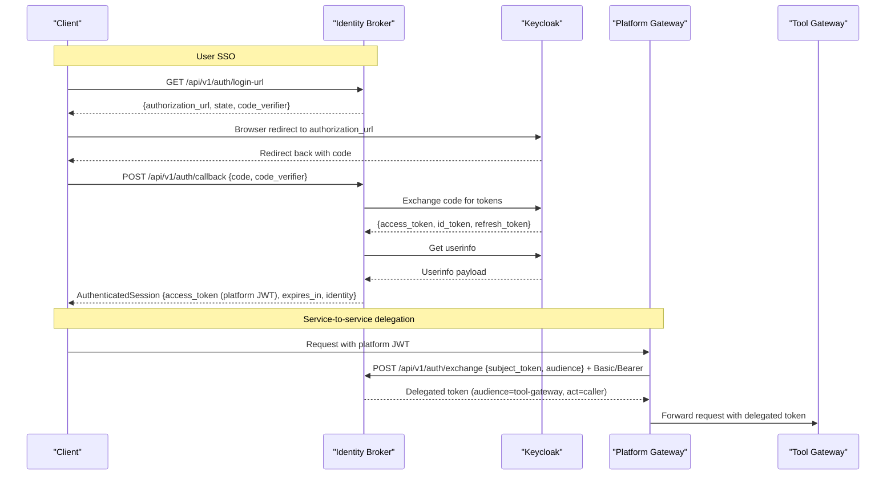
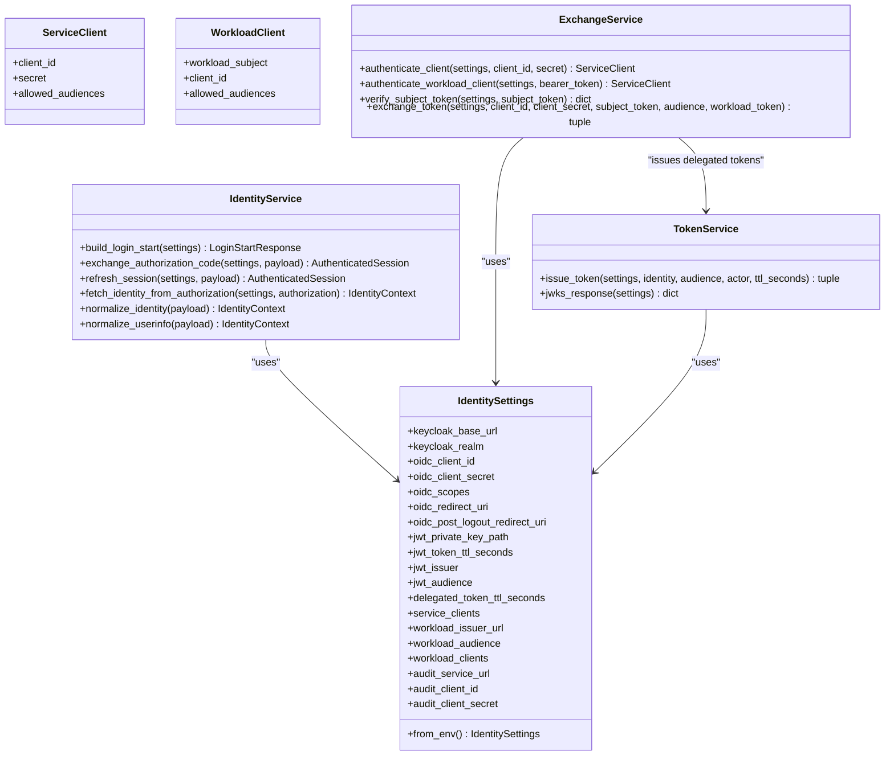
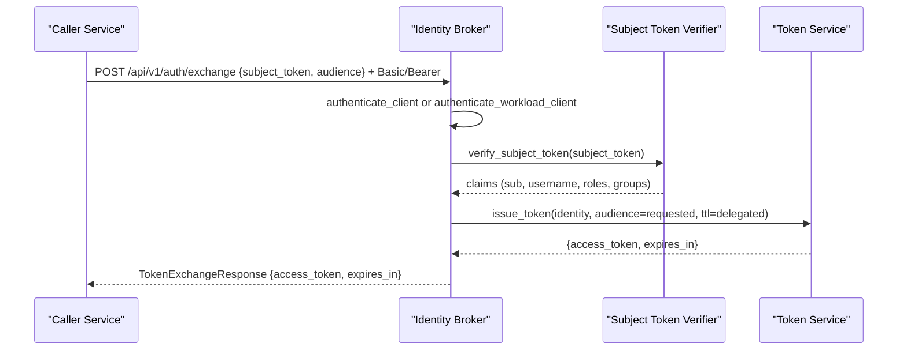
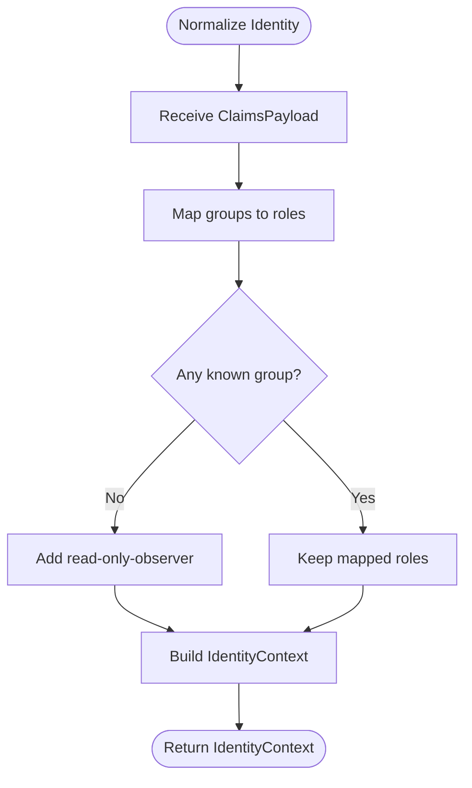
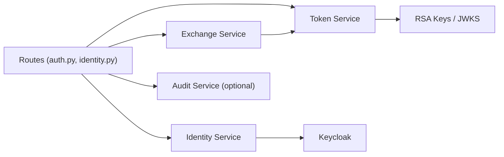

# Identity Broker API

<cite>
**Referenced Files in This Document**
- [README.md](file://products/identity-broker/README.md)
- [auth.py](file://products/identity-broker/src/identity_service/api/routes/auth.py)
- [identity.py](file://products/identity-broker/src/identity_service/api/routes/identity.py)
- [identity_service.py](file://products/identity-broker/src/identity_service/services/identity_service.py)
- [exchange_service.py](file://products/identity-broker/src/identity_service/services/exchange_service.py)
- [token_service.py](file://products/identity-broker/src/identity_service/services/token_service.py)
- [config.py](file://products/identity-broker/src/identity_service/core/config.py)
- [auth.py](file://products/identity-broker/src/identity_service/schemas/auth.py)
- [identity.py](file://products/identity-broker/src/identity_service/schemas/identity.py)
- [identity-token.schema.json](file://shared/shared-contracts/schemas/identity-token.schema.json)
- [identity-context.schema.json](file://shared/shared-contracts/schemas/identity-context.schema.json)
- [test_identity_service.py](file://products/identity-broker/tests/test_identity_service.py)
- [test_exchange_service.py](file://products/identity-broker/tests/test_exchange_service.py)
- [test_token_service.py](file://products/identity-broker/tests/test_token_service.py)
</cite>

## Table of Contents
1. Introduction
2. Project Structure
3. Core Components
4. Architecture Overview
5. Detailed Component Analysis
6. Dependency Analysis
7. Performance Considerations
8. Troubleshooting Guide
9. Conclusion
10. Appendices

## Introduction
The Identity Broker normalizes enterprise identity for the platform and acts as the central trust anchor for authentication, token issuance, and identity propagation across services. It integrates with Keycloak for user SSO, issues RSA-signed platform JWTs, exposes JWKS for verification, supports OIDC login completion and refresh, and provides broker-mediated token delegation for service-to-service calls. It also normalizes identity context (subject, username, email, groups, roles) and can enrich it from bearer tokens or normalized claims payloads.

Key responsibilities:
- OIDC flow completion and session establishment via Keycloak
- Platform JWT issuance and JWKS publication
- Token refresh using Keycloak refresh tokens
- Broker-mediated delegated token exchange (RFC 8693 act claim)
- Identity normalization and enrichment
- Optional audit emission to the audit service

Security highlights:
- RS256-signed platform JWTs with configurable TTL and issuer
- Audience binding to prevent cross-service replay
- Role preservation on delegated tokens (no elevation)
- Workload identity support via projected Kubernetes service-account tokens validated against cluster OIDC issuer JWKS
- Scope-based access control through audience allow-lists per client

Integration points:
- Keycloak for user management and OIDC endpoints
- Platform services (e.g., platform-gateway, tool-gateway) for identity verification and policy enforcement
- Audit service for token-exchange audit events

**Section sources**
- [README.md:3-55](file://products/identity-broker/README.md#L3-L55)

## Project Structure
The Identity Broker is organized as a FastAPI application with clear separation between routes, services, schemas, configuration, and observability.

**Diagram sources**
- [auth.py:34-183](file://products/identity-broker/src/identity_service/api/routes/auth.py#L34-L183)
- [identity.py:17-46](file://products/identity-broker/src/identity_service/api/routes/identity.py#L17-L46)
- [identity_service.py:88-278](file://products/identity-broker/src/identity_service/services/identity_service.py#L88-L278)
- [exchange_service.py:46-195](file://products/identity-broker/src/identity_service/services/exchange_service.py#L46-L195)
- [token_service.py:83-155](file://products/identity-broker/src/identity_service/services/token_service.py#L83-L155)
- [config.py:100-169](file://products/identity-broker/src/identity_service/core/config.py#L100-L169)
- [auth.py:6-63](file://products/identity-broker/src/identity_service/schemas/auth.py#L6-L63)
- [identity.py:4-17](file://products/identity-broker/src/identity_service/schemas/identity.py#L4-L17)

**Section sources**
- [README.md:30-55](file://products/identity-broker/README.md#L30-L55)

## Core Components
- Authentication routes: OIDC login URL generation, callback handling, logout URL generation, platform token issuance, JWKS endpoint, token refresh, and delegated token exchange.
- Identity routes: normalize arbitrary claims into a canonical identity context; resolve current identity from a bearer token by calling Keycloak userinfo.
- Services:
  - Identity service: Keycloak integration (authorization, token, userinfo, logout), PKCE, role resolution, session refresh.
  - Exchange service: authenticates callers via static credentials or workload tokens, verifies subject tokens issued by the broker, enforces audience allow-lists, and mints short-lived delegated tokens with RFC 8693 actor claim.
  - Token service: RSA key lifecycle, JWT signing, JWKS serialization, metrics recording.
- Configuration: environment-driven settings for Keycloak, OIDC client, JWT parameters, delegated token TTL, service/workload registries, and audit integration.
- Schemas: request/response models for auth flows and identity context; shared JSON schemas define the contract for identity tokens and identity context.

**Section sources**
- [auth.py:34-183](file://products/identity-broker/src/identity_service/api/routes/auth.py#L34-L183)
- [identity.py:17-46](file://products/identity-broker/src/identity_service/api/routes/identity.py#L17-L46)
- [identity_service.py:24-278](file://products/identity-broker/src/identity_service/services/identity_service.py#L24-L278)
- [exchange_service.py:1-195](file://products/identity-broker/src/identity_service/services/exchange_service.py#L1-L195)
- [token_service.py:1-155](file://products/identity-broker/src/identity_service/services/token_service.py#L1-L155)
- [config.py:8-169](file://products/identity-broker/src/identity_service/core/config.py#L8-L169)
- [auth.py:6-63](file://products/identity-broker/src/identity_service/schemas/auth.py#L6-L63)
- [identity.py:4-17](file://products/identity-broker/src/identity_service/schemas/identity.py#L4-L17)
- [identity-token.schema.json:1-56](file://shared/shared-contracts/schemas/identity-token.schema.json#L1-L56)
- [identity-context.schema.json:1-37](file://shared/shared-contracts/schemas/identity-context.schema.json#L1-L37)

## Architecture Overview
The Identity Broker sits between clients (portal, services) and Keycloak, issuing platform JWTs and enabling secure delegation.

**Diagram sources**
- [auth.py:34-183](file://products/identity-broker/src/identity_service/api/routes/auth.py#L34-L183)
- [identity_service.py:88-278](file://products/identity-broker/src/identity_service/services/identity_service.py#L88-L278)
- [exchange_service.py:148-195](file://products/identity-broker/src/identity_service/services/exchange_service.py#L148-L195)
- [token_service.py:83-155](file://products/identity-broker/src/identity_service/services/token_service.py#L83-L155)

## Detailed Component Analysis

### Authentication Endpoints
- GET /api/v1/auth/login-url
  - Purpose: Start an OIDC login flow with PKCE.
  - Response: Login start details including authorization URL, state, code verifier, and redirect URI.
  - Behavior: Builds Keycloak authorization URL with PKCE challenge and state.
- GET /api/v1/auth/login
  - Purpose: Alternative entrypoint returning login start response.
- POST /api/v1/auth/callback
  - Purpose: Complete OIDC authorization code exchange.
  - Request: Authorization code, code verifier, optional redirect URI.
  - Response: AuthenticatedSession containing a platform JWT as access_token, expires_in, optional refresh_token and id_token, plus normalized identity.
  - Behavior: Exchanges code at Keycloak token endpoint, fetches userinfo, normalizes identity, issues platform JWT.
- POST /api/v1/auth/logout-url
  - Purpose: Build Keycloak logout URL.
  - Request: Optional id_token_hint and post_logout_redirect_uri.
  - Response: Logout URL.
- POST /api/v1/auth/token
  - Purpose: Issue a platform JWT directly from provided identity claims (useful for server-side flows).
  - Request: username, email, roles, groups.
  - Response: TokenResponse with access_token and expires_in.
- GET /.well-known/jwks.json
  - Purpose: Publish public keys in RFC 7517 format for verifying platform JWTs.
- POST /api/v1/auth/refresh
  - Purpose: Refresh a Keycloak refresh_token to obtain a new platform JWT session.
  - Request: refresh_token.
  - Response: AuthenticatedSession with updated platform JWT and identity.
- POST /api/v1/auth/exchange
  - Purpose: Exchange a verified subject token for a short-lived delegated token (service-to-service).
  - Request: subject_token, audience.
  - Authentication: HTTP Basic (client_id:secret) or Bearer workload token (projected service-account token).
  - Response: TokenExchangeResponse with delegated access_token and expires_in.
  - Behavior: Authenticates caller, verifies subject token against broker’s own signing key, enforces audience allow-list, copies roles without elevation, sets RFC 8693 act claim, issues short-lived token.

Request/Response Schemas
- LoginStartResponse: authorization_url, state, code_verifier, redirect_uri.
- AuthorizationCodeExchangeRequest: code, code_verifier, redirect_uri (optional).
- AuthenticatedSession: access_token, token_type, expires_in (optional), refresh_token (optional), id_token (optional), identity (IdentityContext).
- LogoutRequest: id_token_hint (optional), post_logout_redirect_uri (optional).
- LogoutResponse: logout_url.
- TokenRequest: username, email (optional), roles (optional), groups (optional).
- TokenResponse: access_token, token_type, expires_in.
- TokenRefreshRequest: refresh_token.
- TokenExchangeRequest: subject_token, audience.
- TokenExchangeResponse: access_token, token_type, expires_in.

Identity Context
- IdentityContext: subject, username, email (optional), groups, roles.
- ClaimsPayload: sub, preferred_username, email (optional), groups.

Token Contract
- Identity Token Claims schema defines required and optional JWT claims, including iss, sub, username, aud, iat, exp, roles, groups, and optional act for delegated tokens.

Examples
- User authentication flow:
  - Call GET /api/v1/auth/login-url to obtain PKCE parameters.
  - Redirect browser to authorization_url.
  - On callback, POST /api/v1/auth/callback with code and code_verifier to receive a platform JWT and identity.
- Service-to-service token exchange:
  - Caller authenticates with Basic or Bearer workload token.
  - POST /api/v1/auth/exchange with subject_token and audience to receive a delegated token bound to the requested audience.
- Identity context enrichment:
  - POST /api/v1/identity/normalize with ClaimsPayload to get normalized IdentityContext.
  - GET /api/v1/identity/me with Authorization: Bearer <token> to resolve current identity from Keycloak userinfo.

Security considerations
- Tokens are signed with RS256 and include kid header; verifiers use /.well-known/jwks.json.
- Default audience binds portal tokens to platform-gateway; delegated tokens carry requested audience.
- Roles are copied verbatim during exchange; no elevation occurs.
- Workload identity path validates projected service-account tokens against cluster OIDC issuer JWKS and maps subjects to registered clients.

**Section sources**
- [auth.py:34-183](file://products/identity-broker/src/identity_service/api/routes/auth.py#L34-L183)
- [identity.py:17-46](file://products/identity-broker/src/identity_service/api/routes/identity.py#L17-L46)
- [identity_service.py:88-278](file://products/identity-broker/src/identity_service/services/identity_service.py#L88-L278)
- [exchange_service.py:46-195](file://products/identity-broker/src/identity_service/services/exchange_service.py#L46-L195)
- [token_service.py:83-155](file://products/identity-broker/src/identity_service/services/token_service.py#L83-L155)
- [auth.py:6-63](file://products/identity-broker/src/identity_service/schemas/auth.py#L6-L63)
- [identity.py:4-17](file://products/identity-broker/src/identity_service/schemas/identity.py#L4-L17)
- [identity-token.schema.json:1-56](file://shared/shared-contracts/schemas/identity-token.schema.json#L1-L56)
- [identity-context.schema.json:1-37](file://shared/shared-contracts/schemas/identity-context.schema.json#L1-L37)

### Class and Flow Diagrams

#### Object-Oriented Components

**Diagram sources**
- [config.py:8-169](file://products/identity-broker/src/identity_service/core/config.py#L8-L169)
- [identity_service.py:88-278](file://products/identity-broker/src/identity_service/services/identity_service.py#L88-L278)
- [exchange_service.py:46-195](file://products/identity-broker/src/identity_service/services/exchange_service.py#L46-L195)
- [token_service.py:83-155](file://products/identity-broker/src/identity_service/services/token_service.py#L83-L155)

#### Token Exchange Sequence

**Diagram sources**
- [auth.py:114-183](file://products/identity-broker/src/identity_service/api/routes/auth.py#L114-L183)
- [exchange_service.py:148-195](file://products/identity-broker/src/identity_service/services/exchange_service.py#L148-L195)
- [token_service.py:83-127](file://products/identity-broker/src/identity_service/services/token_service.py#L83-L127)

#### Normalization Flow

**Diagram sources**
- [identity_service.py:24-39](file://products/identity-broker/src/identity_service/services/identity_service.py#L24-L39)
- [identity_service.py:114-122](file://products/identity-broker/src/identity_service/services/identity_service.py#L114-L122)

**Section sources**
- [identity_service.py:24-39](file://products/identity-broker/src/identity_service/services/identity_service.py#L24-L39)
- [identity_service.py:114-122](file://products/identity-broker/src/identity_service/services/identity_service.py#L114-L122)

## Dependency Analysis
The Identity Broker depends on:
- Keycloak for OIDC endpoints (authorization, token, userinfo, logout)
- JWT library for signing and decoding
- Cryptography library for RSA key operations
- httpx for async HTTP calls
- Optional audit service for emitting token-exchange events

**Diagram sources**
- [auth.py:34-183](file://products/identity-broker/src/identity_service/api/routes/auth.py#L34-L183)
- [identity.py:17-46](file://products/identity-broker/src/identity_service/api/routes/identity.py#L17-L46)
- [identity_service.py:88-278](file://products/identity-broker/src/identity_service/services/identity_service.py#L88-L278)
- [exchange_service.py:46-195](file://products/identity-broker/src/identity_service/services/exchange_service.py#L46-L195)
- [token_service.py:83-155](file://products/identity-broker/src/identity_service/services/token_service.py#L83-L155)

**Section sources**
- [README.md:57-98](file://products/identity-broker/README.md#L57-L98)

## Performance Considerations
- JWKS client caching: Workload OIDC discovery and JWKS clients are cached per issuer URL to avoid repeated network calls.
- Short-lived delegated tokens: Delegated tokens have a shorter TTL than user tokens to limit exposure.
- Async I/O: Keycloak interactions use async HTTP clients to reduce latency.
- Metrics: Token issuance and exchange outcomes are recorded for monitoring.

[No sources needed since this section provides general guidance]

## Troubleshooting Guide
Common errors and causes:
- Missing or invalid Authorization header on /api/v1/identity/me returns 401.
- Invalid or expired subject token on /api/v1/auth/exchange returns 401.
- Disallowed audience on /api/v1/auth/exchange returns 400.
- OIDC token exchange failures return 502 when Keycloak responds with HTTP errors.
- Workload identity disabled returns 401 if workload issuer URL is not configured.

Operational checks:
- Verify /.well-known/jwks.json contains a valid RSA key with matching kid.
- Ensure service clients registry includes correct client_id, secret, and allowed audiences.
- Confirm workload clients mapping matches projected service-account subjects.
- Check audit emission configuration; unreachability degrades to log-only auditing.

**Section sources**
- [identity.py:24-46](file://products/identity-broker/src/identity_service/api/routes/identity.py#L24-L46)
- [auth.py:69-71](file://products/identity-broker/src/identity_service/api/routes/auth.py#L69-L71)
- [auth.py:140-162](file://products/identity-broker/src/identity_service/api/routes/auth.py#L140-L162)
- [exchange_service.py:94-121](file://products/identity-broker/src/identity_service/services/exchange_service.py#L94-L121)
- [exchange_service.py:123-145](file://products/identity-broker/src/identity_service/services/exchange_service.py#L123-L145)
- [README.md:57-98](file://products/identity-broker/README.md#L57-L98)

## Conclusion
The Identity Broker provides a robust foundation for platform-wide identity management. It standardizes user authentication via Keycloak, issues verifiable platform JWTs, and enables secure service-to-service delegation with strict audience controls and role preservation. Its design supports both static credentials and modern workload identities, while exposing clear contracts for identity tokens and contexts consumed by platform services.

[No sources needed since this section summarizes without analyzing specific files]

## Appendices

### API Reference Summary

- GET /api/v1/auth/login-url
  - Returns: Login start response with authorization URL and PKCE parameters.
- GET /api/v1/auth/login
  - Returns: Login start response.
- POST /api/v1/auth/callback
  - Request: Authorization code exchange request.
  - Returns: Authenticated session with platform JWT and identity.
- POST /api/v1/auth/logout-url
  - Request: Logout request with optional hints.
  - Returns: Logout URL.
- POST /api/v1/auth/token
  - Request: Token request with identity claims.
  - Returns: Platform JWT.
- GET /.well-known/jwks.json
  - Returns: JWKS document.
- POST /api/v1/auth/refresh
  - Request: Refresh token.
  - Returns: New platform JWT session.
- POST /api/v1/auth/exchange
  - Request: Subject token and audience; authenticated via Basic or Bearer workload token.
  - Returns: Delegated token with act claim.
- POST /api/v1/identity/normalize
  - Request: Claims payload.
  - Returns: Normalized identity context.
- GET /api/v1/identity/me
  - Header: Authorization: Bearer <token>.
  - Returns: Current identity context resolved from Keycloak userinfo.

**Section sources**
- [auth.py:34-183](file://products/identity-broker/src/identity_service/api/routes/auth.py#L34-L183)
- [identity.py:17-46](file://products/identity-broker/src/identity_service/api/routes/identity.py#L17-L46)
- [auth.py:6-63](file://products/identity-broker/src/identity_service/schemas/auth.py#L6-L63)
- [identity.py:4-17](file://products/identity-broker/src/identity_service/schemas/identity.py#L4-L17)
- [identity-token.schema.json:1-56](file://shared/shared-contracts/schemas/identity-token.schema.json#L1-L56)
- [identity-context.schema.json:1-37](file://shared/shared-contracts/schemas/identity-context.schema.json#L1-L37)

### Security Notes
- Token signing: RS256 with kid header; consumers must validate signatures using JWKS.
- Expiration handling: Tokens include iat/exp; expired tokens are rejected.
- Audience binding: Portal tokens default to platform-gateway; delegated tokens target requested audience; verifiers must check audience.
- Scope-based access control: Audiences are enforced per client allow-list; roles are preserved without elevation.
- Workload identity: Validated against cluster OIDC issuer JWKS; subjects must be registered.

**Section sources**
- [token_service.py:83-155](file://products/identity-broker/src/identity_service/services/token_service.py#L83-L155)
- [exchange_service.py:148-195](file://products/identity-broker/src/identity_service/services/exchange_service.py#L148-L195)
- [identity-token.schema.json:1-56](file://shared/shared-contracts/schemas/identity-token.schema.json#L1-L56)

### Integration Patterns
- Keycloak:
  - Use OIDC client settings to compose login URLs and exchange codes.
  - Fetch userinfo to normalize identity and map groups to roles.
- Platform services:
  - Validate incoming platform JWTs using JWKS and enforce audience.
  - For service-to-service calls, require delegated tokens with appropriate audience and inspect act for attribution.

**Section sources**
- [identity_service.py:88-278](file://products/identity-broker/src/identity_service/services/identity_service.py#L88-L278)
- [exchange_service.py:46-195](file://products/identity-broker/src/identity_service/services/exchange_service.py#L46-L195)
- [README.md:100-109](file://products/identity-broker/README.md#L100-L109)

### Test Coverage Highlights
- Role resolution and normalization behavior are tested.
- Login start and logout URL composition are validated.
- Token issuance produces valid JWTs with expected claims and TTL.
- JWKS format and kid consistency are verified.
- Exchange endpoint accepts Basic and Bearer workload tokens, rejects invalid/expired tokens, and enforces audience allow-lists.

**Section sources**
- [test_identity_service.py:54-292](file://products/identity-broker/tests/test_identity_service.py#L54-L292)
- [test_token_service.py:30-161](file://products/identity-broker/tests/test_token_service.py#L30-L161)
- [test_exchange_service.py:58-460](file://products/identity-broker/tests/test_exchange_service.py#L58-L460)