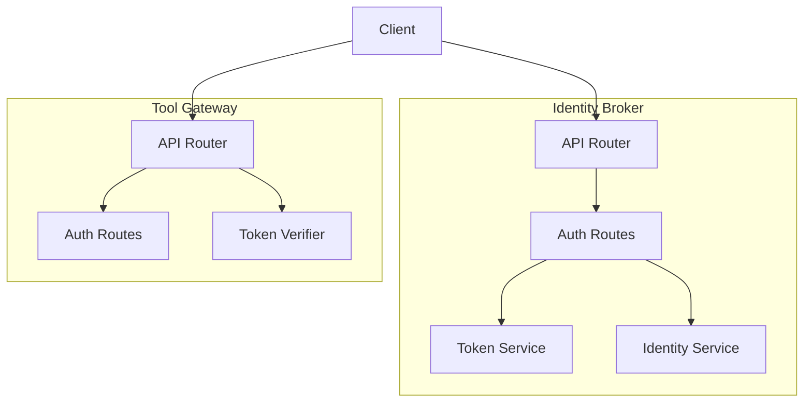
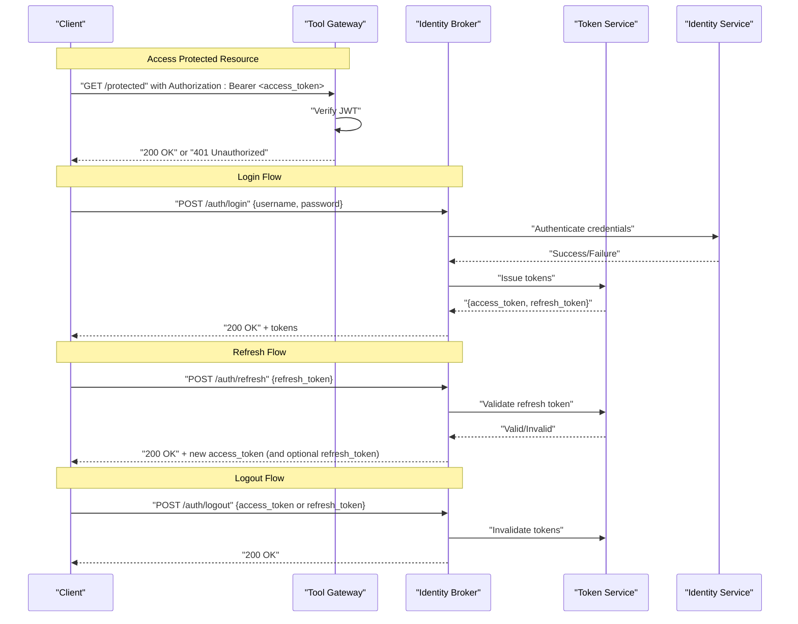
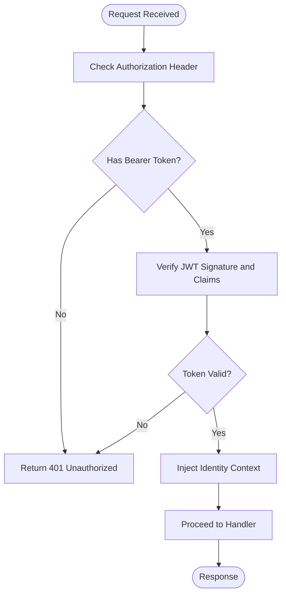
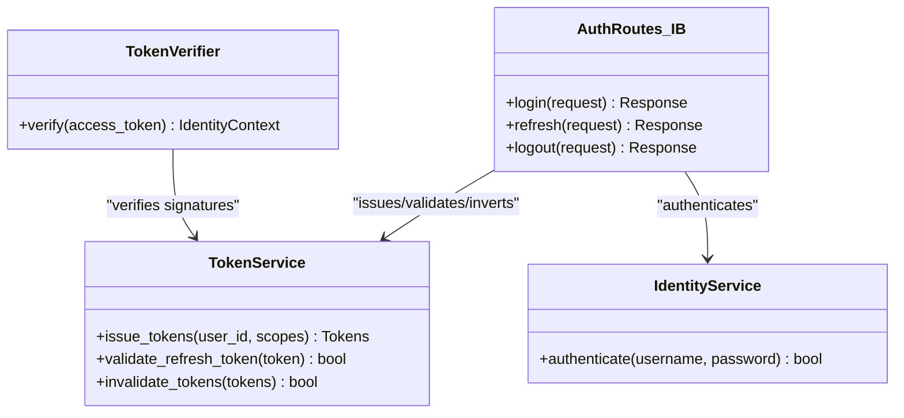

# Authentication Endpoints

<cite>
**Referenced Files in This Document**
- [auth.py](file://products/identity-broker/src/identity_service/api/routes/auth.py)
- [auth.py](file://products/tool-gateway/src/api_gateway/api/routes/auth.py)
- [token_service.py](file://products/identity-broker/src/identity_service/services/token_service.py)
- [identity_service.py](file://products/identity-broker/src/identity_service/services/identity_service.py)
- [token_verifier.py](file://products/tool-gateway/src/api_gateway/services/token_verifier.py)
- [router.py](file://products/identity-broker/src/identity_service/api/router.py)
- [router.py](file://products/tool-gateway/src/api_gateway/api/router.py)
- [config.py](file://products/identity-broker/src/identity_service/core/config.py)
- [api.py](file://products/shared-contracts/schemas/identity-token.schema.json)
</cite>

## Table of Contents
1. [Introduction](#introduction)
2. [Project Structure](#project-structure)
3. [Core Components](#core-components)
4. [Architecture Overview](#architecture-overview)
5. [Detailed Component Analysis](#detailed-component-analysis)
6. [Dependency Analysis](#dependency-analysis)
7. [Performance Considerations](#performance-considerations)
8. [Troubleshooting Guide](#troubleshooting-guide)
9. [Conclusion](#conclusion)

## Introduction
This document provides comprehensive API documentation for authentication endpoints across the platform’s Identity Broker and Tool Gateway services. It covers:
- Login with username/password
- Token refresh using a refresh token
- Logout to invalidate tokens
- HTTP methods, request/response schemas, JWT structure, error responses
- Authentication flow steps, token validation process, and security headers
- Example client requests and common error scenarios

The implementation uses JSON Web Tokens (JWT) for access and refresh tokens, with verification enforced at the gateway layer and issuance handled by the identity service.

## Project Structure
Authentication is implemented in two primary components:
- Identity Broker: issues tokens and validates credentials
- Tool Gateway: verifies tokens and enforces policy on protected routes

**Diagram sources**
- [router.py](file://products/identity-broker/src/identity_service/api/router.py)
- [auth.py](file://products/identity-broker/src/identity_service/api/routes/auth.py)
- [token_service.py](file://products/identity-broker/src/identity_service/services/token_service.py)
- [identity_service.py](file://products/identity-broker/src/identity_service/services/identity_service.py)
- [router.py](file://products/tool-gateway/src/api_gateway/api/router.py)
- [auth.py](file://products/tool-gateway/src/api_gateway/api/routes/auth.py)
- [token_verifier.py](file://products/tool-gateway/src/api_gateway/services/token_verifier.py)

**Section sources**
- [router.py](file://products/identity-broker/src/identity_service/api/router.py)
- [router.py](file://products/tool-gateway/src/api_gateway/api/router.py)

## Core Components
- Identity Broker Auth Routes: expose login, refresh, and logout endpoints
- Token Service: issues and validates JWTs (access and refresh)
- Identity Service: authenticates username/password against configured stores
- Tool Gateway Auth Routes: optional public endpoints for convenience
- Token Verifier: validates incoming JWTs and injects identity context

Key responsibilities:
- Validate inputs and enforce constraints
- Issue short-lived access tokens and longer-lived refresh tokens
- Verify tokens on each request via middleware or route handlers
- Invalidate tokens on logout

**Section sources**
- [auth.py](file://products/identity-broker/src/identity_service/api/routes/auth.py)
- [token_service.py](file://products/identity-broker/src/identity_service/services/token_service.py)
- [identity_service.py](file://products/identity-broker/src/identity_service/services/identity_service.py)
- [auth.py](file://products/tool-gateway/src/api_gateway/api/routes/auth.py)
- [token_verifier.py](file://products/tool-gateway/src/api_gateway/services/token_verifier.py)

## Architecture Overview
The authentication flow involves three main phases: login, refresh, and logout. The Tool Gateway validates tokens presented by clients before allowing access to protected resources.

**Diagram sources**
- [auth.py](file://products/identity-broker/src/identity_service/api/routes/auth.py)
- [token_service.py](file://products/identity-broker/src/identity_service/services/token_service.py)
- [identity_service.py](file://products/identity-broker/src/identity_service/services/identity_service.py)
- [token_verifier.py](file://products/tool-gateway/src/api_gateway/services/token_verifier.py)

## Detailed Component Analysis

### Login Endpoint
- Method and path: POST /auth/login
- Purpose: Authenticate a user with username and password and return access and refresh tokens
- Request body fields:
  - username: string, required
  - password: string, required
- Response body fields:
  - access_token: string (JWT), required
  - refresh_token: string (JWT), required
  - token_type: string, typically "Bearer"
  - expires_in: integer, seconds until access token expiry
- Success status codes: 200 OK
- Error responses:
  - 401 Unauthorized: invalid credentials
  - 422 Unprocessable Entity: missing or invalid fields
- Security headers:
  - Content-Type: application/json
  - Authorization: not required for login
- Example client request:
  - POST /auth/login
  - Body: {"username": "user@example.com", "password": "secret"}
- Example successful response:
  - 200 OK
  - Body: {"access_token": "...", "refresh_token": "...", "token_type": "Bearer", "expires_in": 3600}
- Common errors:
  - Invalid credentials: 401 Unauthorized with error message
  - Malformed request: 422 Unprocessable Entity with field-level errors

**Section sources**
- [auth.py](file://products/identity-broker/src/identity_service/api/routes/auth.py)
- [identity_service.py](file://products/identity-broker/src/identity_service/services/identity_service.py)
- [token_service.py](file://products/identity-broker/src/identity_service/services/token_service.py)

### Token Refresh Endpoint
- Method and path: POST /auth/refresh
- Purpose: Exchange a valid refresh token for a new access token (and optionally a new refresh token)
- Request body fields:
  - refresh_token: string (JWT), required
- Response body fields:
  - access_token: string (JWT), required
  - refresh_token: string (JWT), optional depending on rotation policy
  - token_type: string, typically "Bearer"
  - expires_in: integer, seconds until new access token expiry
- Success status codes: 200 OK
- Error responses:
  - 401 Unauthorized: invalid or expired refresh token
  - 422 Unprocessable Entity: missing or invalid fields
- Security headers:
  - Content-Type: application/json
  - Authorization: not required for refresh
- Example client request:
  - POST /auth/refresh
  - Body: {"refresh_token": "..."}
- Example successful response:
  - 200 OK
  - Body: {"access_token": "...", "token_type": "Bearer", "expires_in": 3600}
- Common errors:
  - Expired refresh token: 401 Unauthorized
  - Tampered token: 401 Unauthorized

**Section sources**
- [auth.py](file://products/identity-broker/src/identity_service/api/routes/auth.py)
- [token_service.py](file://products/identity-broker/src/identity_service/services/token_service.py)

### Logout Endpoint
- Method and path: POST /auth/logout
- Purpose: Invalidate tokens to terminate sessions
- Request body fields:
  - access_token: string (JWT), optional if refresh_token provided
  - refresh_token: string (JWT), optional if access_token provided
- Response body fields:
  - message: string indicating successful logout
- Success status codes: 200 OK
- Error responses:
  - 422 Unprocessable Entity: missing both tokens
  - 401 Unauthorized: invalid tokens when present
- Security headers:
  - Content-Type: application/json
  - Authorization: not required for logout
- Example client request:
  - POST /auth/logout
  - Body: {"refresh_token": "..."}
- Example successful response:
  - 200 OK
  - Body: {"message": "Logged out successfully"}
- Common errors:
  - Missing tokens: 422 Unprocessable Entity
  - Invalid tokens: 401 Unauthorized

**Section sources**
- [auth.py](file://products/identity-broker/src/identity_service/api/routes/auth.py)
- [token_service.py](file://products/identity-broker/src/identity_service/services/token_service.py)

### Token Validation Process (Gateway)
- The Tool Gateway validates JWTs on protected routes using a verifier component
- Clients must include Authorization: Bearer <access_token> header
- On success, identity context is injected into the request; on failure, 401 Unauthorized is returned
- Verification includes signature validation, expiration checks, and optional claims validation

**Diagram sources**
- [token_verifier.py](file://products/tool-gateway/src/api_gateway/services/token_verifier.py)

**Section sources**
- [token_verifier.py](file://products/tool-gateway/src/api_gateway/services/token_verifier.py)

### JWT Token Structure
- Access Token:
  - Type: JWT
  - Purpose: Short-lived authorization for API calls
  - Typical claims: sub (subject/user id), exp (expiration), iat (issued at), scope/roles (optional)
- Refresh Token:
  - Type: JWT
  - Purpose: Long-lived credential to obtain new access tokens
  - Typical claims: sub, exp, iat, jti (unique identifier)
- Token type:
  - Typically "Bearer"
- Expiration:
  - Access tokens expire quickly (e.g., minutes)
  - Refresh tokens have longer lifetimes (e.g., hours/days)

**Section sources**
- [token_service.py](file://products/identity-broker/src/identity_service/services/token_service.py)
- [api.py](file://products/shared-contracts/schemas/identity-token.schema.json)

### Configuration and Security Headers
- Required headers for authenticated requests:
  - Authorization: Bearer <access_token>
  - Content-Type: application/json
- Optional security headers:
  - X-Request-Id: correlation ID
  - Cache-Control: no-store for sensitive responses
- Configuration keys relevant to authentication:
  - JWT signing algorithm and secret/key source
  - Token expiration settings
  - Refresh token rotation policy

**Section sources**
- [config.py](file://products/identity-broker/src/identity_service/core/config.py)

## Dependency Analysis
Authentication endpoints depend on internal services for credential validation and token management. The gateway depends on a token verifier to protect downstream routes.

**Diagram sources**
- [auth.py](file://products/identity-broker/src/identity_service/api/routes/auth.py)
- [token_service.py](file://products/identity-broker/src/identity_service/services/token_service.py)
- [identity_service.py](file://products/identity-broker/src/identity_service/services/identity_service.py)
- [token_verifier.py](file://products/tool-gateway/src/api_gateway/services/token_verifier.py)

**Section sources**
- [auth.py](file://products/identity-broker/src/identity_service/api/routes/auth.py)
- [token_service.py](file://products/identity-broker/src/identity_service/services/token_service.py)
- [identity_service.py](file://products/identity-broker/src/identity_service/services/identity_service.py)
- [token_verifier.py](file://products/tool-gateway/src/api_gateway/services/token_verifier.py)

## Performance Considerations
- Keep access tokens short-lived to minimize exposure window
- Use refresh token rotation to limit reuse risk
- Cache token verification results where appropriate (stateless verification preferred)
- Avoid synchronous credential lookups on hot paths; consider caching identities securely
- Monitor token issuance and verification metrics for anomalies

[No sources needed since this section provides general guidance]

## Troubleshooting Guide
Common issues and resolutions:
- Invalid credentials on login:
  - Ensure username/password are correct and properly encoded
  - Check identity store connectivity and configuration
- Expired access token:
  - Use refresh endpoint to obtain a new access token
  - Implement automatic retry with refreshed token
- Invalid or tampered refresh token:
  - Re-authenticate via login to obtain fresh tokens
- Missing Authorization header:
  - Include Authorization: Bearer <access_token> on protected requests
- 422 Unprocessable Entity:
  - Validate request payloads against schema requirements

**Section sources**
- [auth.py](file://products/identity-broker/src/identity_service/api/routes/auth.py)
- [token_verifier.py](file://products/tool-gateway/src/api_gateway/services/token_verifier.py)

## Conclusion
The authentication system provides secure, stateless token-based access control through JWTs issued by the Identity Broker and verified by the Tool Gateway. Clients authenticate via username/password, manage token lifecycles with refresh, and can terminate sessions via logout. Proper use of headers, token handling, and error management ensures robust and secure interactions.

[No sources needed since this section summarizes without analyzing specific files]