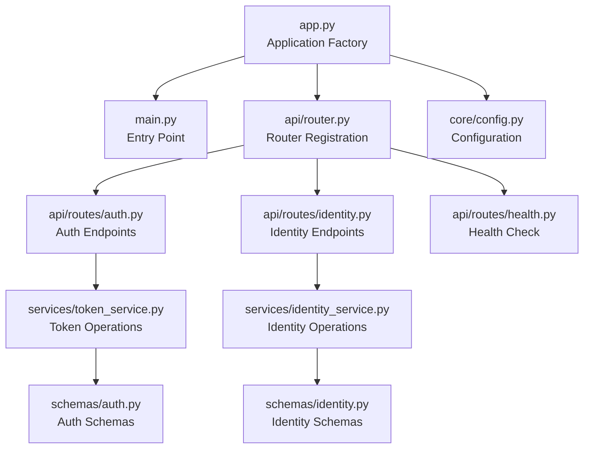
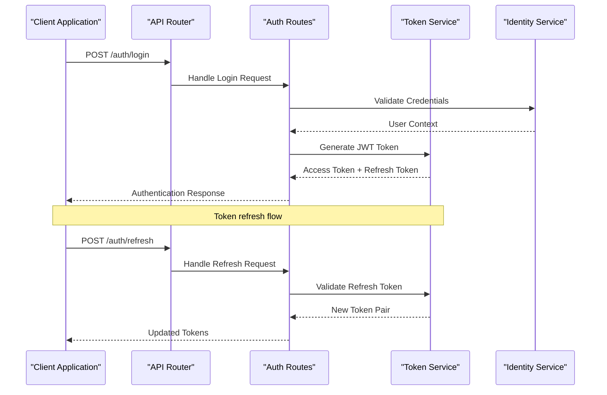
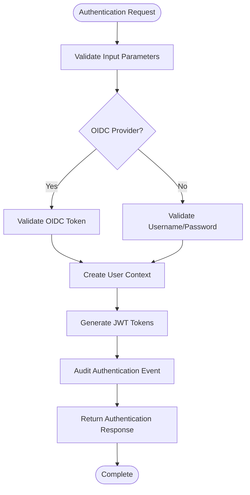
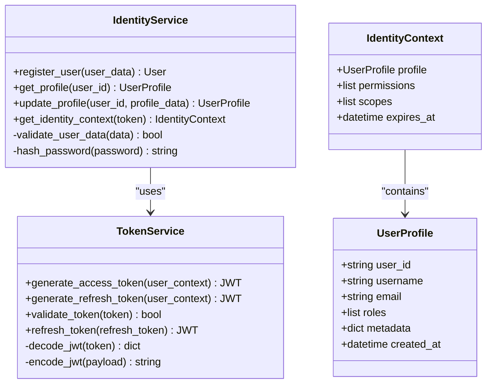
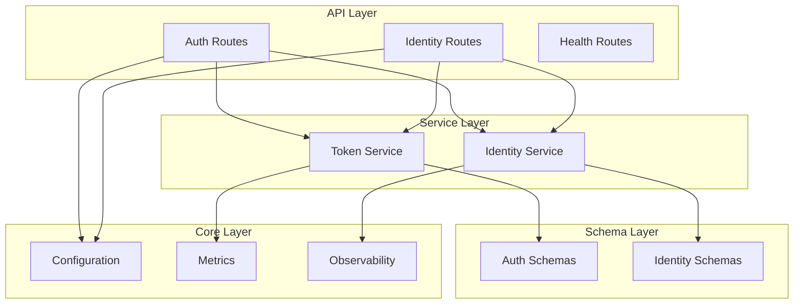

# Identity Broker API

<cite>
**Referenced Files in This Document**
- [identity_service/app.py](file://products/identity-broker/src/identity_service/app.py)
- [identity_service/main.py](file://products/identity-broker/src/identity_service/main.py)
- [identity_service/api/router.py](file://products/identity-broker/src/identity_service/api/router.py)
- [identity_service/api/routes/auth.py](file://products/identity-broker/src/identity_service/api/routes/auth.py)
- [identity_service/api/routes/identity.py](file://products/identity-broker/src/identity_service/api/routes/identity.py)
- [identity_service/api/routes/health.py](file://products/identity-broker/src/identity_service/api/routes/health.py)
- [identity_service/schemas/auth.py](file://products/identity-broker/src/identity_service/schemas/auth.py)
- [identity_service/schemas/identity.py](file://products/identity-broker/src/identity_service/schemas/identity.py)
- [identity_service/services/token_service.py](file://products/identity-broker/src/identity_service/services/token_service.py)
- [identity_service/services/identity_service.py](file://products/identity-broker/src/identity_service/services/identity_service.py)
- [identity_service/core/config.py](file://products/identity-broker/src/identity_service/core/config.py)
- [shared-contracts/schemas/identity-token.schema.json](file://shared-contracts/schemas/identity-token.schema.json)
- [shared-contracts/schemas/identity-context.schema.json](file://shared-contracts/schemas/identity-context.schema.json)
</cite>

## Table of Contents
1. [Introduction](#introduction)
2. [Project Structure](#project-structure)
3. [Core Components](#core-components)
4. [Architecture Overview](#architecture-overview)
5. [Detailed Component Analysis](#detailed-component-analysis)
6. [Dependency Analysis](#dependency-analysis)
7. [Performance Considerations](#performance-considerations)
8. [Troubleshooting Guide](#troubleshooting-guide)
9. [Conclusion](#conclusion)
10. [Appendices](#appendices)

## Introduction
This document provides detailed API documentation for the Identity Broker service, focusing on authentication flows including OIDC integration, JWT token generation and validation, user registration, and profile management. It covers HTTP methods, URL patterns, request/response schemas, OAuth2/OIDC flows, security headers, token refresh mechanisms, scope-based authorization, and audit logging. It also includes examples of client authentication, token acquisition, and user context retrieval, along with security best practices and common authentication patterns.

## Project Structure
The Identity Broker service is implemented as a Python application using a modular structure:
- Entry points define the application lifecycle and configuration loading
- API routes expose endpoints for authentication, identity operations, and health checks
- Schemas define request/response models for validation
- Services encapsulate business logic for token handling and identity operations
- Core modules provide configuration, metrics, observability, and runtime utilities



**Diagram sources**
- [identity_service/app.py](file://products/identity-broker/src/identity_service/app.py)
- [identity_service/main.py](file://products/identity-broker/src/identity_service/main.py)
- [identity_service/api/router.py](file://products/identity-broker/src/identity_service/api/router.py)
- [identity_service/api/routes/auth.py](file://products/identity-broker/src/identity_service/api/routes/auth.py)
- [identity_service/api/routes/identity.py](file://products/identity-broker/src/identity_service/api/routes/identity.py)
- [identity_service/api/routes/health.py](file://products/identity-broker/src/identity_service/api/routes/health.py)
- [identity_service/services/token_service.py](file://products/identity-broker/src/identity_service/services/token_service.py)
- [identity_service/services/identity_service.py](file://products/identity-broker/src/identity_service/services/identity_service.py)
- [identity_service/schemas/auth.py](file://products/identity-broker/src/identity_service/schemas/auth.py)
- [identity_service/schemas/identity.py](file://products/identity-broker/src/identity_service/schemas/identity.py)
- [identity_service/core/config.py](file://products/identity-broker/src/identity_service/core/config.py)

**Section sources**
- [identity_service/app.py](file://products/identity-broker/src/identity_service/app.py)
- [identity_service/main.py](file://products/identity-broker/src/identity_service/main.py)
- [identity_service/api/router.py](file://products/identity-broker/src/identity_service/api/router.py)

## Core Components
The Identity Broker service consists of several key components that work together to provide authentication and identity management capabilities:

### Authentication Service
Handles OIDC integration, JWT token generation and validation, and OAuth2/OIDC flows. Provides endpoints for client authentication, token acquisition, and refresh mechanisms.

### Identity Service  
Manages user registration, profile management, and identity context operations. Handles user data validation and maintains identity state.

### Token Service
Implements JWT token lifecycle management including creation, validation, refresh, and revocation. Manages token scopes and claims.

### Schema Definitions
Defines request/response models for all API endpoints ensuring data validation and consistency across the service.

**Section sources**
- [identity_service/services/token_service.py](file://products/identity-broker/src/identity_service/services/token_service.py)
- [identity_service/services/identity_service.py](file://products/identity-broker/src/identity_service/services/identity_service.py)
- [identity_service/schemas/auth.py](file://products/identity-broker/src/identity_service/schemas/auth.py)
- [identity_service/schemas/identity.py](file://products/identity-broker/src/identity_service/schemas/identity.py)

## Architecture Overview
The Identity Broker follows a layered architecture pattern with clear separation of concerns between API routes, business logic services, and data validation schemas.



**Diagram sources**
- [identity_service/api/router.py](file://products/identity-broker/src/identity_service/api/router.py)
- [identity_service/api/routes/auth.py](file://products/identity-broker/src/identity_service/api/routes/auth.py)
- [identity_service/services/token_service.py](file://products/identity-broker/src/identity_service/services/token_service.py)
- [identity_service/services/identity_service.py](file://products/identity-broker/src/identity_service/services/identity_service.py)

## Detailed Component Analysis

### Authentication Endpoints
The authentication module provides comprehensive OIDC integration and JWT token management capabilities.

#### Login Endpoint
- **Method**: POST
- **URL Pattern**: `/auth/login`
- **Purpose**: Authenticate users and issue JWT tokens
- **Request Schema**: User credentials (username/password or OIDC provider tokens)
- **Response Schema**: JWT access token, refresh token, token metadata

#### Token Refresh Endpoint
- **Method**: POST  
- **URL Pattern**: `/auth/refresh`
- **Purpose**: Refresh expired access tokens using valid refresh tokens
- **Request Schema**: Valid refresh token
- **Response Schema**: New JWT access token pair

#### OIDC Discovery Endpoint
- **Method**: GET
- **URL Pattern**: `/.well-known/openid-configuration`
- **Purpose**: Provide OIDC provider configuration metadata
- **Response Schema**: OpenID Connect discovery document



**Diagram sources**
- [identity_service/api/routes/auth.py](file://products/identity-broker/src/identity_service/api/routes/auth.py)
- [identity_service/services/token_service.py](file://products/identity-broker/src/identity_service/services/token_service.py)

**Section sources**
- [identity_service/api/routes/auth.py](file://products/identity-broker/src/identity_service/api/routes/auth.py)
- [identity_service/schemas/auth.py](file://products/identity-broker/src/identity_service/schemas/auth.py)

### Identity Management Endpoints
The identity module handles user registration, profile management, and identity context operations.

#### User Registration
- **Method**: POST
- **URL Pattern**: `/identity/register`
- **Purpose**: Register new user accounts
- **Request Schema**: User registration data with required fields
- **Response Schema**: Created user profile with unique identifier

#### Profile Management
- **Method**: GET/PUT
- **URL Pattern**: `/identity/profile/{user_id}`
- **Purpose**: Retrieve and update user profile information
- **Request Schema**: Profile update data (for PUT operations)
- **Response Schema**: Updated user profile information

#### Identity Context
- **Method**: GET
- **URL Pattern**: `/identity/context`
- **Purpose**: Retrieve current authenticated user's identity context
- **Request Schema**: Requires valid JWT token in Authorization header
- **Response Schema**: Complete user identity context with permissions



**Diagram sources**
- [identity_service/services/identity_service.py](file://products/identity-broker/src/identity_service/services/identity_service.py)
- [identity_service/services/token_service.py](file://products/identity-broker/src/identity_service/services/token_service.py)
- [identity_service/schemas/identity.py](file://products/identity-broker/src/identity_service/schemas/identity.py)

**Section sources**
- [identity_service/api/routes/identity.py](file://products/identity-broker/src/identity_service/api/routes/identity.py)
- [identity_service/schemas/identity.py](file://products/identity-broker/src/identity_service/schemas/identity.py)

### Health Check Endpoint
Provides service health monitoring and status information.

- **Method**: GET
- **URL Pattern**: `/health`
- **Purpose**: Service health check and readiness probe
- **Response Schema**: Health status with service metadata

**Section sources**
- [identity_service/api/routes/health.py](file://products/identity-broker/src/identity_service/api/routes/health.py)

## Dependency Analysis
The Identity Broker service has well-defined dependencies between components with clear separation of concerns.



**Diagram sources**
- [identity_service/api/router.py](file://products/identity-broker/src/identity_service/api/router.py)
- [identity_service/services/token_service.py](file://products/identity-broker/src/identity_service/services/token_service.py)
- [identity_service/services/identity_service.py](file://products/identity-broker/src/identity_service/services/identity_service.py)
- [identity_service/core/config.py](file://products/identity-broker/src/identity_service/core/config.py)

**Section sources**
- [identity_service/api/router.py](file://products/identity-broker/src/identity_service/api/router.py)
- [identity_service/core/config.py](file://products/identity-broker/src/identity_service/core/config.py)

## Performance Considerations
The Identity Broker service implements several performance optimization strategies:

### Token Caching
JWT tokens are validated efficiently with minimal cryptographic operations through proper caching strategies and short-lived access tokens.

### Connection Pooling
Database connections and external service calls use connection pooling to minimize overhead and improve throughput.

### Async Processing
Non-blocking operations are used for I/O intensive tasks like external OIDC provider calls and database operations.

### Rate Limiting
Authentication endpoints implement rate limiting to prevent brute force attacks and ensure service availability.

## Troubleshooting Guide

### Common Authentication Issues
- **Invalid Token Errors**: Verify JWT signature and expiration times
- **OIDC Integration Failures**: Check provider configuration and network connectivity
- **Rate Limiting**: Monitor authentication attempt frequency and adjust limits if needed

### Debugging Steps
1. Enable debug logging for authentication flows
2. Validate JWT tokens using standard JWT decoders
3. Check OIDC provider connectivity and response formats
4. Review audit logs for authentication events

### Error Response Patterns
The service returns standardized error responses with appropriate HTTP status codes and error messages for troubleshooting.

**Section sources**
- [identity_service/services/token_service.py](file://products/identity-broker/src/identity_service/services/token_service.py)
- [identity_service/services/identity_service.py](file://products/identity-broker/src/identity_service/services/identity_service.py)

## Conclusion
The Identity Broker service provides a comprehensive authentication and identity management solution with robust OIDC integration, JWT token management, and user profile operations. The modular architecture ensures maintainability and scalability while providing clear API contracts for client integration.

## Appendices

### Security Best Practices
- Use HTTPS for all API communications
- Implement proper token storage in clients (secure storage mechanisms)
- Configure appropriate token expiration times
- Enable comprehensive audit logging
- Implement proper CORS policies
- Use strong encryption for sensitive data

### Token Storage Recommendations
- Store access tokens in memory for web applications
- Use secure storage (encrypted storage) for mobile applications
- Implement proper token refresh mechanisms
- Clear tokens on logout and session termination

### Common Authentication Patterns
- Single Page Applications (SPA) with silent token refresh
- Mobile applications with secure token storage
- Server-to-server authentication with service accounts
- API gateway integration with token validation

### API Examples

#### Client Authentication Flow
```
POST /auth/login
Content-Type: application/json

{
  "username": "user@example.com",
  "password": "secure_password"
}

Response:
{
  "access_token": "eyJ...",
  "refresh_token": "eyJ...",
  "token_type": "Bearer",
  "expires_in": 3600
}
```

#### Token Refresh Flow
```
POST /auth/refresh
Content-Type: application/json

{
  "refresh_token": "eyJ..."
}

Response:
{
  "access_token": "eyJ...",
  "token_type": "Bearer",
  "expires_in": 3600
}
```

#### User Context Retrieval
```
GET /identity/context
Authorization: Bearer eyJ...

Response:
{
  "user_id": "uuid...",
  "username": "user@example.com",
  "roles": ["user"],
  "permissions": ["read:profile"],
  "scopes": ["openid", "profile"],
  "expires_at": "2024-01-01T00:00:00Z"
}
```

**Section sources**
- [shared-contracts/schemas/identity-token.schema.json](file://shared-contracts/schemas/identity-token.schema.json)
- [shared-contracts/schemas/identity-context.schema.json](file://shared-contracts/schemas/identity-context.schema.json)
- [identity_service/schemas/auth.py](file://products/identity-broker/src/identity_service/schemas/auth.py)
- [identity_service/schemas/identity.py](file://products/identity-broker/src/identity_service/schemas/identity.py)