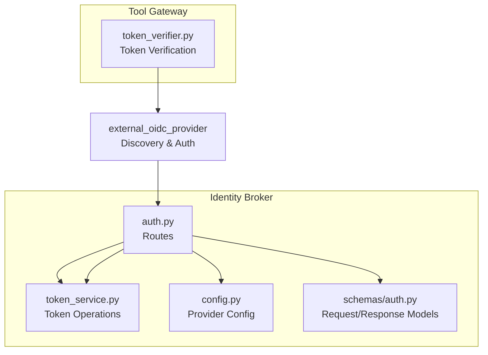
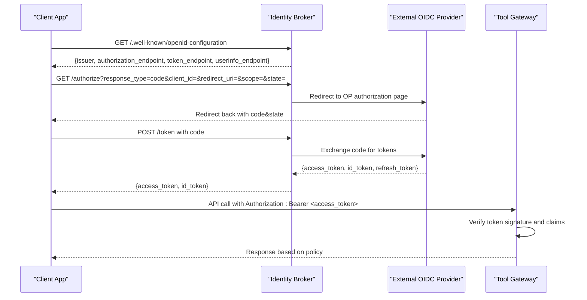
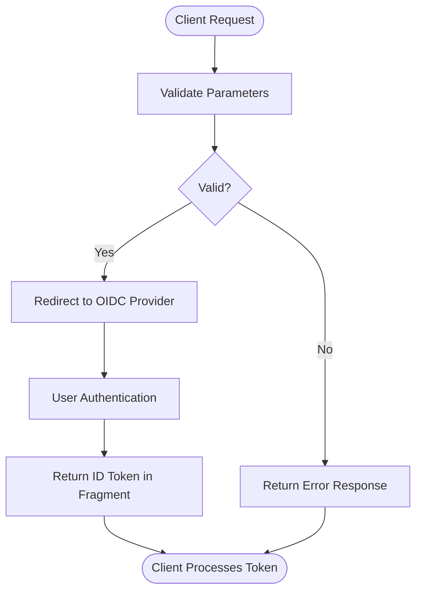
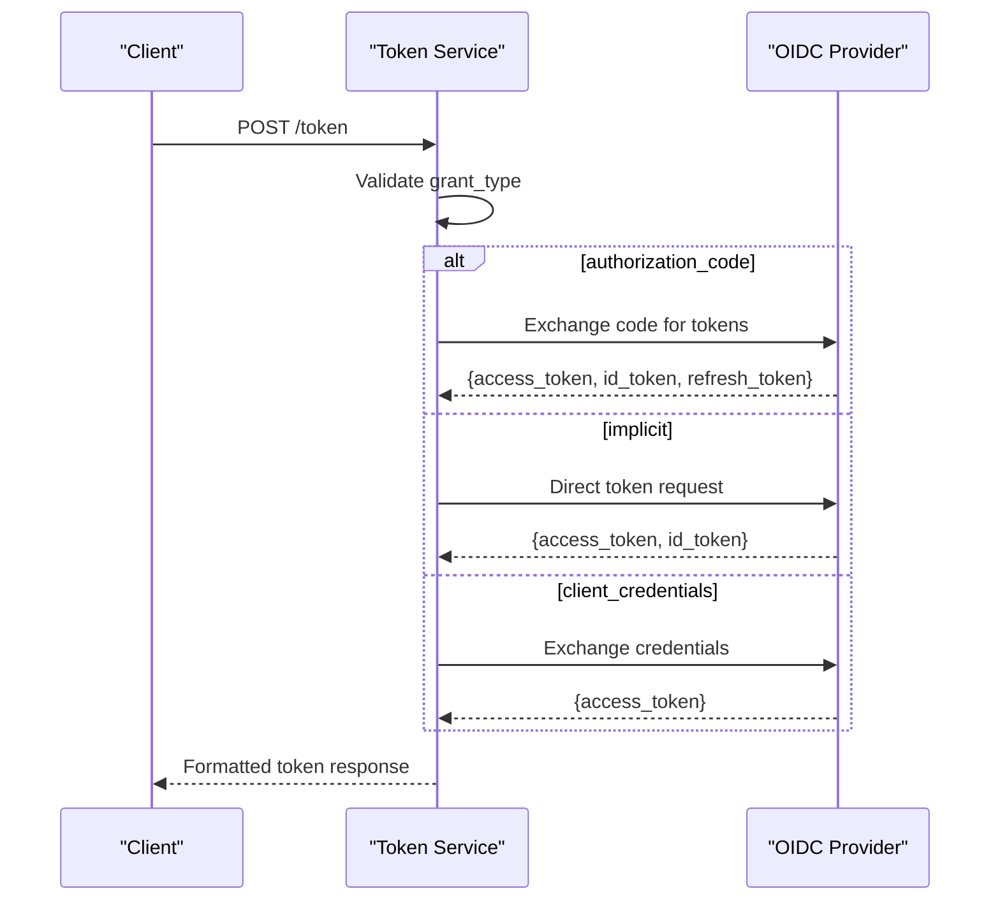
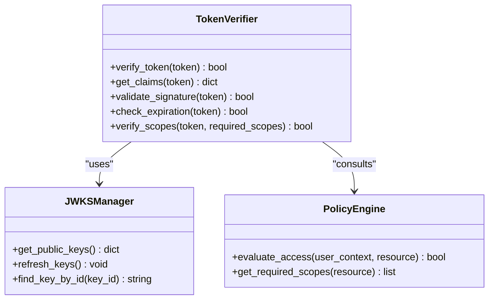
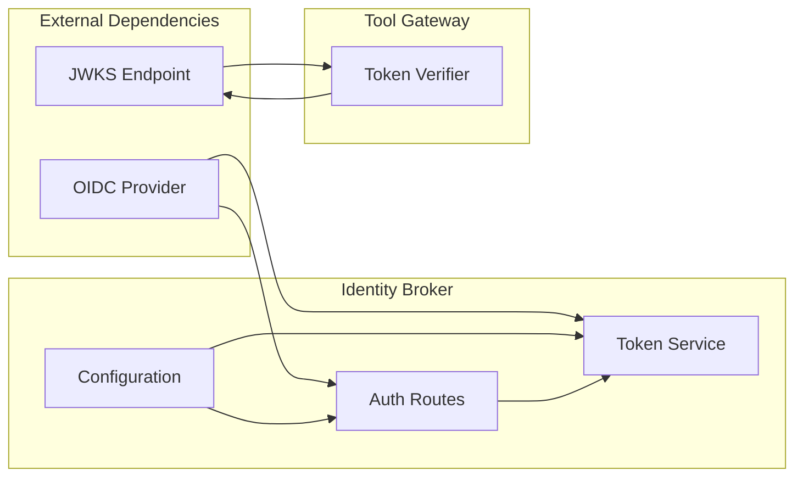

# OIDC Integration

<cite>
**Referenced Files in This Document**
- [identity-broker/src/identity_service/api/routes/auth.py](file://products/identity-broker/src/identity_service/api/routes/auth.py)
- [identity-broker/src/identity_service/services/token_service.py](file://products/identity-broker/src/identity_service/services/token_service.py)
- [identity-broker/src/identity_service/core/config.py](file://products/identity-broker/src/identity_service/core/config.py)
- [identity-broker/src/identity_service/schemas/auth.py](file://products/identity-broker/src/identity_service/schemas/auth.py)
- [tool-gateway/src/api_gateway/services/token_verifier.py](file://products/tool-gateway/src/api_gateway/services/token_verifier.py)
- [shared/shared-contracts/schemas/identity-token.schema.json](file://shared/shared-contracts/schemas/identity-token.schema.json)
</cite>

## Table of Contents
1. [Introduction](#introduction)
2. [Project Structure](#project-structure)
3. [Core Components](#core-components)
4. [Architecture Overview](#architecture-overview)
5. [Detailed Component Analysis](#detailed-component-analysis)
6. [Dependency Analysis](#dependency-analysis)
7. [Performance Considerations](#performance-considerations)
8. [Troubleshooting Guide](#troubleshooting-guide)
9. [Conclusion](#conclusion)
10. [Appendices](#appendices)

## Introduction
This document provides detailed API documentation for OpenID Connect (OIDC) integration endpoints exposed by the Identity Broker service and consumed by downstream services such as the Tool Gateway. It covers:
- OIDC discovery endpoint (.well-known/openid-configuration)
- Authorization Code Flow
- Implicit Flow
- Client Credentials Flow
- OAuth 2.0 scopes and state parameter handling
- Configuration requirements for external OIDC providers
- Callback URL setup
- Token exchange processes
- Examples of provider configuration, authorization flow implementation, and user info retrieval with error handling

The goal is to enable developers to integrate with the platform’s OIDC capabilities securely and consistently.

## Project Structure
The OIDC functionality is primarily implemented in the Identity Broker service, with token verification used by the Tool Gateway. Key areas include:
- API routes for authentication and identity operations
- Services for token issuance and verification
- Configuration for OIDC providers and runtime settings
- Schemas defining request/response structures and token formats



**Diagram sources**
- [identity-broker/src/identity_service/api/routes/auth.py](file://products/identity-broker/src/identity_service/api/routes/auth.py)
- [identity-broker/src/identity_service/services/token_service.py](file://products/identity-broker/src/identity_service/services/token_service.py)
- [identity-broker/src/identity_service/core/config.py](file://products/identity-broker/src/identity_service/core/config.py)
- [identity-broker/src/identity_service/schemas/auth.py](file://products/identity-broker/src/identity_service/schemas/auth.py)
- [tool-gateway/src/api_gateway/services/token_verifier.py](file://products/tool-gateway/src/api_gateway/services/token_verifier.py)

**Section sources**
- [identity-broker/src/identity_service/api/routes/auth.py](file://products/identity-broker/src/identity_service/api/routes/auth.py)
- [identity-broker/src/identity_service/services/token_service.py](file://products/identity-broker/src/identity_service/services/token_service.py)
- [identity-broker/src/identity_service/core/config.py](file://products/identity-broker/src/identity_service/core/config.py)
- [identity-broker/src/identity_service/schemas/auth.py](file://products/identity-broker/src/identity_service/schemas/auth.py)
- [tool-gateway/src/api_gateway/services/token_verifier.py](file://products/tool-gateway/src/api_gateway/services/token_verifier.py)

## Core Components
- OIDC Discovery Endpoint: Exposes .well-known/openid-configuration for clients to discover issuer metadata, supported flows, and endpoints.
- Authorization Endpoints: /authorize supports Authorization Code and Implicit flows.
- Token Endpoint: /token supports Authorization Code, Implicit, and Client Credentials flows.
- User Info Endpoint: /userinfo retrieves authenticated user claims using access tokens.
- Token Verification: The Tool Gateway verifies tokens issued by the Identity Broker or external OIDC providers.

Key responsibilities:
- Validate requests and enforce security policies
- Manage state parameters for CSRF protection
- Exchange authorization codes for tokens
- Verify JWTs and introspect tokens when needed
- Return standardized error responses

**Section sources**
- [identity-broker/src/identity_service/api/routes/auth.py](file://products/identity-broker/src/identity_service/api/routes/auth.py)
- [identity-broker/src/identity_service/services/token_service.py](file://products/identity-broker/src/identity_service/services/token_service.py)
- [tool-gateway/src/api_gateway/services/token_verifier.py](file://products/tool-gateway/src/api_gateway/services/token_verifier.py)

## Architecture Overview
The OIDC architecture integrates an external OIDC provider with the Identity Broker, which acts as a bridge for client applications and downstream services.



**Diagram sources**
- [identity-broker/src/identity_service/api/routes/auth.py](file://products/identity-broker/src/identity_service/api/routes/auth.py)
- [identity-broker/src/identity_service/services/token_service.py](file://products/identity-broker/src/identity_service/services/token_service.py)
- [tool-gateway/src/api_gateway/services/token_verifier.py](file://products/tool-gateway/src/api_gateway/services/token_verifier.py)

## Detailed Component Analysis

### OIDC Discovery Endpoint
- Path: /.well-known/openid-configuration
- Method: GET
- Purpose: Returns issuer metadata including supported flows, endpoints, and signing algorithms.
- Response includes:
  - issuer: Base URL of the OIDC provider
  - authorization_endpoint: URL for initiating authorization
  - token_endpoint: URL for token exchange
  - userinfo_endpoint: URL for retrieving user claims
  - response_types_supported: ["code", "id_token"]
  - grant_types_supported: ["authorization_code", "implicit", "client_credentials"]
  - scopes_supported: ["openid", "profile", "email", "roles"]

Implementation notes:
- Metadata is constructed from provider configuration
- Supports dynamic discovery for multiple providers
- Validates issuer consistency across endpoints

**Section sources**
- [identity-broker/src/identity_service/api/routes/auth.py](file://products/identity-broker/src/identity_service/api/routes/auth.py)
- [identity-broker/src/identity_service/core/config.py](file://products/identity-broker/src/identity_service/core/config.py)

### Authorization Code Flow
- Initiation: GET /authorize with response_type=code
- Required parameters:
  - client_id: Registered application identifier
  - redirect_uri: Pre-registered callback URL
  - scope: Requested permissions (openid required)
  - state: CSRF protection parameter
  - nonce: Optional, for ID token validation
- Flow steps:
  1. Client redirects user to /authorize
  2. Identity Broker validates request and redirects to external OIDC provider
  3. User authenticates and authorizes the application
  4. Provider redirects back to redirect_uri with authorization code
  5. Client exchanges code for tokens via POST /token

Security considerations:
- State parameter must be validated to prevent CSRF attacks
- Redirect URI must match registered values exactly
- PKCE recommended for public clients

**Section sources**
- [identity-broker/src/identity_service/api/routes/auth.py](file://products/identity-broker/src/identity_service/api/routes/auth.py)
- [identity-broker/src/identity_service/schemas/auth.py](file://products/identity-broker/src/identity_service/schemas/auth.py)

### Implicit Flow
- Initiation: GET /authorize with response_type=id_token
- Use case: Single-page applications without backend
- Parameters similar to Authorization Code flow but returns tokens directly in fragment
- Security implications:
  - Tokens exposed in browser history
  - Requires strict redirect_uri validation
  - Short-lived tokens recommended

Flow diagram:


**Diagram sources**
- [identity-broker/src/identity_service/api/routes/auth.py](file://products/identity-broker/src/identity_service/api/routes/auth.py)

**Section sources**
- [identity-broker/src/identity_service/api/routes/auth.py](file://products/identity-broker/src/identity_service/api/routes/auth.py)

### Client Credentials Flow
- Method: POST /token
- Grant type: client_credentials
- Use case: Service-to-service authentication
- Required parameters:
  - grant_type: client_credentials
  - client_id: Service identifier
  - client_secret: Service secret
  - scope: Requested permissions
- Response: Access token only (no ID token)

Implementation details:
- Validates client credentials against configured services
- Issues scoped access tokens
- Supports token expiration and revocation

**Section sources**
- [identity-broker/src/identity_service/services/token_service.py](file://products/identity-broker/src/identity_service/services/token_service.py)

### Token Exchange Process
The token exchange process handles different grant types and validates all inputs before issuing tokens.



**Diagram sources**
- [identity-broker/src/identity_service/services/token_service.py](file://products/identity-broker/src/identity_service/services/token_service.py)

**Section sources**
- [identity-broker/src/identity_service/services/token_service.py](file://products/identity-broker/src/identity_service/services/token_service.py)

### User Info Endpoint
- Path: /userinfo
- Method: GET
- Authentication: Bearer token in Authorization header
- Purpose: Retrieve authenticated user's claims
- Response format: JSON object with user attributes
- Supported scopes: profile, email, roles

Error handling:
- 401 Unauthorized: Missing or invalid token
- 403 Forbidden: Insufficient scopes
- 500 Internal Server Error: Provider communication failure

**Section sources**
- [identity-broker/src/identity_service/api/routes/auth.py](file://products/identity-broker/src/identity_service/api/routes/auth.py)

### Token Verification in Tool Gateway
The Tool Gateway verifies tokens received from clients to ensure they are valid and authorized for requested resources.

Verification process:
1. Extract token from Authorization header
2. Validate token signature using JWKS from issuer
3. Check token expiration and issuer
4. Verify required scopes for resource access
5. Extract user context for policy enforcement



**Diagram sources**
- [tool-gateway/src/api_gateway/services/token_verifier.py](file://products/tool-gateway/src/api_gateway/services/token_verifier.py)

**Section sources**
- [tool-gateway/src/api_gateway/services/token_verifier.py](file://products/tool-gateway/src/api_gateway/services/token_verifier.py)

## Dependency Analysis
The OIDC integration has clear dependency boundaries between components:



**Diagram sources**
- [identity-broker/src/identity_service/api/routes/auth.py](file://products/identity-broker/src/identity_service/api/routes/auth.py)
- [identity-broker/src/identity_service/services/token_service.py](file://products/identity-broker/src/identity_service/services/token_service.py)
- [identity-broker/src/identity_service/core/config.py](file://products/identity-broker/src/identity_service/core/config.py)
- [tool-gateway/src/api_gateway/services/token_verifier.py](file://products/tool-gateway/src/api_gateway/services/token_verifier.py)

**Section sources**
- [identity-broker/src/identity_service/api/routes/auth.py](file://products/identity-broker/src/identity_service/api/routes/auth.py)
- [identity-broker/src/identity_service/services/token_service.py](file://products/identity-broker/src/identity_service/services/token_service.py)
- [identity-broker/src/identity_service/core/config.py](file://products/identity-broker/src/identity_service/core/config.py)
- [tool-gateway/src/api_gateway/services/token_verifier.py](file://products/tool-gateway/src/api_gateway/services/token_verifier.py)

## Performance Considerations
- Token caching: Implement local caching for JWKS keys to reduce network calls
- Connection pooling: Use connection pools for OIDC provider communications
- Stateless design: Design endpoints to be horizontally scalable
- Rate limiting: Implement rate limiting on token endpoints to prevent abuse
- Async operations: Use asynchronous I/O for external provider calls
- Memory management: Properly handle token lifecycle to prevent memory leaks

[No sources needed since this section provides general guidance]

## Troubleshooting Guide
Common issues and solutions:

### Invalid State Parameter
- Symptom: 400 Bad Request during authorization
- Cause: Missing or mismatched state parameter
- Solution: Ensure state parameter is generated and validated correctly

### Redirect URI Mismatch
- Symptom: 400 Bad Request or 401 Unauthorized
- Cause: Redirect URI doesn't match registered value
- Solution: Verify exact match including trailing slashes and protocol

### Token Validation Errors
- Symptom: 401 Unauthorized on protected endpoints
- Cause: Expired or invalid tokens
- Solution: Refresh tokens or re-authenticate users

### Scope Denial
- Symptom: 403 Forbidden responses
- Cause: Insufficient scopes for requested resource
- Solution: Request appropriate scopes during authorization

### Provider Communication Failures
- Symptom: 500 Internal Server Error
- Cause: Network issues or provider unavailability
- Solution: Implement retry logic and circuit breakers

**Section sources**
- [identity-broker/src/identity_service/api/routes/auth.py](file://products/identity-broker/src/identity_service/api/routes/auth.py)
- [identity-broker/src/identity_service/services/token_service.py](file://products/identity-broker/src/identity_service/services/token_service.py)

## Conclusion
The OIDC integration provides a robust foundation for secure authentication and authorization across the platform. By following the documented flows and configurations, developers can implement secure integrations that leverage industry-standard protocols while maintaining flexibility for different deployment scenarios.

Key benefits:
- Standardized authentication flows
- Secure token handling and verification
- Flexible provider configuration
- Comprehensive error handling
- Scalable architecture

[No sources needed since this section summarizes without analyzing specific files]

## Appendices

### Configuration Requirements
Required environment variables for OIDC provider configuration:
- OIDC_ISSUER_URL: Base URL of the OIDC provider
- OIDC_CLIENT_ID: Application client identifier
- OIDC_CLIENT_SECRET: Application client secret
- OIDC_REDIRECT_URI: Registered callback URL
- OIDC_SCOPES: Space-separated list of requested scopes
- OIDC_JWKS_URI: URL for public key discovery

### OAuth 2.0 Scopes
Standard scopes supported:
- openid: Required for OIDC
- profile: Basic user profile information
- email: User email address
- roles: User role assignments

Custom scopes can be defined per provider configuration.

### Error Response Format
All endpoints return consistent error responses:
```json
{
  "error": "error_code",
  "error_description": "Human-readable description",
  "error_uri": "Documentation URL"
}
```

**Section sources**
- [identity-broker/src/identity_service/core/config.py](file://products/identity-broker/src/identity_service/core/config.py)
- [identity-broker/src/identity_service/schemas/auth.py](file://products/identity-broker/src/identity_service/schemas/auth.py)
- [shared/shared-contracts/schemas/identity-token.schema.json](file://shared/shared-contracts/schemas/identity-token.schema.json)