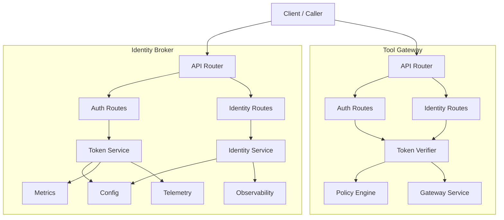
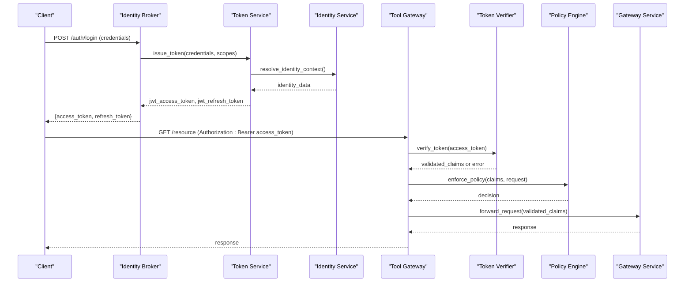
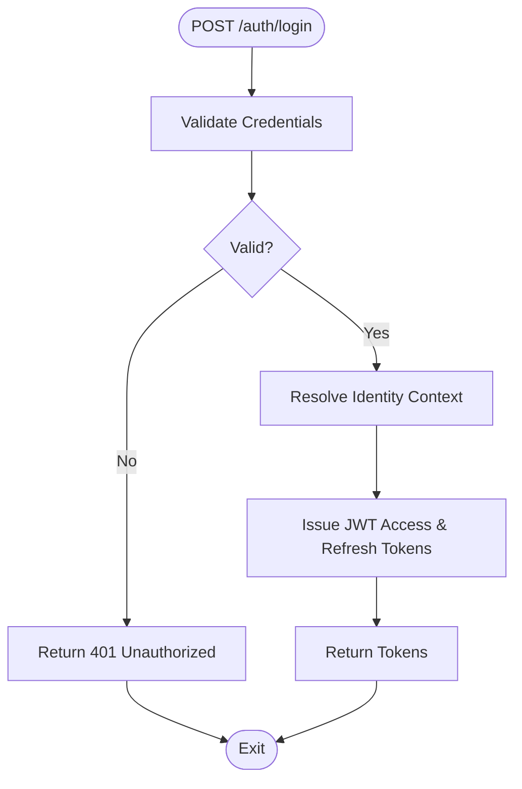
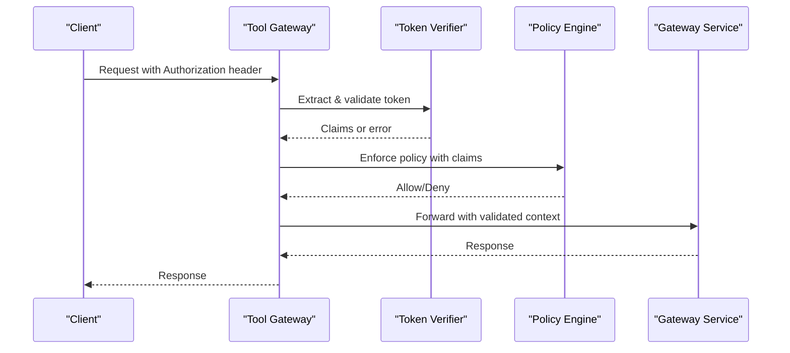
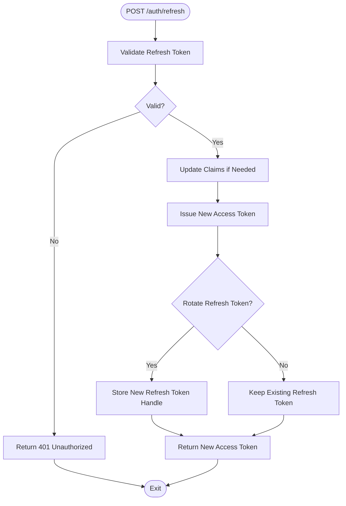
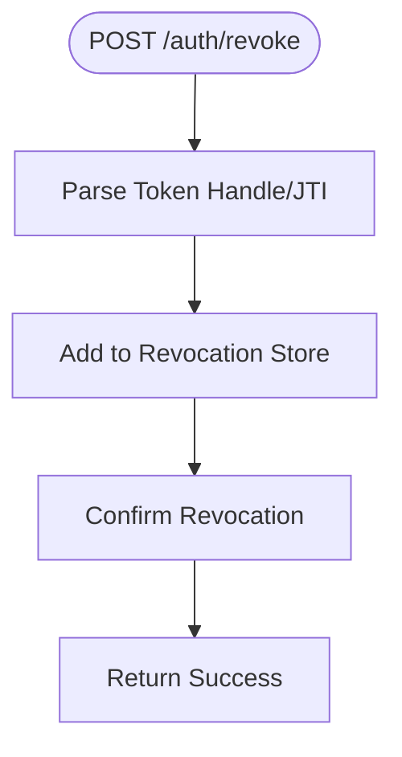
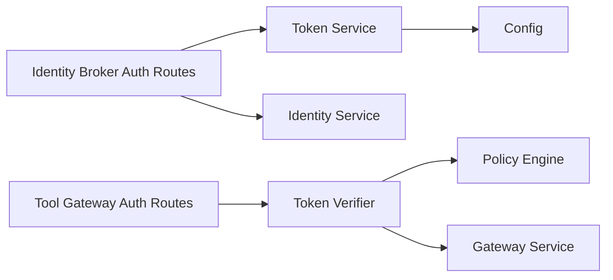

# Token Management

<cite>
**Referenced Files in This Document**
- [auth.py](file://products/identity-broker/src/identity_service/api/routes/auth.py)
- [identity.py](file://products/identity-broker/src/identity_service/api/routes/identity.py)
- [router.py](file://products/identity-broker/src/identity_service/api/router.py)
- [token_service.py](file://products/identity-broker/src/identity_service/services/token_service.py)
- [identity_service.py](file://products/identity-broker/src/identity_service/services/identity_service.py)
- [config.py](file://products/identity-broker/src/identity_service/core/config.py)
- [metrics.py](file://products/identity-broker/src/identity_service/core/metrics.py)
- [observability.py](file://products/identity-broker/src/identity_service/core/observability.py)
- [telemetry.py](file://products/identity-broker/src/identity_service/core/telemetry.py)
- [auth.py](file://products/tool-gateway/src/api_gateway/api/routes/auth.py)
- [identity.py](file://products/tool-gateway/src/api_gateway/api/routes/identity.py)
- [token_verifier.py](file://products/tool-gateway/src/api_gateway/services/token_verifier.py)
- [policy_engine.py](file://products/tool-gateway/src/api_gateway/services/policy_engine.py)
- [gateway_service.py](file://products/tool-gateway/src/api_gateway/services/gateway_service.py)
- [api.py](file://products/shared-contracts/schemas/identity-token.schema.json)
</cite>

## Table of Contents
1. [Introduction](#introduction)
2. [Project Structure](#project-structure)
3. [Core Components](#core-components)
4. [Architecture Overview](#architecture-overview)
5. [Detailed Component Analysis](#detailed-component-analysis)
6. [Dependency Analysis](#dependency-analysis)
7. [Performance Considerations](#performance-considerations)
8. [Troubleshooting Guide](#troubleshooting-guide)
9. [Conclusion](#conclusion)
10. [Appendices](#appendices)

## Introduction
This document provides detailed API documentation for token management operations across the platform’s Identity Broker and Tool Gateway services. It covers JWT token generation, validation, refresh, and revocation endpoints; HTTP methods; token payload structure; expiration handling; scope management; signing algorithms; secret key management; security best practices; caching strategies; rate limiting; monitoring; and troubleshooting guidance. The goal is to enable both developers and operators to understand, integrate with, and operate token flows reliably and securely.

## Project Structure
Token-related functionality is primarily implemented in two services:
- Identity Broker: issues tokens, manages identity context, and exposes authentication endpoints.
- Tool Gateway: validates tokens, enforces policies, and proxies requests to downstream services.

**Diagram sources**
- [router.py](file://products/identity-broker/src/identity_service/api/router.py)
- [auth.py](file://products/identity-broker/src/identity_service/api/routes/auth.py)
- [identity.py](file://products/identity-broker/src/identity_service/api/routes/identity.py)
- [token_service.py](file://products/identity-broker/src/identity_service/services/token_service.py)
- [identity_service.py](file://products/identity-broker/src/identity_service/services/identity_service.py)
- [config.py](file://products/identity-broker/src/identity_service/core/config.py)
- [metrics.py](file://products/identity-broker/src/identity_service/core/metrics.py)
- [observability.py](file://products/identity-broker/src/identity_service/core/observability.py)
- [telemetry.py](file://products/identity-broker/src/identity_service/core/telemetry.py)
- [auth.py](file://products/tool-gateway/src/api_gateway/api/routes/auth.py)
- [identity.py](file://products/tool-gateway/src/api_gateway/api/routes/identity.py)
- [token_verifier.py](file://products/tool-gateway/src/api_gateway/services/token_verifier.py)
- [policy_engine.py](file://products/tool-gateway/src/api_gateway/services/policy_engine.py)
- [gateway_service.py](file://products/tool-gateway/src/api_gateway/services/gateway_service.py)

**Section sources**
- [router.py](file://products/identity-broker/src/identity_service/api/router.py)
- [auth.py](file://products/identity-broker/src/identity_service/api/routes/auth.py)
- [identity.py](file://products/identity-broker/src/identity_service/api/routes/identity.py)
- [token_service.py](file://products/identity-broker/src/identity_service/services/token_service.py)
- [identity_service.py](file://products/identity-broker/src/identity_service/services/identity_service.py)
- [config.py](file://products/identity-broker/src/identity_service/core/config.py)
- [metrics.py](file://products/identity-broker/src/identity_service/core/metrics.py)
- [observability.py](file://products/identity-broker/src/identity_service/core/observability.py)
- [telemetry.py](file://products/identity-broker/src/identity_service/core/telemetry.py)
- [auth.py](file://products/tool-gateway/src/api_gateway/api/routes/auth.py)
- [identity.py](file://products/tool-gateway/src/api_gateway/api/routes/identity.py)
- [token_verifier.py](file://products/tool-gateway/src/api_gateway/services/token_verifier.py)
- [policy_engine.py](file://products/tool-gateway/src/api_gateway/services/policy_engine.py)
- [gateway_service.py](file://products/tool-gateway/src/api_gateway/services/gateway_service.py)

## Core Components
- Identity Broker Token Service: responsible for issuing, refreshing, and revoking tokens; integrates with configuration for secrets and algorithm settings; emits metrics and telemetry.
- Identity Service: manages identity context and user/session data used when generating tokens.
- Tool Gateway Token Verifier: validates incoming JWTs, checks signatures, expiration, and scopes; interacts with policy engine for authorization decisions.
- Policy Engine: evaluates access policies based on token claims and request context.
- Gateway Service: orchestrates downstream calls after successful verification and policy enforcement.

Key responsibilities:
- Token lifecycle: creation, refresh, revocation.
- Validation: signature verification, expiration checks, scope validation.
- Security: algorithm selection, secret rotation, secure storage.
- Observability: metrics, tracing, logging.

**Section sources**
- [token_service.py](file://products/identity-broker/src/identity_service/services/token_service.py)
- [identity_service.py](file://products/identity-broker/src/identity_service/services/identity_service.py)
- [token_verifier.py](file://products/tool-gateway/src/api_gateway/services/token_verifier.py)
- [policy_engine.py](file://products/tool-gateway/src/api_gateway/services/policy_engine.py)
- [gateway_service.py](file://products/tool-gateway/src/api_gateway/services/gateway_service.py)

## Architecture Overview
The token flow spans two primary services:
- Issuance via Identity Broker endpoints (login, refresh).
- Validation at Tool Gateway before proxying to downstream services.

**Diagram sources**
- [auth.py](file://products/identity-broker/src/identity_service/api/routes/auth.py)
- [token_service.py](file://products/identity-broker/src/identity_service/services/token_service.py)
- [identity_service.py](file://products/identity-broker/src/identity_service/services/identity_service.py)
- [auth.py](file://products/tool-gateway/src/api_gateway/api/routes/auth.py)
- [token_verifier.py](file://products/tool-gateway/src/api_gateway/services/token_verifier.py)
- [policy_engine.py](file://products/tool-gateway/src/api_gateway/services/policy_engine.py)
- [gateway_service.py](file://products/tool-gateway/src/api_gateway/services/gateway_service.py)

## Detailed Component Analysis

### Authentication Endpoints (Identity Broker)
- Purpose: Authenticate users and issue JWT access and refresh tokens.
- Methods:
  - POST /auth/login: Accepts credentials, returns tokens.
  - POST /auth/refresh: Accepts refresh token, returns new access token.
  - POST /auth/revoke: Revokes a token (typically refresh token or active session).
- Request/Response:
  - Login: credentials payload; response includes access_token and refresh_token fields.
  - Refresh: refresh_token payload; response includes new access_token.
  - Revoke: token identifier or handle; response indicates success or failure.
- Scopes:
  - Tokens include scope claims; login may accept requested scopes; refresh may inherit or restrict scopes.
- Expiration:
  - Access tokens have short TTL; refresh tokens have longer TTL; configurable via service config.

**Diagram sources**
- [auth.py](file://products/identity-broker/src/identity_service/api/routes/auth.py)
- [token_service.py](file://products/identity-broker/src/identity_service/services/token_service.py)
- [identity_service.py](file://products/identity-broker/src/identity_service/services/identity_service.py)

**Section sources**
- [auth.py](file://products/identity-broker/src/identity_service/api/routes/auth.py)
- [token_service.py](file://products/identity-broker/src/identity_service/services/token_service.py)
- [identity_service.py](file://products/identity-broker/src/identity_service/services/identity_service.py)

### Token Verification (Tool Gateway)
- Purpose: Validate incoming JWTs and enforce policies before forwarding requests.
- Methods:
  - Authorization header parsing and bearer token extraction.
  - Signature verification using configured algorithms and keys.
  - Expiration and claim validation.
  - Scope validation against requested resource/method.
- Integration:
  - Token Verifier interacts with Policy Engine for authorization decisions.
  - Verified claims are passed to Gateway Service for downstream calls.

**Diagram sources**
- [auth.py](file://products/tool-gateway/src/api_gateway/api/routes/auth.py)
- [token_verifier.py](file://products/tool-gateway/src/api_gateway/services/token_verifier.py)
- [policy_engine.py](file://products/tool-gateway/src/api_gateway/services/policy_engine.py)
- [gateway_service.py](file://products/tool-gateway/src/api_gateway/services/gateway_service.py)

**Section sources**
- [auth.py](file://products/tool-gateway/src/api_gateway/api/routes/auth.py)
- [token_verifier.py](file://products/tool-gateway/src/api_gateway/services/token_verifier.py)
- [policy_engine.py](file://products/tool-gateway/src/api_gateway/services/policy_engine.py)
- [gateway_service.py](file://products/tool-gateway/src/api_gateway/services/gateway_service.py)

### Token Payload Structure
- Standard JWT fields:
  - iss: issuer identifier
  - sub: subject identifier
  - aud: audience
  - exp: expiration time
  - nbf: not before
  - iat: issued at
  - jti: unique token identifier
- Custom claims:
  - scopes: array of granted scopes
  - roles: optional role set
  - tenant_id: multi-tenant context
  - client_id: originating client
- Schema reference:
  - See shared schema file for identity token structure.

**Section sources**
- [api.py](file://products/shared-contracts/schemas/identity-token.schema.json)

### Signing Algorithms and Secret Key Management
- Algorithms:
  - Asymmetric (RS256/ES256) recommended for production; symmetric (HS256) acceptable for development.
- Key Management:
  - Secrets stored securely (e.g., environment variables, secret managers).
  - Support for key rotation without downtime by maintaining multiple public keys.
- Configuration:
  - Algorithm selection and key material sourced from service configuration.

**Section sources**
- [config.py](file://products/identity-broker/src/identity_service/core/config.py)

### Expiration Handling and Refresh Flow
- Access Token TTL:
  - Short-lived to minimize risk; typically minutes.
- Refresh Token TTL:
  - Longer-lived; can be rotated on each use.
- Refresh Workflow:
  - Validate refresh token signature and expiry.
  - Issue new access token with potentially updated scopes.
  - Optionally rotate refresh token for enhanced security.

**Diagram sources**
- [auth.py](file://products/identity-broker/src/identity_service/api/routes/auth.py)
- [token_service.py](file://products/identity-broker/src/identity_service/services/token_service.py)

**Section sources**
- [auth.py](file://products/identity-broker/src/identity_service/api/routes/auth.py)
- [token_service.py](file://products/identity-broker/src/identity_service/services/token_service.py)

### Revocation Strategy
- Approaches:
  - In-memory blacklist for short-lived tokens.
  - Persistent store (e.g., Redis) for distributed revocation lists.
  - JTI-based revocation with TTL expiration.
- Endpoint:
  - POST /auth/revoke accepts token handle or JTI; updates revocation store.

**Diagram sources**
- [auth.py](file://products/identity-broker/src/identity_service/api/routes/auth.py)
- [token_service.py](file://products/identity-broker/src/identity_service/services/token_service.py)

**Section sources**
- [auth.py](file://products/identity-broker/src/identity_service/api/routes/auth.py)
- [token_service.py](file://products/identity-broker/src/identity_service/services/token_service.py)

### Scope Management
- Scopes define permissions; included in token claims.
- Enforcement:
  - Tool Gateway validates scopes against requested resource/method.
  - Policy Engine applies fine-grained rules based on scopes and context.
- Best Practices:
  - Principle of least privilege; minimal scopes per client.
  - Separate read/write scopes where applicable.

**Section sources**
- [token_verifier.py](file://products/tool-gateway/src/api_gateway/services/token_verifier.py)
- [policy_engine.py](file://products/tool-gateway/src/api_gateway/services/policy_engine.py)

### Token Caching Strategies
- Client-side:
  - Cache access tokens until near-expiration; refresh proactively.
- Server-side:
  - Cache public keys for signature verification to reduce overhead.
  - Use fast stores (e.g., Redis) for revocation lists and refresh token handles.
- Recommendations:
  - Implement cache invalidation on revocation events.
  - Monitor cache hit rates and latency.

**Section sources**
- [token_verifier.py](file://products/tool-gateway/src/api_gateway/services/token_verifier.py)
- [token_service.py](file://products/identity-broker/src/identity_service/services/token_service.py)

### Rate Limiting for Token Operations
- Goals:
  - Prevent brute-force attacks on login and refresh endpoints.
  - Protect token issuance under load.
- Implementation:
  - Per-IP and per-user limits on login/refresh endpoints.
  - Sliding window counters with persistent storage.
- Monitoring:
  - Track rate limit hits and failures; alert on anomalies.

**Section sources**
- [auth.py](file://products/identity-broker/src/identity_service/api/routes/auth.py)
- [metrics.py](file://products/identity-broker/src/identity_service/core/metrics.py)

### Monitoring and Telemetry
- Metrics:
  - Token issuance count, validation success/failure, refresh attempts, revocations.
- Tracing:
  - Trace ID propagation across Identity Broker and Tool Gateway.
- Logging:
  - Structured logs for token events; avoid sensitive data in logs.

**Section sources**
- [metrics.py](file://products/identity-broker/src/identity_service/core/metrics.py)
- [observability.py](file://products/identity-broker/src/identity_service/core/observability.py)
- [telemetry.py](file://products/identity-broker/src/identity_service/core/telemetry.py)

## Dependency Analysis
Token management involves tight coupling between API routes, services, and configuration:
- Identity Broker:
  - Auth routes depend on Token Service and Identity Service.
  - Token Service depends on Config for secrets and algorithms.
- Tool Gateway:
  - Auth and Identity routes depend on Token Verifier.
  - Token Verifier depends on Policy Engine and Gateway Service.

**Diagram sources**
- [auth.py](file://products/identity-broker/src/identity_service/api/routes/auth.py)
- [token_service.py](file://products/identity-broker/src/identity_service/services/token_service.py)
- [identity_service.py](file://products/identity-broker/src/identity_service/services/identity_service.py)
- [config.py](file://products/identity-broker/src/identity_service/core/config.py)
- [auth.py](file://products/tool-gateway/src/api_gateway/api/routes/auth.py)
- [token_verifier.py](file://products/tool-gateway/src/api_gateway/services/token_verifier.py)
- [policy_engine.py](file://products/tool-gateway/src/api_gateway/services/policy_engine.py)
- [gateway_service.py](file://products/tool-gateway/src/api_gateway/services/gateway_service.py)

**Section sources**
- [auth.py](file://products/identity-broker/src/identity_service/api/routes/auth.py)
- [token_service.py](file://products/identity-broker/src/identity_service/services/token_service.py)
- [identity_service.py](file://products/identity-broker/src/identity_service/services/identity_service.py)
- [config.py](file://products/identity-broker/src/identity_service/core/config.py)
- [auth.py](file://products/tool-gateway/src/api_gateway/api/routes/auth.py)
- [token_verifier.py](file://products/tool-gateway/src/api_gateway/services/token_verifier.py)
- [policy_engine.py](file://products/tool-gateway/src/api_gateway/services/policy_engine.py)
- [gateway_service.py](file://products/tool-gateway/src/api_gateway/services/gateway_service.py)

## Performance Considerations
- Minimize cryptographic overhead:
  - Cache public keys; reuse crypto contexts.
- Optimize token validation:
  - Early exit on invalid signatures; skip policy evaluation on validation errors.
- Scale revocation stores:
  - Use high-throughput stores for revocation lists.
- Batch operations:
  - Where possible, batch token validations in internal flows.

[No sources needed since this section provides general guidance]

## Troubleshooting Guide
Common issues and resolutions:
- Invalid signature:
  - Verify algorithm and key configuration; ensure key rotation consistency.
- Expired tokens:
  - Implement proactive refresh; check server clock synchronization.
- Missing scopes:
  - Review requested scopes during login; ensure policy allows access.
- Revocation not taking effect:
  - Check revocation store connectivity and TTL settings.
- Rate limiting errors:
  - Adjust limits; investigate abuse patterns.

Operational checks:
- Inspect metrics for token issuance/validation counts.
- Review structured logs for token events.
- Validate configuration for secrets and algorithms.

**Section sources**
- [metrics.py](file://products/identity-broker/src/identity_service/core/metrics.py)
- [observability.py](file://products/identity-broker/src/identity_service/core/observability.py)
- [telemetry.py](file://products/identity-broker/src/identity_service/core/telemetry.py)

## Conclusion
Token management in this platform centers around secure issuance, robust validation, and effective revocation. By following the outlined endpoints, payload structures, and best practices, teams can implement reliable and secure token flows. Proper configuration, caching, rate limiting, and observability are essential for performance and security.

[No sources needed since this section summarizes without analyzing specific files]

## Appendices
- Example workflows:
  - Create token: authenticate via login, receive access and refresh tokens.
  - Validate token: present access token in Authorization header; gateway verifies and enforces policy.
  - Refresh token: use refresh endpoint to obtain new access token.
  - Revoke token: call revoke endpoint to invalidate tokens.
- Security best practices:
  - Use asymmetric algorithms in production.
  - Rotate secrets regularly; support multiple keys.
  - Enforce least privilege scopes.
  - Monitor and alert on anomalies.

[No sources needed since this section provides general guidance]