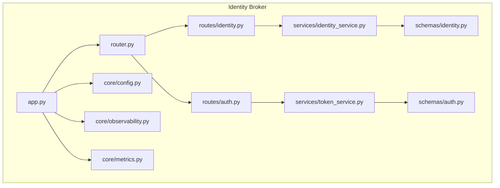
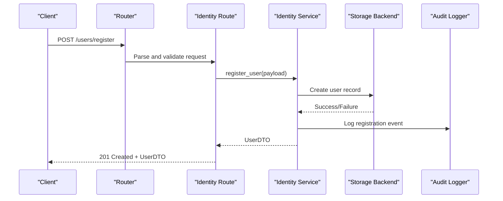
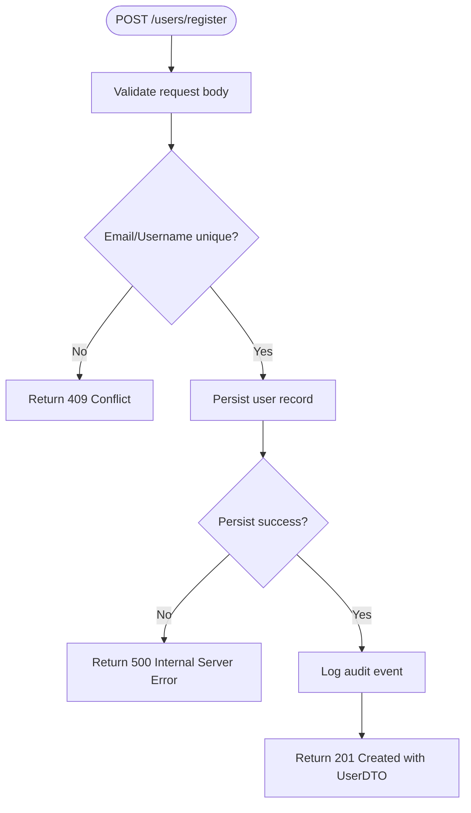
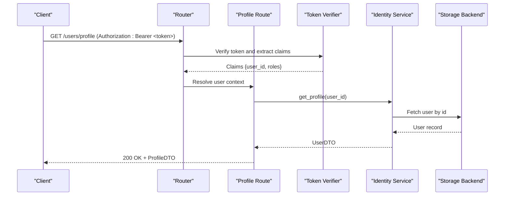
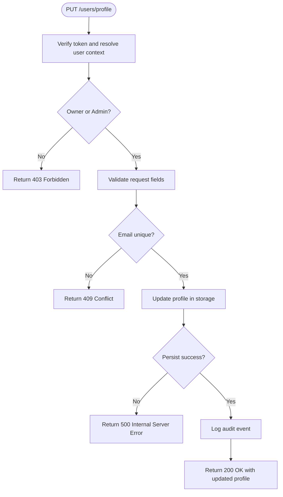
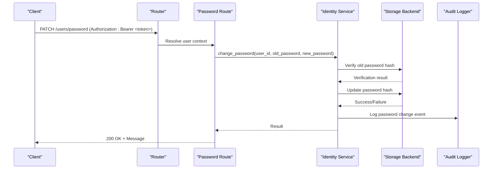
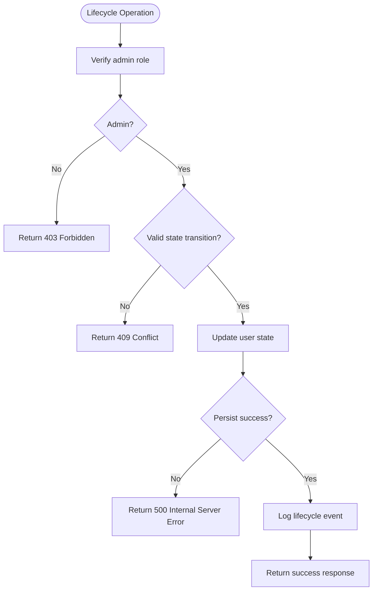
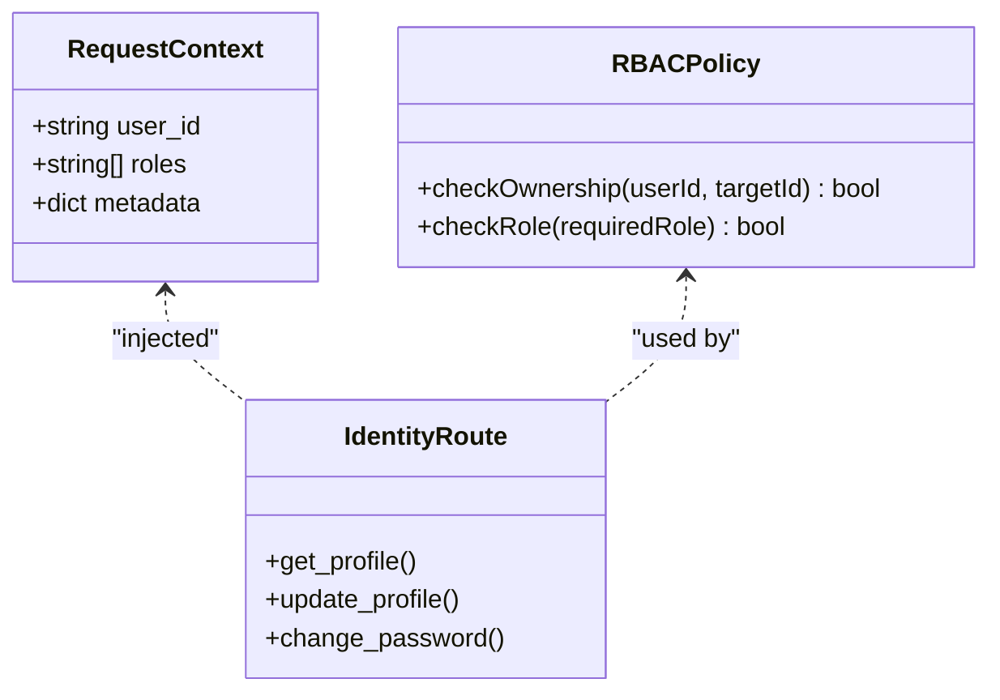
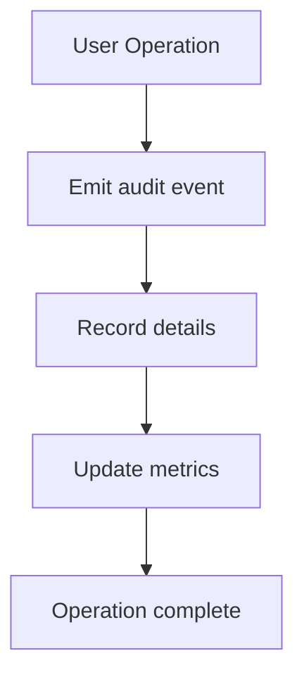
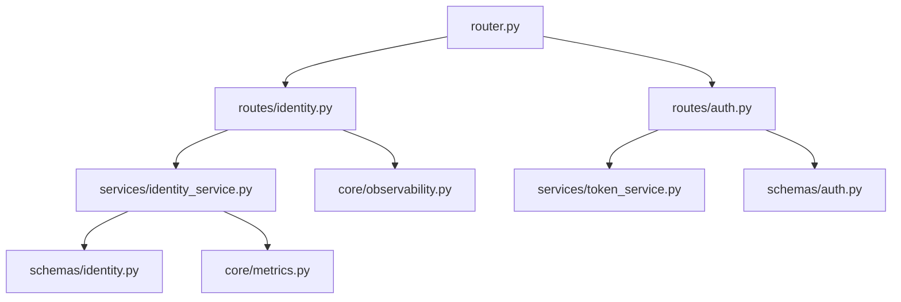

# User Management Endpoints

<cite>
**Referenced Files in This Document**
- [identity.py](file://products/identity-broker/src/identity_service/api/routes/identity.py)
- [auth.py](file://products/identity-broker/src/identity_service/api/routes/auth.py)
- [router.py](file://products/identity-broker/src/identity_service/api/router.py)
- [identity_service.py](file://products/identity-broker/src/identity_service/services/identity_service.py)
- [token_service.py](file://products/identity-broker/src/identity_service/services/token_service.py)
- [identity.py](file://products/identity-broker/src/identity_service/schemas/identity.py)
- [auth.py](file://products/identity-broker/src/identity_service/schemas/auth.py)
- [config.py](file://products/identity-broker/src/identity_service/core/config.py)
- [observability.py](file://products/identity-broker/src/identity_service/core/observability.py)
- [metrics.py](file://products/identity-broker/src/identity_service/core/metrics.py)
- [app.py](file://products/identity-broker/src/identity_service/app.py)
- [main.py](file://products/identity-broker/src/identity_service/main.py)
</cite>

## Table of Contents
1. [Introduction](#introduction)
2. [Project Structure](#project-structure)
3. [Core Components](#core-components)
4. [Architecture Overview](#architecture-overview)
5. [Detailed Component Analysis](#detailed-component-analysis)
6. [Dependency Analysis](#dependency-analysis)
7. [Performance Considerations](#performance-considerations)
8. [Troubleshooting Guide](#troubleshooting-guide)
9. [Conclusion](#conclusion)

## Introduction
This document provides comprehensive API documentation for user management endpoints implemented in the Identity Broker service. It covers:
- User registration
- Profile retrieval and updates
- Password management
- Account lifecycle operations (activation, deactivation, deletion)
- HTTP methods and paths
- Request/response schemas and validation rules
- User context retrieval and role-based access control
- Audit logging for user operations
- Example flows and error handling scenarios

The Identity Broker is responsible for identity-related operations, including authentication, authorization, token issuance, and user profile management. The API routes are organized under a dedicated router and backed by services that encapsulate business logic and persistence interactions.

## Project Structure
The user management functionality resides primarily within the Identity Broker product:
- API routes define HTTP endpoints and request/response contracts
- Schemas define data models and validation rules
- Services implement core business logic for identity and token operations
- Core modules provide configuration, observability, and metrics
- Application entry points wire up routing and middleware

**Diagram sources**
- [app.py](file://products/identity-broker/src/identity_service/app.py)
- [router.py](file://products/identity-broker/src/identity_service/api/router.py)
- [identity.py](file://products/identity-broker/src/identity_service/api/routes/identity.py)
- [auth.py](file://products/identity-broker/src/identity_service/api/routes/auth.py)
- [identity_service.py](file://products/identity-broker/src/identity_service/services/identity_service.py)
- [token_service.py](file://products/identity-broker/src/identity_service/services/token_service.py)
- [identity.py](file://products/identity-broker/src/identity_service/schemas/identity.py)
- [auth.py](file://products/identity-broker/src/identity_service/schemas/auth.py)
- [config.py](file://products/identity-broker/src/identity_service/core/config.py)
- [observability.py](file://products/identity-broker/src/identity_service/core/observability.py)
- [metrics.py](file://products/identity-broker/src/identity_service/core/metrics.py)

**Section sources**
- [app.py](file://products/identity-broker/src/identity_service/app.py)
- [router.py](file://products/identity-broker/src/identity_service/api/router.py)
- [identity.py](file://products/identity-broker/src/identity_service/api/routes/identity.py)
- [auth.py](file://products/identity-broker/src/identity_service/api/routes/auth.py)
- [identity_service.py](file://products/identity-broker/src/identity_service/services/identity_service.py)
- [token_service.py](file://products/identity-broker/src/identity_service/services/token_service.py)
- [identity.py](file://products/identity-broker/src/identity_service/schemas/identity.py)
- [auth.py](file://products/identity-broker/src/identity_service/schemas/auth.py)
- [config.py](file://products/identity-broker/src/identity_service/core/config.py)
- [observability.py](file://products/identity-broker/src/identity_service/core/observability.py)
- [metrics.py](file://products/identity-broker/src/identity_service/core/metrics.py)

## Core Components
- API Routes: Define endpoints for user registration, profile management, password updates, and account lifecycle operations. They parse requests, validate payloads using Pydantic schemas, and delegate to services.
- Identity Service: Implements user creation, profile updates, password changes, and account state transitions. It enforces validation rules and integrates with storage backends.
- Token Service: Handles token issuance and verification used by authenticated endpoints.
- Schemas: Define request and response models for user data, authentication, and errors.
- Observability and Metrics: Provide structured logging, audit trails, and metrics for user operations.

Key responsibilities:
- Registration: Validate unique identifiers, enforce password policies, create user records, and return minimal user info.
- Profile Management: Retrieve current user profile; update allowed fields with validation; enforce ownership or admin roles.
- Password Management: Verify old password, enforce new password policy, update securely, and log audit events.
- Account Lifecycle: Activate/deactivate accounts and delete users with appropriate checks and audit logs.

**Section sources**
- [identity.py](file://products/identity-broker/src/identity_service/api/routes/identity.py)
- [auth.py](file://products/identity-broker/src/identity_service/api/routes/auth.py)
- [identity_service.py](file://products/identity-broker/src/identity_service/services/identity_service.py)
- [token_service.py](file://products/identity-broker/src/identity_service/services/token_service.py)
- [identity.py](file://products/identity-broker/src/identity_service/schemas/identity.py)
- [auth.py](file://products/identity-broker/src/identity_service/schemas/auth.py)
- [observability.py](file://products/identity-broker/src/identity_service/core/observability.py)
- [metrics.py](file://products/identity-broker/src/identity_service/core/metrics.py)

## Architecture Overview
The user management API follows a layered architecture:
- HTTP layer (FastAPI routes) handles request parsing and response serialization
- Service layer encapsulates business logic and persistence calls
- Schema layer defines strict validation models
- Observability layer logs and emits metrics for all user operations

**Diagram sources**
- [router.py](file://products/identity-broker/src/identity_service/api/router.py)
- [identity.py](file://products/identity-broker/src/identity_service/api/routes/identity.py)
- [identity_service.py](file://products/identity-broker/src/identity_service/services/identity_service.py)
- [observability.py](file://products/identity-broker/src/identity_service/core/observability.py)

## Detailed Component Analysis

### User Registration Endpoint
- Method and Path: POST /users/register
- Purpose: Create a new user account with validated input and return minimal user information.
- Request schema fields:
  - email: string, required, must be unique
  - username: string, required, unique within system
  - password: string, required, meets complexity policy
  - display_name: string, optional
  - roles: array of strings, optional, default empty
- Response schema fields:
  - id: string (UUID)
  - email: string
  - username: string
  - display_name: string
  - roles: array of strings
  - created_at: timestamp
- Validation rules:
  - Unique constraints on email and username
  - Password complexity enforced by policy
  - Required fields validated via Pydantic models
- Error handling:
  - 409 Conflict for duplicate email or username
  - 422 Unprocessable Entity for invalid payload
  - 500 Internal Server Error for unexpected failures

**Diagram sources**
- [identity.py](file://products/identity-broker/src/identity_service/api/routes/identity.py)
- [identity_service.py](file://products/identity-broker/src/identity_service/services/identity_service.py)
- [identity.py](file://products/identity-broker/src/identity_service/schemas/identity.py)

**Section sources**
- [identity.py](file://products/identity-broker/src/identity_service/api/routes/identity.py)
- [identity_service.py](file://products/identity-broker/src/identity_service/services/identity_service.py)
- [identity.py](file://products/identity-broker/src/identity_service/schemas/identity.py)

### Get User Profile Endpoint
- Method and Path: GET /users/profile
- Purpose: Retrieve the authenticated user’s profile.
- Authentication: Requires valid bearer token associated with the requesting user.
- Response schema fields:
  - id: string (UUID)
  - email: string
  - username: string
  - display_name: string
  - roles: array of strings
  - status: enum (active, inactive, deleted)
  - created_at: timestamp
  - updated_at: timestamp
- Validation rules:
  - Token must be present and valid
  - User context resolved from token claims
- Error handling:
  - 401 Unauthorized if token missing or invalid
  - 404 Not Found if user does not exist
  - 500 Internal Server Error for unexpected failures

**Diagram sources**
- [auth.py](file://products/identity-broker/src/identity_service/api/routes/auth.py)
- [identity.py](file://products/identity-broker/src/identity_service/api/routes/identity.py)
- [identity_service.py](file://products/identity-broker/src/identity_service/services/identity_service.py)
- [token_service.py](file://products/identity-broker/src/identity_service/services/token_service.py)

**Section sources**
- [identity.py](file://products/identity-broker/src/identity_service/api/routes/identity.py)
- [auth.py](file://products/identity-broker/src/identity_service/api/routes/auth.py)
- [identity_service.py](file://products/identity-broker/src/identity_service/services/identity_service.py)
- [token_service.py](file://products/identity-broker/src/identity_service/services/token_service.py)

### Update User Profile Endpoint
- Method and Path: PUT /users/profile
- Purpose: Replace the authenticated user’s profile with provided fields.
- Authentication: Requires valid bearer token; only the owner can update their own profile unless they have admin role.
- Request schema fields:
  - display_name: string, optional
  - email: string, optional, must be unique
  - roles: array of strings, optional, restricted to admin-only updates
- Response schema fields:
  - Updated profile DTO with same structure as GET /users/profile
- Validation rules:
  - Field-level validation via Pydantic models
  - Ownership check for non-admin users
  - Unique constraint enforcement on email
- Error handling:
  - 401 Unauthorized if token invalid
  - 403 Forbidden if insufficient permissions
  - 409 Conflict if email already taken
  - 422 Unprocessable Entity for invalid payload
  - 500 Internal Server Error for unexpected failures

**Diagram sources**
- [identity.py](file://products/identity-broker/src/identity_service/api/routes/identity.py)
- [identity_service.py](file://products/identity-broker/src/identity_service/services/identity_service.py)
- [identity.py](file://products/identity-broker/src/identity_service/schemas/identity.py)

**Section sources**
- [identity.py](file://products/identity-broker/src/identity_service/api/routes/identity.py)
- [identity_service.py](file://products/identity-broker/src/identity_service/services/identity_service.py)
- [identity.py](file://products/identity-broker/src/identity_service/schemas/identity.py)

### Change Password Endpoint
- Method and Path: PATCH /users/password
- Purpose: Securely change the authenticated user’s password.
- Authentication: Requires valid bearer token.
- Request schema fields:
  - old_password: string, required
  - new_password: string, required, meets complexity policy
- Response schema fields:
  - message: string indicating success
  - updated_at: timestamp
- Validation rules:
  - Old password must match stored hash
  - New password must meet policy requirements
  - Idempotency recommended to avoid repeated updates
- Error handling:
  - 401 Unauthorized if token invalid
  - 403 Forbidden if operation not permitted
  - 422 Unprocessable Entity for invalid payload
  - 409 Conflict if old password mismatch
  - 500 Internal Server Error for unexpected failures

**Diagram sources**
- [identity.py](file://products/identity-broker/src/identity_service/api/routes/identity.py)
- [identity_service.py](file://products/identity-broker/src/identity_service/services/identity_service.py)
- [observability.py](file://products/identity-broker/src/identity_service/core/observability.py)

**Section sources**
- [identity.py](file://products/identity-broker/src/identity_service/api/routes/identity.py)
- [identity_service.py](file://products/identity-broker/src/identity_service/services/identity_service.py)
- [observability.py](file://products/identity-broker/src/identity_service/core/observability.py)

### Account Lifecycle Operations
- Activation: PUT /users/{id}/activate
  - Purpose: Activate an inactive user account.
  - Authorization: Admin role required.
  - Response: 200 OK with updated status.
- Deactivation: PUT /users/{id}/deactivate
  - Purpose: Deactivate an active user account.
  - Authorization: Admin role required.
  - Response: 200 OK with updated status.
- Deletion: DELETE /users/{id}
  - Purpose: Delete a user account (soft delete preferred).
  - Authorization: Admin role required.
  - Response: 204 No Content on success.
- Validation and Errors:
  - Enforce role-based access control
  - Handle conflicts for invalid state transitions
  - Log all lifecycle changes for audit

**Diagram sources**
- [identity.py](file://products/identity-broker/src/identity_service/api/routes/identity.py)
- [identity_service.py](file://products/identity-broker/src/identity_service/services/identity_service.py)
- [observability.py](file://products/identity-broker/src/identity_service/core/observability.py)

**Section sources**
- [identity.py](file://products/identity-broker/src/identity_service/api/routes/identity.py)
- [identity_service.py](file://products/identity-broker/src/identity_service/services/identity_service.py)
- [observability.py](file://products/identity-broker/src/identity_service/core/observability.py)

### User Context Retrieval and Role-Based Access Control
- User context is derived from the bearer token claims and injected into request handlers.
- RBAC checks ensure only authorized users can perform sensitive operations:
  - Owner-only operations for profile updates and password changes
  - Admin-only operations for account lifecycle changes
- Context includes:
  - user_id
  - roles
  - session metadata (optional)

**Diagram sources**
- [identity.py](file://products/identity-broker/src/identity_service/api/routes/identity.py)
- [auth.py](file://products/identity-broker/src/identity_service/api/routes/auth.py)
- [token_service.py](file://products/identity-broker/src/identity_service/services/token_service.py)

**Section sources**
- [identity.py](file://products/identity-broker/src/identity_service/api/routes/identity.py)
- [auth.py](file://products/identity-broker/src/identity_service/api/routes/auth.py)
- [token_service.py](file://products/identity-broker/src/identity_service/services/token_service.py)

### Audit Logging for User Operations
- All user operations emit structured audit events including:
  - Event type (registration, profile_update, password_change, activate, deactivate, delete)
  - Actor user_id
  - Target user_id
  - Timestamp
  - Outcome (success/failure)
  - Additional context (e.g., reason for failure)
- Observability module centralizes logging and metrics emission.

**Diagram sources**
- [observability.py](file://products/identity-broker/src/identity_service/core/observability.py)
- [metrics.py](file://products/identity-broker/src/identity_service/core/metrics.py)

**Section sources**
- [observability.py](file://products/identity-broker/src/identity_service/core/observability.py)
- [metrics.py](file://products/identity-broker/src/identity_service/core/metrics.py)

## Dependency Analysis
The user management endpoints depend on:
- FastAPI router for HTTP routing
- Pydantic schemas for validation
- Identity service for business logic
- Token service for authentication and authorization
- Observability and metrics for auditing and monitoring

**Diagram sources**
- [router.py](file://products/identity-broker/src/identity_service/api/router.py)
- [identity.py](file://products/identity-broker/src/identity_service/api/routes/identity.py)
- [auth.py](file://products/identity-broker/src/identity_service/api/routes/auth.py)
- [identity_service.py](file://products/identity-broker/src/identity_service/services/identity_service.py)
- [token_service.py](file://products/identity-broker/src/identity_service/services/token_service.py)
- [identity.py](file://products/identity-broker/src/identity_service/schemas/identity.py)
- [auth.py](file://products/identity-broker/src/identity_service/schemas/auth.py)
- [observability.py](file://products/identity-broker/src/identity_service/core/observability.py)
- [metrics.py](file://products/identity-broker/src/identity_service/core/metrics.py)

**Section sources**
- [router.py](file://products/identity-broker/src/identity_service/api/router.py)
- [identity.py](file://products/identity-broker/src/identity_service/api/routes/identity.py)
- [auth.py](file://products/identity-broker/src/identity_service/api/routes/auth.py)
- [identity_service.py](file://products/identity-broker/src/identity_service/services/identity_service.py)
- [token_service.py](file://products/identity-broker/src/identity_service/services/token_service.py)
- [identity.py](file://products/identity-broker/src/identity_service/schemas/identity.py)
- [auth.py](file://products/identity-broker/src/identity_service/schemas/auth.py)
- [observability.py](file://products/identity-broker/src/identity_service/core/observability.py)
- [metrics.py](file://products/identity-broker/src/identity_service/core/metrics.py)

## Performance Considerations
- Use efficient hashing algorithms for passwords (e.g., bcrypt or Argon2) to balance security and performance.
- Cache frequently accessed user profiles where appropriate to reduce database load.
- Implement rate limiting on registration and password change endpoints to prevent abuse.
- Ensure database indexes on unique fields (email, username) to optimize lookups.
- Emit audit events asynchronously to avoid blocking request processing.

[No sources needed since this section provides general guidance]

## Troubleshooting Guide
Common issues and resolutions:
- Duplicate user registration:
  - Symptom: 409 Conflict on POST /users/register
  - Resolution: Verify uniqueness of email and username; handle conflict gracefully in client code.
- Invalid request payload:
  - Symptom: 422 Unprocessable Entity
  - Resolution: Validate fields against schema; ensure required fields are present and correctly formatted.
- Unauthorized access:
  - Symptom: 401 Unauthorized on protected endpoints
  - Resolution: Ensure valid bearer token is included; verify token expiration and claims.
- Permission denied:
  - Symptom: 403 Forbidden on profile updates or lifecycle operations
  - Resolution: Confirm user has sufficient roles (owner or admin); adjust RBAC policies as needed.
- Unexpected server errors:
  - Symptom: 500 Internal Server Error
  - Resolution: Check observability logs and metrics; inspect storage backend connectivity and integrity.

**Section sources**
- [identity.py](file://products/identity-broker/src/identity_service/api/routes/identity.py)
- [auth.py](file://products/identity-broker/src/identity_service/api/routes/auth.py)
- [observability.py](file://products/identity-broker/src/identity_service/core/observability.py)
- [metrics.py](file://products/identity-broker/src/identity_service/core/metrics.py)

## Conclusion
The Identity Broker provides a robust set of user management endpoints covering registration, profile updates, password management, and account lifecycle operations. Strong validation, role-based access control, and comprehensive audit logging ensure secure and traceable user operations. Clients should handle common error responses appropriately and follow best practices for authentication and authorization.

[No sources needed since this section summarizes without analyzing specific files]