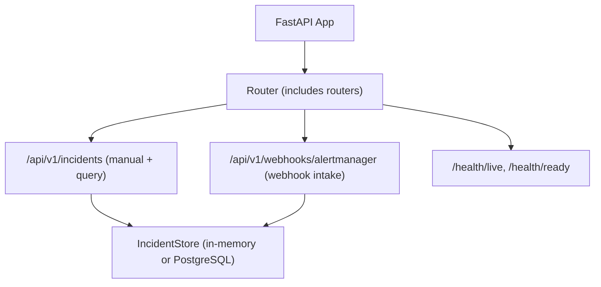
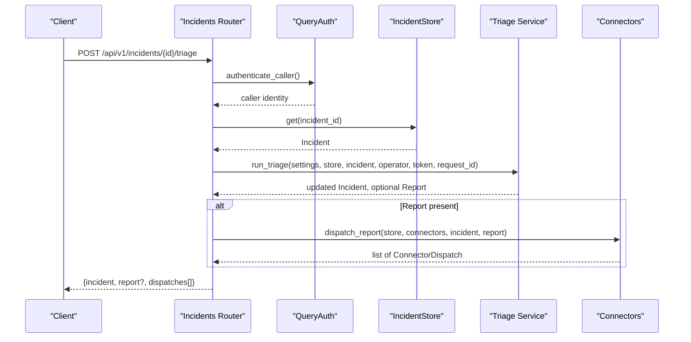
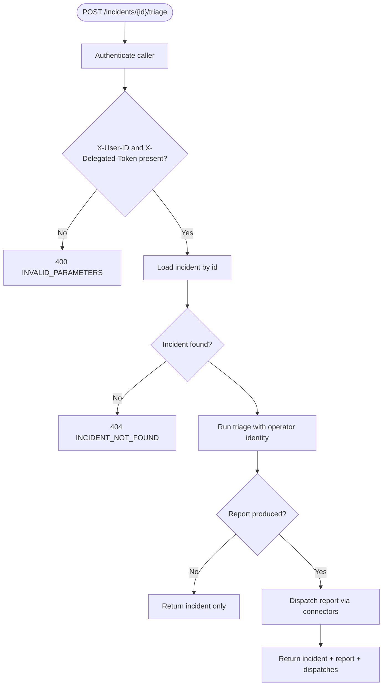
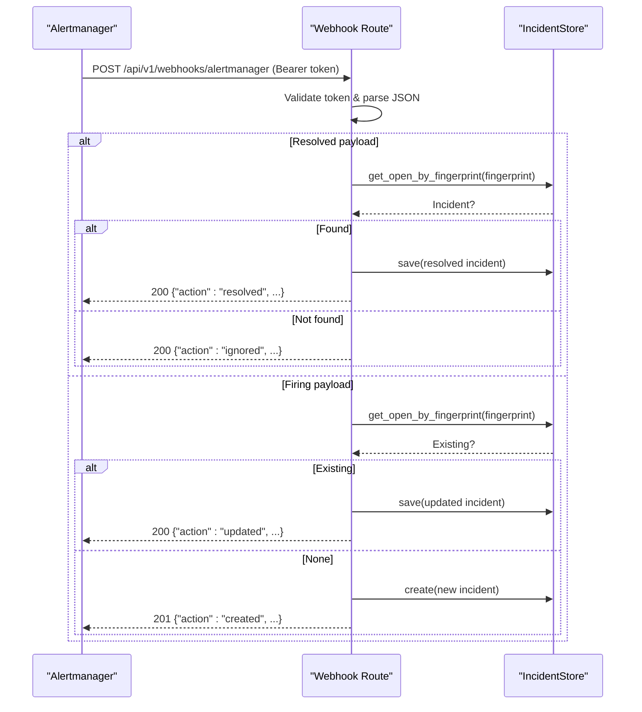
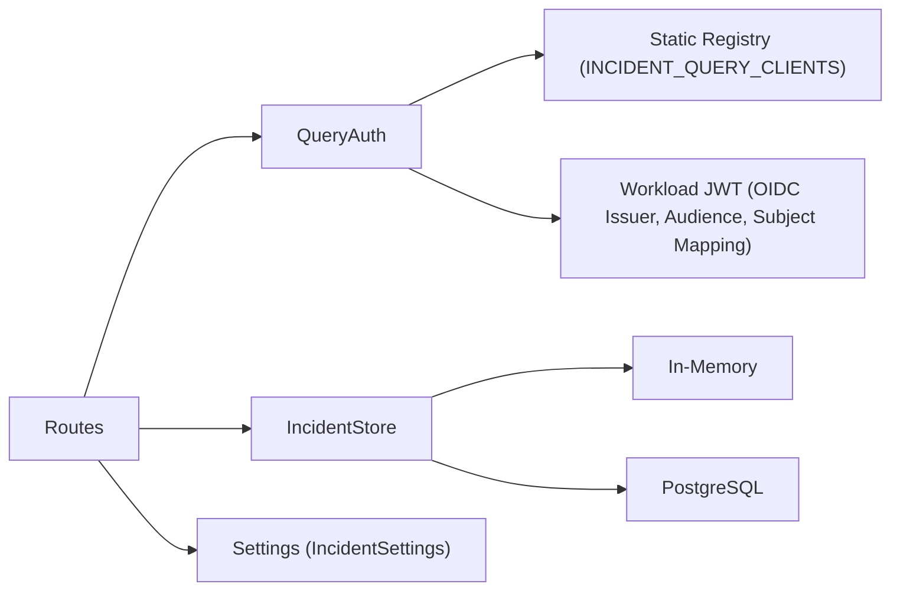

# Incident Management Endpoints

<cite>
**Referenced Files in This Document**
- [incidents.py](file://products/incident-service/src/incident_service/api/routes/incidents.py)
- [webhooks.py](file://products/incident-service/src/incident_service/api/routes/webhooks.py)
- [incident.schema.json](file://shared/shared-contracts/schemas/incident.schema.json)
- [incident.py](file://products/incident-service/src/incident_service/schemas/incident.py)
- [query_auth.py](file://products/incident-service/src/incident_service/services/query_auth.py)
- [config.py](file://products/incident-service/src/incident_service/core/config.py)
- [incident_store.py](file://products/incident-service/src/incident_service/services/incident_store.py)
- [router.py](file://products/incident-service/src/incident_service/api/router.py)
</cite>

## Table of Contents
1. Introduction
2. Project Structure
3. Core Components
4. Architecture Overview
5. Detailed Component Analysis
6. Dependency Analysis
7. Performance Considerations
8. Troubleshooting Guide
9. Conclusion

## Introduction
This document specifies the REST API for incident management in the Incident Service. It covers creating incidents from alerts and manual reports, retrieving incident details, listing with filtering and pagination, triage workflows, and webhook ingestion. Authentication, request/response schemas, error responses, and best practices are included to help clients integrate safely and efficiently.

## Project Structure
The Incident Service exposes:
- Manual intake and query endpoints under /api/v1/incidents
- Alertmanager webhook intake under /api/v1/webhooks/alertmanager
- Health endpoints under /health/live and /health/ready

Routes are mounted via a central router that includes health, webhooks, and incidents modules.

**Diagram sources**
- [router.py:1-9](file://products/incident-service/src/incident_service/api/router.py#L1-L9)
- [incidents.py:41-42](file://products/incident-service/src/incident_service/api/routes/incidents.py#L41-L42)
- [webhooks.py:39-40](file://products/incident-service/src/incident_service/api/routes/webhooks.py#L39-L40)
- [incident_store.py:30-66](file://products/incident-service/src/incident_service/services/incident_store.py#L30-L66)

**Section sources**
- [router.py:1-9](file://products/incident-service/src/incident_service/api/router.py#L1-L9)
- [incidents.py:41-42](file://products/incident-service/src/incident_service/api/routes/incidents.py#L41-L42)
- [webhooks.py:39-40](file://products/incident-service/src/incident_service/api/routes/webhooks.py#L39-L40)
- [health.py:14-34](file://products/incident-service/src/incident_service/api/routes/health.py#L14-L34)

## Core Components
- Incident model and enums bound to the shared contract schema
- Query authentication supporting static Basic credentials and workload JWT tokens
- Store abstraction with in-memory and PostgreSQL backends
- Webhook intake with token-based auth and idempotent dedupe semantics
- Triage trigger requiring operator identity and delegated bearer token

Key behaviors:
- Manual POST creates a new incident with a unique fingerprint; always succeeds even if labels are large but validated against limits
- Webhook POST updates existing open incidents by fingerprint or creates new ones; resolved payloads close matching open incidents
- GET /incidents supports offset/limit pagination and filters on status, severity, source
- GET /incidents/{id} returns full envelope plus report and dispatches when available
- POST /incidents/{id}/triage runs triage under operator identity and optional connector dispatches

**Section sources**
- [incident.py:18-116](file://products/incident-service/src/incident_service/schemas/incident.py#L18-L116)
- [incident.schema.json:1-95](file://shared/shared-contracts/schemas/incident.schema.json#L1-L95)
- [query_auth.py:1-117](file://products/incident-service/src/incident_service/services/query_auth.py#L1-L117)
- [incident_store.py:30-66](file://products/incident-service/src/incident_service/services/incident_store.py#L30-L66)
- [webhooks.py:1-206](file://products/incident-service/src/incident_service/api/routes/webhooks.py#L1-L206)
- [incidents.py:74-283](file://products/incident-service/src/incident_service/api/routes/incidents.py#L74-L283)

## Architecture Overview
The service separates concerns into routes, services, and storage:
- Routes validate inputs, enforce authentication, and orchestrate calls to services
- Services implement business logic (normalization, triage, connectors)
- Stores abstract persistence with consistent interfaces across in-memory and PostgreSQL

**Diagram sources**
- [incidents.py:235-283](file://products/incident-service/src/incident_service/api/routes/incidents.py#L235-L283)
- [query_auth.py:104-117](file://products/incident-service/src/incident_service/services/query_auth.py#L104-L117)
- [incident_store.py:30-66](file://products/incident-service/src/incident_service/services/incident_store.py#L30-L66)

## Detailed Component Analysis

### Create Incident (Manual)
- Method: POST
- Path: /api/v1/incidents
- Authentication: Platform-caller credential required (Basic or Bearer workload token)
- Request body: ManualIncidentRequest fields
  - title: string, 1..200 chars
  - summary: string, 0..2000 chars
  - severity: enum ["critical","warning","info"], default "warning"
  - labels: map<string,string>, max entries enforced by normalization constants
- Optional headers:
  - X-Reported-By: operator name used for reported_by (falls back to authenticated caller)
- Response: 201 Created with Incident envelope per incident.schema.json
- Errors:
  - 401 UNAUTHORIZED: missing or invalid platform-caller credential
  - 400 INVALID_PAYLOAD: malformed JSON or validation failure (e.g., label count/length exceeded)

Notes:
- Each manual incident gets a unique fingerprint starting with "manual:" to avoid collisions
- Metrics and observability events are recorded on success

**Section sources**
- [incidents.py:50-128](file://products/incident-service/src/incident_service/api/routes/incidents.py#L50-L128)
- [incident.schema.json:19-91](file://shared/shared-contracts/schemas/incident.schema.json#L19-L91)
- [incident.py:37-63](file://products/incident-service/src/incident_service/schemas/incident.py#L37-L63)

### List Incidents
- Method: GET
- Path: /api/v1/incidents
- Authentication: Platform-caller credential required
- Query parameters:
  - offset: integer >= 0, default 0
  - limit: integer 1..100, default 20
  - status: one of ["new","triaging","triaged","triage_failed","resolved"]
  - severity: one of ["critical","warning","info"]
  - source: one of ["alertmanager","manual"]
- Response: 200 OK with paginated list
  - incidents: array of list_entry objects (envelope without summary)
  - total: total matching count
  - offset: requested offset
  - limit: requested limit
- Errors:
  - 401 UNAUTHORIZED: missing or invalid platform-caller credential
  - 400 INVALID_PARAMETERS: invalid offset/limit or unknown filter values

Best practices:
- Use small page sizes and server-side filtering to reduce payload size
- Prefer filtering by status/severity/source to narrow results before pagination

**Section sources**
- [incidents.py:131-176](file://products/incident-service/src/incident_service/api/routes/incidents.py#L131-L176)
- [incident_store.py:105-124](file://products/incident-service/src/incident_service/services/incident_store.py#L105-L124)
- [incident_store.py:352-379](file://products/incident-service/src/incident_service/services/incident_store.py#L352-L379)

### Get Incident Details
- Method: GET
- Path: /api/v1/incidents/{incident_id}
- Authentication: Platform-caller credential required
- Response: 200 OK with object containing:
  - incident: full Incident envelope
  - report: TriageReport envelope or null
  - dispatches: array of ConnectorDispatch records
- Errors:
  - 401 UNAUTHORIZED: missing or invalid platform-caller credential
  - 404 INCIDENT_NOT_FOUND: unknown incident_id

**Section sources**
- [incidents.py:179-206](file://products/incident-service/src/incident_service/api/routes/incidents.py#L179-L206)
- [incident_store.py:324-335](file://products/incident-service/src/incident_service/services/incident_store.py#L324-L335)

### Get Triage Report
- Method: GET
- Path: /api/v1/incidents/{incident_id}/report
- Authentication: Platform-caller credential required
- Response: 200 OK with TriageReport envelope
- Errors:
  - 401 UNAUTHORIZED: missing or invalid platform-caller credential
  - 404 INCIDENT_NOT_FOUND: unknown incident_id
  - 404 REPORT_NOT_FOUND: no triage report exists for this incident

**Section sources**
- [incidents.py:209-232](file://products/incident-service/src/incident_service/api/routes/incidents.py#L209-L232)
- [incident_store.py:418-432](file://products/incident-service/src/incident_service/services/incident_store.py#L418-L432)

### Trigger Triage
- Method: POST
- Path: /api/v1/incidents/{incident_id}/triage
- Authentication: Platform-caller credential required
- Required headers:
  - X-User-ID: operator identity
  - X-Delegated-Token: operator’s delegated bearer token
- Behavior:
  - Validates presence of operator headers
  - Runs triage under operator identity with timeout configured by settings
  - Optionally dispatches triage report through configured connectors
- Response: 200 OK with:
  - incident: updated Incident envelope
  - report: TriageReport envelope or null
  - dispatches: array of ConnectorDispatch outcomes
- Errors:
  - 401 UNAUTHORIZED: missing or invalid platform-caller credential
  - 400 INVALID_PARAMETERS: missing X-User-ID or X-Delegated-Token
  - 404 INCIDENT_NOT_FOUND: unknown incident_id

**Diagram sources**
- [incidents.py:235-283](file://products/incident-service/src/incident_service/api/routes/incidents.py#L235-L283)

**Section sources**
- [incidents.py:235-283](file://products/incident-service/src/incident_service/api/routes/incidents.py#L235-L283)

### Alertmanager Webhook Intake
- Method: POST
- Path: /api/v1/webhooks/alertmanager
- Authentication: Bearer token must match configured INCIDENT_WEBHOOK_TOKEN
- Behavior:
  - If token not configured, returns 503 WEBHOOK_NOT_CONFIGURED
  - Normalizes alert payload and either:
    - Creates a new incident (status "new")
    - Updates an existing open incident by fingerprint
    - Resolves an existing open incident by fingerprint
  - Idempotent: resolving an unknown fingerprint is a no-op success
- Response:
  - 201 Created when a new incident is created
  - 200 OK with action "updated", "resolved", or "ignored"
- Errors:
  - 503 WEBHOOK_NOT_CONFIGURED: webhook token not set
  - 401 UNAUTHORIZED: invalid webhook token
  - 400 INVALID_PAYLOAD: malformed JSON or normalization failure

**Diagram sources**
- [webhooks.py:57-102](file://products/incident-service/src/incident_service/api/routes/webhooks.py#L57-L102)
- [webhooks.py:105-206](file://products/incident-service/src/incident_service/api/routes/webhooks.py#L105-L206)
- [incident_store.py:94-103](file://products/incident-service/src/incident_service/services/incident_store.py#L94-L103)
- [incident_store.py:337-350](file://products/incident-service/src/incident_service/services/incident_store.py#L337-L350)

**Section sources**
- [webhooks.py:1-206](file://products/incident-service/src/incident_service/api/routes/webhooks.py#L1-L206)

### Data Model Reference
All incident envelopes conform to the shared contract schema. Key fields include:
- incident_id: globally unique, pattern inc-[a-z0-9-]+
- fingerprint: dedupe key; "manual:<uuid>" for manual, groupKey/hash for alertmanager
- source: "alertmanager" | "manual"
- severity: "critical" | "warning" | "info"
- status: "new" | "triaging" | "triaged" | "triage_failed" | "resolved"
- title, summary, labels, reported_by, session_id, triage_raw, timestamps, resolved_at

List entries exclude summary to reduce payload size.

**Section sources**
- [incident.schema.json:1-95](file://shared/shared-contracts/schemas/incident.schema.json#L1-L95)
- [incident.py:37-63](file://products/incident-service/src/incident_service/schemas/incident.py#L37-L63)

## Dependency Analysis
Authentication and configuration dependencies:
- Query authentication supports two paths:
  - Static Basic credentials verified against INCIDENT_QUERY_CLIENTS
  - Workload JWT tokens validated against cluster OIDC issuer JWKS and mapped via INCIDENT_WORKLOAD_CLIENTS
- Settings control webhook token, store backend, database URL, connectors, agent service URL, triage timeout, and audit integration

**Diagram sources**
- [query_auth.py:1-117](file://products/incident-service/src/incident_service/services/query_auth.py#L1-L117)
- [config.py:72-126](file://products/incident-service/src/incident_service/core/config.py#L72-L126)
- [incident_store.py:508-517](file://products/incident-service/src/incident_service/services/incident_store.py#L508-L517)

**Section sources**
- [query_auth.py:1-117](file://products/incident-service/src/incident_service/services/query_auth.py#L1-L117)
- [config.py:72-126](file://products/incident-service/src/incident_service/core/config.py#L72-L126)

## Performance Considerations
- Pagination: Use offset/limit with reasonable limits (max 100). Smaller pages reduce memory and network overhead.
- Filtering: Apply status, severity, and source filters to minimize result sets before pagination.
- Webhook idempotency: Dedupe by fingerprint ensures safe retries and avoids duplicate incidents.
- Store selection: In-memory store is suitable for tests/dev; PostgreSQL provides durable storage with indexes on status, created_at, and fingerprint for efficient queries.
- Triage timeouts: Configure INCIDENT_TRIAGE_TIMEOUT_SECONDS to balance responsiveness and long-running triage tasks.

[No sources needed since this section provides general guidance]

## Troubleshooting Guide
Common errors and resolutions:
- 401 UNAUTHORIZED (query endpoints): Ensure Authorization header contains valid Basic or Bearer token configured in INCIDENT_QUERY_CLIENTS or workload mapping.
- 401 UNAUTHORIZED (webhook): Verify Bearer token matches INCIDENT_WEBHOOK_TOKEN.
- 503 WEBHOOK_NOT_CONFIGURED: Set INCIDENT_WEBHOOK_TOKEN before enabling webhook intake.
- 400 INVALID_PAYLOAD: Fix malformed JSON or field constraints (e.g., label length/count, title/summary lengths).
- 400 INVALID_PARAMETERS: Correct offset/limit ranges and allowed enum values for filters.
- 404 INCIDENT_NOT_FOUND: Confirm incident_id exists before reading or triaging.
- 404 REPORT_NOT_FOUND: Triage must be run first to produce a report.

Operational checks:
- Use /health/live and /health/ready to verify service readiness and store connectivity.

**Section sources**
- [incidents.py:63-67](file://products/incident-service/src/incident_service/api/routes/incidents.py#L63-L67)
- [webhooks.py:46-50](file://products/incident-service/src/incident_service/api/routes/webhooks.py#L46-L50)
- [health.py:14-34](file://products/incident-service/src/incident_service/api/routes/health.py#L14-L34)

## Conclusion
The Incident Service provides a robust, secure, and efficient API for managing incidents from both automated alerts and manual reports. It enforces strict authentication, validates payloads against canonical schemas, supports idempotent webhook ingestion, and offers flexible querying with pagination and filters. Clients should use appropriate authentication, respect rate considerations via pagination and filtering, and handle documented error codes for resilient integrations.