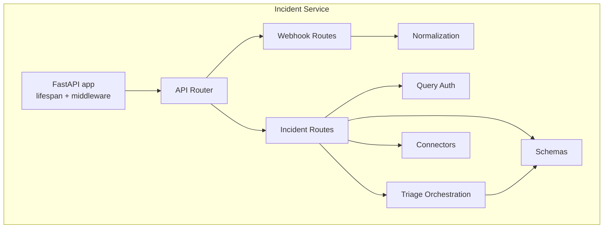
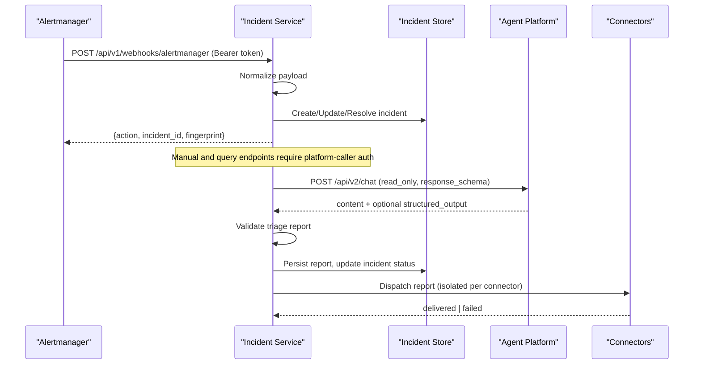
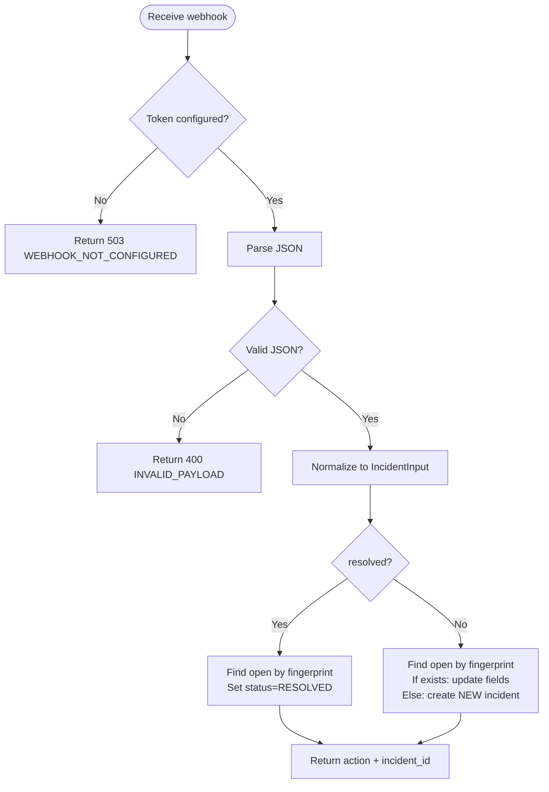
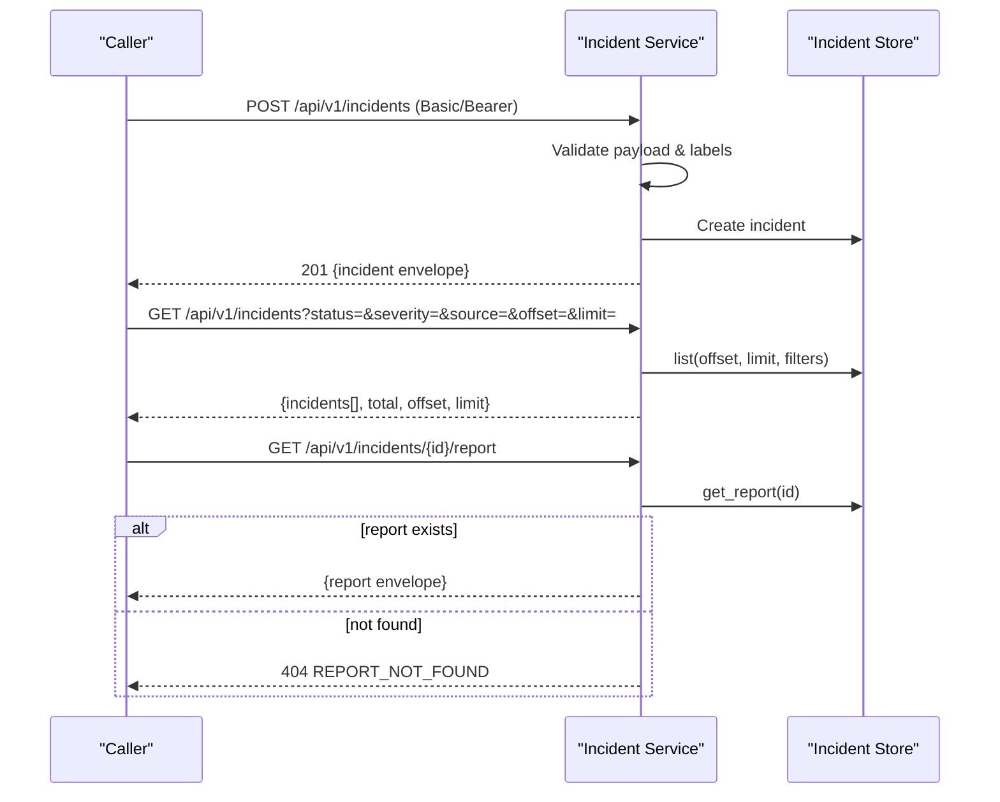
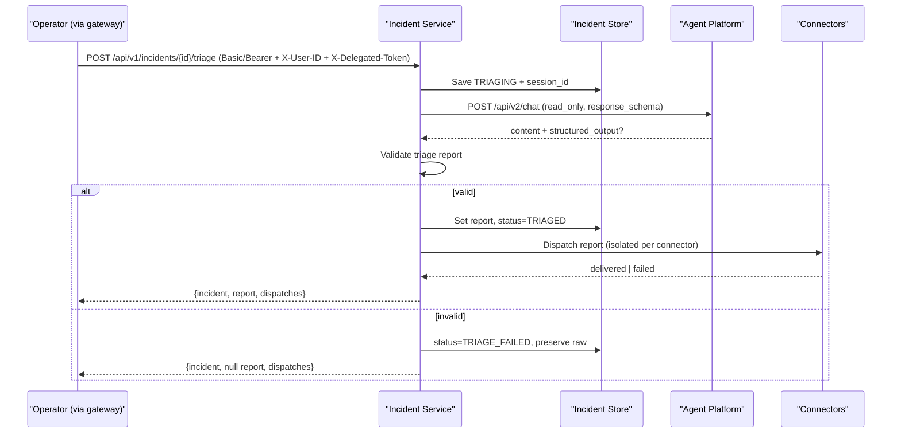
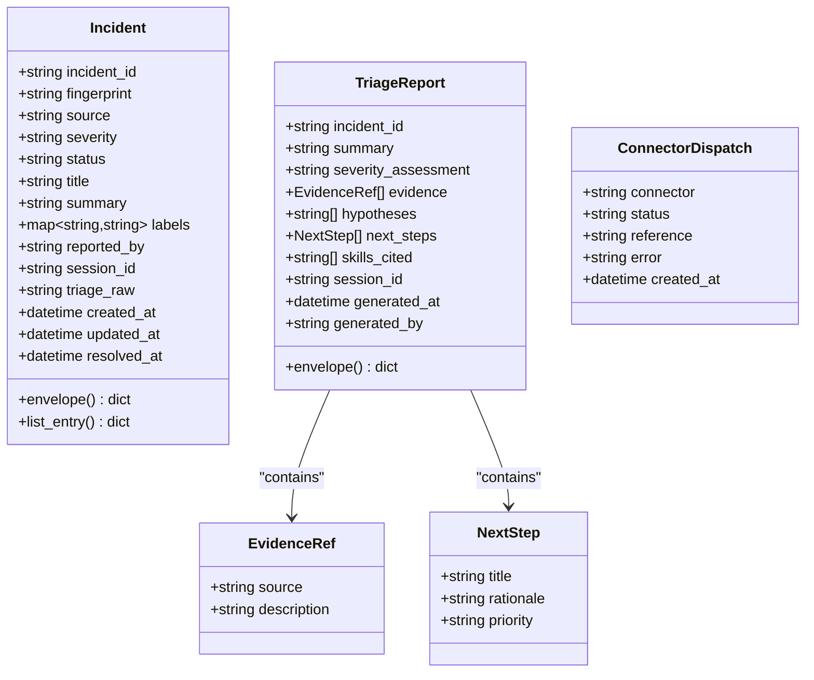
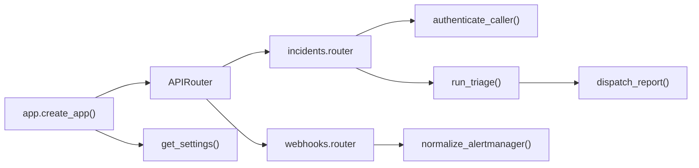

# Incident Service API

<cite>
**Referenced Files in This Document**
- [app.py](file://products/incident-service/src/incident_service/app.py)
- [main.py](file://products/incident-service/src/incident_service/main.py)
- [router.py](file://products/incident-service/src/incident_service/api/router.py)
- [incidents.py](file://products/incident-service/src/incident_service/api/routes/incidents.py)
- [webhooks.py](file://products/incident-service/src/incident_service/api/routes/webhooks.py)
- [incident.py](file://products/incident-service/src/incident_service/schemas/incident.py)
- [triage.py](file://products/incident-service/src/incident_service/services/triage.py)
- [normalization.py](file://products/incident-service/src/incident_service/services/normalization.py)
- [connectors.py](file://products/incident-service/src/incident_service/services/connectors.py)
- [query_auth.py](file://products/incident-service/src/incident_service/services/query_auth.py)
- [config.py](file://products/incident-service/src/incident_service/core/config.py)
- [incident.schema.json](file://shared/shared-contracts/schemas/incident.schema.json)
- [triage-report.schema.json](file://shared/shared-contracts/schemas/triage-report.schema.json)
- [README.md](file://products/incident-service/README.md)
</cite>

## Table of Contents
1. Introduction
2. Project Structure
3. Core Components
4. Architecture Overview
5. Detailed Component Analysis
6. Dependency Analysis
7. Performance Considerations
8. Troubleshooting Guide
9. Conclusion
10. Appendices

## Introduction
The Incident Service provides alert intake, automated triage, and incident collaboration for the AIOps platform. It accepts alerts from external monitoring systems via webhooks, supports manual incident creation by operators, runs agent-driven triage to produce structured reports, and dispatches outcomes through pluggable connectors (e.g., audit). All incidents are normalized into a canonical schema and can be queried with filtering and pagination. Triage is operator-initiated and strictly read-only during triage; operational actions are out of scope for this service.

## Project Structure
The service is a FastAPI application that wires routers for health, webhooks, and incidents. Schemas define the canonical incident envelope and triage report. Services implement normalization, authentication, triage orchestration, and connector dispatch. Configuration is loaded from environment variables at startup.

**Diagram sources**
- [app.py:20-69](file://products/incident-service/src/incident_service/app.py#L20-L69)
- [router.py:1-9](file://products/incident-service/src/incident_service/api/router.py#L1-L9)
- [webhooks.py:1-206](file://products/incident-service/src/incident_service/api/routes/webhooks.py#L1-L206)
- [incidents.py:1-283](file://products/incident-service/src/incident_service/api/routes/incidents.py#L1-L283)
- [incident.py:1-116](file://products/incident-service/src/incident_service/schemas/incident.py#L1-L116)
- [normalization.py:1-110](file://products/incident-service/src/incident_service/services/normalization.py#L1-L110)
- [query_auth.py:1-117](file://products/incident-service/src/incident_service/services/query_auth.py#L1-L117)
- [triage.py:1-371](file://products/incident-service/src/incident_service/services/triage.py#L1-L371)
- [connectors.py:1-127](file://products/incident-service/src/incident_service/services/connectors.py#L1-L127)

**Section sources**
- [app.py:20-69](file://products/incident-service/src/incident_service/app.py#L20-L69)
- [router.py:1-9](file://products/incident-service/src/incident_service/api/router.py#L1-L9)
- [README.md:33-41](file://products/incident-service/README.md#L33-L41)

## Core Components
- Webhook intake: Accepts Alertmanager v4 payloads, authenticates via shared bearer token, normalizes into a canonical input, dedupes by fingerprint, creates or updates incidents, and resolves open incidents on resolution events.
- Manual intake: Creates incidents from operator requests authenticated via platform-caller credentials (Basic or workload token), with label validation and limits.
- Query API: Lists and retrieves incidents with filters and pagination; returns full details including latest triage report and connector dispatch outcomes.
- Triage: Operator-initiated run that calls agent-platform chat with a dedicated session, enforces read-only mode, validates structured output against the triage report schema, persists the report, updates incident status, and dispatches to configured connectors.
- Connectors: Pluggable adapters that push validated triage reports to collaboration surfaces; failures are recorded but do not fail triage.
- Authentication: Query endpoints use static Basic credentials or projected workload tokens; webhook endpoints use a separate shared bearer token.

**Section sources**
- [webhooks.py:1-206](file://products/incident-service/src/incident_service/api/routes/webhooks.py#L1-L206)
- [incidents.py:1-283](file://products/incident-service/src/incident_service/api/routes/incidents.py#L1-L283)
- [triage.py:1-371](file://products/incident-service/src/incident_service/services/triage.py#L1-L371)
- [connectors.py:1-127](file://products/incident-service/src/incident_service/services/connectors.py#L1-L127)
- [query_auth.py:1-117](file://products/incident-service/src/incident_service/services/query_auth.py#L1-L117)
- [config.py:72-126](file://products/incident-service/src/incident_service/core/config.py#L72-L126)

## Architecture Overview
The service exposes REST endpoints under /api/v1. Webhooks receive high-volume alerts and normalize them into canonical inputs. Manual and query endpoints require platform-caller authentication. Triage integrates with agent-platform using an operator’s delegated bearer and produces schema-validated reports. Connector dispatch is isolated per target and never fails the triage path.

**Diagram sources**
- [webhooks.py:69-103](file://products/incident-service/src/incident_service/api/routes/webhooks.py#L69-L103)
- [normalization.py:68-110](file://products/incident-service/src/incident_service/services/normalization.py#L68-L110)
- [triage.py:219-276](file://products/incident-service/src/incident_service/services/triage.py#L219-L276)
- [connectors.py:87-127](file://products/incident-service/src/incident_service/services/connectors.py#L87-L127)

## Detailed Component Analysis

### Webhook Endpoints
- Endpoint: POST /api/v1/webhooks/alertmanager
- Authentication: Bearer token matching INCIDENT_WEBHOOK_TOKEN; if unconfigured, returns 503.
- Behavior:
  - Parses JSON, normalizes Alertmanager v4 payload to canonical input.
  - Dedupes by fingerprint: firing updates existing open incident or creates new; resolved closes open incident; unknown resolution is idempotent no-op success.
  - Records metrics and logs intake events.
- Error handling:
  - Invalid JSON or malformed payload returns 400 with INVALID_PAYLOAD.
  - Unauthorized returns 401 UNAUTHORIZED.
  - Unconfigured token returns 503 WEBHOOK_NOT_CONFIGURED.

**Diagram sources**
- [webhooks.py:57-103](file://products/incident-service/src/incident_service/api/routes/webhooks.py#L57-L103)
- [webhooks.py:105-206](file://products/incident-service/src/incident_service/api/routes/webhooks.py#L105-L206)
- [normalization.py:68-110](file://products/incident-service/src/incident_service/services/normalization.py#L68-L110)

**Section sources**
- [webhooks.py:1-206](file://products/incident-service/src/incident_service/api/routes/webhooks.py#L1-L206)
- [normalization.py:1-110](file://products/incident-service/src/incident_service/services/normalization.py#L1-L110)
- [config.py:72-126](file://products/incident-service/src/incident_service/core/config.py#L72-L126)

### Manual Intake and Query Endpoints
- Endpoints:
  - POST /api/v1/incidents — create manual incident
  - GET /api/v1/incidents — list with offset/limit/status/severity/source filters
  - GET /api/v1/incidents/{incident_id} — get full record with latest report and dispatches
  - GET /api/v1/incidents/{incident_id}/report — get triage report (404 when absent)
- Authentication: Platform-caller credentials via Authorization header:
  - Basic: client_id:secret against INCIDENT_QUERY_CLIENTS registry
  - Workload: Bearer token validated against cluster OIDC issuer JWKS with audience and subject mapping
- Validation:
  - Manual request body validated; labels limited in count and length; title/summary bounded.
  - List parameters validated; limit capped at MAX_LIST_LIMIT.
- Responses:
  - Creation returns 201 with incident envelope.
  - Get/List return envelopes; list includes total and pagination metadata.
  - Report endpoint returns 404 REPORT_NOT_FOUND when missing.

**Diagram sources**
- [incidents.py:74-129](file://products/incident-service/src/incident_service/api/routes/incidents.py#L74-L129)
- [incidents.py:131-176](file://products/incident-service/src/incident_service/api/routes/incidents.py#L131-L176)
- [incidents.py:179-232](file://products/incident-service/src/incident_service/api/routes/incidents.py#L179-L232)
- [query_auth.py:104-117](file://products/incident-service/src/incident_service/services/query_auth.py#L104-L117)

**Section sources**
- [incidents.py:1-283](file://products/incident-service/src/incident_service/api/routes/incidents.py#L1-L283)
- [query_auth.py:1-117](file://products/incident-service/src/incident_service/services/query_auth.py#L1-L117)
- [incident.py:1-116](file://products/incident-service/src/incident_service/schemas/incident.py#L1-L116)

### Triage Endpoint and Agent Collaboration
- Endpoint: POST /api/v1/incidents/{incident_id}/triage
- Authentication: Platform-caller credential plus operator identity headers relayed by platform-gateway:
  - X-User-ID: operator identifier
  - X-Delegated-Token: operator’s delegated bearer
- Behavior:
  - Sets incident status to TRIAGING and records session_id.
  - Establishes a dedicated agent session (incident-{id}, fallback per-operator).
  - Calls agent-platform /api/v2/chat with read_only=true and response_schema set to the triage report schema.
  - Validates output: prefers kernel-validated structured_output; falls back to fenced triage-report block parsing.
  - Persists report, sets status to TRIAGED, and dispatches to configured connectors.
  - On failure, sets status to TRIAGE_FAILED and preserves raw agent text up to size limit.
- Response: Returns updated incident, report (if any), and connector dispatch outcomes.

**Diagram sources**
- [incidents.py:235-283](file://products/incident-service/src/incident_service/api/routes/incidents.py#L235-L283)
- [triage.py:219-276](file://products/incident-service/src/incident_service/services/triage.py#L219-L276)
- [triage.py:290-371](file://products/incident-service/src/incident_service/services/triage.py#L290-L371)
- [connectors.py:87-127](file://products/incident-service/src/incident_service/services/connectors.py#L87-L127)

**Section sources**
- [incidents.py:235-283](file://products/incident-service/src/incident_service/api/routes/incidents.py#L235-L283)
- [triage.py:1-371](file://products/incident-service/src/incident_service/services/triage.py#L1-L371)
- [connectors.py:1-127](file://products/incident-service/src/incident_service/services/connectors.py#L1-L127)

### Data Models and Schemas
- Incident envelope: Canonical model for incidents created from alerts or manual reports. Includes identifiers, source, severity, status, title, summary, labels, timestamps, and optional fields like reported_by, session_id, triage_raw, resolved_at.
- Triage report: Structured assessment with summary, severity_assessment, evidence references, hypotheses, next_steps, skills_cited, session_id, generated_at, generated_by.
- Connector dispatch: Outcome per connector with status delivered/failed, optional reference and error, timestamp.

**Diagram sources**
- [incident.py:37-116](file://products/incident-service/src/incident_service/schemas/incident.py#L37-L116)

**Section sources**
- [incident.schema.json:1-95](file://shared/shared-contracts/schemas/incident.schema.json#L1-L95)
- [triage-report.schema.json:1-120](file://shared/shared-contracts/schemas/triage-report.schema.json#L1-L120)
- [incident.py:1-116](file://products/incident-service/src/incident_service/schemas/incident.py#L1-L116)

## Dependency Analysis
- Application wiring: The FastAPI app configures lifespan to build connectors and initialize the store, includes routers, sets up metrics and telemetry, and adds HTTP logging middleware.
- Routing: Central router aggregates health, webhooks, and incidents routes.
- Services:
  - Normalization isolates alert dialects and feeds canonical intake.
  - Query auth supports both static Basic and workload JWT flows without runtime dependency on identity broker.
  - Triage orchestrates agent interaction and report validation.
  - Connectors provide pluggable dispatch with isolation and observability.
- Configuration: Settings loaded from environment include webhook token, query clients, workload settings, store backend, connectors, agent service URL, timeouts, and audit integration.

**Diagram sources**
- [app.py:42-69](file://products/incident-service/src/incident_service/app.py#L42-L69)
- [router.py:1-9](file://products/incident-service/src/incident_service/api/router.py#L1-L9)
- [incidents.py:74-129](file://products/incident-service/src/incident_service/api/routes/incidents.py#L74-L129)
- [webhooks.py:69-103](file://products/incident-service/src/incident_service/api/routes/webhooks.py#L69-L103)
- [triage.py:290-371](file://products/incident-service/src/incident_service/services/triage.py#L290-L371)
- [connectors.py:87-127](file://products/incident-service/src/incident_service/services/connectors.py#L87-L127)
- [config.py:90-126](file://products/incident-service/src/incident_service/core/config.py#L90-L126)

**Section sources**
- [app.py:20-69](file://products/incident-service/src/incident_service/app.py#L20-L69)
- [router.py:1-9](file://products/incident-service/src/incident_service/api/router.py#L1-L9)
- [config.py:72-126](file://products/incident-service/src/incident_service/core/config.py#L72-L126)

## Performance Considerations
- High-volume alert ingestion:
  - Webhook handler performs lightweight normalization and deduplication before persistence.
  - Metrics are recorded for intake counts; open incident counters are updated after changes.
  - Ensure INCIDENT_WEBHOOK_TOKEN is configured to avoid 503 failures; consider rate limiting at the ingress layer (outside this service) to protect downstream stores.
- Triage timeout:
  - Triage uses a configurable timeout (INCIDENT_TRIAGE_TIMEOUT_SECONDS) to bound agent calls; adjust based on expected latency.
- Connector isolation:
  - Each connector dispatch is isolated; failures are recorded but do not block other connectors or the triage flow.
- Pagination and filtering:
  - List endpoint caps limit to MAX_LIST_LIMIT to prevent large responses; use appropriate offsets and filters.

[No sources needed since this section provides general guidance]

## Troubleshooting Guide
Common errors and resolutions:
- Webhook 503 WEBHOOK_NOT_CONFIGURED: INCIDENT_WEBHOOK_TOKEN is empty; configure it to enable alert intake.
- Webhook 401 UNAUTHORIZED: Provided Bearer token does not match INCIDENT_WEBHOOK_TOKEN; verify token configuration.
- Webhook 400 INVALID_PAYLOAD: Malformed JSON or unsupported payload structure; ensure Alertmanager v4 format and required fields.
- Manual intake 400 INVALID_PAYLOAD: Body validation failed (e.g., labels exceed limits or too long); check label count and key/value lengths.
- Triage 400 INVALID_PARAMETERS: Missing X-User-ID or X-Delegated-Token; ensure platform-gateway relays these headers.
- Triage failures: Status becomes TRIAGE_FAILED with triage_raw preserved; inspect stored raw text to diagnose agent output issues.
- Report 404 REPORT_NOT_FOUND: No triage report exists for the incident; run triage first.

**Section sources**
- [webhooks.py:57-103](file://products/incident-service/src/incident_service/api/routes/webhooks.py#L57-L103)
- [incidents.py:74-129](file://products/incident-service/src/incident_service/api/routes/incidents.py#L74-L129)
- [incidents.py:235-283](file://products/incident-service/src/incident_service/api/routes/incidents.py#L235-L283)
- [triage.py:279-371](file://products/incident-service/src/incident_service/services/triage.py#L279-L371)

## Conclusion
The Incident Service offers robust alert intake, manual reporting, operator-driven triage, and extensible collaboration via connectors. It enforces strict schemas, secure authentication paths, and resilient error handling. Use the webhook for high-volume monitoring integrations, the manual endpoints for operator workflows, and the triage endpoint to generate actionable insights backed by evidence and advisory next steps.

[No sources needed since this section summarizes without analyzing specific files]

## Appendices

### API Reference Summary
- POST /api/v1/webhooks/alertmanager
  - Auth: Bearer INCIDENT_WEBHOOK_TOKEN
  - Input: Alertmanager v4 webhook payload
  - Output: {action, incident_id, fingerprint}
- POST /api/v1/incidents
  - Auth: Basic or Bearer (platform-caller)
  - Input: {title, summary?, severity?, labels?}
  - Output: 201 {incident envelope}
- GET /api/v1/incidents
  - Auth: Basic or Bearer (platform-caller)
  - Query: offset, limit, status?, severity?, source?
  - Output: {incidents[], total, offset, limit}
- GET /api/v1/incidents/{incident_id}
  - Auth: Basic or Bearer (platform-caller)
  - Output: {incident envelope, report envelope?, dispatches[]}
- GET /api/v1/incidents/{incident_id}/report
  - Auth: Basic or Bearer (platform-caller)
  - Output: {report envelope} or 404
- POST /api/v1/incidents/{incident_id}/triage
  - Auth: Basic or Bearer (platform-caller) + X-User-ID + X-Delegated-Token
  - Output: {incident envelope, report envelope?, dispatches[]}

**Section sources**
- [README.md:33-41](file://products/incident-service/README.md#L33-L41)
- [incidents.py:74-283](file://products/incident-service/src/incident_service/api/routes/incidents.py#L74-L283)
- [webhooks.py:69-103](file://products/incident-service/src/incident_service/api/routes/webhooks.py#L69-L103)

### Environment Variables
- INCIDENT_WEBHOOK_TOKEN: Shared bearer token for Alertmanager webhook intake.
- INCIDENT_QUERY_CLIENTS: Static platform-caller registry (client_id=secret,...).
- INCIDENT_WORKLOAD_ISSUER_URL, INCIDENT_WORKLOAD_AUDIENCE, INCIDENT_WORKLOAD_CLIENTS: Projected workload-token auth configuration.
- INCIDENT_STORE_BACKEND: memory or postgres.
- INCIDENT_DB_URL: PostgreSQL connection URL for postgres backend.
- INCIDENT_CONNECTORS: Comma-separated connector names; defaults to audit.
- INCIDENT_AGENT_SERVICE_URL, INCIDENT_TRIAGE_TIMEOUT_SECONDS: Agent chat endpoint and triage turn timeout.
- INCIDENT_AUDIT_SERVICE_URL, INCIDENT_AUDIT_CLIENT_ID, INCIDENT_AUDIT_CLIENT_SECRET: Audit integration for built-in connector.

**Section sources**
- [config.py:72-126](file://products/incident-service/src/incident_service/core/config.py#L72-L126)
- [README.md:43-60](file://products/incident-service/README.md#L43-L60)