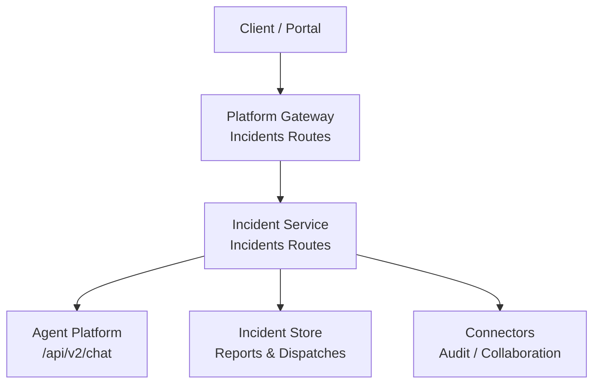
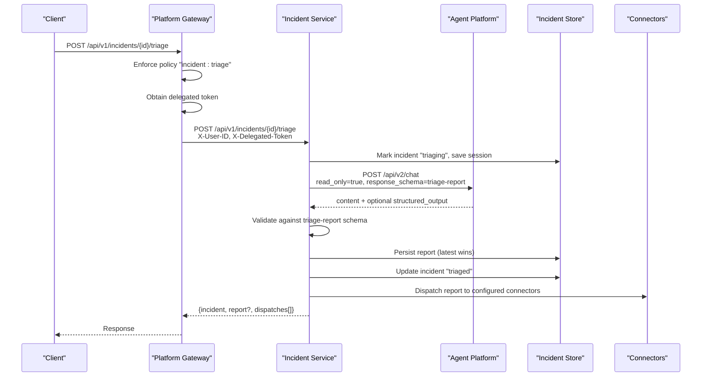
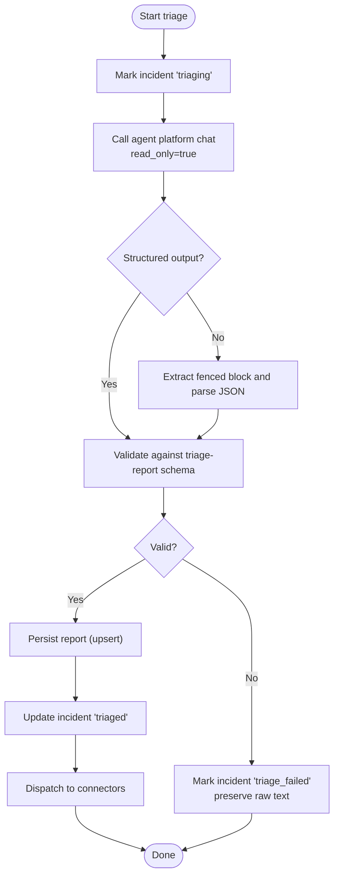
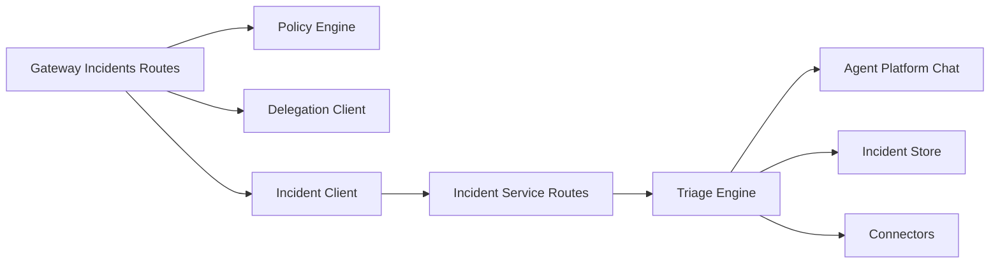

# Triage Report Generation

<cite>
**Referenced Files in This Document**
- [triage-report.schema.json](file://shared/shared-contracts/schemas/triage-report.schema.json)
- [incidents.py](file://products/incident-service/src/incident_service/api/routes/incidents.py)
- [triage.py](file://products/incident-service/src/incident_service/services/triage.py)
- [incident.py](file://products/incident-service/src/incident_service/schemas/incident.py)
- [connectors.py](file://products/incident-service/src/incident_service/services/connectors.py)
- [incident_store.py](file://products/incident-service/src/incident_service/services/incident_store.py)
- [query_auth.py](file://products/incident-service/src/incident_service/services/query_auth.py)
- [incidents.py (gateway routes)](file://products/platform-gateway/src/platform_gateway/api/routes/incidents.py)
- [incident_client.py (gateway client)](file://products/platform-gateway/src/platform_gateway/services/incident_client.py)
- [SPEC-015 spec.md](file://docs/specs/SPEC-015-incident-triage-and-collaboration/spec.md)
- [authorization-matrix.md](file://docs/agentic-aiops-platform/authorization-matrix.md)
</cite>

## Table of Contents
1. [Introduction](#introduction)
2. [Project Structure](#project-structure)
3. [Core Components](#core-components)
4. [Architecture Overview](#architecture-overview)
5. [Detailed Component Analysis](#detailed-component-analysis)
6. [Dependency Analysis](#dependency-analysis)
7. [Performance Considerations](#performance-considerations)
8. [Troubleshooting Guide](#troubleshooting-guide)
9. [Conclusion](#conclusion)
10. [Appendices](#appendices)

## Introduction
This document provides comprehensive API documentation for triage report generation. It covers:
- Triggering automated triage analysis on an incident
- Retrieving generated triage reports and related incident details
- Accessing agent-driven investigation results via the platform gateway
- Request/response schemas grounded in the canonical triage report schema
- Authentication and authorization requirements for accessing sensitive triage data
- Parameters that control triage behavior and scope
- Examples for initiating triage, retrieving detailed reports with evidence and recommendations, handling large payloads, and implementing access controls
- Performance considerations for long-running triage operations
- Best practices for integrating triage results into incident workflows

## Project Structure
Triage report generation spans two services:
- Platform Gateway: exposes external APIs, enforces policy, obtains delegated tokens, and proxies to the incident service
- Incident Service: owns incidents, runs triage turns against the agent platform, persists validated reports, and dispatches outcomes to connectors

**Diagram sources**
- [incidents.py (gateway routes):190-226](file://products/platform-gateway/src/platform_gateway/api/routes/incidents.py#L190-L226)
- [incident_client.py (gateway client):159-192](file://products/platform-gateway/src/platform_gateway/services/incident_client.py#L159-L192)
- [incidents.py (incident service):235-282](file://products/incident-service/src/incident_service/api/routes/incidents.py#L235-L282)
- [triage.py:219-276](file://products/incident-service/src/incident_service/services/triage.py#L219-L276)
- [incident_store.py:398-416](file://products/incident-service/src/incident_service/services/incident_store.py#L398-L416)
- [connectors.py:95-126](file://products/incident-service/src/incident_service/services/connectors.py#L95-L126)

**Section sources**
- [incidents.py (gateway routes):1-40](file://products/platform-gateway/src/platform_gateway/api/routes/incidents.py#L1-L40)
- [incidents.py (incident service):1-41](file://products/incident-service/src/incident_service/api/routes/incidents.py#L1-L41)

## Core Components
- Triage trigger endpoint: POST /api/v1/incidents/{incident_id}/triage
- Triage report retrieval: GET /api/v1/incidents/{incident_id}/report
- Incident detail retrieval (includes latest report when present): GET /api/v1/incidents/{incident_id}
- Triage execution engine: builds a prompt, calls agent platform chat with read-only mode, validates structured or fenced output against the triage report schema, persists the report, updates incident status, and dispatches to connectors
- Connector framework: isolates failures per connector and records outcomes without aborting the triage path
- Authentication: platform caller authentication for service-to-service calls; operator identity and delegated token required for triage

Key request/response contracts:
- Triage report model and envelope are defined by the shared schema and Pydantic models
- Incident envelope is returned alongside report and dispatches where applicable

**Section sources**
- [triage-report.schema.json:1-120](file://shared/shared-contracts/schemas/triage-report.schema.json#L1-L120)
- [incident.py:37-116](file://products/incident-service/src/incident_service/schemas/incident.py#L37-L116)
- [incidents.py (incident service):179-282](file://products/incident-service/src/incident_service/api/routes/incidents.py#L179-L282)
- [triage.py:147-187](file://products/incident-service/src/incident_service/services/triage.py#L147-L187)
- [connectors.py:1-126](file://products/incident-service/src/incident_service/services/connectors.py#L1-L126)

## Architecture Overview
The triage flow enforces operator-driven execution and read-only tool usage:

**Diagram sources**
- [incidents.py (gateway routes):190-226](file://products/platform-gateway/src/platform_gateway/api/routes/incidents.py#L190-L226)
- [incident_client.py (gateway client):159-192](file://products/platform-gateway/src/platform_gateway/services/incident_client.py#L159-L192)
- [incidents.py (incident service):235-282](file://products/incident-service/src/incident_service/api/routes/incidents.py#L235-L282)
- [triage.py:219-276](file://products/incident-service/src/incident_service/services/triage.py#L219-L276)
- [incident_store.py:398-416](file://products/incident-service/src/incident_service/services/incident_store.py#L398-L416)
- [connectors.py:95-126](file://products/incident-service/src/incident_service/services/connectors.py#L95-L126)

## Detailed Component Analysis

### API Endpoints

#### POST /api/v1/incidents/{incident_id}/triage
- Purpose: Initiate an operator-driven triage run for the specified incident
- Authorization: Requires policy action "incident:triage" at the gateway; service-to-service call authenticated via Basic or workload token at the incident service
- Required headers:
  - X-User-ID: Operator identity (provided by gateway)
  - X-Delegated-Token: Delegated bearer enabling agent tools under operator authority
  - X-Request-Id: Optional correlation ID propagated upstream
- Behavior:
  - Marks incident as "triaging"
  - Calls agent platform chat with read-only mode and the triage report schema as response schema
  - Validates structured output or fenced block against the triage report schema
  - Persists validated report (latest wins), updates incident to "triaged"
  - Dispatches report to configured connectors
- Success response: JSON object containing incident envelope, report envelope (if successful), and array of connector dispatch outcomes
- Error responses:
  - 400 INVALID_PARAMETERS if required headers missing
  - 401 UNAUTHORIZED if caller not authenticated
  - 404 INCIDENT_NOT_FOUND if incident does not exist
  - 502/503 for transport or configuration errors from gateway or incident service

Example request:
- Method: POST
- Path: /api/v1/incidents/inc-abc123/triage
- Headers: X-User-ID: alice, X-Delegated-Token: <delegated-bearer>, X-Request-Id: req-123

Example response:
- Fields: incident, report (nullable), dispatches[]

**Section sources**
- [incidents.py (gateway routes):190-226](file://products/platform-gateway/src/platform_gateway/api/routes/incidents.py#L190-L226)
- [incident_client.py (gateway client):159-192](file://products/platform-gateway/src/platform_gateway/services/incident_client.py#L159-L192)
- [incidents.py (incident service):235-282](file://products/incident-service/src/incident_service/api/routes/incidents.py#L235-L282)
- [triage.py:290-371](file://products/incident-service/src/incident_service/services/triage.py#L290-L371)

#### GET /api/v1/incidents/{incident_id}/report
- Purpose: Retrieve the latest validated triage report for an incident
- Authorization: Requires policy action "incident:read" at the gateway; service-to-service call authenticated via Basic or workload token at the incident service
- Success response: Triage report envelope
- Error responses:
  - 401 UNAUTHORIZED
  - 404 INCIDENT_NOT_FOUND
  - 404 REPORT_NOT_FOUND if no report exists

Example request:
- Method: GET
- Path: /api/v1/incidents/inc-abc123/report

Example response:
- Triage report envelope fields as defined by the schema

**Section sources**
- [incidents.py (gateway routes):138-149](file://products/platform-gateway/src/platform_gateway/api/routes/incidents.py#L138-L149)
- [incident_client.py (gateway client):110-129](file://products/platform-gateway/src/platform_gateway/services/incident_client.py#L110-L129)
- [incidents.py (incident service):209-232](file://products/incident-service/src/incident_service/api/routes/incidents.py#L209-L232)

#### GET /api/v1/incidents/{incident_id}
- Purpose: Retrieve incident details including the latest report (when present) and connector dispatch history
- Authorization: Requires policy action "incident:read" at the gateway; service-to-service call authenticated via Basic or workload token at the incident service
- Success response: Object with incident envelope, report envelope (nullable), and dispatches array

Example request:
- Method: GET
- Path: /api/v1/incidents/inc-abc123

Example response:
- Fields: incident, report (nullable), dispatches[]

**Section sources**
- [incidents.py (gateway routes):124-136](file://products/platform-gateway/src/platform_gateway/api/routes/incidents.py#L124-L136)
- [incident_client.py (gateway client):88-107](file://products/platform-gateway/src/platform_gateway/services/incident_client.py#L88-L107)
- [incidents.py (incident service):179-206](file://products/incident-service/src/incident_service/api/routes/incidents.py#L179-L206)

### Triage Report Schema
The canonical triage report schema defines the structure of agent-generated triage outputs. All fields are validated before persistence.

Key fields:
- incident_id: String matching pattern inc-<lowercase alphanumeric>
- summary: One-paragraph assessment (bounded length)
- severity_assessment: Enum critical|warning|info
- evidence: Array of evidence references with source and description
- hypotheses: Ranked likely causes (bounded count and length)
- next_steps: Advisory steps with title, rationale, priority (high|medium|low)
- skills_cited: Skill IDs consulted during triage
- session_id: Dedicated agent session identifier
- generated_at: RFC 3339 timestamp
- generated_by: Operator who initiated the triage run

Notes:
- The server forces attribution fields (incident_id, session_id, generated_at, generated_by) to prevent spoofing
- Next steps are advisory only; the platform does not execute them in R3

**Section sources**
- [triage-report.schema.json:1-120](file://shared/shared-contracts/schemas/triage-report.schema.json#L1-L120)
- [incident.py:81-104](file://products/incident-service/src/incident_service/schemas/incident.py#L81-L104)
- [triage.py:147-187](file://products/incident-service/src/incident_service/services/triage.py#L147-L187)

### Authentication and Authorization
- Gateway-level:
  - Policy enforcement per action: incident:read, incident:create, incident:triage
  - Triage requires obtaining a delegated token; absence returns 503
- Incident service-level:
  - Caller authentication via static Basic credentials or workload token
  - Triage endpoint requires X-User-ID and X-Delegated-Token headers
- Operator-driven execution:
  - Triage always runs under a real operator identity with delegated tool authority
  - Agent platform turn is read-only; mutating tools are stripped

Best practices:
- Always include X-Request-Id for tracing across gateway and incident service
- Ensure delegated token is obtained through the broker-mediated delegation chain
- Restrict incident:triage to operational roles; incident:read to observers and operators as needed

**Section sources**
- [incidents.py (gateway routes):1-40](file://products/platform-gateway/src/platform_gateway/api/routes/incidents.py#L1-L40)
- [incidents.py (gateway routes):190-226](file://products/platform-gateway/src/platform_gateway/api/routes/incidents.py#L190-L226)
- [incident_client.py (gateway client):159-192](file://products/platform-gateway/src/platform_gateway/services/incident_client.py#L159-L192)
- [incidents.py (incident service):1-8](file://products/incident-service/src/incident_service/api/routes/incidents.py#L1-L8)
- [incidents.py (incident service):235-256](file://products/incident-service/src/incident_service/api/routes/incidents.py#L235-L256)
- [query_auth.py:1-42](file://products/incident-service/src/incident_service/services/query_auth.py#L1-L42)
- [authorization-matrix.md:422-462](file://docs/agentic-aiops-platform/authorization-matrix.md#L422-L462)

### Triage Execution and Persistence
- Session management:
  - Dedicated session per incident; fallback per-operator session if ownership differs
- Prompt construction:
  - Includes incident context and triage discipline instructing read-only tool use and grounded hypotheses/next steps
- Output validation:
  - Prefers kernel-validated structured output; falls back to fenced block parsing
  - Server-forced attribution ensures audit integrity
- Persistence:
  - Reports stored with upsert semantics (latest wins)
  - Incident status transitions: new -> triaging -> triaged (or triage_failed on error)
- Connector dispatch:
  - Isolated per connector; failures recorded but do not abort triage success

**Diagram sources**
- [triage.py:290-371](file://products/incident-service/src/incident_service/services/triage.py#L290-L371)
- [incident_store.py:398-416](file://products/incident-service/src/incident_service/services/incident_store.py#L398-L416)
- [connectors.py:95-126](file://products/incident-service/src/incident_service/services/connectors.py#L95-L126)

**Section sources**
- [triage.py:99-137](file://products/incident-service/src/incident_service/services/triage.py#L99-L137)
- [triage.py:219-276](file://products/incident-service/src/incident_service/services/triage.py#L219-L276)
- [triage.py:279-371](file://products/incident-service/src/incident_service/services/triage.py#L279-L371)
- [incident_store.py:398-416](file://products/incident-service/src/incident_service/services/incident_store.py#L398-L416)
- [connectors.py:95-126](file://products/incident-service/src/incident_service/services/connectors.py#L95-L126)

### Data Models and Envelopes
- Incident envelope includes identifiers, metadata, labels, timestamps, and optional session/triage fields
- Triage report envelope mirrors the canonical schema and excludes nulls
- Connector dispatch envelope records outcome per connector

Use these envelopes for integration with incident workflows and downstream systems.

**Section sources**
- [incident.py:37-116](file://products/incident-service/src/incident_service/schemas/incident.py#L37-L116)
- [triage-report.schema.json:1-120](file://shared/shared-contracts/schemas/triage-report.schema.json#L1-L120)

## Dependency Analysis
- Gateway depends on policy engine and delegation client to enforce actions and obtain delegated tokens
- Incident service depends on agent platform for chat and structured output, and on incident store for persistence
- Connectors are pluggable and isolated; failures do not affect triage success

**Diagram sources**
- [incidents.py (gateway routes):190-226](file://products/platform-gateway/src/platform_gateway/api/routes/incidents.py#L190-L226)
- [incident_client.py (gateway client):159-192](file://products/platform-gateway/src/platform_gateway/services/incident_client.py#L159-L192)
- [incidents.py (incident service):235-282](file://products/incident-service/src/incident_service/api/routes/incidents.py#L235-L282)
- [triage.py:219-276](file://products/incident-service/src/incident_service/services/triage.py#L219-L276)
- [incident_store.py:398-416](file://products/incident-service/src/incident_service/services/incident_store.py#L398-L416)
- [connectors.py:95-126](file://products/incident-service/src/incident_service/services/connectors.py#L95-L126)

**Section sources**
- [incidents.py (gateway routes):1-40](file://products/platform-gateway/src/platform_gateway/api/routes/incidents.py#L1-L40)
- [incident_client.py (gateway client):1-166](file://products/platform-gateway/src/platform_gateway/services/incident_client.py#L1-L166)
- [incidents.py (incident service):1-41](file://products/incident-service/src/incident_service/api/routes/incidents.py#L1-L41)
- [triage.py:1-371](file://products/incident-service/src/incident_service/services/triage.py#L1-L371)

## Performance Considerations
- Timeouts:
  - Gateway uses a configurable timeout for incident service calls; triage may be longer-running
  - Incident service sets a triage timeout for agent platform chat calls
- Payload size:
  - Triage report fields have bounded lengths; evidence and next steps arrays are capped
  - Large agent replies are truncated when marking failures to preserve memory
- Concurrency:
  - Each triage run creates a dedicated session; re-triage by different operators falls back to per-operator sessions
- Observability:
  - Events logged for triage start, completion, failure, and connector dispatch outcomes
  - Metrics recorded for intake, triage outcomes, and connector dispatch results

Recommendations:
- Use X-Request-Id end-to-end for tracing
- Implement client-side retries with exponential backoff for transient 5xx
- Monitor triage timeouts and adjust settings based on agent performance
- Avoid polling too frequently; prefer event-driven updates or webhooks where available

**Section sources**
- [incident_client.py (gateway client):159-192](file://products/platform-gateway/src/platform_gateway/services/incident_client.py#L159-L192)
- [triage.py:233-265](file://products/incident-service/src/incident_service/services/triage.py#L233-L265)
- [triage.py:279-287](file://products/incident-service/src/incident_service/services/triage.py#L279-L287)
- [connectors.py:95-126](file://products/incident-service/src/incident_service/services/connectors.py#L95-L126)

## Troubleshooting Guide
Common issues and resolutions:
- Missing operator identity or delegated token:
  - Ensure X-User-ID and X-Delegated-Token headers are present when calling triage
  - If delegated token is unavailable, gateway returns 503; verify delegation chain
- Unauthorized caller:
  - Verify platform-caller credentials (Basic or workload token) are correctly configured
- Incident not found:
  - Confirm incident_id format and existence before triggering triage
- Report not found:
  - Only incidents with a validated report will return a report; check incident status
- Triage failed:
  - Inspect triage_raw field on the incident for raw agent output when status is triage_failed
  - Review logs for triage_started, triage_failed events and connector dispatch outcomes

Operational checks:
- Validate incident service availability and connectivity to agent platform
- Check connector configurations and network reachability
- Ensure policy grants are correctly assigned for incident:read and incident:triage

**Section sources**
- [incidents.py (incident service):235-282](file://products/incident-service/src/incident_service/api/routes/incidents.py#L235-L282)
- [triage.py:279-371](file://products/incident-service/src/incident_service/services/triage.py#L279-L371)
- [query_auth.py:1-42](file://products/incident-service/src/incident_service/services/query_auth.py#L1-L42)
- [authorization-matrix.md:422-462](file://docs/agentic-aiops-platform/authorization-matrix.md#L422-L462)

## Conclusion
Triage report generation is an operator-driven, read-only diagnostic process that produces validated, schema-compliant reports with grounded evidence and advisory next steps. The platform enforces strong authentication and authorization, isolates connector failures, and provides clear observability. Integrators should rely on the provided endpoints and envelopes, implement robust retry and timeout handling, and incorporate triage results into incident workflows with appropriate access controls.

## Appendices

### Example Workflows

- Initiating triage on a specific incident:
  - Call POST /api/v1/incidents/{incident_id}/triage with required headers
  - Expect updated incident status and optional report and dispatches in response
  - Reference: [incidents.py (gateway routes):190-226](file://products/platform-gateway/src/platform_gateway/api/routes/incidents.py#L190-L226), [incidents.py (incident service):235-282](file://products/incident-service/src/incident_service/api/routes/incidents.py#L235-L282)

- Retrieving detailed triage report with evidence and recommendations:
  - Call GET /api/v1/incidents/{incident_id}/report
  - Validate response against triage-report schema
  - Reference: [incidents.py (gateway routes):138-149](file://products/platform-gateway/src/platform_gateway/api/routes/incidents.py#L138-L149), [triage-report.schema.json:1-120](file://shared/shared-contracts/schemas/triage-report.schema.json#L1-L120)

- Handling large report payloads:
  - Respect field length limits and array caps defined in the schema
  - For failures, inspect triage_raw (bounded) to diagnose issues
  - Reference: [triage-report.schema.json:1-120](file://shared/shared-contracts/schemas/triage-report.schema.json#L1-L120), [triage.py:279-287](file://products/incident-service/src/incident_service/services/triage.py#L279-L287)

- Implementing proper access controls:
  - Enforce incident:read for report access and incident:triage for triage initiation
  - Ensure delegated token is obtained and forwarded for triage
  - Reference: [incidents.py (gateway routes):190-226](file://products/platform-gateway/src/platform_gateway/api/routes/incidents.py#L190-L226), [authorization-matrix.md:422-462](file://docs/agentic-aiops-platform/authorization-matrix.md#L422-L462)

### References
- SPEC-015 incident triage and collaboration acceptance criteria and behavior
  - Reference: [SPEC-015 spec.md:123-155](file://docs/specs/SPEC-015-incident-triage-and-collaboration/spec.md#L123-L155)