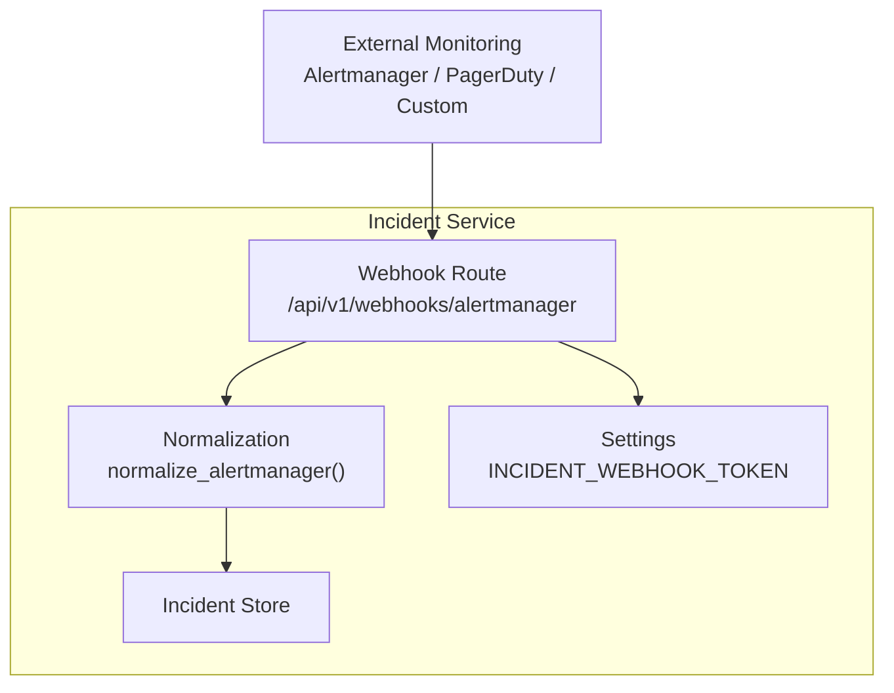
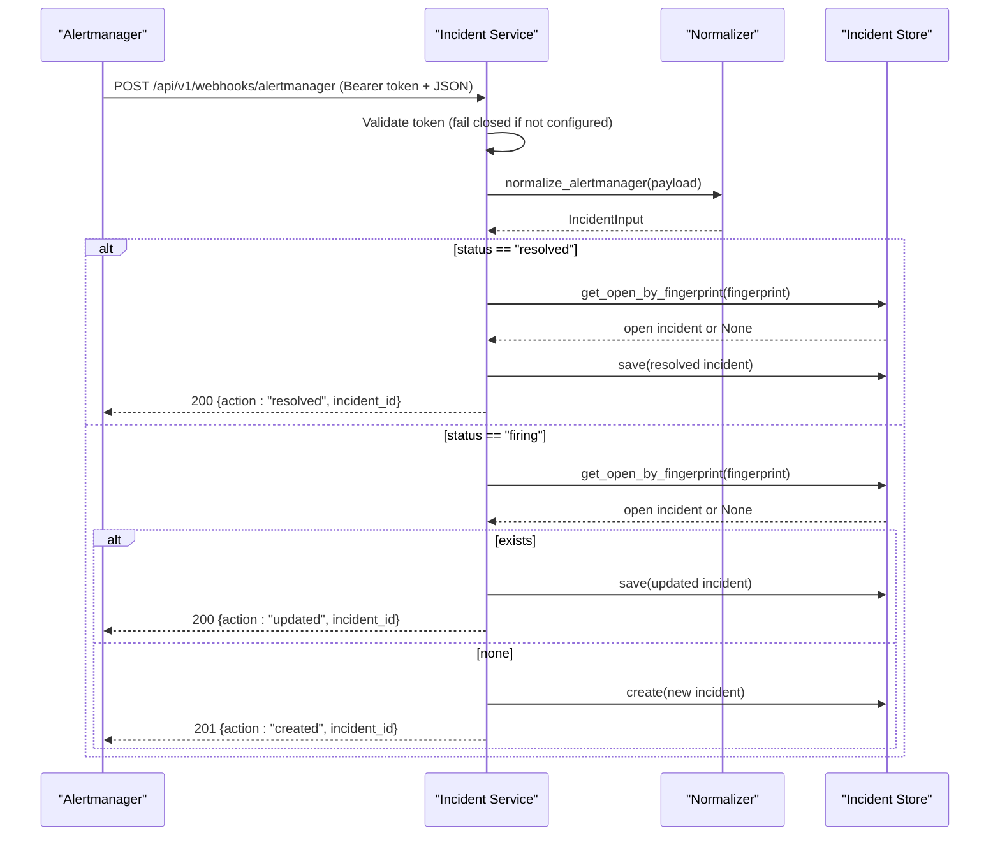
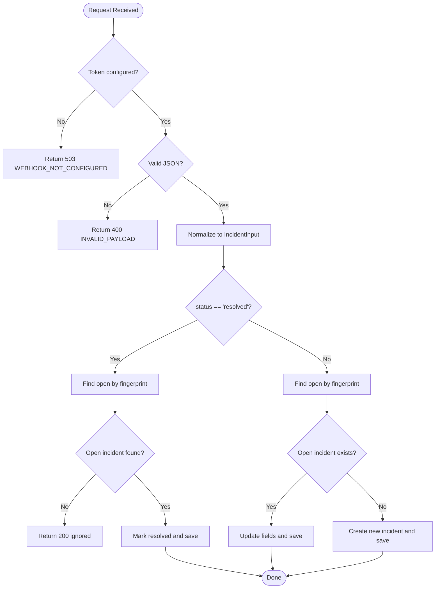
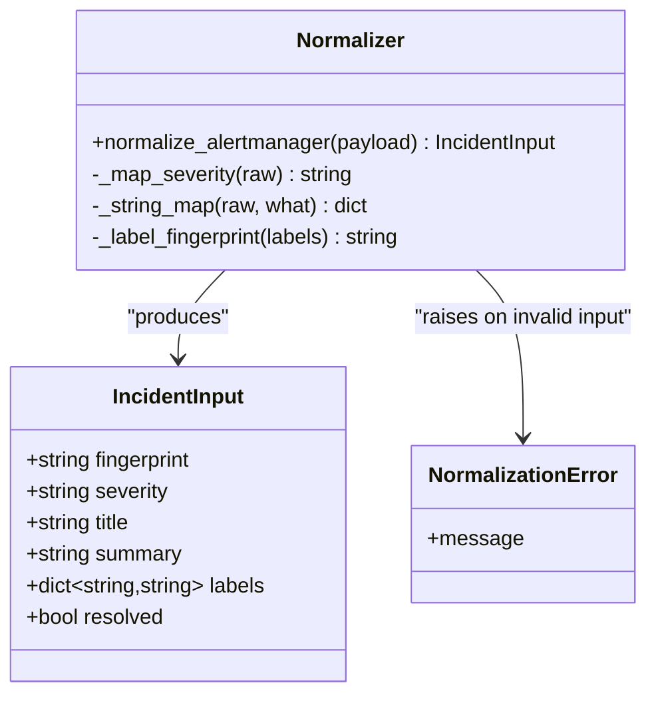
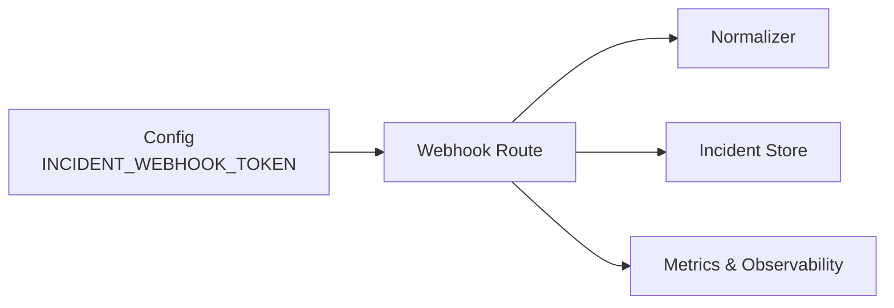

# Webhook Integration Endpoints

<cite>
**Referenced Files in This Document**
- [webhooks.py](file://products/incident-service/src/incident_service/api/routes/webhooks.py)
- [normalization.py](file://products/incident-service/src/incident_service/services/normalization.py)
- [config.py](file://products/incident-service/src/incident_service/core/config.py)
- [test_routes.py](file://products/incident-service/tests/test_routes.py)
- [incident-guide.md](file://docs/guides/incident-guide.md)
- [SPEC-015 plan.md](file://docs/specs/SPEC-015-incident-triage-and-collaboration/plan.md)
</cite>

## Table of Contents
1. [Introduction](#introduction)
2. [Project Structure](#project-structure)
3. [Core Components](#core-components)
4. [Architecture Overview](#architecture-overview)
5. [Detailed Component Analysis](#detailed-component-analysis)
6. [Dependency Analysis](#dependency-analysis)
7. [Performance Considerations](#performance-considerations)
8. [Troubleshooting Guide](#troubleshooting-guide)
9. [Conclusion](#conclusion)
10. [Appendices](#appendices)

## Introduction
This document describes the webhook integration endpoints for ingesting alerts from external monitoring systems into the incident service. It focuses on the Alertmanager webhook intake, including authentication, payload format, normalization, deduplication, resolution handling, error responses, and retry behavior. It also provides guidance for integrating PagerDuty and custom alerting tools by normalizing their payloads to the same canonical form consumed by the incident service.

## Project Structure
The webhook intake is implemented in the incident-service product:
- Route handler for Alertmanager webhooks under api/routes/webhooks.py
- Normalization logic that maps Alertmanager v4 payloads to a canonical IncidentInput under services/normalization.py
- Configuration loading for the shared webhook token under core/config.py
- Tests validating authentication, payload validation, creation/update/resolution flows under tests/test_routes.py
- Operational guidance for delivery semantics and retries under docs/guides/incident-guide.md
- Specification context for the intake design under docs/specs/SPEC-015-incident-triage-and-collaboration/plan.md

**Diagram sources**
- [webhooks.py:69-102](file://products/incident-service/src/incident_service/api/routes/webhooks.py#L69-L102)
- [normalization.py:68-109](file://products/incident-service/src/incident_service/services/normalization.py#L68-L109)
- [config.py:72-120](file://products/incident-service/src/incident_service/core/config.py#L72-L120)

**Section sources**
- [webhooks.py:1-206](file://products/incident-service/src/incident_service/api/routes/webhooks.py#L1-L206)
- [normalization.py:1-110](file://products/incident-service/src/incident_service/services/normalization.py#L1-L110)
- [config.py:1-126](file://products/incident-service/src/incident_service/core/config.py#L1-L126)
- [test_routes.py:172-279](file://products/incident-service/tests/test_routes.py#L172-L279)
- [incident-guide.md:64-73](file://docs/guides/incident-guide.md#L64-L73)
- [SPEC-015 plan.md:44-99](file://docs/specs/SPEC-015-incident-triage-and-collaboration/plan.md#L44-L99)

## Core Components
- Webhook endpoint: POST /api/v1/webhooks/alertmanager
  - Authenticates using a shared bearer token configured via INCIDENT_WEBHOOK_TOKEN
  - Validates JSON body and normalizes to a canonical IncidentInput
  - Creates or updates an incident based on fingerprint; resolves open incidents on resolved status
  - Returns structured error responses with codes such as UNAUTHORIZED, INVALID_PAYLOAD, WEBHOOK_NOT_CONFIGURED
- Normalizer: normalize_alertmanager(payload)
  - Accepts Alertmanager v4 webhook payloads
  - Derives fingerprint from groupKey or stable label hash
  - Maps severity, title, summary, labels, and resolved flag
- Settings: INCIDENT_WEBHOOK_TOKEN
  - Required non-empty token at runtime; if missing, endpoint returns 503 to fail closed

**Section sources**
- [webhooks.py:57-102](file://products/incident-service/src/incident_service/api/routes/webhooks.py#L57-L102)
- [normalization.py:15-109](file://products/incident-service/src/incident_service/services/normalization.py#L15-L109)
- [config.py:72-120](file://products/incident-service/src/incident_service/core/config.py#L72-L120)
- [test_routes.py:172-224](file://products/incident-service/tests/test_routes.py#L172-L224)
- [incident-guide.md:64-73](file://docs/guides/incident-guide.md#L64-L73)
- [SPEC-015 plan.md:59-79](file://docs/specs/SPEC-015-incident-triage-and-collaboration/plan.md#L59-L79)

## Architecture Overview
The webhook intake follows a clear pipeline:
1. Request arrives at the Alertmanager webhook route
2. Authentication checks the Authorization header against the configured shared token
3. Body is parsed as JSON and normalized to IncidentInput
4. If status is resolved, the open incident matching the fingerprint is closed
5. Otherwise, an existing open incident is updated or a new one is created
6. Metrics and observability events are recorded

**Diagram sources**
- [webhooks.py:69-205](file://products/incident-service/src/incident_service/api/routes/webhooks.py#L69-L205)
- [normalization.py:68-109](file://products/incident-service/src/incident_service/services/normalization.py#L68-L109)

## Detailed Component Analysis

### Webhook Endpoint: POST /api/v1/webhooks/alertmanager
- Authentication
  - Requires Authorization: Bearer <token>
  - Token must be configured; otherwise returns 503 with code WEBHOOK_NOT_CONFIGURED
  - Invalid token returns 401 with code UNAUTHORIZED
- Payload parsing and validation
  - Must be valid JSON object; otherwise returns 400 with code INVALID_PAYLOAD
  - Normalization enforces required fields and constraints
- Processing
  - Resolves open incidents when status is resolved
  - Updates existing open incidents when firing and fingerprint matches
  - Creates new incidents when no open incident exists for the fingerprint
- Responses
  - Created: 201 with action "created" and incident_id
  - Updated: 200 with action "updated" and incident_id
  - Resolved: 200 with action "resolved" and incident_id
  - Ignored resolution: 200 with action "ignored" and null incident_id
  - Errors: 400 INVALID_PAYLOAD, 401 UNAUTHORIZED, 503 WEBHOOK_NOT_CONFIGURED

**Diagram sources**
- [webhooks.py:57-205](file://products/incident-service/src/incident_service/api/routes/webhooks.py#L57-L205)

**Section sources**
- [webhooks.py:57-205](file://products/incident-service/src/incident_service/api/routes/webhooks.py#L57-L205)
- [test_routes.py:172-279](file://products/incident-service/tests/test_routes.py#L172-L279)
- [incident-guide.md:64-73](file://docs/guides/incident-guide.md#L64-L73)

### Normalization: Alertmanager v4 Payload Mapping
- Input requirements
  - payload must be a dict
  - status must be "firing" or "resolved"
  - commonLabels and commonAnnotations must be string maps (values coerced to strings)
- Fingerprint derivation
  - Prefer groupKey if present and non-empty
  - Else compute stable hash over sorted commonLabels
- Field mapping
  - severity: critical passes through; warning or absent defaults to warning; anything else maps to info
  - title: prefers commonAnnotations.summary, falls back to commonLabels.alertname, then fingerprint
  - summary: prefers commonAnnotations.description, falls back to rendered label set
  - labels: normalized string map with limits on count and length
  - resolved: true when status is "resolved"

**Diagram sources**
- [normalization.py:15-109](file://products/incident-service/src/incident_service/services/normalization.py#L15-L109)

**Section sources**
- [normalization.py:15-109](file://products/incident-service/src/incident_service/services/normalization.py#L15-L109)
- [SPEC-015 plan.md:68-79](file://docs/specs/SPEC-015-incident-triage-and-collaboration/plan.md#L68-L79)

### Configuration: Shared Webhook Token
- Environment variable: INCIDENT_WEBHOOK_TOKEN
  - Must be non-empty for the webhook route to accept requests
  - When empty, the endpoint returns 503 to fail closed
- Usage
  - The route compares incoming Authorization header token using constant-time comparison
  - Non-ASCII tokens are handled safely without raising errors

**Section sources**
- [config.py:72-120](file://products/incident-service/src/incident_service/core/config.py#L72-L120)
- [webhooks.py:57-82](file://products/incident-service/src/incident_service/api/routes/webhooks.py#L57-L82)
- [test_routes.py:184-207](file://products/incident-service/tests/test_routes.py#L184-L207)

### Handling Different Alert Sources
- Alertmanager
  - Directly supported via normalize_alertmanager
  - One alert group becomes one incident; dedupe by fingerprint
- PagerDuty
  - Not directly supported out-of-the-box
  - Recommended approach: configure PagerDuty to forward events to the Alertmanager webhook endpoint or implement a small adapter that transforms PagerDuty events into the Alertmanager v4 shape expected by the normalizer
- Custom alerting tools
  - Any tool can integrate by sending JSON payloads that match the Alertmanager v4 schema accepted by the normalizer
  - Ensure status, groupKey/commonLabels, and optional annotations are present to produce meaningful incidents

[No sources needed since this section provides general integration guidance]

### Retry Policies and Delivery Semantics
- Fail-closed authentication
  - Wrong or missing token returns 401; unconfigured token returns 503
  - Alertmanager retries on both, ensuring nothing is silently dropped
- Duplicate deliveries
  - Idempotent by fingerprint; re-posting the same payload updates or ignores appropriately
- Malformed payloads
  - Return 400 with structured reason; these are not retried by Alertmanager’s default policy, so fix the payload rather than relying on retry

**Section sources**
- [incident-guide.md:64-73](file://docs/guides/incident-guide.md#L64-L73)
- [test_routes.py:172-224](file://products/incident-service/tests/test_routes.py#L172-L224)

## Dependency Analysis
The webhook route depends on:
- Settings for token configuration
- Normalization to convert raw payloads to canonical inputs
- Incident store for persistence and lookup by fingerprint
- Metrics and observability for intake recording and event logging

**Diagram sources**
- [webhooks.py:21-35](file://products/incident-service/src/incident_service/api/routes/webhooks.py#L21-L35)
- [config.py:72-120](file://products/incident-service/src/incident_service/core/config.py#L72-L120)

**Section sources**
- [webhooks.py:21-35](file://products/incident-service/src/incident_service/api/routes/webhooks.py#L21-L35)
- [config.py:72-120](file://products/incident-service/src/incident_service/core/config.py#L72-L120)

## Performance Considerations
- High-volume streams
  - Deduplication by fingerprint reduces redundant writes
  - Label and annotation size limits prevent oversized payloads
  - Use persistent store backend (e.g., Postgres) in production for durability and scalability
- Timeouts and backpressure
  - Configure appropriate timeouts for downstream dependencies (store, connectors)
  - Monitor metrics for intake rates and rejection reasons
- Observability
  - Record intake counts and open incident counts
  - Log key lifecycle events for created, updated, resolved, and ignored actions

[No sources needed since this section provides general guidance]

## Troubleshooting Guide
Common issues and resolutions:
- 503 WEBHOOK_NOT_CONFIGURED
  - Cause: INCIDENT_WEBHOOK_TOKEN is empty or not set
  - Resolution: Set a strong shared token in environment and restart service
- 401 UNAUTHORIZED
  - Cause: Missing or incorrect Authorization header token
  - Resolution: Ensure Alertmanager or sender uses the exact shared token
- 400 INVALID_PAYLOAD
  - Cause: Malformed JSON or missing required fields (e.g., status, groupKey/commonLabels)
  - Resolution: Fix payload structure to match Alertmanager v4 expectations
- No incident created on resolved
  - Cause: No open incident found for the fingerprint
  - Behavior: Returns action "ignored"; verify fingerprint consistency between firing and resolved events
- Duplicate incidents
  - Cause: Inconsistent fingerprints across firing/resolved events
  - Resolution: Ensure stable groupKey or consistent label sets to derive identical fingerprints

**Section sources**
- [test_routes.py:172-279](file://products/incident-service/tests/test_routes.py#L172-L279)
- [incident-guide.md:64-73](file://docs/guides/incident-guide.md#L64-L73)

## Conclusion
The incident-service webhook intake provides a secure, idempotent, and extensible mechanism for ingesting alerts from external monitoring systems. By enforcing shared-token authentication, strict payload validation, and fingerprint-based deduplication, it ensures reliable incident creation, updates, and resolution. Integrating PagerDuty or custom tools involves transforming their events into the Alertmanager v4 shape consumed by the normalizer. Proper configuration, observability, and adherence to retry semantics enable robust operation under high-volume alert streams.

## Appendices

### API Reference: Webhook Intake
- Endpoint: POST /api/v1/webhooks/alertmanager
- Headers:
  - Authorization: Bearer <shared token>
- Request body:
  - JSON object conforming to Alertmanager v4 webhook schema
  - Required fields: status ("firing" or "resolved"), and either groupKey or non-empty commonLabels
  - Optional: commonAnnotations (summary, description), commonLabels (alertname, severity, etc.)
- Success responses:
  - 201 created: {action: "created", incident_id: string, fingerprint: string}
  - 200 updated: {action: "updated", incident_id: string, fingerprint: string}
  - 200 resolved: {action: "resolved", incident_id: string, fingerprint: string}
  - 200 ignored: {action: "ignored", incident_id: null, fingerprint: string}
- Error responses:
  - 503 WEBHOOK_NOT_CONFIGURED: token not configured
  - 401 UNAUTHORIZED: invalid or missing token
  - 400 INVALID_PAYLOAD: malformed or invalid payload

**Section sources**
- [webhooks.py:69-205](file://products/incident-service/src/incident_service/api/routes/webhooks.py#L69-L205)
- [normalization.py:68-109](file://products/incident-service/src/incident_service/services/normalization.py#L68-L109)
- [test_routes.py:172-279](file://products/incident-service/tests/test_routes.py#L172-L279)