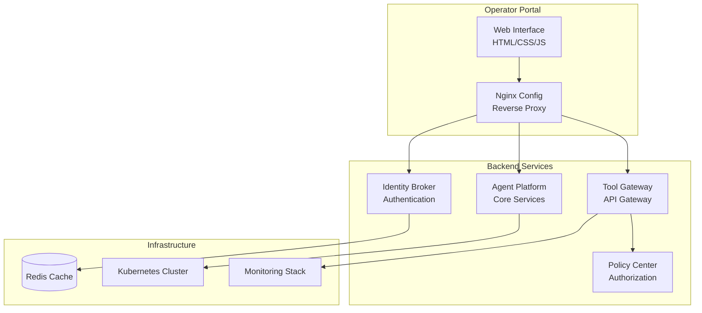
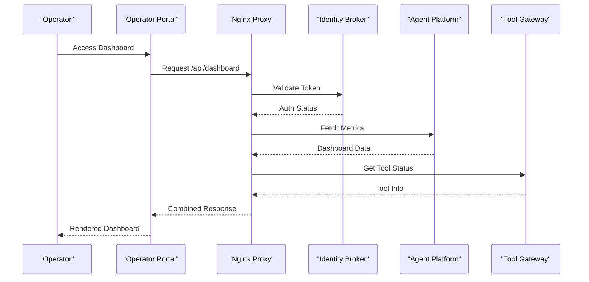
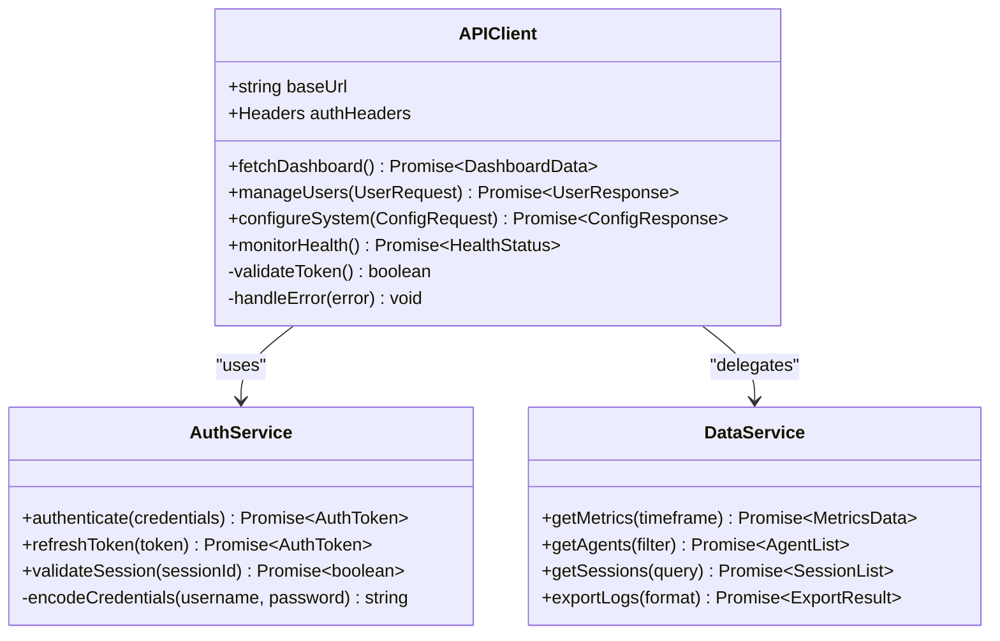
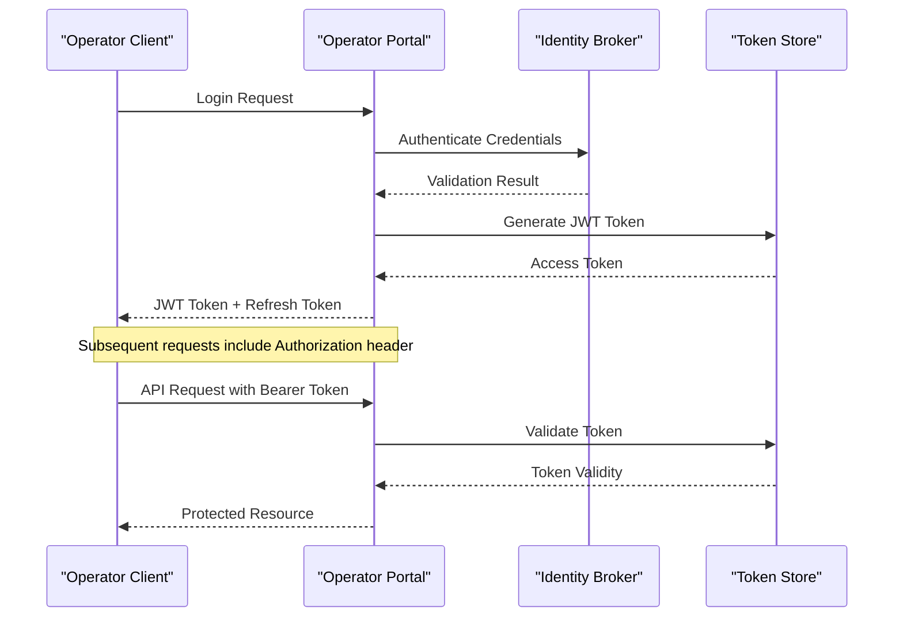

# Operator Portal API

<cite>
**Referenced Files in This Document**
- [app.js](file://products/operator-portal/web-ui/app.js)
- [index.html](file://products/operator-portal/web-ui/index.html)
- [styles.css](file://products/operator-portal/web-ui/styles.css)
- [nginx.conf](file://products/operator-portal/nginx.conf)
- [README.md](file://products/operator-portal/README.md)
</cite>

## Table of Contents
1. [Introduction](#introduction)
2. [Project Structure](#project-structure)
3. [Core Components](#core-components)
4. [Architecture Overview](#architecture-overview)
5. [Detailed Component Analysis](#detailed-component-analysis)
6. [API Endpoints Documentation](#api-endpoints-documentation)
7. [Authentication and Authorization](#authentication-and-authorization)
8. [Security Considerations](#security-considerations)
9. [Performance Considerations](#performance-considerations)
10. [Troubleshooting Guide](#troubleshooting-guide)
11. [Conclusion](#conclusion)

## Introduction

The Operator Portal is a web-based administrative interface designed for platform management, user administration, and system monitoring within the AIOPS platform ecosystem. It provides operators with a comprehensive dashboard for managing agents, monitoring system health, configuring runtime environments, and performing administrative tasks across the platform components.

The portal serves as the primary interface for platform operators to manage the multi-agent AI platform, providing insights into agent performance, session management, tool execution, and overall system health.

## Project Structure

The Operator Portal follows a modern web application architecture with clear separation between frontend assets and backend services:



**Diagram sources**
- [nginx.conf](file://products/operator-portal/nginx.conf)
- [app.js](file://products/operator-portal/web-ui/app.js)

**Section sources**
- [README.md](file://products/operator-portal/README.md)

## Core Components

### Web Interface Layer
The Operator Portal's web interface consists of three main components:
- **HTML Structure**: Defines the layout and content structure
- **CSS Styling**: Provides responsive design and visual consistency
- **JavaScript Logic**: Handles client-side interactions and API communication

### Reverse Proxy Configuration
Nginx serves as the reverse proxy, handling:
- SSL termination
- Request routing to appropriate backend services
- Static asset caching
- Security headers configuration

### Backend Integration Points
The portal integrates with several backend services:
- **Identity Broker**: Authentication and authorization
- **Agent Platform**: Core agent management functionality
- **Tool Gateway**: API gateway for tool execution
- **Policy Center**: Policy enforcement and compliance

**Section sources**
- [app.js](file://products/operator-portal/web-ui/app.js)
- [nginx.conf](file://products/operator-portal/nginx.conf)

## Architecture Overview

The Operator Portal follows a microservices architecture pattern with clear separation of concerns:



**Diagram sources**
- [nginx.conf](file://products/operator-portal/nginx.conf)
- [app.js](file://products/operator-portal/web-ui/app.js)

## Detailed Component Analysis

### Web Interface Components

#### Dashboard Controller
The main dashboard controller handles:
- Real-time metrics aggregation
- System health monitoring
- Agent status visualization
- Performance analytics

#### User Management Interface
Administrative functions include:
- User account creation and modification
- Role assignment and permission management
- Session monitoring and control
- Audit log viewing

#### Configuration Management
System configuration capabilities:
- Runtime environment settings
- Provider configuration
- Policy updates
- Feature flag management

**Section sources**
- [app.js](file://products/operator-portal/web-ui/app.js)

### API Gateway Integration

The portal communicates with backend services through well-defined API endpoints:



**Diagram sources**
- [app.js](file://products/operator-portal/web-ui/app.js)

## API Endpoints Documentation

### Authentication Endpoints

#### POST /api/auth/login
Authenticate users and obtain access tokens.

**Request Schema:**
```json
{
  "username": "string",
  "password": "string",
  "mfa_code": "string (optional)"
}
```

**Response Schema:**
```json
{
  "access_token": "string",
  "refresh_token": "string",
  "expires_in": "number",
  "user_info": {
    "id": "string",
    "roles": ["string"],
    "permissions": ["string"]
  }
}
```

#### POST /api/auth/logout
Invalidate current session and tokens.

**Response Schema:**
```json
{
  "status": "success",
  "message": "Logged out successfully"
}
```

### Dashboard and Monitoring Endpoints

#### GET /api/dashboard/metrics
Retrieve real-time system metrics and performance data.

**Query Parameters:**
- `timeframe`: "5m" | "1h" | "24h" | "7d"
- `metrics`: "cpu" | "memory" | "agents" | "sessions" | "tools"

**Response Schema:**
```json
{
  "timestamp": "ISO8601",
  "system_metrics": {
    "cpu_usage": "number",
    "memory_usage": "number",
    "active_agents": "number",
    "active_sessions": "number",
    "tool_invocations": "number"
  },
  "agent_status": {
    "total": "number",
    "healthy": "number",
    "unhealthy": "number",
    "offline": "number"
  },
  "performance_indicators": {
    "avg_response_time": "number",
    "error_rate": "number",
    "throughput": "number"
  }
}
```

#### GET /api/dashboard/health
Check overall system health status.

**Response Schema:**
```json
{
  "status": "healthy" | "degraded" | "unhealthy",
  "components": {
    "identity_broker": "healthy" | "unhealthy",
    "agent_platform": "healthy" | "unhealthy",
    "tool_gateway": "healthy" | "unhealthy",
    "policy_center": "healthy" | "unhealthy"
  },
  "last_check": "ISO8601",
  "uptime": "string"
}
```

### User Administration Endpoints

#### GET /api/users
List all users with pagination support.

**Query Parameters:**
- `page`: "number" (default: 1)
- `limit`: "number" (default: 50)
- `role`: "string" (filter by role)
- `status`: "active" | "inactive" | "suspended"

**Response Schema:**
```json
{
  "users": [
    {
      "id": "string",
      "username": "string",
      "email": "string",
      "roles": ["string"],
      "status": "active" | "inactive" | "suspended",
      "last_login": "ISO8601",
      "created_at": "ISO8601"
    }
  ],
  "pagination": {
    "current_page": "number",
    "total_pages": "number",
    "total_users": "number",
    "has_next": "boolean",
    "has_previous": "boolean"
  }
}
```

#### POST /api/users
Create a new user account.

**Request Schema:**
```json
{
  "username": "string",
  "email": "string",
  "password": "string",
  "roles": ["string"],
  "permissions": ["string"],
  "profile": {
    "first_name": "string",
    "last_name": "string",
    "department": "string"
  }
}
```

#### PUT /api/users/{user_id}
Update user information and permissions.

**Request Schema:**
```json
{
  "email": "string",
  "roles": ["string"],
  "permissions": ["string"],
  "status": "active" | "inactive" | "suspended",
  "profile": {
    "first_name": "string",
    "last_name": "string",
    "department": "string"
  }
}
```

### Agent Management Endpoints

#### GET /api/agents
List all agents with filtering and sorting options.

**Query Parameters:**
- `status`: "online" | "offline" | "busy" | "idle"
- `type`: "chat" | "code" | "research" | "analysis"
- `provider`: "openai" | "deepseek" | "dashscope"
- `search`: "string" (fuzzy search)

**Response Schema:**
```json
{
  "agents": [
    {
      "id": "string",
      "name": "string",
      "type": "string",
      "provider": "string",
      "status": "string",
      "version": "string",
      "capabilities": ["string"],
      "configuration": {
        "model": "string",
        "temperature": "number",
        "max_tokens": "number"
      },
      "metrics": {
        "total_sessions": "number",
        "avg_response_time": "number",
        "error_rate": "number"
      }
    }
  ],
  "summary": {
    "total_agents": "number",
    "online_count": "number",
    "offline_count": "number",
    "by_type": {
      "chat": "number",
      "code": "number",
      "research": "number",
      "analysis": "number"
    }
  }
}
```

#### POST /api/agents/{agent_id}/restart
Restart a specific agent instance.

**Response Schema:**
```json
{
  "status": "restarting",
  "agent_id": "string",
  "message": "Agent restart initiated",
  "estimated_completion": "ISO8601"
}
```

### Session Management Endpoints

#### GET /api/sessions
Retrieve active and historical sessions.

**Query Parameters:**
- `agent_id`: "string" (filter by agent)
- `status`: "active" | "completed" | "failed"
- `start_date`: "ISO8601"
- `end_date`: "ISO8601"
- `limit`: "number"

**Response Schema:**
```json
{
  "sessions": [
    {
      "id": "string",
      "agent_id": "string",
      "agent_name": "string",
      "user_id": "string",
      "status": "active" | "completed" | "failed",
      "started_at": "ISO8601",
      "ended_at": "ISO8601",
      "duration": "number",
      "messages_count": "number",
      "tokens_used": "number",
      "cost": "number"
    }
  ],
  "pagination": {
    "current_page": "number",
    "total_pages": "number",
    "total_sessions": "number"
  }
}
```

### Configuration Management Endpoints

#### GET /api/config/system
Retrieve system configuration.

**Response Schema:**
```json
{
  "platform_settings": {
    "max_concurrent_sessions": "number",
    "session_timeout_minutes": "number",
    "rate_limiting": {
      "enabled": "boolean",
      "requests_per_minute": "number"
    }
  },
  "feature_flags": {
    "enable_advanced_analytics": "boolean",
    "enable_audit_logging": "boolean",
    "enable_export_features": "boolean"
  },
  "integrations": {
    "monitoring_enabled": "boolean",
    "logging_level": "debug" | "info" | "warning" | "error",
    "external_services": ["string"]
  }
}
```

#### PUT /api/config/system
Update system configuration.

**Request Schema:**
```json
{
  "platform_settings": {
    "max_concurrent_sessions": "number",
    "session_timeout_minutes": "number",
    "rate_limiting": {
      "enabled": "boolean",
      "requests_per_minute": "number"
    }
  },
  "feature_flags": {
    "enable_advanced_analytics": "boolean",
    "enable_audit_logging": "boolean",
    "enable_export_features": "boolean"
  }
}
```

### Audit and Logging Endpoints

#### GET /api/audit/logs
Retrieve audit logs with filtering and pagination.

**Query Parameters:**
- `action`: "create" | "update" | "delete" | "login" | "logout"
- `user_id`: "string"
- `resource_type`: "user" | "agent" | "config" | "session"
- `start_time`: "ISO8601"
- `end_time`: "ISO8601"
- `severity`: "info" | "warning" | "error"

**Response Schema:**
```json
{
  "logs": [
    {
      "id": "string",
      "timestamp": "ISO8601",
      "user_id": "string",
      "action": "string",
      "resource_type": "string",
      "resource_id": "string",
      "details": "object",
      "ip_address": "string",
      "user_agent": "string",
      "severity": "info" | "warning" | "error"
    }
  ],
  "pagination": {
    "current_page": "number",
    "total_pages": "number",
    "total_logs": "number"
  }
}
```

## Authentication and Authorization

### Authentication Flow

The Operator Portal implements OAuth 2.0 with JWT tokens for secure authentication:



### Role-Based Access Control (RBAC)

The system implements granular role-based permissions:

| Role | Permissions | Description |
|------|-------------|-------------|
| `admin` | Full access to all resources | Platform administrators with complete control |
| `operator` | Read/write access to operational resources | Platform operators managing daily operations |
| `analyst` | Read-only access to monitoring and reports | Analysts viewing dashboards and generating reports |
| `viewer` | Limited read access to public endpoints | External integrations and monitoring systems |

### Permission Matrix

| Resource | admin | operator | analyst | viewer |
|----------|-------|----------|---------|--------|
| Dashboard | ✅ | ✅ | ✅ | ❌ |
| User Management | ✅ | ✅ | ❌ | ❌ |
| Agent Management | ✅ | ✅ | ❌ | ❌ |
| Session Monitoring | ✅ | ✅ | ✅ | ❌ |
| Configuration | ✅ | ❌ | ❌ | ❌ |
| Audit Logs | ✅ | ✅ | ✅ | ❌ |
| Health Checks | ✅ | ✅ | ✅ | ✅ |

## Security Considerations

### Input Validation and Sanitization
All API endpoints implement comprehensive input validation:
- Parameter type checking
- Length constraints
- Format validation
- SQL injection prevention
- XSS protection

### Rate Limiting and Throttling
- Per-user rate limiting to prevent abuse
- IP-based throttling for DDoS protection
- Adaptive rate limiting based on system load
- Graceful degradation under high load

### Data Protection
- Encryption at rest for sensitive data
- TLS encryption for data in transit
- Secure cookie configuration
- CSRF protection
- Content Security Policy headers

### Audit and Compliance
- Comprehensive audit logging
- Immutable audit trails
- Compliance reporting
- Data retention policies
- Privacy controls

## Performance Considerations

### Caching Strategy
- Redis caching for frequently accessed data
- CDN integration for static assets
- Database query optimization
- Connection pooling
- Response compression

### Scalability Patterns
- Horizontal scaling of stateless services
- Load balancing across instances
- Auto-scaling based on demand
- Database sharding for large datasets
- Message queuing for async processing

### Monitoring and Observability
- Real-time performance metrics
- Distributed tracing
- Log aggregation
- Alerting thresholds
- Capacity planning insights

## Troubleshooting Guide

### Common Issues and Solutions

#### Authentication Failures
- Verify token expiration and refresh mechanisms
- Check identity broker connectivity
- Validate certificate configurations
- Review security policy settings

#### Performance Degradation
- Monitor resource utilization
- Analyze database query performance
- Check network latency
- Review cache hit ratios
- Investigate memory leaks

#### Service Connectivity Issues
- Verify service discovery
- Check network policies
- Validate DNS resolution
- Monitor service health endpoints
- Review load balancer configuration

### Debugging Tools
- API request/response logging
- Network traffic analysis
- Database query profiling
- Memory usage monitoring
- Error tracking and reporting

### Recovery Procedures
- Service restart protocols
- Data backup and restore
- Configuration rollback
- Emergency access procedures
- Incident response workflows

## Conclusion

The Operator Portal provides a comprehensive administrative interface for managing the AIOPS platform. Its modular architecture, robust security model, and extensive API surface enable efficient platform operations while maintaining high standards for security and performance.

Key strengths include:
- Intuitive web interface for complex operations
- Comprehensive authentication and authorization
- Extensive monitoring and observability
- Scalable microservices architecture
- Strong security posture with multiple layers of protection

Future enhancements should focus on:
- Enhanced automation capabilities
- Advanced analytics and reporting
- Improved mobile responsiveness
- Extended integration capabilities
- Machine learning-powered insights