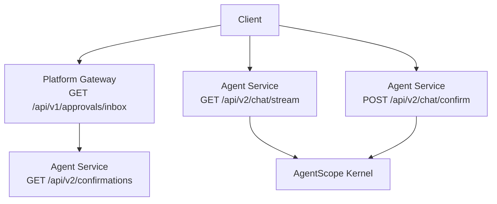
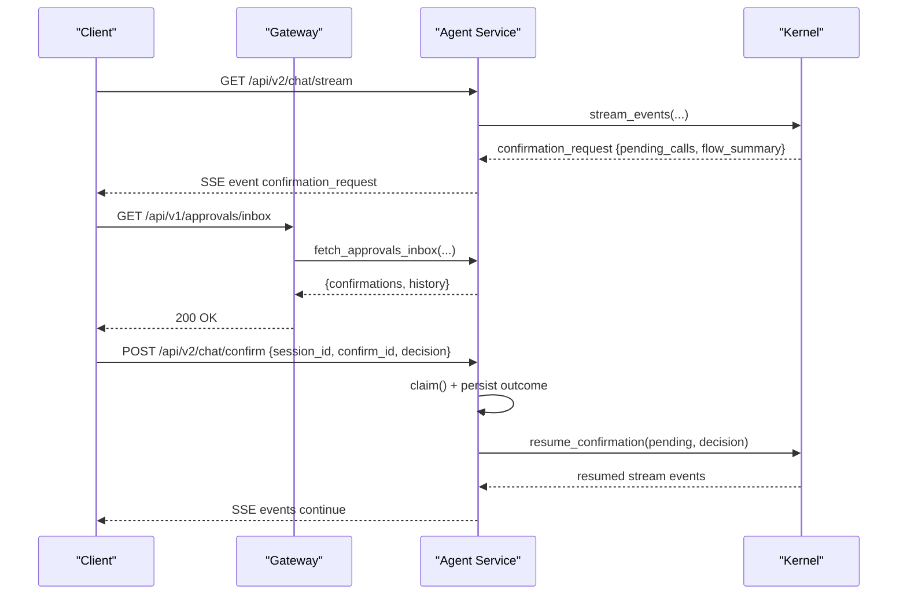
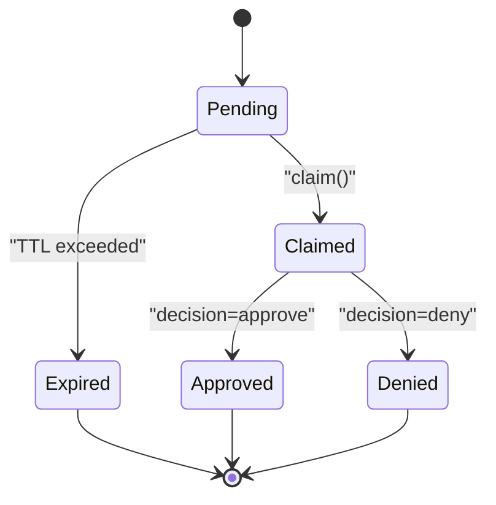
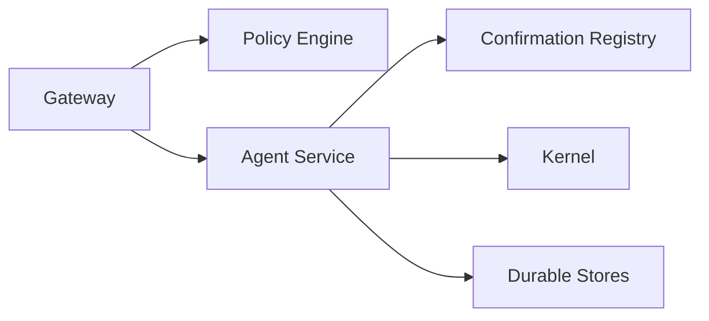

# Approvals Workflow API

<cite>
**Referenced Files in This Document**
- [products/platform-gateway/src/platform_gateway/api/routes/approvals.py](file://products/platform-gateway/src/platform_gateway/api/routes/approvals.py)
- [products/platform-gateway/src/platform_gateway/services/gateway_service.py](file://products/platform-gateway/src/platform_gateway/services/gateway_service.py)
- [products/agent-platform/src/agent_service/api/v2/routes.py](file://products/agent-platform/src/agent_service/api/v2/routes.py)
- [products/agent-platform/src/agent_service/services/hitl_confirmations.py](file://products/agent-platform/src/agent_service/services/hitl_confirmations.py)
- [products/agent-platform/src/agent_service/services/flow_approvals.py](file://products/agent-platform/src/agent_service/services/flow_approvals.py)
- [shared/shared-contracts/schemas/chat-confirm.schema.json](file://shared/shared-contracts/schemas/chat-confirm.schema.json)
- [shared/shared-contracts/schemas/agent-chat-request.schema.json](file://shared/shared-contracts/schemas/agent-chat-request.schema.json)
- [shared/shared-contracts/schemas/agent-chat-response.schema.json](file://shared/shared-contracts/schemas/agent-chat-response.schema.json)
</cite>

## Table of Contents
1. Introduction
2. Project Structure
3. Core Components
4. Architecture Overview
5. Detailed Component Analysis
6. Dependency Analysis
7. Performance Considerations
8. Troubleshooting Guide
9. Conclusion

## Introduction
This document specifies the Human-in-the-Loop (HITL) approvals workflow endpoints that power approval cards, pending queries, and decision submission for tool executions. It covers:
- Approval card creation via agent streaming events
- Pending approval discovery through an approver inbox
- Decision submission to resume parked tool calls
- Request/response schemas, authentication and authorization, lifecycle states, escalation posture, audit trail integration, and downstream notifications

The platform exposes a v1 approvals inbox at the gateway and a v2 confirmation bridge on the agent service. The gateway enforces policy and proxies requests; the agent service manages parked confirmations and resumes execution after decisions.

## Project Structure
The HITL approvals flow spans two services:
- Platform Gateway (v1): /api/v1/approvals/inbox — lists pending and historical confirmations for the authenticated approver
- Agent Service (v2): /api/v2/chat/stream — emits confirmation_request frames with parked tool calls; /api/v2/chat/confirm — submits decisions; /api/v2/chat/pending-confirmation — reads metadata for policy checks

**Diagram sources**
- [products/platform-gateway/src/platform_gateway/api/routes/approvals.py:19-57](file://products/platform-gateway/src/platform_gateway/api/routes/approvals.py#L19-L57)
- [products/platform-gateway/src/platform_gateway/services/gateway_service.py:439-470](file://products/platform-gateway/src/platform_gateway/services/gateway_service.py#L439-L470)
- [products/agent-platform/src/agent_service/api/v2/routes.py:320-365](file://products/agent-platform/src/agent_service/api/v2/routes.py#L320-L365)
- [products/agent-platform/src/agent_service/api/v2/routes.py:368-464](file://products/agent-platform/src/agent_service/api/v2/routes.py#L368-L464)

**Section sources**
- [products/platform-gateway/src/platform_gateway/api/routes/approvals.py:19-57](file://products/platform-gateway/src/platform_gateway/api/routes/approvals.py#L19-L57)
- [products/platform-gateway/src/platform_gateway/services/gateway_service.py:439-470](file://products/platform-gateway/src/platform_gateway/services/gateway_service.py#L439-L470)
- [products/agent-platform/src/agent_service/api/v2/routes.py:320-365](file://products/agent-platform/src/agent_service/api/v2/routes.py#L320-L365)
- [products/agent-platform/src/agent_service/api/v2/routes.py:368-464](file://products/agent-platform/src/agent_service/api/v2/routes.py#L368-L464)

## Core Components
- Confirmation registry: In-memory store of parked confirmations per session, with single-flight claim and TTL expiry handling
- Flow approvals: Session-scoped authority allowing auto-signing of subsequent writes within a bounded browser flow after operator approval
- Change request projection: Display-only, secret-masked summaries for action-type cards
- Risk tier mapping: Maps tool risk levels to policy actions used by the gateway’s confirm bridge
- Inbox proxy: Gateway endpoint that lists pending and historical confirmations for approvers

Key responsibilities:
- Emit confirmation_request frames with pending_calls, optional flow_summary, and approval_kind
- Persist outcomes and durable records for history
- Enforce role-based access control via policy actions before proxying or resuming

**Section sources**
- [products/agent-platform/src/agent_service/services/hitl_confirmations.py:47-180](file://products/agent-platform/src/agent_service/services/hitl_confirmations.py#L47-L180)
- [products/agent-platform/src/agent_service/services/hitl_confirmations.py:195-359](file://products/agent-platform/src/agent_service/services/hitl_confirmations.py#L195-L359)
- [products/agent-platform/src/agent_service/services/hitl_confirmations.py:452-595](file://products/agent-platform/src/agent_service/services/hitl_confirmations.py#L452-L595)
- [products/agent-platform/src/agent_service/services/flow_approvals.py:78-203](file://products/agent-platform/src/agent_service/services/flow_approvals.py#L78-L203)
- [products/agent-platform/src/agent_service/services/flow_approvals.py:205-274](file://products/agent-platform/src/agent_service/services/flow_approvals.py#L205-L274)
- [products/platform-gateway/src/platform_gateway/api/routes/approvals.py:19-57](file://products/platform-gateway/src/platform_gateway/api/routes/approvals.py#L19-L57)
- [products/platform-gateway/src/platform_gateway/services/gateway_service.py:439-470](file://products/platform-gateway/src/platform_gateway/services/gateway_service.py#L439-L470)

## Architecture Overview
The approvals workflow integrates three layers:
- Gateway layer: Authenticates users, enforces policy (approvals:list), and proxies inbox queries
- Agent service layer: Streams confirmation_request frames, persists claims, and resumes execution upon decision
- Kernel layer: Parks tool calls when user confirmation is required and resumes them after decision

**Diagram sources**
- [products/agent-platform/src/agent_service/api/v2/routes.py:320-365](file://products/agent-platform/src/agent_service/api/v2/routes.py#L320-L365)
- [products/agent-platform/src/agent_service/api/v2/routes.py:368-464](file://products/agent-platform/src/agent_service/api/v2/routes.py#L368-L464)
- [products/platform-gateway/src/platform_gateway/api/routes/approvals.py:19-57](file://products/platform-gateway/src/platform_gateway/api/routes/approvals.py#L19-L57)
- [products/platform-gateway/src/platform_gateway/services/gateway_service.py:439-470](file://products/platform-gateway/src/platform_gateway/services/gateway_service.py#L439-L470)

## Detailed Component Analysis

### Endpoints

#### GET /api/v1/approvals/inbox
- Purpose: List pending and historical confirmations for the authenticated approver
- Authentication: Identity resolved via gateway; policy enforcement required
- Authorization: Requires approvals:list action (granted to tier_2 decider roles)
- Query parameters:
  - history_limit: integer, 1–50, default 10
  - history_offset: integer, >= 0, default 0
- Response fields:
  - confirmations: array of pending items
  - history: array of historical items
  - history_total: total count for pagination
- Notes: Metadata only; no owner transcript text

**Section sources**
- [products/platform-gateway/src/platform_gateway/api/routes/approvals.py:19-57](file://products/platform-gateway/src/platform_gateway/api/routes/approvals.py#L19-L57)
- [products/platform-gateway/src/platform_gateway/services/gateway_service.py:439-470](file://products/platform-gateway/src/platform_gateway/services/gateway_service.py#L439-L470)

#### GET /api/v2/chat/stream
- Purpose: Stream agent events including confirmation_request frames for parked tool calls
- Headers:
  - X-User-ID: required
  - x-request-id: optional
  - Authorization: optional bearer token forwarded to kernel
- Event types include message_start, message_delta, message_end, error, tool_call, tool_result, confirmation_request, confirmation_result
- confirmation_request payload includes:
  - pending_calls: list of call entries with tool_name, parameters, optional risk_level, action, display_hint, change_request
  - flow_summary: optional object with skill_id, origin, title, description, flow_intent, risk_class
  - approval_kind: "flow" or "action"

**Section sources**
- [products/agent-platform/src/agent_service/api/v2/routes.py:320-365](file://products/agent-platform/src/agent_service/api/v2/routes.py#L320-L365)
- [products/agent-platform/src/agent_service/api/v2/routes.py:598-727](file://products/agent-platform/src/agent_service/api/v2/routes.py#L598-L727)
- [products/agent-platform/src/agent_service/services/hitl_confirmations.py:98-180](file://products/agent-platform/src/agent_service/services/hitl_confirmations.py#L98-L180)

#### POST /api/v2/chat/confirm
- Purpose: Submit decision (approve/deny) to resume parked tool calls
- Request body schema: chat-confirm.schema.json
  - Required fields: session_id, confirm_id, decision (enum: approve | deny)
- Behavior:
  - Claims the pending confirmation atomically
  - Persists outcome at claim time
  - Resumes the kernel stream with the decision
  - Returns SSE stream of resumed events
- Error postures:
  - 404: confirmation not found
  - 409: already resolved (includes status, decider_user_id, decision, decided_at)
  - 410: confirmation expired

**Section sources**
- [shared/shared-contracts/schemas/chat-confirm.schema.json:1-27](file://shared/shared-contracts/schemas/chat-confirm.schema.json#L1-L27)
- [products/agent-platform/src/agent_service/api/v2/routes.py:368-464](file://products/agent-platform/src/agent_service/api/v2/routes.py#L368-L464)

#### GET /api/v2/chat/pending-confirmation
- Purpose: Read parked confirmation metadata for policy checks (action, owner_user_id, pending_calls)
- Behavior:
  - If in-memory registry has entry: returns redacted pending_calls
  - Else falls back to durable record if available
- Errors:
  - 404: no pending confirmation

**Section sources**
- [products/agent-platform/src/agent_service/api/v2/routes.py:467-513](file://products/agent-platform/src/agent_service/api/v2/routes.py#L467-L513)
- [products/agent-platform/src/agent_service/services/hitl_confirmations.py:379-409](file://products/agent-platform/src/agent_service/services/hitl_confirmations.py#L379-L409)

### Data Models and Schemas

#### Chat Confirm Request
- Fields:
  - session_id: string
  - confirm_id: string
  - decision: enum ["approve", "deny"]

**Section sources**
- [shared/shared-contracts/schemas/chat-confirm.schema.json:1-27](file://shared/shared-contracts/schemas/chat-confirm.schema.json#L1-L27)

#### Agent Chat Request
- Fields:
  - message: string
  - session_id: optional string
  - input_modality: enum ["text", "voice"], default "text"
  - response_schema: optional object
  - model: optional string

**Section sources**
- [shared/shared-contracts/schemas/agent-chat-request.schema.json:1-35](file://shared/shared-contracts/schemas/agent-chat-request.schema.json#L1-L35)

#### Agent Chat Response
- Fields:
  - session_id: string
  - request_id: string
  - content: string
  - status: enum ["ok", "partial", "error"], default "ok"
  - structured_output: optional object
  - model: optional string

**Section sources**
- [shared/shared-contracts/schemas/agent-chat-response.schema.json:1-35](file://shared/shared-contracts/schemas/agent-chat-response.schema.json#L1-L35)

### Approval Card Creation from Tool Execution
- When the kernel parks tool calls requiring user confirmation, it emits a confirmation_request frame on the SSE stream
- Each pending call includes:
  - call_id, tool_name, parameters
  - Optional risk_level and action derived from tool risk tiers
  - Optional display_hint for browser tools referencing snapshot elements
  - Optional change_request for action-type cards (secret-masked summary)
- For browser flows, flow_summary carries headline context (skill_id, origin, title, description, flow_intent, risk_class)

**Section sources**
- [products/agent-platform/src/agent_service/api/v2/routes.py:598-727](file://products/agent-platform/src/agent_service/api/v2/routes.py#L598-L727)
- [products/agent-platform/src/agent_service/services/hitl_confirmations.py:98-180](file://products/agent-platform/src/agent_service/services/hitl_confirmations.py#L98-L180)

### Pending Approval Queries
- Use GET /api/v1/approvals/inbox to list pending and historical confirmations across sessions
- Use GET /api/v2/chat/pending-confirmation to read metadata for a specific session’s parked confirmation

**Section sources**
- [products/platform-gateway/src/platform_gateway/api/routes/approvals.py:19-57](file://products/platform-gateway/src/platform_gateway/api/routes/approvals.py#L19-L57)
- [products/platform-gateway/src/platform_gateway/services/gateway_service.py:439-470](file://products/platform-gateway/src/platform_gateway/services/gateway_service.py#L439-L470)
- [products/agent-platform/src/agent_service/api/v2/routes.py:467-513](file://products/agent-platform/src/agent_service/api/v2/routes.py#L467-L513)

### Decision Submission Workflows
- Submit POST /api/v2/chat/confirm with session_id, confirm_id, and decision
- The system claims the confirmation atomically, persists the outcome, and resumes the stream
- Subsequent attempts receive structured 409 responses indicating already resolved state

**Section sources**
- [products/agent-platform/src/agent_service/api/v2/routes.py:368-464](file://products/agent-platform/src/agent_service/api/v2/routes.py#L368-L464)

### Authentication and Role-Based Access Control
- Authentication: Identity conveyed via headers (X-User-ID, x-request-id); gateway resolves identity and enforces policy
- Authorization:
  - approvals:list required for GET /api/v1/approvals/inbox
  - Confirm bridge enforces tier checks upstream before proxying decisions
- Delegation: Bearer tokens are forwarded opaquely to the kernel for tool calls without inspection

**Section sources**
- [products/platform-gateway/src/platform_gateway/api/routes/approvals.py:19-57](file://products/platform-gateway/src/platform_gateway/api/routes/approvals.py#L19-L57)
- [products/agent-platform/src/agent_service/api/v2/routes.py:1-9](file://products/agent-platform/src/agent_service/api/v2/routes.py#L1-L9)

### Approval Lifecycle States
- Pending: Confirmation parked in registry or durable store
- Claimed: Decision being processed; single-flight guard prevents double-resume
- Approved/Denied: Outcome persisted; stream resumed accordingly
- Expired: TTL exceeded; parked calls closed via expire_confirmation

**Diagram sources**
- [products/agent-platform/src/agent_service/services/hitl_confirmations.py:452-595](file://products/agent-platform/src/agent_service/services/hitl_confirmations.py#L452-L595)
- [products/agent-platform/src/agent_service/api/v2/routes.py:368-464](file://products/agent-platform/src/agent_service/api/v2/routes.py#L368-L464)

### Escalation Procedures
- Tier-based approvals enforced by policy actions (tools:invoke, tools:mutate)
- Browser write-tier tools require explicit approval unless unlocked by flow authority
- Flow-killing errors drop both context and approval stores to prevent stale authority

**Section sources**
- [products/agent-platform/src/agent_service/services/hitl_confirmations.py:36-44](file://products/agent-platform/src/agent_service/services/hitl_confirmations.py#L36-L44)
- [products/agent-platform/src/agent_service/services/flow_approvals.py:56-75](file://products/agent-platform/src/agent_service/services/flow_approvals.py#L56-L75)

### Audit Trail Generation
- Confirmation outcomes are persisted at claim time and loaded for session detail views
- Durable records include confirm_id, status, decider_user_id, decision, decided_at
- Audit events emitted for inbox listing and other operations

**Section sources**
- [products/agent-platform/src/agent_service/api/v2/routes.py:516-556](file://products/agent-platform/src/agent_service/api/v2/routes.py#L516-L556)
- [products/platform-gateway/src/platform_gateway/api/routes/approvals.py:45-56](file://products/platform-gateway/src/platform_gateway/api/routes/approvals.py#L45-L56)

### Integration with Downstream Services and Notifications
- Inbox proxy forwards to agent service confirmations endpoint
- SSE stream notifies clients of confirmation_request frames and resumed events
- Policy engine evaluates actions against bundles before allowing decisions

**Section sources**
- [products/platform-gateway/src/platform_gateway/services/gateway_service.py:439-470](file://products/platform-gateway/src/platform_gateway/services/gateway_service.py#L439-L470)
- [products/agent-platform/src/agent_service/api/v2/routes.py:320-365](file://products/agent-platform/src/agent_service/api/v2/routes.py#L320-L365)

## Dependency Analysis
The approvals workflow depends on:
- Gateway policy engine for role-based access control
- Agent service confirmation registry for parking and claiming
- Kernel for streaming events and resuming parked calls
- Durable stores for persistence and history

**Diagram sources**
- [products/platform-gateway/src/platform_gateway/api/routes/approvals.py:19-57](file://products/platform-gateway/src/platform_gateway/api/routes/approvals.py#L19-L57)
- [products/agent-platform/src/agent_service/api/v2/routes.py:368-464](file://products/agent-platform/src/agent_service/api/v2/routes.py#L368-L464)
- [products/agent-platform/src/agent_service/services/hitl_confirmations.py:452-595](file://products/agent-platform/src/agent_service/services/hitl_confirmations.py#L452-L595)

**Section sources**
- [products/platform-gateway/src/platform_gateway/api/routes/approvals.py:19-57](file://products/platform-gateway/src/platform_gateway/api/routes/approvals.py#L19-L57)
- [products/agent-platform/src/agent_service/api/v2/routes.py:368-464](file://products/agent-platform/src/agent_service/api/v2/routes.py#L368-L464)
- [products/agent-platform/src/agent_service/services/hitl_confirmations.py:452-595](file://products/agent-platform/src/agent_service/services/hitl_confirmations.py#L452-L595)

## Performance Considerations
- In-memory confirmation registry avoids persistent lookups during active sessions
- Single-flight claim prevents duplicate decisions and race conditions
- Redaction of sensitive parameters occurs at park time to avoid reprocessing
- Pagination parameters forward verbatim to upstream for efficient history retrieval

[No sources needed since this section provides general guidance]

## Troubleshooting Guide
Common issues and resolutions:
- 404 confirmation not found: Check confirm_id and session_id; ensure the confirmation is still pending
- 409 already resolved: A prior decision was submitted; use inbox to view outcome
- 410 confirmation expired: Re-initiate the tool execution to generate a new confirmation
- 403 unauthorized: Ensure the approver role has approvals:list permission
- Upstream failures: Gateway maps transport errors to 502; retry after service recovery

**Section sources**
- [products/agent-platform/src/agent_service/api/v2/routes.py:368-464](file://products/agent-platform/src/agent_service/api/v2/routes.py#L368-L464)
- [products/platform-gateway/src/platform_gateway/services/gateway_service.py:439-470](file://products/platform-gateway/src/platform_gateway/services/gateway_service.py#L439-L470)

## Conclusion
The HITL approvals workflow provides a robust mechanism for human oversight of automated tool executions. Through a combination of streaming events, secure decision submission, and policy-enforced access control, the platform ensures safe and auditable operations. Integrations with downstream services and durable records support transparency and compliance requirements.

[No sources needed since this section summarizes without analyzing specific files]