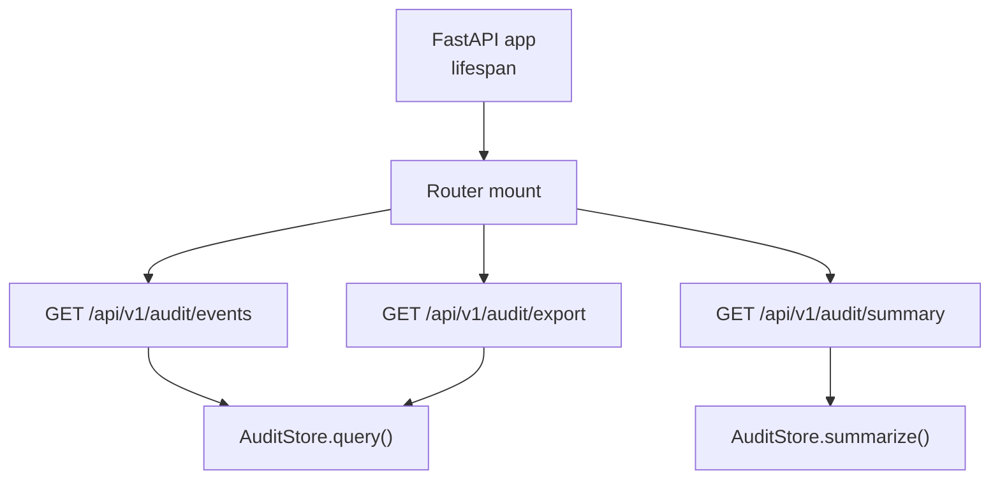
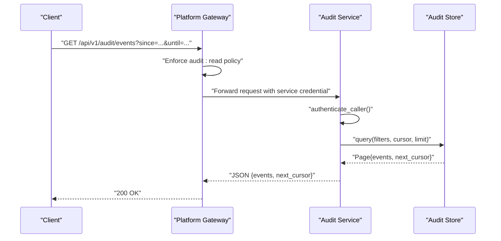
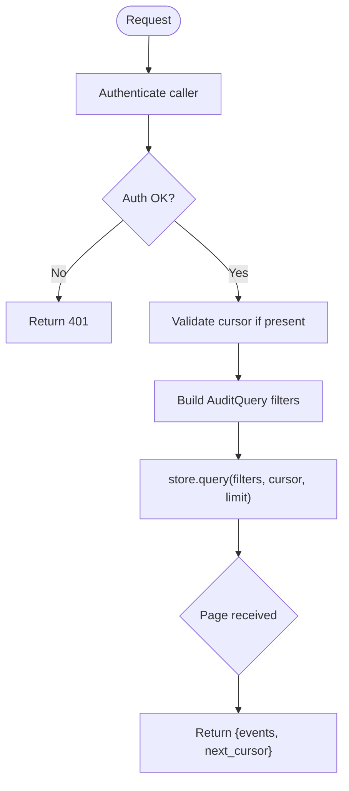
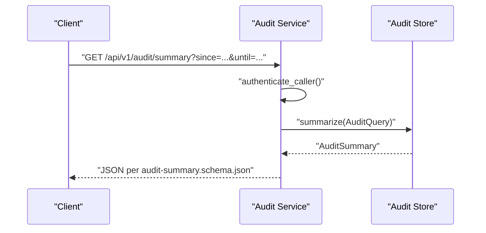
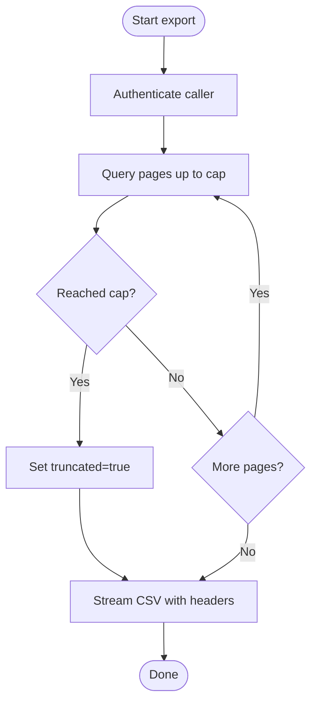
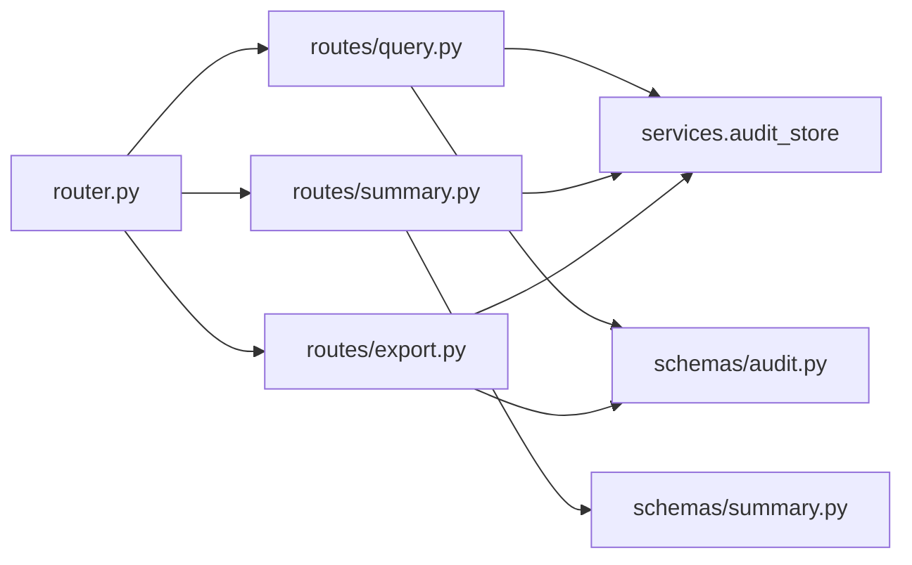

# Audit Query API

<cite>
**Referenced Files in This Document**
- [app.py](file://products/audit-service/src/audit_service/app.py)
- [router.py](file://products/audit-service/src/audit_service/api/router.py)
- [query.py](file://products/audit-service/src/audit_service/api/routes/query.py)
- [summary.py](file://products/audit-service/src/audit_service/api/routes/summary.py)
- [export.py](file://products/audit-service/src/audit_service/api/routes/export.py)
- [audit.py](file://products/audit-service/src/audit_service/schemas/audit.py)
- [summary_schema.py](file://products/audit-service/src/audit_service/schemas/summary.py)
- [audit-event.schema.json](file://shared/shared-contracts/schemas/audit-event.schema.json)
- [audit-summary.schema.json](file://shared/shared-contracts/schemas/audit-summary.schema.json)
</cite>

## Table of Contents
1. Introduction
2. Project Structure
3. Core Components
4. Architecture Overview
5. Detailed Component Analysis
6. Dependency Analysis
7. Performance Considerations
8. Troubleshooting Guide
9. Conclusion

## Introduction
This document specifies the Audit query endpoints that expose platform activity logs and compliance data. It covers:
- GET /api/v1/audit/events for paginated event listings with filtering by time range, user, action type, and resource.
- GET /api/v1/audit/summary for deterministic aggregate statistics over stored audit envelopes.
- GET /api/v1/audit/export for bounded CSV export of filtered events.

It also documents authentication and authorization posture, retention and archival behavior, export limitations, and performance considerations for large datasets.

## Project Structure
The Audit service exposes its APIs through a FastAPI application that mounts routers for health, ingest, query, summary, and export. The lifespan initializes the audit store and retention task.

**Diagram sources**
- [app.py:20-40](file://products/audit-service/src/audit_service/app.py#L20-L40)
- [router.py:5-10](file://products/audit-service/src/audit_service/api/router.py#L5-L10)
- [query.py:35-94](file://products/audit-service/src/audit_service/api/routes/query.py#L35-L94)
- [summary.py:34-78](file://products/audit-service/src/audit_service/api/routes/summary.py#L34-L78)
- [export.py:87-163](file://products/audit-service/src/audit_service/api/routes/export.py#L87-L163)

**Section sources**
- [app.py:20-70](file://products/audit-service/src/audit_service/app.py#L20-L70)
- [router.py:1-11](file://products/audit-service/src/audit_service/api/router.py#L1-L11)

## Core Components
- Events listing endpoint: returns stored audit envelopes newest-first with keyset cursor pagination and supports filtering by username, session_id, request_id, event_type, service, outcome, since, until, plus limit and cursor.
- Summary endpoint: returns deterministic aggregates over envelope columns only (event_type, outcome, service, username), including top actors and decision-chain counts.
- Export endpoint: streams RFC-4180 CSV with a fixed column set, hard-capped row count, and truncation headers to signal completeness.

Authentication and authorization:
- Each endpoint authenticates the caller via the shared ingest auth mechanism before processing.
- User-level authorization (audit:read) is enforced by the platform gateway prior to proxying requests; this route additionally requires a registered service caller.

Data contracts:
- Event envelope schema is defined centrally and returned verbatim.
- Summary response schema defines required fields and deterministic ordering rules.

**Section sources**
- [query.py:35-94](file://products/audit-service/src/audit_service/api/routes/query.py#L35-L94)
- [summary.py:34-78](file://products/audit-service/src/audit_service/api/routes/summary.py#L34-L78)
- [export.py:87-163](file://products/audit-service/src/audit_service/api/routes/export.py#L87-L163)
- [audit-event.schema.json:1-94](file://shared/shared-contracts/schemas/audit-event.schema.json#L1-L94)
- [audit-summary.schema.json:1-109](file://shared/shared-contracts/schemas/audit-summary.schema.json#L1-L109)

## Architecture Overview
End-to-end flow for an audit query:
- Client calls the audit endpoint behind the platform gateway.
- Gateway enforces user-level policy (audit:read) and forwards under a service credential.
- Audit service authenticates the caller, applies filters, queries or summarizes from the audit store, records metrics and observability, and returns results.

**Diagram sources**
- [query.py:35-94](file://products/audit-service/src/audit_service/api/routes/query.py#L35-L94)
- [summary.py:34-78](file://products/audit-service/src/audit_service/api/routes/summary.py#L34-L78)
- [export.py:87-163](file://products/audit-service/src/audit_service/api/routes/export.py#L87-L163)

## Detailed Component Analysis

### GET /api/v1/audit/events
- Purpose: Paginated listing of stored audit envelopes newest-first.
- Authentication: Caller authenticated via ingest auth; user-level authorization enforced upstream by the platform gateway.
- Request parameters:
  - username: string | null
  - session_id: string | null
  - request_id: string | null
  - event_type: string | null
  - service: string | null
  - outcome: allow | deny | success | error | null
  - since: datetime | null
  - until: datetime | null
  - cursor: string | null (keyset cursor)
  - limit: integer, default 50, min 1, max 200
- Response:
  - events: array of AuditEvent objects per shared schema
  - next_cursor: string | null
- Error handling:
  - 401 on authentication failure
  - 400 on invalid cursor
- Observability: Records number of returned events and filter dimensions.

**Diagram sources**
- [query.py:35-94](file://products/audit-service/src/audit_service/api/routes/query.py#L35-L94)

**Section sources**
- [query.py:35-94](file://products/audit-service/src/audit_service/api/routes/query.py#L35-L94)
- [audit.py:67-83](file://products/audit-service/src/audit_service/schemas/audit.py#L67-L83)
- [audit-event.schema.json:1-94](file://shared/shared-contracts/schemas/audit-event.schema.json#L1-L94)

### GET /api/v1/audit/summary
- Purpose: Deterministic aggregate statistics over stored envelopes using envelope columns only.
- Authentication: Same as events endpoint.
- Request parameters:
  - username, session_id, request_id, event_type, service, outcome, since, until (all optional).
- Response fields:
  - total_events: integer
  - window: echo of applied filters (omits unset fields)
  - by_event_type: list of {name, count}
  - by_outcome: list of {name, count}
  - by_service: list of {name, count}
  - top_actors: up to 10 busiest usernames with counts
  - decision_chain: confirmation_decided, execution_requested, execution_completed, execution_rejected (integers, zero when absent)
- Ordering: All lists sort by count descending, then name ascending.

**Diagram sources**
- [summary.py:34-78](file://products/audit-service/src/audit_service/api/routes/summary.py#L34-L78)
- [summary_schema.py:1-138](file://products/audit-service/src/audit_service/schemas/summary.py#L1-L138)
- [audit-summary.schema.json:1-109](file://shared/shared-contracts/schemas/audit-summary.schema.json#L1-L109)

**Section sources**
- [summary.py:34-78](file://products/audit-service/src/audit_service/api/routes/summary.py#L34-L78)
- [summary_schema.py:1-138](file://products/audit-service/src/audit_service/schemas/summary.py#L1-L138)
- [audit-summary.schema.json:1-109](file://shared/shared-contracts/schemas/audit-summary.schema.json#L1-L109)

### GET /api/v1/audit/export
- Purpose: Stream a bounded CSV export of filtered events newest-first.
- Authentication: Same as other endpoints.
- Request parameters:
  - username, session_id, request_id, event_type, service, outcome, since, until (all optional).
- Export behavior:
  - Fixed CSV columns: occurred_at, event_type, service, outcome, username, actor, subject, session_id, request_id, details (details serialized as sorted-key JSON).
  - Rows are collected page-by-page (page size 200) up to a hard cap configured by export_max_rows.
  - Truncation is signaled via response headers before any body bytes stream.
- Response:
  - Content-Type: text/csv
  - Headers:
    - X-Audit-Export-Truncated: true | false
    - X-Audit-Export-Rows: integer count of rows emitted
  - Body: RFC-4180 CSV with header row followed by event rows.

**Diagram sources**
- [export.py:87-163](file://products/audit-service/src/audit_service/api/routes/export.py#L87-L163)

**Section sources**
- [export.py:87-163](file://products/audit-service/src/audit_service/api/routes/export.py#L87-L163)

## Dependency Analysis
- Router wiring mounts all sub-routers into a single API router.
- Application lifespan initializes the audit store and starts retention tasks.
- Routes depend on:
  - Ingest authentication helper for caller identity.
  - Audit store abstraction for query/summarize operations.
  - Shared schemas for event and summary contracts.

**Diagram sources**
- [router.py:1-11](file://products/audit-service/src/audit_service/api/router.py#L1-L11)
- [query.py:1-94](file://products/audit-service/src/audit_service/api/routes/query.py#L1-L94)
- [summary.py:1-78](file://products/audit-service/src/audit_service/api/routes/summary.py#L1-L78)
- [export.py:1-163](file://products/audit-service/src/audit_service/api/routes/export.py#L1-L163)
- [audit.py:1-83](file://products/audit-service/src/audit_service/schemas/audit.py#L1-L83)
- [summary_schema.py:1-138](file://products/audit-service/src/audit_service/schemas/summary.py#L1-L138)

**Section sources**
- [router.py:1-11](file://products/audit-service/src/audit_service/api/router.py#L1-L11)
- [app.py:20-70](file://products/audit-service/src/audit_service/app.py#L20-L70)

## Performance Considerations
- Pagination: Use keyset cursor pagination for events to avoid offset scans. Keep limit within 1–200; prefer smaller limits for interactive UIs.
- Filtering: Narrow queries with event_type, service, outcome, and time windows (since/until) to reduce dataset scanned by the store.
- Summaries: Aggregates operate on envelope columns only; they do not inspect details payloads, which improves performance.
- Exports:
  - Row cap: Export is hard-capped by configuration; consumers must handle truncation via X-Audit-Export-Truncated.
  - Streaming: CSV is streamed after precomputing headers; ensure downstream consumers can handle large responses.
- Retention and archival:
  - The service initializes a retention task at startup and shuts it down gracefully. Consumers should rely on the store’s retention-bounded window rather than assuming unbounded history.
- Observability:
  - Requests are logged with method, path, status code, and duration. Metrics capture rejected queries, summary queries, and exports.

[No sources needed since this section provides general guidance]

## Troubleshooting Guide
Common issues and resolutions:
- 401 Unauthorized:
  - Cause: Failed caller authentication.
  - Action: Ensure the platform gateway forwards a valid service credential and that the caller is registered.
- 400 Bad Request:
  - Cause: Invalid cursor provided to events endpoint.
  - Action: Re-fetch the latest cursor from the previous response or omit cursor for first page.
- Large exports:
  - Symptom: Very large CSV bodies.
  - Action: Apply tighter filters (time range, event_type, service, outcome) and respect the export row cap. Handle X-Audit-Export-Truncated to detect incomplete sets.
- Missing data in summaries:
  - Symptom: Zero counts for certain buckets.
  - Action: Verify filters and confirm that events exist within the requested window; remember the store is retention-bounded.

**Section sources**
- [query.py:51-63](file://products/audit-service/src/audit_service/api/routes/query.py#L51-L63)
- [summary.py:48-52](file://products/audit-service/src/audit_service/api/routes/summary.py#L48-L52)
- [export.py:101-105](file://products/audit-service/src/audit_service/api/routes/export.py#L101-L105)

## Conclusion
The Audit query API provides secure, efficient access to platform activity logs and compliance data through three focused endpoints:
- Paginated event listing with rich filtering and keyset pagination.
- Deterministic summary statistics over envelope columns.
- Bounded, streaming CSV export with explicit truncation signaling.

Follow the documented parameters, respect retention bounds, and apply tight filters to optimize performance. Use the shared schemas to build robust clients that validate responses and handle truncation correctly.