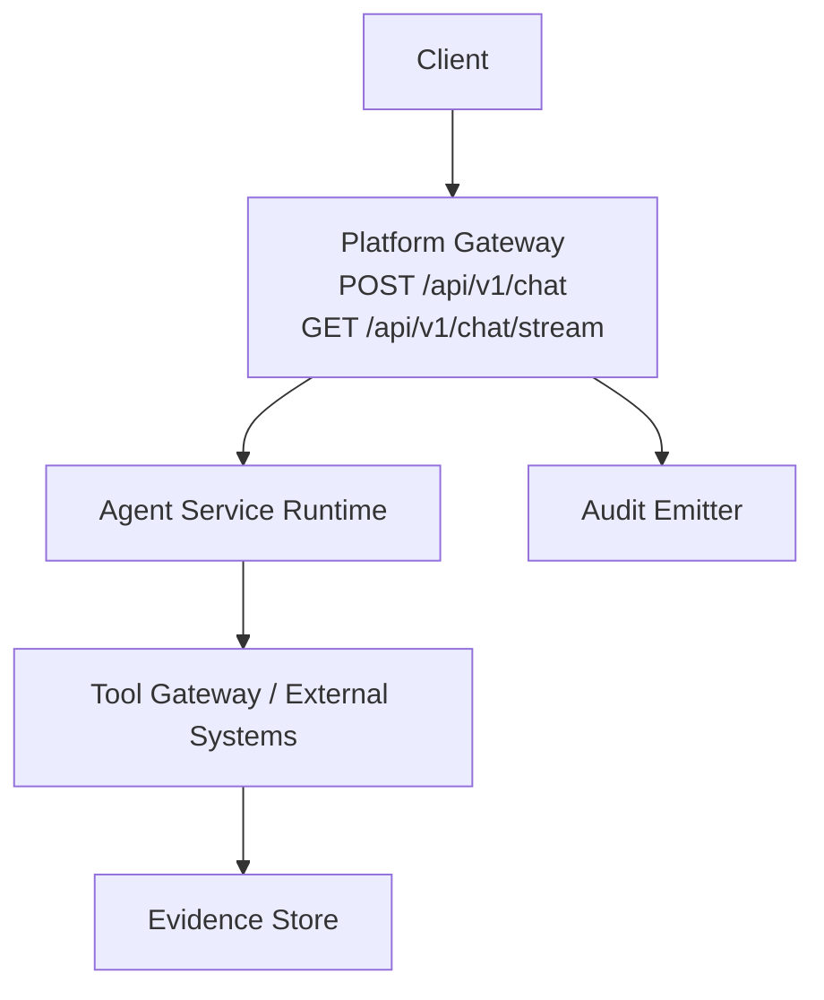
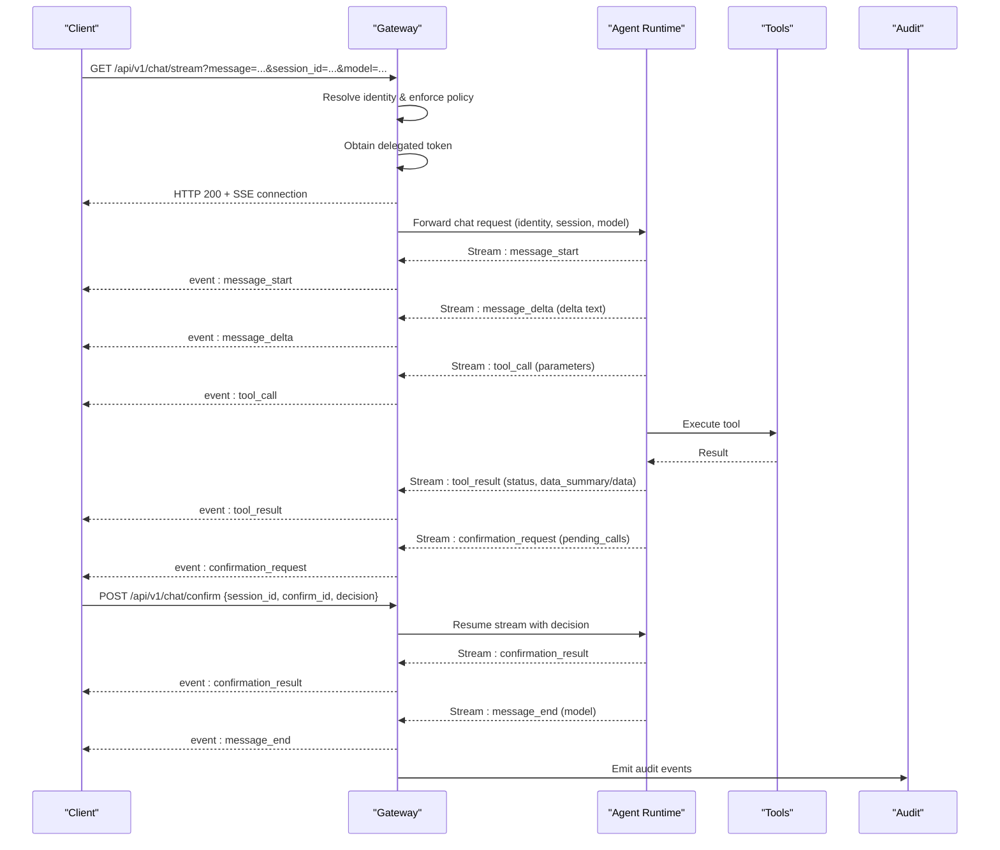
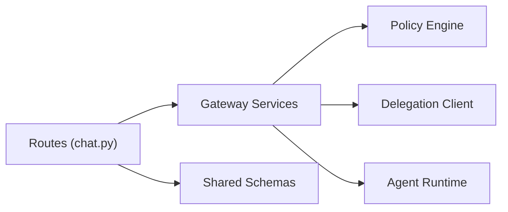

# Chat Streaming API

<cite>
**Referenced Files in This Document**
- [chat.py](file://products/platform-gateway/src/platform_gateway/api/routes/chat.py)
- [gateway_service.py](file://products/platform-gateway/src/platform_gateway/services/gateway_service.py)
- [chat-request.schema.json](file://shared/shared-contracts/schemas/chat-request.schema.json)
- [chat-response.schema.json](file://shared/shared-contracts/schemas/chat-response.schema.json)
- [agent-chat-request.schema.json](file://shared/shared-contracts/schemas/agent-chat-request.schema.json)
- [agent-chat-response.schema.json](file://shared/shared-contracts/schemas/agent-chat-response.schema.json)
- [stream-event.schema.json](file://shared/shared-contracts/schemas/stream-event.schema.json)
- [agent-stream-event.schema.json](file://shared/shared-contracts/schemas/agent-stream-event.schema.json)
- [tool-invocation.schema.json](file://shared/shared-contracts/schemas/tool-invocation.schema.json)
- [session-evidence.schema.json](file://shared/shared-contracts/schemas/session-evidence.schema.json)
</cite>

## Table of Contents
1. Introduction
2. Project Structure
3. Core Components
4. Architecture Overview
5. Detailed Component Analysis
6. Dependency Analysis
7. Performance Considerations
8. Troubleshooting Guide
9. Conclusion

## Introduction
This document specifies the Chat streaming endpoints that enable real-time agent interactions through Server-Sent Events (SSE). It covers:
- The primary chat endpoint for non-streaming responses and the SSE streaming endpoint for progressive delivery.
- Request schemas, including message content, optional model selection, and session context.
- Streaming response event types, payloads, and connection handling patterns.
- Tool invocation callbacks and evidence collection events surfaced during a turn.
- Authentication and authorization requirements, including policy evaluation gates and approval workflows.
- Error handling, timeouts, and retry strategies for long-running conversations and concurrent sessions.

## Project Structure
The Chat streaming surface is exposed by the platform gateway and relays requests to the agent runtime. Schemas are centrally defined in shared contracts.

**Diagram sources**
- [chat.py:37-93](file://products/platform-gateway/src/platform_gateway/api/routes/chat.py#L37-L93)
- [chat.py:96-155](file://products/platform-gateway/src/platform_gateway/api/routes/chat.py#L96-L155)

**Section sources**
- [chat.py:37-155](file://products/platform-gateway/src/platform_gateway/api/routes/chat.py#L37-L155)

## Core Components
- POST /api/v1/chat: Non-streaming chat request that returns a final response envelope.
- GET /api/v1/chat/stream: SSE stream delivering progressive tokens, tool invocations, confirmation prompts, and completion.
- POST /api/v1/chat/confirm: Resumes a parked confirmation and resumes the SSE stream with the decision applied.

Key behaviors enforced at the gateway:
- Identity resolution and policy evaluation before any call reaches the runtime.
- Delegation token acquisition to forward identity downstream.
- Audit logging for start/completion and confirmation events.

**Section sources**
- [chat.py:37-93](file://products/platform-gateway/src/platform_gateway/api/routes/chat.py#L37-L93)
- [chat.py:96-155](file://products/platform-gateway/src/platform_gateway/api/routes/chat.py#L96-L155)
- [chat.py:158-199](file://products/platform-gateway/src/platform_gateway/api/routes/chat.py#L158-L199)

## Architecture Overview
The streaming flow authenticates the caller, evaluates policy, obtains a delegated token, and proxies the request to the agent runtime. The runtime emits an SSE stream of typed frames that the gateway forwards to the client.

**Diagram sources**
- [chat.py:96-155](file://products/platform-gateway/src/platform_gateway/api/routes/chat.py#L96-L155)
- [chat.py:158-199](file://products/platform-gateway/src/platform_gateway/api/routes/chat.py#L158-L199)

## Detailed Component Analysis

### Endpoint: POST /api/v1/chat
- Purpose: Submit a chat turn and receive a final response envelope.
- Method: POST
- Path: /api/v1/chat
- Headers:
  - Authorization: Bearer <token> (used to resolve identity and obtain delegated token)
  - X-Request-ID: Optional correlation ID
- Request body: See Chat Request schema.
- Response: See Chat Response schema.
- Behavior:
  - Resolves identity from the request.
  - Enforces policy for action "chat".
  - Obtains a delegated token using the caller’s subject and optional bearer token.
  - Forwards message, session_id, input_modality, and model to the runtime.
  - Emits audit events for completion.

Request schema highlights (Chat Request):
- message (required): string, min length 1.
- session_id (optional): string to continue an existing conversation.
- user_id (optional): normalized user identifier propagated from identity layer.
- request_id (optional): correlation identifier across components.
- input_modality (optional): "text" or "voice"; metadata only, never affects policy or HITL outcomes.
- model (optional): string or null; model id from models catalog; metadata only.

Response schema highlights (Chat Response):
- session_id, request_id, response (required).
- status: "ok", "partial", or "error".

**Section sources**
- [chat.py:37-93](file://products/platform-gateway/src/platform_gateway/api/routes/chat.py#L37-L93)
- [chat-request.schema.json:1-38](file://shared/shared-contracts/schemas/chat-request.schema.json#L1-L38)
- [chat-response.schema.json:1-26](file://shared/shared-contracts/schemas/chat-response.schema.json#L1-L26)

### Endpoint: GET /api/v1/chat/stream
- Purpose: Start an SSE stream for progressive delivery of assistant output, tool invocations, and confirmation prompts.
- Method: GET
- Path: /api/v1/chat/stream
- Query parameters:
  - message (required): string, operator prompt.
  - session_id (optional): string to continue an existing conversation.
  - model (optional): string; per-turn model selection relayed verbatim to the runtime.
  - input_modality (optional): "text" or "voice"; defaults to "text".
- Headers:
  - Authorization: Bearer <token>
  - X-Request-ID: Optional correlation ID
- Response: StreamingResponse with SSE frames.

Streaming event types and payloads:
- message_start: Signals the beginning of a new assistant message.
- message_delta: Incremental text chunk delivered progressively.
- tool_call: Indicates the agent is invoking a tool; includes tool_name, parameters, and call_id.
- tool_result: Indicates tool execution outcome; includes status, optional data_summary, and optionally full data within stream size cap.
- confirmation_request: Parks mutating actions pending human approval; includes pending_calls array with call_id, tool_name, parameters, risk_level, action, display_hint, and optional change_request projection. May include flow_summary and approval_kind for browser flows.
- confirmation_result: Reflects the result of a confirm action; echoes pending_calls and carries status such as approved/denied/expired/interrupted.
- message_end: Terminal frame carrying optional model that resolved for the turn.
- error: Carries error code and message when a failure occurs on the stream.

Connection handling:
- The gateway opens an SSE connection after identity resolution and policy enforcement.
- The stream continues until the turn completes (message_end), an error occurs, or the client disconnects.
- Confirmation bridges pause the stream until POST /api/v1/chat/confirm resumes it.

**Section sources**
- [chat.py:96-155](file://products/platform-gateway/src/platform_gateway/api/routes/chat.py#L96-L155)
- [agent-stream-event.schema.json:1-160](file://shared/shared-contracts/schemas/agent-stream-event.schema.json#L1-L160)
- [stream-event.schema.json:1-27](file://shared/shared-contracts/schemas/stream-event.schema.json#L1-L27)

### Endpoint: POST /api/v1/chat/confirm
- Purpose: Answer a parked kernel confirmation and resume the SSE stream with the decision applied.
- Method: POST
- Path: /api/v1/chat/confirm
- Request body:
  - session_id: string identifying the conversation.
  - confirm_id: string correlating the confirmation_request with its result.
  - decision: string indicating the approver’s choice (e.g., approve/deny).
- Headers:
  - Authorization: Bearer <token>
  - X-Request-ID: Optional correlation ID
- Response: StreamingResponse resuming the SSE stream with confirmation_result frames followed by continuation of the original turn.

Behavior:
- Enforces policy for the specific action used for confirm operations.
- Emits audit events for the confirmation lifecycle.
- Relays the decision to the runtime to unblock parked calls.

**Section sources**
- [chat.py:158-199](file://products/platform-gateway/src/platform_gateway/api/routes/chat.py#L158-L199)

### Data Models and Schemas

#### Chat Request (v1)
- Fields: message (required), session_id (optional), user_id (optional), request_id (optional), input_modality (optional, enum text|voice), model (optional, string|null).
- Notes: input_modality and model are metadata-only and do not influence policy or HITL outcomes.

#### Chat Response (v1)
- Fields: session_id, request_id, response (required), status (enum ok|partial|error).

#### Agent Chat Request (v2)
- Fields: message (required), session_id (optional), input_modality (optional), response_schema (optional object), model (optional).
- Notes: v2 conveys identity via headers rather than body.

#### Agent Chat Response (v2)
- Fields: session_id, request_id, content (required), status (enum ok|partial|error), structured_output (optional object|null), model (optional string|null).

#### Stream Event (generic)
- Fields: event (enum message_start|message_delta|message_end|error), request_id, session_id, delta (optional), message (optional).

#### Agent Stream Event (detailed)
- Types: message_start, message_delta, message_end, error, tool_call, tool_result, confirmation_request, confirmation_result.
- Key fields: type, session_id, request_id, delta, message, model, confirm_id, pending_calls, approval_kind, flow_summary, tool_name, call_id, parameters, status, evidence, data_summary, data, error.

#### Tool Invocation
- Fields: tool_name (required), parameters (object), identity_context (object with sub, username, roles), request_id (required).

#### Session Evidence
- Represents persisted tool_call/tool_result frames for a turn, including truncation markers and timestamps.

**Section sources**
- [chat-request.schema.json:1-38](file://shared/shared-contracts/schemas/chat-request.schema.json#L1-L38)
- [chat-response.schema.json:1-26](file://shared/shared-contracts/schemas/chat-response.schema.json#L1-L26)
- [agent-chat-request.schema.json:1-35](file://shared/shared-contracts/schemas/agent-chat-request.schema.json#L1-L35)
- [agent-chat-response.schema.json:1-35](file://shared/shared-contracts/schemas/agent-chat-response.schema.json#L1-L35)
- [stream-event.schema.json:1-27](file://shared/shared-contracts/schemas/stream-event.schema.json#L1-L27)
- [agent-stream-event.schema.json:1-160](file://shared/shared-contracts/schemas/agent-stream-event.schema.json#L1-L160)
- [tool-invocation.schema.json:1-35](file://shared/shared-contracts/schemas/tool-invocation.schema.json#L1-L35)
- [session-evidence.schema.json:1-58](file://shared/shared-contracts/schemas/session-evidence.schema.json#L1-L58)

### Authentication and Authorization
- Authentication:
  - Requests must include Authorization: Bearer <token>.
  - The gateway extracts the raw bearer token and uses it to obtain a delegated token for downstream calls.
- Identity resolution:
  - Identity is resolved from the request context and propagated downstream.
- Policy evaluation:
  - Before processing chat requests, the gateway enforces policy for the "chat" action.
  - Confirmations use a dedicated action constant for policy checks.
- Approval workflows:
  - Mutating tool calls can be parked as confirmation_request frames.
  - Clients respond via POST /api/v1/chat/confirm to resume the stream with the decision applied.
  - Pending calls carry risk_level, action, display_hint, and optional change_request projections to support UI rendering and auditing.

**Section sources**
- [chat.py:37-93](file://products/platform-gateway/src/platform_gateway/api/routes/chat.py#L37-L93)
- [chat.py:96-155](file://products/platform-gateway/src/platform_gateway/api/routes/chat.py#L96-L155)
- [chat.py:158-199](file://products/platform-gateway/src/platform_gateway/api/routes/chat.py#L158-L199)
- [agent-stream-event.schema.json:36-109](file://shared/shared-contracts/schemas/agent-stream-event.schema.json#L36-L109)

### Streaming Response Format and Connection Handling
- Event sequence:
  - message_start initiates a turn.
  - message_delta delivers incremental text.
  - tool_call and tool_result provide evidence of tool usage and results.
  - confirmation_request pauses the turn pending approval.
  - confirmation_result resumes the turn with the decision.
  - message_end concludes the turn and may include the resolved model.
  - error indicates failures at any point.
- Data sizes:
  - Full tool result data may be included when within stream size caps; otherwise, a condensed data_summary is provided.
- Connection lifecycle:
  - The SSE connection remains open until the turn completes or an error occurs.
  - Clients should handle reconnection if the connection drops unexpectedly.

**Section sources**
- [agent-stream-event.schema.json:1-160](file://shared/shared-contracts/schemas/agent-stream-event.schema.json#L1-L160)

### Examples

- Compose a chat message:
  - Use POST /api/v1/chat with a JSON body containing message and optional session_id, input_modality, and model.
  - Reference: [chat-request.schema.json:1-38](file://shared/shared-contracts/schemas/chat-request.schema.json#L1-L38)

- Start a streaming session:
  - Use GET /api/v1/chat/stream with query parameters message, session_id (optional), model (optional), input_modality (optional).
  - Reference: [chat.py:96-155](file://products/platform-gateway/src/platform_gateway/api/routes/chat.py#L96-L155)

- Handle tool invocation callbacks:
  - Listen for tool_call events to capture parameters and call_id, then correlate with tool_result events for outcomes.
  - Reference: [agent-stream-event.schema.json:110-148](file://shared/shared-contracts/schemas/agent-stream-event.schema.json#L110-L148)

- Collect evidence:
  - Persist tool_call and tool_result frames into the evidence store for later retrieval and auditing.
  - Reference: [session-evidence.schema.json:1-58](file://shared/shared-contracts/schemas/session-evidence.schema.json#L1-L58)

- Approve or deny a parked action:
  - Call POST /api/v1/chat/confirm with session_id, confirm_id, and decision to resume the stream.
  - Reference: [chat.py:158-199](file://products/platform-gateway/src/platform_gateway/api/routes/chat.py#L158-L199)

## Dependency Analysis
The gateway routes depend on services for identity resolution, policy enforcement, delegation, and streaming proxying. Shared schemas define the contract between clients and the platform.

**Diagram sources**
- [chat.py:37-155](file://products/platform-gateway/src/platform_gateway/api/routes/chat.py#L37-L155)

**Section sources**
- [chat.py:37-155](file://products/platform-gateway/src/platform_gateway/api/routes/chat.py#L37-L155)

## Performance Considerations
- Long-running conversations:
  - Use session_id to maintain state across turns and reduce overhead.
  - Prefer streaming for large outputs to avoid blocking the client.
- Concurrent sessions:
  - Each SSE connection is independent; ensure client-side concurrency limits to avoid resource exhaustion.
- Model selection:
  - Per-turn model selection is relayed verbatim; unknown models are refused fail-closed by the runtime.
- Evidence and data caps:
  - Tool result data may be truncated to fit stream size; rely on data_summary for UI rendering and fetch full details via evidence APIs if needed.
- Audit and observability:
  - Audit events are emitted for chat start/completion and confirmations; use these for monitoring and debugging.

[No sources needed since this section provides general guidance]

## Troubleshooting Guide
Common issues and resolutions:
- Missing or invalid Authorization header:
  - Ensure a valid Bearer token is present; the gateway requires it to resolve identity and obtain a delegated token.
- Policy denial:
  - If policy enforcement fails, the request will be rejected before reaching the runtime; verify roles and permissions.
- Stream interruptions:
  - On network errors or server restarts, reconnect to GET /api/v1/chat/stream with the same session_id to resume where possible.
- Timeouts:
  - Implement client-side timeouts and retries with exponential backoff for SSE connections.
- Confirmation stalls:
  - If a confirmation_request arrives and no decision is received, poll or monitor the approval inbox and call POST /api/v1/chat/confirm with the correct confirm_id.

**Section sources**
- [chat.py:96-155](file://products/platform-gateway/src/platform_gateway/api/routes/chat.py#L96-L155)
- [chat.py:158-199](file://products/platform-gateway/src/platform_gateway/api/routes/chat.py#L158-L199)

## Conclusion
The Chat streaming API provides a robust, auditable, and policy-enforced interface for real-time agent interactions. Clients should:
- Authenticate with Bearer tokens and respect policy decisions.
- Use POST /api/v1/chat for simple turns and GET /api/v1/chat/stream for progressive delivery.
- Handle tool_call/tool_result events for evidence and tool integration.
- Manage confirmation_request/confirmation_result flows for safe mutating actions.
- Implement resilient connection handling, timeouts, and retries for production-grade experiences.

[No sources needed since this section summarizes without analyzing specific files]