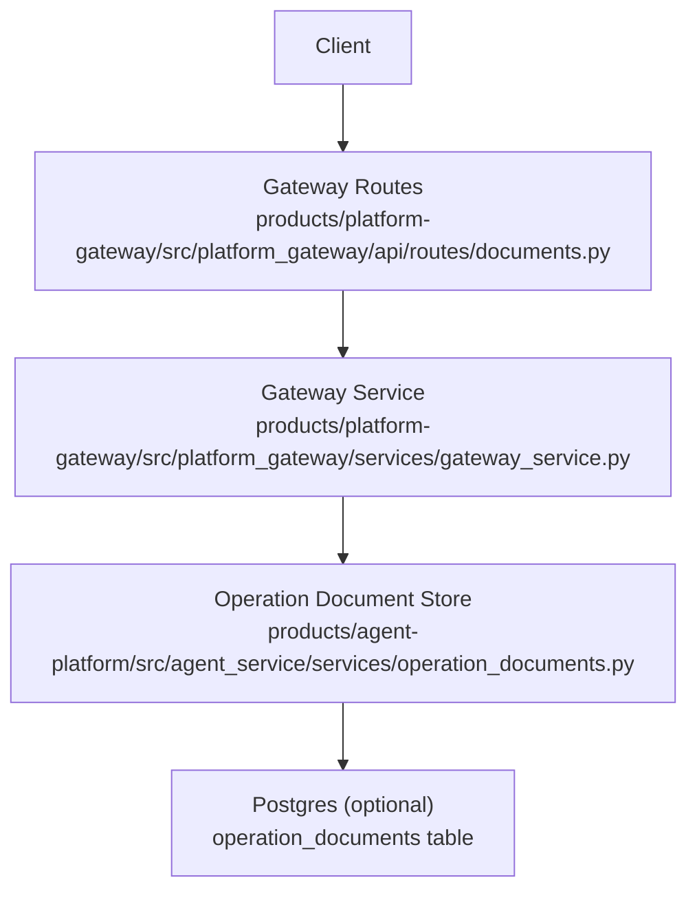
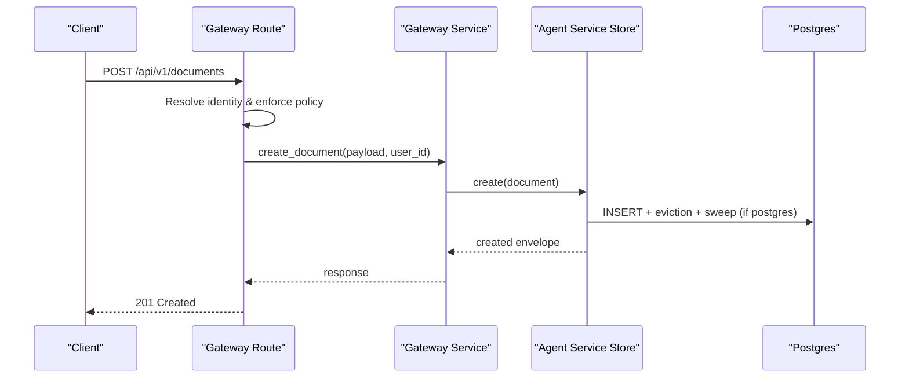
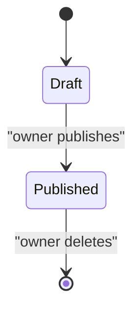
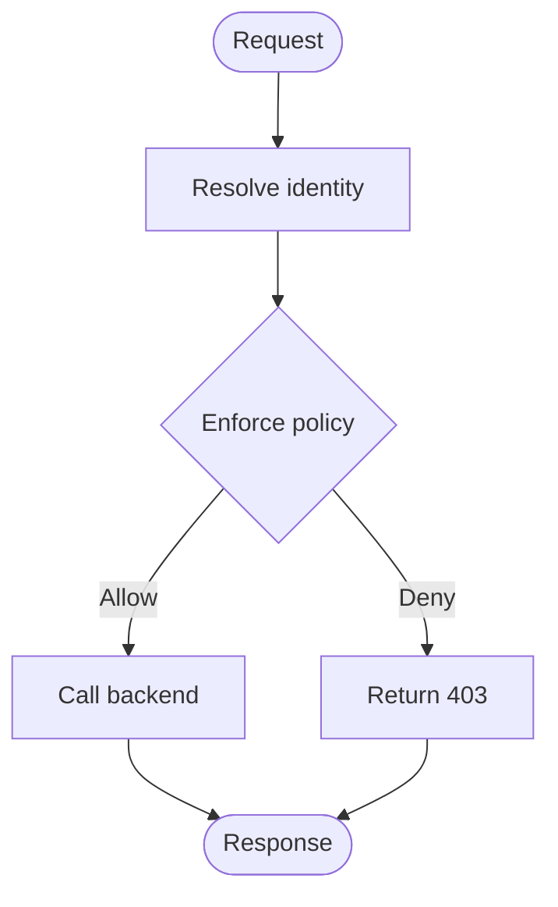
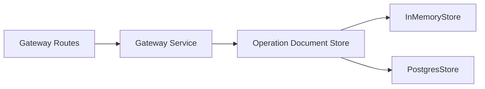

# Document Repository API

<cite>
**Referenced Files in This Document**
- [documents.py](file://products/platform-gateway/src/platform_gateway/api/routes/documents.py)
- [gateway_service.py](file://products/platform-gateway/src/platform_gateway/services/gateway_service.py)
- [operation_documents.py](file://products/agent-platform/src/agent_service/services/operation_documents.py)
- [operation-document.schema.json](file://shared/shared-contracts/schemas/operation-document.schema.json)
</cite>

## Table of Contents
1. [Introduction](#introduction)
2. [Project Structure](#project-structure)
3. [Core Components](#core-components)
4. [Architecture Overview](#architecture-overview)
5. [Detailed Component Analysis](#detailed-component-analysis)
6. [Dependency Analysis](#dependency-analysis)
7. [Performance Considerations](#performance-considerations)
8. [Troubleshooting Guide](#troubleshooting-guide)
9. [Conclusion](#conclusion)

## Introduction
This document specifies the Document Repository API for operational documents and knowledge base within the platform. It covers HTTP endpoints for creating, listing, fetching, publishing, and deleting operation documents; defines request/response schemas; explains authentication and authorization by roles and document classification; describes lifecycle management (draft to published); and outlines indexing, search, versioning, collaboration, performance, and caching considerations grounded in the repository’s design.

## Project Structure
The Document Repository spans three layers:
- Gateway routes expose REST endpoints and enforce policy.
- Gateway service forwards requests to the agent service and handles identity and policy context.
- Agent service implements the typed document store with in-memory and Postgres backends, lifecycle rules, retention, and visibility constraints.

**Diagram sources**
- [documents.py:30-187](file://products/platform-gateway/src/platform_gateway/api/routes/documents.py#L30-L187)
- [gateway_service.py](file://products/platform-gateway/src/platform_gateway/services/gateway_service.py)
- [operation_documents.py:95-119](file://products/agent-platform/src/agent_service/services/operation_documents.py#L95-L119)

**Section sources**
- [documents.py:30-187](file://products/platform-gateway/src/platform_gateway/api/routes/documents.py#L30-L187)
- [operation_documents.py:127-210](file://products/agent-platform/src/agent_service/services/operation_documents.py#L127-L210)
- [operation_documents.py:380-523](file://products/agent-platform/src/agent_service/services/operation_documents.py#L380-L523)

## Core Components
- Gateway route layer: FastAPI router exposing document endpoints with policy enforcement and audit logging.
- Gateway service: Identity resolution, policy evaluation, and forwarding to the agent service.
- Operation document store: Typed, immutable document model with draft/published lifecycle, owner-only mutation, bounded per-owner storage, retention sweep, and two backends (in-memory default, Postgres deployed).

Key behaviors:
- Drafts are visible only to their owner; published documents are visible to all holders of the read action.
- Publishing is one-way and owner-only; once published, documents cannot be edited.
- Deletion is owner-only.
- Provenance anchors session IDs and cited record IDs without live references.
- Optional prose generation may fail gracefully, leaving a digest-only document.

**Section sources**
- [documents.py:30-187](file://products/platform-gateway/src/platform_gateway/api/routes/documents.py#L30-L187)
- [operation_documents.py:49-87](file://products/agent-platform/src/agent_service/services/operation_documents.py#L49-L87)
- [operation_documents.py:95-119](file://products/agent-platform/src/agent_service/services/operation_documents.py#L95-L119)
- [operation_documents.py:127-210](file://products/agent-platform/src/agent_service/services/operation_documents.py#L127-L210)
- [operation_documents.py:380-523](file://products/agent-platform/src/agent_service/services/operation_documents.py#L380-L523)

## Architecture Overview
The gateway routes validate inputs, resolve identity, enforce policies, and delegate to the gateway service. The gateway service calls into the agent service’s operation document store, which persists documents in memory or Postgres with lifecycle and retention controls.

**Diagram sources**
- [documents.py:30-86](file://products/platform-gateway/src/platform_gateway/api/routes/documents.py#L30-L86)
- [gateway_service.py](file://products/platform-gateway/src/platform_gateway/services/gateway_service.py)
- [operation_documents.py:425-459](file://products/agent-platform/src/agent_service/services/operation_documents.py#L425-L459)

## Detailed Component Analysis

### API Endpoints

- POST /api/v1/documents
  - Purpose: Create an operations document draft.
  - Authentication: Requires identity resolution via gateway.
  - Authorization: Enforces documents:create; incident_report additionally requires incident:read.
  - Request body: See schema below.
  - Response: Document envelope including document_id, document_type, state=draft, owner_user_id, label, timestamps, provenance, digest, prose_status, and optional summary/blurb.
  - Notes: Foreign-session coverage is computed and forwarded upstream; agent enforces approvals:list for foreign metadata.

- GET /api/v1/documents
  - Purpose: List documents.
  - Query parameter: scope=mine|published (default mine).
  - Authorization: Requires documents:read.
  - Behavior: mine includes caller’s drafts; published returns only published documents.

- GET /api/v1/documents/{document_id}
  - Purpose: Fetch a single document by ID.
  - Authorization: Requires documents:read.
  - Behavior: Returns full document if accessible; foreign drafts return 404.

- POST /api/v1/documents/{document_id}/publish
  - Purpose: One-way publish from draft to published.
  - Authorization: Requires documents:create (owner-only semantics enforced downstream).
  - Behavior: Already-published responses indicate conflict semantics.

- DELETE /api/v1/documents/{document_id}
  - Purpose: Delete a document.
  - Authorization: Requires documents:create (owner-only semantics enforced downstream).
  - Behavior: Only owner can delete.

Note: There is no GET /api/v1/documents/search endpoint in the current routes. Search is not exposed at this layer.

**Section sources**
- [documents.py:30-187](file://products/platform-gateway/src/platform_gateway/api/routes/documents.py#L30-L187)

### Request and Response Schemas

- DocumentCreateRequest fields (as used by the gateway):
  - document_type: string, enum ["shift_summary", "incident_report"].
  - label: string, length-bounded.
  - provenance: object with sessions array and optional incident_id for incident_report.
  - digest: object, type-specific deterministic content copied from durable stores.
  - prose: optional string narrative generated from digest.
  - prose_status: enum ["included", "failed", "not_requested"].
  - summary: optional deterministic counts-only one-liner.
  - blurb: optional AI-generated one-line story extracted from prose.

- Full document response (single fetch):
  - Includes all fields defined by the shared schema, including document_id, document_type, state, owner_user_id, label, created_at, published_at, provenance, digest, prose, prose_status, summary, blurb.

- Listing envelopes:
  - Envelope rows omit digest and prose; they include summary and blurb where available.

For exact field definitions and constraints, refer to the shared schema.

**Section sources**
- [operation-document.schema.json:1-115](file://shared/shared-contracts/schemas/operation-document.schema.json#L1-L115)

### Lifecycle Management

- States: draft -> published (one-way).
- Visibility:
  - Drafts: visible only to owner.
  - Published: visible to all documents:read holders.
- Owner-only actions: publish and delete.
- Retention and caps:
  - Per-owner cap limits stored documents; oldest evicted first.
  - Age-based retention sweeps expired rows opportunistically on writes and startup.

**Diagram sources**
- [operation_documents.py:41-42](file://products/agent-platform/src/agent_service/services/operation_documents.py#L41-L42)
- [operation_documents.py:144-154](file://products/agent-platform/src/agent_service/services/operation_documents.py#L144-L154)
- [operation_documents.py:178-183](file://products/agent-platform/src/agent_service/services/operation_documents.py#L178-L183)

**Section sources**
- [operation_documents.py:41-42](file://products/agent-platform/src/agent_service/services/operation_documents.py#L41-L42)
- [operation_documents.py:144-154](file://products/agent-platform/src/agent_service/services/operation_documents.py#L144-L154)
- [operation_documents.py:178-183](file://products/agent-platform/src/agent_service/services/operation_documents.py#L178-L183)
- [operation_documents.py:188-210](file://products/agent-platform/src/agent_service/services/operation_documents.py#L188-L210)
- [operation_documents.py:425-459](file://products/agent-platform/src/agent_service/services/operation_documents.py#L425-L459)

### Authentication and Authorization

- Authentication:
  - Identity is resolved by the gateway before any policy check.
- Authorization:
  - documents:create required for creation, publishing, and deletion.
  - documents:read required for listing and fetching.
  - incident:read additionally required when creating incident_report documents.
  - Foreign-session coverage uses approvals:list evaluation upstream; agent enforces it for foreign metadata tiers.

**Diagram sources**
- [documents.py:30-187](file://products/platform-gateway/src/platform_gateway/api/routes/documents.py#L30-L187)

**Section sources**
- [documents.py:30-187](file://products/platform-gateway/src/platform_gateway/api/routes/documents.py#L30-L187)

### Versioning and Collaboration

- Versioning:
  - Documents are immutable snapshots; edits are not supported after creation.
  - Re-create a new document to evolve content; publish transitions move from draft to published.
- Collaboration:
  - Ownership is tied to owner_user_id; only the owner can publish/delete.
  - Published documents are readable by all authorized users.
  - Provenance records covered sessions and cited record IDs for traceability.

**Section sources**
- [operation_documents.py:49-87](file://products/agent-platform/src/agent_service/services/operation_documents.py#L49-L87)
- [operation_documents.py:95-119](file://products/agent-platform/src/agent_service/services/operation_documents.py#L95-L119)

### Indexing and Full-Text Search

- Current surface:
  - No dedicated search endpoint is exposed in the gateway routes.
- Back-end capabilities:
  - The store provides list_for_owner and list_published queries ordered by creation time.
  - No full-text index or search API is implemented in the referenced files.

Recommendation: If search is required, add a search endpoint that delegates to a search-capable backend while preserving the same authorization and visibility rules.

**Section sources**
- [documents.py:30-187](file://products/platform-gateway/src/platform_gateway/api/routes/documents.py#L30-L187)
- [operation_documents.py:160-176](file://products/agent-platform/src/agent_service/services/operation_documents.py#L160-L176)
- [operation_documents.py:483-499](file://products/agent-platform/src/agent_service/services/operation_documents.py#L483-L499)

### Performance and Caching

- Backend selection:
  - In-memory backend for dev/CI and fallback; Postgres for production deployments.
- Bounded storage:
  - Per-owner cap evicts oldest documents beyond the limit.
- Retention sweep:
  - Expired rows are swept opportunistically on writes and at startup.
- Caching strategy:
  - Not implemented in the referenced store; consider adding a read-through cache for frequently accessed published documents behind the gateway or agent service, respecting documents:read authorization and invalidating on publish/delete.

**Section sources**
- [operation_documents.py:127-210](file://products/agent-platform/src/agent_service/services/operation_documents.py#L127-L210)
- [operation_documents.py:380-523](file://products/agent-platform/src/agent_service/services/operation_documents.py#L380-L523)
- [operation_documents.py:530-568](file://products/agent-platform/src/agent_service/services/operation_documents.py#L530-L568)

## Dependency Analysis
The gateway routes depend on the gateway service for identity and policy enforcement and on the agent service’s operation document store for persistence. The store abstracts backends via a protocol and factory.

**Diagram sources**
- [documents.py:30-187](file://products/platform-gateway/src/platform_gateway/api/routes/documents.py#L30-L187)
- [gateway_service.py](file://products/platform-gateway/src/platform_gateway/services/gateway_service.py)
- [operation_documents.py:95-119](file://products/agent-platform/src/agent_service/services/operation_documents.py#L95-L119)
- [operation_documents.py:127-210](file://products/agent-platform/src/agent_service/services/operation_documents.py#L127-L210)
- [operation_documents.py:380-523](file://products/agent-platform/src/agent_service/services/operation_documents.py#L380-L523)

**Section sources**
- [documents.py:30-187](file://products/platform-gateway/src/platform_gateway/api/routes/documents.py#L30-L187)
- [operation_documents.py:95-119](file://products/agent-platform/src/agent_service/services/operation_documents.py#L95-L119)

## Performance Considerations
- Prefer Postgres backend in production for durability; in-memory is suitable for development and CI.
- Use list_published for high-read scenarios to avoid scanning drafts.
- Leverage per-owner caps and retention sweeps to bound storage growth.
- Add caching for hot published documents at the gateway or agent service layer, ensuring authorization checks and invalidation on mutations.

[No sources needed since this section provides general guidance]

## Troubleshooting Guide
- 403 Forbidden: Indicates policy denial during identity or authorization checks in the gateway routes.
- 404 Not Found: Returned when fetching a document that does not exist or is a foreign draft not visible to the requester.
- 409 Conflict: Returned when attempting to publish an already-published document.
- Backend failures: The store falls back to in-memory when Postgres is unavailable; monitor logs for warnings about backend initialization.

**Section sources**
- [documents.py:30-187](file://products/platform-gateway/src/platform_gateway/api/routes/documents.py#L30-L187)
- [operation_documents.py:530-568](file://products/agent-platform/src/agent_service/services/operation_documents.py#L530-L568)

## Conclusion
The Document Repository API provides a secure, role-based interface for managing operational documents with a strict draft-to-published lifecycle, owner-only mutations, and robust visibility controls. While search is not currently exposed, the store supports efficient listing and retrieval. For large repositories, adopt Postgres backend, leverage caps and retention, and implement caching for frequent reads. Versioning is achieved through immutable snapshots and re-creation, and collaboration is enabled via ownership and publication semantics.