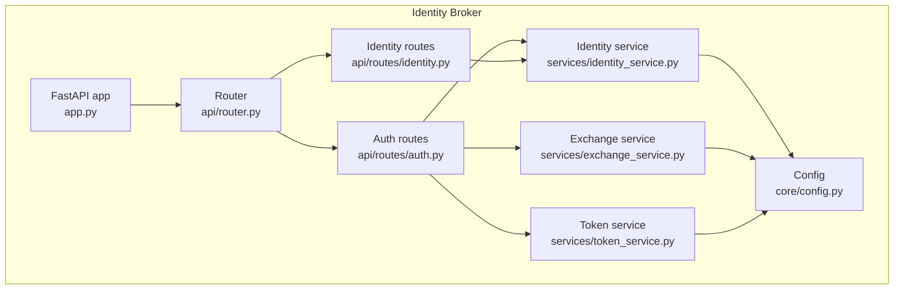
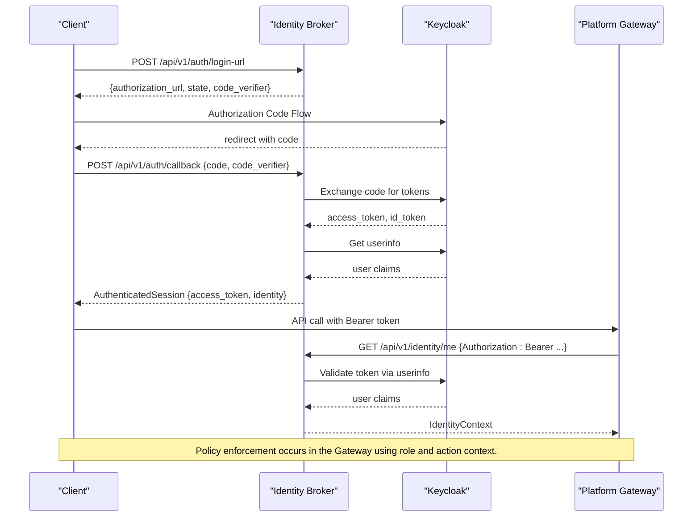
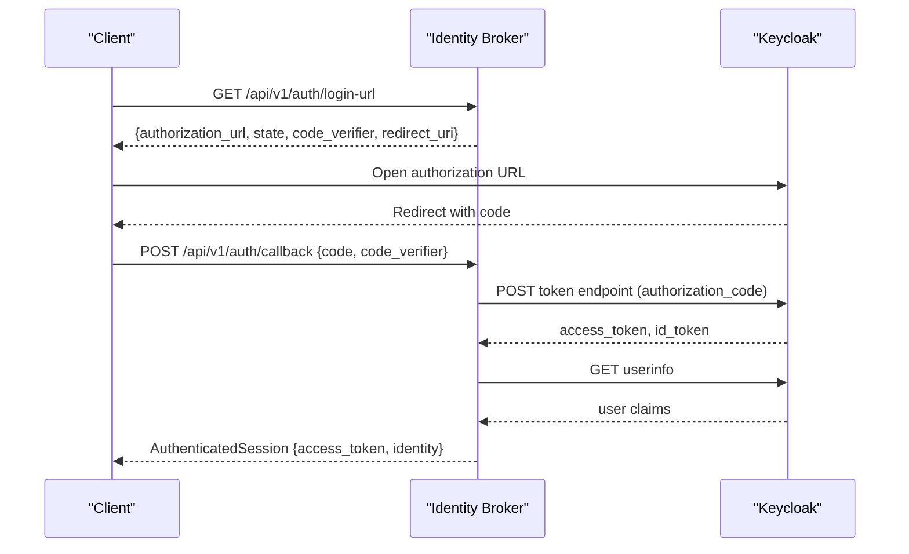
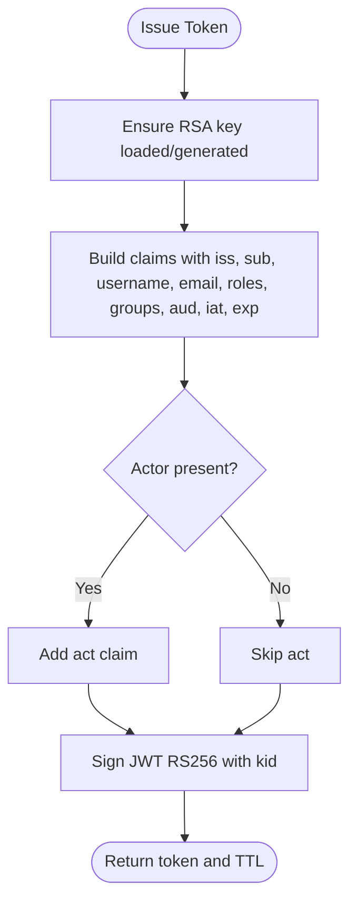
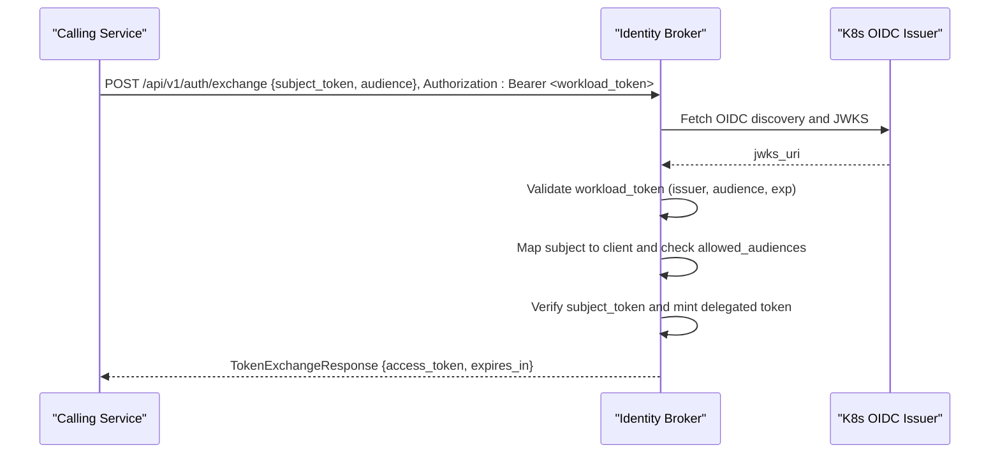
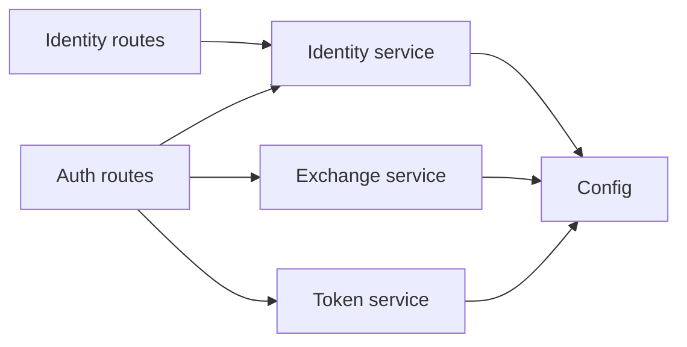

# Identity Management API

<cite>
**Referenced Files in This Document**
- [app.py](file://products/identity-broker/src/identity_service/app.py)
- [router.py](file://products/identity-broker/src/identity_service/api/router.py)
- [auth.py](file://products/identity-broker/src/identity_service/api/routes/auth.py)
- [identity.py](file://products/identity-broker/src/identity_service/api/routes/identity.py)
- [identity_service.py](file://products/identity-broker/src/identity_service/services/identity_service.py)
- [exchange_service.py](file://products/identity-broker/src/identity_service/services/exchange_service.py)
- [token_service.py](file://products/identity-broker/src/identity_service/services/token_service.py)
- [config.py](file://products/identity-broker/src/identity_service/core/config.py)
- [auth.py (schemas)](file://products/identity-broker/src/identity_service/schemas/auth.py)
- [identity.py (schemas)](file://products/identity-broker/src/identity_service/schemas/identity.py)
- [SPEC-008 plan.md](file://docs/specs/SPEC-008-service-to-service-identity/plan.md)
- [policy_engine.py](file://products/platform-gateway/src/platform_gateway/services/policy_engine.py)
</cite>

## Table of Contents
1. [Introduction](#introduction)
2. [Project Structure](#project-structure)
3. [Core Components](#core-components)
4. [Architecture Overview](#architecture-overview)
5. [Detailed Component Analysis](#detailed-component-analysis)
6. [Dependency Analysis](#dependency-analysis)
7. [Performance Considerations](#performance-considerations)
8. [Troubleshooting Guide](#troubleshooting-guide)
9. [Conclusion](#conclusion)

## Introduction
This document provides comprehensive API documentation for the Identity management endpoints that handle authentication, token issuance, token delegation, and identity resolution. It focuses on:
- GET /api/v1/identity/me: resolving the current user context from a Bearer token.
- POST /api/v1/identity/delegate: broker-mediated token delegation to propagate identity across services.
- Permission verification via policy evaluation in the platform gateway.

It also documents OIDC integration with Keycloak, token validation, session refresh, service-to-service authentication, security considerations, and performance optimization strategies.

## Project Structure
The Identity Broker is a FastAPI application exposing authentication and identity routes, backed by services for OIDC flows, JWT issuance, and token delegation. The router aggregates health, auth, and identity routes; middleware logs requests and sets up metrics and telemetry.

**Diagram sources**
- [app.py:16-45](file://products/identity-broker/src/identity_service/app.py#L16-L45)
- [router.py:1-8](file://products/identity-broker/src/identity_service/api/router.py#L1-L8)
- [auth.py:34-231](file://products/identity-broker/src/identity_service/api/routes/auth.py#L34-L231)
- [identity.py:17-46](file://products/identity-broker/src/identity_service/api/routes/identity.py#L17-L46)
- [identity_service.py:88-278](file://products/identity-broker/src/identity_service/services/identity_service.py#L88-L278)
- [exchange_service.py:46-195](file://products/identity-broker/src/identity_service/services/exchange_service.py#L46-L195)
- [token_service.py:83-155](file://products/identity-broker/src/identity_service/services/token_service.py#L83-L155)
- [config.py:100-169](file://products/identity-broker/src/identity_service/core/config.py#L100-L169)

**Section sources**
- [app.py:16-45](file://products/identity-broker/src/identity_service/app.py#L16-L45)
- [router.py:1-8](file://products/identity-broker/src/identity_service/api/router.py#L1-L8)

## Core Components
- Authentication and OIDC flow: login start, callback, logout URL, token refresh, and platform token issuance.
- Identity resolution: normalize claims and resolve current identity from Bearer tokens.
- Token delegation: exchange a verified subject token for a short-lived delegated token bound to an audience.
- JWT issuance and JWKS: RSA key lifecycle, token signing, and public key exposure.

Key request/response schemas are defined in the schema modules and used by route handlers to validate inputs and serialize outputs.

**Section sources**
- [auth.py:34-231](file://products/identity-broker/src/identity_service/api/routes/auth.py#L34-L231)
- [identity.py:17-46](file://products/identity-broker/src/identity_service/api/routes/identity.py#L17-L46)
- [auth.py (schemas):6-63](file://products/identity-broker/src/identity_service/schemas/auth.py#L6-L63)
- [identity.py (schemas):4-17](file://products/identity-broker/src/identity_service/schemas/identity.py#L4-L17)

## Architecture Overview
The Identity Broker integrates with an external OIDC provider (Keycloak) for user authentication and issues platform-bound JWTs. Service-to-service delegation uses broker-mediated token exchange with audience scoping and optional workload identity.

**Diagram sources**
- [auth.py:34-81](file://products/identity-broker/src/identity_service/api/routes/auth.py#L34-L81)
- [identity_service.py:88-192](file://products/identity-broker/src/identity_service/services/identity_service.py#L88-L192)
- [identity.py:24-46](file://products/identity-broker/src/identity_service/api/routes/identity.py#L24-L46)
- [policy_engine.py:408-443](file://products/platform-gateway/src/platform_gateway/services/policy_engine.py#L408-L443)

## Detailed Component Analysis

### Identity Resolution: GET /api/v1/identity/me
Resolves the current identity from a Bearer token by calling the OIDC userinfo endpoint and normalizing claims into a consistent IdentityContext.

- Method: GET
- Path: /api/v1/identity/me
- Headers:
  - Authorization: Bearer <token>
- Response model: IdentityContext
  - Fields: subject, username, email (optional), groups (list[str]), roles (list[str])
- Error handling:
  - 401 if Authorization header is missing or invalid
  - 401 if bearer token cannot be validated against userinfo

Example usage:
- Retrieve user context for UI or downstream service calls after successful OIDC login.

**Section sources**
- [identity.py:24-46](file://products/identity-broker/src/identity_service/api/routes/identity.py#L24-L46)
- [identity_service.py:195-211](file://products/identity-broker/src/identity_service/services/identity_service.py#L195-L211)
- [identity.py (schemas):11-17](file://products/identity-broker/src/identity_service/schemas/identity.py#L11-L17)

### Token Delegation: POST /api/v1/identity/delegate
Note: The implemented endpoint is POST /api/v1/auth/exchange. It performs broker-mediated token delegation per SPEC-008 R-2/R-3.

- Method: POST
- Path: /api/v1/auth/exchange
- Request body: TokenExchangeRequest
  - subject_token: string (a previously issued platform JWT)
  - audience: string (target audience for the delegated token)
- Authentication:
  - Either HTTP Basic client_id:client_secret or Bearer workload token (Kubernetes projected service account)
- Response model: TokenExchangeResponse
  - access_token: string (delegated JWT)
  - token_type: "Bearer"
  - expires_in: integer (seconds)
- Behavior:
  - Authenticates caller (static secret or workload identity)
  - Verifies subject_token locally using broker’s public key
  - Validates audience against client allow-list
  - Issues short-lived delegated token with actor claim set to client_id

Example use cases:
- Workload identity propagation: a service presents its own subject token to obtain a scoped delegated token for another service.
- Service-to-service authentication: enforce audience scoping and copy roles without elevation.

**Section sources**
- [auth.py:114-183](file://products/identity-broker/src/identity_service/api/routes/auth.py#L114-L183)
- [exchange_service.py:148-195](file://products/identity-broker/src/identity_service/services/exchange_service.py#L148-L195)
- [auth.py (schemas):54-63](file://products/identity-broker/src/identity_service/schemas/auth.py#L54-L63)
- [SPEC-008 plan.md:22-30](file://docs/specs/SPEC-008-service-to-service-identity/plan.md#L22-L30)

### Permissions Verification: Policy Evaluation in Gateway
Permission checks are enforced server-side in the Platform Gateway using a deny-by-default policy engine. Roles and actions are evaluated to produce allow, deny, or require_approval decisions.

- Decision outcomes:
  - deny: explicit deny rule matched or no matching rule
  - require_approval: approval required with tier details
  - allow: permitted by highest priority allow rule
- Integration:
  - IdentityContext roles are used as input to policy evaluation
  - Clients receive decision results to gate actions accordingly

Example:
- A read-only observer may be allowed to read but denied mutating actions unless approved.

**Section sources**
- [policy_engine.py:408-443](file://products/platform-gateway/src/platform_gateway/services/policy_engine.py#L408-L443)

### OIDC Integration and Session Management
- Login start: returns authorization URL, state, PKCE code verifier, and redirect URI.
- Callback: exchanges authorization code for tokens, fetches userinfo, normalizes identity, and issues a platform JWT.
- Logout URL: builds OIDC logout URL with client and post-logout redirect parameters.
- Refresh: exchanges refresh token for a new platform JWT session.

**Diagram sources**
- [auth.py:34-71](file://products/identity-broker/src/identity_service/api/routes/auth.py#L34-L71)
- [identity_service.py:88-192](file://products/identity-broker/src/identity_service/services/identity_service.py#L88-L192)

**Section sources**
- [auth.py:34-81](file://products/identity-broker/src/identity_service/api/routes/auth.py#L34-L81)
- [identity_service.py:88-192](file://products/identity-broker/src/identity_service/services/identity_service.py#L88-L192)
- [identity_service.py:214-227](file://products/identity-broker/src/identity_service/services/identity_service.py#L214-L227)
- [identity_service.py:229-278](file://products/identity-broker/src/identity_service/services/identity_service.py#L229-L278)

### Token Issuance and JWKS
- Issue platform tokens: signs JWTs with RS256, includes issuer, subject, username, email, roles, groups, aud, iat, exp, and optional act.
- JWKS endpoint: exposes public keys in RFC 7517 format for verifiers.
- Key lifecycle: loads from configured path or generates ephemeral key for dev/test.

**Diagram sources**
- [token_service.py:83-127](file://products/identity-broker/src/identity_service/services/token_service.py#L83-L127)
- [token_service.py:129-155](file://products/identity-broker/src/identity_service/services/token_service.py#L129-L155)

**Section sources**
- [token_service.py:83-155](file://products/identity-broker/src/identity_service/services/token_service.py#L83-L155)

### Workload Identity Federation
- Workload clients authenticate via Kubernetes projected service-account tokens presented as Bearer tokens.
- The broker discovers the cluster OIDC issuer’s JWKS, validates tokens, maps subjects to registered clients, and enforces audience allow-lists.

**Diagram sources**
- [exchange_service.py:65-121](file://products/identity-broker/src/identity_service/services/exchange_service.py#L65-L121)
- [exchange_service.py:148-195](file://products/identity-broker/src/identity_service/services/exchange_service.py#L148-L195)
- [config.py:52-98](file://products/identity-broker/src/identity_service/core/config.py#L52-L98)

**Section sources**
- [exchange_service.py:65-121](file://products/identity-broker/src/identity_service/services/exchange_service.py#L65-L121)
- [config.py:52-98](file://products/identity-broker/src/identity_service/core/config.py#L52-L98)

## Dependency Analysis
- Routes depend on services for business logic and configuration.
- Services depend on configuration for OIDC endpoints, JWT settings, and client registries.
- Token service manages cryptographic keys and issues signed tokens.
- Exchange service depends on token service and config for delegation logic.

**Diagram sources**
- [router.py:1-8](file://products/identity-broker/src/identity_service/api/router.py#L1-L8)
- [auth.py:34-231](file://products/identity-broker/src/identity_service/api/routes/auth.py#L34-L231)
- [identity.py:17-46](file://products/identity-broker/src/identity_service/api/routes/identity.py#L17-L46)
- [identity_service.py:88-278](file://products/identity-broker/src/identity_service/services/identity_service.py#L88-L278)
- [exchange_service.py:46-195](file://products/identity-broker/src/identity_service/services/exchange_service.py#L46-L195)
- [token_service.py:83-155](file://products/identity-broker/src/identity_service/services/token_service.py#L83-L155)
- [config.py:100-169](file://products/identity-broker/src/identity_service/core/config.py#L100-L169)

**Section sources**
- [router.py:1-8](file://products/identity-broker/src/identity_service/api/router.py#L1-L8)
- [auth.py:34-231](file://products/identity-broker/src/identity_service/api/routes/auth.py#L34-L231)
- [identity.py:17-46](file://products/identity-broker/src/identity_service/api/routes/identity.py#L17-L46)

## Performance Considerations
- Cache workload JWKS clients per issuer URL to avoid repeated discovery and key fetching during delegation.
- Use short-lived delegated tokens to reduce exposure and limit replay windows.
- Prefer audience-scoped tokens to minimize unnecessary token validation overhead downstream.
- Leverage OIDC userinfo caching at the gateway layer where appropriate to reduce repeated identity lookups.
- Monitor metrics for token issuance and exchange to detect bottlenecks.

[No sources needed since this section provides general guidance]

## Troubleshooting Guide
Common errors and their causes:
- Missing Authorization header on /api/v1/identity/me: ensure Bearer token is provided.
- Invalid bearer token: verify token validity and OIDC connectivity.
- Token exchange rejected:
  - Invalid service credential: check static client_id/client_secret or workload token issuer/audience.
  - Audience not permitted: ensure requested audience is in the client’s allowed list.
  - Subject token expired or invalid: reissue or refresh upstream token.
- OIDC callback failures: confirm code_verifier matches challenge and redirect URI is correct.

Operational tips:
- Inspect audit events emitted for token exchange successes and denials.
- Check metrics for token issuance and exchange counts.
- Validate JWKS availability for token verification.

**Section sources**
- [identity.py:24-46](file://products/identity-broker/src/identity_service/api/routes/identity.py#L24-L46)
- [auth.py:114-183](file://products/identity-broker/src/identity_service/api/routes/auth.py#L114-L183)
- [exchange_service.py:46-121](file://products/identity-broker/src/identity_service/services/exchange_service.py#L46-L121)

## Conclusion
The Identity Broker provides robust authentication, identity resolution, and secure token delegation capabilities integrated with OIDC providers and Kubernetes workload identity. By enforcing audience scoping, copying roles without elevation, and leveraging short-lived delegated tokens, it supports secure service-to-service communication. Combined with policy enforcement in the Platform Gateway, it enables fine-grained permission control and auditability.

[No sources needed since this section summarizes without analyzing specific files]