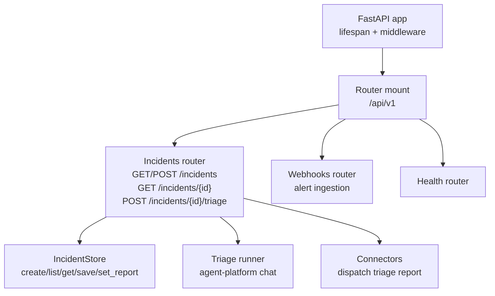
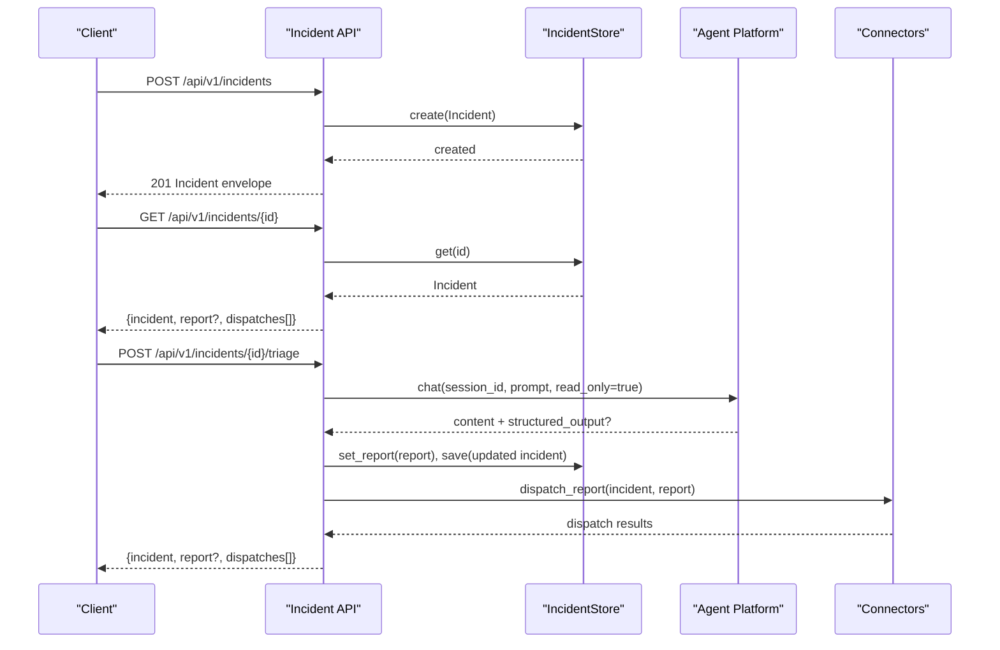
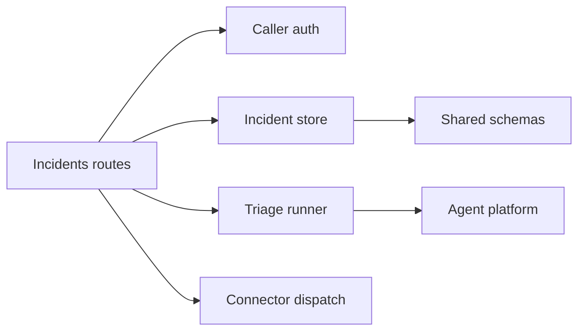

# Incident Management API

<cite>
**Referenced Files in This Document**
- [app.py](file://products/incident-service/src/incident_service/app.py)
- [router.py](file://products/incident-service/src/incident_service/api/router.py)
- [incidents.py](file://products/incident-service/src/incident_service/api/routes/incidents.py)
- [incident.py](file://products/incident-service/src/incident_service/schemas/incident.py)
- [query_auth.py](file://products/incident-service/src/incident_service/services/query_auth.py)
- [triage.py](file://products/incident-service/src/incident_service/services/triage.py)
- [incident.schema.json](file://shared/shared-contracts/schemas/incident.schema.json)
- [triage-report.schema.json](file://shared/shared-contracts/schemas/triage-report.schema.json)
</cite>

## Table of Contents
1. [Introduction](#introduction)
2. [Project Structure](#project-structure)
3. [Core Components](#core-components)
4. [Architecture Overview](#architecture-overview)
5. [Detailed Component Analysis](#detailed-component-analysis)
6. [Dependency Analysis](#dependency-analysis)
7. [Performance Considerations](#performance-considerations)
8. [Troubleshooting Guide](#troubleshooting-guide)
9. [Conclusion](#conclusion)

## Introduction
This document specifies the Incident management API for alert intake and triage operations exposed by the incident-service. It covers:
- HTTP endpoints for listing, creating, retrieving incidents, and triggering triage
- Request/response schemas for incident creation, status updates, and triage actions
- Authentication and authorization for accessing incidents
- Integration with external monitoring systems and notification channels
- Lifecycle states from detection through investigation to resolution
- Performance considerations for high-volume alert processing and deduplication

## Project Structure
The incident-service exposes REST endpoints under /api/v1. The application initializes connectors and a persistent store at startup, registers middleware for request logging and telemetry, and mounts routers that include health, webhooks (for alert ingestion), and manual incident operations.

**Diagram sources**
- [app.py:20-69](file://products/incident-service/src/incident_service/app.py#L20-L69)
- [router.py:1-9](file://products/incident-service/src/incident_service/api/router.py#L1-L9)
- [incidents.py:41-283](file://products/incident-service/src/incident_service/api/routes/incidents.py#L41-L283)

**Section sources**
- [app.py:20-69](file://products/incident-service/src/incident_service/app.py#L20-L69)
- [router.py:1-9](file://products/incident-service/src/incident_service/api/router.py#L1-L9)

## Core Components
- Incidents routes: define the public API for incident CRUD and triage invocation
- Schemas: canonical incident and triage report models bound to shared JSON schemas
- Authentication: platform-caller authentication via Basic or workload JWT
- Triage: operator-initiated agent run producing a validated triage report
- Connectors: dispatch triage outcomes to external channels

Key responsibilities:
- Validate inputs against Pydantic models and shared contracts
- Enforce caller identity and required headers for triage
- Persist incidents and reports; update lifecycle state
- Emit metrics and observability events

**Section sources**
- [incidents.py:41-283](file://products/incident-service/src/incident_service/api/routes/incidents.py#L41-L283)
- [incident.py:18-116](file://products/incident-service/src/incident_service/schemas/incident.py#L18-L116)
- [query_auth.py:1-117](file://products/incident-service/src/incident_service/services/query_auth.py#L1-L117)
- [triage.py:1-371](file://products/incident-service/src/incident_service/services/triage.py#L1-L371)

## Architecture Overview
The API is implemented as a FastAPI application with a lifespan that builds connectors and an incident store, then includes routers for health, webhooks, and incidents. All incident endpoints require authenticated callers. Triage calls into the agent-platform to execute a read-only diagnostic turn and returns a schema-validated triage report.

**Diagram sources**
- [incidents.py:74-283](file://products/incident-service/src/incident_service/api/routes/incidents.py#L74-L283)
- [triage.py:189-371](file://products/incident-service/src/incident_service/services/triage.py#L189-L371)

## Detailed Component Analysis

### Endpoints

#### GET /api/v1/incidents
- Purpose: List incidents with optional filtering and pagination
- Authentication: Required (Basic or Bearer workload token)
- Query parameters:
  - offset: integer >= 0
  - limit: integer within 1..100
  - status: one of new, triaging, triaged, triage_failed, resolved
  - severity: one of critical, warning, info
  - source: one of alertmanager, manual
- Success response:
  - incidents: array of list entries (summary excluded)
  - total: integer count
  - offset: integer
  - limit: integer
- Error responses:
  - 401 UNAUTHORIZED when authentication fails
  - 400 INVALID_PARAMETERS for invalid query values

Example usage:
- List recent warnings: GET /api/v1/incidents?severity=warning&limit=20
- Paginate triaged incidents: GET /api/v1/incidents?status=triaged&offset=40&limit=20

**Section sources**
- [incidents.py:131-176](file://products/incident-service/src/incident_service/api/routes/incidents.py#L131-L176)

#### POST /api/v1/incidents
- Purpose: Create a manual incident
- Authentication: Required
- Request body:
  - title: string, 1..200 characters
  - summary: string, optional, up to 2000 characters
  - severity: one of critical, warning, info (default warning)
  - labels: map of string keys/values, bounded by service limits
- Response:
  - 201 Created with full incident envelope
- Behavior:
  - Generates a unique incident_id and fingerprint
  - Sets initial status to new
  - Records intake metrics and open incident count

Example usage:
- Create a warning incident with labels:
  - POST /api/v1/incidents
  - Body: {"title":"High CPU on node-x","summary":"Node experiencing sustained CPU spikes","severity":"warning","labels":{"cluster":"prod-us","team":"platform"}}

**Section sources**
- [incidents.py:50-128](file://products/incident-service/src/incident_service/api/routes/incidents.py#L50-L128)
- [incident.schema.json:1-95](file://shared/shared-contracts/schemas/incident.schema.json#L1-L95)

#### GET /api/v1/incidents/{incident_id}
- Purpose: Retrieve a single incident with optional report and dispatch history
- Authentication: Required
- Path parameter:
  - incident_id: string matching pattern inc-[a-z0-9-]+
- Success response:
  - incident: full incident envelope
  - report: triage report envelope if present
  - dispatches: array of connector dispatch records
- Error responses:
  - 404 INCIDENT_NOT_FOUND when the incident does not exist

Example usage:
- Get incident details: GET /api/v1/incidents/inc-abc123def456

**Section sources**
- [incidents.py:179-206](file://products/incident-service/src/incident_service/api/routes/incidents.py#L179-L206)

#### POST /api/v1/incidents/{incident_id}/triage
- Purpose: Trigger an operator-initiated triage run for an existing incident
- Authentication: Required
- Required headers:
  - X-User-ID: operator identifier
  - X-Delegated-Token: delegated bearer token passed to the agent platform
- Path parameter:
  - incident_id: string matching pattern inc-[a-z0-9-]+
- Success response:
  - incident: updated incident envelope (status triaging -> triaged or triage_failed)
  - report: triage report envelope if triage succeeded
  - dispatches: array of connector dispatch records
- Error responses:
  - 400 INVALID_PARAMETERS when required headers are missing
  - 404 INCIDENT_NOT_FOUND when the incident does not exist

Behavior highlights:
- Creates or reuses a dedicated agent session per incident
- Runs a read-only agent turn requesting structured output
- Validates the triage report against the canonical schema before persisting
- Updates incident status and persists the report
- Dispatches the triage outcome to configured connectors

**Section sources**
- [incidents.py:235-283](file://products/incident-service/src/incident_service/api/routes/incidents.py#L235-L283)
- [triage.py:290-371](file://products/incident-service/src/incident_service/services/triage.py#L290-L371)

### Data Models and Schemas

#### Incident
- Fields include incident_id, fingerprint, source, severity, status, title, summary, labels, reported_by, session_id, triage_raw, created_at, updated_at, resolved_at
- Status values: new, triaging, triaged, triage_failed, resolved
- Source values: alertmanager, manual
- Severity values: critical, warning, info
- List entries exclude summary to reduce payload size

#### Triage Report
- Fields include incident_id, summary, severity_assessment, evidence, hypotheses, next_steps, skills_cited, session_id, generated_at, generated_by
- Evidence items reference tool or skill sources with descriptions
- Next steps are advisory with priority levels: high, medium, low
- Strict validation enforced by Pydantic models and shared JSON schemas

**Section sources**
- [incident.py:18-116](file://products/incident-service/src/incident_service/schemas/incident.py#L18-L116)
- [incident.schema.json:1-95](file://shared/shared-contracts/schemas/incident.schema.json#L1-L95)
- [triage-report.schema.json:1-120](file://shared/shared-contracts/schemas/triage-report.schema.json#L1-L120)

### Authentication and Authorization

#### Caller Authentication
- Supported methods:
  - HTTP Basic with a registered client ID and secret
  - Bearer token using a projected workload identity validated against cluster OIDC issuer JWKS
- On failure, endpoints return 401 UNAUTHORIZED

#### Triage Authorization
- Requires operator identity via X-User-ID
- Requires a delegated bearer token via X-Delegated-Token
- These headers are relayed to the agent platform to ensure triage runs under a real operator identity

**Section sources**
- [query_auth.py:1-117](file://products/incident-service/src/incident_service/services/query_auth.py#L1-L117)
- [incidents.py:235-256](file://products/incident-service/src/incident_service/api/routes/incidents.py#L235-L256)

### Alert Intake and Webhooks
- The router includes a webhooks endpoint intended for alert ingestion (e.g., Alertmanager)
- Manual incidents are created via POST /api/v1/incidents
- For webhook-based intake, configure your monitoring system to send alerts to the webhooks endpoint and normalize them into the incident model

Integration notes:
- Ensure your monitoring system posts normalized payloads to the webhooks route
- Use consistent label sets to support deduplication and correlation
- Map monitoring severities to the incident severity enum

**Section sources**
- [router.py:1-9](file://products/incident-service/src/incident_service/api/router.py#L1-L9)
- [incident.schema.json:1-95](file://shared/shared-contracts/schemas/incident.schema.json#L1-L95)

### Incident Lifecycle
- Detection: Alerts arrive via webhooks or manual creation; incidents start as new
- Investigation: Triage transitions to triaging while the agent gathers evidence
- Resolution: Successful triage transitions to triaged; operational closure can mark resolved
- Failure handling: Invalid triage output marks triage_failed with raw text preserved for inspection

State transitions:
- new -> triaging -> triaged | triage_failed
- triaged -> resolved (operational closure)

**Section sources**
- [incident.py:29-34](file://products/incident-service/src/incident_service/schemas/incident.py#L29-L34)
- [triage.py:279-371](file://products/incident-service/src/incident_service/services/triage.py#L279-L371)

### Connector Dispatch
- After successful triage, the report is dispatched to configured connectors
- Dispatch results include connector name, delivery status, optional reference, error message, and timestamp
- Failed deliveries are recorded without blocking the triage flow

**Section sources**
- [incidents.py:269-283](file://products/incident-service/src/incident_service/api/routes/incidents.py#L269-L283)
- [incident.py:106-116](file://products/incident-service/src/incident_service/schemas/incident.py#L106-L116)

## Dependency Analysis
The incident-service depends on:
- FastAPI for routing and middleware
- Pydantic for request/response validation
- Shared JSON schemas for contract enforcement
- Agent platform for triage execution
- Incident store for persistence
- Connectors for external notifications

**Diagram sources**
- [incidents.py:41-283](file://products/incident-service/src/incident_service/api/routes/incidents.py#L41-L283)
- [triage.py:189-371](file://products/incident-service/src/incident_service/services/triage.py#L189-L371)
- [incident.py:18-116](file://products/incident-service/src/incident_service/schemas/incident.py#L18-L116)

**Section sources**
- [incidents.py:41-283](file://products/incident-service/src/incident_service/api/routes/incidents.py#L41-L283)
- [triage.py:189-371](file://products/incident-service/src/incident_service/services/triage.py#L189-L371)

## Performance Considerations
- Pagination and filtering: Use offset/limit and query filters to minimize payload sizes and backend load
- Deduplication: Use fingerprints to avoid duplicate incidents; webhook intake maps group keys or stable hashes to fingerprints
- Read-only triage: Triage runs with read-only tools to prevent side effects and reduce risk during high-volume periods
- Timeouts: Triage calls use configurable timeouts to avoid hanging requests
- Metrics: Intake and triage counts are recorded to monitor throughput and failures
- Open incident tracking: Service tracks open incident counts for operational visibility

Operational tips:
- Batch list queries with appropriate limits
- Prefer filtering by status/severity/source to reduce scanning
- Monitor triage success/failure rates and adjust timeouts as needed

[No sources needed since this section provides general guidance]

## Troubleshooting Guide
Common issues and resolutions:
- 401 UNAUTHORIZED: Missing or invalid credentials; ensure Basic or Bearer token is correctly set
- 400 INVALID_PAYLOAD: Malformed request body or excessive labels; validate fields and label limits
- 400 INVALID_PARAMETERS: Missing required headers for triage (X-User-ID, X-Delegated-Token) or invalid query values
- 404 INCIDENT_NOT_FOUND: Incorrect incident_id or incident not yet created
- Triage failures: Check triage_raw field for raw agent output when status is triage_failed; inspect logs for triage errors

Diagnostic steps:
- Verify caller authentication path (Basic vs Bearer)
- Confirm required headers for triage
- Inspect incident envelope and report for validation errors
- Review connector dispatch results for delivery failures

**Section sources**
- [incidents.py:63-98](file://products/incident-service/src/incident_service/api/routes/incidents.py#L63-L98)
- [incidents.py:141-164](file://products/incident-service/src/incident_service/api/routes/incidents.py#L141-L164)
- [incidents.py:185-232](file://products/incident-service/src/incident_service/api/routes/incidents.py#L185-L232)
- [triage.py:279-349](file://products/incident-service/src/incident_service/services/triage.py#L279-L349)

## Conclusion
The Incident management API provides a secure, schema-driven interface for creating, querying, and triaging incidents. It integrates with monitoring systems via webhooks, enforces strict authentication, and supports automated triage with read-only agent interactions. Operators can manage the full incident lifecycle from detection through resolution while leveraging connectors for notifications and maintaining high performance under load.

[No sources needed since this section summarizes without analyzing specific files]