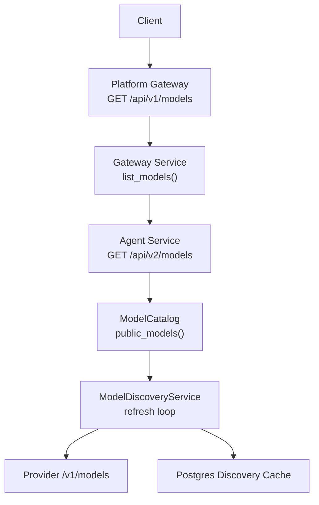
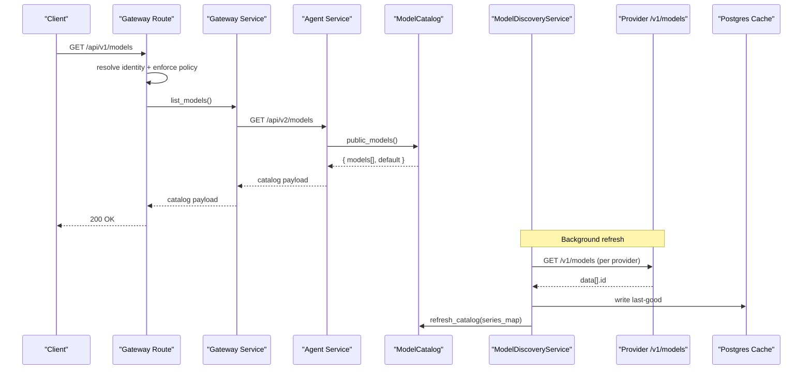
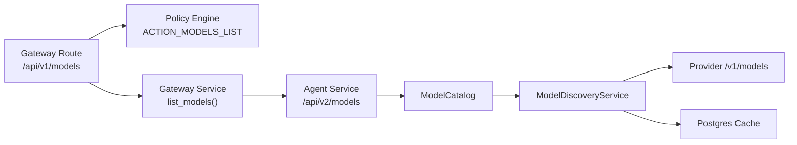

# Model Catalog API

<cite>
**Referenced Files in This Document**
- [model-catalog.schema.json](file://shared/shared-contracts/schemas/model-catalog.schema.json)
- [models.py](file://products/platform-gateway/src/platform_gateway/api/routes/models.py)
- [gateway_service.py](file://products/platform-gateway/src/platform_gateway/services/gateway_service.py)
- [policy_engine.py](file://products/platform-gateway/src/platform_gateway/services/policy_engine.py)
- [model_catalog.py](file://products/agent-platform/src/agent_service/services/model_catalog.py)
- [model_discovery.py](file://products/agent-platform/src/agent_service/services/model_discovery.py)
- [luban-llm-guide.md](file://docs/guides/luban-llm-guide.md)
</cite>

## Table of Contents
1. [Introduction](#introduction)
2. [Project Structure](#project-structure)
3. [Core Components](#core-components)
4. [Architecture Overview](#architecture-overview)
5. [Detailed Component Analysis](#detailed-component-analysis)
6. [Dependency Analysis](#dependency-analysis)
7. [Performance Considerations](#performance-considerations)
8. [Troubleshooting Guide](#troubleshooting-guide)
9. [Conclusion](#conclusion)
10. [Appendices](#appendices)

## Introduction
This document specifies the Model Catalog API used to discover and select LLM models across providers (OpenAI, Anthropic-compatible via OpenAI endpoints, DashScope, DeepSeek, and local/self-hosted via the luban provider). It covers:
- HTTP endpoints for model discovery
- Request parameters for filtering by provider, capabilities, and availability
- Response schemas with model metadata, supported features, and configuration options
- Authentication and authorization based on organizational policies
- Runtime model switching, fallback mechanisms, and cost optimization strategies
- Performance considerations for catalog updates and caching

The platform exposes a gateway endpoint that proxies to the agent-service model catalog. The catalog is credential-gated and discovery-safe: it never leaks secrets or base URLs in responses.

## Project Structure
The Model Catalog feature spans two services:
- Platform Gateway: exposes /api/v1/models and enforces policy before proxying to the agent-service.
- Agent Service: builds and serves the model catalog, supports live discovery, and persists last-good catalogs.

**Diagram sources**
- [models.py:19-45](file://products/platform-gateway/src/platform_gateway/api/routes/models.py#L19-L45)
- [gateway_service.py:1-200](file://products/platform-gateway/src/platform_gateway/services/gateway_service.py#L1-L200)
- [model_catalog.py:236-293](file://products/agent-platform/src/agent_service/services/model_catalog.py#L236-L293)
- [model_discovery.py:202-289](file://products/agent-platform/src/agent_service/services/model_discovery.py#L202-L289)

**Section sources**
- [models.py:19-45](file://products/platform-gateway/src/platform_gateway/api/routes/models.py#L19-L45)
- [model_catalog.py:236-293](file://products/agent-platform/src/agent_service/services/model_catalog.py#L236-L293)
- [model_discovery.py:202-289](file://products/agent-platform/src/agent_service/services/model_discovery.py#L202-L289)

## Core Components
- Model Catalog Entry: represents a selectable model with id, label, provider, default flag; excludes credentials from public views.
- ModelCatalog: immutable-per-snapshot lookup with thread-safe swap support for live discovery updates.
- ModelDiscoveryService: resolves per-provider model series via OpenAI-compatible /v1/models, applies filters, deduplication, and persistence, then swaps the catalog.
- Gateway Route: GET /api/v1/models proxies to agent-service after identity resolution and policy enforcement.

Key behaviors:
- Credential gating: only providers with resolvable API keys are included.
- Discovery-safe responses: no secrets or base URLs in catalog payloads.
- Fallback ladder: live fetch -> in-memory last-good -> Postgres last-good -> curated defaults.
- Backward compatibility: bare provider names alias to each provider’s default model.

**Section sources**
- [model_catalog.py:49-68](file://products/agent-platform/src/agent_service/services/model_catalog.py#L49-L68)
- [model_catalog.py:236-293](file://products/agent-platform/src/agent_service/services/model_catalog.py#L236-L293)
- [model_discovery.py:202-289](file://products/agent-platform/src/agent_service/services/model_discovery.py#L202-L289)
- [models.py:19-45](file://products/platform-gateway/src/platform_gateway/api/routes/models.py#L19-L45)

## Architecture Overview
The gateway route enforces policy and proxies to the agent-service. The agent-service returns a discovery-safe catalog built from configured providers. A background discovery service periodically refreshes the catalog using a fail-soft ladder.

**Diagram sources**
- [models.py:19-45](file://products/platform-gateway/src/platform_gateway/api/routes/models.py#L19-L45)
- [gateway_service.py:1-200](file://products/platform-gateway/src/platform_gateway/services/gateway_service.py#L1-L200)
- [model_catalog.py:236-293](file://products/agent-platform/src/agent_service/services/model_catalog.py#L236-L293)
- [model_discovery.py:202-289](file://products/agent-platform/src/agent_service/services/model_discovery.py#L202-L289)

## Detailed Component Analysis

### Endpoint: GET /api/v1/models
- Purpose: Discover available models for the authenticated user/organization.
- Path: /api/v1/models
- Method: GET
- Authentication: Required (identity resolved by gateway).
- Authorization: Enforced via policy action models:list.
- Query parameters: None defined at the gateway route; filtering is performed upstream by the agent-service catalog logic.
- Success response: Discovery-safe catalog object per shared schema.
- Error responses: Policy denial or upstream errors propagated by the gateway.

Response schema (discovery-safe):
- models: array of objects with fields id, label, provider, default.
- default: string or null indicating the active profile’s default model.

Provider enum values include dashscope, deepseek, openai, luban.

Example scenarios:
- OpenAI: Returns entries with provider "openai" when OPENAI_API_KEY is configured.
- DashScope: Entries with provider "dashscope" when DASHSCOPE_API_KEY is configured.
- DeepSeek: Entries with provider "deepseek" when DEEPSEEK_API_KEY is configured.
- Local/self-hosted: Entries with provider "luban" when LUBAN_API_KEY and LUBAN_BASE_URL are configured.

Notes:
- Bare provider names can be used as model ids for backward compatibility; they alias to the provider’s default model.
- No credentials or base URLs are returned.

**Section sources**
- [models.py:19-45](file://products/platform-gateway/src/platform_gateway/api/routes/models.py#L19-L45)
- [model-catalog.schema.json:1-43](file://shared/shared-contracts/schemas/model-catalog.schema.json#L1-L43)
- [model_catalog.py:236-293](file://products/agent-platform/src/agent_service/services/model_catalog.py#L236-L293)

### Endpoint: GET /api/v1/models/{model_id}
- Status: Not implemented in the current gateway routes.
- Behavior: The gateway exposes only the list endpoint. To retrieve details for a specific model, use the list endpoint and filter client-side by id.

Recommendation:
- If future per-model detail is needed, add a route that forwards to an agent-service endpoint and enforces the same policy checks.

[No sources needed since this section describes absence of implementation]

### Endpoint: GET /api/v1/models/capabilities
- Status: Not implemented in the current gateway routes.
- Behavior: Capability queries are not exposed as a separate endpoint. Capabilities are inferred from provider and model metadata present in the catalog response.

Recommendation:
- If capability enumeration is required, expose a dedicated endpoint that aggregates provider-reported capabilities and enforces policy.

[No sources needed since this section describes absence of implementation]

### Filtering Models by Provider, Capabilities, Availability
- Provider filtering: Use the provider field in the catalog response to filter results client-side. Only providers with resolvable API keys appear in the catalog.
- Capability filtering: Inspect model metadata returned by the catalog (e.g., provider-specific flags) to infer capabilities. There is no explicit capabilities query parameter at the gateway.
- Availability filtering: The catalog reflects currently enabled models. Live discovery may update the list asynchronously; clients should cache and refresh periodically.

Implementation notes:
- The gateway does not parse query parameters for model filtering; filtering occurs in the agent-service catalog layer and/or client.

**Section sources**
- [model_catalog.py:100-138](file://products/agent-platform/src/agent_service/services/model_catalog.py#L100-L138)
- [model_discovery.py:233-289](file://products/agent-platform/src/agent_service/services/model_discovery.py#L233-L289)

### Response Schema Details
- models: array of model entries.
  - id: string; the model name sent in chat requests.
  - label: string; display label for UI selectors.
  - provider: enum; one of dashscope, deepseek, openai, luban.
  - default: boolean; true for the active profile’s default model.
- default: string or null; id of the default model or null if none configured.

Constraints:
- Additional properties are disallowed in the schema.
- Responses are discovery-safe: no secrets or base URLs.

**Section sources**
- [model-catalog.schema.json:1-43](file://shared/shared-contracts/schemas/model-catalog.schema.json#L1-L43)
- [model_catalog.py:49-68](file://products/agent-platform/src/agent_service/services/model_catalog.py#L49-L68)

### Authentication and Authorization
- Authentication: Identity is resolved by the gateway before any policy check.
- Authorization: The models:list policy action is enforced for GET /api/v1/models. Denials result in policy error responses.
- Organizational policies: Policies govern who can list models; ensure roles and scopes allow models:list for intended users.

Operational guidance:
- Ensure identity tokens are valid and contain required claims.
- Configure policies to grant models:list to appropriate roles.

**Section sources**
- [models.py:19-45](file://products/platform-gateway/src/platform_gateway/api/routes/models.py#L19-L45)
- [policy_engine.py:1-200](file://products/platform-gateway/src/platform_gateway/services/policy_engine.py#L1-L200)

### Model Switching During Runtime
- Selection: Clients select a model by sending its id in chat requests. The catalog provides selectable ids and labels.
- Alias support: Bare provider names map to the provider’s default model for backward compatibility.
- Live updates: The discovery service refreshes the catalog in the background; new models become available without restarts.

Best practices:
- Cache the catalog locally and refresh on interval or on catalog changes.
- Validate selected model id against the latest catalog before issuing chat requests.

**Section sources**
- [model_catalog.py:236-293](file://products/agent-platform/src/agent_service/services/model_catalog.py#L236-L293)
- [model_discovery.py:233-289](file://products/agent-platform/src/agent_service/services/model_discovery.py#L233-L289)

### Fallback Mechanisms
- Discovery ladder:
  - Live fetch from provider /v1/models
  - In-memory last-good
  - Postgres last-good
  - Curated defaults from adapter series
- Fail-soft behavior: Any failure logs warnings and falls back to previous known-good state; discovery never blocks chat or startup.

Operational impact:
- If provider endpoints are unreachable, the catalog degrades gracefully to previously discovered or curated models.

**Section sources**
- [model_discovery.py:233-289](file://products/agent-platform/src/agent_service/services/model_discovery.py#L233-L289)

### Cost Optimization Strategies
- Pin models per provider using environment variables to avoid expensive or unstable live discovery.
- Prefer smaller models for high-volume, low-stakes turns; reserve larger models for complex reasoning.
- Use local/self-hosted models (luban provider) for data locality and predictable costs.
- Monitor discovery metrics to understand refresh outcomes and adjust pinning accordingly.

Configuration references:
- Provider-specific knobs (API key, base URL, model name, models override) control inclusion and selection.

**Section sources**
- [luban-llm-guide.md:103-126](file://docs/guides/luban-llm-guide.md#L103-L126)
- [model_catalog.py:100-138](file://products/agent-platform/src/agent_service/services/model_catalog.py#L100-L138)

### Performance Considerations and Caching
- Catalog reads are thread-safe snapshots; swapping contents under lock avoids races.
- Discovery runs periodically and writes last-good to Postgres; read failures degrade to memory or curated defaults.
- Keep discovery intervals reasonable to balance freshness and load.
- Avoid excessive client polling; cache catalog responses and refresh on schedule or change events.

Metrics:
- Discovery refresh results and model counts are recorded for observability.

**Section sources**
- [model_catalog.py:236-293](file://products/agent-platform/src/agent_service/services/model_catalog.py#L236-L293)
- [model_discovery.py:69-159](file://products/agent-platform/src/agent_service/services/model_discovery.py#L69-L159)
- [model_discovery.py:233-289](file://products/agent-platform/src/agent_service/services/model_discovery.py#L233-L289)

## Dependency Analysis
The gateway depends on policy enforcement and the agent-service catalog. The agent-service catalog depends on runtime settings and provider adapters. Discovery depends on provider endpoints and Postgres cache.

**Diagram sources**
- [models.py:19-45](file://products/platform-gateway/src/platform_gateway/api/routes/models.py#L19-L45)
- [policy_engine.py:1-200](file://products/platform-gateway/src/platform_gateway/services/policy_engine.py#L1-L200)
- [gateway_service.py:1-200](file://products/platform-gateway/src/platform_gateway/services/gateway_service.py#L1-L200)
- [model_catalog.py:236-293](file://products/agent-platform/src/agent_service/services/model_catalog.py#L236-L293)
- [model_discovery.py:202-289](file://products/agent-platform/src/agent_service/services/model_discovery.py#L202-L289)

**Section sources**
- [models.py:19-45](file://products/platform-gateway/src/platform_gateway/api/routes/models.py#L19-L45)
- [model_catalog.py:236-293](file://products/agent-platform/src/agent_service/services/model_catalog.py#L236-L293)
- [model_discovery.py:202-289](file://products/agent-platform/src/agent_service/services/model_discovery.py#L202-L289)

## Performance Considerations
- Minimize client-side polling; cache catalog responses and refresh periodically.
- Tune discovery refresh interval to balance freshness and network/database load.
- Pin models via provider overrides to reduce dependency on external endpoints.
- Monitor discovery metrics and logs to detect degraded states quickly.

[No sources needed since this section provides general guidance]

## Troubleshooting Guide
Common issues and resolutions:
- No models listed: Verify provider API keys and base URLs are configured; check logs for gating warnings.
- 401 on provider calls: Ensure token auth matches server expectations; confirm base URL points to the correct endpoint.
- Catalog stale: Check discovery service status and Postgres connectivity; review metrics for refresh outcomes.
- Tool calling issues on small models: Prefer cloud flagship models for tool-heavy tasks; keep small models for advisory/chat.

Diagnostic steps:
- Probe provider /v1/models endpoint directly with bearer token.
- Review catalog response for expected provider entries and default model.
- Inspect discovery logs for warnings about unreachable endpoints or unexpected envelopes.

**Section sources**
- [luban-llm-guide.md:162-183](file://docs/guides/luban-llm-guide.md#L162-L183)
- [model_discovery.py:161-199](file://products/agent-platform/src/agent_service/services/model_discovery.py#L161-L199)

## Conclusion
The Model Catalog API provides a secure, discovery-safe way to enumerate and select LLM models across multiple providers. The gateway enforces policy before proxying to the agent-service, which builds the catalog from configured providers and supports live discovery with robust fallbacks. Clients should cache catalog responses, select models by id, and rely on the platform’s authentication and authorization controls. For cost and performance, pin models where appropriate and prefer smaller models for high-volume tasks.

[No sources needed since this section summarizes without analyzing specific files]

## Appendices

### Example Requests and Responses
- List models:
  - Request: GET /api/v1/models
  - Response: { models: [...], default: "..." | null }
- Provider examples:
  - OpenAI: provider "openai" entries when OPENAI_API_KEY is set.
  - DashScope: provider "dashscope" entries when DASHSCOPE_API_KEY is set.
  - DeepSeek: provider "deepseek" entries when DEEPSEEK_API_KEY is set.
  - Local/self-hosted: provider "luban" entries when LUBAN_API_KEY and LUBAN_BASE_URL are set.

[No sources needed since this section provides conceptual examples]