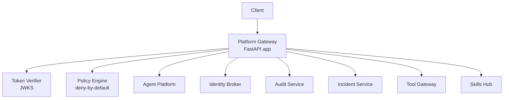
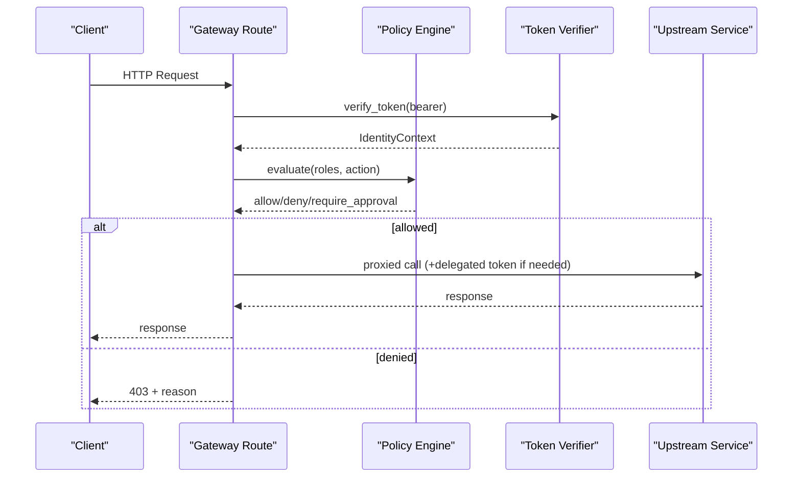
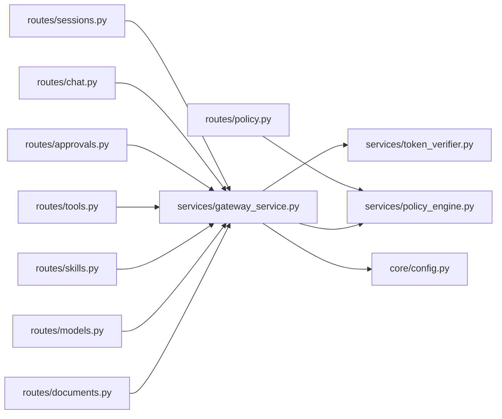

# Platform Gateway API

<cite>
**Referenced Files in This Document**
- [README.md](file://products/platform-gateway/README.md)
- [app.py](file://products/platform-gateway/src/platform_gateway/app.py)
- [router.py](file://products/platform-gateway/src/platform_gateway/api/router.py)
- [sessions.py](file://products/platform-gateway/src/platform_gateway/api/routes/sessions.py)
- [chat.py](file://products/platform-gateway/src/platform_gateway/api/routes/chat.py)
- [approvals.py](file://products/platform-gateway/src/platform_gateway/api/routes/approvals.py)
- [policy.py](file://products/platform-gateway/src/platform_gateway/api/routes/policy.py)
- [tools.py](file://products/platform-gateway/src/platform_gateway/api/routes/tools.py)
- [skills.py](file://products/platform-gateway/src/platform_gateway/api/routes/skills.py)
- [models.py](file://products/platform-gateway/src/platform_gateway/api/routes/models.py)
- [documents.py](file://products/platform-gateway/src/platform_gateway/api/routes/documents.py)
- [gateway_service.py](file://products/platform-gateway/src/platform_gateway/services/gateway_service.py)
- [policy_engine.py](file://products/platform-gateway/src/platform_gateway/services/policy_engine.py)
- [token_verifier.py](file://products/platform-gateway/src/platform_gateway/services/token_verifier.py)
- [config.py](file://products/platform-gateway/src/platform_gateway/core/config.py)
- [api.py](file://products/platform-gateway/src/platform_gateway/schemas/api.py)
</cite>

## Table of Contents
1. [Introduction](#introduction)
2. [Project Structure](#project-structure)
3. [Core Components](#core-components)
4. [Architecture Overview](#architecture-overview)
5. [Detailed Component Analysis](#detailed-component-analysis)
6. [Dependency Analysis](#dependency-analysis)
7. [Performance Considerations](#performance-considerations)
8. [Troubleshooting Guide](#troubleshooting-guide)
9. [Conclusion](#conclusion)

## Introduction
The Platform Gateway is the portal-facing edge service that authenticates requests, enforces policy, and proxies calls to downstream services (agent-platform, identity-broker, audit-service, incident-service, tool-gateway, skills-hub). It exposes REST endpoints for sessions, chat streaming, approvals, policy transparency, tools discovery, skills registry, model catalog, and documents. Authentication uses OIDC bearer tokens verified locally via JWKS; authorization is enforced per action using a deny-by-default policy bundle. The gateway also obtains short-lived delegated tokens for downstream calls where required.

Key responsibilities:
- Verify portal bearer tokens and enforce deny-by-default policies on every portal-facing action.
- Proxy chat and session traffic to agent-platform with delegated tokens.
- Relay auth/identity/runtime endpoints to identity-broker and agent-platform.
- Proxy durable audit trail queries and incidents surfaces with appropriate gating.
- Expose health, metrics, and runtime metadata endpoints.

**Section sources**
- [README.md:6-50](file://products/platform-gateway/README.md#L6-L50)

## Project Structure
The gateway is organized by feature routes under api/routes, shared services under services, configuration under core, schemas under schemas, and policy bundles under policies. Routes register FastAPI routers that perform identity resolution, policy enforcement, and proxying or streaming responses.

**Diagram sources**
- [app.py:1-200](file://products/platform-gateway/src/platform_gateway/app.py#L1-L200)
- [router.py:1-200](file://products/platform-gateway/src/platform_gateway/api/router.py#L1-L200)
- [gateway_service.py:204-300](file://products/platform-gateway/src/platform_gateway/services/gateway_service.py#L204-L300)
- [policy_engine.py:390-444](file://products/platform-gateway/src/platform_gateway/services/policy_engine.py#L390-L444)
- [token_verifier.py:52-99](file://products/platform-gateway/src/platform_gateway/services/token_verifier.py#L52-L99)

**Section sources**
- [README.md:1-55](file://products/platform-gateway/README.md#L1-L55)
- [config.py:23-53](file://products/platform-gateway/src/platform_gateway/core/config.py#L23-L53)

## Core Components
- Authentication: Local JWT verification against JWKS with issuer/audience checks; synthetic dev identity when auth is disabled.
- Authorization: Action-based policy evaluation with deny-by-default, explicit deny, allow, and require_approval outcomes.
- Proxies: Session, chat, approvals, models, tools, skills, documents, incidents, audit, and auth/identity routing.
- Streaming: Server-Sent Events for chat streaming and confirmation resumption.
- Observability: Structured logs, metrics, and durable audit events emitted for key actions.

**Section sources**
- [token_verifier.py:52-99](file://products/platform-gateway/src/platform_gateway/services/token_verifier.py#L52-L99)
- [policy_engine.py:390-444](file://products/platform-gateway/src/platform_gateway/services/policy_engine.py#L390-L444)
- [gateway_service.py:204-300](file://products/platform-gateway/src/platform_gateway/services/gateway_service.py#L204-L300)

## Architecture Overview
The gateway performs three steps for most protected endpoints:
1. Resolve identity from bearer token (or synthetic dev identity).
2. Enforce policy for the specific action.
3. Proxy request to downstream service, mapping upstream errors appropriately.

**Diagram sources**
- [chat.py:37-93](file://products/platform-gateway/src/platform_gateway/api/routes/chat.py#L37-L93)
- [gateway_service.py:204-300](file://products/platform-gateway/src/platform_gateway/services/gateway_service.py#L204-L300)
- [policy_engine.py:390-444](file://products/platform-gateway/src/platform_gateway/services/policy_engine.py#L390-L444)
- [token_verifier.py:52-99](file://products/platform-gateway/src/platform_gateway/services/token_verifier.py#L52-L99)

## Detailed Component Analysis

### Sessions Management (/sessions)
Endpoints:
- POST /api/v1/sessions
- GET /api/v1/sessions
- GET /api/v1/sessions/{session_id}
- PATCH /api/v1/sessions/{session_id}/title
- POST /api/v1/sessions/{session_id}/skill-target
- POST /api/v1/sessions/{session_id}/skill-graduate
- POST /api/v1/sessions/{session_id}/skill-draft
- DELETE /api/v1/sessions/{session_id}

Authentication: Bearer OIDC token verified locally; synthetic dev identity when auth disabled.
Authorization:
- Create: session:create (+ session:skill_graduate for development sessions)
- List: session:list
- Read: session:read
- Update title: session:update
- Declare skill target: session:skill_graduate
- Graduate skill: session:skill_graduate
- Draft export: session:skill_draft
- Delete: session:delete

Request/Response Schemas:
- CreateSessionRequest: user_id (optional), skill_target (optional string), session_type (operation|development)
- ChatConfirmRequest: session_id, confirm_id, decision (approve|deny)
- SessionTitleUpdateRequest: title
- SkillTargetDeclareRequest: target
- Responses mirror agent-platform session objects; list returns workspace-scoped sessions.

Notes:
- Upstream 4xx pass through unchanged (unknown/foreign session, parked confirmation); transport failures map to 502.
- Development session creation requires an additional grant to prevent dead-end Studio sessions.

Example flows:
- Create a session, optionally declare a skill target, then graduate it into an executable draft.
- List sessions with optional session_type filter forwarded upstream.

**Section sources**
- [sessions.py:41-101](file://products/platform-gateway/src/platform_gateway/api/routes/sessions.py#L41-L101)
- [sessions.py:104-134](file://products/platform-gateway/src/platform_gateway/api/routes/sessions.py#L104-L134)
- [sessions.py:137-158](file://products/platform-gateway/src/platform_gateway/api/routes/sessions.py#L137-L158)
- [sessions.py:161-191](file://products/platform-gateway/src/platform_gateway/api/routes/sessions.py#L161-L191)
- [sessions.py:194-242](file://products/platform-gateway/src/platform_gateway/api/routes/sessions.py#L194-L242)
- [sessions.py:245-289](file://products/platform-gateway/src/platform_gateway/api/routes/sessions.py#L245-L289)
- [sessions.py:292-322](file://products/platform-gateway/src/platform_gateway/api/routes/sessions.py#L292-L322)
- [sessions.py:325-360](file://products/platform-gateway/src/platform_gateway/api/routes/sessions.py#L325-L360)
- [gateway_service.py:331-436](file://products/platform-gateway/src/platform_gateway/services/gateway_service.py#L331-L436)
- [api.py:59-112](file://products/platform-gateway/src/platform_gateway/schemas/api.py#L59-L112)

### Chat Streaming (/chat)
Endpoints:
- POST /api/v1/chat
- GET /api/v1/chat/stream?message=...&session_id=...&model=...&input_modality=text|voice
- POST /api/v1/chat/confirm

Authentication: Bearer OIDC token verified locally; synthetic dev identity when auth disabled.
Authorization:
- Chat: chat
- Confirm: chat:confirm

Request/Response Schemas:
- ChatRequest: message, session_id (optional), user_id (optional), request_id (optional), input_modality (text|voice), model (optional)
- ChatConfirmRequest: session_id, confirm_id, decision (approve|deny)
- ChatResponse: session_id, request_id, content, status, structured_output (optional), model (optional)

Streaming behavior:
- GET /api/v1/chat/stream returns Server-Sent Events stream from agent-platform.
- POST /api/v1/chat/confirm resumes the SSE stream after a parked kernel confirmation.

Model selection:
- Per-turn model can be relayed verbatim; validation is fail-closed at runtime.

Example flows:
- Start a streaming chat turn, receive incremental frames until completion.
- Answer a parked confirmation to resume the stream.

**Section sources**
- [chat.py:37-93](file://products/platform-gateway/src/platform_gateway/api/routes/chat.py#L37-L93)
- [chat.py:96-155](file://products/platform-gateway/src/platform_gateway/api/routes/chat.py#L96-L155)
- [chat.py:158-199](file://products/platform-gateway/src/platform_gateway/api/routes/chat.py#L158-L199)
- [api.py:16-57](file://products/platform-gateway/src/platform_gateway/schemas/api.py#L16-L57)

### Approvals Workflow (/approvals)
Endpoint:
- GET /api/v1/approvals/inbox?history_limit=10&history_offset=0

Authentication: Bearer OIDC token verified locally.
Authorization: approvals:list (granted to tier_2 decider roles).

Behavior:
- Returns pending confirmations and paginated history for the approver.
- History pagination parameters forward verbatim to agent service.

Error posture:
- Upstream 4xx pass through; transport failures map to 502.

**Section sources**
- [approvals.py:19-57](file://products/platform-gateway/src/platform_gateway/api/routes/approvals.py#L19-L57)
- [gateway_service.py:439-470](file://products/platform-gateway/src/platform_gateway/services/gateway_service.py#L439-L470)

### Policy Evaluation (/policy)
Endpoint:
- GET /api/v1/policy/matrix

Authentication: Bearer OIDC token verified locally.
Authorization: policy:read.

Behavior:
- Returns the live role x action permission matrix derived from the loaded policy bundle.
- Rows are scoped server-side: platform-admin sees full matrix; other identities see only their granted roles.

Error posture:
- If policy bundle is unavailable, returns 503.

**Section sources**
- [policy.py:30-54](file://products/platform-gateway/src/platform_gateway/api/routes/policy.py#L30-L54)
- [policy_engine.py:374-387](file://products/platform-gateway/src/platform_gateway/services/policy_engine.py#L374-L387)

### Tools Discovery (/tools)
Endpoint:
- GET /api/v1/tools

Authentication: Bearer OIDC token verified locally.
Authorization: tools:list.

Behavior:
- Reads-only tool catalog proxy to tool-gateway.
- Requires a broker-mediated delegated token (audience tool-gateway); without it, returns 503.

**Section sources**
- [tools.py:39-68](file://products/platform-gateway/src/platform_gateway/api/routes/tools.py#L39-L68)

### Skills Registry (/skills)
Endpoints:
- GET /api/v1/skills?offset=0&limit=100&source=...&tag=...
- GET /api/v1/skills/{skill_id:path}

Authentication: Bearer OIDC token verified locally.
Authorization: skills:read.

Behavior:
- Read-only skills listing and single-skill detail proxy to skills-hub using gateway-held Basic credential.
- Pagination parameters supported; traversal-shaped IDs rejected at the edge.

**Section sources**
- [skills.py:27-52](file://products/platform-gateway/src/platform_gateway/api/routes/skills.py#L27-L52)
- [skills.py:55-81](file://products/platform-gateway/src/platform_gateway/api/routes/skills.py#L55-L81)

### Model Catalog (/models)
Endpoint:
- GET /api/v1/models

Authentication: Bearer OIDC token verified locally.
Authorization: models:list.

Behavior:
- Discovery-safe model catalog pass-through to agent-platform (id/label/provider/default; no credentials).

**Section sources**
- [models.py:19-45](file://products/platform-gateway/src/platform_gateway/api/routes/models.py#L19-L45)

### Document Repository (/documents)
Endpoints:
- POST /api/v1/documents (201)
- GET /api/v1/documents?scope=mine|published
- GET /api/v1/documents/{document_id}
- POST /api/v1/documents/{document_id}/publish
- DELETE /api/v1/documents/{document_id}

Authentication: Bearer OIDC token verified locally.
Authorization:
- Create/Publish/Delete: documents:create
- List/Get: documents:read
- Incident reports additionally require incident:read.

Behavior:
- Creates operation documents (shift_summary or incident_report) with type-specific fields validated at the gateway.
- Publish is one-way owner publish; already-published answers 409.
- Foreign coverage computed server-side and forwarded as trusted header to agent layer.

**Section sources**
- [documents.py:30-86](file://products/platform-gateway/src/platform_gateway/api/routes/documents.py#L30-L86)
- [documents.py:89-112](file://products/platform-gateway/src/platform_gateway/api/routes/documents.py#L89-L112)
- [documents.py:115-137](file://products/platform-gateway/src/platform_gateway/api/routes/documents.py#L115-L137)
- [documents.py:140-162](file://products/platform-gateway/src/platform_gateway/api/routes/documents.py#L140-L162)
- [documents.py:165-187](file://products/platform-gateway/src/platform_gateway/api/routes/documents.py#L165-L187)
- [api.py:114-152](file://products/platform-gateway/src/platform_gateway/schemas/api.py#L114-L152)

### Identity Propagation and Delegation
- For chat and tools discovery, the gateway obtains a short-lived delegated token via identity-broker (audience tool-gateway) before forwarding to downstream services.
- The original bearer token may be passed along to downstream services where applicable.

**Section sources**
- [chat.py:48-62](file://products/platform-gateway/src/platform_gateway/api/routes/chat.py#L48-L62)
- [tools.py:48-59](file://products/platform-gateway/src/platform_gateway/api/routes/tools.py#L48-L59)
- [README.md:11-14](file://products/platform-gateway/README.md#L11-L14)

## Dependency Analysis
The gateway composes several internal modules:
- Routes depend on gateway_service for proxying and policy enforcement.
- Policy engine loads and evaluates YAML bundles with strict validation.
- Token verifier uses JWKS client to validate OIDC tokens locally.
- Configuration is environment-driven with defaults and caching.

**Diagram sources**
- [sessions.py:1-360](file://products/platform-gateway/src/platform_gateway/api/routes/sessions.py#L1-L360)
- [chat.py:1-199](file://products/platform-gateway/src/platform_gateway/api/routes/chat.py#L1-L199)
- [approvals.py:1-58](file://products/platform-gateway/src/platform_gateway/api/routes/approvals.py#L1-L58)
- [policy.py:1-55](file://products/platform-gateway/src/platform_gateway/api/routes/policy.py#L1-L55)
- [tools.py:1-69](file://products/platform-gateway/src/platform_gateway/api/routes/tools.py#L1-L69)
- [skills.py:1-82](file://products/platform-gateway/src/platform_gateway/api/routes/skills.py#L1-L82)
- [models.py:1-46](file://products/platform-gateway/src/platform_gateway/api/routes/models.py#L1-L46)
- [documents.py:1-188](file://products/platform-gateway/src/platform_gateway/api/routes/documents.py#L1-L188)
- [gateway_service.py:1-300](file://products/platform-gateway/src/platform_gateway/services/gateway_service.py#L1-L300)
- [policy_engine.py:1-120](file://products/platform-gateway/src/platform_gateway/services/policy_engine.py#L1-L120)
- [token_verifier.py:1-99](file://products/platform-gateway/src/platform_gateway/services/token_verifier.py#L1-L99)
- [config.py:1-131](file://products/platform-gateway/src/platform_gateway/core/config.py#L1-L131)

**Section sources**
- [gateway_service.py:204-300](file://products/platform-gateway/src/platform_gateway/services/gateway_service.py#L204-L300)
- [policy_engine.py:334-371](file://products/platform-gateway/src/platform_gateway/services/policy_engine.py#L334-L371)
- [token_verifier.py:25-99](file://products/platform-gateway/src/platform_gateway/services/token_verifier.py#L25-L99)
- [config.py:54-131](file://products/platform-gateway/src/platform_gateway/core/config.py#L54-L131)

## Performance Considerations
- Local JWT verification avoids per-request introspection network calls.
- Policy bundle is cached module-wide; readiness probes include bundle fingerprint.
- Streaming chat uses Server-Sent Events to minimize latency and payload size.
- Upstream error mapping centralizes 4xx passthrough and 5xx normalization to 502.

[No sources needed since this section provides general guidance]

## Troubleshooting Guide
Common errors and posture:
- 401 Unauthorized: malformed or missing bearer token; token expired or invalid issuer/audience.
- 403 Forbidden: policy denies the action; includes action, reason, and matched rule ids.
- 502 Bad Gateway: upstream agent/identity/incident/tool-gateway/service unavailable or transport failure.
- 503 Service Unavailable: delegated token unavailable for tools discovery; policy bundle unavailable for matrix endpoint; incidents surface disabled when configured URL is empty.

Diagnostic tips:
- Check X-Request-Id propagation across logs and audit events.
- Inspect policy_decision audit events for denied actions.
- Use /health/live and /health/ready to verify service and dependency health.

**Section sources**
- [gateway_service.py:204-300](file://products/platform-gateway/src/platform_gateway/services/gateway_service.py#L204-L300)
- [policy.py:30-54](file://products/platform-gateway/src/platform_gateway/api/routes/policy.py#L30-L54)
- [tools.py:48-68](file://products/platform-gateway/src/platform_gateway/api/routes/tools.py#L48-L68)
- [README.md:64-88](file://products/platform-gateway/README.md#L64-L88)

## Conclusion
The Platform Gateway provides a secure, policy-enforced entry point for all portal-facing operations. It standardizes authentication, authorization, auditing, and error handling while cleanly proxying to downstream services. Clients should always present a valid OIDC bearer token, respect rate limits and timeouts, and handle 4xx passthroughs from upstream as actionable errors.

[No sources needed since this section summarizes without analyzing specific files]